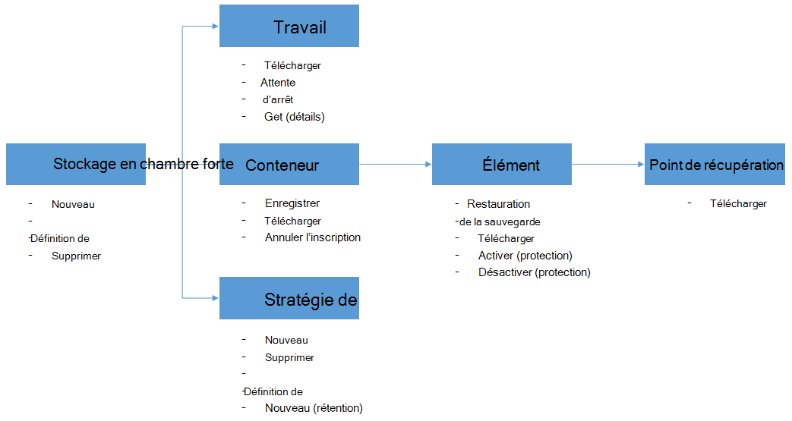

<properties
    pageTitle="Déployer et gérer la sauvegarde pour les machines virtuelles d’Azure à l’aide de PowerShell | Microsoft Azure"
    description="Apprenez à déployer et à gérer la sauvegarde Azure à l’aide de PowerShell"
    services="backup"
    documentationCenter=""
    authors="markgalioto"
    manager="cfreeman"
    editor=""/>

<tags
    ms.service="backup"
    ms.workload="storage-backup-recovery"
    ms.tgt_pltfrm="na"
    ms.devlang="na"
    ms.topic="article"
    ms.date="08/08/2016"
    ms.author="markgal;trinadhk;jimpark" />


# <a name="deploy-and-manage-backup-for-azure-vms-using-powershell"></a>Déployer et gérer la sauvegarde pour les machines virtuelles d’Azure à l’aide de PowerShell

> [AZURE.SELECTOR]
- [Gestionnaire de ressources](backup-azure-vms-automation.md)
- [Classique](backup-azure-vms-classic-automation.md)

Cet article vous montre comment utiliser Azure PowerShell pour la sauvegarde et la restauration de machines virtuelles d’Azure. Azure dispose de deux modèles de déploiement différentes pour la création et l’utilisation des ressources : le Gestionnaire de ressources et classique. Cet article traite de l’utilisation du modèle de déploiement standard. Microsoft recommande que la plupart des nouveaux déploiements utilisent le modèle de gestionnaire de ressources.

## <a name="concepts"></a>Concepts


Cet article fournit des informations sur les applets de commande PowerShell pour sauvegarder des ordinateurs virtuels. Pour obtenir des informations sur la protection des machines virtuelles d’Azure, consultez [planification de votre infrastructure de sauvegarde de machine virtuelle dans Azure](backup-azure-vms-introduction.md).

> [AZURE.NOTE] Avant de commencer, lisez les [conditions préalables](backup-azure-vms-prepare.md) requises pour travailler avec sauvegarde Azure et les [limitations](backup-azure-vms-prepare.md#limitations) de la solution de sauvegarde de machine virtuelle en cours.

Pour utiliser efficacement les PowerShell, prenez le temps de comprendre la hiérarchie d’objets et de point de départ.



Les deux flux les plus importants sont l’activation de la protection d’un ordinateur virtuel et restauration des données à partir d’un point de récupération. L’objectif de cet article est de vous aider à devenir aptes à travailler avec les applets de commande PowerShell pour activer ces deux scénarios.


## <a name="setup-and-registration"></a>Le programme d’installation et d’enregistrement
Pour commencer :

1. [Télécharger les dernière PowerShell](https://github.com/Azure/azure-powershell/releases) (version minimale requise est : 1.0.0)

2. Rechercher les applets de commande PowerShell de sauvegarde Azure disponible en tapant la commande suivante :

```
PS C:\> Get-Command *azurermbackup*

CommandType     Name                                               Version    Source
-----------     ----                                               -------    ------
Cmdlet          Backup-AzureRmBackupItem                           1.0.1      AzureRM.Backup
Cmdlet          Disable-AzureRmBackupProtection                    1.0.1      AzureRM.Backup
Cmdlet          Enable-AzureRmBackupContainerReregistration        1.0.1      AzureRM.Backup
Cmdlet          Enable-AzureRmBackupProtection                     1.0.1      AzureRM.Backup
Cmdlet          Get-AzureRmBackupContainer                         1.0.1      AzureRM.Backup
Cmdlet          Get-AzureRmBackupItem                              1.0.1      AzureRM.Backup
Cmdlet          Get-AzureRmBackupJob                               1.0.1      AzureRM.Backup
Cmdlet          Get-AzureRmBackupJobDetails                        1.0.1      AzureRM.Backup
Cmdlet          Get-AzureRmBackupProtectionPolicy                  1.0.1      AzureRM.Backup
Cmdlet          Get-AzureRmBackupRecoveryPoint                     1.0.1      AzureRM.Backup
Cmdlet          Get-AzureRmBackupVault                             1.0.1      AzureRM.Backup
Cmdlet          Get-AzureRmBackupVaultCredentials                  1.0.1      AzureRM.Backup
Cmdlet          New-AzureRmBackupProtectionPolicy                  1.0.1      AzureRM.Backup
Cmdlet          New-AzureRmBackupRetentionPolicyObject             1.0.1      AzureRM.Backup
Cmdlet          New-AzureRmBackupVault                             1.0.1      AzureRM.Backup
Cmdlet          Register-AzureRmBackupContainer                    1.0.1      AzureRM.Backup
Cmdlet          Remove-AzureRmBackupProtectionPolicy               1.0.1      AzureRM.Backup
Cmdlet          Remove-AzureRmBackupVault                          1.0.1      AzureRM.Backup
Cmdlet          Restore-AzureRmBackupItem                          1.0.1      AzureRM.Backup
Cmdlet          Set-AzureRmBackupProtectionPolicy                  1.0.1      AzureRM.Backup
Cmdlet          Set-AzureRmBackupVault                             1.0.1      AzureRM.Backup
Cmdlet          Stop-AzureRmBackupJob                              1.0.1      AzureRM.Backup
Cmdlet          Unregister-AzureRmBackupContainer                  1.0.1      AzureRM.Backup
Cmdlet          Wait-AzureRmBackupJob                              1.0.1      AzureRM.Backup
```

Les tâches de configuration et d’enregistrement suivantes peuvent être automatisés avec PowerShell :

- Créer un coffre-fort de sauvegarde
- Enregistrer les ordinateurs virtuels avec le service de sauvegarde d’Azure

### <a name="create-a-backup-vault"></a>Créer un coffre-fort de sauvegarde

> [AZURE.WARNING] Pour les clients à l’aide de la sauvegarde d’Azure pour la première fois, vous devez enregistrer le fournisseur de sauvegarde d’Azure pour être utilisé avec votre abonnement. Cela peut être effectuée en exécutant la commande suivante : « Microsoft.Backup » de Registre-AzureRmResourceProvider - ProviderNamespace

Vous pouvez créer un nouveau coffre-fort de sauvegarde à l’aide de l’applet de commande **New-AzureRmBackupVault** . Le coffre-fort de sauvegarde est une ressource ARM, vous devez le placer dans un groupe de ressources. Dans une console PowerShell d’Azure avec élévation de privilèges, exécutez les commandes suivantes :

```
PS C:\> New-AzureRmResourceGroup –Name “test-rg” –Location “West US”
PS C:\> $backupvault = New-AzureRmBackupVault –ResourceGroupName “test-rg” –Name “test-vault” –Region “West US” –Storage GeoRedundant
```

Vous pouvez obtenir une liste de tous les coffres-forts sauvegarde dans un abonnement donné à l’aide de l’applet de commande **Get-AzureRmBackupVault** .

> [AZURE.NOTE] Il est pratique de stocker l’objet de sauvegarde coffre-fort dans une variable. L’objet de la chambre forte est nécessaire en tant qu’entrée de nombreuses cmdlets de sauvegarde d’Azure.


### <a name="registering-the-vms"></a>Enregistrer les ordinateurs virtuels
La première étape de configuration de la sauvegarde avec sauvegarde Azure est à enregistrer votre ordinateur ou un ordinateur virtuel avec un coffre-fort sauvegarde Azure. L’applet de commande **Register-AzureRmBackupContainer** utilise les informations d’entrée d’un ordinateur virtuel de Azure IaaS et inscrit auprès de la chambre forte spécifiée. L’opération de Registre associe la machine virtuelle Azure le coffre-fort sauvegarde et effectue le suivi de la machine virtuelle via le cycle de vie de sauvegarde.

L’inscription de votre machine virtuelle avec le service de sauvegarde d’Azure crée un objet conteneur de niveau supérieur. Un conteneur contient en général plusieurs éléments qui peuvent être sauvegardées, mais dans le cas de machines virtuelles il y aura qu’un seul élément de sauvegarde pour le conteneur.

```
PS C:\> $registerjob = Register-AzureRmBackupContainer -Vault $backupvault -Name "testvm" -ServiceName "testvm"
```

## <a name="backup-azure-vms"></a>Sauvegarde VMs Azure

### <a name="create-a-protection-policy"></a>Créer une stratégie de protection
Il n’est pas obligatoire de créer une nouvelle stratégie de protection pour démarrer la sauvegarde de vos ordinateurs virtuels. Le coffre-fort est fourni avec un « stratégie par défaut' qui peut être utilisé pour activer la protection et ensuite modifier ultérieurement avec les informations de droite. Vous pouvez obtenir une liste des stratégies disponibles dans le coffre-fort à l’aide de l’applet de commande **Get-AzureRmBackupProtectionPolicy** :

```
PS C:\> Get-AzureRmBackupProtectionPolicy -Vault $backupvault

Name                      Type               ScheduleType       BackupTime
----                      ----               ------------       ----------
DefaultPolicy             AzureVM            Daily              26-Aug-15 12:30:00 AM
```

> [AZURE.NOTE] Le fuseau horaire du champ BackupTime dans PowerShell est UTC. Toutefois, lorsque le temps de sauvegarde est affiché dans le portail d’Azure, le fuseau horaire est aligné vers votre système local, avec l’offset UTC.

Une stratégie de sauvegarde est associée au moins une stratégie de rétention. La stratégie de rétention définit la durée pendant laquelle un point de récupération est conservé avec sauvegarde d’Azure. L’applet de commande **New-AzureRmBackupRetentionPolicy** crée les objets PowerShell contenant les informations de stratégie de rétention. Ces objets de stratégie de rétention sont utilisés comme entrées dans l’applet de commande *New-AzureRmBackupProtectionPolicy* , ou directement avec l’applet de commande *Enable-AzureRmBackupProtection* .

Une stratégie de sauvegarde définit quand et à quelle fréquence la sauvegarde d’un élément est terminée. L’applet de commande **New-AzureRmBackupProtectionPolicy** crée un objet PowerShell qui contient des informations sur la stratégie de sauvegarde. La stratégie de sauvegarde est utilisée comme entrée pour l’applet de commande *Enable-AzureRmBackupProtection* .

```
PS C:\> $Daily = New-AzureRmBackupRetentionPolicyObject -DailyRetention -Retention 30
PS C:\> $newpolicy = New-AzureRmBackupProtectionPolicy -Name DailyBackup01 -Type AzureVM -Daily -BackupTime ([datetime]"3:30 PM") -RetentionPolicy $Daily -Vault $backupvault

Name                      Type               ScheduleType       BackupTime
----                      ----               ------------       ----------
DailyBackup01             AzureVM            Daily              01-Sep-15 3:30:00 PM
```

### <a name="enable-protection"></a>Activer la protection
Activation de la protection implique deux objets - l’élément et la stratégie, et les deux doivent appartenir à la même coffre-fort. Une fois que la stratégie a été associée à l’élément, le workflow de sauvegarde démarre à la planification définie.

```
PS C:\> Get-AzureRmBackupContainer -Type AzureVM -Status Registered -Vault $backupvault | Get-AzureRmBackupItem | Enable-AzureRmBackupProtection -Policy $newpolicy
```

### <a name="initial-backup"></a>Sauvegarde initiale
La planification de sauvegarde se charge d’effectuer la copie initiale complète pour l’article et la copie incrémentielle pour les sauvegardes ultérieures. Toutefois, si vous souhaitez forcer la sauvegarde initiale se produise à un moment donné ou même immédiatement, puis utiliser l’applet de commande **Backup-AzureRmBackupItem** :

```
PS C:\> $container = Get-AzureRmBackupContainer -Vault $backupvault -Type AzureVM -Name "testvm"
PS C:\> $backupjob = Get-AzureRmBackupItem -Container $container | Backup-AzureRmBackupItem
PS C:\> $backupjob

WorkloadName    Operation       Status          StartTime              EndTime
------------    ---------       ------          ---------              -------
testvm          Backup          InProgress      01-Sep-15 12:24:01 PM  01-Jan-01 12:00:00 AM
```

> [AZURE.NOTE] Le fuseau horaire des champs StartTime et EndTime affichés dans PowerShell est UTC. Toutefois, lorsque les informations similaires sont affichées dans le portail d’Azure, le fuseau horaire est aligné à l’horloge de votre système local.

### <a name="monitoring-a-backup-job"></a>Surveillance d’une opération de sauvegarde
La plupart des opérations à long terme dans Azure sauvegarde soient reproduites en tant que tâche. Cela rend facile à suivre la progression sans avoir à maintenir le portail Azure ouvrir à tout moment.

Pour obtenir le dernier état d’un travail en cours, utilisez l’applet de commande **Get-AzureRmBackupJob** .

```
PS C:\> $joblist = Get-AzureRmBackupJob -Vault $backupvault -Status InProgress
PS C:\> $joblist[0]

WorkloadName    Operation       Status          StartTime              EndTime
------------    ---------       ------          ---------              -------
testvm          Backup          InProgress      01-Sep-15 12:24:01 PM  01-Jan-01 12:00:00 AM
```

Au lieu d’interroger ces travaux d’achèvement, ce qui est de code inutile, d’autres - il est plus simple d’utiliser l’applet de commande **Wait-AzureRmBackupJob** . Lorsqu’il est utilisé dans un script, l’applet de commande interrompt l’exécution jusqu'à la fin du travail ou la valeur de délai d’attente spécifié est atteint.

```
PS C:\> Wait-AzureRmBackupJob -Job $joblist[0] -Timeout 43200
```


## <a name="restore-an-azure-vm"></a>Restauration d’une machine virtuelle Azure

Pour restaurer les données de sauvegarde, vous devez identifier l’élément de sauvegarde et le Point de récupération qui contient les données de point-à-temps. Cette information est fournie à l’applet de commande Restore-AzureRmBackupItem pour lancer une restauration des données à partir de la chambre forte pour le compte du client.

### <a name="select-the-vm"></a>Sélectionnez la machine virtuelle

Pour obtenir l’objet PowerShell qui identifie l’élément à restaurer, vous devez démarrer à partir du conteneur dans le coffre-fort et progressez vers le bas la hiérarchie d’objets. Pour sélectionner le conteneur qui représente la machine virtuelle, utilisez l’applet de commande **Get-AzureRmBackupContainer** et du canal qui à l’applet de commande **Get-AzureRmBackupItem** .

```
PS C:\> $backupitem = Get-AzureRmBackupContainer -Vault $backupvault -Type AzureVM -name "testvm" | Get-AzureRmBackupItem
```

### <a name="choose-a-recovery-point"></a>Choisissez un point de récupération

Vous pouvez maintenant lister tous les points de récupération pour l’élément de sauvegarde à l’aide de l’applet de commande **Get-AzureRmBackupRecoveryPoint** et cliquez sur le point de récupération pour restaurer. Généralement, les utilisateurs choisir point de *AppConsistent* le plus récent dans la liste.

```
PS C:\> $rp =  Get-AzureRmBackupRecoveryPoint -Item $backupitem
PS C:\> $rp

RecoveryPointId    RecoveryPointType  RecoveryPointTime      ContainerName
---------------    -----------------  -----------------      -------------
15273496567119     AppConsistent      01-Sep-15 12:27:38 PM  iaasvmcontainer;testvm;testv...
```

La variable ```$rp``` est un tableau de points de récupération pour la sauvegarde sélectionnée article, triés dans l’ordre inverse de temps - le dernier point de reprise est à l’index 0. Pour choisir le point de récupération, utilisez l’indexation de tableau PowerShell standard. Par exemple : ```$rp[0]``` sélectionne le dernier point de récupération.

### <a name="restoring-disks"></a>Restauration de disques

Il existe une différence fondamentale entre les opérations de restauration effectuée par le biais du portail Azure et Azure PowerShell. Avec PowerShell, l’opération de restauration s’arrête à la restauration des disques et des informations de configuration du point de récupération. Il ne crée pas une machine virtuelle.

> [AZURE.WARNING] La restauration-AzureRmBackupItem ne crée pas une machine virtuelle. Il restaure uniquement les disques pour le compte de stockage spécifié. Ce n’est pas le même comportement que vous rencontrerez dans le portail Azure.

```
PS C:\> $restorejob = Restore-AzureRmBackupItem -StorageAccountName "DestAccount" -RecoveryPoint $rp[0]
PS C:\> $restorejob

WorkloadName    Operation       Status          StartTime              EndTime
------------    ---------       ------          ---------              -------
testvm          Restore         InProgress      01-Sep-15 1:14:01 PM   01-Jan-01 12:00:00 AM
```

Vous pouvez obtenir les détails de l’opération de restauration à l’aide de l’applet de commande **Get-AzureRmBackupJobDetails** une fois l’opération de restauration terminée. La propriété *ErrorDetails* contient les informations nécessaires à la reconstruction de la machine virtuelle.

```
PS C:\> $restorejob = Get-AzureRmBackupJob -Job $restorejob
PS C:\> $details = Get-AzureRmBackupJobDetails -Job $restorejob
```

### <a name="build-the-vm"></a>Créer la machine virtuelle

Création de la machine virtuelle sur les disques de restauration peut être effectuée à l’aide de l’ancienne Azure Service Gestion des applets de commande PowerShell, les nouveaux modèles d’Azure le Gestionnaire de ressources, ou encore le portail Azure. Dans un exemple rapide, nous montrerons comment y accéder à l’aide des applets de commande de gestion des services Azure.

```
 $properties  = $details.Properties

 $storageAccountName = $properties["Target Storage Account Name"]
 $containerName = $properties["Config Blob Container Name"]
 $blobName = $properties["Config Blob Name"]

 $keys = Get-AzureStorageKey -StorageAccountName $storageAccountName
 $storageAccountKey = $keys.Primary
 $storageContext = New-AzureStorageContext -StorageAccountName $storageAccountName -StorageAccountKey $storageAccountKey


 $destination_path = "C:\Users\admin\Desktop\vmconfig.xml"
 Get-AzureStorageBlobContent -Container $containerName -Blob $blobName -Destination $destination_path -Context $storageContext


$obj = [xml](((Get-Content -Path $destination_path -Encoding UniCode)).TrimEnd([char]0x00))
 $pvr = $obj.PersistentVMRole
 $os = $pvr.OSVirtualHardDisk
 $dds = $pvr.DataVirtualHardDisks
 $osDisk = Add-AzureDisk -MediaLocation $os.MediaLink -OS $os.OS -DiskName "panbhaosdisk"
 $vm = New-AzureVMConfig -Name $pvr.RoleName -InstanceSize $pvr.RoleSize -DiskName $osDisk.DiskName

 if (!($dds -eq $null))
 {
     foreach($d in $dds.DataVirtualHardDisk)
     {
         $lun = 0
         if(!($d.Lun -eq $null))
         {
             $lun = $d.Lun
         }
         $name = "panbhadataDisk" + $lun
     Add-AzureDisk -DiskName $name -MediaLocation $d.MediaLink
     $vm | Add-AzureDataDisk -Import -DiskName $name -LUN $lun
    }
}

New-AzureVM -ServiceName "panbhasample" -Location "SouthEast Asia" -VM $vm
```

Pour plus d’informations sur la création d’une machine virtuelle à partir des disques restaurés, obtenir des informations sur les applets de commande suivantes :

- [Ajouter-AzureDisk](https://msdn.microsoft.com/library/azure/dn495252.aspx)
- [Nouvelle-AzureVMConfig](https://msdn.microsoft.com/library/azure/dn495159.aspx)
- [Nouvelle-AzureVM](https://msdn.microsoft.com/library/azure/dn495254.aspx)

## <a name="code-samples"></a>Exemples de code

### <a name="1-get-the-completion-status-of-job-sub-tasks"></a>1. Obtenez l’état d’achèvement de la tâche les tâches subordonnées

Pour suivre l’état d’achèvement de sous-tâches individuelles, vous pouvez utiliser l’applet de commande **Get-AzureRmBackupJobDetails** :

```
PS C:\> $details = Get-AzureRmBackupJobDetails -JobId $backupjob.InstanceId -Vault $backupvault
PS C:\> $details.SubTasks

Name                                                        Status
----                                                        ------
Take Snapshot                                               Completed
Transfer data to Backup vault                               InProgress
```

### <a name="2-create-a-dailyweekly-report-of-backup-jobs"></a>2. création d’un rapport quotidien/hebdomadaire des tâches de sauvegarde

En général, les administrateurs souhaitent savoir ce que les tâches de sauvegarde exécutaient dans les dernières 24 heures, l’état de ces tâches de sauvegarde. En outre, la quantité de données transférées offre aux administrateurs un moyen d’estimer leur utilisation de données mensuelles. Le script ci-dessous extrait les données brutes à partir du service de sauvegarde d’Azure et affiche les informations dans la console PowerShell.

```
param(  [Parameter(Mandatory=$True,Position=1)]
        [string]$backupvaultname,

        [Parameter(Mandatory=$False,Position=2)]
        [int]$numberofdays = 7)


#Initialize variables
$DAILYBACKUPSTATS = @()
$backupvault = Get-AzureRmBackupVault -Name $backupvaultname
$enddate = ([datetime]::Today).AddDays(1)
$startdate = ([datetime]::Today)

for( $i = 1; $i -le $numberofdays; $i++ )
{
    # We query one day at a time because pulling 7 days of data might be too much
    $dailyjoblist = Get-AzureRmBackupJob -Vault $backupvault -From $startdate -To $enddate -Type AzureVM -Operation Backup
    Write-Progress -Activity "Getting job information for the last $numberofdays days" -Status "Day -$i" -PercentComplete ([int]([decimal]$i*100/$numberofdays))

    foreach( $job in $dailyjoblist )
    {
        #Extract the information for the reports
        $newstatsobj = New-Object System.Object
        $newstatsobj | Add-Member -Type NoteProperty -Name Date -Value $startdate
        $newstatsobj | Add-Member -Type NoteProperty -Name VMName -Value $job.WorkloadName
        $newstatsobj | Add-Member -Type NoteProperty -Name Duration -Value $job.Duration
        $newstatsobj | Add-Member -Type NoteProperty -Name Status -Value $job.Status

        $details = Get-AzureRmBackupJobDetails -Job $job
        $newstatsobj | Add-Member -Type NoteProperty -Name BackupSize -Value $details.Properties["Backup Size"]
        $DAILYBACKUPSTATS += $newstatsobj
    }

    $enddate = $enddate.AddDays(-1)
    $startdate = $startdate.AddDays(-1)
}

$DAILYBACKUPSTATS | Out-GridView
```

Si vous souhaitez ajouter des fonctions graphiques à cette sortie de rapport, apprenez à partir de la publication du blog TechNet [graphiques avec PowerShell](http://blogs.technet.com/b/richard_macdonald/archive/2009/04/28/3231887.aspx)

## <a name="next-steps"></a>Étapes suivantes

Si vous préférez l’utilisation de PowerShell pour collaborer avec vos ressources Azure, consultez l’article PowerShell pour protéger Windows Server, [déployer et gérer Backup de Windows Server](./backup-client-automation-classic.md). Il existe également un article PowerShell pour la gestion des sauvegardes DPM, [déployer et gérer la sauvegarde de DPM](./backup-dpm-automation-classic.md). Ces deux articles ont une version pour les déploiements du Gestionnaire de ressources, ainsi que les déploiements standard.
