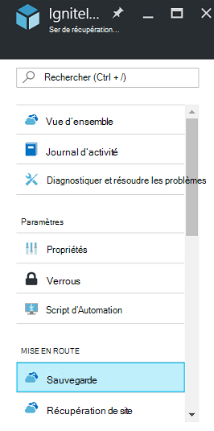
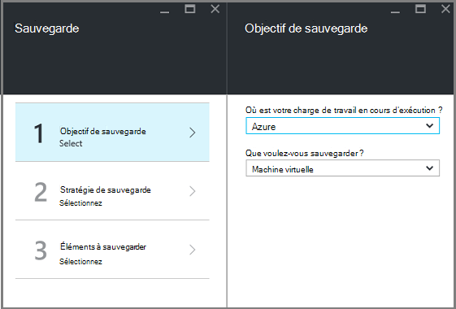
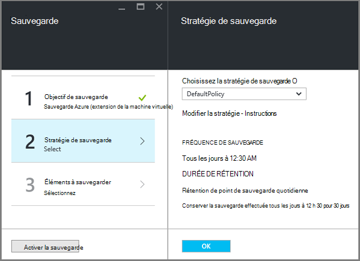
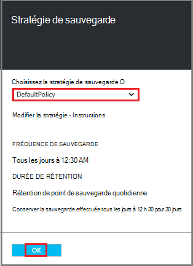
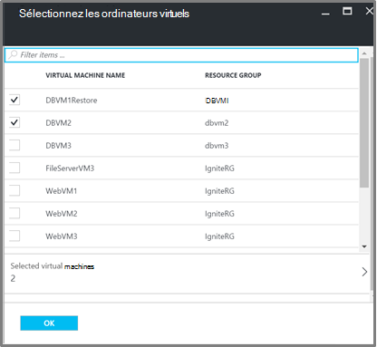
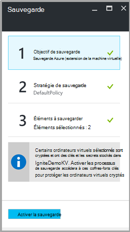

<properties
   pageTitle="Sauvegarde et restauration VMs crypté à l’aide de la sauvegarde d’Azure"
   description="Cet article traite de la sauvegarde, et expérience de restauration pour les machines virtuelles crypté à l’aide du cryptage de disque Azure."
   services="backup"
   documentationCenter=""
   authors="JPallavi"
   manager="vijayts"
   editor=""/>
<tags
   ms.service="backup"
   ms.devlang="na"
   ms.topic="article"
   ms.tgt_pltfrm="na"
   ms.workload="storage-backup-recovery"
   ms.date="10/25/2016"
   ms.author="markgal; jimpark; trinadhk"/>

# Sauvegarde et restauration VMs crypté à l’aide de la sauvegarde d’Azure

Cet article traite de la procédure pour sauvegarder et restaurer des machines virtuelles à l’aide de la sauvegarde d’Azure. Il fournit également des détails sur les scénarios pris en charge, les composants requis et les étapes de dépannage pour les cas d’erreur.

## Scénarios pris en charge

> [AZURE.NOTE]
1.  Sauvegarde et restauration d’ordinateurs virtuels cryptés est pris en charge uniquement pour les ordinateurs virtuels de gestionnaire de ressources déployées. Il n’est pas pris en charge pour les machines virtuelles de classique.  
2.  Il est pris en charge uniquement pour les machines virtuelles chiffrés à l’aide de la clé de chiffrement BitLocker et la clé de cryptage. Il n’est pas pris en charge pour les machines virtuelles chiffrés à l’aide uniquement de clé de chiffrement BitLocker.  

## Conditions préalables

1.  Machine virtuelle a été chiffré à l’aide du [Cryptage de disque Azure](../security/azure-security-disk-encryption.md). Il doit être chiffré à l’aide de la clé de chiffrement BitLocker et la clé de cryptage.
2.  Coffre-fort de services de récupération a été créé et la valeur de la réplication du stockage à l’aide des étapes mentionnées dans l’article [préparer votre environnement de sauvegarde](backup-azure-arm-vms-prepare.md).

## Sauvegarde cryptée de machine virtuelle
Utilisez les étapes suivantes pour définir l’objectif de sauvegarde, de définir une stratégie, de configurer les éléments et sauvegarde de déclencheur.

### Configurer la sauvegarde

1. Si vous avez déjà ouvert un coffre-fort de Services de récupération, passez à l’étape suivante. Si vous n’avez pas un Services de récupération de chambre forte ouvert, mais dans le portail Azure, dans le menu de concentrateur, cliquez sur **Parcourir**.

  - Dans la liste des ressources, tapez **Les Services de récupération**.
  - Comme vous commencez à taper, les filtres de la liste en fonction de votre entrée. Lorsque vous consultez les **Services de récupération des coffres-forts**, cliquez dessus.
  
        

    La liste des Services de récupération des coffres-forts s’affiche. Dans la liste des Services de récupération des coffres-forts, sélectionner un coffre-fort.

    Le tableau de bord de coffre-fort sélectionné s’ouvre.

2. À partir de la liste des éléments qui s’affiche sous vault, cliquez sur **sauvegarde** pour ouvrir la lame de sauvegarde.

       
    
3. Sur la lame de sauvegarde, cliquez sur l' **objectif de sauvegarde** pour ouvrir la lame de l’objectif de la sauvegarde.

       
    
4.   Sur la blade d’objectif de sauvegarde, définir **où votre charge de travail s’exécute** sur Azure et **que voulez-vous sauvegarder** sur l’ordinateur virtuel, puis cliquez sur **OK**.

    La lame de l’objectif de sauvegarde se ferme et la lame de stratégie de sauvegarde s’ouvre.

       

5. Sur la lame de stratégie de sauvegarde, sélectionnez la stratégie de sauvegarde que vous souhaitez appliquer à la chambre forte et cliquez sur **OK**.

       

    Les détails de la stratégie par défaut sont répertoriés dans les détails. Si vous souhaitez créer une stratégie, sélectionnez **Créer un nouveau** dans le menu déroulant. Une fois que vous cliquez sur **OK**, la stratégie de sauvegarde est associée à la chambre forte.

    Choisissez ensuite les ordinateurs virtuels à associer à la chambre forte.
    
6. Choisissez les ordinateurs virtuels cryptés à associer à la stratégie spécifiée et cliquez sur **OK**.

      
   
7. Cette page affiche un message concernant le coffre-fort clé associé aux ordinateurs virtuels cryptés sélectionnés. Service de sauvegarde nécessite un accès en lecture seule pour les clés et les secrets dans la chambre forte de clé. Il utilise ces autorisations pour la clé de sauvegarde et un code secret, ainsi que les ordinateurs virtuels associés. 

      

      Maintenant que vous avez défini tous les paramètres pour le coffre-fort, la lame de sauvegarde, cliquez sur Activer la sauvegarde en bas de la page. Active la sauvegarde déploie la stratégie à la chambre forte et les ordinateurs virtuels.

8. La phase suivante de préparation est l’installation de l’Agent de la machine virtuelle ou assurant l’Agent de l’ordinateur virtuel n’est installé. Pour effectuer la même opération, suivez les étapes mentionnées dans l’article [préparer votre environnement de sauvegarde](backup-azure-arm-vms-prepare.md). 

### Déclenchement du travail de sauvegarde
Utilisez les étapes mentionnées dans l’article [Sauvegarde Azure VM, coffre-fort de services de récupération](backup-azure-arm-vms.md) de sauvegarde de déclencheur.

## Restaurer la machine virtuelle cryptée
Expérience de restauration pour les ordinateurs virtuels cryptés et non cryptés est le même. Les étapes mentionnées dans la [restauration des machines virtuelles dans Azure portal](backup-azure-arm-restore-vms.md) permet de restaurer l’ordinateur virtuel crypté. Dans le cas où vous devez restaurer les clés et les secrets, vous devez vous assurer que coffre-fort clé pour les restaurer doit déjà exister.

## Résolution des erreurs

| Opération | Détails de l’erreur | Résolution |
| -------- | -------- | -------|
| Sauvegarde | Échec de la validation, que l’ordinateur virtuel est chiffré avec BEK uniquement. Les sauvegardes peuvent être activées uniquement pour les machines virtuelles cryptés avec à la fois BEK et KEK. | Machine virtuelle doivent être chiffrée à l’aide de BEK et KEK. Après cela, la sauvegarde doit être activé. |
| Restauration | Vous ne pouvez pas restaurer cette machine virtuelle cryptée depuis le coffre-fort de clé associé à cet ordinateur virtuel n’existe pas. | Créer un coffre-fort de clé à l’aide de la [Mise en route de la chambre forte de clé Azure](../key-vault/key-vault-get-started.md). Reportez-vous à l’article [restaurer le secret à l’aide de la sauvegarde d’Azure et la clé de la clé de coffre-fort](backup-azure-restore-key-secret.md) pour restaurer le secret et la clé s’ils ne sont pas présents. |
| Restauration | Vous ne pouvez pas restaurer cette machine virtuelle cryptée depuis secret associé à cet ordinateur virtuel et la clé n’existent pas. | Reportez-vous à l’article [restaurer le secret à l’aide de la sauvegarde d’Azure et la clé de la clé de coffre-fort](backup-azure-restore-key-secret.md) pour restaurer le secret et la clé s’ils ne sont pas présents. |
