<properties
    pageTitle="Tout d’abord rechercher : protéger Azure VM à un coffre-fort de services de récupération | Microsoft Azure"
    description="Protéger Azure VM à un coffre-fort de services de récupération. Utiliser les sauvegardes de déployés par le Gestionnaire de ressources des VM, déployés par le standard de machines virtuelles et machines virtuelles de stockage Premium pour protéger vos données. Créez et enregistrez un coffre-fort de services de récupération. Enregistrer les ordinateurs virtuels, créer des stratégies et protéger les ordinateurs virtuels dans Azure."
    services="backup"
    documentationCenter=""
    authors="markgalioto"
    manager="cfreeman"
    editor=""
    keyword="backups; vm backup"/>

<tags
    ms.service="backup"
    ms.workload="storage-backup-recovery"
    ms.tgt_pltfrm="na"
    ms.devlang="na"
    ms.topic="hero-article"
    ms.date="10/13/2016"
    ms.author="markgal; jimpark"/>

# Tout d’abord rechercher : protéger Azure VM à un coffre-fort de services de récupération

> [AZURE.SELECTOR]
- [Protéger les ordinateurs virtuels avec un coffre-fort de services de récupération](backup-azure-vms-first-look-arm.md)
- [Protéger les ordinateurs virtuels avec un coffre-fort de sauvegarde](backup-azure-vms-first-look.md)

Ce didacticiel passe en revue les étapes de la création d’un coffre-fort de services de récupération et de sauvegarde d’une machine virtuelle Azure (VM). Protéger les coffres-forts des services de récupération :

- Azure VM de déployés par le Gestionnaire de ressources
- Ordinateurs virtuels classiques
- Machines virtuelles de stockage standard
- Stockage de prime VMs
- Ordinateurs virtuels cryptés avec le chiffrement de disque Azure, BEK et KEK

Pour plus d’informations sur la protection du stockage de prime ordinateurs virtuels, voir [sauvegarder et restaurer les ordinateurs virtuels de stockage de la prime](backup-introduction-to-azure-backup.md#back-up-and-restore-premium-storage-vms)

>[AZURE.NOTE] Ce didacticiel suppose que vous disposez déjà d’un ordinateur virtuel dans votre abonnement Azure et que vous avez pris des mesures pour permettre au service de sauvegarde d’accéder à la machine virtuelle.

[AZURE.INCLUDE [learn-about-Azure-Backup-deployment-models](../../includes/backup-deployment-models.md)]

À un niveau élevé, voici les étapes que vous allez effectuer.  

1. Créer un coffre-fort de services de récupération pour un ordinateur virtuel.
2. Le portail Azure permet de sélectionner un scénario, définir une stratégie et identifier les éléments à protéger.
3. Exécuter la sauvegarde initiale.

## Créer un coffre-fort de services de récupération pour un ordinateur virtuel

Un coffre-fort de services de récupération est une entité qui stocke toutes les sauvegardes et les points de récupération qui ont été créées au fil du temps. Le coffre-fort de services de récupération contient également la stratégie de sauvegarde appliquée aux ordinateurs virtuels protégés.

>[AZURE.NOTE] Sauvegarde d’ordinateurs virtuels est un processus local. Vous ne pouvez pas sauvegarder ordinateurs virtuels à partir d’un emplacement à un coffre-fort de services de restauration dans un autre emplacement. Ainsi, pour chaque emplacement Azure qui a des machines virtuelles à sauvegarder, coffre-fort de services de récupération au moins doit exister à cet emplacement.

Pour créer un coffre-fort de services de récupération :

1. Connectez-vous au [portail Azure](https://portal.azure.com/).

2. Dans le menu Hub, cliquez sur **Parcourir** , puis dans la liste des ressources, tapez **Les Services de récupération**. Comme vous commencez à taper, les filtres de la liste en fonction de votre entrée. Cliquez sur **Services de récupération de coffre-fort**.

    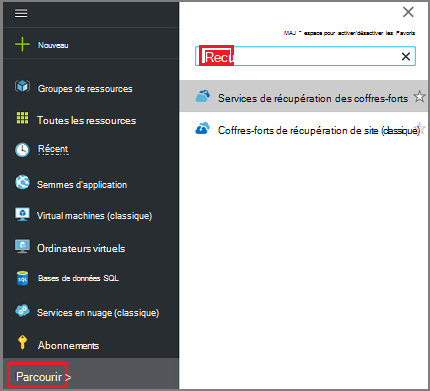  

    La liste des coffres-forts des services de récupération sont affichés.

3. Dans le menu des **Services de récupération des coffres-forts** , cliquez sur **Ajouter**.

    

    La lame de coffre-fort de Services de restauration s’ouvre, vous invitant à fournir un **nom**, un **abonnement**, un **groupe de ressources**et un **emplacement**.

    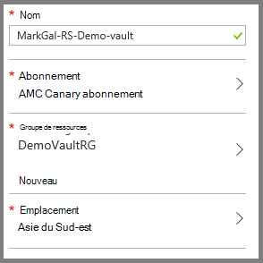

4. Pour **nom**, entrez un nom convivial pour identifier le coffre-fort. Le nom doit être unique pour l’abonnement Azure. Tapez un nom qui contient entre 2 et 50 caractères. Il doit commencer par une lettre et peut contenir uniquement des lettres, des chiffres et des traits d’union.

5. Cliquez sur l' **abonnement** pour visualiser la liste des abonnements disponibles. Si vous n’êtes pas sûr de l’abonnement à utiliser, utilisez la valeur par défaut (ou suggéré) abonnement. Il existe plusieurs choix uniquement si votre organisation compte est associé à plusieurs abonnements Azure.

6. Cliquez sur le **groupe de ressources** pour afficher la liste des groupes de ressources disponibles, ou cliquez sur **Nouveau** pour créer un groupe de ressources. Pour plus d’informations sur les groupes de ressources, consultez [vue d’ensemble du Gestionnaire de ressources Azure](../azure-resource-manager/resource-group-overview.md)

7. Cliquez sur l' **emplacement** pour sélectionner la zone géographique pour la chambre forte. Le coffre-fort **doit** être dans la même région que les ordinateurs virtuels que vous souhaitez protéger.

    >[AZURE.IMPORTANT] Si vous ne connaissez pas l’emplacement dans lequel se trouve votre ordinateur virtuel, fermez la boîte de dialogue de création de coffre-fort et accédez à la liste des ordinateurs virtuels dans le portail. Si vous avez des ordinateurs virtuels dans plusieurs régions, créer un coffre-fort de services de récupération de chaque région. Créer le coffre-fort dans le premier emplacement avant de passer à l’emplacement suivant. Il est inutile de spécifier les comptes de stockage pour stocker les données de sauvegarde--le coffre-fort de services de récupération et le service de sauvegarde Azure gèrent cette option automatiquement.

8. Cliquez sur **créer**. Elle peut prendre du temps pour le coffre-fort de services de récupération doit être créé. Surveiller les notifications d’état dans l’angle supérieur droit du portail. Une fois votre coffre-fort est créé, il apparaît dans la liste des coffres-forts des services de récupération.

    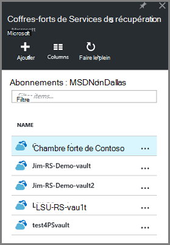

Maintenant que vous avez créé votre coffre-fort, découvrez comment définir la réplication du stockage.

### Définir la réplication du stockage

L’option de réplication de stockage vous permet de choisir entre le stockage redondant geo et stockage redondant localement. Par défaut, votre coffre-fort a stockage redondant geo. Conservez l’option définie vers le stockage redondant geo si c’est votre sauvegarde principale. Choisissez le stockage redondant localement si vous souhaitez une option économique qui n’est pas aussi durable. En savoir plus sur [géo-redondants](../storage/storage-redundancy.md#geo-redundant-storage) et des options de stockage [redondants localement](../storage/storage-redundancy.md#locally-redundant-storage) dans la [vue d’ensemble de la réplication de stockage Azure](../storage/storage-redundancy.md).

Pour modifier le paramètre de réplication du stockage :

1. Sélectionnez votre coffre-fort pour ouvrir le tableau de bord en chambre forte et la lame de paramètres. Si la lame de **paramètres** ne s’ouvre pas, cliquez sur **tous les paramètres** dans le tableau de bord de coffre-fort.

2. Sur la lame de **paramètres** , cliquez sur **l’Infrastructure de sauvegarde** > de**Configuration de sauvegarde** pour ouvrir la lame de la **Configuration de la sauvegarde** . Sur la lame de la **Configuration de la sauvegarde** , choisissez l’option de réplication de stockage pour Password vault.

    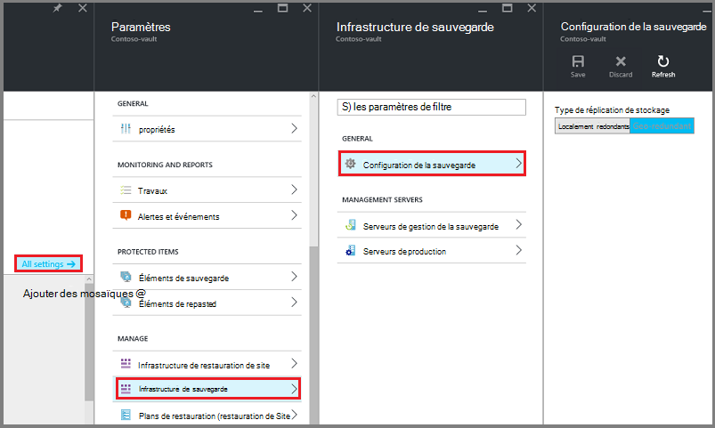

    Après avoir choisi l’option de stockage pour Password vault, vous êtes prêt à associer de la machine virtuelle à la chambre forte. Pour commencer l’association, vous devez découvrir et enregistrer les ordinateurs virtuels Azure.

## Sélectionnez un objectif de sauvegarde, de définir la stratégie et de définir les éléments à protéger

Avant d’enregistrer un ordinateur virtuel à un coffre-fort, exécuter le processus de découverte pour vous assurer que les nouveaux ordinateurs virtuels qui ont été ajoutés à l’abonnement sont identifiés. Les traitement des requêtes Azure pour obtenir la liste des ordinateurs virtuels de l’abonnement, ainsi que des informations supplémentaires telles que le nom de service de cloud et de la région. Dans le portail Azure, scénario fait référence à ce que vous allez placer dans le coffre-fort de services de récupération. La stratégie est la planification de la fréquence et à quel moment les points de récupération sont prises. La stratégie inclut également la durée de rétention pour les points de récupération.

1. Si vous avez déjà un coffre-fort ouvrir les services de récupération, passez à l’étape 2. Si vous ne disposez pas d’une récupération services vault ouvert, mais sont sur le portail Azure, dans le menu de concentrateur, cliquez sur **Parcourir**.

  - Dans la liste des ressources, tapez **Les Services de récupération**.
  - Comme vous commencez à taper, les filtres de la liste en fonction de votre entrée. Lorsque vous consultez les **Services de récupération des coffres-forts**, cliquez dessus.

      

    La liste des coffres-forts des services de récupération s’affiche.
  - Dans la liste des coffres-forts de services de restauration, sélectionnez un coffre-fort.

    Le tableau de bord de coffre-fort sélectionné s’ouvre.

    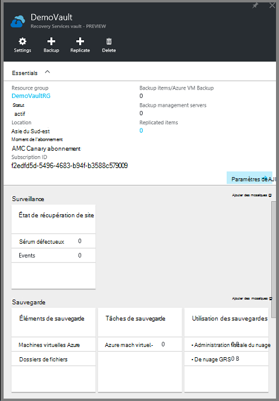

2. Dans le menu Tableau de bord de coffre-fort, cliquez sur **sauvegarde** pour ouvrir la lame de sauvegarde.

    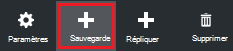

    L’ouverture de la lame, le service de sauvegarde recherche les nouveaux ordinateurs virtuels dans l’abonnement.

    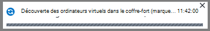

3. Sur la lame de sauvegarde, cliquez sur l' **objectif de sauvegarde** pour ouvrir la lame de l’objectif de la sauvegarde.

    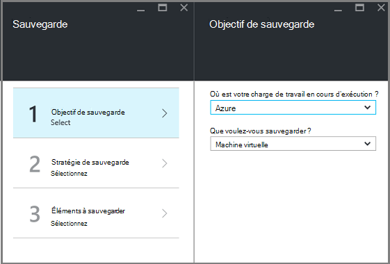

4. Sur la blade d’objectif de sauvegarde, définir **où votre charge de travail s’exécute** sur Azure et **que voulez-vous sauvegarder** sur l’ordinateur virtuel, puis cliquez sur **OK**.

    La lame de l’objectif de sauvegarde se ferme et la lame de stratégie de sauvegarde s’ouvre.

    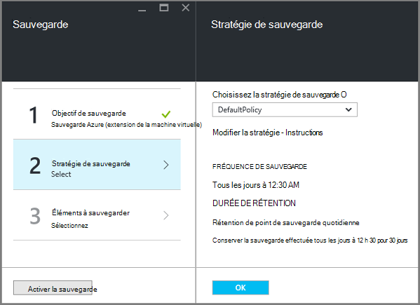

5. Sur la lame de stratégie de sauvegarde, sélectionnez la stratégie de sauvegarde que vous souhaitez appliquer à la chambre forte et cliquez sur **OK**.

    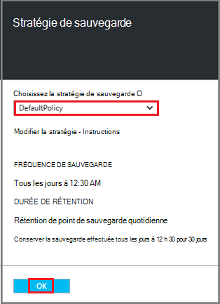

    Les détails de la stratégie par défaut sont répertoriés dans les détails. Si vous souhaitez créer une stratégie, sélectionnez **Créer un nouveau** dans le menu déroulant. Le menu déroulant fournit également une option permettant de basculer de l’heure lorsque l’instantané est pris, à 7 h. Pour obtenir des instructions sur la définition d’une stratégie de sauvegarde, consultez [définition d’une stratégie de sauvegarde](backup-azure-vms-first-look-arm.md#defining-a-backup-policy). Une fois que vous cliquez sur **OK**, la stratégie de sauvegarde est associée à la chambre forte.

    Choisissez ensuite les ordinateurs virtuels à associer à la chambre forte.

6. Choisissez les ordinateurs virtuels à associer à la stratégie spécifiée et cliquez sur **Sélectionner**.

    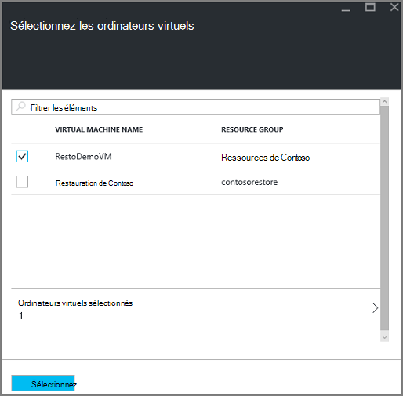

    Si vous ne voyez pas l’ordinateur virtuel souhaité, vérifiez qu’il existe dans le même emplacement Azure comme le coffre-fort de Services de récupération.

7. Maintenant que vous avez défini tous les paramètres pour le coffre-fort, la lame de sauvegarde, cliquez sur **Activer la sauvegarde** en bas de la page. La stratégie est déployée pour le coffre-fort et les ordinateurs virtuels.

    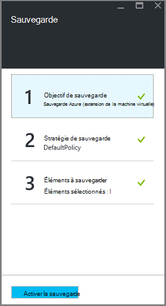

## Sauvegarde initiale

Une fois une stratégie de sauvegarde qui a été déployée sur l’ordinateur virtuel, ce qui ne signifie pas que les données a été sauvegardées. Par défaut, la première sauvegarde planifiée (tel que défini dans la stratégie de sauvegarde) est la sauvegarde initiale. Jusqu'à ce que la sauvegarde initiale se produit, le dernier état de sauvegarde sur la lame de **Travaux de sauvegarde** s’affiche sous forme **d’Avertissement (en attente de sauvegarde initiale)**.

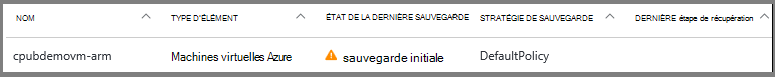

À moins que votre sauvegarde initiale est dû commencer plus tôt, il est recommandé d’exécuter **Sauvegarder maintenant**.

Pour exécuter la **sauvegarde maintenant**:

1. Sur le tableau de bord coffre-fort dans la fenêtre **sauvegarde** , cliquez sur **ordinateurs virtuels Azure**  
    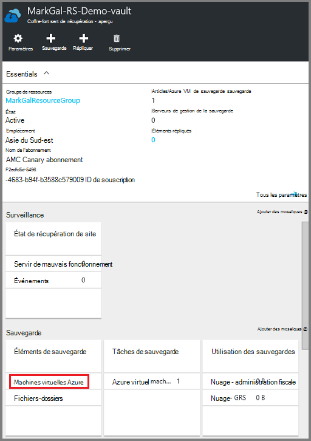

    La blade **d’Éléments de sauvegarde** s’ouvre.

2. Sur la blade **d’Éléments de sauvegarde** , avec le bouton droit de la chambre forte que vous souhaitez sauvegarder, puis cliquez sur **Sauvegarder maintenant**.

    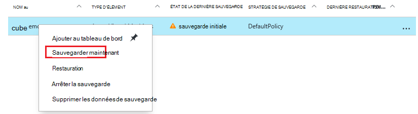

    L’opération de sauvegarde est déclenchée.  

    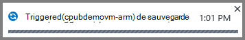

3. Pour que votre sauvegarde initiale est terminée, sur le tableau de bord coffre-fort dans la fenêtre des **Tâches de sauvegarde** , cliquez sur **les machines virtuelles Azure**.

    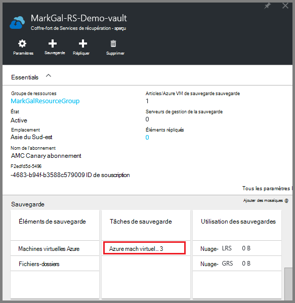

    La lame de travaux de sauvegarde s’ouvre.

4. Dans la lame de travaux de sauvegarde, vous pouvez voir l’état de toutes les tâches.

    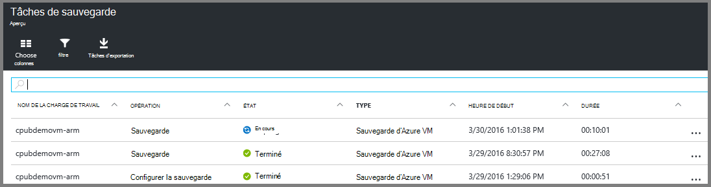

    >[AZURE.NOTE] Dans le cadre de l’opération de sauvegarde, le service de sauvegarde Azure émet une commande pour l’extension de sauvegarde dans chaque machine virtuelle pour vider toutes les écritures et prendre un instantané cohérent.

    Lorsque la sauvegarde est terminée, le statut est *terminé*.

[AZURE.INCLUDE [backup-create-backup-policy-for-vm](../../includes/backup-create-backup-policy-for-vm.md)]

## Installer l’Agent de l’ordinateur virtuel sur l’ordinateur virtuel

Ces informations sont fournies au cas où il est nécessaire. L’Agent de la machine virtuelle Azure doit être installé sur l’ordinateur virtuel Azure pour l’extension de la sauvegarde à utiliser. Toutefois, si votre ordinateur virtuel a été créé à partir de la galerie d’Azure, puis l’Agent de la machine virtuelle est déjà présent sur l’ordinateur virtuel. Ordinateurs virtuels qui sont migrés à partir de centres de données sur site ne serait pas l’Agent de la machine virtuelle installé. Dans ce cas, l’Agent de la machine virtuelle doit être installé. Si vous rencontrez des problèmes de la sauvegarde de la machine virtuelle d’Azure, vérifiez que l’Agent de la machine virtuelle Azure est correctement installé sur l’ordinateur virtuel (voir le tableau ci-dessous). Si vous créez un ordinateur virtuel personnalisé, [Assurez-vous que la case à cocher **installer l’Agent de la machine virtuelle** est sélectionnée](../virtual-machines/virtual-machines-windows-classic-agents-and-extensions.md) avant de l’ordinateur virtuel est en service.

Obtenir des informations sur [l’Agent de la machine virtuelle](https://go.microsoft.com/fwLink/?LinkID=390493&clcid=0x409) et [comment l’installer](../virtual-machines/virtual-machines-windows-classic-manage-extensions.md).

Le tableau suivant fournit des informations supplémentaires sur la machine virtuelle l’Agent pour Windows et des ordinateurs virtuels de Linux.

| **Opération** | **Windows** | **Linux** |
| --- | --- | --- |
| Installation de l’Agent de la machine virtuelle | <li>Téléchargez et installez l' [agent MSI](http://go.microsoft.com/fwlink/?LinkID=394789&clcid=0x409). Vous avez besoin des privilèges d’administrateur pour terminer l’installation. <li>[Mise à jour de la propriété de la machine virtuelle](http://blogs.msdn.com/b/mast/archive/2014/04/08/install-the-vm-agent-on-an-existing-azure-vm.aspx) pour indiquer que l’agent est installé. | <li> Installez dernier [agent de Linux](https://github.com/Azure/WALinuxAgent) à partir de GitHub. Vous avez besoin des privilèges d’administrateur pour terminer l’installation. <li> [Mise à jour de la propriété de la machine virtuelle](http://blogs.msdn.com/b/mast/archive/2014/04/08/install-the-vm-agent-on-an-existing-azure-vm.aspx) pour indiquer que l’agent est installé. |
| Mise à jour de l’Agent de la machine virtuelle | Mise à jour de l’Agent de la machine virtuelle est aussi simple que de réinstaller les [binaires de l’Agent de la machine virtuelle](http://go.microsoft.com/fwlink/?LinkID=394789&clcid=0x409).  Assurez-vous qu’aucune opération de sauvegarde n’est en cours d’exécution alors que l’agent de l’ordinateur virtuel est en cours de mise à jour. | Suivez les instructions sur la [mise à jour de l’Agent de la machine virtuelle Linux ](../virtual-machines-linux-update-agent.md).  Assurez-vous qu’aucune opération de sauvegarde n’est en cours d’exécution alors que l’Agent de l’ordinateur virtuel est en cours de mise à jour. |
| Validation de l’installation de l’Agent de la machine virtuelle | <li>Naviguez jusqu’au dossier *C:\WindowsAzure\Packages* de l’ordinateur virtuel d’Azure. <li>Vous devriez trouver le fichier WaAppAgent.exe.<li> Cliquez droit sur le fichier, cliquez sur **Propriétés**et puis sélectionnez l’onglet **Détails** . Le champ Version du produit doit être 2.6.1198.718 ou version ultérieure. | N/A |

### Extension de la sauvegarde

Une fois que l’Agent de l’ordinateur virtuel est installé sur l’ordinateur virtuel, le service de sauvegarde Azure installe l’extension de sauvegarde à l’Agent de la machine virtuelle. Le service de sauvegarde Azure en toute transparence mises à niveau et correctifs de l’extension de sauvegarde sans intervention de l’utilisateur supplémentaires.

L’extension de sauvegarde est installée par le service de sauvegarde si la machine virtuelle est en cours d’exécution. Une machine virtuelle en cours d’exécution fournit le plus grand risque d’obtenir un point de reprise cohérents au niveau de l’application. Toutefois, le service de sauvegarde d’Azure continue à sauvegarder l’ordinateur virtuel même si elle est désactivée et que l’extension n’a pas pu être installée. Il s’agit en tant que machine virtuelle d’en mode hors connexion. Dans ce cas, le point de récupération seront *sur incident cohérent*.

## Des informations de dépannage
Si vous avez des problèmes d’accomplir certaines tâches dans cet article, consultez les [conseils de dépannage](backup-azure-vms-troubleshoot.md).

## Tarification
Sauvegarde de machine virtuelle Azure sera débitée basé sur un modèle de protection des Instances. Pour en savoir plus sur la [Tarification de la sauvegarde](https://azure.microsoft.com/pricing/details/backup/)

## Questions ?
Si vous avez des questions, ou s’il existe une fonctionnalité que vous souhaitez voir inclus, [nous envoyer vos commentaires](http://aka.ms/azurebackup_feedback).
