<properties
    pageTitle="Premier aperçu : Protéger Azure VM à un coffre-fort sauvegarde | Microsoft Azure"
    description="Chambre forte de sauvegarde pour protéger Azure VM. Didacticiel explique le coffre-fort avec création, enregistrer les ordinateurs virtuels, créer des stratégies et protéger les ordinateurs virtuels dans Azure."
    services="backup"
    documentationCenter=""
    authors="markgalioto"
    manager="cfreeman"
    editor=""/>

<tags
    ms.service="backup"
    ms.workload="storage-backup-recovery"
    ms.tgt_pltfrm="na"
    ms.devlang="na"
    ms.topic="hero-article"
    ms.date="09/15/2016"
    ms.author="markgal; jimpark"/>

# Tout d’abord rechercher : sauvegarde des machines virtuelles Azure

> [AZURE.SELECTOR]
- [Protéger les ordinateurs virtuels avec un coffre-fort de services de récupération](backup-azure-vms-first-look-arm.md)
- [Protéger Azure VM à un coffre-fort de sauvegarde](backup-azure-vms-first-look.md)

Ce didacticiel vous amène à travers les étapes de sauvegarde d’une machine virtuelle Azure (VM) à un coffre-fort sauvegarde dans Azure. Cet article décrit le modèle classique ou le modèle de déploiement de Service Manager, pour la sauvegarde des machines virtuelles. Si vous êtes intéressé par une copie de sauvegarde d’un ordinateur virtuel dans un coffre-fort de Services de récupération qui appartient à un groupe de ressources, reportez-vous à la section [tout d’abord rechercher : protéger les machines virtuelles à un coffre-fort de services de restauration](backup-azure-vms-first-look-arm.md). Pour pouvoir suivre correctement ce didacticiel, ces conditions préalables doivent être remplies :

- Vous avez créé un ordinateur virtuel dans votre abonnement Azure.
- La machine virtuelle dispose d’une connectivité à des adresses IP publiques Azure. Pour plus d’informations, consultez [la connectivité réseau](./backup-azure-vms-prepare.md#network-connectivity).

Pour sauvegarder une machine virtuelle, il existe cinq étapes principales :  

 créer un coffre-fort de sauvegarde ou d’identifier un coffre-fort de sauvegarde existant.  
 le portail Azure classique permet de découvrir et enregistrer les ordinateurs virtuels.  
 installer l’Agent de la machine virtuelle.  
 crée la stratégie pour protéger les ordinateurs virtuels.  
 exécuter la sauvegarde.

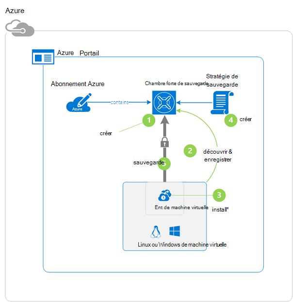

>[AZURE.NOTE] Azure dispose de deux modèles de déploiement pour la création et l’utilisation des ressources : [le Gestionnaire de ressources et classique](../resource-manager-deployment-model.md). Ce didacticiel est à utiliser avec les ordinateurs virtuels qui peuvent être créés dans le portail Azure classique. Le service de sauvegarde d’Azure prend en charge le Gestionnaire de ressources sur des ordinateurs virtuels. Pour plus d’informations sur la sauvegarde des machines virtuelles à un coffre-fort de services de restauration, reportez-vous à la section [First Look : protéger les machines virtuelles à un coffre-fort de services de restauration](backup-azure-vms-first-look-arm.md).

## Étape 1 - créer un coffre-fort de sauvegarde pour un ordinateur virtuel

Un coffre-fort de sauvegarde est une entité qui stocke toutes les sauvegardes et les points de récupération qui ont été créées au fil du temps. Le coffre-fort de sauvegarde contient également les stratégies de sauvegarde qui sont appliqués aux ordinateurs virtuels en cours de sauvegarde.

1. Connectez-vous au [portail Azure classique](http://manage.windowsazure.com/).

2. Dans le coin inférieur gauche du portail Azure, cliquez sur **Nouveau**

    

3. Dans l’Assistant de création rapide, cliquez sur **Services de données** > **Services de récupération de** > **Sauvegarde coffre-fort** > **Création rapide**.

    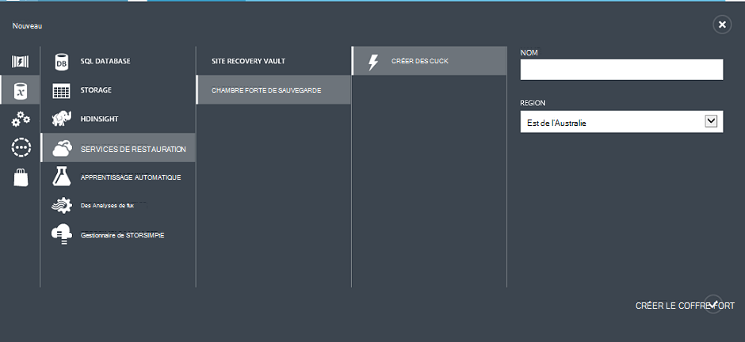

    L’Assistant vous demande le **nom** et la **région**. Si vous administrez plusieurs abonnements, une boîte de dialogue permettant de choisir l’abonnement s’affiche.

4. Pour **nom**, entrez un nom convivial pour identifier le coffre-fort. Le nom doit être unique pour l’abonnement Azure.

5. Dans la **zone**, sélectionnez la zone géographique pour la chambre forte. Le coffre-fort **doit** être dans la même région que les ordinateurs virtuels qu’il protège.

    Si vous ne connaissez pas la zone dans laquelle se trouve votre ordinateur virtuel, fermez cet Assistant et sur les **ordinateurs virtuels** dans la liste des services Azure. La colonne emplacement fournit le nom de la région. Si vous avez des ordinateurs virtuels dans plusieurs régions, créer un coffre-fort de sauvegarde dans chaque région.

6. S’il n’existe aucune boîte de dialogue **d’abonnement** de l’Assistant, passez à l’étape suivante. Si vous travaillez avec plusieurs abonnements, sélectionnez un abonnement pour associer le nouveau coffre-fort de sauvegarde.

    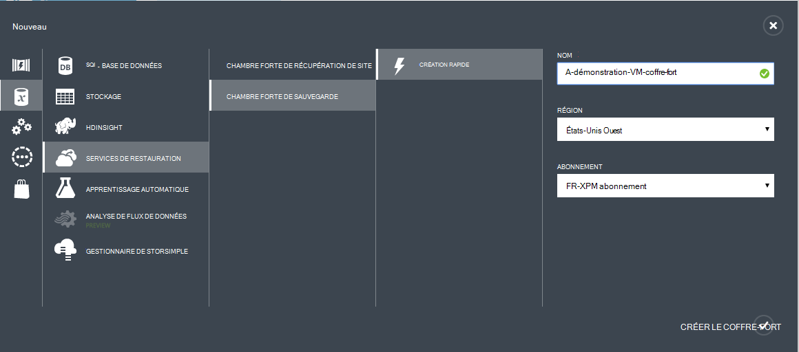

7. Cliquez sur **créer un coffre-fort**. Elle peut prendre du temps pour le coffre-fort de sauvegarde à créer. Surveiller les notifications d’état au bas du portail.

    

    Un message confirme que la chambre forte a été créée avec succès. Il est répertorié dans la page **services de récupération** comme **Active**.

    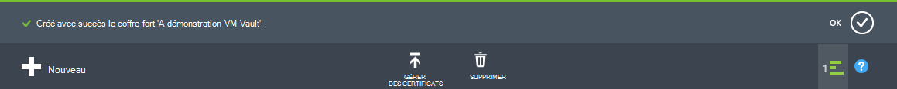

8. Dans la liste des coffres-forts sur la page des **Services de restauration** , sélectionnez le coffre-fort que vous avez créé pour lancer la page de **Démarrage rapide** .

    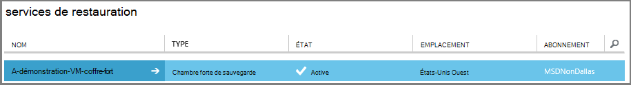

9. Dans la page de **Démarrage rapide** , cliquez sur **configurer** pour ouvrir l’option de réplication du stockage.
    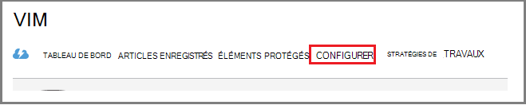

10. L’option de **réplication du stockage** , choisissez l’option de réplication pour Password vault.

    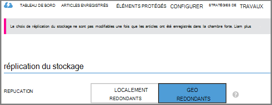

    Par défaut, votre coffre-fort a stockage redondant geo. Choisissez le stockage redondant géo si c’est votre sauvegarde principale. Choisissez le stockage redondant localement si vous souhaitez une option économique qui n’est pas tout à fait aussi durable. Apprenez-en plus sur les options de stockage redondant geo et localement redondants dans la [vue d’ensemble de la réplication de stockage Azure](../storage/storage-redundancy.md).

Après avoir choisi l’option de stockage pour Password vault, vous êtes prêt à associer de la machine virtuelle à la chambre forte. Pour commencer l’association, de découvrir et d’enregistrer les ordinateurs virtuels Azure.

## Étape 2 - découvrir et ordinateurs virtuels Azure d’enregistrer
Avant d’enregistrer l’ordinateur virtuel à un coffre-fort, exécuter le processus de découverte pour identifier les nouvelles machines virtuelles. Ceci renvoie une liste des ordinateurs virtuels dans l’abonnement, ainsi que des informations supplémentaires telles que le nom de service de cloud et de la région.

1. Connectez-vous au [portail Azure classique](http://manage.windowsazure.com/)

2. Dans le portail Azure classique, cliquez sur **Services de récupération** pour ouvrir la liste des Services de récupération des coffres-forts.
    

3. Dans la liste des coffres-forts, sélectionnez le coffre-fort pour sauvegarder un ordinateur virtuel.

    Lorsque vous sélectionnez votre coffre-fort, il s’ouvre dans la page de **Démarrage rapide**

4. À partir du menu de coffre-fort, cliquez sur **Les éléments enregistrés**.

    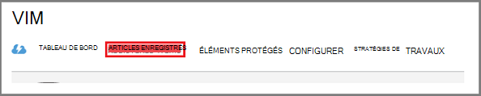

5. Dans le menu **Type** , sélectionnez **une Machine virtuelle Azure**.

    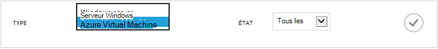

6. Cliquez sur **DISCOVER** au bas de la page.
    

    Le processus de découverte peut prendre quelques minutes pendant que les ordinateurs virtuels sont en cours sous forme de tableau. Il existe une notification au bas de l’écran qui vous permet de savoir que le processus est en cours d’exécution.

    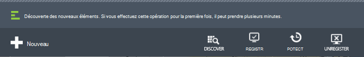

    Les modifications de notification lorsque le processus est terminé.

    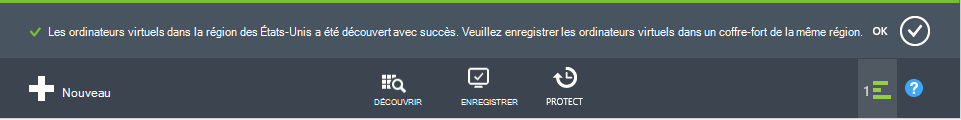

7. Cliquez sur **Enregistrer** en bas de la page.
    

8. Dans le menu contextuel **Enregistrer les éléments** , sélectionnez les ordinateurs virtuels que vous souhaitez enregistrer.

    >[AZURE.TIP] Plusieurs machines virtuelles peuvent être inscrits en même temps.

    Une tâche est créée pour chaque ordinateur virtuel que vous avez sélectionné.

9. Dans la notification pour accéder à la page **tâches** , cliquez sur **Afficher la tâche** .

    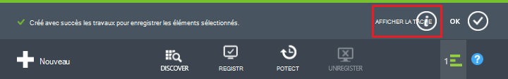

    La machine virtuelle s’affiche également dans la liste des éléments inscrits, ainsi que l’état de l’opération d’enregistrement.

    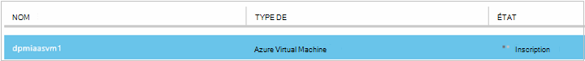

    Lorsque l’opération est terminée, l’état change pour refléter l’état *enregistré* .

    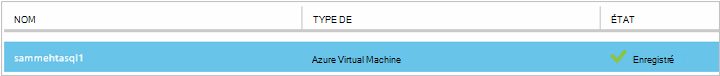

## Étape 3 : installer l’Agent de l’ordinateur virtuel sur l’ordinateur virtuel

L’Agent de la machine virtuelle Azure doit être installé sur l’ordinateur virtuel Azure pour l’extension de la sauvegarde à utiliser. Si votre ordinateur virtuel a été créé à partir de la galerie d’Azure, l’Agent de la machine virtuelle est déjà présent sur l’ordinateur virtuel. Vous pouvez passer à la [protection de vos ordinateurs virtuels](backup-azure-vms-first-look.md#step-4-protect-azure-virtual-machines).

Si votre ordinateur virtuel migré à partir d’un centre de données sur site, la machine virtuelle probablement n’a pas installé l’Agent de machine virtuelle. Vous devez installer l’Agent de la machine virtuelle sur l’ordinateur virtuel avant de procéder à la protection de la machine virtuelle. Pour obtenir des instructions détaillées sur l’installation de l’Agent de la machine virtuelle, reportez-vous à la [section Agent de la machine virtuelle de l’article de machines virtuelles de sauvegarde](backup-azure-vms-prepare.md#vm-agent).

## Étape 4 - créer la stratégie de sauvegarde
Avant de déclencher l’opération de sauvegarde initiale, définissez la planification lorsque les clichés instantanés de sauvegarde sont effectuées. La planification de clichés instantanés de sauvegarde sont prises, et la durée pendant laquelle les snapshots sont conservés, est la stratégie de sauvegarde. Les informations de rétention sont basées sur un modèle de rotation des sauvegardes Grandfather-father-son.

1. Naviguer dans le coffre-fort de sauvegarde sous **Les Services de récupération** dans le portail Azure classique, puis cliquez sur **Les éléments enregistrés**.
2. Dans le menu déroulant, sélectionnez **Azure Virtual Machine** .

    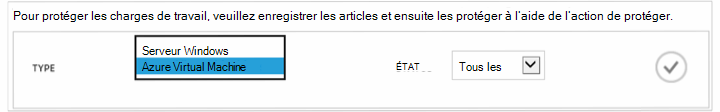

3. Cliquez sur **protéger** au bas de la page.
    

    L' **Assistant de protéger des éléments** s’affiche et répertorie *uniquement* les ordinateurs virtuels qui sont enregistrés et non protégés.

    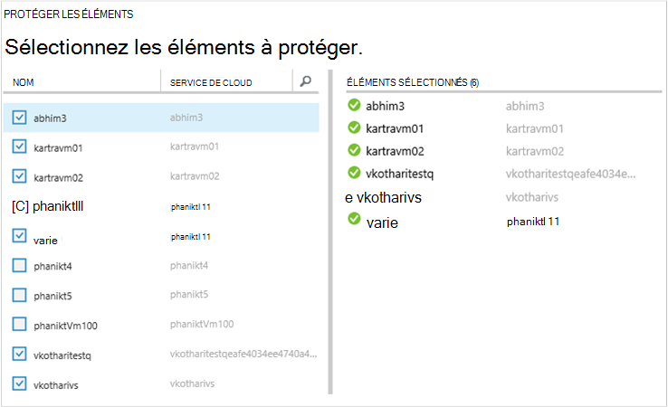

4. Sélectionnez les ordinateurs virtuels que vous souhaitez protéger.

    S’il y a deux ou plusieurs machines virtuelles portant le même nom, utilisez le Service en nuage pour faire la distinction entre les machines virtuelles.

5. Dans le menu **protection de configurer** , sélectionnez une stratégie existante ou créer une nouvelle stratégie pour protéger les ordinateurs virtuels que vous avez identifié.

    Nouveau coffres-forts de sauvegarde ont une stratégie par défaut associée à la chambre forte. Cette stratégie prend un quotidiennement chaque soir de capture instantanée et l’instantané quotidien est conservé pendant 30 jours. Chaque stratégie de sauvegarde peut avoir plusieurs machines virtuelles qui lui est associés. Toutefois, l’ordinateur virtuel peut être uniquement associé à une seule stratégie à la fois.

    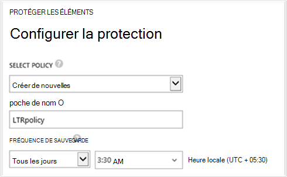

    >[AZURE.NOTE] Une stratégie de sauvegarde inclut un jeu de rétention pour les sauvegardes planifiées. Si vous sélectionnez une stratégie de sauvegarde existante, vous ne pourrez pas modifier les options de conservation de l’étape suivante.

6. Sur la **Durée de rétention** définissent la portée quotidienne, hebdomadaire, mensuelle et annuelle pour les points de sauvegarde spécifiques.

    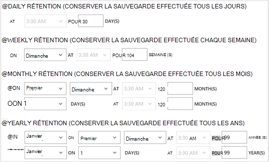

    Stratégie de rétention spécifie la longueur de la durée pour le stockage d’une sauvegarde. Vous pouvez spécifier des règles de rétention différentes selon la date de la sauvegarde est effectuée.

7. Cliquez sur **tâches** pour afficher la liste des tâches de **Configuration de Protection** .

    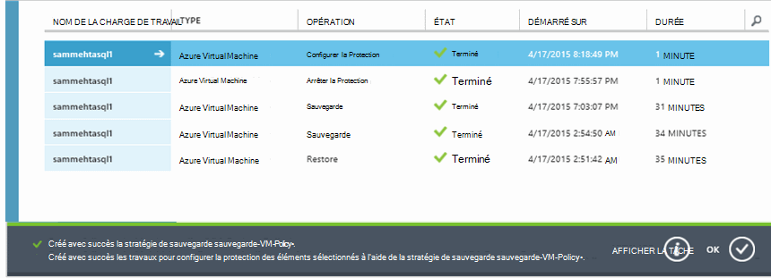

    Maintenant que vous avez créé la stratégie, passez à l’étape suivante et exécutez la sauvegarde initiale.

## Étape 5 - sauvegarde de Initial

Une fois qu’une machine virtuelle a été protégée par une stratégie, vous pouvez afficher cette relation sous l’onglet **Éléments de protection** . Jusqu'à ce que la sauvegarde initiale se produit, l' **État de Protection** s’affiche en tant que **Protected - (en attente de sauvegarde initiale)**. Par défaut, la première sauvegarde planifiée est la *sauvegarde initiale*.

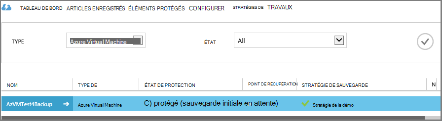

Pour démarrer la sauvegarde initiale maintenant :

1. Sur la page **Protégée des éléments** , cliquez sur **Sauvegarder maintenant** en bas de la page.
    

    Le service de sauvegarde Azure crée un travail de sauvegarde pour l’opération de sauvegarde initiale.

2. Cliquez sur l’onglet **tâches** pour afficher la liste des tâches.

    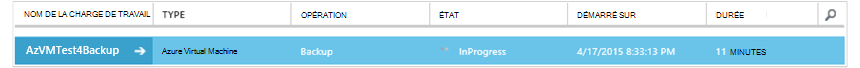

    Lors de la sauvegarde initiale est terminée, l’état de la machine virtuelle dans l’onglet **Éléments de protection** est *protégé*.

    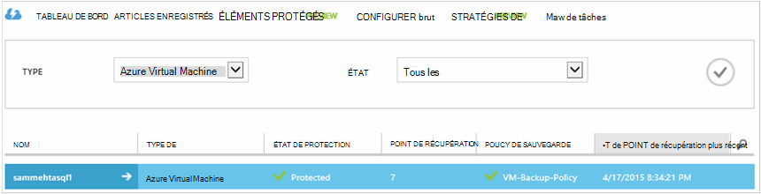

    >[AZURE.NOTE] La sauvegarde des machines virtuelles est un processus local. Vous ne pouvez pas sauvegarder des ordinateurs virtuels à partir d’une région dans un coffre-fort de sauvegarde dans une autre région. Ainsi, pour chaque région Azure a des ordinateurs virtuels qui doivent être sauvegardées, au moins un coffre-fort de sauvegarde doit être créé dans cette région.

## Étapes suivantes
Maintenant que vous avez sauvegardé une machine virtuelle, il y a plusieurs étapes qui pourraient présenter un intérêt. La plus logique consiste à vous familiariser avec la restauration des données sur une machine virtuelle. Toutefois, il existe des tâches de gestion qui vous aideront à comprendre comment assurer la sécurité de vos données et réduire les coûts.

- [Gérer et analyser vos machines virtuelles](backup-azure-manage-vms.md)
- [Restaurer des machines virtuelles](backup-azure-restore-vms.md)
- [Guide de dépannage](backup-azure-vms-troubleshoot.md)

## Questions ?
Si vous avez des questions, ou s’il existe une fonctionnalité que vous souhaitez voir inclus, [nous envoyer vos commentaires](http://aka.ms/azurebackup_feedback).
