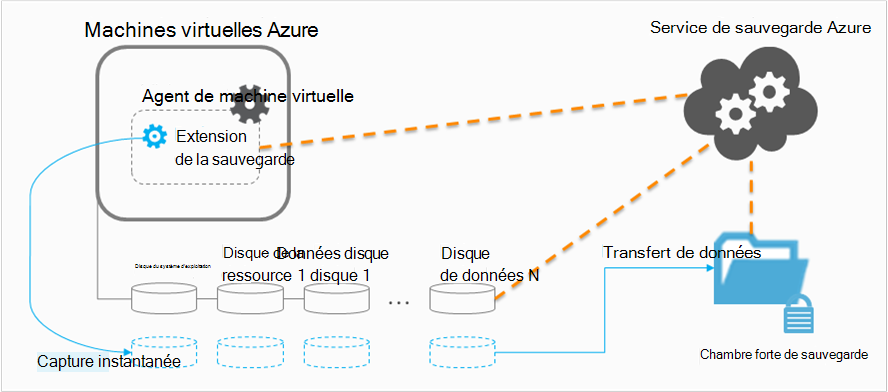

<properties
    pageTitle="Planification de votre infrastructure de sauvegarde de machine virtuelle dans Azure | Microsoft Azure"
    description="Considérations importantes lors de la planification sauvegarder des ordinateurs virtuels dans Azure"
    services="backup"
    documentationCenter=""
    authors="markgalioto"
    manager="cfreeman"
    editor=""
    keywords="sauvegarde des machines virtuelles, de sauvegarder des ordinateurs virtuels"/>

<tags
    ms.service="backup"
    ms.workload="storage-backup-recovery"
    ms.tgt_pltfrm="na"
    ms.devlang="na"
    ms.topic="article"
    ms.date="10/19/2016"
    ms.author="trinadhk; jimpark; markgal;"/>

# <a name="plan-your-vm-backup-infrastructure-in-azure"></a>Planifier votre infrastructure de sauvegarde de machine virtuelle dans Azure
Cet article fournit des performances et des suggestions de ressources pour vous aider à planifier votre infrastructure de sauvegarde de machine virtuelle. Il définit également les aspects clés du service de sauvegarde ; Ces aspects peuvent être essentiels dans la définition de votre architecture, planifier la capacité et la planification. Si vous avez [préparé votre environnement](backup-azure-vms-prepare.md), ceci est l’étape suivante avant de commencer [aux machines virtuelles de sauvegarde](backup-azure-vms.md). Si vous avez besoin de plus d’informations sur les machines virtuelles Azure, consultez la [documentation de Machines virtuelles](https://azure.microsoft.com/documentation/services/virtual-machines/).

## <a name="how-does-azure-back-up-virtual-machines"></a>Fonctionnement sur Azure sauvegarder des machines virtuelles ?
Lorsque le service de sauvegarde Azure lance une opération de sauvegarde à l’heure planifiée, il déclenche l’extension sauvegarde pour prendre un instantané de point-à-temps. Cet instantané en coordination avec le Service Volume Shadow Copy (VSS) pour obtenir un instantané cohérent des disques sur l’ordinateur virtuel sans avoir à arrêter.

Une fois l’instantané est pris, les données sont transférées par le service de sauvegarde Azure dans le coffre-fort de sauvegarde. Pour rendre le processus de sauvegarde plus efficace, le service identifie et transfère uniquement les blocs de données qui ont été modifiés depuis la dernière sauvegarde.



Lorsque le transfert de données est terminé, le snapshot est supprimé et un point de restauration est créé.

### <a name="data-consistency"></a>Cohérence des données
Sauvegarde et restauration d’entreprise des données critiques sont compliquées par le fait que les données critiques doivent être sauvegardées pendant les applications qui produisent les données sont en cours d’exécution. Pour contourner ce problème, Azure sauvegarde fournit des sauvegardes cohérentes avec les applications pour les charges de travail Microsoft afin de garantir que les données sont correctement écrites au stockage à l’aide de VSS.

>[AZURE.NOTE] Pour les machines virtuelles de Linux, uniquement des sauvegardes cohérentes avec le fichier sont possibles, comme Linux n’a pas une plate-forme équivalente à VSS.

Sauvegarde Azure prend des sauvegardes complètes de VSS sur Windows VM (pour en savoir plus à propos de la [sauvegarde complète VSS](http://blogs.technet.com/b/filecab/archive/2008/05/21/what-is-the-difference-between-vss-full-backup-and-vss-copy-backup-in-windows-server-2008.aspx)). Pour activer les sauvegardes VSS, le dessous du Registre clé doit être définie sur l’ordinateur virtuel.

```
[HKEY_LOCAL_MACHINE\SOFTWARE\MICROSOFT\BCDRAGENT]
"USEVSSCOPYBACKUP"="TRUE"
```


Ce tableau décrit les types de la cohérence et les conditions qu’ils se produisent sous Azure VM lors de la sauvegarde et les procédures de restauration.

| Cohérence | Basés sur VSS | Explication et détails |
|-------------|-----------|---------|
| Cohérence des applications | Oui | C’est le type de cohérence idéal pour les charges de travail Microsoft qu’il garantit que :<ol><li> L’ordinateur virtuel *démarre*. <li>Il n’est *pas corrompu*. <li>Il est *sans perte de données*.<li> Les données sont cohérentes à l’application qui utilise les données, en impliquant l’application au moment de la sauvegarde, à l’aide de VSS.</ol> La plupart des charges de travail de Microsoft ont les enregistreurs VSS qui effectuent des actions spécifiques à la charge de travail qui sont liées à la cohérence des données. Par exemple, Microsoft SQL Server a un enregistreur VSS qui permet de s’assurer que l’écriture sur le fichier journal des transactions et la base de données est effectuées correctement.<br><br> Pour Azure VM des sauvegardes, l’obtention d’un point de reprise cohérents au niveau de l’application signifie que l’extension de sauvegarde n’a pas pu appeler le workflow VSS et terminer *correctement* avant la prise de l’instantané d’ordinateur virtuel. Naturellement, cela signifie que les enregistreurs VSS de toutes les applications de l’ordinateur virtuel d’Azure ont été appelés ainsi.<br><br>(Pour apprendre les [Notions de base de VSS](http://blogs.technet.com/b/josebda/archive/2007/10/10/the-basics-of-the-volume-shadow-copy-service-vss.aspx) et plonger dans les détails de [son fonctionnement](https://technet.microsoft.com/library/cc785914%28v=ws.10%29.aspx)). |
| Cohérence du système de fichiers | Oui, pour les ordinateurs Windows | Il existe deux scénarios où le point de récupération peut être de *système de fichiers cohérente*:<ul><li>Sauvegardes de machines virtuelles de Linux dans Azure, Linux n’ayant pas une plate-forme équivalente à VSS.<li>Échec VSS lors de la sauvegarde pour les machines virtuelles de Windows dans Azure.</li></ul> Dans ces deux cas, le meilleur possible est pour vous assurer que : <ol><li> L’ordinateur virtuel *démarre*. <li>Il n’est *pas corrompu*.<li>Il est *sans perte de données*.</ol> Les applications doivent implémenter leur propre mécanisme de « fix-up » sur les données restaurées.|
| Cohérence d’incident | N° | Cette situation est équivalente à une machine virtuelle rencontre un « incident » (via une réinitialisation matérielle ou logicielle). Cela se produit généralement lorsque l’ordinateur virtuel Azure est arrêté au moment de la sauvegarde. Pour Azure VM des sauvegardes, l’obtention d’un moyen de point de récupération cohérent après sinistre cette sauvegarde Azure ne donne aucune garantie autour de la cohérence des données sur le support de stockage, du point de vue du système d’exploitation ou du point de vue de l’application. Seules les données qui existent déjà sur le disque au moment de la sauvegarde sont ce qui capture et sauvegardé. <br/> <br/> Bien qu’il n’existe aucune garantie, dans la plupart des cas, le système d’exploitation démarre. Ceci est généralement suivi d’une procédure de vérification du disque, comme chkdsk, pour corriger les erreurs de corruption. Les données en mémoire ou les écritures qui n’ont pas été complètement vidées sur le disque seront perdues. L’application suit généralement avec son propre mécanisme de vérification en cas de restauration de données doit être effectuée. <br><br>Par exemple, si le journal des transactions comporte des entrées qui ne sont pas présentes dans la base de données, puis le logiciel de base de données effectue une annulation jusqu'à ce que les données sont cohérentes. Lorsque les données sont réparties sur plusieurs disques virtuels (comme les volumes fractionnés), un point de récupération cohérent après sinistre ne fournit aucune garantie quant à l’exactitude des données.|


## <a name="performance-and-resource-utilization"></a>Utilisation des ressources et des performances
Comme le logiciel de sauvegarde qui est déployée sur site, vous devez prévoir de la capacité et l’utilisation des ressources besoins lors de la sauvegarde d’ordinateurs virtuels dans Azure. Les [limites de stockage Azure](azure-subscription-service-limits.md#storage-limits) définissent la structure des déploiements d’ordinateurs virtuels pour optimiser les performances avec un impact minimum sur les charges de travail en cours d’exécution.

Faites attention à la limite de stockage Azure suivante lors de la planification des performances de sauvegarde :

- Sortie max par compte de stockage
- Taux de demande totale par compte de stockage

### <a name="storage-account-limits"></a>Limites de stockage de compte
Chaque fois que les données de sauvegarde sont copiées à partir d’un compte de stockage, il compte pour les opérations d’entrées/sorties par seconde (IOPS) et sortant (ou débit) métriques du compte de stockage. En même temps, les ordinateurs virtuels sont en cours d’exécution et utilisation des e/s et un débit. L’objectif est d’assurer que le trafic total - sauvegarde et virtual machine - ne dépasse pas les limites de compte de stockage.

### <a name="number-of-disks"></a>Nombre de disques
Le processus de sauvegarde tente d’effectuer une opération de sauvegarde aussi rapidement que possible. Ce faisant, il consomme autant de ressources que possible. Cependant, toutes les opérations d’e/s sont limitées par le *Débit cible de Blob unique*, qui a une limite de 60 Mo par seconde. Dans le but d’optimiser la vitesse, le processus de sauvegarde tente de sauvegarder chaque *en parallèle*l’option les disques de la machine virtuelle. Ainsi, si un ordinateur virtuel équipé de quatre disques, Azure sauvegarde essaie alors de sauvegarder tous les quatre disques en parallèle. De ce fait, le facteur déterminant pour le trafic de sauvegarde quitter un compte de stockage client est le **nombre de disques** sauvegardées à partir du compte de stockage.

### <a name="backup-schedule"></a>Planification de la sauvegarde
Un facteur supplémentaire qui influe sur les performances est la **planification de la sauvegarde**. Si vous configurez les stratégies pour tous les ordinateurs virtuels sont sauvegardés en même temps, vous avez planifié un bourrage du trafic. Le processus de sauvegarde tente de sauvegarder tous les disques en parallèle. Une façon de réduire le trafic de sauvegarde à partir d’un compte de stockage - s’assurer que différents ordinateurs virtuels sont sauvegardés à différents moments de la journée, sans chevauchement.

## <a name="capacity-planning"></a>Planification de la capacité
Mise en place de tous ces facteurs signifie que l’utilisation du stockage compte doit être planifiée correctement. Télécharger la [machine virtuelle de capacités de sauvegarde planification feuille de calcul Excel](https://gallery.technet.microsoft.com/Azure-Backup-Storage-a46d7e33) pour observer l’impact de votre disque et de planification de la sauvegarde.

### <a name="backup-throughput"></a>Débit de sauvegarde
Pour chaque disque en cours de sauvegarde, sauvegarde Azure lit les blocs sur le disque et stocke uniquement les données modifiées (sauvegarde incrémentielle). Ce tableau indique les valeurs de débit moyen que vous pouvez vous attendre à partir de la sauvegarde d’Azure. À l’aide de cela, vous pouvez estimer la quantité de temps nécessaire pour sauvegarder un disque d’une taille donnée.

| Opération de sauvegarde | Meilleur débit |
| ---------------- | ---------- |
| Sauvegarde initiale | Mbits/160 s |
| Sauvegarde incrémentielle (DR) | Mbits/640 s <br><br> Ce débit peut déposer considérablement si il y a beaucoup de bidon dispersé sur le disque qui doit être sauvegardé. |

## <a name="total-vm-backup-time"></a>Total temps de sauvegarde de machine virtuelle
La majorité du temps de sauvegarde est passé de lecture et de copie des données, il existe des autres opérations qui contribuent à la durée totale nécessaire pour sauvegarder un ordinateur virtuel :

- Temps nécessaire à [l’installation ou la mise à jour de l’extension de sauvegarde](backup-azure-vms.md#offline-vms).
- Heure de la capture instantanée, qui est le temps nécessaire pour déclencher une capture instantanée. Les snapshots sont déclenchées près de l’heure de la sauvegarde planifiée.
- Temps d’attente de file d’attente. Dans la mesure où le service de sauvegarde traite les sauvegardes à partir de plusieurs clients, la copie des données de sauvegarde à partir de la capture instantanée pour la sauvegarde ou de la chambre forte de Services de récupération ne peut pas démarrer immédiatement. En cas de pics de charge, l’attente peut étirer jusqu'à 8 heures en raison du nombre de sauvegardes en cours de traitement. Toutefois, la durée de sauvegarde de machine virtuelle totale sera moins de 24 heures pour les stratégies de sauvegarde quotidiennes.

## <a name="best-practices"></a>Meilleures pratiques
Nous vous suggérons de ces pratiques lors de la configuration des sauvegardes de machines virtuelles :

- Ne pas planifier plus de quatre VMs classiques à partir du même service de nuage à sauvegarder en même temps. Nous vous suggérons l’échelonnement des heures de démarrage d’une heure si vous souhaitez sauvegarder plusieurs ordinateurs virtuels à partir du même service de cloud.
- Ne planifiez pas plus de 40 ordinateurs virtuels déployés par le Gestionnaire de ressources à sauvegarder en même temps.
- Planifier des sauvegardes de machines virtuelles pendant les heures creuses afin que le service de sauvegarde utilise des Ops ES/s pour transférer des données à partir du compte de stockage du client pour la sauvegarde ou de Services de récupération de chambre forte.
- Assurez-vous qu’une stratégie adresses VMs répartis sur les comptes de stockage différents. Nous vous recommandons de pas plus de 20 disques total d’un compte de stockage unique protégés par une stratégie. Si vous avez plus de 20 disques dans un compte de stockage, répartir ces machines virtuelles sur plusieurs stratégies pour obtenir l’Ops ES/s requis lors de la phase de transfert du processus de sauvegarde.
- Ne restaurez pas une machine virtuelle en cours d’exécution sur le stockage de la prime au même compte de stockage. Si le processus de restauration coïncide avec l’opération de sauvegarde, il réduit les e/s disponibles pour la sauvegarde.
- Nous vous recommandons de chaque machine virtuelle de prime en cours d’exécution sur un compte de stockage distinct de prime pour garantir les performances de sauvegarde optimales.

## <a name="data-encryption"></a>Cryptage des données

Sauvegarde Azure ne crypte pas les données dans le cadre du processus de sauvegarde. Toutefois, vous pouvez crypter les données au sein de la machine virtuelle et sauvegarder en toute transparence des données protégées (pour en savoir plus sur la [sauvegarde des données cryptées](backup-azure-vms-encryption.md)).


## <a name="how-are-protected-instances-calculated"></a>Comment sont calculés les instances protégés ?
Azure ordinateurs virtuels qui sont sauvegardés par la sauvegarde d’Azure sont soumis à la [tarification de sauvegarde d’Azure](https://azure.microsoft.com/pricing/details/backup/). Le calcul de la protection des Instances est basé sur la taille *réelle* de la machine virtuelle, qui correspond à la somme de toutes les données dans l’ordinateur virtuel, en excluant le « disque de ressource ».

Vous êtes *pas* facturé en fonction de la taille maximale prise en charge pour chaque disque de données lié à la machine virtuelle, mais sur les données réelles stockées dans le disque de données. De même, la nomenclature de stockage de sauvegarde dépend de la quantité de données qui sont stockées avec la sauvegarde Azure, qui est la somme des données réelles sur chaque point de récupération.

Par exemple, prennent un ordinateur virtuel Standard A2 taille qui a deux disques de données supplémentaires avec une taille maximale de 1 To. Le tableau ci-dessous donne les données réelles stockées sur chacun de ces disques :

|Type de disque|Taille maximale|Données réelles présentes|
|---------|--------|------|
| Disque du système d’exploitation | 1023 GO | 17 GO |
| Disque local / disque de la ressource | 135 GO | 5 Go (non inclus pour la sauvegarde) |
| Disque de données 1 | 1023 GO | 30 GO |
| Disque de données 2 | 1023 GO | 0 GO |

Dans ce cas, la taille *réelle* de la machine virtuelle est 17 Go + 30 Go + 0 = 47 go. Cela devient la taille protégé une Instance basée sur la facture mensuelle. À mesure que la quantité de données dans l’ordinateur virtuel augmente, la taille d’Instance de protégé utilisée pour la facturation également changent en conséquence.

Facturation ne démarre pas tant que la première sauvegarde est terminée. À ce stade, la facturation, de stockage et de protection des Instances commencera. Facturation se poursuit tant qu’il existe *des données de sauvegarde stockées avec Azure sauvegarde* pour l’ordinateur virtuel. L’opération d’arrêter la Protection ne s’arrête pas la facturation si les données de sauvegarde sont conservées.

La facturation pour une machine virtuelle spécifiée n’existera uniquement si la protection est arrêté *et* les données de sauvegarde sont supprimées. Lorsqu’il n’y a aucune tâche de sauvegarde active (lorsque la protection a été arrêtée), la taille de l’ordinateur virtuel au moment de la dernière sauvegarde réussie devient la taille protégé une Instance basée sur la facture mensuelle.

## <a name="questions"></a>Questions ?
Si vous avez des questions, ou s’il existe une fonctionnalité que vous souhaitez voir inclus, [nous envoyer vos commentaires](http://aka.ms/azurebackup_feedback).

## <a name="next-steps"></a>Étapes suivantes

- [Sauvegarder des ordinateurs virtuels](backup-azure-vms.md)
- [Gérer la sauvegarde des machines virtuelles](backup-azure-manage-vms.md)
- [Restaurer des machines virtuelles](backup-azure-restore-vms.md)
- [Résoudre les problèmes de sauvegarde de machine virtuelle](backup-azure-vms-troubleshoot.md)
