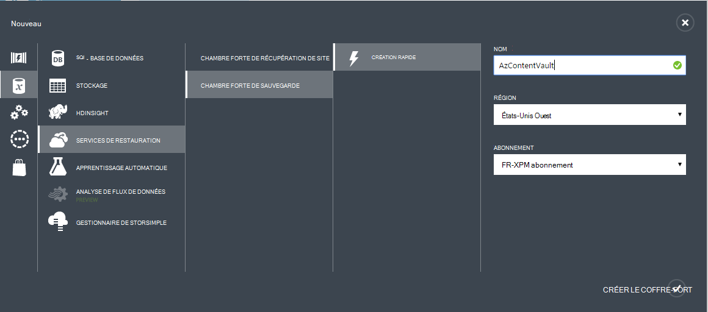
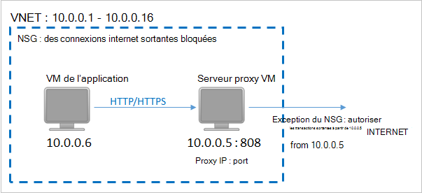
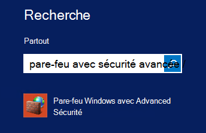

<properties
    pageTitle="Préparation de votre environnement à sauvegarder des ordinateurs virtuels Azure | Microsoft Azure"
    description="Assurez-vous que votre environnement est prêt pour la sauvegarde des machines virtuelles dans Azure"
    services="backup"
    documentationCenter=""
    authors="markgalioto"
    manager="cfreeman"
    editor=""
    keywords="sauvegardes ; procédure de sauvegarde ;"/>

<tags
    ms.service="backup"
    ms.workload="storage-backup-recovery"
    ms.tgt_pltfrm="na"
    ms.devlang="na"
    ms.topic="article"
    ms.date="08/26/2016"
    ms.author="trinadhk; jimpark; markgal;"/>


# <a name="prepare-your-environment-to-back-up-azure-virtual-machines"></a>Préparer votre environnement à sauvegarder des ordinateurs virtuels Azure

> [AZURE.SELECTOR]
- [Modèle de gestionnaire de ressources](backup-azure-arm-vms-prepare.md)
- [Modèle classique](backup-azure-vms-prepare.md)

Avant de sauvegarder une machine virtuelle Azure (VM), il existe trois conditions qui doivent exister.

- Vous devez créer un coffre-fort de sauvegarde ou d’identifier un existant sauvegarde coffre-fort *dans la même région que votre machine virtuelle*.
- Établir la connectivité réseau entre les adresses Internet publiques Azure et les points de terminaison du stockage Azure.
- Installer l’agent de l’ordinateur virtuel sur l’ordinateur virtuel.

Si vous connaissez que ces conditions existent déjà dans votre environnement puis passez à [sauvegarder votre article de machines virtuelles](backup-azure-vms.md). Dans le cas contraire, lecture, cet article va vous guider les étapes pour préparer votre environnement à sauvegarder une machine virtuelle d’Azure.


## <a name="limitations-when-backing-up-and-restoring-a-vm"></a>Limitations lors de la sauvegarde et la restauration d’une machine virtuelle

>[AZURE.NOTE] Azure dispose de deux modèles de déploiement pour la création et l’utilisation des ressources : [le Gestionnaire de ressources et classique](../resource-manager-deployment-model.md). La liste suivante présente les limitations lors du déploiement dans le modèle classique.

- La sauvegarde des machines virtuelles avec plus de 16 disques de données n’est pas pris en charge.
- La sauvegarde des machines virtuelles avec une adresse IP réservée et aucun point de terminaison défini n’est pas pris en charge.
- Les données de sauvegarde n’incluent pas les lecteurs de réseau monté attachés à la machine virtuelle. 
- Remplacement d’un ordinateur virtuel existant lors de la restauration n’est pas pris en charge. Tout d’abord supprimer l’ordinateur virtuel et tous les disques associés et puis restaurer les données à partir de la sauvegarde.
- Région entre sauvegarde et restauration n’est pas pris en charge.
- La sauvegarde des machines virtuelles à l’aide du service de sauvegarde d’Azure est pris en charge dans toutes les zones publiques d’Azure (voir [liste de contrôle](https://azure.microsoft.com/regions/#services) des régions pris en charge). Si la zone que vous recherchez est non pris en charge aujourd'hui, il apparaîtra pas dans la liste déroulante lors de la création du coffre-fort.
- La sauvegarde des machines virtuelles à l’aide du service de sauvegarde d’Azure est pris en charge uniquement pour les versions du système d’exploitation select :
  - **Linux**: sauvegarde Azure prend en charge [une liste de distribution qui est visé par Azure](../virtual-machines/virtual-machines-linux-endorsed-distros.md) , à l’exception du noyau du système d’exploitation Linux. Autres distributions de mettre-Your-propriétaire-Linux peuvent également fonctionner tant que l’agent de l’ordinateur virtuel est disponible sur l’ordinateur virtuel et prend en charge les pour Python existe.
  - **Windows Server**: les Versions antérieures à Windows Server 2008 R2 ne sont pas pris en charge.
- Restauration d’un contrôleur de domaine VM (DC) qui fait partie d’une configuration multi-DC est pris en charge uniquement par le biais de PowerShell. Plus d’informations sur la [restauration d’un contrôleur de domaine multi-DC](backup-azure-restore-vms.md#restoring-domain-controller-vms).
- Restauration d’ordinateurs virtuels ayant les configurations de réseau spécial suivant est pris en charge uniquement par le biais de PowerShell. Ordinateurs virtuels que vous créez à l’aide du flux de travail de restauration dans l’interface utilisateur ne disposera pas de ces configurations réseau une fois l’opération de restauration terminée. Pour plus d’informations, voir [Restauration de machines virtuelles avec des configurations de réseau particulier](backup-azure-restore-vms.md#restoring-vms-with-special-netwrok-configurations).
    - Machines virtuelles sous configuration de l’équilibrage de la charge (interne et externe)
    - Machines virtuelles avec plusieurs adresses IP réservées
    - Machines virtuelles avec plusieurs cartes réseau

## <a name="create-a-backup-vault-for-a-vm"></a>Créer un coffre-fort de sauvegarde pour un ordinateur virtuel

Un coffre-fort de sauvegarde est une entité qui stocke toutes les sauvegardes et les points de récupération qui ont été créées au fil du temps. Le coffre-fort de sauvegarde contient également les stratégies de sauvegarde qui seront appliqués aux machines virtuelles en cours de sauvegarde.

Cette image montre les relations entre les différentes entités de sauvegarde d’Azure :     

Pour créer un coffre-fort de sauvegarde :

1. Connectez-vous au [portail Azure](http://manage.windowsazure.com/).

2. Dans le portail Azure, cliquez sur **Nouveau** > **Hybride intégration** > **sauvegarde**. Lorsque vous cliquez sur **la sauvegarde**, vous allez utiliser automatiquement le portail classique (affiché après la Note).

    

    >[AZURE.NOTE] Si votre abonnement a été utilisé en dernier dans le portail classique, votre abonnement peut ouvrir le portail classique. Dans ce cas, pour créer un coffre-fort de sauvegarde, cliquez sur **Nouveau** > **Data Services** > **Services de récupération de** > **Sauvegarde coffre-fort** > **Création rapide** (voir l’image ci-dessous).

    

3. Pour **nom**, entrez un nom convivial pour identifier le coffre-fort. Le nom doit être unique pour l’abonnement Azure. Tapez un nom qui contient entre 2 et 50 caractères. Il doit commencer par une lettre et peut contenir uniquement des lettres, des chiffres et des traits d’union.

4. Dans la **zone**, sélectionnez la zone géographique pour la chambre forte. Le coffre-fort doit être dans la même région que les ordinateurs virtuels que vous souhaitez protéger. Si vous avez des ordinateurs virtuels dans plusieurs régions, vous devez créer un coffre-fort de sauvegarde dans chaque région. Il n’est pas nécessaire de spécifier les comptes de stockage pour stocker les données de sauvegarde--le coffre-fort de sauvegarde et de la poignée de service Azure sauvegarde automatiquement.

5. Permet de sélectionner l’abonnement que vous souhaitez associer à la chambre forte de sauvegarde dans **l’abonnement** . Il y aura plusieurs choix uniquement si votre organisation compte est associé à plusieurs abonnements Azure.

6. Cliquez sur **créer un coffre-fort**. Elle peut prendre du temps pour le coffre-fort de sauvegarde à créer. Surveiller les notifications d’état au bas du portail.

    

7. Un message confirmera que le coffre-fort a été créé avec succès. Il apparaît sur la page **services de récupération** comme **Active**. Veillez à choisir le droit d’option de redondance de stockage approprié après la création de la chambre forte. Plus d’informations sur la [définition de l’option de redondance de stockage dans le coffre-fort de sauvegarde](backup-configure-vault.md#azure-backup---storage-redundancy-options).

    

8. Cliquez sur le coffre de sauvegarde pour accéder à la page de **Démarrage rapide** , dans lequel les instructions pour la sauvegarde des machines virtuelles Azure sont affichées.

    


## <a name="network-connectivity"></a>Connectivité réseau

Pour gérer les snapshots de machines virtuelles, l’extension de sauvegarde a besoin de connectivité vers des adresses IP publiques Azure. Sans la connectivité Internet, délai d’expiration des requêtes HTTP de la machine virtuelle et l’opération de sauvegarde échoue. Si votre déploiement comporte des restrictions d’accès (via un groupe de sécurité réseau (NSG), par exemple), puis choisissez l’une de ces options pour fournir un chemin clair pour le trafic de sauvegarde :

- [Liste d’autorisation de l’adresse IP du centre de données Azure plages](http://www.microsoft.com/en-us/download/details.aspx?id=41653) - voir l’article pour obtenir des instructions sur comment à la liste d’autorisation les adresses IP.
- Déployez un serveur de proxy HTTP pour le routage du trafic.

Lors du choix de l’option à utiliser, les compromis sont entre la facilité de gestion, un contrôle granulaire et le coût.

|Option|Avantages|Inconvénients|
|------|----------|-------------|
|Plages de Whitelist IP| Aucun coût supplémentaire.<br><br>Pour l’ouverture des accès dans un NSG, utilisez l’applet de commande <i>Set-AzureNetworkSecurityRule</i> . | Complexes à gérer que les impactés plages IP changent avec le temps.<br><br>Fournit l’accès à l’ensemble d’Azure et pas seulement le stockage.|
|Serveur proxy HTTP| Contrôle granulaire sur les URL de stockage autorisé dans le proxy.<br>Point unique d’Internet l’accès aux ordinateurs virtuels.<br>Pas d’objet pour les modifications d’adresses IP d’Azure.| Frais supplémentaires pour l’exécution d’une machine virtuelle avec le logiciel proxy.|

### <a name="whitelist-the-azure-datacenter-ip-ranges"></a>Liste d’autorisation du centre de données Azure les plages IP

À la liste d’autorisation les plages IP de centre de données Azure, consultez le [site Web Azure](http://www.microsoft.com/en-us/download/details.aspx?id=41653) pour plus d’informations sur les plages IP et les instructions.

### <a name="using-an-http-proxy-for-vm-backups"></a>À l’aide d’un proxy HTTP pour les sauvegardes de machines virtuelles
Lorsque vous sauvegardez un ordinateur virtuel, l’extension de sauvegarde sur l’ordinateur virtuel envoie les commandes de gestion de capture instantanée sur le stockage Azure à l’aide d’une API de HTTPS. Acheminer le trafic de sauvegarde d’extension via le serveur proxy HTTP, car il est le seul composant configuré pour l’accès à l’Internet public.

>[AZURE.NOTE] Il n’y a aucune recommandation concernant le logiciel proxy qui doit être utilisé. Assurez-vous que vous sélectionnez un serveur proxy qui est compatible avec les étapes de configuration ci-dessous.

L’image de l’exemple ci-dessous illustre les étapes de trois configuration nécessaire d’utiliser un proxy HTTP :

- Machine virtuelle d’application achemine tout le trafic HTTP pour l’Internet public par le biais de Proxy VM.
- Serveur proxy VM autorise le trafic entrant à partir d’ordinateurs virtuels dans le réseau virtuel.
- Le groupe de sécurité réseau (NSG) nommé verrouillage SP a besoin d’un sécurité règle Autoriser trafic Internet sortant à partir de la machine virtuelle de Proxy.



Pour utiliser un proxy HTTP pour communiquer avec l’Internet public, procédez comme suit :

#### <a name="step-1-configure-outgoing-network-connections"></a>Étape 1. Configurer les connexions réseau sortantes
###### <a name="for-windows-machines"></a>Pour les machines Windows
Cela va configurer configuration du serveur proxy pour le compte système Local.

1. Téléchargement de [PsExec](https://technet.microsoft.com/sysinternals/bb897553)
2. Exécutez la commande suivante à partir de l’invite de commandes avec élévation de privilèges,

     ```
     psexec -i -s "c:\Program Files\Internet Explorer\iexplore.exe"
     ```
     Fenêtre internet explorer s’ouvre.
3. Accédez à outils -> Options Internet -> connexions -> Paramètres du réseau local.
4. Vérifiez les paramètres de proxy pour le compte système. Définissez le Proxy IP et le port.
5. Fermez Internet Explorer.

Cela définit une configuration de proxy à l’échelle de l’ordinateur et sera utilisé pour le trafic HTTP/HTTPS sortant.

Si vous avez configuré un serveur proxy sur un compte d’utilisateur en cours (pas un compte système Local), utilisez le script suivant pour les appliquer à SYSTEMACCOUNT :

```
   $obj = Get-ItemProperty -Path Registry::”HKEY_CURRENT_USER\Software\Microsoft\Windows\CurrentVersion\Internet Settings\Connections"
   Set-ItemProperty -Path Registry::”HKEY_USERS\S-1-5-18\Software\Microsoft\Windows\CurrentVersion\Internet Settings\Connections" -Name DefaultConnectionSettings -Value $obj.DefaultConnectionSettings
   Set-ItemProperty -Path Registry::”HKEY_USERS\S-1-5-18\Software\Microsoft\Windows\CurrentVersion\Internet Settings\Connections" -Name SavedLegacySettings -Value $obj.SavedLegacySettings
   $obj = Get-ItemProperty -Path Registry::”HKEY_CURRENT_USER\Software\Microsoft\Windows\CurrentVersion\Internet Settings"
   Set-ItemProperty -Path Registry::”HKEY_USERS\S-1-5-18\Software\Microsoft\Windows\CurrentVersion\Internet Settings" -Name ProxyEnable -Value $obj.ProxyEnable
   Set-ItemProperty -Path Registry::”HKEY_USERS\S-1-5-18\Software\Microsoft\Windows\CurrentVersion\Internet Settings" -Name Proxyserver -Value $obj.Proxyserver
```

>[AZURE.NOTE] Si vous observez « (407) authentification Proxy requise » dans le journal du serveur proxy, vérifiez que votre authrntication est configuré correctement.

######<a name="for-linux-machines"></a>Pour les ordinateurs Linux

Ajoutez la ligne suivante à la ```/etc/environment``` fichier :

```
http_proxy=http://<proxy IP>:<proxy port>
```

Ajoutez les lignes suivantes à la ```/etc/waagent.conf``` fichier :

```
HttpProxy.Host=<proxy IP>
HttpProxy.Port=<proxy port>
```

#### <a name="step-2-allow-incoming-connections-on-the-proxy-server"></a>Étape 2. Autoriser les connexions entrantes sur le serveur proxy :

1. Sur le serveur proxy, ouvrez le pare-feu Windows. Le moyen le plus simple pour accéder à du pare-feu est de rechercher pour le pare-feu Windows avec sécurité avancée.

    

2. Dans la boîte de dialogue Pare-feu Windows, cliquez sur **Règles de trafic entrant** , puis cliquez sur **Nouvelle règle...**.

    

3. Dans l' **Assistant Nouvelle règle de trafic entrant**, sélectionnez l’option **personnalisée** pour le **Type de règle** , puis cliquez sur **suivant**.

4. Sur la page pour sélectionner le **programme**, choisissez **Tous les programmes** , puis cliquez sur **suivant**.

5. Dans la page **protocole et Ports** , entrez les informations suivantes et cliquez sur **suivant**:

    

    - pour le *type de protocole* , sélectionnez *TCP*
    - pour le *port Local* , sélectionnez *Des Ports spécifiques*, dans le champ ci-dessous, spécifiez la ```<Proxy Port>``` qui a été configuré.
    - pour le *port distant* , sélectionnez *Tous les Ports*

    Pour le reste de l’Assistant, cliquez sur jusqu'à la fin et donnez un nom à cette règle.

#### <a name="step-3-add-an-exception-rule-to-the-nsg"></a>Étape 3. Ajouter une règle d’exception à la NSG :

Dans une invite de commandes PowerShell d’Azure, entrez la commande suivante :

La commande suivante ajoute une exception à la NSG. Cette exception autorise le trafic TCP à partir de n’importe quel port 10.0.0.5 à n’importe quelle adresse Internet sur le port 80 (HTTP) ou 443 (HTTPS). Si vous avez besoin d’un port spécifique de l’Internet public, veillez à ajouter ce port pour le ```-DestinationPortRange``` ainsi.

```
Get-AzureNetworkSecurityGroup -Name "NSG-lockdown" |
Set-AzureNetworkSecurityRule -Name "allow-proxy " -Action Allow -Protocol TCP -Type Outbound -Priority 200 -SourceAddressPrefix "10.0.0.5/32" -SourcePortRange "*" -DestinationAddressPrefix Internet -DestinationPortRange "80-443"
```

*Veillez à remplacer les noms dans l’exemple avec les détails correspondant à votre déploiement.*


## <a name="vm-agent"></a>Agent de machine virtuelle

Avant de pouvoir sauvegarder l’ordinateur virtuel Azure, vous devez vous assurer que l’agent Azure VM est correctement installé sur l’ordinateur virtuel. Dans la mesure où l’agent de la machine virtuelle est un composant facultatif au moment de la machine virtuelle est créée, assurez-vous que la case à cocher pour que l’agent de la machine virtuelle avant de l’ordinateur virtuel est en service.

### <a name="manual-installation-and-update"></a>Mise à jour et installation manuelle

L’agent de la machine virtuelle est déjà présent dans les ordinateurs virtuels qui sont créés à partir de la galerie d’Azure. Cependant, les ordinateurs virtuels qui sont migrés à partir de centres de données sur site n’aurait pas l’agent VM est installé. Pour ces machines virtuelles, l’agent de la machine virtuelle doit être installé explicitement. Plus d’informations sur [l’installation de l’agent de la machine virtuelle sur un ordinateur virtuel existant](http://blogs.msdn.com/b/mast/archive/2014/04/08/install-the-vm-agent-on-an-existing-azure-vm.aspx).

| **Opération** | **Windows** | **Linux** |
| --- | --- | --- |
| Installation de l’agent de la machine virtuelle | <li>Téléchargez et installez l' [agent MSI](http://go.microsoft.com/fwlink/?LinkID=394789&clcid=0x409). Vous aurez besoin des privilèges d’administrateur pour terminer l’installation. <li>[Mise à jour de la propriété de la machine virtuelle](http://blogs.msdn.com/b/mast/archive/2014/04/08/install-the-vm-agent-on-an-existing-azure-vm.aspx) pour indiquer que l’agent est installé. | <li> Installez dernier [agent de Linux](https://github.com/Azure/WALinuxAgent) à partir de GitHub. Vous aurez besoin des privilèges d’administrateur pour terminer l’installation. <li> [Mise à jour de la propriété de la machine virtuelle](http://blogs.msdn.com/b/mast/archive/2014/04/08/install-the-vm-agent-on-an-existing-azure-vm.aspx) pour indiquer que l’agent est installé. |
| Mise à jour de l’agent de la machine virtuelle | Mise à jour de l’agent de la machine virtuelle est aussi simple que de réinstaller les [fichiers binaires de l’agent de machine virtuelle](http://go.microsoft.com/fwlink/?LinkID=394789&clcid=0x409). <br><br>Assurez-vous qu’aucune opération de sauvegarde n’est en cours d’exécution alors que l’agent de l’ordinateur virtuel est en cours de mise à jour. | Suivez les instructions sur la [mise à jour de l’agent de la machine virtuelle de Linux ](../virtual-machines-linux-update-agent.md). <br><br>Assurez-vous qu’aucune opération de sauvegarde n’est en cours d’exécution alors que l’agent de l’ordinateur virtuel est en cours de mise à jour. |
| Validation de l’installation de l’agent de machine virtuelle | <li>Naviguez jusqu’au dossier *C:\WindowsAzure\Packages* de l’ordinateur virtuel d’Azure. <li>Vous devriez trouver le fichier WaAppAgent.exe.<li> Cliquez droit sur le fichier, cliquez sur **Propriétés**et puis sélectionnez l’onglet **Détails** . Le champ Version du produit doit être 2.6.1198.718 ou version ultérieure. | N/A |


Obtenir des informations sur [l’agent de la machine virtuelle](https://go.microsoft.com/fwLink/?LinkID=390493&clcid=0x409) et [comment l’installer](https://azure.microsoft.com/blog/2014/04/15/vm-agent-and-extensions-part-2/).

### <a name="backup-extension"></a>Extension de la sauvegarde

Pour sauvegarder l’ordinateur virtuel, le service de sauvegarde d’Azure installe une extension à l’agent de la machine virtuelle. Le service de sauvegarde Azure en toute transparence mises à niveau et correctifs de l’extension de sauvegarde sans intervention de l’utilisateur supplémentaires.

L’extension de sauvegarde est installée si la machine virtuelle est en cours d’exécution. Une machine virtuelle en cours d’exécution fournit également le plus grand risque d’obtenir un point de reprise cohérents au niveau de l’application. Toutefois, la sauvegarde d’Azure service continuera à sauvegarder la machine virtuelle, même si elle est désactivée et que l’extension n’a pas pu être installé (c'est-à-dire hors connexion VM). Dans ce cas, le point de récupération sera *cohérente de blocage* comme expliqué ci-dessus.


## <a name="questions"></a>Questions ?
Si vous avez des questions, ou s’il existe une fonctionnalité que vous souhaitez voir inclus, [nous envoyer vos commentaires](http://aka.ms/azurebackup_feedback).

## <a name="next-steps"></a>Étapes suivantes
Maintenant que vous avez préparé votre environnement de sauvegarde de votre machine virtuelle, l’étape logique suivante est de créer une sauvegarde. L’article de la planification fournit des informations détaillées sur la sauvegarde des machines virtuelles.

- [Sauvegarder des ordinateurs virtuels](backup-azure-vms.md)
- [Planifier votre infrastructure de sauvegarde de machine virtuelle](backup-azure-vms-introduction.md)
- [Gérer les sauvegardes de machines virtuelles](backup-azure-manage-vms.md)
