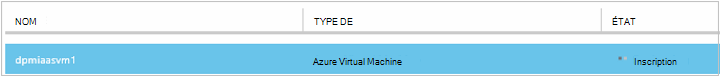
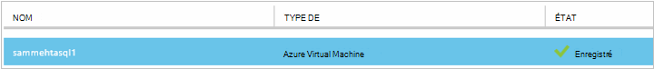
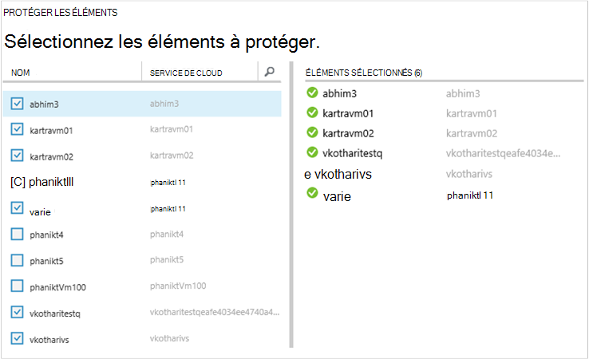
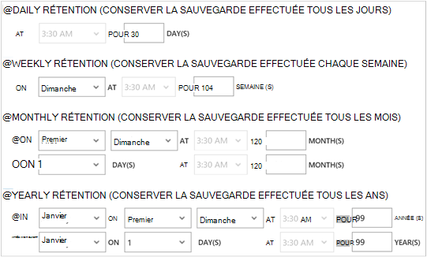
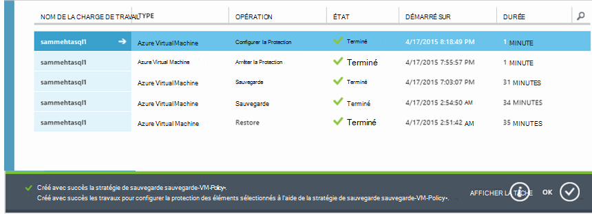
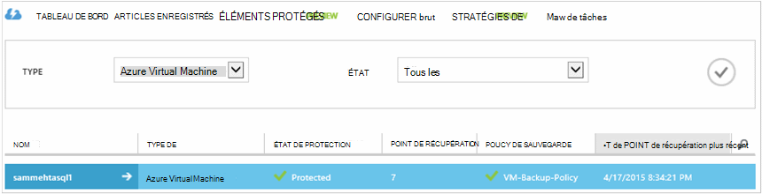

<properties
    pageTitle="Sauvegarder des machines virtuelles Azure | Microsoft Azure"
    description="Découvrir, enregistrer et sauvegarder vos ordinateurs virtuels avec ces procédures de sauvegarde Azure virtual machine."
    services="backup"
    documentationCenter=""
    authors="markgalioto"
    manager="jwhit"
    editor=""
    keywords="sauvegarde des machines virtuelles ; sauvegarder la machine virtuelle ; sauvegarde et reprise après sinistre ; sauvegarde de l’ordinateur virtuel"/>

<tags
    ms.service="backup"
    ms.workload="storage-backup-recovery"
    ms.tgt_pltfrm="na"
    ms.devlang="na"
    ms.topic="article"
    ms.date="09/28/2016"
    ms.author="trinadhk; jimpark; markgal;"/>

# Sauvegarder des ordinateurs virtuels Azure

> [AZURE.SELECTOR]
- [Sauvegarder des ordinateurs virtuels en coffre-fort des Services de récupération](backup-azure-arm-vms.md)
- [Sauvegarder des ordinateurs virtuels dans le coffre-fort de la sauvegarde](backup-azure-vms.md)

Cet article fournit les procédures de sauvegarde une classique déployé Azure machine virtuelle (VM) dans un coffre-fort de sauvegarde. Il existe quelques tâches que vous devez prendre en charge avant de pouvoir sauvegarder une machine virtuelle Azure. Si vous ne l’avez pas déjà fait, suivre les [conditions préalables](backup-azure-vms-prepare.md) pour préparer votre environnement de sauvegarde de vos ordinateurs virtuels.

Pour plus d’informations, consultez les articles sur la [planification de votre infrastructure de sauvegarde de machine virtuelle dans Azure](backup-azure-vms-introduction.md) et [d’Azure virtual machines](https://azure.microsoft.com/documentation/services/virtual-machines/).

>[AZURE.NOTE] Azure dispose de deux modèles de déploiement pour la création et l’utilisation des ressources : [le Gestionnaire de ressources et classique](../resource-manager-deployment-model.md). Un coffre-fort de sauvegarde ne protège que classique-déploiement de machines virtuelles. Impossible de protéger déployés par le Gestionnaire de ressources de machines virtuelles à un coffre-fort de sauvegarde. Pour plus d’informations sur l’utilisation des Services de récupération des coffres-forts, reportez-vous à la section [sauvegarder des ordinateurs virtuels à la chambre forte de Services de récupération des](backup-azure-arm-vms.md) .

La sauvegarde des machines virtuelles Azure implique trois étapes principales :

>[AZURE.NOTE] La sauvegarde des machines virtuelles est un processus local. Vous ne pouvez pas sauvegarder les machines virtuelles dans une région dans un coffre-fort de sauvegarde dans une autre région. Par conséquent, vous devez créer un coffre-fort de sauvegarde dans chaque région d’Azure, lorsqu’il existe des ordinateurs virtuels qui seront sauvegardés.

## Étape 1 : découverte des machines virtuelles Azure
Pour vérifier les nouvelles machines virtuelles (VM) ajoutés à l’abonnement sont identifiés avant de vous enregistrer, exécutez le processus de découverte. Les traitement des requêtes Azure pour obtenir la liste des ordinateurs virtuels de l’abonnement, ainsi que des informations supplémentaires telles que le nom de service de cloud et de la région.

1. Connectez-vous au [portail de classique](http://manage.windowsazure.com/)

2. Dans la liste des services Azure, cliquez sur **Services de récupération** pour ouvrir la liste des coffres-forts de sauvegarde et de restauration de Site.
    

3. Dans la liste des coffres-forts de sauvegarde, sélectionnez le coffre-fort pour sauvegarder un ordinateur virtuel.

    S’il s’agit d’un nouveau coffre-fort que le portail s’ouvre à la page de **Démarrage rapide** .

    

    Si la chambre forte a été configurée précédemment, le portail ouvre le menu des derniers fichiers utilisé.

4. Dans le menu de coffre-fort (en haut de la page), cliquez sur **Les éléments enregistrés**.

    

5. Dans le menu **Type** , sélectionnez **une Machine virtuelle Azure**.

    

6. Cliquez sur **DISCOVER** au bas de la page.
    

    Le processus de découverte peut prendre quelques minutes pendant que les ordinateurs virtuels sont en cours sous forme de tableau. Il existe une notification au bas de l’écran qui vous permet de savoir que le processus est en cours d’exécution.

    

    Les modifications de notification lorsque le processus est terminé. Si le processus de découverte n’a pas trouvé les ordinateurs virtuels, assurez-vous d’abord que les ordinateurs virtuels existent. Si les ordinateurs virtuels existent, assurez-vous que les ordinateurs virtuels sont dans la même région, comme le coffre-fort de sauvegarde. Si les ordinateurs virtuels existent et sont dans la même région, assurez-vous que les ordinateurs virtuels ne sont pas encore enregistrés dans un coffre-fort de sauvegarde. Si une machine virtuelle est affectée à un coffre-fort de sauvegarde, il n’est pas disponible à affecter aux autres coffres-forts de sauvegarde.

    

    Une fois que vous avez découvert les nouveaux éléments, passez à l’étape 2 et enregistrer vos ordinateurs virtuels.

##  Étape 2 - Registre des machines virtuelles Azure
Vous inscrivez une machine virtuelle Azure pour l’associer avec le service de sauvegarde d’Azure. Il s’agit généralement d’une activité ponctuelle.

1. Naviguer dans le coffre-fort de sauvegarde sous **Services de restauration** dans Azure portal, puis cliquez sur **Les éléments enregistrés**.

2. Dans le menu déroulant, sélectionnez **Azure Virtual Machine** .

    

3. Cliquez sur **Enregistrer** en bas de la page.
    

4. Dans le menu contextuel **Enregistrer les éléments** , sélectionnez les ordinateurs virtuels que vous souhaitez enregistrer. S’il y a deux ou plusieurs machines virtuelles portant le même nom, utilisez le service en nuage pour faire la distinction entre les deux.

    >[AZURE.TIP] Plusieurs machines virtuelles peuvent être inscrits en même temps.

    Une tâche est créée pour chaque ordinateur virtuel que vous avez sélectionné.

5. Dans la notification pour accéder à la page **tâches** , cliquez sur **Afficher la tâche** .

    

    La machine virtuelle s’affiche également dans la liste des éléments inscrits, ainsi que l’état de l’opération d’enregistrement.

    

    Lorsque l’opération est terminée, l’état change pour refléter l’état *enregistré* .

    

## Étape 3 - protéger les machines virtuelles Azure
Vous pouvez définir une stratégie de sauvegarde et rétention pour la machine virtuelle. Plusieurs machines virtuelles peuvent être protégés à l’aide d’une seule action de protéger.

Azure coffres-forts de sauvegarde créés après mai 2015 sont fournis avec une stratégie par défaut intégrée dans la chambre forte. Cette stratégie par défaut est fourni avec une rétention par défaut de 30 jours et une planification de sauvegarde une fois par jour.

1. Naviguer dans le coffre-fort de sauvegarde sous **Services de restauration** dans Azure portal, puis cliquez sur **Les éléments enregistrés**.
2. Dans le menu déroulant, sélectionnez **Azure Virtual Machine** .

    

3. Cliquez sur **protéger** au bas de la page.

    L' **Assistant de protéger les éléments** apparaît. L’Assistant répertorie uniquement les ordinateurs virtuels qui sont enregistrés et non protégés. Sélectionnez les ordinateurs virtuels que vous souhaitez protéger.

    S’il y a deux ou plusieurs machines virtuelles portant le même nom, utilisez le service en nuage pour faire la distinction entre les machines virtuelles.

    >[AZURE.TIP] Vous pouvez protéger plusieurs ordinateurs virtuels en même temps.

    

4. Choisissez une **planification de sauvegarde** pour sauvegarder des ordinateurs virtuels que vous avez sélectionné. Vous pouvez choisir parmi un ensemble de règles existant ou définir un nouveau.

    Chaque stratégie de sauvegarde peut avoir plusieurs machines virtuelles qui lui est associés. Toutefois, l’ordinateur virtuel peut être uniquement associé à une stratégie à un moment donné dans le temps.

    

    >[AZURE.NOTE] Une stratégie de sauvegarde inclut un jeu de rétention pour les sauvegardes planifiées. Si vous sélectionnez une stratégie de sauvegarde existante, vous ne pouvez pas modifier les options de conservation de l’étape suivante.

5. Choisissez une **durée de rétention** à associer à la sauvegarde.

    

    Stratégie de rétention spécifie la longueur de la durée pour le stockage d’une sauvegarde. Vous pouvez spécifier des règles de rétention différentes selon la date de la sauvegarde est effectuée. Par exemple, un point de sauvegarde effectuée tous les jours (ce qui constitue un point de restauration) peut-être être conservé pendant 90 jours. En comparaison, un point de sauvegarde pris à la fin de chaque trimestre (à des fins d’audit) peut doivent être conservés pendant des mois ou des années.

    

    Dans cet exemple d’image :

    - **Journalier rétention**: les sauvegardes effectuées tous les jours sont stockés pendant 30 jours.
    - **Stratégie de rétention hebdomadaire**: les sauvegardes effectuées chaque semaine le dimanche sont conservées pendant 104 semaines.
    - **Stratégie de rétention mensuel**: les sauvegardes effectuées sur le dernier dimanche de chaque mois sont conservés pour les mois de 120.
    - **Règle de rétention annuelle**: les sauvegardes effectuées sur le premier dimanche de chaque janvier sont conservés pour 99 ans.

    Une tâche est créée pour configurer la stratégie de protection et d’associer les machines virtuelles à cette stratégie pour chaque ordinateur virtuel que vous avez sélectionné.

6. Pour afficher la liste des tâches **Configurer la Protection** , dans le menu de coffres-forts, cliquez sur **projets** , puis sélectionnez **Configurer la Protection** du filtre de **l’opération** .

    

## Sauvegarde initiale
Une fois que l’ordinateur virtuel est protégé par une stratégie, elle s’affiche sous l’onglet **Protégés** avec l’état de *Protection - (en attente de sauvegarde initiale)*. Par défaut, la première sauvegarde planifiée est la *sauvegarde initiale*.

Pour déclencher la sauvegarde initiale immédiatement après la configuration de la protection :

1. En bas de la page **Protégée des éléments** , cliquez sur **Sauvegarder maintenant**.

    Le service de sauvegarde Azure crée un travail de sauvegarde pour l’opération de sauvegarde initiale.

2. Cliquez sur l’onglet **tâches** pour afficher la liste des tâches.

    

>[AZURE.NOTE] Au cours de l’opération de sauvegarde, le service de sauvegarde Azure émet une commande pour l’extension de sauvegarde dans chaque machine virtuelle pour vider tous les travaux d’écriture et de prendre un instantané cohérent.

Une fois la sauvegarde initiale, l’état de la machine virtuelle dans l’onglet **Éléments de protection** est *protégé*.

## Affichage des détails et l’état de la sauvegarde
Une fois que protégé, le nombre de machines virtuelles augmente également dans la résumé de page de **tableau de bord** . La page de **tableau de bord** affiche également le nombre de tâches à partir des dernières 24 heures qui ont *réussi*, *Échec*et qui sont *en cours*. Dans la page **tâches** , utilisez le **statut**, **opération**ou les menus **** d’et **à** pour filtrer les tâches.

Les valeurs dans le tableau de bord sont actualisés toutes les 24 heures.

## Résolution des erreurs
Si vous rencontrez des problèmes pendant la sauvegarde votre machine virtuelle, consultez l' [article de résolution des problèmes de mémoire virtuelle](backup-azure-vms-troubleshoot.md) de l’aide.

## Étapes suivantes

- [Gérer et analyser vos machines virtuelles](backup-azure-manage-vms.md)
- [Restaurer des machines virtuelles](backup-azure-restore-vms.md)
