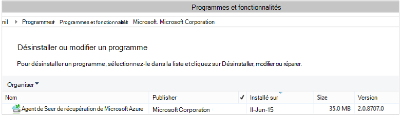

<properties
    pageTitle="Déployer et gérer la sauvegarde pour serveur/Client Windows à l’aide de PowerShell | Microsoft Azure"
    description="Apprenez à déployer et à gérer la sauvegarde Azure à l’aide de PowerShell"
    services="backup"
    documentationCenter=""
    authors="saurabhsensharma"
    manager="shivamg"
    editor=""/>

<tags
    ms.service="backup"
    ms.workload="storage-backup-recovery"
    ms.tgt_pltfrm="na"
    ms.devlang="na"
    ms.topic="article"
    ms.date="09/01/2016"
    ms.author="saurabhsensharma;markgal;jimpark;nkolli;trinadhk"/>


# <a name="deploy-and-manage-backup-to-azure-for-windows-serverwindows-client-using-powershell"></a>Déployer et gérer la sauvegarde sur Azure pour Windows Server et Windows Client à l’aide de PowerShell

> [AZURE.SELECTOR]
- [ARM](backup-client-automation.md)
- [Classique](backup-client-automation-classic.md)

Cet article vous indique comment utiliser PowerShell pour configuration Azure sauvegarde sur un client Windows ou de Windows Server et la gestion de sauvegarde et restauration.

## <a name="install-azure-powershell"></a>Installer PowerShell Azure

[AZURE.INCLUDE [learn-about-deployment-models](../../includes/learn-about-deployment-models-include.md)]

Cet article se concentre sur les applets de commande PowerShell de Azure Resource Manager (ARM) qui vous permettent d’utiliser un coffre-fort de Services de restauration dans un groupe de ressources.

Azure PowerShell 1.0 a été publiée en octobre 2015. Cette version a réussi la 0.9.8 mise à jour et de mise sur certaines des modifications importantes, en particulier dans le modèle d’affectation de noms des applets de commande. les applets de 1.0 commande suivent le modèle de dénomination {verbe}-AzureRm {nom} ; considérant que, le 0.9.8 noms n’incluent pas de **Rm** (par exemple, nouvelle-AzureRmResourceGroup au lieu de nouveau-AzureResourceGroup). Lorsque vous utilisez Azure PowerShell 0.9.8, vous devez d’abord activer le mode Gestionnaire de ressources en exécutant la commande **Switch-AzureMode AzureResourceManager** . Cette commande n’est pas nécessaire dans la version 1.0 ou version ultérieure.

Si vous souhaitez utiliser vos scripts écrits pour les 0.9.8 environnement, dans l’environnement 1.0 ou version ultérieure, vous devez soigneusement tester les scripts dans un environnement de préproduction avant de les utiliser dans la production, afin d’éviter l’impact inattendu.

[Télécharger la dernière version de PowerShell](https://github.com/Azure/azure-powershell/releases) (version minimale requise est : 1.0.0)


[AZURE.INCLUDE [arm-getting-setup-powershell](../../includes/arm-getting-setup-powershell.md)]

## <a name="create-a-recovery-services-vault"></a>Créer un coffre-fort de services de récupération

Les étapes suivantes vous guident dans le processus de création d’un coffre-fort de Services de récupération. Un coffre-fort de Services de récupération est différent de celui d’un coffre-fort de sauvegarde.

1. Si vous utilisez une sauvegarde d’Azure pour la première fois, vous devez utiliser l’applet de commande **Register-AzureRMResourceProvider** pour enregistrer le fournisseur de services de récupération Azure avec votre abonnement.

    ```
    PS C:\> Register-AzureRmResourceProvider -ProviderNamespace "Microsoft.RecoveryServices"
    ```

2. Le coffre-fort de Services de récupération est une ressource ARM, vous devez le placer dans un groupe de ressources. Vous pouvez utiliser un groupe de ressources existant ou créez-en un nouveau. Lorsque vous créez un nouveau groupe de ressources, spécifiez le nom et l’emplacement du groupe de ressources.  

    ```
    PS C:\> New-AzureRmResourceGroup –Name "test-rg" –Location "West US"
    ```

3. Utilisez l’applet de commande **New-AzureRmRecoveryServicesVault** pour créer le nouveau coffre-fort. Veillez à spécifier le même emplacement pour le stockage en chambre forte que celle utilisée pour le groupe de ressources.

    ```
    PS C:\> New-AzureRmRecoveryServicesVault -Name "testvault" -ResourceGroupName " test-rg" -Location "West US"
    ```

4. Spécifier le type de redondance du stockage à utiliser ; Vous pouvez utiliser le [Stockage local redondants (LRS)](../storage/storage-redundancy.md#locally-redundant-storage) ou [Stockage redondant de Geo (GRS)](../storage/storage-redundancy.md#geo-redundant-storage). L’exemple suivant montre que l’option - BackupStorageRedundancy pour testVault a la valeur GeoRedundant.

    > [AZURE.TIP] Nombreuses cmdlets Azure sauvegarde nécessitent l’objet de stockage en chambre forte des Services de récupération en tant qu’entrée. Pour cette raison, il est pratique stocker l’objet de stockage en chambre forte de Services de récupération de sauvegarde dans une variable.

    ```
    PS C:\> $vault1 = Get-AzureRmRecoveryServicesVault –Name "testVault"
    PS C:\> Set-AzureRmRecoveryServicesBackupProperties  -vault $vault1 -BackupStorageRedundancy GeoRedundant
    ```

## <a name="view-the-vaults-in-a-subscription"></a>Afficher les coffres-forts dans un abonnement
**Get-AzureRmRecoveryServicesVault** permet d’afficher la liste de tous les coffres-forts de l’abonnement en cours. Vous pouvez utiliser cette commande pour vérifier qu’un nouveau coffre-fort a été créé, ou voir les coffres-forts sont disponibles dans l’abonnement.

Exécutez la commande Get-AzureRmRecoveryServicesVault, et tous les coffres-forts dans l’abonnement sont répertoriés.

```
PS C:\> Get-AzureRmRecoveryServicesVault
Name              : Contoso-vault
ID                : /subscriptions/1234
Type              : Microsoft.RecoveryServices/vaults
Location          : WestUS
ResourceGroupName : Contoso-docs-rg
SubscriptionId    : 1234-567f-8910-abc
Properties        : Microsoft.Azure.Commands.RecoveryServices.ARSVaultProperties
```


## <a name="installing-the-azure-backup-agent"></a>Installation de l’agent de sauvegarde d’Azure
Avant d’installer l’agent de sauvegarde d’Azure, vous avez besoin pour que le programme d’installation téléchargé et présent sur le serveur Windows. Vous pouvez obtenir la version la plus récente de l’installer à partir du [Centre de téléchargement Microsoft](http://aka.ms/azurebackup_agent) ou à partir de la page de tableau de bord du coffre-fort Services de récupération. Enregistrer le programme d’installation à un emplacement facile d’accès comme * C:\Downloads\*.

Pour installer l’agent, exécutez la commande suivante dans une console PowerShell avec élévation de privilèges :

```
PS C:\> MARSAgentInstaller.exe /q
```

Il installe l’agent avec toutes les options par défaut. L’installation prend quelques minutes en arrière-plan. Si vous ne spécifiez pas l’option */nu* la fenêtre **Windows Update** s’ouvre à la fin de l’installation pour vérifier les mises à jour. Une fois installé, l’agent s’affiche dans la liste des programmes installés.

Pour afficher la liste des programmes installés, accédez au **Panneau de configuration** > **programmes** > **programmes et fonctionnalités**.



### <a name="installation-options"></a>Options d’installation

Pour afficher toutes les options disponibles via la ligne de commande, utilisez la commande suivante :

```
PS C:\> MARSAgentInstaller.exe /?
```

Les options disponibles sont les suivantes :

| Option | Détails | Par défaut |
| ---- | ----- | ----- |
| /q | Installation en mode silencieux | - |
| / p: « emplacement » | Chemin d’accès au dossier d’installation de l’agent de sauvegarde d’Azure. | Agent des Services de récupération Azure C:\Program Files\Microsoft |
| / s: « emplacement » | Chemin d’accès au dossier de cache pour l’agent de sauvegarde d’Azure. | C:\Program Files\Microsoft récupération Azure Services Agent\Scratch |
| /m | Participer à la mise à jour de Microsoft | - |
| /nu | Ne pas vérifier les mises à jour une fois l’installation terminée. | - |
| /d | Désinstalle les Services Agent de récupération de Microsoft Azure | - |
| /pH | Adresse de l’hôte proxy | - |
| PD | Numéro de Port de l’hôte proxy | - |
| /pu | Nom d’utilisateur hôte | - |
| /pw | Mot de passe proxy | - |


## <a name="registering-windows-server-or-windows-client-machine-to-a-recovery-services-vault"></a>Enregistrement de Windows Server ou l’ordinateur du client Windows à un coffre-fort de Services de récupération

Une fois que vous avez créé les Services de récupération vault, télécharger l’agent plus récent et les informations d’identification de la chambre forte et le stocker dans un emplacement pratique comme C:\Downloads.

```
PS C:\> $credspath = "C:\downloads"
PS C:\> $credsfilename = Get-AzureRmRecoveryServicesVaultSettingsFile -Backup -Vault $vault1 -Path  $credspath
PS C:\> $credsfilename C:\downloads\testvault\_Sun Apr 10 2016.VaultCredentials
```

Sur le serveur de Windows ou d’un ordinateur client de Windows, exécutez l’applet de commande [Start-OBRegistration](https://technet.microsoft.com/library/hh770398%28v=wps.630%29.aspx) pour inscrire l’ordinateur avec la chambre forte.

```
PS C:\> $cred = $credspath + $credsfilename
PS C:\> Start-OBRegistration-VaultCredentials $cred -Confirm:$false
CertThumbprint      :7a2ef2caa2e74b6ed1222a5e89288ddad438df2
SubscriptionID      : ef4ab577-c2c0-43e4-af80-af49f485f3d1
ServiceResourceName: testvault
Region              :West US
Machine registration succeeded.
```

> [AZURE.IMPORTANT] N’utilisez pas de chemins d’accès relatifs pour spécifier le fichier d’informations d’identification de coffre-fort. Vous devez fournir un chemin d’accès absolu en tant qu’entrée à l’applet de commande.

## <a name="networking-settings"></a>Paramètres de mise en réseau
Une fois la connectivité de l’ordinateur Windows à internet via un serveur proxy, les paramètres de proxy peuvent également être fournies à l’agent. Dans cet exemple, il est sans serveur proxy, nous sommes explicitement effacement de toutes les informations relatives au serveur proxy.

L’utilisation de la bande passante peut également être contrôlée avec les options de ```work hour bandwidth``` et ```non-work hour bandwidth``` pour un ensemble donné de jours de la semaine.

Définir les détails de proxy et de la bande passante est effectuée à l’aide de l’applet de commande [Set-OBMachineSetting](https://technet.microsoft.com/library/hh770409%28v=wps.630%29.aspx) :

```
PS C:\> Set-OBMachineSetting -NoProxy
Server properties updated successfully.

PS C:\> Set-OBMachineSetting -NoThrottle
Server properties updated successfully.
```

## <a name="encryption-settings"></a>Paramètres de chiffrement
Les données de sauvegarde envoyées à Azure sauvegarde sont chiffrées pour protéger la confidentialité des données. Le mot de passe de cryptage est « password » pour décrypter les données au moment de la restauration.

```
PS C:\> ConvertTo-SecureString -String "Complex!123_STRING" -AsPlainText -Force | Set-OBMachineSetting
Server properties updated successfully
```

> [AZURE.IMPORTANT] Conserver les informations de mot de passe sûr et sécurisé dès qu’il est défini. Vous ne serez pas en mesure de restaurer les données à partir d’Azure sans ce mot de passe.

## <a name="back-up-files-and-folders"></a>Sauvegarder des fichiers et des dossiers
Toutes les sauvegardes à partir de serveurs et clients Windows Azure sauvegarde sont régis par une stratégie. La stratégie compose de trois parties :

1. Une **planification de sauvegarde** qui spécifie quand les sauvegardes doivent être prélevés et synchronisés avec le service.
2. Une **planification de rétention** qui spécifie combien de temps conserver les points de récupération dans Azure.
3. Une **spécification de fichier d’inclusion/exclusion** qui dicte ce qui doit être sauvegardé.

Dans ce document, dans la mesure où nous sommes automatisation des sauvegardes, nous supposerons que rien n’a été configuré. Nous commençons par créer une nouvelle stratégie de sauvegarde à l’aide de l’applet de commande [New-OBPolicy](https://technet.microsoft.com/library/hh770416.aspx) .

```
PS C:\> $newpolicy = New-OBPolicy
```

À ce stade, la stratégie est vide et autres applets de commande sont nécessaires pour définir les éléments qui seront inclus ou exclus, lorsque les sauvegardes sera exécuté et où seront stockées les sauvegardes.

### <a name="configuring-the-backup-schedule"></a>Configuration de la planification de sauvegarde
La première des 3 parties d’une stratégie est le planning de sauvegarde, qui est créé à l’aide de l’applet de commande [New-OBSchedule](https://technet.microsoft.com/library/hh770401) . Le planning de sauvegarde définit lorsque des sauvegardes doivent être prises. Lors de la création d’une planification, que vous devez spécifier les paramètres d’entrée 2 :

- **Jours de la semaine** où la sauvegarde doit s’exécuter. Vous pouvez exécuter la tâche de sauvegarde sur une seule journée ou tous les jours de la semaine, ou toute combinaison entre les deux.
- **Heures de la journée** lorsque la sauvegarde doit s’exécuter. Vous pouvez définir jusqu'à 3 à différents moments de la journée lorsque la sauvegarde sera déclenchée.

Par exemple, vous pouvez configurer une stratégie de sauvegarde qui s’exécute à 16 h 00 tous les samedi et dimanche.

```
PS C:\> $sched = New-OBSchedule -DaysofWeek Saturday, Sunday -TimesofDay 16:00
```

La planification de sauvegarde doit être associé à une stratégie, et ceci peut être réalisé à l’aide de l’applet de commande [Set-OBSchedule](https://technet.microsoft.com/library/hh770407) .

```
PS C:> Set-OBSchedule -Policy $newpolicy -Schedule $sched
BackupSchedule : 4:00 PM Saturday, Sunday, Every 1 week(s) DsList : PolicyName : RetentionPolicy : State : New PolicyState : Valid
```
### <a name="configuring-a-retention-policy"></a>Configuration d’une stratégie de rétention
La stratégie de rétention définit la durée de conservation des points de restauration créés à partir des tâches de sauvegarde. Lorsque vous créez une nouvelle stratégie de rétention à l’aide de l’applet de commande [New-OBRetentionPolicy](https://technet.microsoft.com/library/hh770425) , vous pouvez spécifier le nombre de jours pendant lesquels les points de sauvegarde et de restauration doivent être conservées avec sauvegarde Azure. L’exemple suivant définit une stratégie de rétention de 7 jours.

```
PS C:\> $retentionpolicy = New-OBRetentionPolicy -RetentionDays 7
```

La stratégie de rétention doit être associé à la stratégie principale à l’aide de l’applet de commande [Set-OBRetentionPolicy](https://technet.microsoft.com/library/hh770405):

```
PS C:\> Set-OBRetentionPolicy -Policy $newpolicy -RetentionPolicy $retentionpolicy

BackupSchedule  : 4:00 PM
                  Saturday, Sunday,
                  Every 1 week(s)
DsList          :
PolicyName      :
RetentionPolicy : Retention Days : 7

                  WeeklyLTRSchedule :
                  Weekly schedule is not set

                  MonthlyLTRSchedule :
                  Monthly schedule is not set

                  YearlyLTRSchedule :
                  Yearly schedule is not set

State           : New
PolicyState     : Valid
```
### <a name="including-and-excluding-files-to-be-backed-up"></a>Inclusion et exclusion de fichiers à sauvegarder
Un ```OBFileSpec``` objet définit les fichiers à inclure et à exclure lors d’une sauvegarde. Il s’agit d’un ensemble de règles de portée protégée de fichiers et des dossiers sur un ordinateur. Vous pouvez disposer plusieurs fichier de règles d’inclusion ou d’exclusion selon les besoins et les associer à une stratégie. Lorsque vous créez un nouvel objet de OBFileSpec, vous pouvez :

- Spécifier les fichiers et les dossiers à inclure
- Spécifier les fichiers et dossiers à exclure
- Permet de spécifier des récursive de copie de sauvegarde de données dans un dossier (ou) si seuls les fichiers de niveau supérieur dans le dossier spécifié doivent être sauvegardés.

La deuxième est réalisée à l’aide de l’indicateur - récursif dans la commande New-OBFileSpec.

Dans l’exemple ci-dessous, nous allons sauvegarder les volumes C: et D: et exclure les fichiers binaires du système d’exploitation dans le dossier Windows et tous les dossiers temporaires. Pour cela, nous allons créer deux spécifications à l’aide de l’applet de commande [New-OBFileSpec](https://technet.microsoft.com/library/hh770408) - un pour l’inclusion de fichiers et l’autre pour l’exclusion. Une fois que les spécifications de fichier ont été créées, ils sont associés avec la stratégie à l’aide de l’applet de commande [Add-OBFileSpec](https://technet.microsoft.com/library/hh770424) .

```
PS C:\> $inclusions = New-OBFileSpec -FileSpec @("C:\", "D:\")

PS C:\> $exclusions = New-OBFileSpec -FileSpec @("C:\windows", "C:\temp") -Exclude

PS C:\> Add-OBFileSpec -Policy $newpolicy -FileSpec $inclusions

BackupSchedule  : 4:00 PM
                  Saturday, Sunday,
                  Every 1 week(s)
DsList          : {DataSource
                  DatasourceId:0
                  Name:C:\
                  FileSpec:FileSpec
                  FileSpec:C:\
                  IsExclude:False
                  IsRecursive:True

                  , DataSource
                  DatasourceId:0
                  Name:D:\
                  FileSpec:FileSpec
                  FileSpec:D:\
                  IsExclude:False
                  IsRecursive:True

                  }
PolicyName      :
RetentionPolicy : Retention Days : 7

                  WeeklyLTRSchedule :
                  Weekly schedule is not set

                  MonthlyLTRSchedule :
                  Monthly schedule is not set

                  YearlyLTRSchedule :
                  Yearly schedule is not set

State           : New
PolicyState     : Valid


PS C:\> Add-OBFileSpec -Policy $newpolicy -FileSpec $exclusions

BackupSchedule  : 4:00 PM
                  Saturday, Sunday,
                  Every 1 week(s)
DsList          : {DataSource
                  DatasourceId:0
                  Name:C:\
                  FileSpec:FileSpec
                  FileSpec:C:\
                  IsExclude:False
                  IsRecursive:True
                  ,FileSpec
                  FileSpec:C:\windows
                  IsExclude:True
                  IsRecursive:True
                  ,FileSpec
                  FileSpec:C:\temp
                  IsExclude:True
                  IsRecursive:True

                  , DataSource
                  DatasourceId:0
                  Name:D:\
                  FileSpec:FileSpec
                  FileSpec:D:\
                  IsExclude:False
                  IsRecursive:True

                  }
PolicyName      :
RetentionPolicy : Retention Days : 7

                  WeeklyLTRSchedule :
                  Weekly schedule is not set

                  MonthlyLTRSchedule :
                  Monthly schedule is not set

                  YearlyLTRSchedule :
                  Yearly schedule is not set

State           : New
PolicyState     : Valid
```

### <a name="applying-the-policy"></a>Application de la stratégie
Maintenant, l’objet stratégie est terminée et a associé à un planning de sauvegarde, de rétention et une liste d’inclusion/exclusion de fichiers. Cette stratégie peut maintenant être validée pour la sauvegarde d’Azure à utiliser. Avant d’appliquer la nouvelle stratégie de s’assurer qu’il n’y a aucune stratégie de sauvegarde existants associés au serveur à l’aide de l’applet de commande [Remove-OBPolicy](https://technet.microsoft.com/library/hh770415) . Suppression de la stratégie vous demande confirmation. Pour ignorer l’utilisation de la confirmation du ```-Confirm:$false``` indicateur avec l’applet de commande.

```
PS C:> Get-OBPolicy | Remove-OBPolicy
Microsoft Azure Backup Are you sure you want to remove this backup policy? This will delete all the backed up data. [Y] Yes [A] Yes to All [N] No [L] No to All [S] Suspend [?] Help (default is "Y"):
```

Validation de l’objet stratégie est effectuée à l’aide de l’applet de commande [Set-OBPolicy](https://technet.microsoft.com/library/hh770421) . Il demande également confirmation. Pour ignorer l’utilisation de la confirmation du ```-Confirm:$false``` indicateur avec l’applet de commande.

```
PS C:> Set-OBPolicy -Policy $newpolicy
Microsoft Azure Backup Do you want to save this backup policy ? [Y] Yes [A] Yes to All [N] No [L] No to All [S] Suspend [?] Help (default is "Y"):
BackupSchedule : 4:00 PM Saturday, Sunday, Every 1 week(s)
DsList : {DataSource
         DatasourceId:4508156004108672185
         Name:C:\
         FileSpec:FileSpec
         FileSpec:C:\
         IsExclude:False
         IsRecursive:True,

         FileSpec
         FileSpec:C:\windows
         IsExclude:True
         IsRecursive:True,

         FileSpec
         FileSpec:C:\temp
         IsExclude:True
         IsRecursive:True,

         DataSource
         DatasourceId:4508156005178868542
         Name:D:\
         FileSpec:FileSpec
         FileSpec:D:\
         IsExclude:False
         IsRecursive:True
    }
PolicyName : c2eb6568-8a06-49f4-a20e-3019ae411bac
RetentionPolicy : Retention Days : 7
              WeeklyLTRSchedule :
              Weekly schedule is not set

              MonthlyLTRSchedule :
              Monthly schedule is not set

              YearlyLTRSchedule :
              Yearly schedule is not set
State : Existing PolicyState : Valid
```

Vous pouvez afficher les détails de la stratégie de sauvegarde existante à l’aide de l’applet de commande [Get-OBPolicy](https://technet.microsoft.com/library/hh770406) . Vous pouvez détaillés supplémentaires à l’aide de l’applet de commande [Get-OBSchedule](https://technet.microsoft.com/library/hh770423) pour la planification de la sauvegarde et l’applet de commande [Get-OBRetentionPolicy](https://technet.microsoft.com/library/hh770427) pour les stratégies de rétention

```
PS C:> Get-OBPolicy | Get-OBSchedule
SchedulePolicyName : 71944081-9950-4f7e-841d-32f0a0a1359a
ScheduleRunDays : {Saturday, Sunday}
ScheduleRunTimes : {16:00:00}
State : Existing

PS C:> Get-OBPolicy | Get-OBRetentionPolicy
RetentionDays : 7
RetentionPolicyName : ca3574ec-8331-46fd-a605-c01743a5265e
State : Existing

PS C:> Get-OBPolicy | Get-OBFileSpec
FileName : *
FilePath : \?\Volume{b835d359-a1dd-11e2-be72-2016d8d89f0f}\
FileSpec : D:\
IsExclude : False
IsRecursive : True

FileName : *
FilePath : \?\Volume{cdd41007-a22f-11e2-be6c-806e6f6e6963}\
FileSpec : C:\
IsExclude : False
IsRecursive : True

FileName : *
FilePath : \?\Volume{cdd41007-a22f-11e2-be6c-806e6f6e6963}\windows
FileSpec : C:\windows
IsExclude : True
IsRecursive : True

FileName : *
FilePath : \?\Volume{cdd41007-a22f-11e2-be6c-806e6f6e6963}\temp
FileSpec : C:\temp
IsExclude : True
IsRecursive : True
```

### <a name="performing-an-ad-hoc-backup"></a>Exécution d’une sauvegarde ad-hoc
Une fois une stratégie de sauvegarde a été définie les sauvegardes se produit par la planification. Il est également possible à l’aide de l’applet de commande [Start-OBBackup](https://technet.microsoft.com/library/hh770426) de déclencher une sauvegarde ad hoc :

```
PS C:> Get-OBPolicy | Start-OBBackup
Taking snapshot of volumes...
Preparing storage...
Estimating size of backup items...
Estimating size of backup items...
Transferring data...
Verifying backup...
Job completed.
The backup operation completed successfully.
```

## <a name="restore-data-from-azure-backup"></a>Restaurer des données à partir de la sauvegarde d’Azure
Cette section va vous guider tout au long de la procédure pour l’automatisation de la récupération des données à partir de la sauvegarde d’Azure. Cela implique les étapes suivantes :

1. Sélectionnez le volume source
2. Choisissez un point de sauvegarde à restaurer
3. Choisissez un élément à restaurer
4. Déclencher le processus de restauration

### <a name="picking-the-source-volume"></a>Le volume source de prélèvement
Pour restaurer un élément à partir de la sauvegarde d’Azure, vous devez d’abord identifier la source de l’élément. Dans la mesure où nous sommes l’exécution des commandes dans le contexte d’un serveur Windows ou un client Windows, l’ordinateur est déjà identifié. L’étape suivante de l’identification de la source est d’identifier le volume contenant. Une liste des volumes ou des sources en cours de sauvegarde à partir de cet ordinateur peut être récupérée par l’exécution de l’applet de commande [Get-OBRecoverableSource](https://technet.microsoft.com/library/hh770410) . Cette commande renvoie un tableau de toutes les sources de sauvegarde à partir de ce serveur/client.

```
PS C:> $source = Get-OBRecoverableSource
PS C:> $source
FriendlyName : C:\
RecoverySourceName : C:\
ServerName : myserver.microsoft.com

FriendlyName : D:\
RecoverySourceName : D:\
ServerName : myserver.microsoft.com
```

### <a name="choosing-a-backup-point-to-restore"></a>Choix d’un point de sauvegarde à restaurer
La liste des points de sauvegarde peut être récupérée par l’exécution de l’applet de commande [Get-OBRecoverableItem](https://technet.microsoft.com/library/hh770399.aspx) avec les paramètres appropriés. Dans notre exemple, nous allons choisir le dernier point de sauvegarde pour le volume source *D:* et permet de récupérer un fichier spécifique.

```
PS C:> $rps = Get-OBRecoverableItem -Source $source[1]
IsDir : False
ItemNameFriendly : D:\
ItemNameGuid : \?\Volume{b835d359-a1dd-11e2-be72-2016d8d89f0f}\
LocalMountPoint : D:\
MountPointName : D:\
Name : D:\
PointInTime : 18-Jun-15 6:41:52 AM
ServerName : myserver.microsoft.com
ItemSize :
ItemLastModifiedTime :

IsDir : False
ItemNameFriendly : D:\
ItemNameGuid : \?\Volume{b835d359-a1dd-11e2-be72-2016d8d89f0f}\
LocalMountPoint : D:\
MountPointName : D:\
Name : D:\
PointInTime : 17-Jun-15 6:31:31 AM
ServerName : myserver.microsoft.com
ItemSize :
ItemLastModifiedTime :
```
L’objet ```$rps``` est un tableau de points de sauvegarde. Le premier élément est le dernier point et le nième élément est le point le plus ancien. Pour choisir le dernier point, nous utiliserons ```$rps[0]```.

### <a name="choosing-an-item-to-restore"></a>Sélection d’un élément à restaurer
Pour identifier l’exact du fichier ou le dossier à restaurer, récursivement utiliser l’applet de commande [Get-OBRecoverableItem](https://technet.microsoft.com/library/hh770399.aspx) . De cette manière, la hiérarchie de dossiers est accessible uniquement à l’aide de la ```Get-OBRecoverableItem```.

Dans cet exemple, si vous souhaitez restaurer le fichier *finances.xls* nous pouvons faire référence qui à l’aide de l’objet ```$filesFolders[1]```.

```
PS C:> $filesFolders = Get-OBRecoverableItem $rps[0]
PS C:> $filesFolders
IsDir : True
ItemNameFriendly : D:\MyData\
ItemNameGuid : \?\Volume{b835d359-a1dd-11e2-be72-2016d8d89f0f}\MyData\
LocalMountPoint : D:\
MountPointName : D:\
Name : MyData
PointInTime : 18-Jun-15 6:41:52 AM
ServerName : myserver.microsoft.com
ItemSize :
ItemLastModifiedTime : 15-Jun-15 8:49:29 AM

PS C:> $filesFolders = Get-OBRecoverableItem $filesFolders[0]
PS C:> $filesFolders
IsDir : False
ItemNameFriendly : D:\MyData\screenshot.oxps
ItemNameGuid : \?\Volume{b835d359-a1dd-11e2-be72-2016d8d89f0f}\MyData\screenshot.oxps
LocalMountPoint : D:\
MountPointName : D:\
Name : screenshot.oxps
PointInTime : 18-Jun-15 6:41:52 AM
ServerName : myserver.microsoft.com
ItemSize : 228313
ItemLastModifiedTime : 21-Jun-14 6:45:09 AM

IsDir : False
ItemNameFriendly : D:\MyData\finances.xls
ItemNameGuid : \?\Volume{b835d359-a1dd-11e2-be72-2016d8d89f0f}\MyData\finances.xls
LocalMountPoint : D:\
MountPointName : D:\
Name : finances.xls
PointInTime : 18-Jun-15 6:41:52 AM
ServerName : myserver.microsoft.com
ItemSize : 96256
ItemLastModifiedTime : 21-Jun-14 6:43:02 AM
```

Vous pouvez également rechercher des éléments à restaurer à l’aide de la ```Get-OBRecoverableItem``` applet de commande. Dans notre exemple, pour rechercher des *finances.xls* nous aurions pu obtenir un handle sur le fichier en exécutant cette commande :

```
PS C:\> $item = Get-OBRecoverableItem -RecoveryPoint $rps[0] -Location "D:\MyData" -SearchString "finance*"
```

### <a name="triggering-the-restore-process"></a>Déclencher le processus de restauration
Pour déclencher le processus de restauration, nous devons d’abord spécifier les options de récupération. Pour ce faire, vous pouvez à l’aide de l’applet de commande [New-OBRecoveryOption](https://technet.microsoft.com/library/hh770417.aspx) . Pour cet exemple, supposons que vous souhaitez restaurer les fichiers vers *C:\temp*. Supposons également que nous voulons ignorer les fichiers qui existent déjà dans le dossier *C:\temp*. Pour créer une option de récupération de ce type, utilisez la commande suivante :

```
PS C:\> $recovery_option = New-OBRecoveryOption -DestinationPath "C:\temp" -OverwriteType Skip
```

Déclencher maintenant de restauration sur le texte sélectionné à l’aide de la commande [Start-OBRecovery](https://technet.microsoft.com/library/hh770402.aspx) ```$item``` à partir de la sortie de la ```Get-OBRecoverableItem``` applet de commande :

```
PS C:\> Start-OBRecovery -RecoverableItem $item -RecoveryOption $recover_option
Estimating size of backup items...
Estimating size of backup items...
Estimating size of backup items...
Estimating size of backup items...
Job completed.
The recovery operation completed successfully.
```


## <a name="uninstalling-the-azure-backup-agent"></a>Désinstallation de l’agent de sauvegarde d’Azure
Désinstallation de l’agent de sauvegarde d’Azure peut être effectuée à l’aide de la commande suivante :

```
PS C:\> .\MARSAgentInstaller.exe /d /q
```

Désinstaller les fichiers binaires de l’agent à partir de l’ordinateur a des conséquences à prendre en compte :

- Il supprime le filtre de fichiers de l’ordinateur, et suivi des modifications est arrêté.
- Toutes les informations de stratégie sont supprimées de l’ordinateur, mais les informations de stratégie continuent à être stockées dans le service.
- Toutes les planifications de sauvegarde sont supprimées, et aucune autre sauvegarde n’est prises.

Toutefois, les données stockées dans Azure reste et sont conservées par le programme d’installation de stratégie de rétention par vous. Anciens points sont automatiquement sous obsolètes.

## <a name="remote-management"></a>Gestion à distance
Toute la gestion autour de l’agent, les stratégies et les sources de données Azure sauvegarde peut être effectuée à distance par le biais de PowerShell. L’ordinateur qui sera géré à distance doit être correctement préparé.

Par défaut, le service WinRM est configuré pour un démarrage manuel. Le type de démarrage doit être défini sur *automatique* et le service doit être démarré. Pour vérifier que le service WinRM est en cours d’exécution, la valeur de la propriété Status doit être *en cours d’exécution*.

```
PS C:\> Get-Service WinRM

Status   Name               DisplayName
------   ----               -----------
Running  winrm              Windows Remote Management (WS-Manag...
```

PowerShell doit être configuré pour l’accès distant.

```
PS C:\> Enable-PSRemoting -force
WinRM is already set up to receive requests on this computer.
WinRM has been updated for remote management.
WinRM firewall exception enabled.

PS C:\> Set-ExecutionPolicy unrestricted -force
```

L’ordinateur peut maintenant être géré à distance - à partir de l’installation de l’agent. Par exemple, le script suivant copie l’agent à l’ordinateur distant et l’installe.

```
PS C:\> $dloc = "\\REMOTESERVER01\c$\Windows\Temp"
PS C:\> $agent = "\\REMOTESERVER01\c$\Windows\Temp\MARSAgentInstaller.exe"
PS C:\> $args = "/q"
PS C:\> Copy-Item "C:\Downloads\MARSAgentInstaller.exe" -Destination $dloc - force

PS C:\> $s = New-PSSession -ComputerName REMOTESERVER01
PS C:\> Invoke-Command -Session $s -Script { param($d, $a) Start-Process -FilePath $d $a -Wait } -ArgumentList $agent $args
```

## <a name="next-steps"></a>Étapes suivantes
Pour plus d’informations sur, consultez Azure sauvegarde pour serveur/Client Windows

- [Introduction à la sauvegarde Azure](backup-introduction-to-azure-backup.md)
- [Sauvegarder des serveurs Windows](backup-configure-vault.md)
