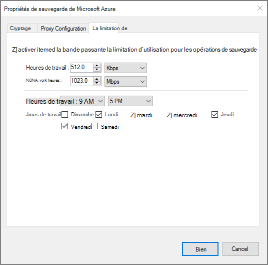

<properties
    pageTitle="Sauvegarde Windows server ou client vers Azure en utilisant le modèle de déploiement classique | Microsoft Azure"
    description="Sauvegarde des serveurs Windows ou des clients vers Azure en créant un coffre-fort sauvegarde, télécharger des informations d’identification, l’installation de l’agent de sauvegarde et la fin d’une sauvegarde initiale de vos fichiers et dossiers."
    services="backup"
    documentationCenter=""
    authors="markgalioto"
    manager="cfreeman"
    editor=""
    keywords="chambre forte de sauvegarde ; sauvegarder un serveur Windows ; fenêtres de sauvegarde ;"/>

<tags
    ms.service="backup"
    ms.workload="storage-backup-recovery"
    ms.tgt_pltfrm="na"
    ms.devlang="na"
    ms.topic="article"
    ms.date="08/08/2016"
    ms.author="jimpark; trinadhk; markgal"/>

# Sauvegarder un client ou un serveur de Windows Azure en utilisant le modèle de déploiement classique

> [AZURE.SELECTOR]
- [Portail classique](backup-configure-vault-classic.md)
- [Azure portal](backup-configure-vault.md)

Cet article décrit les procédures à suivre pour préparer votre environnement et de sauvegarde de Windows server (ou client) pour Azure. Il couvre également les considérations relatives au déploiement de votre solution de sauvegarde. Si vous êtes intéressé par l’Azure sauvegarde pour la première fois, cet article vous guide rapidement dans le processus.

>[AZURE.IMPORTANT] Azure dispose de deux modèles de déploiement différentes pour la création et l’utilisation des ressources : le Gestionnaire de ressources et classique. Cet article traite de l’utilisation du modèle de déploiement classique. Microsoft recommande que la plupart des nouveaux déploiements utilisent le modèle de gestionnaire de ressources.

## Avant de commencer
Pour sauvegarder un serveur ou un client d’Azure, vous avez besoin d’un compte Azure. Si vous n’en avez pas, vous pouvez créer un [compte gratuit](https://azure.microsoft.com/free/) dans quelques minutes.

## Étape 1 : Créer un coffre-fort de sauvegarde
Pour sauvegarder des fichiers et des dossiers à partir d’un serveur ou un client, vous devez créer un coffre-fort de sauvegarde dans la zone géographique où vous souhaitez stocker les données.

### Pour créer un coffre-fort de sauvegarde

1. Ouvrez une session sur [le portail classique](https://manage.windowsazure.com/).

2. Cliquez sur **Nouveau** > **Data Services** > **Services de récupération de** > **Sauvegarde coffre-fort**, puis choisissez **Création rapide**.

3. Pour le paramètre de **nom** , entrez un nom convivial pour le coffre-fort de sauvegarde. Tapez un nom qui contient entre 2 et 50 caractères. Il doit commencer par une lettre et peut contenir uniquement des lettres, des chiffres et des traits d’union. Ce nom doit être unique pour chaque abonnement.

4. Pour le paramètre de **région** , sélectionnez la zone géographique pour le coffre-fort de sauvegarde. Ce choix détermine la zone géographique où vos données de sauvegarde sont envoyées. En choisissant une région proche de votre emplacement géographique, vous pouvez réduire la latence du réseau lors de la sauvegarde sur Azure.

5. Cliquez sur **créer un coffre-fort**.

    

    Elle peut prendre du temps pour le coffre-fort de sauvegarde à créer. Pour vérifier l’état, surveiller les notifications au bas du portail classique.

    Une fois le coffre-fort de sauvegarde a été créé, vous verrez un message indiquant que le coffre-fort a été créé avec succès. Il apparaît également comme **actif** dans la liste des **Services de récupération des** ressources.

    

4. Sélectionnez l’option de redondance de stockage en suivant les étapes décrites ici.

    >[AZURE.IMPORTANT] Le meilleur moment pour identifier votre option de redondance de stockage est immédiatement après la création du coffre-fort et avant que les ordinateurs sont inscrits dans la chambre forte. Une fois un élément a été enregistré dans un coffre-fort, l’option de redondance de stockage est verrouillée et ne peut pas être modifiée.

    Si vous utilisez Azure comme un point de terminaison de stockage de sauvegarde principal (par exemple, vous sauvegardez vers Azure à partir d’un serveur Windows), solution de [stockage redondant géo](../storage/storage-redundancy.md#geo-redundant-storage) prélèvement (par défaut).

    Si vous utilisez Azure comme un point de terminaison de stockage de sauvegarde tertiaires (par exemple, vous utilisez System Center Data Protection Manager pour stocker une copie de sauvegarde locale sur site et l’à l’aide d’Azure pour la rétention à long terme a besoin), pensez à choisir le [stockage redondant localement](../storage/storage-redundancy.md#locally-redundant-storage). Cela entraîne un dysfonctionnement du coût de stockage des données dans Azure, tout en offrant un niveau de durabilité de vos données peuvent être acceptables pour les copies tertiaires.

    **Pour sélectionner l’option de redondance de stockage :**

    une barre d’outils. Cliquez sur le coffre que vous venez de créer.

    b. Sur la page de démarrage rapide, cliquez sur **configurer**.

    

    c. Choisissez l’option de redondance de stockage approprié.

    Si vous sélectionnez **Redondants localement**, vous devez cliquez sur **Enregistrer** (car **Géo-redondants** est l’option par défaut).

    d. Dans le volet de navigation de gauche, cliquez sur **Services de récupération de** pour revenir à la liste des ressources pour les Services de récupération.

## Étape 2 : Téléchargez le fichier d’informations d’identification de coffre-fort
L’ordinateur local doit être authentifié avec un coffre-fort de sauvegarde avant qu’il peut sauvegarder des données sur Azure. L’authentification s’effectue via les *informations d’identification de la chambre forte*. Le fichier d’informations d’identification de coffre-fort est transférée via un canal sécurisé à partir du portail classique. La clé privée du certificat n’est pas conservé dans le portail ou le service.

Pour en savoir plus sur [à l’aide de chambre forte des informations d’identification pour l’authentification auprès du service de sauvegarde](backup-introduction-to-azure-backup.md#what-is-the-vault-credential-file).

### Pour télécharger le fichier d’informations d’identification de coffre-fort pour un ordinateur local

1. Dans le volet de navigation de gauche, cliquez sur **Services de récupération**et puis sélectionnez le coffre-fort de sauvegarde que vous avez créé.

    

2.  Dans la page de démarrage rapide, cliquez sur **références pour le téléchargement en chambre forte**.

    Le portail classique génère une information d’identification de coffre-fort à l’aide d’une combinaison du nom de coffre-fort et de la date actuelle. Le fichier d’informations d’identification de coffre-fort est utilisé uniquement pendant le processus d’inscription et expire au bout de 48 heures.

    Le fichier d’informations d’identification de chambre forte peut être téléchargé à partir du portail.

3. Cliquez sur **Enregistrer** pour télécharger le fichier d’informations d’identification de coffre-fort dans le dossier Téléchargements du compte local. Vous pouvez également sélectionner **Enregistrer sous** dans le menu **Enregistrer** spécifier un emplacement pour le fichier d’informations d’identification de coffre-fort.

    >[AZURE.NOTE] Assurez-vous que le fichier d’informations d’identification de coffre-fort est enregistré dans un emplacement qui est accessible à partir de votre ordinateur. S’il est stocké dans un bloc de message de partage ou un serveur de fichier, vérifiez que vous disposez des autorisations pour y accéder.

## Étape 3 : Télécharger, installer et inscrire l’agent de sauvegarde
Après avoir créé le coffre-fort de sauvegarde et que vous téléchargez le fichier d’informations d’identification de coffre-fort, un agent doit être installé sur chacun de vos ordinateurs Windows.

### Pour télécharger, installer et inscrire l’agent

1. Cliquez sur **Services de récupération**et sélectionnez le coffre-fort de sauvegarde que vous souhaitez enregistrer avec un serveur.

2. Dans la page de démarrage rapide, cliquez sur l’agent, **l’Agent pour Windows Server System Center Data Protection Manager ou Windows client**. Puis cliquez sur **Enregistrer**.

    

3. Une fois le fichier MARSagentinstaller.exe téléchargé, cliquez sur **exécuter** (ou double-cliquez sur **MARSAgentInstaller.exe** de l’emplacement enregistré).

4. Choisissez le dossier d’installation et un dossier de cache qui sont requis pour l’agent, puis cliquez sur **suivant**. L’emplacement du cache que vous spécifiez doit avoir un espace libre égal au moins 5 % des données de sauvegarde.

5. Vous pouvez continuer à se connecter à Internet via les paramètres de proxy par défaut.          Si vous utilisez un serveur proxy pour se connecter à Internet, dans la page de Configuration du serveur Proxy, activez la case à cocher **utiliser les paramètres de proxy personnalisés** et puis entrez les détails du serveur proxy. Si vous utilisez un proxy authentifié, entrez les informations de nom et de mot de passe utilisateur, puis cliquez sur **suivant**.

7. Cliquez sur **installer** pour commencer l’installation de l’agent. L’agent de sauvegarde installe.NET Framework 4.5 et Windows PowerShell (si elle n’est pas déjà installé) pour terminer l’installation.

8. Une fois que l’agent est installé, cliquez sur **Continuer pour l’enregistrement** pour poursuivre le flux de travail.

9. Dans la page Identification du coffre-fort, accédez à et sélectionnez le fichier d’informations d’identification de chambre forte que vous avez téléchargé précédemment.

    Le fichier d’informations d’identification de coffre-fort est valable uniquement 48 heures après que l’avoir téléchargée à partir du portail. Si vous rencontrez une erreur sur cette page (par exemple, « chambre forte informations d’identification de fichier fourni a expiré »), connectez-vous au portail et téléchargez de nouveau le fichier d’informations d’identification de coffre-fort.

    Assurez-vous que le fichier d’informations d’identification de coffre-fort est disponible dans un emplacement accessible par l’application d’installation. Si vous rencontrez des erreurs liées à l’accès, copiez le fichier d’informations d’identification de coffre-fort dans un emplacement temporaire sur le même ordinateur et recommencez l’opération.

    Si vous rencontrez une erreur d’informations d’identification de coffre-fort comme « credentials vault non valide fourni », le fichier est endommagé ou n'est pas avoir les informations d’identification plus récentes associé au service de récupération. Réessayez l’opération après avoir téléchargé un nouveau fichier d’informations d’identification de coffre-fort à partir du portail. Cette erreur peut également se produire si un utilisateur clique sur l’option **informations d’identification de la chambre forte téléchargement** plusieurs fois de suite. Dans ce cas, seul le dernier fichier de d’informations d’identification de coffre-fort est valide.

9. Dans la page paramètre de cryptage, vous pouvez générer un mot de passe ou fournir un mot de passe (avec un minimum de 16 caractères). N’oubliez pas d’enregistrer le mot de passe dans un endroit sûr.

10. Cliquez sur **Terminer**. L’Assistant Inscription d’un serveur inscrit le serveur avec la sauvegarde.

    >[AZURE.WARNING] Si vous perdez ou oubliez le mot de passe, Microsoft ne peut vous aider à récupérer les données de sauvegarde. Vous possédez le mot de passe de cryptage, et Microsoft ne dispose pas d’une visibilité sur le mot de passe que vous utilisez. Enregistrez le fichier dans un emplacement sécurisé, car il sera requis lors d’une opération de récupération.

11. Une fois que la clé de cryptage est définie, laissez **l’Agent des Services de récupération de lancement Microsoft Azure** la case à cocher, puis cliquez sur **Fermer**.

## Étape 4 : Terminer la sauvegarde initiale

La sauvegarde initiale inclut deux tâches essentielles :

- Création de la planification de sauvegarde
- Sauvegarde des fichiers et des dossiers pour la première fois

La stratégie de sauvegarde après la sauvegarde initiale, il crée des points de sauvegarde que vous pouvez utiliser si vous avez besoin de récupérer les données. La stratégie de sauvegarde pour cela en fonction de la planification que vous définissez.

### Pour planifier la sauvegarde

1. Ouvrez l’agent de sauvegarde de Microsoft Azure. (Il s’ouvre automatiquement si vous avez laissé la case à cocher **Agent des Services de récupération de lancement Microsoft Azure** sélectionnée lorsque vous avez fermé l’Assistant Inscription d’un serveur.) Vous pouvez le trouver en recherchant votre machine **Microsoft Azure Backup**.

    

2. L’agent de sauvegarde, cliquez sur **Planifier la sauvegarde**.

    

3. Dans la page mise en route de l’Assistant Planification de sauvegarde, cliquez sur **suivant**.

4. Dans la sélection d’articles pour la page de sauvegarde, cliquez sur **Ajouter des éléments**.

5. Sélectionnez les fichiers et les dossiers que vous souhaitez sauvegarder, puis cliquez sur **OK**.

6. Cliquez sur **suivant**.

7. Dans la page **Spécifier la planification de sauvegarde** , spécifiez la **planification de la sauvegarde** , puis cliquez sur **suivant**.

    Vous pouvez planifier quotidiennement (au taux maximal de trois fois par jour) ou des sauvegardes hebdomadaires.

    

    >[AZURE.NOTE] Pour plus d’informations sur la spécification de la planification de sauvegarde, consultez l’article [Utilisation Azure sauvegarde pour remplacer votre infrastructure de bandes](backup-azure-backup-cloud-as-tape.md).

8. Dans la page **Sélectionnez une stratégie de rétention** , sélectionnez la **Stratégie de rétention** pour la copie de sauvegarde.

    La stratégie de rétention spécifie la durée pour laquelle la sauvegarde sera stockée. Plutôt que simplement spécifier une stratégie « plat » pour tous les points de sauvegarde, vous pouvez spécifier des stratégies de rétention différentes selon lorsque la sauvegarde se produit. Vous pouvez modifier les stratégies de rétention quotidienne, hebdomadaire, mensuelle et annuelle pour répondre à vos besoins.

9. Dans la page Choisir un Type de sauvegarde initiale, choisissez le type de sauvegarde initial. Laissez l’option **automatiquement sur le réseau** sélectionné, puis cliquez sur **suivant**.

    Vous pouvez sauvegarder automatiquement sur le réseau, ou vous pouvez sauvegarder en mode hors connexion. Le reste de cet article décrit le processus de sauvegarde automatiquement. Si vous préférez effectuer une sauvegarde en mode hors connexion, consultez l’article de [workflow de sauvegarde en mode hors connexion dans Azure sauvegarde](backup-azure-backup-import-export.md) pour plus d’informations.

10. Sur la page de Confirmation, passez en revue les informations, puis cliquez sur **Terminer**.

11. Une fois que l’Assistant a terminé la création de la planification de sauvegarde, cliquez sur **Fermer**.

### Activer la limitation du réseau (facultatif)

L’agent de sauvegarde fournit la limitation du réseau. Limitation d’utilisation de la bande passante réseau pendant le transfert de données des contrôles. Ce contrôle peut être utile si vous avez besoin sauvegarder des données pendant heures de travail, mais ne souhaitez pas que le processus de sauvegarde à interférer avec tout autre trafic Internet. La limitation s’applique pour sauvegarder et restaurer des activités.

**Pour activer la limitation du réseau**

1. L’agent de sauvegarde, cliquez sur **Modifier les propriétés**.

    

2. Sur l’onglet **régulation** , sélectionnez la case à cocher **Activer l’utilisation de la bande passante internet de limitation pour les opérations de sauvegarde** .

    

3. Après avoir activé la limitation, spécifiez la largeur de bande autorisé pour le transfert de données de sauvegarde pendant les **heures de travail** et les **heures de travail-Non**.

    Les valeurs de bande passante commencent à 512 kilobits par seconde (Kbits/s) et peuvent aller jusqu'à 1 023 mégaoctets par seconde (Mbits/s). Vous pouvez également désigner le début et de fin pour les **heures de travail**et les jours de la semaine sont des jours de travail considéré. Heures en dehors du travail désigné heures sont considérées comme non-travail heures.

4. Cliquez sur **OK**.

### Sauvegarder maintenant

1. L’agent de sauvegarde, cliquez sur **Sauvegarder maintenant** pour effectuer l’amorçage initial sur le réseau.

    

2. Sur la page de Confirmation, passez en revue les paramètres de l’Assistant sauvegarde des maintenant permet de sauvegarder l’ordinateur. Puis cliquez sur **Sauvegarder**.

3. Cliquez sur **Fermer** pour fermer l’Assistant. Si vous le faites avant la fin du processus de sauvegarde, l’Assistant continue à s’exécuter en arrière-plan.

Une fois la sauvegarde initiale terminée, l’état de **travail terminé** s’affiche dans la console de sauvegarde.

## Étapes suivantes
- Inscrivez-vous à un [compte Azure gratuit](https://azure.microsoft.com/free/).

Pour plus d’informations sur la sauvegarde des machines virtuelles ou autres charges de travail, voir :

- [Sauvegarder des ordinateurs virtuels de IaaS](backup-azure-vms-prepare.md)
- [Sauvegarder des charges de travail sur Azure avec le serveur de sauvegarde de Microsoft Azure](backup-azure-microsoft-azure-backup.md)
- [Sauvegarder des charges de travail sur Azure avec DPM](backup-azure-dpm-introduction.md)
