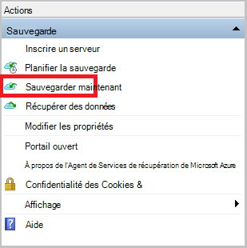

<properties
    pageTitle="Sauvegarde Windows Server ou client vers Azure avec sauvegarde Azure en utilisant le modèle de déploiement du Gestionnaire de ressources | Microsoft Azure"
    description="Sauvegarde des serveurs Windows ou des clients vers Azure en créant un coffre-fort sauvegarde, télécharger des informations d’identification, l’installation de l’agent de sauvegarde et la fin d’une sauvegarde initiale de vos fichiers et dossiers."
    services="backup"
    documentationCenter=""
    authors="markgalioto"
    manager="cfreeman"
    editor=""
    keywords="chambre forte de sauvegarde ; sauvegarder un serveur Windows ; fenêtres de sauvegarde ;"/>

<tags
    ms.service="backup"
    ms.workload="storage-backup-recovery"
    ms.tgt_pltfrm="na"
    ms.devlang="na"
    ms.topic="article"
    ms.date="08/10/2016"
    ms.author="jimpark; trinadhk; markgal"/>

# Sauvegarder un client ou un serveur de Windows Azure en utilisant le modèle de déploiement du Gestionnaire de ressources

> [AZURE.SELECTOR]
- [Azure portal](backup-configure-vault.md)
- [Portail classique](backup-configure-vault-classic.md)

Cet article explique comment sauvegarder votre client Windows Server (ou Windows) fichiers et dossiers vers Azure avec sauvegarde Azure en utilisant le modèle de déploiement du Gestionnaire de ressources.

[AZURE.INCLUDE [learn-about-deployment-models](../../includes/backup-deployment-models.md)]

## Avant de commencer
Pour sauvegarder un serveur ou un client d’Azure, vous avez besoin d’un compte Azure. Si vous n’en avez pas, vous pouvez créer un [compte gratuit](https://azure.microsoft.com/free/) dans quelques minutes.

## Étape 1 : Créer un coffre-fort de Services de récupération

Un coffre-fort de Services de récupération est une entité qui stocke toutes les sauvegardes et les points de récupération que vous créez dans le temps. Le coffre-fort de Services de récupération contient également la stratégie de sauvegarde appliquée aux dossiers et fichiers protégés. Lorsque vous créez un coffre-fort de Services de restauration, vous devez également sélectionner l’option de redondance de stockage approprié.

### Pour créer un coffre-fort de Services de récupération

1. Si vous n’avez pas déjà fait, connectez-vous au [Portail Azure](https://portal.azure.com/) à l’aide de votre abonnement Azure.

2. Dans le menu Hub, cliquez sur **Parcourir** , puis dans la liste des ressources, tapez **Les Services de récupération**. Comme vous commencez à taper, la liste de filtre en fonction de votre entrée. Cliquez sur **Services de récupération des coffres-forts**.

      

    La liste des Services de récupération des coffres-forts s’affiche.

3. Dans le menu des **Services de récupération des coffres-forts** , cliquez sur **Ajouter**.

    

    La lame de coffre-fort de Services de restauration s’ouvre, vous invitant à fournir un **nom**, un **abonnement**, un **groupe de ressources**et un **emplacement**.

    

4. Pour **nom**, entrez un nom convivial pour identifier le coffre-fort. Le nom doit être unique pour l’abonnement Azure. Tapez un nom qui contient entre 2 et 50 caractères. Il doit commencer par une lettre et peut contenir uniquement des lettres, des chiffres et des traits d’union.

5. Cliquez sur l' **abonnement** pour visualiser la liste des abonnements disponibles. Si vous n’êtes pas sûr de l’abonnement à utiliser, utilisez la valeur par défaut (ou suggéré) abonnement. Il y aura plusieurs choix uniquement si votre organisation compte est associé à plusieurs abonnements Azure.

6. Cliquez sur le **groupe de ressources** pour afficher la liste des groupes de ressources disponibles, ou cliquez sur **Nouveau** pour créer un nouveau groupe de ressources. Pour plus d’informations sur les groupes de ressources, consultez [vue d’ensemble du Gestionnaire de ressources Azure](../azure-resource-manager/resource-group-overview.md)

7. Cliquez sur l' **emplacement** pour sélectionner la zone géographique pour la chambre forte. Ce choix détermine la zone géographique où vos données de sauvegarde sont envoyées. En choisissant une région proche de votre emplacement géographique, vous pouvez réduire la latence du réseau lors de la sauvegarde sur Azure.

8. Cliquez sur **créer**. Elle peut prendre du temps pour la chambre forte de Services de récupération doit être créé. Surveiller les notifications d’état dans l’angle supérieur droit du portail. Une fois votre coffre-fort est créé, il doit s’ouvrir dans le portail. Si vous ne voyez pas votre coffre-fort répertorié une fois qu’elle est terminée, cliquez sur **Actualiser**. Lors de l’actualisation de la liste, cliquez sur le nom de la chambre forte.

### Pour déterminer la redondance du stockage
Lorsque vous créez un coffre-fort de Services de récupération vous déterminez la façon dont le stockage est répliquée.

1. De la lame de **paramètres** , qui s’ouvre automatiquement avec votre tableau de bord de coffre-fort, cliquez sur **l’Infrastructure de sauvegarde**.

2. De la lame de l’Infrastructure de sauvegarde, cliquez sur **Configuration de la sauvegarde** pour afficher le **type de réplication de stockage**.

    

3. Choisissez l’option de réplication de stockage pour Password vault.

    

    Par défaut, votre coffre-fort a stockage redondant geo. Si vous utilisez Azure sous la forme d’un point de terminaison de stockage de sauvegarde principal, poursuivre l’utilisation du stockage redondant geo. Si vous utilisez Azure sous la forme d’un point de terminaison de stockage de sauvegarde non primaire, puis choisissez un stockage redondant localement, ce qui permet de réduire le coût de stockage des données dans Azure. En savoir plus sur [géo-redondants](../storage/storage-redundancy.md#geo-redundant-storage) et des options de stockage [redondants localement](../storage/storage-redundancy.md#locally-redundant-storage) dans cette [vue d’ensemble](../storage/storage-redundancy.md).

    Après avoir choisi l’option de stockage pour Password vault, vous êtes prêt à associer les fichiers et les dossiers de la chambre forte.

Maintenant que vous avez créé un coffre-fort, vous préparez votre infrastructure pour sauvegarder des fichiers et des dossiers par téléchargement et installation de l’agent des Services de récupération de Microsoft Azure, téléchargement des informations d’identification de la chambre forte et en utilisant ces informations d’identification d’inscrire l’agent avec le coffre-fort.

## Étape 2 : télécharger des fichiers

>[AZURE.NOTE] L’activation de sauvegarde via le portail Azure sera bientôt disponible. À ce stade, l’Agent des Services de récupération Microsoft Azure sur site vous permet de sauvegarder vos fichiers et dossiers.

1. Cliquez sur **paramètres** dans le tableau de bord Services de restauration en chambre forte.

    

2. Cliquez sur **mise en route > sauvegarde** sur la lame de paramètres.

    

3. Cliquez sur **les objectifs de sauvegarde** sur la lame de sauvegarde.

    

4. Sélectionnez **sur site** à partir de la page où est votre charge de travail en cours d’exécution ? menu.

5. Sélectionnez les **fichiers et dossiers** à partir de la page que voulez-vous sauvegarder ? menu, puis cliquez sur **OK**.

#### Téléchargez l’agent des Services de récupération

1. Cliquez sur **Télécharger l’Agent pour Windows Server ou Client Windows** la lame de **l’infrastructure de la préparation** .

    

2. Cliquez sur **Enregistrer** dans la fenêtre de téléchargement. Par défaut, le fichier **MARSagentinstaller.exe** est enregistré dans votre dossier de téléchargement.

#### Téléchargement des informations d’identification de la chambre forte

1. Cliquez sur **téléchargement > Enregistrer** sur la blade d’infrastructure de préparation.

    

## Étape 3 : installer et inscrire l’agent

1. Recherchez et double-cliquez sur le **MARSagentinstaller.exe** dans le dossier Téléchargements (ou tout autre emplacement enregistré).

2. Terminer l’Assistant Installation de l’Agent Microsoft Azure récupération Services. Pour terminer l’Assistant, vous devez :

    - Choisissez un emplacement pour l’installation et le dossier du cache.
    - Si vous utilisez un serveur proxy pour se connecter à internet, fournir votre proxy d’informations sur le serveur.
    - Fournir aux utilisateurs les informations de nom et de mot de passe si vous utilisez un proxy authentifié.
    - Fournir les informations d’identification de coffre-fort téléchargé
    - Enregistrer le mot de passe de chiffrement dans un emplacement sécurisé.

    >[AZURE.NOTE] Si vous perdez ou oubliez le mot de passe, Microsoft ne peut pas vous aider à récupérer les données de sauvegarde. Enregistrez le fichier dans un emplacement sécurisé. Il est nécessaire de restaurer une sauvegarde.

L’agent est maintenant installé et votre ordinateur est inscrit dans la chambre forte. Vous êtes prêt à configurer et planifier votre sauvegarde.

### Confirmer l’installation

Pour confirmer que l’agent a été installé et inscrit correctement, vous pouvez vérifier les éléments que vous avez sauvegardé dans la section **Serveur de Production** du portail de gestion. Pour ce faire :

1. Connectez-vous au [Portail Azure](https://portal.azure.com/) à l’aide de votre abonnement Azure.

2. Dans le menu Hub, cliquez sur **Parcourir** , puis dans la liste des ressources, tapez **Les Services de récupération**. Comme vous commencez à taper, la liste de filtre en fonction de votre entrée. Cliquez sur **Services de récupération des coffres-forts**.

      

    La liste des Services de récupération des coffres-forts s’affiche.

2. Sélectionnez le nom de la chambre forte que vous avez créé.

    La lame de tableau de bord de Services de récupération coffre-fort s’ouvre.

      

3. Cliquez sur le bouton **paramètres** en haut de la page.

4. Cliquez sur **Infrastructure de sauvegarde > serveurs de Production**.

    

Si vous voyez vos serveurs dans la liste, vous avez la confirmation que l’agent a été installé et inscrit correctement.

## Étape 4 : Terminer la sauvegarde initiale

La sauvegarde initiale inclut deux tâches essentielles :

- Planification de la sauvegarde
- Sauvegarder des fichiers et des dossiers pour la première fois

Pour terminer la sauvegarde initiale, vous utilisez l’agent de sauvegarde Microsoft Azure.

### Pour planifier la sauvegarde

1. Ouvrez l’agent de sauvegarde de Microsoft Azure. Vous pouvez le trouver en recherchant votre machine **Microsoft Azure Backup**.

    

2. L’agent de sauvegarde, cliquez sur **Planifier la sauvegarde**.

    

3. Dans la page mise en route de l’Assistant Planification de sauvegarde, cliquez sur **suivant**.

4. Dans la sélection d’articles pour la page de sauvegarde, cliquez sur **Ajouter des éléments**.

5. Sélectionnez les fichiers et les dossiers que vous souhaitez sauvegarder, puis cliquez sur **OK**.

6. Cliquez sur **suivant**.

7. Dans la page **Spécifier la planification de sauvegarde** , spécifiez la **planification de la sauvegarde** , puis cliquez sur **suivant**.

    Vous pouvez planifier quotidiennement (au taux maximal de trois fois par jour) ou des sauvegardes hebdomadaires.

    

    >[AZURE.NOTE] Pour plus d’informations sur la spécification de la planification de sauvegarde, consultez l’article [Utilisation Azure sauvegarde pour remplacer votre infrastructure de bandes](backup-azure-backup-cloud-as-tape.md).

8. Dans la page **Sélectionnez une stratégie de rétention** , sélectionnez la **Stratégie de rétention** pour la copie de sauvegarde.

    La stratégie de rétention spécifie la durée pour laquelle la sauvegarde sera stockée. Plutôt que simplement spécifier une stratégie « plat » pour tous les points de sauvegarde, vous pouvez spécifier des stratégies de rétention différentes selon lorsque la sauvegarde se produit. Vous pouvez modifier les stratégies de rétention quotidienne, hebdomadaire, mensuelle et annuelle pour répondre à vos besoins.

9. Dans la page Choisir un Type de sauvegarde initiale, choisissez le type de sauvegarde initial. Laissez l’option **automatiquement sur le réseau** sélectionné, puis cliquez sur **suivant**.

    Vous pouvez sauvegarder automatiquement sur le réseau, ou vous pouvez sauvegarder en mode hors connexion. Le reste de cet article décrit le processus de sauvegarde automatiquement. Si vous préférez effectuer une sauvegarde en mode hors connexion, consultez l’article de [workflow de sauvegarde en mode hors connexion dans Azure sauvegarde](backup-azure-backup-import-export.md) pour plus d’informations.

10. Sur la page de Confirmation, passez en revue les informations, puis cliquez sur **Terminer**.

11. Une fois que l’Assistant a terminé la création de la planification de sauvegarde, cliquez sur **Fermer**.

### Activer la limitation du réseau (facultatif)

L’agent de sauvegarde fournit la limitation du réseau. Limitation d’utilisation de la bande passante réseau pendant le transfert de données des contrôles. Ce contrôle peut être utile si vous avez besoin sauvegarder des données pendant heures de travail, mais ne souhaitez pas que le processus de sauvegarde à interférer avec tout autre trafic Internet. La limitation s’applique pour sauvegarder et restaurer des activités.

>[AZURE.NOTE] La limitation de réseau n’est pas disponible sur Windows 7, Windows Server 2008 SP2 ou Windows Server 2008 R2 SP1 (avec les service packs). Limitation de la fonctionnalité réseau Azure sauvegarde engage la qualité de Service (QoS) sur le système d’exploitation local. Bien que la sauvegarde d’Azure peut protéger ces systèmes d’exploitation, la version de qualité de service disponible sur ces plates-formes ne fonctionne pas avec Azure sauvegarde la limitation du réseau. La limitation de réseau peut être utilisée sur tous les autres [systèmes d’exploitation pris en charge](backup-azure-backup-faq.md#installation-amp-configuration).

**Pour activer la limitation du réseau**

1. Dans l’agent de sauvegarde, cliquez sur **Modifier les propriétés**.

    

2. Sur l’onglet **régulation** , sélectionnez la case à cocher **Activer l’utilisation de la bande passante internet de limitation pour les opérations de sauvegarde** .

    

3. Après avoir activé la limitation, spécifiez la largeur de bande autorisé pour le transfert de données de sauvegarde pendant les **heures de travail** et les **heures de travail-Non**.

    Les valeurs de bande passante commencent à 512 kilobits par seconde (Kbits/s) et peuvent aller jusqu'à 1 023 mégaoctets par seconde (Mbits/s). Vous pouvez également désigner le début et de fin pour les **heures de travail**et les jours de la semaine sont des jours de travail considéré. Heures en dehors du travail désigné heures sont considérées comme non-travail heures.

4. Cliquez sur **OK**.

### Pour sauvegarder des fichiers et des dossiers pour la première fois

1. Dans l’agent de sauvegarde, cliquez sur **Sauvegarder maintenant** pour effectuer l’amorçage initial sur le réseau.

    

2. Sur la page de Confirmation, passez en revue les paramètres de l’Assistant sauvegarde des maintenant permet de sauvegarder l’ordinateur. Puis cliquez sur **Sauvegarder**.

3. Cliquez sur **Fermer** pour fermer l’Assistant. Si vous le faites avant la fin du processus de sauvegarde, l’Assistant continue à s’exécuter en arrière-plan.

Une fois la sauvegarde initiale terminée, l’état de **travail terminé** s’affiche dans la console de sauvegarde.

## Questions ?
Si vous avez des questions, ou s’il existe une fonctionnalité que vous souhaitez voir inclus, [nous envoyer vos commentaires](http://aka.ms/azurebackup_feedback).

## Étapes suivantes
Pour plus d’informations sur la sauvegarde des machines virtuelles ou autres charges de travail, voir :

- Maintenant que vous avez sauvegardé vos fichiers et dossiers, vous pouvez [gérer vos serveurs et vos coffres-forts](backup-azure-manage-windows-server.md).
- Si vous avez besoin de restaurer une sauvegarde, utilisez cet article pour [restaurer les fichiers vers un ordinateur Windows](backup-azure-restore-windows-server.md).
