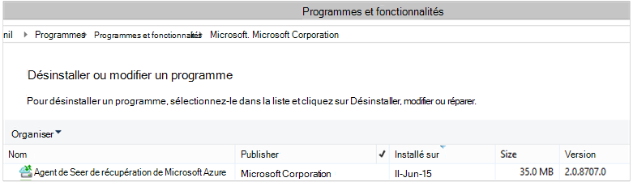

<properties
    pageTitle="Azure de sauvegarde, de déployer et de gérer précédent pour DPM à l’aide de PowerShell | Microsoft Azure"
    description="Apprenez à déployer et à gérer la sauvegarde de Azure pour Data Protection Manager (DPM) à l’aide de PowerShell"
    services="backup"
    documentationCenter=""
    authors="Nkolli1"
    manager="shreeshd"
    editor=""/>

<tags
    ms.service="backup"
    ms.workload="storage-backup-recovery"
    ms.tgt_pltfrm="na"
    ms.devlang="na"
    ms.topic="article"
    ms.date="09/27/2016"
    ms.author="jimpark; trinadhk; anuragm; markgal"/>


# <a name="deploy-and-manage-backup-to-azure-for-data-protection-manager-dpm-servers-using-powershell"></a>Déployer et gérer la sauvegarde vers Azure pour les serveurs de Data Protection Manager (DPM) à l’aide de PowerShell

> [AZURE.SELECTOR]
- [ARM](backup-dpm-automation.md)
- [Classique](backup-dpm-automation-classic.md)

Cet article vous montre comment utiliser PowerShell pour sauvegarde Azure l’installation sur un serveur DPM et pour gérer la sauvegarde et restauration.

## <a name="setting-up-the-powershell-environment"></a>Configuration de l’environnement PowerShell

[AZURE.INCLUDE [learn-about-deployment-models](../../includes/learn-about-deployment-models-include.md)]

Avant de pouvoir utiliser PowerShell pour gérer les sauvegardes de Data Protection Manager sur Azure, vous devez avoir l’environnement droite dans PowerShell. Au début de la session PowerShell, assurez-vous que vous exécutez la commande suivante pour importer les modules droite et vous permet de référencer correctement les applets de commande DPM :

```
PS C:> & "C:\Program Files\Microsoft System Center 2012 R2\DPM\DPM\bin\DpmCliInitScript.ps1"

Welcome to the DPM Management Shell!

Full list of cmdlets: Get-Command
Only DPM cmdlets: Get-DPMCommand
Get general help: help
Get help for a cmdlet: help <cmdlet-name> or <cmdlet-name> -?
Get definition of a cmdlet: Get-Command <cmdlet-name> -Syntax
Sample DPM scripts: Get-DPMSampleScript
```

## <a name="setup-and-registration"></a>Le programme d’installation et d’enregistrement
Pour commencer :

1. [Télécharger les dernière PowerShell](https://github.com/Azure/azure-powershell/releases) (version minimale requise est : 1.0.0)
2. Activer les applets de commande de sauvegarde de Azure en basculant en mode de *AzureResourceManager* à l’aide de l’applet de commande du **Commutateur-AzureMode** :

```
PS C:\> Switch-AzureMode AzureResourceManager
```

Les tâches de configuration et d’enregistrement suivantes peuvent être automatisés avec PowerShell :

- Créer un coffre-fort de sauvegarde
- Installation de l’agent de sauvegarde d’Azure
- Enregistrement avec le service de sauvegarde d’Azure
- Paramètres de mise en réseau
- Paramètres de chiffrement

### <a name="create-a-backup-vault"></a>Créer un coffre-fort de sauvegarde

> [AZURE.WARNING] Pour les clients à l’aide de la sauvegarde d’Azure pour la première fois, vous devez enregistrer le fournisseur de sauvegarde d’Azure pour être utilisé avec votre abonnement. Cela peut être effectuée en exécutant la commande suivante : « Microsoft.Backup » de Registre-AzureProvider - ProviderNamespace

Vous pouvez créer un nouveau coffre-fort de sauvegarde à l’aide de l’applet de commande **New-AzureRMBackupVault** . Le coffre-fort de sauvegarde est une ressource ARM, vous devez le placer dans un groupe de ressources. Dans une console PowerShell d’Azure avec élévation de privilèges, exécutez les commandes suivantes :

```
PS C:\> New-AzureResourceGroup –Name “test-rg” -Region “West US”
PS C:\> $backupvault = New-AzureRMBackupVault –ResourceGroupName “test-rg” –Name “test-vault” –Region “West US” –Storage GRS
```

Vous pouvez obtenir une liste de tous les coffres-forts sauvegarde dans un abonnement donné à l’aide de l’applet de commande **Get-AzureRMBackupVault** .


### <a name="installing-the-azure-backup-agent-on-a-dpm-server"></a>L’installation de l’agent de sauvegarde d’Azure sur un serveur DPM
Avant d’installer l’agent de sauvegarde d’Azure, vous avez besoin pour que le programme d’installation téléchargé et présent sur le serveur Windows. Vous pouvez obtenir la version la plus récente de l’installer à partir du [Centre de téléchargement Microsoft](http://aka.ms/azurebackup_agent) ou à partir de la page de tableau de bord du coffre-fort de la sauvegarde. Enregistrer le programme d’installation à un emplacement facile d’accès comme * C:\Downloads\*.

Pour installer l’agent, exécutez la commande suivante dans une PowerShell avec élévation de privilèges console **sur le serveur DPM**:

```
PS C:\> MARSAgentInstaller.exe /q
```

Il installe l’agent avec toutes les options par défaut. L’installation prend quelques minutes en arrière-plan. Si vous ne spécifiez pas l’option */nu* la fenêtre **Windows Update** s’ouvre à la fin de l’installation pour vérifier les mises à jour.

L’agent s’affiche dans la liste des programmes installés. Pour afficher la liste des programmes installés, accédez au **Panneau de configuration** > **programmes** > **programmes et fonctionnalités**.



#### <a name="installation-options"></a>Options d’installation
Pour afficher toutes les options disponibles via la ligne de commande, utilisez la commande suivante :

```
PS C:\> MARSAgentInstaller.exe /?
```

Les options disponibles sont les suivantes :

| Option | Détails | Par défaut |
| ---- | ----- | ----- |
| /q | Installation en mode silencieux | - |
| / p: « emplacement » | Chemin d’accès au dossier d’installation de l’agent de sauvegarde d’Azure. | Agent des Services de récupération Azure C:\Program Files\Microsoft |
| / s: « emplacement » | Chemin d’accès au dossier de cache pour l’agent de sauvegarde d’Azure. | C:\Program Files\Microsoft récupération Azure Services Agent\Scratch |
| /m | Participer à la mise à jour de Microsoft | - |
| /nu | Ne pas vérifier les mises à jour une fois l’installation terminée. | - |
| /d | Désinstalle les Services Agent de récupération de Microsoft Azure | - |
| /pH | Adresse de l’hôte proxy | - |
| PD | Numéro de Port de l’hôte proxy | - |
| /pu | Nom d’utilisateur hôte | - |
| /pw | Mot de passe proxy | - |

### <a name="registering-with-the-azure-backup-service"></a>Enregistrement avec le service de sauvegarde d’Azure
Avant de pouvoir enregistrer avec le service de sauvegarde d’Azure, vous devez vous assurer que les [conditions préalables](backup-azure-dpm-introduction.md) sont remplies. Il le faut :

- Disposer d’un abonnement Azure valide
- Avoir un coffre-fort de sauvegarde

Pour télécharger les informations d’identification de la chambre forte, exécutez l’applet de commande **Get-AzureBackupVaultCredentials** dans une console PowerShell d’Azure et stockez-la dans un emplacement pratique comme * C:\Downloads\*.

```
PS C:\> $credspath = "C:\"
PS C:\> $credsfilename = Get-AzureRMBackupVaultCredentials -Vault $backupvault -TargetLocation $credspath
PS C:\> $credsfilename
f5303a0b-fae4-4cdb-b44d-0e4c032dde26_backuprg_backuprn_2015-08-11--06-22-35.VaultCredentials
```

Inscription de l’ordinateur avec la chambre forte est effectuée à l’aide de l’applet de commande [Start-DPMCloudRegistration](https://technet.microsoft.com/library/jj612787) :

```
PS C:\> $cred = $credspath + $credsfilename
PS C:\> Start-DPMCloudRegistration -DPMServerName "TestingServer" -VaultCredentialsFilePath $cred
```

Ceci enregistrera le serveur DPM nommé « TestingServer » avec le coffre-fort Azure de Microsoft en utilisant les informations d’identification de coffre-fort spécifié.

> [AZURE.IMPORTANT] N’utilisez pas de chemins d’accès relatifs pour spécifier le fichier d’informations d’identification de coffre-fort. Vous devez fournir un chemin d’accès absolu en tant qu’entrée à l’applet de commande.

### <a name="initial-configuration-settings"></a>Paramètres de configuration initiaux
Une fois que le serveur DPM est enregistré avec le coffre-fort de la sauvegarde d’Azure, il démarre avec les paramètres d’abonnement par défaut. Ces paramètres d’abonnement incluent la mise en réseau, le cryptage et la zone de transit. Pour modifier les paramètres d’abonnement, vous devez d’abord obtenir un handle sur les paramètres (par défaut) existants à l’aide de l’applet de commande [Get-DPMCloudSubscriptionSetting](https://technet.microsoft.com/library/jj612793) :

```
$setting = Get-DPMCloudSubscriptionSetting -DPMServerName "TestingServer"
```

Toutes les modifications sont apportées à cet objet PowerShell local ```$setting``` et puis l’objet complet s’engage à DPM et sauvegarde d’Azure à les enregistrer à l’aide de l’applet de commande [Set-DPMCloudSubscriptionSetting](https://technet.microsoft.com/library/jj612791) . Vous devez utiliser le ```–Commit``` indicateur pour s’assurer que les modifications soient persistantes. Les paramètres ne seront pas appliqués et utilisés par Azure sauvegarde, sauf s’il est validé.

```
PS C:\> Set-DPMCloudSubscriptionSetting -DPMServerName "TestingServer" -SubscriptionSetting $setting -Commit
```

### <a name="networking"></a>Mise en réseau
En cas de la connectivité de l’ordinateur DPM pour le service de sauvegarde d’Azure sur internet via un serveur proxy, les paramètres du serveur proxy doivent être fournies pour réussir des sauvegardes. Pour ce faire, à l’aide de la ```-ProxyServer```, ```-ProxyPort```, ```-ProxyUsername``` et le ```ProxyPassword``` paramètres avec l’applet de commande [Set-DPMCloudSubscriptionSetting](https://technet.microsoft.com/library/jj612791) . Dans cet exemple, il n’existe aucun serveur proxy n’afin que nous sommes explicitement effacement de toutes les informations relatives au serveur proxy.

```
PS C:\> Set-DPMCloudSubscriptionSetting -DPMServerName "TestingServer" -SubscriptionSetting $setting -NoProxy
```

L’utilisation de la bande passante peut également être contrôlée avec des options de ```-WorkHourBandwidth``` et ```-NonWorkHourBandwidth``` pour un ensemble donné de jours de la semaine. Dans cet exemple, nous configurons pas toute régulation.

```
PS C:\> Set-DPMCloudSubscriptionSetting -DPMServerName "TestingServer" -SubscriptionSetting $setting -NoThrottle
```

### <a name="configuring-the-staging-area"></a>Configuration de la zone de transit
L’agent de sauvegarde d’Azure en cours d’exécution sur le serveur DPM a besoin de stockage temporaire pour les données restaurées du nuage (la zone de transit locale). Configurer la zone de transit à l’aide de l’applet de commande [Set-DPMCloudSubscriptionSetting](https://technet.microsoft.com/library/jj612791) et le ```-StagingAreaPath``` paramètre.

```
PS C:\> Set-DPMCloudSubscriptionSetting -DPMServerName "TestingServer" -SubscriptionSetting $setting -StagingAreaPath "C:\StagingArea"
```

Dans l’exemple ci-dessus, la zone de transit est fixée à *C:\StagingArea* dans l’objet PowerShell ```$setting```. Assurez-vous que le dossier spécifié existe déjà, sinon la validation finale des paramètres d’abonnement échouera.


### <a name="encryption-settings"></a>Paramètres de chiffrement
Les données de sauvegarde envoyées à Azure sauvegarde sont chiffrées pour protéger la confidentialité des données. Le mot de passe de cryptage est « password » pour décrypter les données au moment de la restauration. Il est important de conserver ces informations et la sécurité une fois qu’elle est définie.

Dans l’exemple ci-dessous, la première commande convertit la chaîne ```passphrase123456789``` une chaîne sécurisée et assigne la chaîne sécurisée à la variable nommée ```$Passphrase```. la deuxième commande définit la chaîne sécurisée en ```$Passphrase``` comme mot de passe pour crypter les sauvegardes.

```
PS C:\> $Passphrase = ConvertTo-SecureString -string "passphrase123456789" -AsPlainText -Force

PS C:\> Set-DPMCloudSubscriptionSetting -DPMServerName "TestingServer" -SubscriptionSetting $setting -EncryptionPassphrase $Passphrase
```

> [AZURE.IMPORTANT] Conserver les informations de mot de passe sûr et sécurisé dès qu’il est défini. Vous ne serez pas en mesure de restaurer les données à partir d’Azure sans ce mot de passe.

À ce stade, vous avez convient toutes les modifications requises à la ```$setting``` objet. N’oubliez pas de valider les modifications.

```
PS C:\> Set-DPMCloudSubscriptionSetting -DPMServerName "TestingServer" -SubscriptionSetting $setting -Commit
```

## <a name="protect-data-to-azure-backup"></a>Protéger les données de sauvegarde d’Azure
Dans cette section, vous ajoutez un serveur de production pour DPM et puis protéger les données sur le stockage local de DPM, puis à la sauvegarde d’Azure. Dans les exemples nous va vous montrer comment sauvegarder des fichiers et des dossiers. La logique peut être facilement étendue pour sauvegarder n’importe quelle source de données de prise en charge DPM. Toutes vos sauvegardes DPM sont régies par un groupe de Protection (PG) avec quatre parties :

1. **Les membres du groupe** est une liste de tous les protégeables objets (également appelés *sources de données* dans DPM) que vous souhaitez protéger dans le même groupe de protection. Par exemple, vous souhaiterez protéger les ordinateurs virtuels de production dans un groupe de protection et de bases de données SQL Server dans un autre groupe de protection qu’ils peuvent avoir des besoins différents. Avant de sauvegarder toute source de données sur un serveur de production que vous devez vous assurer que l’Agent DPM est installé sur le serveur et est géré par DPM. Suivez les étapes de [l’installation de l’Agent DPM](https://technet.microsoft.com/library/bb870935.aspx) et en le liant au serveur DPM approprié.
2. **Méthode de protection de données** spécifie les emplacements de sauvegarde cible - bande, disque et le nuage. Dans notre exemple, nous protégera les données sur le disque local et le nuage.
3. Une **planification de sauvegarde** qui spécifie quand les sauvegardes doivent être prises et la fréquence à laquelle les données doivent être synchronisées entre le serveur DPM et le serveur de production.
4. Une **planification de rétention** qui spécifie combien de temps conserver les points de récupération dans Azure.

### <a name="creating-a-protection-group"></a>Création d’un groupe de protection
Commencez par créer un nouveau groupe de Protection à l’aide de l’applet de commande [New-DPMProtectionGroup](https://technet.microsoft.com/library/hh881722) .

```
PS C:\> $PG = New-DPMProtectionGroup -DPMServerName " TestingServer " -Name "ProtectGroup01"
```

L’applet de commande ci-dessus crée un groupe de Protection nommée *ProtectGroup01*. Un groupe de protection existant peut également être modifié ultérieurement pour ajouter la sauvegarde vers le nuage Azure. Toutefois, pour apporter des modifications au groupe de Protection - nouvelle ou existante - nous devons obtenir un handle sur un objet *modifiable* à l’aide de l’applet de commande [Get-DPMModifiableProtectionGroup](https://technet.microsoft.com/library/hh881713) .

```
PS C:\> $MPG = Get-ModifiableProtectionGroup $PG
```

### <a name="adding-group-members-to-the-protection-group"></a>Ajout de membres d’un groupe pour le groupe de Protection
Chaque Agent DPM sait que la liste des sources de données sur lequel il est installé sur le serveur. Pour ajouter une source de données au groupe de Protection, l’Agent DPM doit envoyer tout d’abord une liste de sources de données de la publication sur le serveur DPM. Une ou plusieurs sources de données sont ensuite sélectionnés et ajoutés au groupe de Protection. Les étapes PowerShell nécessaires à atteindre sont :

1. Extraire une liste de tous les serveurs gérés par DPM par l’intermédiaire de l’Agent DPM.
2. Choisissez un serveur spécifique.
3. Extraire une liste de toutes les sources de données sur le serveur.
4. Choisissez une ou plusieurs sources de données et de les ajouter au groupe de Protection

La liste des serveurs sur lesquels l’Agent DPM est installé et est géré par le serveur DPM est acquise avec l’applet de commande [Get-DPMProductionServer](https://technet.microsoft.com/library/hh881600) . Dans cet exemple nous filtrer et configurer uniquement PS avec le nom *productionserver01* pour la sauvegarde.

```
PS C:\> $server = Get-ProductionServer -DPMServerName "TestingServer" | where {($_.servername) –contains “productionserver01”
```

Maintenant d’extraire la liste des sources de données sur ```$server``` à l’aide de l’applet de commande [Get-DPMDatasource](https://technet.microsoft.com/library/hh881605) . Dans cet exemple, nous allons filtrage pour le volume *D:\* lequel vous souhaitez configurer pour la sauvegarde. Cette source de données est ensuite ajouté au groupe de Protection à l’aide de l’applet de commande [Add-DPMChildDatasource](https://technet.microsoft.com/library/hh881732) . N’oubliez pas d’utiliser le *objet de groupe de protection modifable * ```$MPG``` pour la compléter.

```
PS C:\> $DS = Get-Datasource -ProductionServer $server -Inquire | where { $_.Name -contains “D:\” }

PS C:\> Add-DPMChildDatasource -ProtectionGroup $MPG -ChildDatasource $DS
```

Répétez cette étape autant de fois que nécessaire, jusqu'à ce que vous avez ajouté toutes les sources de données choisis pour le groupe de protection. Vous pouvez également démarrer avec une source de données et terminer le flux de travail pour créer le groupe de Protection et ultérieurement ajouter plus de sources de données au groupe de Protection.

### <a name="selecting-the-data-protection-method"></a>Sélection de la méthode de protection des données
Une fois les sources de données ont été ajoutés au groupe de Protection, l’étape suivante consiste à spécifier la méthode de protection à l’aide de l’applet de commande [Set-DPMProtectionType](https://technet.microsoft.com/library/hh881725) . Dans cet exemple, le groupe de Protection sera le programme d’installation pour le disque local et sauvegarde de nuage. Vous devez également spécifier la source de données que vous souhaitez protéger au nuage avec l’applet de commande [Add-DPMChildDatasource](https://technet.microsoft.com/library/hh881732.aspx) - indicateur en ligne.

```
PS C:\> Set-DPMProtectionType -ProtectionGroup $MPG -ShortTerm Disk –LongTerm Online
PS C:\> Add-DPMChildDatasource -ProtectionGroup $MPG -ChildDatasource $DS –Online
```

### <a name="setting-the-retention-range"></a>Définition de la durée de rétention
Définissez la rétention pour les points de sauvegarde à l’aide de l’applet de commande [Set-DPMPolicyObjective](https://technet.microsoft.com/library/hh881762) . Pendant qu’il peut sembler étrange définir la conservation avant la planification de sauvegarde a été définie, à l’aide de la ```Set-DPMPolicyObjective``` applet de commande définit automatiquement un planning de sauvegarde par défaut qui peut ensuite être modifié. Il est toujours possible pour définir la sauvegarde planifier la première et de la stratégie de rétention après.

Dans l’exemple ci-dessous, l’applet de commande définit les paramètres de rétention pour les sauvegardes sur disque. Cela conservera les sauvegardes pour 10 jours et les données de synchronisation toutes les 6 heures entre le serveur de production et le serveur DPM. Les ```SynchronizationFrequencyMinutes``` ne définit la fréquence à laquelle un point de sauvegarde est créé, mais comment souvent les données sont copiées sur le serveur DPM. Ainsi, les sauvegardes de devenir trop volumineux.

```
PS C:\> Set-DPMPolicyObjective –ProtectionGroup $MPG -RetentionRangeInDays 10 -SynchronizationFrequencyMinutes 360
```

Pour les sauvegardes à Azure (DPM désigne comme des sauvegardes en ligne) les plages de rétention peuvent être configurés pour la [rétention à long terme à l’aide d’un schéma de Grandfather-Father-Son (GFS)](backup-azure-backup-cloud-as-tape.md). Autrement dit, vous pouvez définir une stratégie de rétention combinée impliquant quotidienne, hebdomadaire, mensuelle et annuelle de rétention. Dans cet exemple, nous avons créer un tableau représentant le jeu de rétention complexes que nous et ensuite configurer la durée de rétention à l’aide de l’applet de commande [Set-DPMPolicyObjective](https://technet.microsoft.com/library/hh881762) .

```
PS C:\> $RRlist = @()
PS C:\> $RRList += (New-Object -TypeName Microsoft.Internal.EnterpriseStorage.Dls.UI.ObjectModel.OMCommon.RetentionRange -ArgumentList 180, Days)
PS C:\> $RRList += (New-Object -TypeName Microsoft.Internal.EnterpriseStorage.Dls.UI.ObjectModel.OMCommon.RetentionRange -ArgumentList 104, Weeks)
PS C:\> $RRList += (New-Object -TypeName Microsoft.Internal.EnterpriseStorage.Dls.UI.ObjectModel.OMCommon.RetentionRange -ArgumentList 60, Month)
PS C:\> $RRList += (New-Object -TypeName Microsoft.Internal.EnterpriseStorage.Dls.UI.ObjectModel.OMCommon.RetentionRange -ArgumentList 10, Years)
PS C:\> Set-DPMPolicyObjective –ProtectionGroup $MPG -OnlineRetentionRangeList $RRlist
```

### <a name="set-the-backup-schedule"></a>Définir la planification de sauvegarde
DPM définit automatiquement un planning de sauvegarde par défaut si vous spécifiez l’objectif de protection à l’aide du ```Set-DPMPolicyObjective``` applet de commande. Pour modifier les planifications par défaut, utilisez l’applet de commande [Get-DPMPolicySchedule](https://technet.microsoft.com/library/hh881749) suivie de l’applet de commande [Set-DPMPolicySchedule](https://technet.microsoft.com/library/hh881723) .

```
PS C:\> $onlineSch = Get-DPMPolicySchedule -ProtectionGroup $mpg -LongTerm Online
PS C:\> Set-DPMPolicySchedule -ProtectionGroup $MPG -Schedule $onlineSch[0] -TimesOfDay 02:00
PS C:\> Set-DPMPolicySchedule -ProtectionGroup $MPG -Schedule $onlineSch[1] -TimesOfDay 02:00 -DaysOfWeek Sa,Su –Interval 1
PS C:\> Set-DPMPolicySchedule -ProtectionGroup $MPG -Schedule $onlineSch[2] -TimesOfDay 02:00 -RelativeIntervals First,Third –DaysOfWeek Sa
PS C:\> Set-DPMPolicySchedule -ProtectionGroup $MPG -Schedule $onlineSch[3] -TimesOfDay 02:00 -DaysOfMonth 2,5,8,9 -Months Jan,Jul
PS C:\> Set-DPMProtectionGroup -ProtectionGroup $MPG
```

Dans l’exemple ci-dessus, ```$onlineSch``` est un tableau avec quatre éléments qui contient la planification existante de la protection en ligne pour le groupe de Protection dans le jeu de GFS :

1. ```$onlineSch[0]```contient la planification quotidienne
2. ```$onlineSch[1]```contient la planification hebdomadaire
3. ```$onlineSch[2]```contient la planification mensuelle
4. ```$onlineSch[3]```contient la planification annuelle

Si vous devez modifier la planification hebdomadaire, vous devez faire référence à la ```$onlineSch[1]```.

### <a name="initial-backup"></a>Sauvegarde initiale
Lorsque vous sauvegardez une source de données pour la première fois, DPM doit créer un réplica initial qui crée une copie de la source de données d’être protégées sur le volume de réplica DPM. Cette activité peut être planifiée pour une durée spécifique, ou peut être déclenchée manuellement, à l’aide de l’applet de commande [Set-DPMReplicaCreationMethod](https://technet.microsoft.com/library/hh881715) avec le paramètre ```-NOW```.

```
PS C:\> Set-DPMReplicaCreationMethod -ProtectionGroup $MPG -NOW
```
### <a name="changing-the-size-of-dpm-replica--recovery-point-volume"></a>Modification de la taille du réplica de DPM et le volume des points de récupération
Vous pouvez également modifier la taille du volume du réplica de DPM comme volume de cliché instantané à l’aide de la cmdlet [Set-DPMDatasourceDiskAllocation](https://technet.microsoft.com/library/hh881618.aspx) comme dans le Voici un exemple : Get-DatasourceDiskAllocation - source de données $DS $DS Set-DatasourceDiskAllocation - source de données - ProtectionGroup $MPG-ReplicaArea - manuel (2 Go) - ShadowCopyArea (2 Go)

### <a name="committing-the-changes-to-the-protection-group"></a>Approuver les modifications apportées au groupe de Protection
Enfin, les modifications doivent être validées avant que DPM puisse avoir la sauvegarde par la nouvelle configuration du groupe de Protection. Pour cela, à l’aide de l’applet de commande [Set-DPMProtectionGroup](https://technet.microsoft.com/library/hh881758) .

```
PS C:\> Set-DPMProtectionGroup -ProtectionGroup $MPG
```
## <a name="view-the-backup-points"></a>Afficher les points de sauvegarde
Vous pouvez utiliser l’applet de commande [Get-DPMRecoveryPoint](https://technet.microsoft.com/library/hh881746) pour obtenir la liste de tous les points de récupération pour une source de données. Dans cet exemple, nous allons :
- extraction de toutes les pages sur le serveur DPM qui est stocké dans un tableau```$PG```
- obtenir les sources de données correspondant à la```$PG[0]```
- obtenir tous les points de récupération pour une source de données.

```
PS C:\> $PG = Get-DPMProtectionGroup –DPMServerName "TestingServer"
PS C:\> $DS = Get-DPMDatasource -ProtectionGroup $PG[0]
PS C:\> $RecoveryPoints = Get-DPMRecoverypoint -Datasource $DS[0] -Online
```

## <a name="restore-data-protected-on-azure"></a>Restaurer des données protégées sur Azure
Restauration des données est une combinaison d’un ```RecoverableItem``` objet et un ```RecoveryOption``` objet. Dans la section précédente, nous avons obtenu une liste des points de sauvegarde pour une source de données.

Dans l’exemple ci-dessous, nous vous montrer comment restaurer un ordinateur virtuel Hyper-V à partir de sauvegarde Azure en combinant les points de sauvegarde avec la cible pour la restauration. Cela inclut :

- Création d’une option de récupération à l’aide de l’applet de commande [New-DPMRecoveryOption](https://technet.microsoft.com/library/hh881592) .
- L’extraction du tableau de points de sauvegarde à l’aide de la ```Get-DPMRecoveryPoint``` applet de commande.
- Choix d’un point de sauvegarde à restaurer à partir de.

```
PS C:\> $RecoveryOption = New-DPMRecoveryOption -HyperVDatasource -TargetServer "HVDCenter02" -RecoveryLocation AlternateHyperVServer -RecoveryType Recover -TargetLocation “C:\VMRecovery”

PS C:\> $PG = Get-DPMProtectionGroup –DPMServerName "TestingServer"
PS C:\> $DS = Get-DPMDatasource -ProtectionGroup $PG[0]
PS C:\> $RecoveryPoints = Get-DPMRecoverypoint -Datasource $DS[0] -Online

PS C:\> Restore-DPMRecoverableItem -RecoverableItem $RecoveryPoints[0] -RecoveryOption $RecoveryOption
```

Les commandes peuvent être facilement étendus pour n’importe quel type de source de données.

## <a name="next-steps"></a>Étapes suivantes

- Pour plus d’informations sur la sauvegarde d’Azure pour DPM, consultez [Introduction à la sauvegarde de DPM](backup-azure-dpm-introduction.md)
