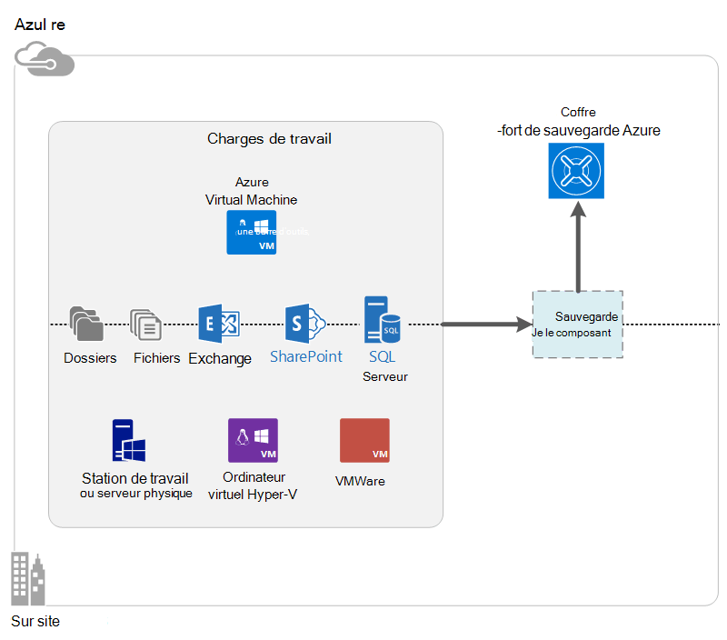

<properties
    pageTitle="Quelle est la sauvegarde d’Azure ? | Microsoft Azure"
    description="À l’aide d’Azure Services de sauvegarde et restauration, vous pouvez sauvegarder et restaurer des données et des applications à partir de serveurs Windows, les ordinateurs clients Windows, serveurs System Center DPM et les ordinateurs virtuels Azure."
    services="backup"
    documentationCenter=""
    authors="markgalioto"
    manager="cfreeman"
    editor="tysonn"
    keywords="sauvegarde et restauration ; services de récupération ; solutions de sauvegarde"/>

<tags
    ms.service="backup"
    ms.workload="storage-backup-recovery"
    ms.tgt_pltfrm="na"
    ms.devlang="na"
    ms.topic="get-started-article"
    ms.date="10/19/2016"
    ms.author="jimpark; trinadhk"/>

# Quelle est la sauvegarde d’Azure ?
Sauvegarde Azure est le service qui vous permet de sauvegarder et de restaurer vos données dans le cloud de Microsoft. Il remplace votre local existant ou une solution de sauvegarde hors site avec une solution basée sur le cloud qui est fiable, sécurisée et économique. Il vous permet également de protéger les ressources qui s’exécutent dans le nuage. Sauvegarde Azure fournit des services de récupération reposant sur une infrastructure de très haut niveau qui est évolutive, hautement disponible et durables.

[Regarder une vidéo de présentation de la sauvegarde d’Azure](https://azure.microsoft.com/documentation/videos/what-is-azure-backup/)

## Pourquoi utiliser la sauvegarde d’Azure ?
Solutions de sauvegarde traditionnelles ont évolué pour traiter le nuage comme un point de terminaison similaire aux disques ou de bandes. Cette approche est simple, il est également limité. Il ne prend pas pleinement parti d’une plate-forme de nuage sous-jacent et se traduit par une solution coûteuse et inefficace.
En revanche, sauvegarde Azure offre tous les avantages d’une solution de sauvegarde cloud puissant et abordable. Voici quelques-uns des principaux avantages que sauvegarde d’Azure fournit.

| Fonctionnalité | Avantages |
| ------- | ------- |
| Gestion automatique du stockage | Aucune dépense en capital n’est nécessaire pour les périphériques de stockage locaux. Sauvegarde Azure alloue et gère le stockage de sauvegarde automatiquement, et il utilise un modèle de consommation de salaire en tant que-vous à utiliser. |
| Un nombre illimité de mise à l’échelle | Tirer parti des garanties de haute disponibilité sans les frais de maintenance et de surveillance. Sauvegarde Azure utilise la puissance et l’échelle du nuage Azure, sous-jacent grâce à ses fonctionnalités autoscaling non intrusive. |
| Plusieurs options de stockage | Choisissez votre stockage de sauvegarde en fonction des besoins :<li>Un blob de bloc de stockage redondant localement est idéal pour les clients attentifs au prix, et il est toujours permet de protéger les données contre les défaillances matérielles locales. <li>Un blob de bloc de stockage géo-réplication fournit plus de trois copies dans un centre de données associé. Ces copies supplémentaires permettent de garantir que vos données de sauvegarde soient hautement disponibles, même si une catastrophe au niveau du site Azure se produit. |
| Transfert de données illimité | Il est sans frais pour tout transfert de données (sortant) de sortie au cours d’une opération de restauration à partir de la chambre forte de sauvegarde. Données entrant dans Azure est également gratuit. Fonctionne avec le service d’importation où elle est disponible. |
| Cryptage des données | Cryptage des données permet de sécuriser la transmission et le stockage des données de client dans le cloud public. Le mot de passe de chiffrement est stockée dans la source, et il n’est jamais transmise ou stockée dans Azure. La clé de chiffrement est nécessaire pour restaurer les données, et que le client a un accès complet aux données dans le service. |  
| Sauvegarde cohérente de l’application | Des sauvegardes cohérentes avec les applications Windows garantissent que les correctifs ne sont pas nécessaires au moment de la restauration, ce qui réduit l’objectif de temps de récupération. Cela permet aux clients de revenir plus rapidement à un état en cours d’exécution. |
| Rétention à long terme | Plutôt que de payer pour des solutions de sauvegarde sur bande hors site, pouvant être clients sauvegardées sur Azure, qui fournit une solution incontournable de bande à moindre coût. |

## Composants de sauvegarde Azure
Étant donné que la sauvegarde est une solution de sauvegarde hybride, il se compose de plusieurs composants qui fonctionnent ensemble pour activer bout en bout pour la sauvegarde et de restauration des flux de travail.

### Scénarios de déploiement

| Composant | Peut être déployé dans Azure ? | Peut être déployé sur site ? | Stockage cible pris en charge|
| --- | --- | --- | --- |
| Agent de sauvegarde Azure | 
**Oui**
 
L’agent de sauvegarde d’Azure peut être déployé sur tout ordinateur Windows serveur virtuel qui s’exécute dans Azure.
 | 
**Oui**
 
L’agent de sauvegarde peut être déployé sur une machine virtuelle de Windows Server ou une machine physique.
 | 
Coffre-fort de sauvegarde Azure
 |
| System Center Data Protection Manager (DPM) | 
**Oui**

Pour en savoir plus sur [la protection des charges de travail dans Azure à l’aide de System Center DPM](http://blogs.technet.com/b/dpm/archive/2014/09/02/azure-iaas-workload-protection-using-data-protection-manager.aspx).
 | 
**Oui**
 
Pour en savoir plus sur [la protection des charges de travail et des ordinateurs virtuels dans votre centre de données](https://technet.microsoft.com/library/hh758173.aspx).
 | 
Disque connecté localement,
 
Coffre-fort de sauvegarde Azure,
 
bande (sur site uniquement)
 |
| Serveur de sauvegarde Azure | 
**Oui**

Pour en savoir plus sur [la protection des charges de travail dans Azure à l’aide du serveur de sauvegarde Azure](backup-azure-microsoft-azure-backup.md).
 | 
**Oui**
 
Pour en savoir plus sur [la protection des charges de travail dans Azure à l’aide du serveur de sauvegarde Azure](backup-azure-microsoft-azure-backup.md).
 | 
Disque connecté localement,
 
Coffre-fort de sauvegarde Azure
 |
| Sauvegarde Azure (extension de la machine virtuelle) | 
**Oui**

Partie de tissu Azure

Spécialisé pour la [sauvegarde de l’infrastructure Azure comme un machines virtuelles de service (IaaS)](backup-azure-vms-introduction.md).
 | 
**N°**
 
Utilisez System Center DPM pour sauvegarder des ordinateurs virtuels dans votre centre de données.
 | 
Coffre-fort de sauvegarde Azure
 |

### Avantages au niveau du composant et limites

| Composant | Avantages | Limitations | Granularité de la récupération |
| --- | --- | --- | --- |
| Agent de sauvegarde (MARS) Azure | <li>Peut sauvegarder les fichiers et les dossiers sur un ordinateur Windows du système d’exploitation, physique ou virtuel (machines virtuelles peuvent être n’importe où locaux ou Azure)<li>Aucun serveur de sauvegarde distinct requis<li>Utilise le stockage en chambre forte sauvegarde Azure | <li>Restauration de trois fois un jour sauvegarde/au niveau des fichiers<li>Restauration de niveau fichier/dossier/volume uniquement, non de l’application prenant en charge<li>Aucune prise en charge de Linux | fichiers/dossiers/volumes |
| System Center Data Protection Manager | <li>Snapshots prenant en charge App (VSS)<li>Flexibilité totale pour laquelle effectuer des sauvegardes<li>Granularité de restauration (tous)<li>Permet le stockage en chambre forte Azure sauvegarde<li>Prise en charge de Linux (si hébergé sur Hyper-V) | <li>Absence de prise en charge hétérogène (VMware VM sauvegarder, la charge de travail Oracle sauvegarder).  | fichiers/dossiers/volumes / Machines virtuelles/applications |
| Serveur de sauvegarde de Microsoft Azure | <li>Snapshots prenant en charge App (VSS)<li>Flexibilité totale pour laquelle effectuer des sauvegardes<li>Granularité de restauration (tous)<li>Permet le stockage en chambre forte Azure sauvegarde<li>Prise en charge de Linux (si hébergé sur Hyper-V)<li>Ne nécessite pas une licence de System Center | <li>Absence de prise en charge hétérogène (VMware VM sauvegarder, la charge de travail Oracle sauvegarder).<li>Nécessite toujours live abonnement Azure<li>Aucune prise en charge pour la sauvegarde sur bande | fichiers/dossiers/volumes / Machines virtuelles/applications |
| Sauvegarde d’Azure VM IaaS | <li>Sauvegardes natifs pour Windows/Linux<li>Aucune installation agent spécifique<li>Sauvegarde au niveau de fabric sans qu’aucune infrastructure de sauvegarde nécessaire | <li>Une fois par jour back up/disque restauration de niveau<li>Impossible de sauvegarder sur site | Ordinateurs virtuels Tous les disques (à l’aide de PowerShell) |

## Les applications et les charges de travail peuvent être sauvegardées ?

| Charge de travail | Ordinateur source | Solution de sauvegarde Azure |
| --- | --- |---|
| Fichiers et dossiers | Windows Server | 
[L’agent de sauvegarde d’azure](backup-configure-vault.md),
 
[System Center DPM](backup-azure-dpm-introduction.md) (+ de l’agent de sauvegarde d’Azure),
 
[Serveur de sauvegarde Azure](backup-azure-microsoft-azure-backup.md) (inclut l’agent de sauvegarde d’Azure)
  |
| Fichiers et dossiers | Client Windows | 
[L’agent de sauvegarde d’azure](backup-configure-vault.md),
 
[System Center DPM](backup-azure-dpm-introduction.md) (+ de l’agent de sauvegarde d’Azure),
 
[Serveur de sauvegarde Azure](backup-azure-microsoft-azure-backup.md) (inclut l’agent de sauvegarde d’Azure)
  |
| Machine virtuelle de Hyper-V (Windows) | Windows Server | 
[System Center DPM](backup-azure-backup-sql.md) (+ de l’agent de sauvegarde d’Azure),
 
[Serveur de sauvegarde Azure](backup-azure-microsoft-azure-backup.md) (inclut l’agent de sauvegarde d’Azure)
 |
| Hyper-V virtual machine (Linux) | Windows Server | 
[System Center DPM](backup-azure-backup-sql.md) (+ de l’agent de sauvegarde d’Azure),
 
[Serveur de sauvegarde Azure](backup-azure-microsoft-azure-backup.md) (inclut l’agent de sauvegarde d’Azure)
  |
| Microsoft SQL Server | Windows Server | 
[System Center DPM](backup-azure-backup-sql.md) (+ de l’agent de sauvegarde d’Azure),
 
[Serveur de sauvegarde Azure](backup-azure-microsoft-azure-backup.md) (inclut l’agent de sauvegarde d’Azure)
  |
| Microsoft SharePoint | Windows Server | 
[System Center DPM](backup-azure-backup-sql.md) (+ de l’agent de sauvegarde d’Azure),
 
[Serveur de sauvegarde Azure](backup-azure-microsoft-azure-backup.md) (inclut l’agent de sauvegarde d’Azure)
   |
| Microsoft Exchange |  Windows Server | 
[System Center DPM](backup-azure-backup-sql.md) (+ de l’agent de sauvegarde d’Azure),
 
[Serveur de sauvegarde Azure](backup-azure-microsoft-azure-backup.md) (inclut l’agent de sauvegarde d’Azure)
   |
| IaaS Azure VM (Windows) | - | [Sauvegarde Azure (extension de la machine virtuelle)](backup-azure-vms-introduction.md) |
| IaaS Azure VM (Linux) | - | [Sauvegarde Azure (extension de la machine virtuelle)](backup-azure-vms-introduction.md) |

## Prise en charge ARM et Linux

| Composant | Prise en charge ARM | Linux (Azure visé) prise en charge |
| --- | --- | --- |
| Agent de sauvegarde (MARS) Azure | Oui | Aucun (agent uniquement sur Windows) |
| System Center Data Protection Manager | Oui (Agent d’invité) | Seule une sauvegarde uniquement cohérente de fichier Hyper-V (pas Azure VM) est possible |
| Serveur de sauvegarde Azure (MABS) | Oui (Agent d’invité) | Une seule sauvegarde uniquement de fichiers-cohérente de Hyper-V (pas Azure VM) est possible (même sous forme de DPM) |
| Sauvegarde d’Azure VM IaaS | Oui | Oui |

[AZURE.INCLUDE [learn-about-deployment-models](../../includes/learn-about-deployment-models-include.md)]

## Sauvegarder et restaurer les ordinateurs virtuels de stockage de la prime

Le service de sauvegarde d’Azure protège à présent les ordinateurs virtuels de stockage Premium.

### Sauvegarder des ordinateurs virtuels de stockage Premium

Lors de la sauvegarde d’ordinateurs virtuels de stockage Premium, le service de sauvegarde crée un emplacement intermédiaire dans le compte de stockage de la prime. L’emplacement de transit, nommé «-AzureBackup », est égale à la taille totale des données des prime des disques connectés à la machine virtuelle.

>[AZURE.NOTE] Ne modifiez pas ou modifier l’emplacement de la zone de transit.

Une fois la sauvegarde terminée, l’emplacement de transit est supprimé. Le prix de stockage utilisé pour l’emplacement de transit est compatible avec tous les [tarifs de stockage Premium](../storage/storage-premium-storage.md#pricing-and-billing).

### Restaurer les ordinateurs virtuels de stockage Premium

Prime stockage VM peut être restauré soit stockage Premium ou à la capacité de stockage. Restauration d’un point de récupération VM de stockage de prime au stockage de prime est le processus classique de restauration. Toutefois, il peut être rentable pour restaurer un point de récupération VM de stockage prime de stockage standard. Ce type de restauration peut être utilisé si vous avez besoin d’un sous-ensemble des fichiers à partir de la machine virtuelle.

## Fonctionnalités
Ces cinq tables résument les fonctionnalités de la sauvegarde est géré dans chaque composant.

### Stockage

| Fonctionnalité | Agent de sauvegarde Azure | System Center DPM | Serveur de sauvegarde Azure | Sauvegarde Azure (extension de la machine virtuelle) |
| ------- | --- | --- | --- | ---- |
| Coffre-fort de sauvegarde Azure | ![Oui][green] | ![Oui][green] | ![Oui][green] | ![Oui][green] |
| Stockage sur disque | | ![Oui][green] | ![Oui][green] |  |
| Stockage sur bande | | ![Oui][green] |  | |
| Compression (dans le stockage de sauvegarde en chambre forte) | ![Oui][green] | ![Oui][green]| ![Oui][green] | |
| Sauvegarde incrémentielle | ![Oui][green] | ![Oui][green] | ![Oui][green] | ![Oui][green] |
| Déduplication de disque | | ![Partiellement][yellow] | ![Partiellement][yellow]| | |

Le coffre-fort de la sauvegarde est la cible de stockage par défaut entre tous les composants. System Center DPM et le serveur de sauvegarde fournissent également la possibilité de disposer d’une copie de disque local. Toutefois, System Center DPM permet d’écrire des données vers un périphérique de stockage sur bande.

#### Sauvegarde incrémentielle
Chaque composant prend en charge la sauvegarde incrémentielle, quel que soit le stockage cible (disque, bande, sauvegarde coffre-fort). Sauvegarde incrémentielle permet de s’assurer que les sauvegardes sont efficaces, de temps et le stockage en transférant uniquement les modifications apportées depuis la dernière sauvegarde.

#### Compression
Les sauvegardes sont compressées pour réduire l’espace de stockage requis. Le seul composant qui n’utilise pas de compression est l’extension de la machine virtuelle. Avec l’extension de la machine virtuelle, toutes les données de sauvegarde est copié à partir du compte de stockage du client dans le coffre-fort de sauvegarde dans la même région sans le compresser. Alors que va sans compression légèrement augmente l’espace de stockage utilisé, stockant les données sans compression permet des temps de restauration plus rapides.

#### Déduplication
La déduplication est pris en charge pour System Center DPM et le serveur de sauvegarde lorsqu’il est [déployé dans un ordinateur virtuel Hyper-V](http://blogs.technet.com/b/dpm/archive/2015/01/06/deduplication-of-dpm-storage-reduce-dpm-storage-consumption.aspx). La déduplication est effectuée au niveau de l’hôte à l’aide de déduplication de Windows Server sur des disques durs virtuels (VHD) qui sont associés à l’ordinateur virtuel en tant que stockage de sauvegarde.

>[AZURE.WARNING] Déduplication n’est pas disponible dans Azure pour tous les composants de sauvegarde. Lorsque System Center DPM et le serveur de sauvegarde sont déployés dans Azure, les disques de stockage de la machine virtuelle ne peut pas être deduplicated.

### Sécurité

| Fonctionnalité | Agent de sauvegarde Azure | System Center DPM | Serveur de sauvegarde Azure | Sauvegarde Azure (extension de la machine virtuelle) |
| ------- | --- | --- | --- | ---- |
| Sécurité du réseau (pour Azure) | ![Oui][green] |![Oui][green] | ![Oui][green] | ![Partiellement][yellow]|
| Sécurité des données (dans Azure) | ![Oui][green] |![Oui][green] | ![Oui][green] | ![Partiellement][yellow]|

Tout le trafic de sauvegarde de vos serveurs dans le coffre-fort de la sauvegarde est crypté à l’aide de 256 Standard de chiffrement avancé. Les données sont envoyées via une connexion HTTPS sécurisée. Les données de sauvegarde sont également stockées dans le coffre-fort de sauvegarde sous forme cryptée. Que le client conserve le mot de passe pour déverrouiller ces données. Microsoft ne peut pas décrypter les données de sauvegarde à tout moment.

>[AZURE.WARNING] La clé utilisée pour chiffrer les données de sauvegarde est présente uniquement avec le client. Microsoft ne conserve pas une copie dans Azure et n’a pas accès à la clé. Si la clé est introuvable, Microsoft ne peut pas récupérer les données de sauvegarde.

Sauvegarde d’ordinateurs virtuels d’Azure nécessite la configuration de chiffrement *dans* l’ordinateur virtuel. Utiliser BitLocker sur les machines virtuelles Windows et **dm-crypt** sur des machines virtuelles de Linux. Sauvegarde Azure ne crypte pas automatiquement les données de sauvegarde qui est fourni par le biais de ce chemin d’accès.

### Prise en charge de charges de travail

| Fonctionnalité | Agent de sauvegarde Azure | System Center DPM | Serveur de sauvegarde Azure | Sauvegarde Azure (extension de la machine virtuelle) |
| ------- | --- | --- | --- | ---- |
| Ordinateur Windows Server--des fichiers et des dossiers | ![Oui][green] | ![Oui][green] | ![Oui][green] | |
| Ordinateur client de Windows, les fichiers et les dossiers | ![Oui][green] | ![Oui][green] | ![Oui][green] | |
| Machine virtuelle de Hyper-V (Windows) | | ![Oui][green] | ![Oui][green] | |
| Hyper-V virtual machine (Linux) | | ![Oui][green] | ![Oui][green] | |
| Microsoft SQL Server | | ![Oui][green] | ![Oui][green] | |
| Microsoft SharePoint | | ![Oui][green] | ![Oui][green] | |
| Microsoft Exchange  | | ![Oui][green] | ![Oui][green] | |
| Azure virtual machine (Windows) | | | | ![Oui][green] |
| Azure virtual machine (Linux) | | | | ![Oui][green] |

### Réseau

| Fonctionnalité | Agent de sauvegarde Azure | System Center DPM | Serveur de sauvegarde Azure | Sauvegarde Azure (extension de la machine virtuelle) |
| ------- | --- | --- | --- | ---- |
| Compression de réseau (pour le serveur de sauvegarde) | | ![Oui][green] | ![Oui][green] | |
| Compression de réseau (pour la sauvegarde en chambre forte) | ![Oui][green] | ![Oui][green] | ![Oui][green] | |
| Protocole de réseau (pour le serveur de sauvegarde) | | TCP | TCP | |
| Protocole de réseau (pour la sauvegarde en chambre forte) | HTTPS | HTTPS | HTTPS | HTTPS |

Étant donné que l’extension de la machine virtuelle lit les données directement à partir du compte de stockage Azure via le réseau de stockage, il n’est pas nécessaire d’optimiser ce trafic. Le trafic est sur le réseau local de stockage du centre de données Azure, il est généralement pas nécessaire pour la compression en raison de problèmes de bande passante.

Si vous sauvegardez vos données sur un serveur de sauvegarde (DPM ou serveur de sauvegarde), le trafic du serveur principal au serveur de sauvegarde peut être compressé pour enregistrer sur la bande passante.

#### La limitation de réseau
L’agent de sauvegarde d’Azure permet la limitation, qui vous permet de contrôler l’utilisation de la bande passante réseau pendant le transfert de données. La régulation peut être utile si vous avez besoin sauvegarder des données pendant heures de travail, mais ne souhaitez pas que le processus de sauvegarde à interférer avec tout autre trafic internet. La limitation pour les données de transfert s’applique pour sauvegarder et restaurer des activités.

### Conservation et sauvegarde

|  | Agent de sauvegarde Azure | System Center DPM | Serveur de sauvegarde Azure | Sauvegarde Azure (extension de la machine virtuelle) |
| --- | --- | --- | --- | --- |
| Fréquence de sauvegarde (dans le coffre-fort de sauvegarde) | Trois sauvegardes par jour | Deux sauvegardes par jour |Deux sauvegardes par jour | Sauvegardes par jour |
| Fréquence de sauvegarde (sur disque) | Ne s’applique pas | 
Toutes les 15 minutes pour SQL Server
 
Toutes les heures pour les autres charges de travail
 | 
Toutes les 15 minutes pour SQL Server
 
Toutes les heures pour les autres charges de travail
 |Ne s’applique pas |
| Options de rétention | Quotidien, hebdomadaire, mensuel, annuel | Quotidien, hebdomadaire, mensuel, annuel | Quotidien, hebdomadaire, mensuel, annuel |Quotidien, hebdomadaire, mensuel, annuel |
| Période de rétention | Jusqu'à 99 ans | Jusqu'à 99 ans | Jusqu'à 99 ans | Jusqu'à 99 ans |
| Points de récupération dans le coffre-fort de la sauvegarde | Un nombre illimité | Un nombre illimité | Un nombre illimité | Un nombre illimité |
| Points de récupération sur le disque local | Ne s’applique pas | 64 pour les serveurs de fichiers,  448 pour les serveurs d’Application | 64 pour les serveurs de fichiers,  448 pour les serveurs d’Application |Ne s’applique pas |
| Points de récupération sur bande | Ne s’applique pas | Un nombre illimité | Ne s’applique pas | Ne s’applique pas |

## Quel est le fichier d’informations d’identification de coffre-fort ?

Le fichier d’informations d’identification de coffre-fort est un certificat généré par le portail pour chaque sauvegarde coffre-fort. Le portail transmet ensuite la clé publique pour Access Control Service (ACS). La clé privée est fournie à l’utilisateur lors du téléchargement des informations d’identification et ensuite entrée lors de l’enregistrement de l’ordinateur. La clé privée authentifie l’ordinateur pour envoyer des données de sauvegarde à un coffre-fort identifié dans le service de sauvegarde d’Azure.

Les informations d’identification de la chambre forte sont utilisée uniquement pendant le processus d’inscription. Il est de votre responsabilité de vous assurer que le fichier d’informations d’identification de coffre-fort n’est pas compromis. S’il se trouve entre les mains d’un utilisateur non fiable, le fichier d’informations d’identification de coffre-fort utilisable pour enregistrer d’autres machines par rapport à la chambre forte même. Toutefois, étant donné que les données de sauvegarde sont cryptées à l’aide d’un mot de passe qui appartiennent uniquement au client, les données de sauvegarde existantes ne sont pas compromises. Pour atténuer ce problème, les informations d’identification de la chambre forte sont configurées pour expirer dans les 48 heures. Alors que vous pouvez télécharger les informations d’identification de la chambre forte d’une sauvegarde de chambre forte à n’importe quel nombre de fois, uniquement le fichier le plus récent est applicable pendant le processus d’inscription.

## En quoi diffère Azure sauvegarde récupération de Site Azure ?
De nombreux clients confondez sauvegarde, restauration et reprise après sinistre. Capturer des données et de fournir une sémantique de restauration, mais leurs atouts de base sont différents.

Azure la sauvegarde des données sur site et dans le cloud. Récupération de Site Azure coordonnées réplication des machines virtuelles et des serveurs physiques, le basculement et restauration automatique. Les deux services sont importants parce que votre solution de reprise après sinistre doit assurer la sécurité de vos données et récupérables (sauvegarde) *et* conserver vos charges de travail disponibles (récupération de Site) lorsque des pannes se produisent.

Les concepts suivants vous aident à prendre des décisions importantes autour de sauvegarde et de reprise après sinistre.

| Concept | Détails | Sauvegarde | De reprise après sinistre (DR) |
| ------- | ------- | ------ | ----------------- |
| Objectif de point de récupération (RPO) | Le montant de la perte de données acceptable si une restauration doit être effectuée. | Solutions de sauvegarde ont une grande variabilité dans leur RPO acceptable. Sauvegardes de machines virtuelles ont généralement un RPO d’un jour, alors que les sauvegardes de base de données ont aussi bas que 15 minutes de la RPO. | Solutions de reprise après sinistre ont RPO faible. La copie de reprise après sinistre peut être derrière en quelques secondes ou quelques minutes. |
| Objectif de temps de récupération (RTO) | La quantité de temps nécessaire pour effectuer une restauration ou restaurer. | En raison de la plus grand RPO, la quantité de données qui doit traiter une solution de sauvegarde est généralement beaucoup plus élevée, qui débouche sur plus RTO. Par exemple, il peut prendre des jours pour restaurer les données à partir de bandes, selon le temps que nécessaire pour le transport de la bande à partir d’un emplacement hors site. | Solutions de reprise après sinistre ont RTO plus petits car ils ne sont plus synchronisées avec la source. Moins de modifications doivent être traités. |
| Rétention | La durée pendant laquelle les données doivent être stockées | Pour les scénarios qui requièrent la reprise des opérations (corruption de données, suppression de fichier accidentelle, défaillance du système d’exploitation), les données de sauvegarde sont généralement conservées pendant 30 jours ou moins. Du point de vue de la mise en conformité, données doit être stockée pour plusieurs mois, voire des années. Les données de sauvegarde sont idéal pour l’archivage dans de tels cas. | Reprise après sinistre doit uniquement les données de restauration opérationnelle, qui prend en général quelques heures ou une journée. En raison de la capture de données précis utilisée dans les solutions de reprise après sinistre, à l’aide de données de reprise après sinistre pour la rétention à long terme n’est pas recommandé. |

## Étapes suivantes

Essayez une simple sauvegarde d’Azure. Pour obtenir des instructions, reportez-vous à l’une de ces didacticiels :

- [Essayez de sauvegarde Azure](backup-try-azure-backup-in-10-mins.md)
- [Essayez d’effectuer de sauvegarde Azure VM](backup-azure-vms-first-look.md)

Étant donné que ces didacticiels vous aident à sauvegarder rapidement, ils affichent uniquement le chemin d’accès plus direct pour la sauvegarde de vos données. Pour plus d’informations sur le type de sauvegarde que vous souhaitez faire, voir :

- [Sauvegarder la machine virtuelle Windows](backup-configure-vault.md)
- [Sauvegarder des charges de travail applicatives](backup-azure-microsoft-azure-backup.md)
- [Sauvegarde IaaS Azure VM](backup-azure-vms-prepare.md)

[green]: ./media/backup-introduction-to-azure-backup/green.png
[yellow]: ./media/backup-introduction-to-azure-backup/yellow.png
[red]: ./media/backup-introduction-to-azure-backup/red.png
