<properties
   pageTitle="Apprenez à sauvegarder les fichiers et dossiers à partir de Windows Azure avec sauvegarde Azure en utilisant le modèle de déploiement du Gestionnaire de ressources | Microsoft Azure"
   description="Découvrez comment sauvegarder des données de Windows Server par la création d’un coffre-fort, l’installation de l’agent des Services de récupération et sauvegarde de vos fichiers et dossiers vers Azure."
   services="backup"
   documentationCenter=""
   authors="markgalioto"
   manager="cfreeman"
   editor=""
   keywords="procédure de sauvegarde ; Comment faire pour sauvegarder"/>

<tags
   ms.service="backup"
   ms.workload="storage-backup-recovery"
   ms.tgt_pltfrm="na"
   ms.devlang="na"
   ms.topic="hero-article"
   ms.date="09/27/2016"
   ms.author="markgal;"/>

# Tout d’abord rechercher : sauvegarder des fichiers et des dossiers avec sauvegarde Azure en utilisant le modèle de déploiement du Gestionnaire de ressources

Cet article explique comment sauvegarder votre client Windows Server (ou Windows) fichiers et dossiers vers Azure avec sauvegarde Azure à l’aide du Gestionnaire de ressources. Il s’agit d’un didacticiel destiné à vous guider à travers les notions de base. Si vous souhaitez commencer à utiliser la sauvegarde d’Azure, vous êtes au bon endroit.

Si vous souhaitez en savoir plus sur la sauvegarde d’Azure, lisez cette [vue d’ensemble](backup-introduction-to-azure-backup.md).

Sauvegarde des fichiers et des dossiers vers Azure requiert ces activités :

 obtenir un abonnement Azure (si vous n’en avez pas déjà). 
 créer un coffre-fort de Services de récupération. 
 télécharger les fichiers nécessaires. 
 l’installation et le Registre de l’agent des Services de récupération. 
 sauvegarder vos fichiers et dossiers.

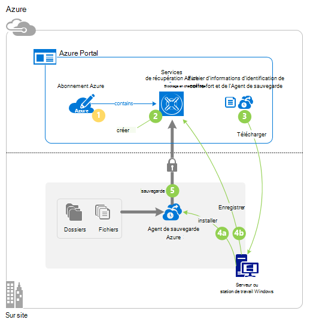

## Étape 1 : Obtenir un abonnement Azure

Si vous n’avez pas un abonnement Azure, créez un [compte gratuit](https://azure.microsoft.com/free/) qui vous permet d’accéder à n’importe quel service Azure.

## Étape 2 : Créer un coffre-fort de Services de récupération

Pour sauvegarder vos fichiers et dossiers, vous devez créer un coffre-fort de Services de récupération dans la région où vous souhaitez stocker les données. Vous devez également déterminer comment vous souhaitez que votre stockage répliqué.

### Pour créer un coffre-fort de Services de récupération

1. Si vous n’avez pas déjà fait, connectez-vous au [Portail Azure](https://portal.azure.com/) à l’aide de votre abonnement Azure.

2. Dans le menu de concentrateur, cliquez sur **Parcourir** et dans la liste des ressources, tapez **Les Services de récupération** et cliquez sur **Services de récupération des coffres-forts**.

    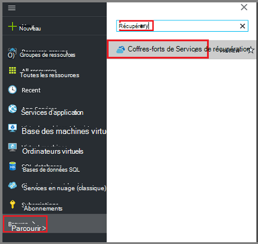  

3. Dans le menu des **Services de récupération des coffres-forts** , cliquez sur **Ajouter**.

    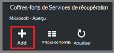

    La lame de coffre-fort de Services de restauration s’ouvre, vous invitant à fournir un **nom**, un **abonnement**, un **groupe de ressources**et un **emplacement**.

    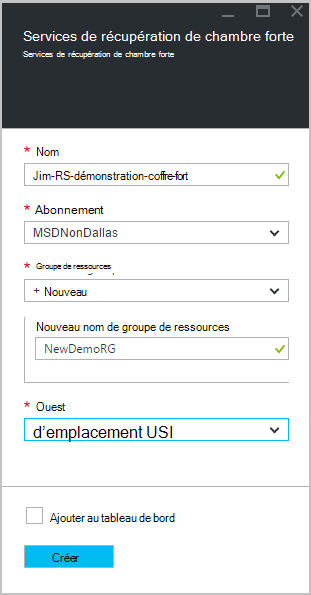

4. Pour **nom**, entrez un nom convivial pour identifier le coffre-fort.

5. Cliquez sur l' **abonnement** pour visualiser la liste des abonnements disponibles.

6. Cliquez sur le **groupe de ressources** pour afficher la liste des groupes de ressources disponibles, ou cliquez sur **Nouveau** pour créer un nouveau groupe de ressources.

7. Cliquez sur l' **emplacement** pour sélectionner la zone géographique pour la chambre forte. Ce choix détermine la zone géographique où vos données de sauvegarde sont envoyées.

8. Cliquez sur **créer**.

    Si vous ne voyez pas votre coffre-fort répertorié une fois qu’elle est terminée, cliquez sur **Actualiser**. Lors de l’actualisation de la liste, cliquez sur le nom de la chambre forte.

### Pour déterminer la redondance du stockage
Lorsque vous créez un coffre-fort de Services de récupération vous déterminez la façon dont le stockage est répliquée.

1. Cliquez sur le nouveau coffre-fort pour ouvrir le tableau de bord.

2. De la lame de **paramètres** , qui s’ouvre automatiquement avec votre tableau de bord de coffre-fort, cliquez sur **l’Infrastructure de sauvegarde**.

3. De la lame de l’Infrastructure de sauvegarde, cliquez sur **Configuration de la sauvegarde** pour afficher le **type de réplication de stockage**.

    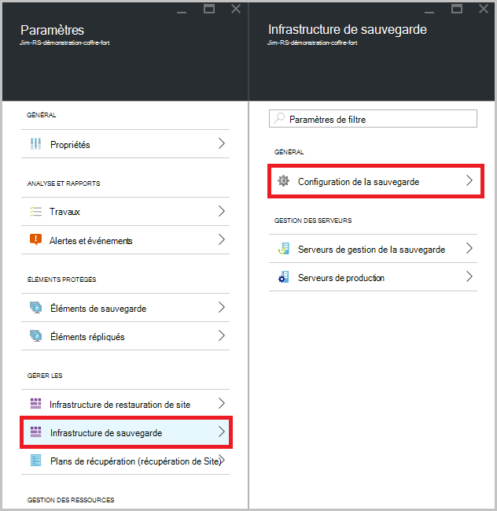

4. Choisissez l’option de réplication de stockage approprié pour Password vault.

    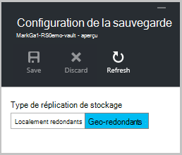

    Par défaut, votre coffre-fort a stockage redondant geo. Si vous utilisez Azure sous la forme d’un point de terminaison de stockage de sauvegarde principal, poursuivre l’utilisation du stockage redondant geo. Si vous utilisez Azure sous la forme d’un point de terminaison de stockage de sauvegarde non primaire, puis choisissez un stockage redondant localement, ce qui permet de réduire le coût de stockage des données dans Azure. En savoir plus sur [géo-redondants](../storage/storage-redundancy.md#geo-redundant-storage) et des options de stockage [redondants localement](../storage/storage-redundancy.md#locally-redundant-storage) dans cette [vue d’ensemble](../storage/storage-redundancy.md).

Maintenant que vous avez créé un coffre-fort, vous préparez votre infrastructure pour sauvegarder des fichiers et des dossiers en téléchargeant les informations d’identification Microsoft Azure récupération Services agent et le coffre-fort.

## Étape 3 : télécharger des fichiers

1. Cliquez sur **paramètres** dans le tableau de bord Services de restauration en chambre forte.

    

2. Cliquez sur **mise en route > sauvegarde** sur la lame de paramètres.

    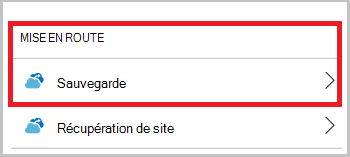

3. Cliquez sur **les objectifs de sauvegarde** sur la lame de sauvegarde.

    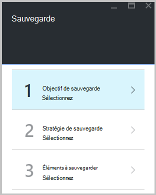

4. Sélectionnez **sur site** à partir de la page où est votre charge de travail en cours d’exécution ? menu.

5. Sélectionnez les **fichiers et dossiers** à partir de la page que voulez-vous sauvegarder ? menu, puis cliquez sur **OK**.

### Téléchargez l’agent des Services de récupération

1. Cliquez sur **Télécharger l’Agent pour Windows Server ou Client Windows** la lame de **l’infrastructure de la préparation** .

    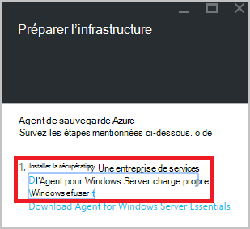

2. Cliquez sur **Enregistrer** dans la fenêtre de téléchargement. Par défaut, le fichier **MARSagentinstaller.exe** est enregistré dans votre dossier de téléchargement.

### Téléchargement des informations d’identification de la chambre forte

1. Cliquez sur **téléchargement > Enregistrer** sur la blade d’infrastructure de préparation.

    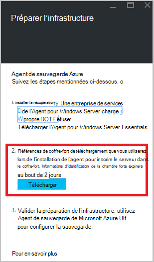

## Étape 4 : installer et inscrire l’agent

>[AZURE.NOTE] L’activation de sauvegarde via le portail Azure sera bientôt disponible. À ce stade, l’Agent des Services de récupération Microsoft Azure sur site vous permet de sauvegarder vos fichiers et dossiers.

1. Recherchez et double-cliquez sur le **MARSagentinstaller.exe** dans le dossier Téléchargements (ou tout autre emplacement enregistré).

2. Terminer l’Assistant Installation de l’Agent Microsoft Azure récupération Services. Pour terminer l’Assistant, vous devez :

    - Choisissez un emplacement pour l’installation et le dossier du cache.
    - Si vous utilisez un serveur proxy pour se connecter à internet, fournir votre proxy d’informations sur le serveur.
    - Fournir aux utilisateurs les informations de nom et de mot de passe si vous utilisez un proxy authentifié.
    - Fournir les informations d’identification de coffre-fort téléchargé
    - Enregistrer le mot de passe de chiffrement dans un emplacement sécurisé.

    >[AZURE.NOTE] Si vous perdez ou oubliez le mot de passe, Microsoft ne peut pas vous aider à récupérer les données de sauvegarde. Enregistrez le fichier dans un emplacement sécurisé. Il est nécessaire de restaurer une sauvegarde.

L’agent est maintenant installé et votre ordinateur est inscrit dans la chambre forte. Vous êtes prêt à configurer et planifier votre sauvegarde.

## Étape 5 : Sauvegarde de vos fichiers et dossiers

La sauvegarde initiale inclut deux tâches essentielles :

- Planification de la sauvegarde
- Sauvegarder des fichiers et des dossiers pour la première fois

Pour terminer la sauvegarde initiale, vous utilisez l’agent des Services de récupération de Microsoft Azure.

### Pour planifier la sauvegarde

1. Ouvrez l’agent des Services de récupération de Microsoft Azure. Vous pouvez le trouver en recherchant votre machine **Microsoft Azure Backup**.

    

2. L’agent des Services de récupération, cliquez sur **Planifier la sauvegarde**.

    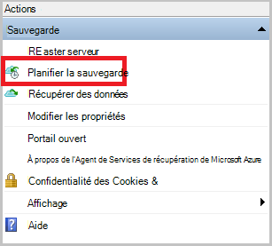

3. Dans la page mise en route de l’Assistant Planification de sauvegarde, cliquez sur **suivant**.

4. Dans la sélection d’articles pour la page de sauvegarde, cliquez sur **Ajouter des éléments**.

5. Sélectionnez les fichiers et les dossiers que vous souhaitez sauvegarder, puis cliquez sur **OK**.

6. Cliquez sur **suivant**.

7. Dans la page **Spécifier la planification de sauvegarde** , spécifiez la **planification de la sauvegarde** , puis cliquez sur **suivant**.

    Vous pouvez planifier quotidiennement (au taux maximal de trois fois par jour) ou des sauvegardes hebdomadaires.

    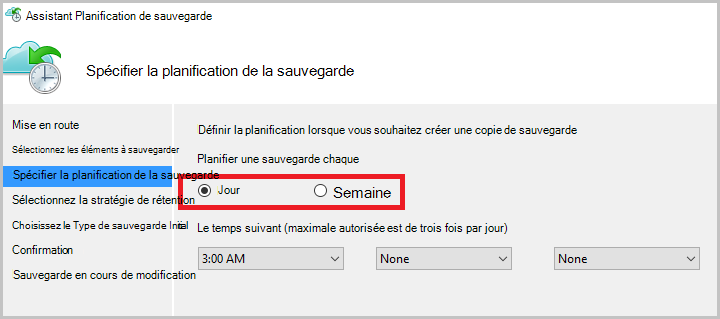

    >[AZURE.NOTE] Pour plus d’informations sur la spécification de la planification de sauvegarde, consultez l’article [Utilisation Azure sauvegarde pour remplacer votre infrastructure de bandes](backup-azure-backup-cloud-as-tape.md).

8. Dans la page **Sélectionnez une stratégie de rétention** , sélectionnez la **Stratégie de rétention** pour la copie de sauvegarde.

    La stratégie de rétention spécifie la durée pour laquelle la sauvegarde sera stockée. Plutôt que simplement spécifier une stratégie « plat » pour tous les points de sauvegarde, vous pouvez spécifier des stratégies de rétention différentes selon lorsque la sauvegarde se produit. Vous pouvez modifier les stratégies de rétention quotidienne, hebdomadaire, mensuelle et annuelle pour répondre à vos besoins.

9. Dans la page Choisir un Type de sauvegarde initiale, choisissez le type de sauvegarde initial. Laissez l’option **automatiquement sur le réseau** sélectionné, puis cliquez sur **suivant**.

    Vous pouvez sauvegarder automatiquement sur le réseau, ou vous pouvez sauvegarder en mode hors connexion. Le reste de cet article décrit le processus de sauvegarde automatiquement. Si vous préférez effectuer une sauvegarde en mode hors connexion, consultez l’article de [workflow de sauvegarde en mode hors connexion dans Azure sauvegarde](backup-azure-backup-import-export.md) pour plus d’informations.

10. Sur la page de Confirmation, passez en revue les informations, puis cliquez sur **Terminer**.

11. Une fois que l’Assistant a terminé la création de la planification de sauvegarde, cliquez sur **Fermer**.

### Pour sauvegarder des fichiers et des dossiers pour la première fois

1. L’agent des Services de récupération, cliquez sur **Sauvegarder maintenant** pour effectuer l’amorçage initial sur le réseau.

    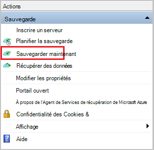

2. Sur la page de Confirmation, passez en revue les paramètres de l’Assistant sauvegarde des maintenant permet de sauvegarder l’ordinateur. Puis cliquez sur **Sauvegarder**.

3. Cliquez sur **Fermer** pour fermer l’Assistant. Si vous le faites avant la fin du processus de sauvegarde, l’Assistant continue à s’exécuter en arrière-plan.

Une fois la sauvegarde initiale terminée, l’état de **travail terminé** s’affiche dans la console de sauvegarde.

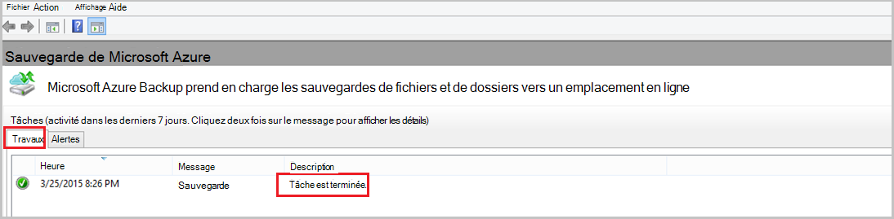

## Questions ?
Si vous avez des questions, ou s’il existe une fonctionnalité que vous souhaitez voir inclus, [nous envoyer vos commentaires](http://aka.ms/azurebackup_feedback).

## Étapes suivantes
- Obtenir plus de détails sur la [sauvegarde des machines Windows](backup-configure-vault.md).
- Maintenant que vous avez sauvegardé vos fichiers et dossiers, vous pouvez [gérer vos serveurs et vos coffres-forts](backup-azure-manage-windows-server.md).
- Si vous avez besoin de restaurer une sauvegarde, utilisez cet article pour [restaurer les fichiers vers un ordinateur Windows](backup-azure-restore-windows-server.md).
