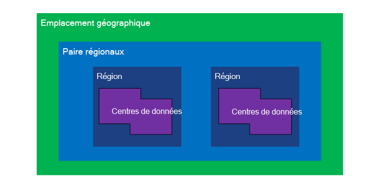
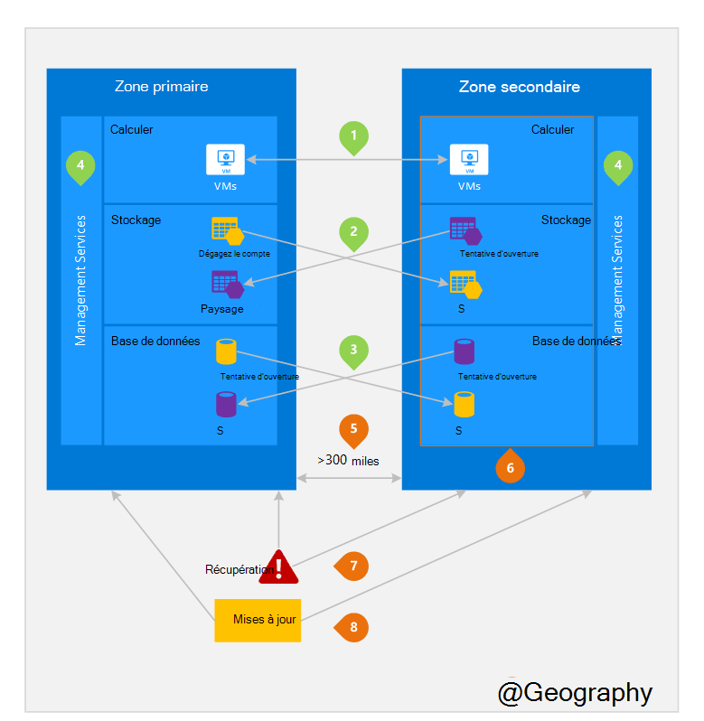

<properties
    pageTitle="Continuité d’activité et de reprise après sinistre reprise d’activité (BCDR) : régions associés d’Azure | Microsoft Azure"
    description="Les paires régionaux Azure Assurez-vous qu’applications résilientes lors de défaillances de centre de données."
    services="site-recovery"
    documentationCenter=""
    authors="rayne-wiselman"
    manager="jwhit"
    editor=""/>

<tags
    ms.service="site-recovery"
    ms.workload="storage-backup-recovery"
    ms.tgt_pltfrm="na"
    ms.devlang="na"
    ms.topic="article"
    ms.date="08/23/2016"
    ms.author="raynew"/>

# Continuité d’activité et de reprise après sinistre reprise d’activité (BCDR) : régions associés d’Azure

## Quels sont appariés régions ?

Azure opère dans plusieurs régions du monde. Une géographie Azure est une zone définie du monde qui contient au moins une région d’Azure. Une région Azure est une zone dans une zone géographique qui contient un ou plusieurs centres de données.

Chaque région Azure est associée à une autre région au sein de la même géographie, créant ainsi une paire régionale. L’exception est sud du Brésil qui est associé à une zone en dehors de sa zone géographique.

Figure 1 : schéma d’Azure paire régionaux

| Emplacement géographique     |  Paires de régions  |                     |
| :-------------| :-------------   | :-------------      |
| Amérique du Nord | États-Unis centre nord | États-Unis centre sud    |
| Amérique du Nord | Les États-Unis          | États-Unis Ouest             |
| Amérique du Nord | États-Unis East 2        | États-Unis centre          |
| Amérique du Nord | États-Unis Ouest 2        | Ouest des États-Unis centre     |
| Europe        | Europe du Nord     | Europe de l’ouest         |
| Asie          | Asie du Sud-est  | Asie de l’est           |
| Chine         | Chine orientale       | En Chine du Nord         |
| Japon         | Nord-est du Japon       | Ouest du Japon          |
| Brésil        | Sud du Brésil (1) | États-Unis centre sud    |
| Australie     | Est de l’Australie   | Sud-est de l’Australie |
| Gouvernement des États-Unis | US Gov Iowa      | US Gov Virginie     |
| Inde         | Central de l’Inde    | Sud-est de l’Inde         |
| Canada        | Canada Central   | Est du Canada         |
| ROYAUME-UNI            | Ouest du Royaume-Uni          | Sud du Royaume-Uni            |

Tableau 1 : mise en correspondance des paires de régionaux azure

> (1) sud du Brésil est unique car il est associé à une zone en dehors de son propre emplacement géographique. La région du sud du Brésil secondaire est sud du Sud États-Unis zone secondaire n’est pas sud du Brésil

Nous vous recommandons de répliquer les charges de travail sur des paires régionaux de bénéficier des stratégies d’isolation et de la disponibilité d’Azure. Par exemple, les mises à jour planifiées système Azure sont déployés séquentiellement (pas en même temps) dans les régions appariées. Cela signifie que même dans les rares cas d’une mise à jour défectueux, les deux régions ne seront pas affectées simultanément. En outre, dans l’éventualité peu probable d’une panne de large, récupération d’au moins une région de chaque paire est une priorité.

## Un exemple de régions appariées
Figure 2 ci-dessous montre une application hypothétique qui utilise la paire régionale de reprise après sinistre. Les numéros verts mettez en surbrillance les activités inter-région de trois services Azure (Azure Compute, de stockage et de base de données) et la façon dont ils sont configurés pour répliquer sur les régions. Les avantages uniques du déploiement dans les régions associées sont mis en évidence par les numéros oranges.

Figure 2 : paire de régionaux Azure hypothétique

## Activités de cross-région
Conformément à la figure 2.

 **Azure Compute (PaaS)** , vous devez configurer des ressources de calcul supplémentaire à l’avance afin de garantir les ressources sont disponibles dans une autre région au cours d’un reprise après sinistre. Pour plus d’informations, consultez les [conseils techniques de résilience Azure](./resiliency/resiliency-technical-guidance.md).

 **Azure Storage** - stockage redondant Geo (GRS) est configuré par défaut lors de la création d’un compte de stockage Azure. Avec GRS, vos données sont automatiquement répliquées trois fois dans la région principale et trois fois dans la région associée. Pour plus d’informations, consultez [Options de redondance du stockage Azure](storage/storage-redundancy.md).

 de **Bases de données SQL Azure** – avec Azure SQL géo-réplication Standard, vous pouvez configurer la réplication asynchrone des transactions à une région appariée. Avec prime géo-réplication, vous pouvez configurer la réplication pour n’importe quelle région dans le monde ; Toutefois, nous vous recommandons de que déployer ces ressources dans une région associée pour la plupart des scénarios de reprise après sinistre. Pour plus d’informations, consultez [Géo-réplication dans la base de données de SQL Azure](./sql-database/sql-database-geo-replication-overview.md).

 **Azure Resource Manager (ARM)** - ARM offre par nature d’isolation logique des composants de gestion de service entre les régions. Cela signifie que des échecs logiques dans une région sont moins susceptibles de toucher une autre.

## Avantages des régions appariées
Conformément à la figure 2.  

l'**isolement physique** – lorsque cela est possible, Azure préfère au moins 300 miles de séparation entre les centres de données dans une paire régionale, même si ce n’est pas pratique ou possible dans toutes les régions géographiques. Séparation de centre de données physique réduit les risques de catastrophes naturelles, les troubles civils, pannes de courant ou les pannes de réseau physique qui affectent à la fois de deux régions. L’isolation est soumis aux contraintes de la géographie (taille de géographie, disponibilité de l’infrastructure réseau et d’alimentation, réglementations, etc.).  

de**réplication fournis par la plate-forme** - certains services tels que le stockage redondant Geo fournissent une réplication automatique vers la zone de paires.

**ordre de recouvrement de région** – en cas de panne de large, la récupération d’une région est prioritaire sur toutes les paires. Les applications qui sont déployées à travers des régions appariées garanties que l’une des régions récupérées à l’aide de priorité. Si une application est déployée dans les régions qui ne sont pas appariées, récupération peut être retardée, dans le pire des cas que les régions choisies peuvent être les deux à recouvrer.

**mises à jour de séquentiel** – système planifiées de Azure mises à jour sont déployées aux régions associées dans l’ordre (pas en même temps) afin de minimiser les temps d’arrêt, l’effet des bogues et erreurs de logiques dans les rares cas d’un échec de la mise à jour.

**délégation de données** – une région réside dans la géographie de même que sa paire (à l’exception du sud du Brésil) afin de répondre aux exigences de la délégation de données à des fins fiscales et droit application juridiction.

