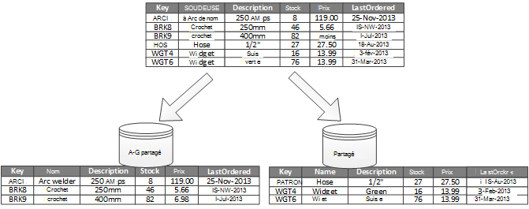
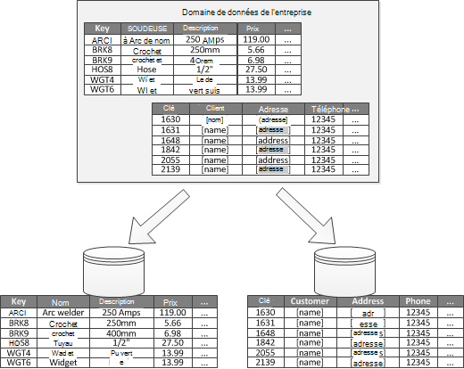

<properties
   pageTitle="Conseils de partitionnement des données | Microsoft Azure"
   description="Conseils pour savoir comment séparer les partitions pour être gérés et accessibles séparément."
   services=""
   documentationCenter="na"
   authors="dragon119"
   manager="christb"
   editor=""
   tags=""/>

<tags
   ms.service="best-practice"
   ms.devlang="na"
   ms.topic="article"
   ms.tgt_pltfrm="na"
   ms.workload="na"
   ms.date="07/14/2016"
   ms.author="masashin"/>

# Conseils de partitionnement de données

[AZURE.INCLUDE [pnp-header](../includes/guidance-pnp-header-include.md)]

## Vue d’ensemble

Dans de nombreuses solutions à grande échelle, les données sont réparties sur des partitions distinctes qui peuvent être gérées et accessibles séparément. La stratégie de partitionnement doit être choisie avec soin pour maximiser les avantages tout en minimisant les effets néfastes. Le partitionnement peut aider à améliorer l’évolutivité, de réduire la contention et d’optimiser les performances. Un autre avantage de partitionnement est qu’il peut fournir un mécanisme permettant de diviser des données par le modèle d’utilisation. Par exemple, vous pouvez archiver des données (à froid) plus anciennes et moins actifs dans le stockage de données moins cher.

## Pourquoi partitionner les données ?

La plupart des applications en nuage et les services de stockent et récupérer des données dans le cadre de leurs opérations. La conception des banques de données qu’une application utilise peut avoir une incidence considérable sur les performances, le débit et l’évolutivité d’un système. Une technique couramment appliquée dans les systèmes à grande échelle consiste à répartir les données sur des partitions distinctes.

> Le terme _de partitionnement_ qui est utilisé dans ce guide désigne le processus de décomposition physiquement les données dans des stockages de données distincts. Ce n’est pas le même que le partitionnement de tables SQL Server, qui est un concept différent.

Partitionnement des données contribuent à un certain nombre d’avantages. Par exemple, il peut être appliqué de manière à :

- **Évolutivité de l’améliorer**. Lorsque vous redimensionnez un système de base de données unique, il atteignent une limite de matériel physique. Si vous divisez les données sur plusieurs partitions, chacune d'entre elles est hébergé sur un serveur distinct, vous pouvez évoluer le système quasiment indéfiniment.
- **Amélioration des performances**. Opérations d’accès aux données de chaque partition ont lieu sur un plus petit volume de données. Si les données sont partitionnées de manière appropriée, le partitionnement peut rendre votre système plus efficace. Les opérations qui affectent plusieurs partitions peuvent s’exécuter en parallèle. Chaque partition peut être située près de l’application qui l’utilise pour réduire la latence du réseau.
- **Améliorer la disponibilité**. Répartir les données sur plusieurs serveurs permet d’éviter un point de défaillance unique. Si un serveur tombe en panne, ou est en cours de maintenance planifiée, seules les données dans cette partition n’est pas disponible. Opérations sur d’autres partitions peuvent continuer. Augmentation du nombre de partitions permet de réduire l’incidence relative de la défaillance d’un seul serveur en réduisant le pourcentage de données qui ne seront pas disponibles. Réplication de chaque partition permet de réduire le risque d’une défaillance de la partition unique qui affectent les opérations. Il permet également de séparer les données critiques qui doivent être continuellement et hautement disponible à partir des données de faible valeur qui a des exigences de disponibilité moindres (fichiers journaux, par exemple).
- **Sécurité améliorée**. Selon la nature des données et la façon dont il est partitionné, il est possible de séparer les données sensibles et non sensibles dans différentes partitions et donc à des serveurs différents ou des données stocke. Sécurité peut ensuite être spécialement optimisée pour les données sensibles.
- **Souplesse de fournir**. Ce dernier offre de nombreuses opportunités de fines paramétrage des opérations, optimise l’efficacité administrative et en réduisant les coûts. Par exemple, vous pouvez définir des stratégies différentes pour la gestion, de surveillance, sauvegarde et restauration et autres tâches d’administration en fonction de l’importance des données de chaque partition.
- **Correspondance de la banque de données pour le modèle d’utilisation**. Le partitionnement permet de chaque partition pour être déployés sur un autre type de magasin de données, en fonction du coût et de fonctionnalités intégrées qu’offres du magasin de données. Par exemple, données binaires volumineuses peuvent être stockées dans un magasin de données blob tandis que plus les données structurées peuvent être contenues dans une base de données de document. Pour plus d’informations, consultez [Création d’une solution polyglot] dans le guide des modèles et pratiques et [d’accès aux données pour les solutions hautement évolutives : à l’aide de SQL, NoSQL et persistance polyglot] sur le site Web de Microsoft.

Certains systèmes n’implémentent pas la partition car il est considéré comme un coût plutôt qu’un avantage. Ce raisonnement est couramment est les suivantes :

- De nombreux systèmes de stockage de données ne gèrent pas les jointures entre partitions et il peut être difficile à maintenir l’intégrité référentielle dans un système partitionné. Il est souvent nécessaire de mettre en oeuvre les jointures et les vérifications d’intégrité dans le code de l’application (dans la couche de partitionnement), qui peut entraîner des e/s supplémentaires et de la complexité des applications.
- Maintenance des partitions n’est pas toujours une tâche facile. Dans un système où les données sont volatiles, vous devrez rééquilibrer les partitions régulièrement afin de réduire la contention et réactives.
- Certains outils courants ne fonctionnent pas naturellement avec des données partitionnées.

## Création de partitions

Données peuvent être partitionnées de différentes manières : horizontalement, verticalement ou point de vue fonctionnel. La stratégie que vous choisissez dépend de la raison pour partitionner les données et les exigences des applications et des services qui utilisent les données.

> [AZURE.NOTE] Les schémas de partitionnement décrits dans ce guide sont expliqués de façon indépendante de la technologie de stockage de données sous-jacent. Elles peuvent être appliquées à de nombreux types de magasins de données, y compris relationnelles et les bases de données NoSQL.

### Stratégies de partitionnement

Les trois stratégies par défaut pour le partitionnement des données sont les suivantes :

- **Le partitionnement horizontal** (souvent appelés _ont_). Dans cette stratégie, chaque partition est un magasin de données à part entière, mais toutes les partitions ont le même schéma. Chaque partition est appelée un _partagé_ et conserve un sous-ensemble spécifique de données, comme toutes les commandes pour un ensemble spécifique de clients dans une application de commerce électronique.
- **Le partitionnement vertical**. Dans cette stratégie, chaque partition contient un sous-ensemble des champs pour les articles dans le magasin de données. Les champs sont organisés selon leur modèle d’utilisation. Par exemple, les champs fréquemment utilisés peuvent être placées dans une partition verticale et moins de champs fréquemment utilisés dans un autre.
- **Le partitionnement fonctionnel**. Dans cette stratégie, les données sont regroupées en fonction de comment il est utilisé par chaque contexte délimitée dans le système. Par exemple, un système de commerce électronique qu’implémente séparer les fonctions de l’entreprise pour la facturation et gestion des stocks du produit peuvent stocker des données dans une partition et produit les données de stock dans une autre.

Il est important de noter que les trois stratégies décrites ici peuvent être combinés. Ils ne sont pas mutuellement exclusives, et nous vous recommandons de mette tous les lors de la création d’un schéma de partitionnement. Par exemple, vous pourriez diviser les données en milieu des fragments et utilisent le partitionnement vertical pour diviser plus encore les données dans chaque partagé. De même, les données dans une partition fonctionnelle peuvent être divisées en milieu des fragments (qui peuvent également être partitionnées verticalement).

Cependant, les différentes exigences de chaque stratégie peuvent déclencher un certain nombre de problèmes en conflit. Vous devez évaluer et équilibrer tous ces éléments lors de la conception d’un schéma de partitionnement qui répond aux objectifs spécifiques de performances globale de traitement de données de votre système. Les sections suivantes détaillent chacun des stratégies plus en détail.

### Horizontal, partitionnement (ont)

La figure 1 montre une vue d’ensemble du partitionnement horizontal ou ont. Dans cet exemple, les données d’inventaire produit sont divisées en milieu des fragments en fonction de la clé de produit. Chaque partagé conserve les données pour une plage contiguë de clés partagé (A-G et H-Z), classés par ordre alphabétique.

_La figure 1. Partitionnement horizontal des données (ont) basées sur une clé de partition_

Ont vous aide à répartir la charge sur plusieurs ordinateurs, ce qui réduit les conflits et améliore les performances. Vous pouvez adapter le système en ajoutant davantage de milieu des fragments qui s’exécutent sur des serveurs supplémentaires.

Le facteur le plus important lors de la mise en œuvre de cette stratégie de partitionnement est le choix de la clé de l’ont. Il peut être difficile de modifier la clé après que le système est en fonctionnement. La clé doit s’assurer que les données sont partitionnées afin que la charge de travail est aussi homogènes que possible sur les milieu des fragments.

Notez que les différents milieu des fragments n’ont pas à contenir des volumes de données similaires. Au lieu de cela, le plus est important afin d’équilibrer le nombre de demandes. Certains milieu des fragments peuvent être très volumineux, mais chaque élément fait l’objet d’un faible nombre d’opérations d’accès. Milieu des autres fragments peuvent être plus petites, mais chaque élément est beaucoup plus fréquemment sollicitée. Il est également important de s’assurer qu’un unique partagé ne dépasse pas les limites d’échelle (en termes de capacité et les ressources de traitement) du magasin de données qui est utilisé pour héberger ce partagé.

Si vous utilisez un schéma ont, évitez de créer des zones réactives (ou les partitions à chaud) qui peut affecter les performances et la disponibilité. Par exemple, si vous utilisez un hachage d’un identificateur de client au lieu de la première lettre du nom d’un client, vous empêchez la distribution non soldée résultant des premières lettres en commun et moins courants. Il s’agit d’une technique classique qui aide à répartir plus équitablement les données entre les partitions.

Choisissez une clé ont qui minimise les besoins futurs pour fractionner le grands milieu des fragments en éléments plus petits, milieu des petits fragments de fusion dans des partitions plus grandes, ou modifier le schéma qui décrit les données stockées dans un ensemble de partitions. Ces opérations peuvent prendre beaucoup de temps et peuvent nécessiter la mise hors connexion de milieu un ou plusieurs des fragments pendant qu’elles sont effectuées.

Si le milieu des fragments sont répliquées, il peut être possible de conserver des répliques en ligne alors que d’autres sont fractionnées, fusionnées ou reconfigurés. Toutefois, le système devrez peut-être limiter les opérations qui peuvent être effectuées sur les données de ces milieu des fragments pendant la reconfiguration. Par exemple, les données de réplicas peuvent être marquées en lecture seule pour limiter l’étendue des incohérences qui peuvent survenir pendant que le milieu des fragments sont en cours de restructuration.

> Pour plus d’informations et des conseils sur la plupart de ces considérations et techniques de bonnes pratiques pour la conception des magasins de données qui implémentent le partitionnement horizontal, [ont]voient.

### Le partitionnement vertical

L’utilisation la plus courante pour le partitionnement vertical est de réduire les e/s et des coûts de performance associés à l’extraction les éléments qui sont plus souvent accessibles. La figure 2 montre un exemple de partitionnement vertical. Dans cet exemple, les différentes propriétés pour chaque élément de données sont trouvent dans des partitions différentes. Une partition conserve les données qui se trouve plus fréquemment, y compris le nom, description et les informations de prix pour les produits. Un autre conserve le volume dans le stock et la dernière date d’ordonnée.

_La figure 2. Partitionnement vertical des données par son modèle d’utilisation_

Dans cet exemple, l’application interroge régulièrement le nom du produit, description et prix lorsque vous affichez les détails du produit aux clients. La date lorsque le produit a été dernier commandé auprès du fabricant et le niveau de stock sont stockés dans une partition distincte, car ces deux éléments sont utilisés ensemble.

Ce schéma de partitionnement a l’avantage que les données relativement lente (nom du produit, description et prix) sont séparées à partir des données plus dynamiques (niveau de stock et dernière date ordonnée). Une application peut s’avérer utile pour mettre en cache les données dans la mémoire à déplacement lent si elle est fréquemment.

Un autre scénario courant pour cette stratégie de partitionnement est d’optimiser la sécurité des données sensibles. Par exemple, vous pouvez cela en stockant les numéros de carte de crédit et les numéros de vérification de sécurité carte correspondant dans des partitions distinctes.

Le partitionnement vertical peut également réduire la quantité d’accès simultané aux données que nécessaire.

> Le partitionnement vertical fonctionne au niveau de l’entité dans un magasin de données, normalisation d’une entité pour décomposer à partir d’un _large_ à un ensemble d’éléments de _réduire_ partiellement. Il est parfaitement adapté pour les banques de données de colonne comme HBase et Cassandra. Si les données dans une collection de colonnes sont improbable que cela change, vous pouvez également envisager d’utiliser la colonne stocke dans SQL Server.

### Partitionnement fonctionnel

Pour les systèmes où il est possible d’identifier un contexte limité pour chaque secteur d’activité distincts ou d’un service de l’application, le partitionnement fonctionnel fournit une technique pour améliorer les performances d’accès d’isolation et de données. Une autre utilisation courante de partitionnement fonctionnelle consiste à séparer des données en lecture-écriture à partir de données en lecture seule qui sont utilisées pour les rapports. Figure 3 montre une vue d’ensemble du partitionnement fonctionnel où il sont séparées des données d’inventaire à partir des données du client.

_La figure 3. Point de vue fonctionnel le partitionnement des données en contexte limitée ou de sous-domaine_

Cette stratégie de partitionnement peut aider à réduire les conflits d’accès aux données entre les différentes parties d’un système.

## Concevez des partitions à l’évolutivité

Il est essentiel de prendre en compte la taille et la charge de travail pour chaque partition et les équilibre afin que les données sont distribuées pour assurer l’évolutivité maximale. Toutefois, vous devez également partitionner les données d’afin qu’il ne dépasse pas les limites de mise à l’échelle d’un magasin de partition unique.

Lorsque vous créez des partitions pour une évolutivité, procédez comme suit :

1. Analyser l’application afin de comprendre les modèles d’accès aux données, telles que la taille du jeu de résultats renvoyé par chaque requête, la fréquence d’accès, la latence inhérente et du côté serveur, calculer les exigences de traitement. Dans de nombreux cas, quelques entités principales demande la plupart des ressources de traitement.
2. Cette analyse permet de déterminer les objectifs d’évolutivité actuels et futurs, tels que la taille des données et la charge de travail. Puis répartir les données sur les partitions pour répondre à la cible de l’évolutivité. Dans la stratégie de partitionnement horizontale, choisir la clé partagé approprié est important pour vous assurer que la distribution est le même. Pour plus d’informations, consultez le [modèle de l’ont].
3. Assurez-vous que les ressources disponibles pour chaque partition sont suffisantes pour gérer les exigences d’évolutivité en termes de débit et de la taille des données. Par exemple, le nœud qui héberge une partition peut imposer une limite sur la quantité d’espace de stockage, de traitement d’alimentation ou de bande passante du réseau qu’il fournit. Si les exigences de stockage et de traitement de données sont susceptibles de dépasser ces limites, il peut être nécessaire d’affiner votre stratégie de partitionnement ou de fractionner des données supplémentaires. Par exemple, une approche de l’évolutivité peut être de séparer les données de journalisation les fonctionnalités d’applications principales. Pour cela, à l’aide de stockages de données distincts pour éviter que les besoins de stockage de données total de dépasser la limite de mise à l’échelle du nœud. Si le nombre total de magasins de données dépasse la limite de nœud, il peut être nécessaire d’utiliser des nœuds de stockage distinct.
4. Surveiller le système en cours d’utilisation afin de vérifier que les données sont distribuées comme prévu et que les partitions peuvent gérer la charge imposée sur les. Il est possible que l’utilisation ne correspond pas à l’utilisation qui est prévue par l’analyse. Dans ce cas, il est parfois possible rééquilibrer les partitions. À défaut, il peut être nécessaire de modifier certaines parties du système pour obtenir l’équilibre nécessaire.

Notez que certains environnements de nuage allouer des ressources en fonction des limites de l’infrastructure. S’assurer que les limites de votre frontière sélectionnée fournissent assez d’espace pour toute croissance prévue dans le volume de données, en termes de stockage des données, de puissance et de bande passante.

Par exemple, si vous utilisez le stockage par table Azure, une disponibilité partagé peut nécessiter davantage de ressources sont disponibles à une partition unique pour gérer les demandes. (Il existe une limite pour le volume de demandes qui peuvent être gérés par une seule partition dans un intervalle de temps particulier. Reportez-vous à la page [cible de l’évolutivité et les performances du stockage Azure] sur le site Web de Microsoft pour plus de détails).

 Si c’est le cas, le partagé peut doivent être repartitionnées pour répartir la charge. Si la taille totale ou le débit de ces tables dépasse la capacité d’un compte de stockage, il peut être nécessaire de créer des comptes de stockage supplémentaire et de répartir les tables de ces comptes. Si le nombre de comptes de stockage dépasse le nombre de comptes qui sont disponibles pour un abonnement, il peut être nécessaire d’utiliser plusieurs abonnements.

## Création de partitions pour les performances des requêtes

Performances des requêtes peuvent souvent être renforcée à l’aide de plus petits ensembles de données et en exécutant des requêtes en parallèle. Chaque partition doit contenir une petite proportion de l’ensemble de données. Cette réduction de volume peut améliorer les performances des requêtes. Cependant, le partitionnement n’est pas une alternative pour concevoir et configurer une base de données de manière appropriée. Par exemple, assurez-vous que vous avez les index nécessaires en place si vous utilisez une base de données relationnelle.

Lors de la création de partitions pour les performances de la requête, procédez comme suit :

1. Examiner les besoins de l’application et les performances :
    - Exigences de l’entreprise permet de déterminer les requêtes critiques qui doivent toujours s’effectuer rapidement.
    - Surveiller le système pour identifier les requêtes qui effectuent lentement.
    - Établir les requêtes sont effectuées plus fréquemment. Une seule instance de chaque requête peut avoir un coût réduit, mais la consommation cumulée des ressources peut être significative. Il peut être utile de séparer les données récupérées par ces requêtes dans une partition distincte, ou même un cache.
2. Partitionner les données à l’origine du ralentissement des performances :
    - Limiter la taille de chaque partition afin que le temps de réponse est dans la cible.
    - Concevoir la clé partagé afin que l’application puisse trouver facilement la partition si vous implémentez le partitionnement horizontal. Cela évite la requête parcourir toutes les partitions.
    - Réfléchissez à l’emplacement d’une partition. Si possible, essayez de conserver les données dans les partitions qui sont géographiquement proches les applications et les utilisateurs qui y accéder.
3. Si une entité a des exigences de performances de débit et de la requête, utilisez fonctionnelle de partitionnement basé sur cette entité. Si cela ne respecte pas les exigences, s’appliquent également le partitionnement horizontal. Dans la plupart des cas une stratégie de partitionnement unique suffit, mais dans certains cas, il est plus efficace de combiner ces deux stratégies.
4. Envisagez d’utiliser des requêtes asynchrones qui s’exécutent en parallèle sur plusieurs partitions pour améliorer les performances.

## Création de partitions pour la disponibilité

Partitionnement des données, la disponibilité des applications peut améliorer en garantissant que l’ensemble du dataset ne constitue pas un point de défaillance unique et que des sous-ensembles individuels du groupe de données peuvent être gérées séparément. Réplication des partitions qui contiennent des données critiques peut également améliorer la disponibilité.

Lors de la conception et l’implémentation des partitions, prenez en compte les facteurs suivants affectent la disponibilité :

- Le **degré d’importance, les données sont pour les activités de l’entreprise**. Certaines données peuvent inclure des informations critiques telles que les détails de la facture ou de transactions bancaires. Autres données peuvent inclure des données opérationnelles moins critiques, tels que les fichiers journaux, traces de performances et ainsi de suite. Après identification de chaque type de données, prenez en compte :
    - Stockage de données critiques dans des partitions hautement disponibles avec un plan de sauvegarde approprié.
    - Établissement de gestion distinct et surveillance des mécanismes ou des procédures pour les points critiques différentes de chaque jeu de données. Placez les données ayant le même niveau d’importance dans la même partition afin qu’il puisse être sauvegardé ensemble à une fréquence appropriée. Par exemple, des partitions qui contiennent des données pour les transactions bancaires peuvent doivent être sauvegardées plus fréquemment que les partitions qui contiennent l’enregistrement ou les informations de traçage.
- **Comment les partitions individuelles peuvent être gérées**. Création de partitions pour prendre en charge de la maintenance et la gestion indépendante offre plusieurs avantages. Par exemple :
    - En cas de défaillance d’une partition, il peut être récupérée indépendamment sans affecter les instances des applications qui accèdent aux données des autres partitions.
    - Le partitionnement des données par zone géographique permet des tâches de maintenance planifiée pour se produire pendant les heures creuses pour chaque emplacement. Assurez-vous que les partitions ne sont pas trop volumineux pour empêcher toute maintenance planifiée de réalisée au cours de cette période.
- **Si vous souhaitez répliquer les données critiques entre les partitions**. Cette stratégie peut améliorer la disponibilité et les performances, mais elle peut également introduire des problèmes de cohérence. Temps requis pour que les modifications apportées aux données d’une partition à synchroniser avec chaque réplica. Au cours de cette période, les différentes partitions contiendra différentes valeurs de données.

## Présentation de partitionnement influence de la conception et le développement

En utilisant le partitionnement complique la conception et le développement de votre système. Envisagez le partitionnement comme une partie fondamentale du système de conception même si le système initialement contient uniquement une seule partition. Si vous vous adressez le partitionnement après coup, lorsque le système démarre à subir des problèmes de performances et l’évolutivité, la complexité augmente, car vous disposez déjà d’un système actif à mettre à jour.

Si vous mettez à jour le système pour incorporer le partitionnement dans cet environnement, il nécessite la modification de la logique d’accès aux données. Il peut également impliquer la migration de grandes quantités de données existantes à la distribuer sur plusieurs partitions, souvent pendant que les utilisateurs s’attendent à pouvoir continuer à utiliser le système.

Dans certains cas, le partitionnement n'est pas considéré comme important, car le groupe de données initial est de petite taille et peut être facilement géré par un seul serveur. Cela peut être le cas dans un système qui n’est pas censé évoluer au-delà de sa taille initiale, mais de nombreux systèmes commerciaux ont besoin développer en tant que le nombre d’utilisateurs augmente. Cette extension est généralement accompagnée d’une croissance du volume des données.

Il est également important de comprendre que le partitionnement n’est pas toujours une fonction de magasins de données volumineux. Par exemple, un magasin de données de petite taille peut largement accessibles par des centaines de clients simultanés. Partitionnement des données dans cette situation peut aider à réduire la contention et d’améliorer le débit.

Lorsque vous concevez un schéma de partitionnement de données, tenez compte des points suivants :

- **Si possible, conserver les données pour les opérations de base de données les plus courantes à chaque partition afin de réduire les opérations d’accès aux données cross-partition**. Interrogation entre partitions peut être plus longue que l’interrogation qu’au sein d’une seule partition, mais l’optimisation des partitions pour un ensemble de requêtes peut altérer les autres jeux de requêtes. Lorsque vous ne pouvez pas éviter d’interrogation entre les partitions, réduire le temps de la requête en exécutant des requêtes en parallèle et en regroupant les résultats de l’application. Cette approche n’est peut-être pas possible dans certains cas, notamment lorsqu’il est nécessaire d’obtenir un résultat d’une requête et l’utiliser dans la requête suivante.
- **Si les requêtes rendre à utiliser les données de référence relativement statiques, tels que les tables code postal ou des listes de produits, pensez à répliquer les données dans toutes les partitions afin de réduire l’obligation pour les opérations de recherche distincte dans des partitions différentes**. Cette approche peut également réduire la probabilité que les données de référence devient un groupe de données « à chaud » qui est soumis à un trafic dense dans l’ensemble du système. Toutefois, il est d’un coût supplémentaire associé à la synchronisation des modifications susceptibles de se produire à ces données de référence.
- **Si possible, réduire les exigences pour l’intégrité référentielle entre les partitions verticales et fonctionnelles**. Dans ces deux modèles, l’application elle-même est responsable du maintien de l’intégrité référentielle entre les partitions lors de la mise à jour et consommer des données. Les requêtes qui doivent joindre des données sur plusieurs partitions s’exécutent plus lentement que les requêtes qui joignent les données uniquement au sein de la même partition car l’application doit en général effectuer les requêtes consécutives basées sur une clé, puis sur une clé étrangère. Au lieu de cela, pensez à répliquer ou désélectionnez normaliser les données pertinentes. Pour réduire le temps de requête dans lequel les jointures entre partitions sont nécessaires, exécuter des requêtes en parallèle sur les partitions et joindre les données dans l’application.
- **Prendre en compte l’effet que le schéma de partitionnement peut avoir sur la cohérence des données entre les partitions.** Déterminez si la cohérence renforcée est en fait une demande. Au lieu de cela, une approche commune dans le nuage est d’implémenter la cohérence éventuelle. Les données de chaque partition sont mis à jour séparément, et la logique d’application permet de s’assurer que les mises à jour sont toutes terminées avec succès. Il gère également les incohérences qui peuvent survenir à partir de l’interrogation de données pendant l’exécution d’une opération finalement cohérente. Pour plus d’informations sur l’implémentation de la cohérence éventuelle, consultez l' [introduction de la cohérence des données].
- **D’envisager comment les requêtes localiser la partition correcte**. Si une requête doit analyser toutes les partitions pour localiser les données requises, il y aura un impact significatif sur les performances, même lorsque plusieurs requêtes parallèles sont en cours d’exécution. Les requêtes qui sont utilisés avec les stratégies de partitionnement verticales et fonctionnelles peuvent spécifier naturellement de partitions. Cependant, le partitionnement horizontal (ont) peut rendre la localisation d’un élément difficile car chaque partagé a le même schéma. Une solution courante pour ont est de maintenir un mappage qui peut être utilisé pour rechercher l’emplacement partagé pour les éléments de données spécifiques. Ce mappage peut être mis en oeuvre dans la logique ont de l’application ou géré par la banque de données si elle prend en charge ont transparent.
- **Lors de l’utilisation d’une stratégie de partitionnement horizontale, envisagez de régulièrement rééquilibrage au milieu des fragments**. Cela permet de répartir les données uniformément, par taille et par la charge de travail pour réduire les zones réactives, optimiser les performances de la requête et contourner les limitations de stockage physique. Toutefois, il s’agit d’une tâche complexe qui nécessite souvent l’utilisation d’un outil personnalisé ou un processus.
- **Si vous répliquez chaque partition, il fournit une protection supplémentaire contre les défaillances**. Si un seul réplica échoue, les requêtes peuvent être dirigés vers une copie de travail.
- **Si vous atteignez les limites physiques d’une stratégie de partitionnement, vous devrez peut-être étendre l’évolutivité vers un niveau différent**. Par exemple, si le partitionnement est au niveau de la base de données, vous devrez peut-être rechercher ou de répliquer les partitions dans plusieurs bases de données. Le partitionnement est déjà au niveau de la base de données et les limites physiques sont un problème, il peut signifier que vous devez localiser ou répliquer les partitions dans plusieurs comptes d’hébergement.
- **Éviter les opérations qui accèdent aux données dans plusieurs partitions**. Certaines données magasins implémentent la cohérence et l’intégrité pour les opérations qui modifient les données, mais uniquement lorsque les données se trouve dans une partition unique. Si vous avez besoin d’une prise en charge transactionnelle sur plusieurs partitions, vous devrez probablement à mettre en œuvre dans le cadre de votre logique d’application, car les systèmes plus partitionnement ne fournissent pas de prise en charge native.

Toutes les banques de données nécessitent des opérations de gestion opérationnelle et la surveillance de l’activité. Les tâches peuvent aller de chargement des données, sauvegarde et restauration des données, la réorganisation des données et s’assurer que le système fonctionne correctement et efficacement.

Prenez en compte les facteurs suivants affectent la gestion des opérations :

- **Comment implémenter la gestion et des tâches opérationnelles lorsque les données sont partitionnées**. Ces tâches peuvent inclure des sauvegarde et restauration, l’archivage des données, la surveillance du système et autres tâches d’administration. Par exemple, mise à jour de cohérence logique au cours des opérations de sauvegarde et de restauration peut être un véritable défi.
- **Comment faire pour charger les données en plusieurs partitions et ajouter de nouvelles données qui arrive à partir d’autres sources**. Certains outils et utilitaires ne peut-être pas en charge les opérations de données sharded comme le chargement de données dans la partition correcte. Cela signifie que vous devrez créer ou obtenir des nouveaux outils et utilitaires.
- **Comment archiver et supprimer les données sur une base régulière**. Pour éviter la croissance excessive des partitions, vous devez archiver et supprimer des données sur une base régulière (par exemple tous les mois). Il peut être nécessaire de transformer les données pour correspondre à un schéma d’archivage différents.
- **Comment faire pour localiser les problèmes d’intégrité des données**. Pensez à exécuter un processus périodique pour localiser les problèmes d’intégrité des données telles que les données dans une partition qui fait référence à des informations manquantes dans une autre. Le processus peut soit tentative de résoudre ces problèmes automatiquement ou de déclencher une alerte à un opérateur pour corriger les problèmes manuellement. Par exemple, dans une application de commerce électronique, informations sur les commandes peuvent être retenues plus d’une partition, mais les éléments de ligne qui constituent chaque ordre peut être retenues dans un autre. Le processus de commande a besoin d’ajouter des données à d’autres partitions. Si cette procédure échoue, il peut être de facturation stockée pour lequel il n’y a aucun ordre correspondant.

Les technologies de stockage de données fournissent généralement leurs propres fonctionnalités pour prendre en charge le partitionnement. Les sections suivantes résument les options qui sont implémentées par les magasins de données couramment utilisés par les applications Azure. Elles décrivent également les considérations sur la conception d’applications pour tirer le meilleur parti de ces fonctionnalités.

## Stratégies de partitionnement pour la base de données de SQL Azure

Une base de données SQL Azure est un relationnel de base de données-comme-a-service qui s’exécute dans le nuage. Il est basé sur Microsoft SQL Server. Une base de données relationnelle divise les informations dans des tables et chaque table contient des informations sur les entités sous la forme d’une série de lignes. Chaque ligne contient des colonnes qui contiennent les données pour les champs individuels d’une entité. La page [ce qu’est la base de données de SQL Azure ?] sur le Microsoft site Web fournit une documentation détaillée sur la création et l’utilisation de bases de données SQL.

## Le partitionnement horizontal avec une base de données élastique

Une seule base de données SQL est limitée au volume de données qu’il peut contenir. Le débit est limité par les facteurs architecturaux et le nombre de connexions simultanées prises en charge. La fonctionnalité élastique de la base de données de base de données de SQL prend en charge l’évolutivité horizontale pour une base de données SQL. Élastiques de la base de données, vous pouvez partitionner vos données dans le milieu des fragments qui sont réparties sur plusieurs bases de données SQL. Vous pouvez également d’ajouter ou de supprimer le milieu des fragments que le volume de données que vous devez gérer augmente et réduit. À l’aide de la base de données élastique peut également aider à réduire la contention en répartissant la charge sur les bases de données.

> [AZURE.NOTE] Base de données élastique est un remplacement de la fonctionnalité de fédérations de base de données de SQL Azure. Existant de fédération de base de données SQL installations peuvent être migrées vers élastique de la base de données à l’aide de l’utilitaire de migration de fédérations. Vous pouvez également implémenter votre propre mécanisme ont si votre scénario prête pas naturellement aux fonctionnalités qui sont fournies par une base de données élastique.

Chaque partagé est implémenté comme une base de données SQL. Un partagé peut contenir plus d’un groupe de données (appelé un _shardlet_). Chaque base de données gère des métadonnées qui décrivent le shardlets qu’il contient. Un shardlet peut être un seul élément de données, ou il peut être un groupe d’éléments qui partagent la même clé de shardlet. Par exemple, si vous ont des données dans une application partagée, la clé shardlet peut être l’ID des clients, et toutes les données pour un client donné peuvent être considérées comme partie de la même shardlet. Données pour les autres locataires auront lieu dans différents shardlets.

Il est de la responsabilité du programmeur d’associer un groupe de données avec une clé de shardlet. Une base de données SQL distincte agit comme un gestionnaire de mappage global partagé. Cette base de données contient une liste de tous les milieu des fragments et shardlets dans le système. Une application cliente qui accède aux données se connecte en premier à la base le gestionnaire mappage global partagé pour obtenir une copie du mappage partagé (liste milieu des fragments et shardlets), dont il met ensuite en cache localement.

L’application utilise ensuite ces informations pour router les demandes de données pour le partagé approprié. Cette fonctionnalité est cachée derrière une série d’API qui est contenus dans la Azure SQL de base de données élastique de base de données bibliothèque cliente, qui est disponible sous la forme d’un package NuGet. La page [vue d’ensemble des fonctionnalités élastique de la base de données] sur le site Web de Microsoft fournit une présentation plus complète élastique de la base de données.

> [AZURE.NOTE] Vous pouvez répliquer la base de données de gestionnaire mappage global partagé pour réduire la latence et améliorer la disponibilité. Si vous implémentez la base de données à l’aide d’un des niveaux de tarification Premium, vous pouvez configurer géo-réplication active pour copier des données en continu aux bases de données dans différentes régions. Créer une copie de la base de données de chaque région dans laquelle se trouvent des utilisateurs. Puis, configurez votre application pour se connecter à cette copie pour obtenir la carte partagé.

> Une autre approche est d’utiliser un pipeline Azure Data Factory ou synchronisation de données SQL Azure pour répliquer la base de données du Gestionnaire de table partagé sur les régions. Cette forme de réplication s’exécute périodiquement et est plus adaptée si le mappage partagé change rarement. En outre, la base de données du Gestionnaire de table partagé n’a pas à créer à l’aide d’une prime de tarification de niveau.

Base de données élastique fournit deux modèles de mappage de données à shardlets et en les stockant dans le milieu des fragments :

- Un **mappage d’éclater liste** décrit une association entre une clé unique et un shardlet. Par exemple, dans un système partagé, les données de chaque client peuvent être associées à une clé unique et stockées dans sa propre shardlet. Afin de garantir la confidentialité et l’isolation (c'est-à-dire, à un locataire empêchent d’épuiser les ressources de stockage de données disponibles à d’autres personnes), chaque shardlet peut avoir lieu dans son propre partagé.

_La figure 4. À l’aide d’un mappage d’éclater liste pour stocker les données de clients de milieu des fragments distincts_

- Un **mappage d’éclater gamme** décrit une association entre un ensemble de valeurs de clés contiguës et un shardlet. Dans l’exemple mutualisée décrit précédemment, en guise d’alternative à l’implémentation de shardlets dédié, vous pouvez regrouper les données d’un ensemble de clients (chacun avec sa propre clé) au sein de la même shardlet. Ce régime est moins cher que le premier (car les locataires partagent des ressources de stockage de données), mais elle crée également un risque de confidentialité des données réduit et d’isolation.

_La figure 5. À l’aide d’un mappage d’éclater gamme pour stocker les données d’une plage de locataires dans un partagé_

Notez qu’un partagé unique peut contenir les données de plusieurs shardlets. Par exemple, vous pouvez utiliser shardlets de liste pour stocker les données des différents locataires non contigus dans la même partagé. Vous pouvez aussi combiner plage shardlets et shardlets de liste dans la même partagé, bien qu’ils doivent être traités par le biais de différentes tables dans la base de données du Gestionnaire de mappage global partagé. (La base de données du Gestionnaire de mappage global partagé peut contenir plusieurs mappages partagé.) La figure 6 illustre cette approche.

_La figure 6. Mise en œuvre d’éclater plusieurs cartes_

Le schéma de partitionnement que vous implémentez peut avoir une incidence considérable sur les performances de votre système. Il peut également affecter la vitesse à laquelle milieu des fragments doivent être ajoutés ou supprimés, ou la vitesse à laquelle les données doivent être repartitionnées sur milieu des fragments. Lorsque vous utilisez une base de données élastique pour partitionner les données, tenez compte des points suivants :

- Regrouper des données qui sont utilisées ensemble dans le même partagé et éviter les opérations qui doivent accéder aux données contenues dans plusieurs milieu des fragments. Gardez à l’esprit qu’élastique de base de données, un partagé est une base de données SQL à part entière, et base de données de SQL Azure ne supporte pas les jointures croisées-base de données (qui doivent être effectuées côté client). N’oubliez pas également que dans la base de données de SQL Azure, contraintes d’intégrité référentielle, les déclencheurs et les procédures stockées dans une base de données ne peut pas référencer les objets dans un autre. Par conséquent, ne pas concevoir un système qui a des dépendances entre le milieu des fragments. Une base de données SQL peut, cependant, contenir des tables qui contiennent des copies de données de référence fréquemment utilisées par les requêtes et autres opérations. Ces tables n’ont pas appartenir à une shardlet spécifique. Réplication de données entre le milieu des fragments peut aider à supprimer la nécessité de données de jointure qui s’étend sur les bases de données. Idéalement, ces données doivent être statiques ou à déplacement lent pour réduire l’effort de réplication et de réduire les risques de celle-ci deviennent obsolètes.

    > [AZURE.NOTE] Base de données de SQL ne prend pas en charge les jointures croisées-base de données, vous pouvez effectuer des requêtes d’inter-partagé avec l’API de base de données élastique. Ces requêtes peuvent en toute transparence parcourir les données contenues dans tous les shardlets qui sont référencés par un mappage partagé. Le cross-éclater des sauts élastique API de base de données des requêtes dans une série de requêtes individuelles (une pour chaque base de données) vers le bas et puis fusionne les résultats. Pour plus d’informations, consultez la page [multiples éclater une requête] sur le site Web de Microsoft.

- Les données stockées dans shardlets qui appartiennent à la même carte partagé doivent avoir le même schéma. Par exemple, ne créez pas un mappage partagé liste qui pointe vers des shardlets contenant des données partagées et autres shardlets contenant des informations sur le produit. Cette règle n’est pas appliquée par élastique de la base de données, mais la gestion des données et la requête devient très complexe si chaque shardlet possède un schéma différent. Dans l’exemple cité, une bonne est la solution consiste à créer deux cartes partagé de liste : un qui fait référence à des données de clients et une autre qui pointe vers les informations sur le produit. N’oubliez pas que les données appartenant à des shardlets différentes peuvent être stockées dans le même partagé.

    > [AZURE.NOTE] La fonctionnalité de requête d’inter-partagé de l’API de base de données élastique dépend de chaque shardlet dans le mappage partagé contenant le même schéma.

- Opérations transactionnelles sont uniquement pris en charge pour les données qui sont conservées dans la même partagé et non à travers milieu des fragments. Les transactions peuvent s’étendre sur shardlets dans la mesure où ils font partie de la même partagé. Par conséquent, si votre logique métier doit effectuer des transactions, stocker les données affectées dans la même partagé soit implémenter la cohérence éventuelle. Pour plus d’informations, consultez l' [introduction de la cohérence des données].
- Placez le milieu des fragments proximité des utilisateurs qui accèdent aux données dans ces milieu des fragments (en d’autres termes, géo-localiser au milieu des fragments). Cette stratégie permet de réduire la latence.
- Éviter d’avoir un mélange de très actif (zones réactives) et relativement inactives milieu des fragments. Essayez de répartir équitablement la charge de milieu des fragments. Il peut que les clés de shardlet de hachage.
- Si vous êtes le milieu des fragments géolocalisation, assurez-vous que les clés de hachage mappent vers shardlets dans le milieu des fragments stockés proximité des utilisateurs qui accèdent à ces données.
- Actuellement, un ensemble limité de données SQL types sont pris en charge en tant que clés de shardlet ; _int, bigint, varbinary_ et _uniqueidentifier_. Les types de _int_ et _bigint_ SQL correspondent aux types de données _int_ et _long_ dans C# et ont les mêmes intervalles. Le type _varbinary_ SQL peut être géré à l’aide d’un tableau _d’octets_ en C#, et le type de _uniqueidentier_ SQL correspond à la classe _Guid_ dans le.NET Framework.

Comme son nom l’indique, une base de données élastique rend possible pour un système, d’ajouter et de supprimer le milieu des fragments que le volume de données augmente et diminue. Les API de la bibliothèque de client de la base de données élastique de base de données SQL Azure permettent à une application créer et supprimer le milieu des fragments dynamiquement (et en toute transparence à jour le Gestionnaire de mappage partagé). Toutefois, un éclater la suppression est une opération destructrice qui nécessite également la suppression de toutes les données de ce partagé.

Si une application doit fractionner un partagé dans le milieu des deux fragments distincts ou combiner le milieu des fragments, élastique de base de données fournit un service distinct de la fusion et fractionnement. Ce service s’exécute dans un service hébergé sur le nuage (qui doit être créé par le développeur) et migre les données en toute sécurité entre le milieu des fragments. Pour plus d’informations, consultez la rubrique [mise à l’échelle à l’aide de l’outil de fusion et fractionnement de base de données élastique] sur le site Web de Microsoft.

## Stratégies de partitionnement pour stockage Azure

Le stockage Azure fournit trois abstractions pour la gestion des données :

- Stockage de tableau, qui implémente le stockage d’une structure évolutive. Une table contient une collection d’entités, qui peut inclure un ensemble de propriétés et de valeurs.
- Stockage des objets BLOB, qui fournit le stockage pour les fichiers et les objets de grande taille.
- Les files d’attente de stockage prennent en charge la messagerie asynchrone, fiable, entre les applications.

Stockage de table et de stockage des objets blob sont des magasins essentiellement clé-valeur qui sont optimisées pour contenir les données structurées et non structurées respectivement. Files d’attente de stockage fournissent un mécanisme pour créer des applications évolutives et modulables. Files d’attente de stockage, stockage des objets blob et stockage de table sont créés dans le contexte d’un compte de stockage Azure. Comptes de stockage prennent en charge trois formulaires de redondance :

- **Stockage redondant localement**, ce qui maintient les trois copies de données au sein d’un centre de données unique. Cette forme de redondance protège contre les défaillances matérielles mais pas contre un incident qui englobe la totalité du datacenter.
- Stockage redondant zone ****, qui gère trois copies de données réparties sur différents centres de données au sein de la même région (ou entre les deux régions géographiquement fermeture). Cette forme de redondance peut se protéger contre les catastrophes qui se produisent dans un centre de données unique, mais ne peut pas protéger contre la déconnexion du réseau à grande échelle qui affectent une région entière. Notez que stockage redondant zone est actuellement uniquement disponible actuellement pour les objets BLOB de bloc.
- **Stockage redondant géo**, qui conserve des copies de données six : trois copies dans une région (votre région locale) et un autre en trois exemplaires dans une région à distance. Cette forme de redondance fournit le plus haut niveau de protection contre les sinistres.

Microsoft a publié des cibles de l’évolutivité de stockage Azure. Pour plus d’informations, consultez la page [cible de l’évolutivité et les performances de stockage Azure] sur le site Web de Microsoft. Actuellement, la compte la capacité totale de stockage ne peut pas dépasser 500 To. (Cela inclut la taille des données conservées dans le stockage de table et de stockage des objets blob, ainsi que des messages en attente qui sont maintenues dans la file d’attente de stockage).

Le taux de demande maximale (en supposant qu’une entité de 1 Ko, blob ou la taille des messages) est 20 KBps. Si votre système est susceptible de dépasser ces limites, envisagez le partitionnement de la charge sur plusieurs comptes de stockage. Un seul abonnement Azure peut créer jusqu'à 100 comptes de stockage. Toutefois, notez que ces limites peuvent changer au fil du temps.

## Partitionnement de stockage par table Azure

Stockage par table Azure est un magasin de clé / valeur qui est conçu autour de partitionnement. Toutes les entités sont stockées dans une partition, et les partitions sont gérées en interne par le stockage par table Azure. Chaque entité qui est stockée dans une table doit fournir une clé de deux parties qui inclut :

- **Clé de partition**. Il s’agit d’une valeur de chaîne qui détermine dans quelle partition stockage par table Azure placera l’entité. Toutes les entités avec la même clé de partition seront stockées dans la même partition.
- **La clé de la ligne**. Il s’agit d’une autre valeur de chaîne qui identifie l’entité au sein de la partition. Toutes les entités dans une partition sont lexicalement, triées dans l’ordre croissant, par cette clé. La combinaison de touches de clé/ligne de partition doit être unique pour chaque entité et ne doit pas dépasser 1 Ko en longueur.

Le reste des données d’une entité se compose de champs définis par l’application. Aucun schéma particulier n’est appliquées, et chaque ligne peut contenir un ensemble différent de champs définis par l’application. La seule limitation est que la taille maximale d’une entité (y compris les clés de partition et de ligne) est actuellement à 1 Mo. La taille maximale d’une table est de 200 To, bien que ces chiffres peuvent changer à l’avenir. (Consultez la page [cible de l’évolutivité et les performances de stockage Azure] sur le site Web de Microsoft pour obtenir les dernières informations sur ces limites).

Si vous essayez de stocker des entités qui dépassent cette capacité, envisagez fractionnant en plusieurs tables. Utiliser le partitionnement vertical pour séparer les champs dans les groupes qui sont susceptibles d’accéder à l’ensemble.

La figure 7 illustre la structure logique d’un compte de stockage (données Contoso) exemple d’une application de commerce électronique fictif. Le compte de stockage contient trois tables : informations client, informations sur le produit et informations sur l’ordre. Chaque table possède plusieurs partitions.

Dans la table des informations client, les données sont partitionnées en fonction de la ville dans laquelle se trouve le client, et la clé de ligne contient l’ID de client. Dans la table d’informations sur les produits, les produits sont répartis par catégorie de produit et la clé de ligne contient le numéro de produit. Dans la table d’informations sur l’ordre, les commandes sont partitionnés par la date sur laquelle ils ont été placés, et la clé de ligne spécifie la date de que réception de l’ordre. Notez que toutes les données sont classées par la clé de ligne dans chaque partition.

_La figure 7. Les tables et les partitions d’un compte de stockage exemple_

> [AZURE.NOTE] Stockage par table Azure ajoute également un champ d’horodatage à chaque entité. Le champ timestamp est géré par le stockage de table et mise à jour chaque fois que l’entité est modifiée et réécrite dans une partition. Le service de stockage de table utilise ce champ pour implémenter l’accès concurrentiel optimiste. (Chaque fois qu’une application écrit une entité sur le stockage de la table, le service de stockage de table compare la valeur de l’horodatage dans l’entité à laquelle il est écrit avec la valeur qui est contenue dans le stockage de table. Si les valeurs sont différentes, cela signifie qu’une autre application doit avoir modifié l’entité depuis sa dernière extraction et Échec de l’opération d’écriture. Ne pas modifier ce champ dans votre propre code et ne spécifiez pas de valeur pour ce champ lorsque vous créez une nouvelle entité.

Stockage par table Azure utilise la clé de partition pour déterminer comment stocker les données. Si une entité est ajoutée à une table avec une clé de partition précédemment inutilisés, le stockage par table Azure crée une nouvelle partition pour cette entité. Autres entités avec la même clé de partition seront stockées dans la même partition.

Ce mécanisme met en œuvre efficacement une stratégie de déploiement automatique. Chaque partition est stockée sur un serveur unique dans un centre de données Azure afin de garantir que les requêtes qui extraient des données à partir d’une seule partition s’exécutent rapidement. Cependant, les différentes partitions peuvent être distribuées sur plusieurs serveurs. En outre, un serveur unique peut héberger plusieurs partitions, si ces partitions sont limitées en taille.

Lorsque vous concevez vos entités de stockage par table Azure, tenez compte des points suivants :

- La sélection de la partition clé et la ligne de valeurs de clé doit être pilotée par ailleurs dans laquelle les données sont accessibles. Choisissez une combinaison de touches de clé/ligne de partition qui prend en charge de la plupart de vos requêtes. Les requêtes plus efficaces de récupérer des données en spécifiant la clé de partition et de la clé de la ligne. Les requêtes qui spécifient une clé de partition et une série de clés de ligne peuvent être effectuées par l’analyse d’une partition unique. Il est relativement rapide, car les données sont conservées dans l’ordre de clé de lignes. Si les requêtes ne spécifient la partition dans laquelle effectuer cette opération, clé de partition peut-être nécessiter le stockage par table Azure pour analyser toutes les partitions de vos données.

    > [AZURE.TIP] Si une entité a une clé naturelle, puis l’utiliser comme clé de partition et spécifiez une chaîne vide en tant que clé de la ligne. Si une entité a une clé composite comprenant deux propriétés, sélectionnez la propriété changeante plus lentement en tant que clé de partition et l’autre comme la clé de la ligne. Si une entité possède plus de deux propriétés de clé, utilisez une concaténation des propriétés pour fournir les clés de partition et de ligne.

- Si vous effectuez régulièrement des requêtes qui recherchent des données à l’aide des champs autres que les clés de partition et de ligne, envisagez d’implémenter le [modèle de table index].
- Si vous générez des clés de la partition en utilisant une augmentation monotone ou en diminuant la séquence (par exemple, « 0001 », « 0002 », « 0003 » et ainsi de suite) et chaque partition ne contient qu’une quantité limitée de données, stockage par table Azure peut regrouper physiquement ces partitions sur le même serveur. Ce mécanisme suppose que l’application est susceptible d’exécuter des requêtes sur une plage contiguë de partitions (requêtes) et est optimisée pour ce cas. Toutefois, cette approche peut mener aux zones réactives axées sur un seul serveur, car tous les insertions de nouvelles entités sont susceptibles d’être concentré à une extrémité ou l’autre des plages contiguës. Elle peut également réduire l’évolutivité. Pour répartir la charge de manière plus uniforme sur plusieurs serveurs, envisagez de hachage de la clé de partition pour le rendre plus aléatoire.
- Stockage par table Azure prend en charge les opérations transactionnelles pour les entités qui appartiennent à la même partition. Cela signifie qu’une application peut effectuer plusieurs insertion, mise à jour, supprimer, remplacer ou les opérations de fusion comme une unité atomique (tant que la transaction n’inclut pas les entités de plus de 100 et la charge utile de la demande ne dépasse pas 4 Mo). Les opérations qui couvrent plusieurs partitions ne sont pas transactionnelles et être amené à mettre en œuvre la cohérence éventuelle, comme indiqué par l' [introduction de la cohérence des données]. Pour plus d’informations sur les transactions et le stockage de la table, atteindre la page [transactions de groupe exécution entité] sur le site Web de Microsoft.
- Accorder une attention particulière à la granularité de la clé de partition pour les raisons suivantes :
    - À l’aide de la même clé de partition pour chaque entité entraîne le service de stockage de table créer une seule partition de grande taille qui est maintenue sur un seul serveur. Cela empêche la mise à l’échelle et concentre plutôt de la charge sur un seul serveur. Par conséquent, cette approche consiste uniquement pour les systèmes qui gèrent un petit nombre d’entités. Toutefois, cette approche ne garantit que toutes les entités peuvent participer aux transactions de groupe d’entité.
    - À l’aide d’une clé de partition unique pour chaque entité entraîne le service de stockage de table créer une partition distincte pour chaque entité, ce qui peut provoquer un grand nombre de petites partitions (en fonction de la taille des entités). Cette approche est plus évolutive qu’à l’aide d’une clé de partition unique, mais les transactions de groupe d’entité ne sont pas possibles. Également, les requêtes qui extraient de plus d’une entité peuvent impliquer la lecture à partir de plusieurs serveurs. Toutefois, si l’application effectue des requêtes de plage, puis à l’aide d’une séquence monotone pour générer les clés de partition pour mieux optimiser ces requêtes.
    - Grâce au partage clé de partition sur un sous-ensemble d’entités, vous pouvez grouper des entités dans la même partition connexes. Les opérations qui impliquent des entités associées peuvent être effectuées à l’aide de transactions de groupe l’entité, et les requêtes qui extraient un jeu d’entités associées qui peuvent être satisfaites en accédant à un serveur unique.

Pour plus d’informations sur le partitionnement des données dans le stockage par table Azure, voir l’article [guide de conception de table de stockage Azure] sur le site Web de Microsoft.

## Partitionnement stockage blob Azure

Stockage des objets blob Azure rend possible contenir des objets binaires volumineux--actuellement jusqu'à 200 Go de taille pour les objets BLOB de bloc ou de 1 To pour les objets BLOB de page. (Pour obtenir les informations les plus récentes, accédez à la page [cible de l’évolutivité et les performances de stockage Azure] sur le site Web de Microsoft.) Permet de BLOB de bloc dans des scénarios tels que la diffusion où vous avez besoin de charger ou télécharger rapidement de grands volumes de données. Utilisez des blobs de page pour les applications qui requièrent aléatoires au lieu d’un accès aux parties des données de série.

Chaque objet blob (bloc ou page) se trouve dans un conteneur dans un compte de stockage Azure. Vous pouvez utiliser les conteneurs pour regrouper des objets BLOB connexes qui ont les mêmes exigences de sécurité, bien que ce regroupement est logique plutôt que physique. À l’intérieur d’un conteneur, chaque objet blob a un nom unique.

Stockage des objets BLOB est partitionné soit automatiquement en fonction du nom de l’objet blob. Chaque objet blob est conservée dans sa propre partition. BLOB dans le même conteneur ne partagent pas une partition. Cette architecture permet un stockage blob Azure pour équilibrer la charge entre les serveurs en toute transparence, car les blobs différents dans le même conteneur peuvent être répartis entre différents serveurs.

Les actions de l’écriture d’un seul bloc (blob de bloc) ou une page (blob de page) sont atomiques, mais les opérations qui s’étendent sur des blocs, des pages ou des objets BLOB ne sont pas. Si vous avez besoin assurer la cohérence lors de l’exécution des opérations d’écriture sur les blocs, les pages et les objets BLOB, contracter un verrou en écriture à l’aide d’un bail d’objet blob.

Stockage des objets blob Azure prend en charge les taux de transfert jusqu'à 60 Mo par seconde ou 500 demandes par seconde pour chaque objet blob. Si vous prévoyez de passer outre ces limites, et les données d’objet blob sont relativement statiques, envisagez de réplication des objets BLOB à l’aide du réseau de diffusion de contenu Azure. Pour plus d’informations, consultez la page [à l’aide de contenu réseau de livraison pour Azure] sur le site Web de Microsoft. Pour obtenir des conseils supplémentaires et les considérations, consultez [à l’aide de Content Delivery Network pour Azure].

## Partitionnement des files d’attente de stockage Azure

Files d’attente de stockage Azure vous permettent d’implémenter la messagerie asynchrone entre les processus. Un compte de stockage Azure peut contenir n’importe quel nombre de files d’attente et chaque file d’attente peut contenir un nombre illimité de messages. La seule limitation est l’espace disponible dans le compte de stockage. La taille maximale d’un message est de 64 Ko. Si vous avez besoin de messages plus grand que cela, pensez à utiliser à la place des files d’attente du Bus des services Azure.

Chaque file d’attente de stockage a un nom unique dans le compte de stockage qui le contient. Azure partitionne les files d’attente en fonction du nom. Tous les messages de la même file d’attente sont stockés dans la même partition, lequel est contrôlée par un seul serveur. Différentes files d’attente peuvent être gérés par les différents serveurs afin d’équilibrer la charge. L’allocation de files d’attente des serveurs est transparente aux applications et aux utilisateurs.

 Dans une application à grande échelle, n’utilisez pas la même file d’attente de stockage pour toutes les instances de l’application, car cette approche peut entraîner le serveur qui héberge la file d’attente pour devenir une zone réactive. Au lieu de cela, utilisez les différentes files d’attente pour différents domaines fonctionnels de l’application. Files d’attente de stockage Azure ne gèrent pas de transactions, afin de diriger les messages vers les différentes files d’attente doit avoir peu d’incidence sur la cohérence de la messagerie.

Une file d’attente de stockage Azure peut gérer jusqu'à 2 000 messages par seconde.  Si vous avez besoin de traiter des messages à un taux supérieur que cela, pensez à créer plusieurs files d’attente. Par exemple, dans une application globale, créer des files d’attente de stockage distinct dans les comptes de stockage distinct pour gérer les instances de l’application en cours d’exécutant dans chaque région.

## Stratégies de partitionnement Azure Bus des services

Bus des services Azure utilise message broker gère les messages qui sont envoyés à une file d’attente de Bus de Service ou d’une rubrique. Par défaut, tous les messages qui sont envoyés à une file d’attente ou une rubrique sont gérés par le même processus broker de message. Cette architecture peut placer une limitation sur le débit global de la file d’attente. Toutefois, vous pouvez également partitionner une file d’attente ou la rubrique lors de sa création. Pour cela, en affectant à la propriété _EnablePartitioning_ de la file d’attente ou la rubrique description de la _valeur true_.

Une rubrique ou une file d’attente partitionnée est divisé en plusieurs fragments, chacun d’eux est sauvegardée par une banque de messages séparée et le courtier de messages. Bus de service est responsable de la création et la gestion de ces fragments. Lorsqu’une application envoie un message à une rubrique ou une file d’attente partitionnée, Bus de Service affecte le message à un extrait de cette file d’attente ou une rubrique. Lorsqu’une application reçoit un message d’une file d’attente ou d’abonnement, Bus de Service vérifie chaque fragment du message disponible suivant et il passe ensuite à l’application pour le traitement.

Cette structure permet de répartir la charge sur les banques de messages, améliorer l’évolutivité et l’amélioration de la disponibilité et les courtiers de messages. Si la banque de messages service broker ou un message pour un fragment est temporairement indisponible, Bus de Service peut récupérer des messages à partir d’un des fragments restants disponibles.

Bus de service affecte un message à un fragment comme suit :

- Si le message appartient à une session, tous les messages ayant la même valeur pour la propriété _SessionId_ sont envoyés à la même fragment.
- Si le message n’appartient pas à une session, mais que l’expéditeur a spécifié une valeur pour la propriété _PartitionKey_ , tous les messages ayant la même valeur de _PartitionKey_ sont envoyés à la même fragment.

    > [AZURE.NOTE] Si les propriétés _SessionId_ et _PartitionKey_ sont tous deux spécifiés, puis il doivent être définies sur la même valeur ou le message est rejeté.
- Si les propriétés _SessionId_ et _PartitionKey_ d’un message ne sont pas spécifiées, mais la détection des doublons est activée, la propriété _MessageId_ va être utilisée. Tous les messages avec le même _MessageId_ seront dirigés vers le même fragment.
- Si les messages ne comportent pas de propriété d’un _ID de session, PartitionKey,_ ou _MessageId_ , Bus de Service affecte ensuite les messages aux fragments séquentiellement. Si un fragment n’est pas disponible, le Bus des services passe à la suivante. Cela signifie qu’une défaillance temporaire dans l’infrastructure de messagerie n’entraîne pas l’opération d’envoi de messages à échouer.

Tenez compte des points suivants lorsque vous décidez si ou comment partitionner une rubrique ou une file d’attente de Bus de Service :

- Rubriques et files d’attente de Bus de Service sont créés dans la portée d’un espace de noms du Bus de Service. Bus de service autorise actuellement jusqu'à 100 partitionnées de files d’attente ou les rubriques par espace de noms.
- Chaque espace de noms du Bus de Service impose des quotas sur les ressources disponibles, telles que le nombre d’abonnements par rubrique, le nombre de concurrents d’envoi et recevoir les requêtes par seconde et le nombre maximal de connexions simultanées qui peuvent être établies. Ces contingents sont documentées sur le site Web de Microsoft dans la page [quotas de Bus de Service]. Si vous prévoyez de dépasser ces valeurs, puis créer des espaces de noms supplémentaires avec leurs propres files d’attente et les rubriques et répartir le travail de ces espaces de noms. Par exemple, dans une application globale, créer des espaces de noms distincts pour chaque région et configurer les instances de l’application pour utiliser les rubriques et les files d’attente dans l’espace de noms le plus proche.
- Les messages qui sont envoyés dans le cadre d’une transaction doivent spécifier une clé de partition. Cela peut être une propriété _SessionId_, _PartitionKey_ou _MessageId_ . Tous les messages qui sont envoyés dans le cadre de la même transaction doivent spécifier la même clé de partition car ils doivent être gérées par le même processus broker de message. Vous ne pouvez pas envoyer des messages à différentes files d’attente ou de rubriques dans la même transaction.
- Rubriques et partitionnées de files d’attente ne peut pas être configurés pour être automatiquement supprimées lorsqu’ils deviennent inactifs.
- Rubriques et partitionnées de files d’attente ne peut pas actuellement être utilisés avec les avancées Message Queuing Protocol (AMQP) si vous créez des solutions inter-plateforme ou hybride.

## Stratégies de partitionnement pour les bases de données Azure DocumentDB

DocumentDB Azure est une base de données NoSQL qui peut stocker des documents. Un document dans une base de données DocumentDB est une représentation sérialisée d’un objet ou d’autres éléments de données. Aucun schéma fixe n’est appliquées, sauf que chaque document doit contenir un ID unique.

Les documents sont organisés en collections. Vous pouvez regrouper des documents connexes dans une collection. Par exemple, dans un système qui gère les entrées de blogs, vous pouvez stocker le contenu de chaque message de blog sous la forme d’un document dans une collection. Vous pouvez également créer des collections pour chaque type d’objet. Ou bien, dans une application partagée, tel qu’un système où les différents auteurs contrôler et gérer leurs propres messages de blog, vous pouvez partitionner des blogs par auteur et créer des collections distinctes pour chaque auteur. L’espace de stockage alloué à des collections est élastique et peut diminuer ou augmenter en fonction des besoins.

Collections de document fournissent un mécanisme naturel pour le partitionnement des données au sein d’une seule base de données. En interne, une base de données DocumentDB peut couvrir plusieurs serveurs et peut essayer de répartir la charge en répartissant les collections sur les serveurs. La façon la plus simple d’implémenter les ont est de créer une collection pour chaque partagé.

> [AZURE.NOTE] Chaque base de données DocumentDB a un _niveau de performance_ qui détermine la quantité de ressources qu’il obtient. Un niveau de performances est associé à une limite de fréquence d' _unité de demande_ (RU). La limite de taux RU Spécifie le volume des ressources d’exclusif de réservées et disponible pour utiliser par cette collection. Le coût d’une collection dépend du niveau de performance qui est sélectionné pour cette collection. Plus les performances au niveau (et la limite de taux RU) plus les frais. Vous pouvez ajuster le niveau de performance d’une collection à l’aide du portail Azure. Pour plus d’informations, consultez la page [des niveaux de Performance dans DocumentDB] sur le site Web de Microsoft.

Toutes les bases de données sont créés dans le contexte d’un compte DocumentDB. Un seul compte de DocumentDB peut contenir plusieurs bases de données, et il indique dans quelle région les bases de données sont créés. Chaque compte DocumentDB applique également son propre contrôle d’accès. Vous pouvez utiliser des comptes de DocumentDB en géo-localiser le milieu des fragments (collections de bases de données) proximité des utilisateurs qui ont besoin d’y accéder et appliquer des restrictions afin que seuls les utilisateurs peuvent s’y connecter.

Chaque compte DocumentDB dispose d’un quota qui limite le nombre de bases de données et les collections qu’elle peut contenir et la quantité de stockage de document n’est disponible. Ces limites sont susceptibles de changer, mais sont décrits dans la page [quotas et limites de DocumentDB] sur le site Web de Microsoft. Il est théoriquement possible que si vous implémentez un système où toutes les milieu des fragments appartiennent à la même base de données, vous risquez d’atteindre la limite de capacité de stockage du compte.

Dans ce cas, vous devrez peut-être créer des bases de données et d’autres comptes de DocumentDB, et de distribuer au milieu des fragments dans ces bases de données. Toutefois, même si vous êtes peu probable atteindre la capacité de stockage d’une base de données, il est recommandé d’utiliser plusieurs bases de données. C’est parce que chaque base de données possède son propre jeu d’utilisateurs et d’autorisations, et vous pouvez utiliser ce mécanisme pour isoler l’accès aux collections sur une base par base de données.

La figure 8 illustre la structure générale de l’architecture DocumentDB.

_La figure 8.  La structure de l’architecture DocumentDB_

Il s’agit de la tâche de l’application cliente pour diriger les requêtes dans le partagé approprié, généralement par la mise en œuvre de son propre mécanisme de mise en correspondance en fonction de certains attributs des données qui définissent la clé partagé. La figure 9 illustre deux bases de données DocumentDB, chacun contenant deux collections faisant office de milieu des fragments. Les données sont sharded par un ID de client et contient les données pour un client spécifique. Les bases de données sont créés dans des comptes distincts de DocumentDB. Ces comptes sont situés dans la même région que les locataires pour lequel ils contiennent des données. La logique de routage dans l’application cliente utilise l’ID de client comme clé partagé.

_La figure 9. Mise en oeuvre ont une base de données Azure DocumentDB_

Tenez compte des points suivants lorsque vous décidez comment partitionner des données avec une base de données DocumentDB :

- **Les ressources disponibles pour une base de données DocumentDB sont les limites de quota du compte DocumentDB**. Chaque base de données peut contenir un certain nombre de collections (là encore, il existe une limite), et chaque collection est associée à un niveau de performances qui régit la limite du taux de RU (débit réservé) pour cette collection. Pour plus d’informations, accédez à la page [quotas et limites de DocumentDB] sur le site Web de Microsoft.
- **Chaque document doit avoir un attribut qui peut être utilisé pour identifier ce document au sein de la collection dans laquelle il est stocké**. Cet attribut est différent de la clé partagé, qui définit la collection qui conserve le document. Une collection peut contenir un grand nombre de documents. En théorie, il est uniquement limitée par la longueur maximale de l’ID de document. L’ID de document peut être jusqu'à 255 caractères.
- **Toutes les opérations par rapport à un document sont exécutées dans le contexte d’une transaction. Transactions dans les bases de données DocumentDB ont une portée limitées à la collection dans laquelle se trouve le document.** Si une opération échoue, le travail qu’il a effectué est annulé. Lorsqu’un document est soumis à une opération, les modifications qui sont apportées font l’objet d’isolation au niveau de la capture instantanée. Ce mécanisme garantit que si, par exemple, une demande de création d’un nouveau document tombe en panne, un autre utilisateur qui interroge la base de données simultanément verront pas un document partiel qui est ensuite retiré.
- **Requêtes de base de données DocumentDB ont également une portée limitées au niveau de la collection**. Une requête unique peut récupérer des données à partir de la collection qu’une seule. Si vous avez besoin extraire des données provenant de plusieurs collections, vous devez interroger chaque collection individuellement et fusionner les résultats dans votre code d’application.
- **DocumentDB de bases de données prend en charge des éléments programmables qui peuvent également être stockés dans une collection avec les documents**. Celles-ci incluent les procédures stockées, des fonctions définies par l’utilisateur et des déclencheurs (écrits en JavaScript). Ces éléments peuvent accéder à n’importe quel document dans la même collection. En outre, ces éléments de l’exécution, soit à l’intérieur de la portée de la transaction ambiante (dans le cas d’un déclencheur est déclenché comme le résultat de créer, supprimer ou remplacer l’opération effectuée sur un document), ou en démarrant une transaction (dans le cas d’une procédure stockée qui est exécutée à la suite d’une demande explicite du client). Si le code dans un élément programmable lève une exception, la transaction est restaurée. Vous pouvez utiliser des procédures stockées et les déclencheurs pour maintenir l’intégrité et la cohérence entre les documents, mais ces documents doivent tous être dans la même collection.
- **Les collections que vous souhaitez stocker dans les bases de données dans un compte de DocumentDB doivent être peu probable à dépasser les limites de débit définis par les niveaux de performance des collections**. Ces limites sont décrites sur la page de [besoins en capacité de gérer les DocumentDB] sur le site Web de Microsoft. Si vous prévoyez atteint ces limites, pensez à fractionner les collections sur les bases de données dans différents comptes de DocumentDB afin de réduire la charge par collection.

## Stratégies de partitionnement pour la recherche d’Azure

La possibilité de rechercher des données est souvent la méthode principale de navigation et d’exploration qui est fournie par de nombreuses applications web. Il aide les utilisateurs à trouver les ressources rapidement (par exemple les produits dans une application de commerce électronique) basées sur les combinaisons de critères de recherche. Le service de recherche d’Azure fournit les capacités de recherche de texte intégral sur le contenu du web et inclut des fonctionnalités telles que les requêtes de type transfert, suggérés basés sur près de correspondances et la navigation à facettes. Une description complète de ces fonctionnalités est disponible sur la page [Nouveautés recherche d’Azure ?] sur le site Web de Microsoft.

Recherche Azure stocke le contenu de recherche en tant que documents JSON dans une base de données. Vous définissez des index pour spécifier les champs de recherche dans ces documents et fournissent ces définitions à la recherche d’Azure. Lorsqu’un utilisateur soumet une demande de recherche, recherche d’Azure utilise les index appropriés pour rechercher des éléments correspondants.

Pour réduire les conflits, le stockage utilisé par recherche d’Azure peut être divisé en 1, 2, 3, 4, 6 ou 12 partitions, et jusqu'à 6 fois peut être répliquée à chaque partition. Le produit du nombre de partitions multiplié par le nombre de réplicas est appelé _unité de recherche_ (SU). Une seule instance d’Azure recherche peut contenir un maximum de 36 SUs (une base de données avec 12 partitions prend uniquement en charge un maximum de 3 réplicas).

Vous êtes facturé chaque SU attribué est à votre service. À mesure que le volume des augmentations de contenu disponible pour la recherche ou le taux de demandes de recherche augmente, vous pouvez ajouter SUs à une instance existante de recherche Azure pour gérer la charge supplémentaire. Recherche Azure répartit de manière égale les documents entre les partitions. Aucune stratégie de partitionnement manuel n’est actuellement pris en charge.

Chaque partition peut contenir un maximum de 15 millions de documents ou occupent 300 Go d’espace de stockage (si elle est inférieure). Vous pouvez créer jusqu'à 50 index. Les performances du service varient et dépendant de la complexité des documents, les index disponibles et les effets de latence du réseau. En moyenne, un seul réplica (1 SU) doit être en mesure de gérer 15 requêtes par seconde (QPS), bien que nous vous recommandons de suivre les bancs d’essai avec vos propres données pour obtenir une mesure plus précise du débit. Pour plus d’informations, consultez la page [des limites de Service dans Azure recherche] sur le site Web de Microsoft.

> [AZURE.NOTE] Vous pouvez stocker un ensemble limité de types de données dans les documents de recherche, y compris les chaînes, valeurs booléennes, des données numériques, données datetime et des données géographiques. Pour plus d’informations, consultez la page [des types de données pris en charge (recherche Azure)] sur le site Web de Microsoft.

Vous avez un contrôle limité sur la recherche d’Azure partitionne les données pour chaque instance du service. Toutefois, dans un environnement global vous pourrez peut-être améliorer les performances et réduire la latence et davantage de contention en partitionnant le service lui-même à l’aide d’une des stratégies suivantes :

- Créez une instance d’Azure recherche dans chaque région géographique et de s’assurer que les applications clientes sont dirigées vers l’instance disponible la plus proche. Cette stratégie nécessite que les mises à jour à la recherche de contenu sont répliqués en temps voulu par toutes les instances du service.

- Créez deux niveaux de recherche d’Azure :
    - Un service local dans chaque région qui contient les données plus fréquemment utilisées par les utilisateurs dans cette région. Les utilisateurs peuvent diriger les demandes ici pour obtenir des résultats rapides mais limitées.
    - Un service global qui englobe toutes les données. Les utilisateurs peuvent diriger les demandes ici pour obtenir des résultats plus lentes mais plus complètes.

Cette approche est plus appropriée lorsqu’il existe une variante régionale importante dans les données qui s’effectue la recherche.

## Stratégies de partitionnement de Cache Redis d’Azure

Cache de Redis Azure fournit un service de mise en cache partagé dans le nuage est basé sur la banque de données de la valeur de la clé Redis. Comme son nom l’indique, le Cache de Redis Azure est destiné à une solution de mise en cache. L’utiliser uniquement pour les données transitoires et non comme un magasin de données permanentes. Les applications qui utilisent le Cache de Redis Azure doivent être en mesure de continuer à fonctionner si le cache n’est pas disponible. Cache de Redis Azure prend en charge de la réplication pour fournir une haute disponibilité principal/secondaire, mais actuellement limite la taille de cache maximale à 53 go. Si vous avez besoin de plus d’espace que cela, vous devez créer des caches supplémentaires. Pour plus d’informations, accédez à la page du [Cache de Azure Redis] sur le site Web de Microsoft.

Partitionnement d’un magasin de données Redis consiste à séparer les données entre les instances du service Redis. Chaque instance constitue une partition unique. Cache de Redis Azure résume les services Redis derrière une façade et ne les expose pas directement. Implémentation du partitionnement, le plus simple consiste à créer plusieurs instances de Cache Redis d’Azure et de répartir les données entre eux.

Vous pouvez associer chaque élément de données à un identificateur (clé de partition) qui spécifie le cache stocke l’élément de données. La logique de l’application client peut ensuite utiliser cet identificateur pour router les requêtes vers la partition appropriée. Ce schéma est très simple, mais si le schéma de partitionnement change (par exemple, si les instances de Cache Redis d’Azure supplémentaires sont créées), les applications clientes peuvent doivent être reconfigurées.

Redis natif (pas Azure Redis Cache) prend en charge le côté serveur de partitionnement basé sur la gestion de clusters Redis. Dans cette approche, vous pouvez répartir les données uniformément sur plusieurs serveurs à l’aide d’un mécanisme de hachage. Chaque serveur Redis stocke les métadonnées qui décrivent la plage de clés de hachage contenant la partition, et contient également des informations sur le hachage des clés se trouvent dans les partitions sur d’autres serveurs.

Simplement, les applications clientes envoient des demandes à n’importe quel participant Redis (probablement celui le plus proche). Le serveur Redis examine la demande du client. S’il peut être résolu localement, il effectue l’opération demandée. Dans le cas contraire, il transmet la demande au serveur approprié.

Ce modèle est implémenté à l’aide de gestion de clusters Redis et est décrit plus en détail sur la page [Redis du didacticiel de cluster] sur le site Web de Redis. Redis le clustering est transparent pour les applications clientes. Les serveurs Redis supplémentaires peuvent être ajoutés au cluster (et les données peuvent être partitionnées de nouveau) sans nécessiter la reconfiguration des clients.

> [AZURE.IMPORTANT] Cache de Redis Azure ne pas prend en charge le clustering Redis. Si vous souhaitez mettre en œuvre cette approche avec Azure, vous devez implémenter vos propres serveurs Redis par l’installation de Redis sur un ensemble des machines virtuelles Azure et de les configurer manuellement. La page [En cours d’exécution Redis sur une machine virtuelle Linux de CentOS dans Azure] sur le site Web Microsoft Guide un exemple qui montre comment créer et configurer un nœud de Redis s’exécutant comme un Azure VM.

La page [partitionnement : comment répartir les données entre plusieurs instances de Redis] sur le Redis site Web fournit plus d’informations sur l’implémentation du partitionnement avec Redis. Le reste de cette section suppose que vous implémentez le partitionnement côté client ou assisté par proxy.

Tenez compte des points suivants lorsque vous décidez comment partitionner des données avec Azure Redis mémoire Cache :

- Cache de Redis Azure n’est pas censé agissent comme un magasin de données permanentes, afin que le schéma de partitionnement vous implémentez, votre code d’application doit être en mesure de récupérer les données à partir d’un emplacement qui n’est pas le cache.
- Les données fréquemment utilisées ensemble doivent rester dans la même partition. Redis est une puissante clé-valeur banque qui propose plusieurs mécanismes hautement optimisés pour la structuration des données. Ces mécanismes peuvent être une des opérations suivantes :
    - Chaînes simples (données binaires de longueur jusqu'à 512 Mo)
    - Types d’agrégats listes (qui peut agir en tant que les piles et les files d’attente)
    - Définit (ordonné et non ordonné)
    - Hachages (qui peuvent regrouper des champs liés, tels que les éléments qui représentent les champs d’un objet)

- Les types d’agrégation permettent d’associer des beaucoup de valeurs associées à la même clé. Une clé Redis identifie une liste, ensemble, ou hachage plutôt que les éléments de données qu’il contient. Ces types sont disponibles avec Cache Redis d’Azure et sont décrits par la page de [types de données] sur le site Web de Redis. Par exemple, dans la partie d’un système de commerce électronique qui effectue le suivi des commandes passées par les clients, les détails de chaque client peuvent être stockées dans un hachage de Redis qui est indexé à l’aide de l’ID de client. Chaque hachage peut contenir une collection de codes de commande pour le client. Un ensemble distinct de la Redis peut contenir les commandes, nouveau structurés sous forme de hachages et indexés à l’aide de l’ID de commande. La figure 10 illustre cette structure. Notez que Redis n’implémente pas quelque de l’intégrité référentielle, et c’est au développeur de conserver les relations entre les clients et les commandes.

_La figure 10. Structure suggérée dans le stockage de Redis pour l’enregistrement des commandes client et les détails_

> [AZURE.NOTE] Dans Redis, toutes les clés sont des valeurs de données binaires (par exemple, les chaînes Redis) et peuvent contenir jusqu'à 512 Mo de données. En théorie, une clé peut contenir presque toutes les informations. Toutefois, nous vous recommandons d’adopter une convention de dénomination cohérente pour les clés qui est la description du type de données et qui identifie l’entité, mais qui n’est pas trop long. Une approche courante consiste à utiliser des clés de la forme « entity_type:ID ». Par exemple, vous pouvez utiliser « client : 99 » pour indiquer la clé d’un client avec l’ID 99.

- Vous pouvez implémenter le partitionnement vertical en stockant des informations connexes dans les agrégations différentes dans la même base de données. Par exemple, dans une application de commerce électronique, vous pouvez stocker les informations fréquemment sur les produits dans une table de hachage Redis et moins fréquemment utilisés d’informations détaillées dans un autre.
Les deux hachages peuvent utiliser le même ID de produit comme partie de la clé. Par exemple, vous pouvez utiliser « produit : _nn_"(où _nn_ représente l’ID de produit) pour obtenir les informations produit et « product_details : _nn_» pour les données détaillées. Cette stratégie permet de réduire le volume de données que la plupart des requêtes sont susceptibles de récupérer.
- Vous pouvez repartitionner un Redis magasin de données, mais gardez à l’esprit qu’il s’agit d’une tâche complexe et fastidieuse. Le clustering redis pouvez repartitionner données automatiquement, mais cette fonctionnalité n’est pas disponible avec Cache Redis d’Azure. Par conséquent, lorsque vous concevez votre modèle de partitionnement, essayez de laisser suffisamment d’espace libre de chaque partition pour permettre la croissance prévue des données au fil du temps. Toutefois, n’oubliez pas que Cache Redis d’Azure vise temporairement en cache des données, et que les données contenues dans le cache peuvent avoir une durée de vie limitée spécifiée comme valeur de durée de vie (TTL). Pour les données relativement volatiles, la durée de vie peut être courte, mais pour les données statiques, la durée de vie peut être beaucoup plus longue. Évitez de stocker de grandes quantités de données à long terme dans le cache si le volume de ces données est susceptible de remplir le cache. Vous pouvez spécifier une stratégie d’éviction qui provoque Azure Redis du Cache à supprimer les données si l’espace est primordial.

    > [AZURE.NOTE] Lorsque vous utilisez Azure Redis le cache, vous spécifiez la taille maximale du cache (à partir de 250 Mo à Go 53) en sélectionnant le niveau de prix approprié. Toutefois, après avoir créé un Cache Redis d’Azure, vous ne peut pas augmenter (ou diminuer) sa taille.

- Transactions et lots de redis ne peut pas couvrir plusieurs connexions, afin que toutes les données qui ne sont affectées par un lot ou une transaction doivent être maintenues dans la même base de données (partagé).

    > [AZURE.NOTE] Une séquence d’opérations dans une transaction de Redis n’est pas nécessairement atomique. Les commandes qui composent une transaction sont vérifiés et mis en attente avant leur exécution. Si une erreur se produit au cours de cette phase, la file d’attente entier est ignoré. Cependant, une fois que la transaction a été envoyée avec succès, les commandes en attente exécutent dans l’ordre. En cas d’échec de n’importe quelle commande, seulement cette commande arrête l’exécution. Toutes les commandes précédentes et suivantes dans la file d’attente sont effectuées. Pour plus d’informations, accédez à la page de [Transactions] sur le site Web de Redis.

- Redis prend en charge un nombre limité d’opérations atomiques. Les seules opérations qui prennent en charge plusieurs clés et les valeurs de ce type sont des opérations MGET et MSET. Les opérations de MGET retournent une collection de valeurs pour la liste spécifiée des clés et opérations de MSET stockent une collection de valeurs pour une liste de clés spécifiée. Si vous avez besoin d’utiliser ces opérations, les paires clé-valeur qui sont référencés par les commandes MSET et MGET doivent être stockés dans la même base de données.

## Rééquilibrage des partitions

Comme un système qui évolue et que vous comprenez mieux les modèles d’utilisation, vous devrez peut-être ajuster le schéma de partitionnement. Par exemple, les partitions individuelles peuvent démarrer attirer un volume disproportionné de trafic et chauffer, aboutissant à un conflit excessif. En outre, vous pourriez avoir sous-estimé le volume de données dans des partitions, à l’origine vous permettent d’approcher les limites de la capacité de stockage dans ces partitions. Quelle que soit la cause, il est parfois nécessaire rééquilibrer les partitions pour répartir la charge de manière plus uniforme.

Dans certains cas, les systèmes de stockage de données qui n’exposent pas publiquement comment les données sont allouées aux serveurs peuvent rééquilibrer automatiquement les partitions dans les limites des ressources disponibles. Dans d’autres situations, le rééquilibrage est une tâche administrative qui se compose de deux étapes :

1. Détermination de la nouvelle stratégie de partitionnement à vérifier :
    - Les partitions devrez peut-être être fractionné (ou éventuellement en combinaison).
    - Comment répartir les données à ces nouvelles partitions en créant de nouvelles clés de la partition.
2. Migration des données affectées à partir de l’ancien schéma de partitionnement pour le nouveau jeu de partitions.

> [AZURE.NOTE] Le mappage des collections de base de données DocumentDB à des serveurs est transparent, mais vous pouvez continuer d’accéder à la capacité de stockage et les limites du débit d’un compte DocumentDB. Dans ce cas, vous devrez recréer votre modèle de partitionnement et de migrer les données.

En fonction de la technologie de stockage de données et la conception de votre système de stockage de données, vous pourrez peut-être migrer des données entre des partitions alors qu’ils sont en cours d’utilisation (migration en ligne). Si ce n’est pas possible, vous devrez peut-être faire les partitions affectées temporairement indisponible pendant que les données sont déplacée (migration hors ligne).

## Migration hors ligne

Migration hors ligne est sans doute l’approche la plus simple, car elle réduit les risques de conflit en cours. Ne modifiez pas les données pendant qu’il est déplacé et restructuré.

Du point de vue conceptuel, ce processus comprend les étapes suivantes :

1. Marquer l’éclater en mode hors connexion.
2. Fusion et fractionnement et déplacer les données vers les nouveau milieu des fragments.
3. Vérifier les données.
4. Mettre en ligne au milieu des fragments nouvelles.
5. Supprimez l’ancien partagé.

Pour conserver une disponibilité, vous pouvez marquer l’origine partagé en lecture seule à l’étape 1, plutôt que de rendre indisponible. Cela permet aux applications pour lire les données lors de leur transfert mais ne pas pour le modifier.

## Migration en ligne

Migration en ligne est plus complexe à exécuter mais entraîne moins de perturbations pour les utilisateurs, car les données restent disponibles pendant toute la procédure. Le processus est similaire à celle utilisée par la migration hors ligne, à ceci près que le partagé d’origine n’est pas marqué en mode hors connexion (étape 1). En fonction de la granularité du processus de migration (par exemple, si elle est effectuée par élément ou partagé par partagé), le code d’accès aux données dans les applications clientes peut-être traiter la lecture et l’écriture de données qui sont stockées dans deux emplacements (le partagé d’origine et le nouveau partagé).

Pour obtenir un exemple d’une solution qui prend en charge la migration en ligne, consultez l’article de la [mise à l’échelle à l’aide de l’outil de fusion et fractionnement de base de données élastique] sur le site Web de Microsoft.

## Conseils et des modèles associés

Lors de l’examen des stratégies de mise en oeuvre de la cohérence des données, les modèles suivants peuvent également être appropriées à votre scénario :

- La page [d’introduction de la cohérence des données] sur le site Web Microsoft décrit des stratégies pour maintenir la cohérence dans un environnement distribué comme dans le nuage.
- La page [Guide de partitionnement de données] sur le site Web de Microsoft fournit une vue d’ensemble de la façon de concevoir des partitions afin de répondre aux divers critères dans une solution distribuée.
- Le [modèle d’ont] comme décrit sur le site Web de Microsoft récapitule certaines des stratégies communes pour les données ont.
- Le [modèle de table d’index] comme décrit sur le site Web de Microsoft montre comment créer un index secondaires sur des données. Une application peut extraire rapidement des données avec cette approche, en utilisant des requêtes qui ne font pas référencent à la clé primaire d’une collection.
- Le [matérialisées motif vue] comme décrit sur le site Web Microsoft décrit comment générer des affichages prédéfinis qui synthétisent les données pour prendre en charge les opérations de requête rapide. Cette approche peut être utile dans un magasin de données partitionnée si les partitions contenant les données synthétisées sont réparties sur plusieurs sites.
- L’article [À l’aide d’Azure Content Delivery Network] sur le site Web de Microsoft fournit des conseils supplémentaires sur la configuration et l’utilisation de Content Delivery Network avec Azure.

## Plus d’informations

- La page [ce qu’est la base de données de SQL Azure ?] sur le Microsoft site Web fournit une documentation détaillée qui explique comment créer et utiliser des bases de données SQL.
- La page [vue d’ensemble des fonctionnalités élastique de la base de données] sur le site Web de Microsoft fournit une introduction complète aux élastique de la base de données.
- La page de [mise à l’échelle à l’aide de l’outil de fusion et fractionnement de base de données élastique] sur le site Web de Microsoft contient des informations sur l’utilisation de la fusion et fractionnement de service pour gérer le milieu des fragments élastique de la base de données.
- La page [cible de l’évolutivité et les performances du stockage Azure](https://msdn.microsoft.com/library/azure/dn249410.aspx) sur le site Web Microsoft documente les limites actuelles de dimensionnement et le débit du stockage Azure.
- La page [transactions de groupe exécution entité] sur le site Web de Microsoft fournit des informations détaillées sur l’implémentation des opérations transactionnelles sur les entités qui sont stockées dans le stockage par table Azure.
- Le [guide de conception de stockage Azure table] article sur le site Web de Microsoft contient des informations détaillées sur le partitionnement des données dans le stockage par table Azure.
- La page sur le site Web de Microsoft [À l’aide d’Azure Content Delivery Network] décrit comment répliquer les données conservées dans le stockage blob Azure à l’aide du réseau de diffusion de contenu Azure.
- La page de [besoins en capacité de gérer les DocumentDB] sur le site Web de Microsoft contient des informations sur les bases de données Azure DocumentDB comment allouent les ressources.
- La page [Nouveautés recherche d’Azure ?] sur le Microsoft site Web fournit une description complète des fonctionnalités qui sont disponibles dans la recherche d’Azure.
- La page [des limites de Service dans Azure recherche] sur le site Web de Microsoft contient des informations sur la capacité de chaque instance de recherche d’Azure.
- La page [types de données pris en charge (Azure recherche)] sur le site Web Microsoft résume les types de données que vous pouvez utiliser dans les documents de recherche et les index.
- La page [Du Cache Redis d’Azure] , sur le site Web de Microsoft fournit une introduction au Cache de Redis d’Azure.
- Le [partitionnement : comment répartir les données entre plusieurs instances de Redis] page sur le site Web de Redis fournit des informations sur l’implémentation du partitionnement avec Redis.
- La page [En cours d’exécution Redis sur une machine virtuelle Linux de CentOS dans Azure] sur le site Web Microsoft Guide un exemple qui montre comment créer et configurer un nœud de Redis s’exécutant comme un Azure VM.
- La page de [types de données] sur le site Web de Redis décrit les types de données qui sont disponibles avec Redis et Redis Azure.

[Cache d’Azure Redis]: http://azure.microsoft.com/services/cache/
[Évolutivité du stockage Azure et les objectifs de Performance]: storage/storage-scalability-targets.md
[Guide de conception de Table stockage Azure]: storage/storage-table-design-guide.md
[Création d’une Solution Polyglot]: https://msdn.microsoft.com/library/dn313279.aspx
[Accès aux données pour les Solutions hautement évolutives : à l’aide de SQL, NoSQL et persistance Polyglot]: https://msdn.microsoft.com/library/dn271399.aspx
[Introduction à la cohérence des données]: http://aka.ms/Data-Consistency-Primer
[Conseils de partitionnement de données]: https://msdn.microsoft.com/library/dn589795.aspx
[Types de données]: http://redis.io/topics/data-types
[Quotas et limites de DocumentDB]: documentdb/documentdb-limits.md
[Vue d’ensemble des fonctionnalités de base de données élastique]: sql-database/sql-database-elastic-scale-introduction.md
[Federations Migration Utility]: https://code.msdn.microsoft.com/vstudio/Federations-Migration-ce61e9c1
[Modèle de Table d’index]: http://aka.ms/Index-Table-Pattern
[Gérer les besoins en capacité DocumentDB]: documentdb/documentdb-manage.md
[Modèle de vue matérialisée]: http://aka.ms/Materialized-View-Pattern
[Interrogation d’éclater multiples]: sql-database/sql-database-elastic-scale-multishard-querying.md
[Partitionnement : comment répartir les données entre plusieurs instances de Redis]: http://redis.io/topics/partitioning
[Niveaux de performance dans DocumentDB]: documentdb/documentdb-performance-levels.md
[Exécution de Transactions de l’entité groupe]: https://msdn.microsoft.com/library/azure/dd894038.aspx
[Redis du didacticiel de cluster]: http://redis.io/topics/cluster-tutorial
[Redis en cours d’exécution sur une machine virtuelle Linux de CentOS dans Azure]: http://blogs.msdn.com/b/tconte/archive/2012/06/08/running-redis-on-a-centos-linux-vm-in-windows-azure.aspx
[L’échelle à l’aide de l’outil de fusion et fractionnement de base de données élastique]: sql-database/sql-database-elastic-scale-overview-split-and-merge.md
[À l’aide du réseau de distribution de contenu Azure]: cdn/cdn-create-new-endpoint.md
[Quotas de Bus des services]: service-bus/service-bus-quotas.md
[Limites du service de recherche d’Azure]:  search/search-limits-quotas-capacity.md
[Modèle d’ont]: http://aka.ms/Sharding-Pattern
[Types de données pris en charge (recherche Azure)]:  https://msdn.microsoft.com/library/azure/dn798938.aspx
[Transactions]: http://redis.io/topics/transactions
[Quelle est la recherche de Azure ?]: search/search-what-is-azure-search.md
[Quelle est la base de données de SQL Azure ?]: sql-database/sql-database-technical-overview.md
