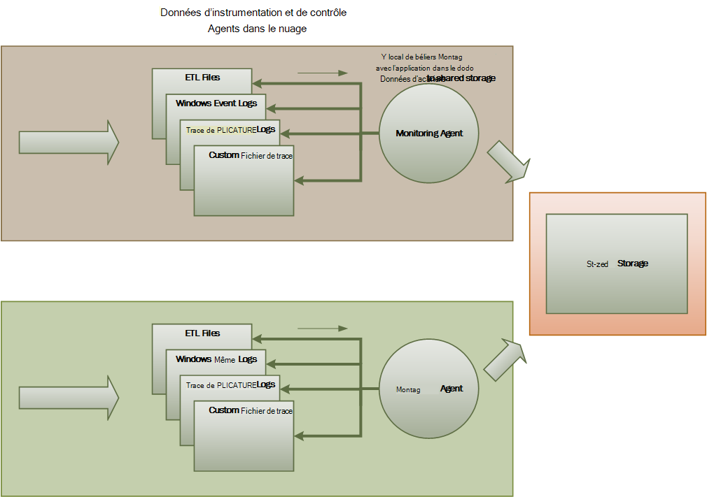
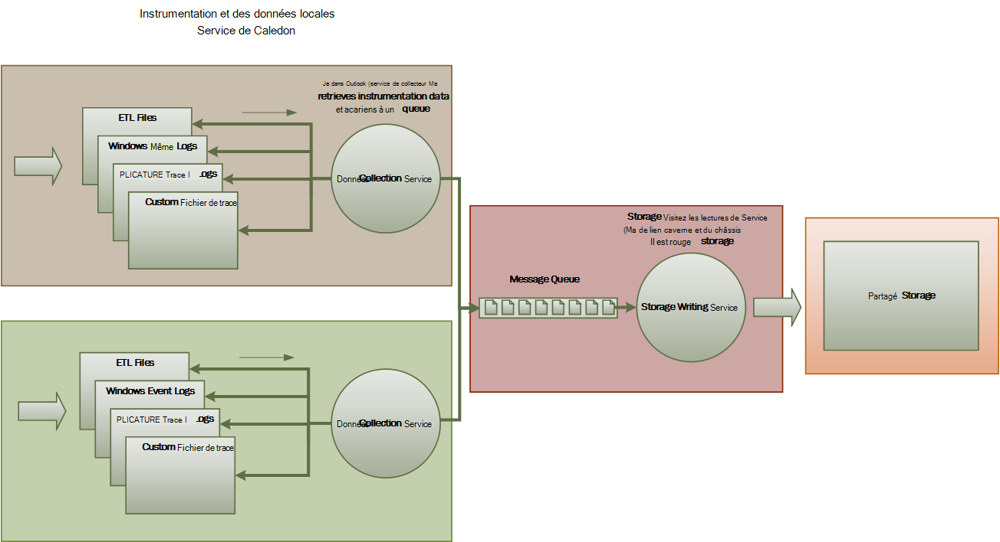
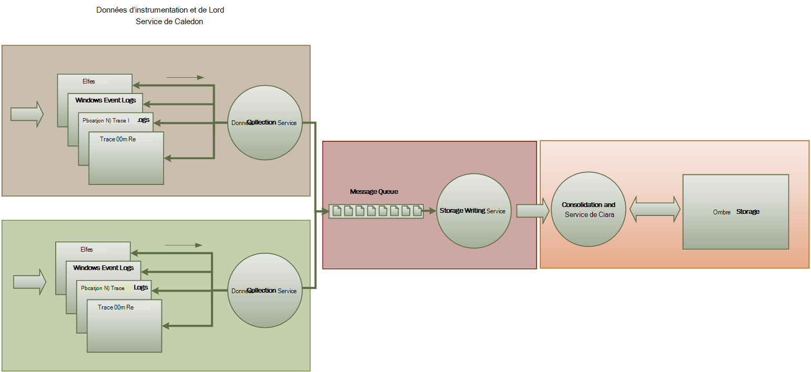

<properties
   pageTitle="Guide de surveillance et de diagnostic | Microsoft Azure"
   description="Méthodes conseillées pour la surveillance des applications distribuées dans le nuage."
   services=""
   documentationCenter="na"
   authors="dragon119"
   manager="christb"
   editor=""
   tags=""/>

<tags
   ms.service="best-practice"
   ms.devlang="na"
   ms.topic="article"
   ms.tgt_pltfrm="na"
   ms.workload="na"
   ms.date="07/13/2016"
   ms.author="masashin"/>

# <a name="monitoring-and-diagnostics-guidance"></a>Guide de surveillance et de diagnostic

[AZURE.INCLUDE [pnp-header](../includes/guidance-pnp-header-include.md)]

## <a name="overview"></a>Vue d’ensemble
Applications distribuées et les services s’exécutant dans le nuage sont, par leur nature, les parties complexes du logiciel comprenant de nombreuses pièces mobiles. Dans un environnement de production, il est important d’être en mesure de suivre la façon dont les utilisateurs utilisent votre système, l’utilisation des ressources de trace et généralement de surveiller la santé et les performances de votre système. Vous pouvez utiliser ces informations comme aide au diagnostic pour détecter et corriger les problèmes et également pour aider à isoler des problèmes potentiels et de les empêcher de se produire.

## <a name="monitoring-and-diagnostics-scenarios"></a>Scénarios de surveillance et de diagnostic
Surveillance vous permet de faire une idée de la manière dont fonctionne un système. La surveillance est une partie essentielle de la gestion des objectifs de qualité de service. Scénarios courants pour la collecte des données de surveillance sont les suivants :

- S’assurer que le système reste sain.
- Suivi de la disponibilité du système et ses composants.
- Maintien des performances pour vous assurer que le débit du système ne réduit pas les inattendue du volume de travail augmente.
- Garantir que le système répond à n’importe quel niveau de service (SLA) établis avec les clients.
- Protection de la confidentialité et la sécurité du système, des utilisateurs et leurs données.
- Suivi des opérations qui sont effectuées à des fins d’audit ou de réglementations.
- Analyse de l’utilisation quotidienne du système et de repérer les tendances qui pourraient poser des problèmes si ils ne sont pas traités.
- Suivi des problèmes qui se produisent, à partir d’un rapport initial par le biais de l’analyse des causes possibles, la rectification, mises à jour logicielles qui s’imposent et déploiement.
- Suivi des opérations et le débogage des versions du logiciel.

> [AZURE.NOTE] Cette liste n’est pas censée être complète. Ce document met l’accent sur ces scénarios comme des situations les plus courantes pour effectuer la surveillance. Il peut y avoir d’autres qui sont moins courantes ou qui sont spécifiques à votre environnement.

Les sections suivantes décrivent ces scénarios plus en détail. Les informations de chaque scénario sont présentées dans le format suivant :

1. Une vue d’ensemble du scénario
2. Les exigences typiques de ce scénario
3. Les données d’instrumentation brute nécessaire pour prendre en charge le scénario et les sources possibles de ces informations
4. Comment ces données brutes peuvent être analysées et combinées pour générer des informations de diagnostic significatifs

## <a name="health-monitoring"></a>Surveillance de l’état
Un système est en bon état si elle est en cours d’exécution et capable de traiter les demandes. Le but de la surveillance de la santé est pour générer une capture instantanée de l’état actuel du système de sorte que vous pouvez vous assurer que tous les composants du système fonctionnent comme prévu.

### <a name="requirements-for-health-monitoring"></a>Conditions requises pour la surveillance de l’état
Un opérateur doit être averti rapidement (en quelques secondes) si une partie du système est considérée comme incorrecte. L’opérateur doit être en mesure de déterminer les parties du système fonctionnent normalement, et les pièces qui rencontrent des problèmes. État du système peut être mis en surbrillance grâce à un système de feu de circulation :

- Rouge pour défectueux (le système s’est arrêté)
- Jaune pour partiellement Sain (le système est en cours d’exécution avec des fonctionnalités réduites)
- Vert pour complètement sain

Un système complet de contrôle d’état permet à un opérateur à descendre dans le système pour afficher l’état de santé des sous-systèmes et des composants. Par exemple, si l’ensemble du système est représenté en tant que partiellement sains, l’opérateur doit être en mesure d’effectuer un zoom avant et déterminer quelle fonctionnalité est actuellement indisponible.

### <a name="data-sources-instrumentation-and-data-collection-requirements"></a>Sources de données, l’instrumentation et exigences en matière de collecte de données
Les données brutes qui sont nécessaire pour prendre en charge la surveillance de l’état peuvent être générées à la suite de :

- Le suivi de l’exécution de requêtes de l’utilisateur. Ces informations peuvent être utilisées pour déterminer les requêtes qui ont réussi et qui ont échoué la durée de chaque requête.
- Surveillance des utilisateurs synthétique. Ce processus simule les étapes effectuées par un utilisateur et en plusieurs étapes prédéfinies. Les résultats de chaque étape doivent être capturés.
- Consignation des exceptions, les erreurs et les avertissements. Ces informations peuvent être capturées par la trace des instructions incorporées dans le code d’application, ainsi que pour récupérer des informations sur les journaux d’événements de tous les services que le système de référence.
- Surveillance de la santé de tous les services tiers utilisé par le système. Cette surveillance peut nécessiter la récupération et l’analyse des données de santé fournissant ces services. Ces informations peuvent prendre une variété de formats.
- Contrôle de point de terminaison. Ce mécanisme est décrite plus en détail dans la section « Surveillance de la disponibilité ».
- Collecte des informations de performances ambiante, par exemple l’arrière-plan de l’UC ou activité e/s (y compris le réseau).

### <a name="analyzing-health-data"></a>Analyse des données de santé
Le principal objectif de la surveillance de la santé est d’indiquer rapidement si le système est en cours d’exécution. Analyse à chaud des données immédiates peut déclencher une alerte si un composant critique est détecté comme étant non fonctionnelle. (Il ne parvient pas à répondre à une série consécutive de pings, par exemple.) L’opérateur peut alors l’action corrective appropriée.

Un système plus avancé peut inclure un élément prédictif qui effectue une analyse à froid sur les charges de travail en cours et récentes. Une analyse à froid peut dégager les tendances et déterminer si le système est susceptible de se maintenir en bon état ou si le système de ressources supplémentaires est nécessaires. Cet élément prédictif doit être fondée sur des mesures de performances critiques, tels que :

- Le taux de demandes adressées à chaque service ou d’un sous-système.
- Les temps de réponse de ces requêtes.
- Le volume de données qui circulent vers et à partir de chaque service.

Si la valeur d’une mesure dépasse un seuil défini, le système peut déclencher une alerte pour permettre à un opérateur ou un autoscaling (si disponible) pour les actions préventives nécessaires pour maintenir l’intégrité du système. Ces actions peuvent impliquent l’ajout de ressources, le redémarrage d’un ou plusieurs services qui sont défectueux, ou en appliquant la limitation aux demandes de faible priorité.

## <a name="availability-monitoring"></a>Analyse de la disponibilité
Un système véritablement sain nécessite que les composants et les sous-systèmes constituant le système sont disponibles. Analyse de la disponibilité est étroitement liée à la surveillance de la santé. Mais alors que la surveillance de l’état fournit une vue immédiate de l’état actuel du système, analyse de la disponibilité concerne la disponibilité du système et ses composants pour générer des statistiques sur le temps de fonctionnement du système de suivi.

Dans de nombreux systèmes, des composants (par exemple, une base de données) sont configurés avec redondance intégrée pour permettre un basculement rapide en cas de panne grave ou d’une perte de connectivité. Dans l’idéal, les utilisateurs ne doivent pas être conscients qu’une telle défaillance s’est produite. Mais à partir d’une analyse du point de vue de la disponibilité, il est nécessaire de recueillir autant d’informations que possible sur ce type de défaillance pour déterminer la cause et de prendre des mesures correctives pour les empêcher de se reproduire.

Les données nécessaires pour effectuer le suivi de la disponibilité peuvent dépendre d’un certain nombre de facteurs de niveau inférieur. De nombreux facteurs peuvent être spécifiques à l’application, le système et l’environnement. Un système efficace de contrôle capture les données de disponibilité qui correspondant à ces facteurs de bas niveau et puis les agrège afin de donner une vue d’ensemble du système. Par exemple, dans un système de commerce électronique, les fonctionnalités d’entreprise qui permet à un client de passer des commandes peuvent dépendre du référentiel dans lequel sont stockés les détails de la commande et le système de paiement qui gère les transactions monétaires pour le paiement de ces commandes. La disponibilité de la partie de l’emplacement des commandes du système est donc une fonction de la disponibilité du référentiel et le sous-système de paiement.

### <a name="requirements-for-availability-monitoring"></a>Configuration requise pour l’analyse de la disponibilité
Un opérateur doit également être en mesure d’afficher la disponibilité historique de chaque système et le sous-système et utiliser ces informations pour repérer les tendances qui peuvent provoquer un ou plusieurs sous-systèmes échoue régulièrement. (Services démarrent échoue à un moment précis de la journée qui correspond aux heures de traitement de pointe ?)

Une solution de contrôle doit fournir une vue immédiate et historique de la disponibilité ou la non-disponibilité de chaque sous-système. Il doit également pouvoir rapidement d’alerte un opérateur lorsqu’au moins un échec des services ou lorsque les utilisateurs ne peuvent pas se connecter aux services. Il s’agit d’une question de non seulement le suivi de chaque service, mais également examiner les actions effectuées par chaque utilisateur si ces actions échouent lorsqu’elles tentent de communiquer avec un service. Dans une certaine mesure, un degré d’échec de connexion est normal et peut être dû à des erreurs transitoires. Mais il peut être utile d’autoriser le système à déclencher une alerte pour le nombre d’échecs de connectivité à un sous-système spécifié qui se produisent au cours d’une période spécifique.

### <a name="data-sources-instrumentation-and-data-collection-requirements"></a>Sources de données, l’instrumentation et exigences en matière de collecte de données
Comme avec le contrôle d’état, les données brutes qui sont nécessaire pour prendre en charge l’analyse de la disponibilité peuvent être due utilisateur synthétique, surveillance et journalisation des exceptions, les erreurs et les avertissements qui peuvent se produire. En outre, les données de disponibilité peuvent être obtenues à partir de l’analyse du point de terminaison. L’application peut exposer un ou plusieurs points de terminaison de la santé, à chaque accès de test pour un domaine fonctionnel au sein du système. Le système de surveillance peut ping sur chaque point de terminaison en suivant un calendrier défini et collecter les résultats (réussite ou échec).

Tous les délais d’attente, les échecs de connectivité réseau et nouvelles tentatives de connexion doivent être enregistrées. Toutes les données doivent être horodaté.

<a name="analyzing-availability-data"></a>
### <a name="analyzing-availability-data"></a>Analyse des données de disponibilité
Les données d’instrumentation doivent être agrégées et mises en corrélation pour prendre en charge les types d’analyse suivants :

- La disponibilité immédiate du système et des sous-systèmes.
- Les taux d’échec de la disponibilité du système et des sous-systèmes. Dans l’idéal, un opérateur doit être en mesure de mettre en corrélation les défaillances avec les activités spécifiques : que s’est-il passé lorsque le système a échoué ?
- Une vue historique des taux de défaillance du système ou des sous-systèmes sur les spécifié période et la charge sur le système (nombre de requêtes de l’utilisateur, par exemple) lorsqu’une erreur s’est produite.
- Les raisons de l’indisponibilité du système ou des sous-systèmes. Par exemple, les raisons peuvent être connectés de service ne pas en cours d’exécution, connexion perdue, mais expiration et connectés, mais qui renvoie des erreurs.

Vous pouvez calculer le pourcentage de disponibilité d’un service sur une période de temps à l’aide de la formule suivante :

```
%Availability =  ((Total Time – Total Downtime) / Total Time ) * 100
```

Cela est utile à des fins de SLA. ([Analyse du SLA](#SLA-monitoring) est décrite plus en détail plus loin dans ce guide.) La définition des _temps d’arrêt_ dépend du service. Par exemple, Visual Studio Services Service Team Build définit les interruptions de service en tant que la période de Service de Build au cours de laquelle n’est pas disponible (cumulé total de minutes). Une minute est considéré comme indisponible si toutes les demandes HTTP continues pour le Service de Build pour exécuter des opérations de lancée par le client tout au long de la minute génèrent un code d’erreur ou ne retournent pas de réponse.

## <a name="performance-monitoring"></a>Analyse des performances
Le système est placé sous une charge importante de plus et plus (en augmentant le volume des utilisateurs), la taille des jeux de données qui croît de ces utilisateurs d’accéder et la possibilité d’échec d’un ou plusieurs composants devient plus probables. Fréquemment, défaillance d’un composant est précédée d’une baisse des performances. Si vous êtes en mesure de détecter cette baisse, vous pouvez prendre des mesures proactives pour remédier à la situation.

Les performances du système dépendant d’un certain nombre de facteurs. Chaque facteur est généralement mesurée à travers des indicateurs de performance clés (KPI), telles que le nombre de transactions de base de données par seconde ou le volume de requêtes réseau qui sont traitées avec succès dans un laps de temps spécifié. Certains de ces indicateurs peuvent être disponible en tant que mesures de performances spécifiques, alors que d’autres peuvent être dérivées à partir d’une combinaison de mesures.

> [AZURE.NOTE] Détermination des performances de bonne ou de mauvaise nécessite une bonne compréhension du niveau de performance à laquelle le système doit être capable de fonctionner. Cela nécessite en observant le système pendant qu’elle fonctionne sous une charge normale et capture les données pour chaque indicateur de performance clé sur une période donnée. Cela peut impliquer le système sous une charge simulée en cours d’exécution dans un environnement de test et de collecter les données appropriées avant de déployer le système dans un environnement de production.

> Vous devez également vous assurer que l’analyse à des fins de performances ne devient-elle pas une charge sur le système. Vous ne pourrez pas ajuster dynamiquement le niveau de détail pour les données qui rassemble les processus de contrôle des performances.

### <a name="requirements-for-performance-monitoring"></a>Configuration requise pour l’analyse des performances
Pour examiner les performances du système, un opérateur doit en général afficher des informations qui inclut :

- Le taux de réponse pour les requêtes utilisateur.
- Le nombre de demandes utilisateur simultanées.
- Le volume du trafic réseau.
- Taux selon lequel les transactions sont terminées.
- Le temps de traitement moyen des demandes.

Il peut également être utile de fournir des outils qui permettent à un opérateur aider les corrélations de tons directs, tels que :

- Le nombre d’utilisateurs simultanés par rapport au délai de demande de temps (le temps nécessaire pour démarrer le traitement d’une demande après que l’utilisateur a envoyé).
- Le nombre d’utilisateurs simultanés par rapport au temps de réponse moyen (le temps nécessaire pour terminer une demande après que qu’il a commencé à traiter).
- Le volume de demandes par rapport au nombre d’erreurs de traitement.

Ainsi que les principales informations fonctionnelles, un opérateur doit être en mesure d’obtenir une vue détaillée des performances de chaque composant dans le système. Ces données sont généralement fournies par le biais de compteurs de performance de bas niveau qui effectuent le suivi d’informations telles que :

- Utilisation de la mémoire.
- Nombre de threads.
- Durée de traitement du processeur.
- Longueur de la file d’attente de la demande.
- Taux d’e/s de disque ou de réseau et les erreurs.
- Nombre d’octets écrits ou lus.
- Indicateurs de middleware, telles que la longueur de la file d’attente.

Toutes les visualisations doivent permettre à un opérateur spécifier une période de temps. Les données affichées peuvent être un instantané de la situation actuelle ou d’une vue historique des performances.

Un opérateur doit être en mesure de déclencher une alerte basée sur une mesure de performance pour n’importe quelle valeur spécifiée au cours d’un intervalle de temps spécifié.

### <a name="data-sources-instrumentation-and-data-collection-requirements"></a>Sources de données, l’instrumentation et exigences en matière de collecte de données
Vous pouvez collecter des données de performances de haut niveau (débit, le nombre d’utilisateurs simultanés, le nombre de transactions commerciales, les taux d’erreur et ainsi de suite) en surveillant la progression des demandes des utilisateurs dès qu’ils arrivent et passent par le système. Cela implique l’incorporant des instructions de traçage à des points importants dans le code de l’application, ainsi que des informations de minutage. Toutes les erreurs, les exceptions et les avertissements doivent être consignés avec des données suffisantes pour leur corrélation avec les requêtes qui les a générés. Le journal Internet Information Services (IIS) est une autre source utile.

Si possible, vous devez également capturer des données de performances pour les systèmes externes que l’application utilise. Ces systèmes externes peuvent fournir leurs propres compteurs de performances ou d’autres fonctionnalités pour demander des données de performances. Si ce n’est pas possibles, enregistrer des informations telles que l’heure de début et l’heure de fin de chaque demande adressée à un système externe, ainsi que l’état (réussite, échec ou avertissement) de l’opération. Par exemple, vous pouvez utiliser une approche chronomètre demandes : lancer une horloge au démarrage de la demande et arrêtez la minuterie lorsque la requête se termine.

Les données de performance de bas niveau pour les composants individuels dans un système peuvent être disponibles par le biais de fonctionnalités et de services, des compteurs de performance Windows Azure Diagnostics.

### <a name="analyzing-performance-data"></a>Analyse des données de performances
L’essentiel du travail d’analyse se compose d’agrégation des données de performances par type de demande de l’utilisateur ou le service auquel chaque demande est envoyée ou le sous-système. Un exemple de requête d’un utilisateur est l’ajout d’un article à un panier d’achat ou effectuer le processus d’extraction dans un système de commerce électronique.

Une autre exigence commune est résumant les données de performance dans les centiles sélectionnés. Par exemple, un opérateur peut déterminer les temps de réponse de 99 % des demandes, 95 % des demandes et 70 % des demandes. Il peut y avoir des cibles SLA ou autres objectifs définis pour chaque position. Les résultats en cours doivent être signalés en temps quasi réel, pour détecter les problèmes immédiats. Les résultats doivent également être consolidés sur le plus de temps à des fins statistiques.

Dans le cas de problèmes de latence qui affectent les performances, un opérateur doit être en mesure d’identifier rapidement l’origine du goulot d’étranglement en examinant la latence de chaque étape exécute de chaque demande. Les données de performances doivent par conséquent fournir un moyen de mise en corrélation de mesures de performances pour chaque étape afin de les lier à une demande spécifique.

Selon les besoins de la visualisation, il peut être utile générer et stocker un cube de données contenant des vues des données brutes. Ce cube de données peut permettre l’analyse des informations de performances et requêtes ad hoc complexes.

## <a name="security-monitoring"></a>Surveillance de la sécurité
Tous les systèmes commerciaux qui contiennent des données sensibles doivent implémenter une structure de sécurité. La complexité du mécanisme de sécurité est généralement une fonction de la sensibilité des données. Dans un système qui requiert l’authentification des utilisateurs, vous devez enregistrer :

- Toutes les tentatives de connexion, ils échouent ou réussissent.
- Toutes les opérations effectuées par--et les détails de toutes les ressources accessibles par--un utilisateur authentifié.
- Lorsqu’un utilisateur ferme une session et ferme une session.

Peut être en mesure de vous aider à détecter des attaques sur le système de surveillance. Par exemple, un grand nombre de tentatives de connexion ayant échouées peut indiquer une attaque par force brute. Une augmentation inattendue dans les demandes peut-être être le résultat d’une attaque (DDoS) de déni de service distribué. Vous devez être prêt à surveiller toutes les demandes à toutes les ressources indépendamment de la source de ces requêtes. Un système qui a un problème de connexion peut exposer accidentellement des ressources vers le monde extérieur sans obliger l’utilisateur à signer.

### <a name="requirements-for-security-monitoring"></a>Conditions requises pour la surveillance de la sécurité
Les aspects les plus critiques de la surveillance de la sécurité doivent permettre à un exploitant pour rapidement :

- Détecter les tentatives d’intrusion par une entité non authentifiée.
- Identifier les tentatives par les entités pour effectuer des opérations sur les données pour lesquelles ils n'ont pas reçus l’accès.
- Déterminez si le système, ou une partie du système est attaqué à partir de l’extérieur ou à l’intérieur. (Par exemple, un utilisateur malveillant authentifié peut essayer de mettre le système vers le bas.)

Pour répondre à ces exigences, un opérateur doit être averti :

- Si un compte fait répété échec des tentatives de connexion pendant une période spécifiée.
- Si un compte authentifié tente à plusieurs reprises d’accéder à une ressource interdite pendant une période déterminée.
- Si un grand nombre de demandes non authentifiées ou non autorisés de se produire au cours d’une période spécifiée.

Les informations fournies à un opérateur doivent inclure l’adresse de l’hôte de la source pour chaque demande. Si des violations de sécurité se produisent régulièrement à partir d’une plage particulière d’adresses, ces hôtes peuvent être bloqués.

Un rôle essentiel dans le maintien de la sécurité d’un système est en mesure de détecter rapidement les actions qui s’écartent du schéma habituel. Des informations telles que le nombre d’échecs ou réussis demandes de connexion peuvent être affichées visuellement pour aider à détecter si est un pic d’activité à un moment inhabituel. (Un exemple de cette activité est utilisateurs l’ouverture de session à 3 h 00 et l’exécution d’un grand nombre d’opérations lors de leur journée de travail commence à 9:00 AM). Ces informations peuvent également servir pour aider à configurer autoscaling de temps. Par exemple, si un opérateur observe qu’un grand nombre d’utilisateurs connecter régulièrement à un moment précis de la journée, l’opérateur peut organiser démarrer les services d’authentification supplémentaires pour gérer le volume de travail, puis arrêter ces services lorsque le pic a réussi.

### <a name="data-sources-instrumentation-and-data-collection-requirements"></a>Sources de données, l’instrumentation et exigences en matière de collecte de données
La sécurité est un aspect global des systèmes plus distribués. Les données pertinentes sont susceptibles d’être générés en plusieurs points dans l’ensemble d’un système. Vous devez envisager l’adoption d’une approche d’informations de sécurité et de gestion de l’événement (SIEM) pour collecter les informations relatives à la sécurité qui résulte d’événements déclenchés par l’application, les équipements réseau, serveurs, pare-feu, logiciel antivirus et autres éléments de prévention des intrusions.

Surveillance de la sécurité peut incorporer des données à partir des outils qui ne font pas partie de votre application. Ces outils peuvent inclure des utilitaires qui identifient les activités de balayage de port par des organismes externes ou des filtres réseau qui détectent les tentatives d’accès non authentifié à votre application et vos données.

Dans tous les cas, les données recueillies doivent permettre à un administrateur de déterminer la nature de l’attaque et de prendre des contre-mesures appropriées.

### <a name="analyzing-security-data"></a>Analyse des données de sécurité
Une fonctionnalité de contrôle de sécurité est la variété de sources à partir de laquelle les données se pose. Les différents formats et le niveau de détail nécessitent souvent une analyse complexe des données capturées à relier dans un thread cohérent d’informations. Mis à part les cas les plus simples (par exemple, la détection d’un grand nombre de connexions a échoué, ou des tentatives répétées d’accéder sans autorisation aux ressources critiques), il est parfois pas possible d’effectuer tout traitement complexe et automatisée des données de sécurité. Au lieu de cela, il peut être préférable d’écrire ces données, horodaté mais sinon dans sa forme d’origine, dans un référentiel sécurisé pour permettre une analyse manuelle.

<a name="SLA-monitoring"></a>

## <a name="sla-monitoring"></a>Surveillance des SLA
De nombreux systèmes commerciaux qui prennent en charge les clients apporter des garanties sur les performances du système sous la forme de SLA. Pour l’essentiel, SLA de l’état que le système peut gérer un volume défini de travail dans un délai convenu et sans perte d’informations critiques. Surveillance des SLA concerne d’assurer que le système peut respecter les SLA mesurables.

> [AZURE.NOTE] Surveillance des SLA est étroitement liée à la surveillance des performances. Mais, considérant que l’analyse des performances est d’assurer que le système fonctions _optimale_, surveillance des SLA est régi par une obligation contractuelle qui définit de quelle _manière optimale_ signifie réellement.

SLA est souvent définis en termes de :

- Disponibilité globale du système. Par exemple, une organisation peut garantir que le système sera disponible pour 99,9 % du temps. Cela équivaut à pas plus de 9 heures de temps d’arrêt par an ou environ 10 minutes par semaine.
- Débit de fonctionnement. Cet aspect est souvent exprimé en un ou plusieurs – les limites supérieures, telles que la garantie que le système prend en charge de jusqu'à 100 000 demandes d’utilisateur simultanées gère ou 10 000 transactions commerciales simultanées.
- Temps de réponse opérationnelle. Le système peut également apporter des garanties pour le taux de traitement des demandes. Un exemple est que 99 % de toutes les transactions commerciales se terminera dans les 2 secondes, et aucune transaction n’aura plus de 10 secondes.

> [AZURE.NOTE] Certains contrats de systèmes commerciaux peuvent également inclure des SLA pour la prise en charge du client. Un exemple est que toutes les demandes d’assistance va provoquer une réponse dans les 5 minutes, et que 99 % de tous les problèmes seront traités complètement dans 1 journée de travail. Efficace de [suivi des problèmes](#issue-tracking) (décrit plus loin dans cette section) est la clé SLA comme ceux-ci.

### <a name="requirements-for-sla-monitoring"></a>Exigences en matière de surveillance des SLA
Le niveau le plus élevé, un opérateur doit être en mesure de déterminer rapidement si le système est satisfaisant les SLA convenus ou non. Si non, l’opérateur doit être en mesure d’effectuer un zoom avant, vers le bas et examiner les facteurs sous-jacents pour déterminer les raisons de performances inférieures aux normes.

Les indicateurs de haut niveau classiques qui peuvent être représentés visuellement sont les suivantes :

- Le pourcentage de temps de fonctionnement du service.
- Le débit de l’application (mesuré en termes de transactions réussies et/ou d’opérations par seconde).
- Le nombre de demandes d’application de réussite/échec.
- Nombre de défaillances du système et d’application, les exceptions et les avertissements.

Tous ces indicateurs doivent être en mesure de filtré par un certain temps.

Une application en nuage comprend probablement un certain nombre de composants et sous-systèmes. Un opérateur doit être en mesure de sélectionner un indicateur de haut niveau et voir comment il est composé à partir de l’état de santé des éléments sous-jacents. Par exemple, si le temps de fonctionnement de l’ensemble du système est inférieur à une valeur acceptable, un opérateur doit être en mesure d’effectuer un zoom avant et de déterminer quels éléments sont contribue à cet échec.

> [AZURE.NOTE] Disponibilité du système doit être définie avec précaution. Dans un système qui utilise la redondance pour garantir une disponibilité maximale, les instances d’éléments peuvent échouer, mais le système peut rester fonctionnel. La disponibilité du système comme indiqué par la surveillance de l’état doit indiquer le temps de fonctionnement global de chaque élément, et pas nécessairement si le système a été effectivement interrompue. En outre, les défaillances peuvent être isolés. Même si un système spécifique n’est pas disponible, le reste du système peut rester disponible, bien qu’avec des fonctionnalités réduites. (Dans un système de commerce électronique, une défaillance dans le système peut empêcher un client de passer des commandes, mais le client peut toujours être en mesure de parcourir le catalogue de produits.)

Pour les alertes à des fins, le système doit être en mesure de déclencher un événement si un des indicateurs de haut niveau dépasse un seuil spécifié. Les détails de niveau inférieur des différents éléments qui composent l’indicateur de niveau supérieur doivent être disponibles en tant que données contextuelles pour le système d’alerte.

### <a name="data-sources-instrumentation-and-data-collection-requirements"></a>Sources de données, l’instrumentation et exigences en matière de collecte de données
Les données brutes qui sont nécessaire pour prendre en charge la surveillance des SLA sont similaires aux données brutes qui sont requis pour l’analyse des performances, ainsi que certains aspects de la santé et de la surveillance de la disponibilité. (Voir les sections pour plus de détails). Vous pouvez capturer ces données par :

- Effectuer le suivi du point de terminaison.
- Consignation des exceptions, les erreurs et les avertissements.
- Le suivi de l’exécution des demandes de l’utilisateur.
- Surveillance de la disponibilité de tous les services tiers utilisé par le système.
- Utilisation des compteurs et des mesures de performances.

Toutes les données doivent être a dépassé le délai et horodaté.

### <a name="analyzing-sla-data"></a>Analyse des données de SLA
Les données d’instrumentation doivent être regroupées pour générer une image des performances générales du système. Les données agrégées doivent prennent également en charge détaillés pour permettre l’examen de la performance des sous-systèmes sous-jacents. Par exemple, vous serez en mesure de :

- Calculer le nombre total de demandes de l’utilisateur pendant une période déterminée et déterminer le taux de réussite et d’échec de ces demandes.
- Combiner les temps de réponse des demandes de l’utilisateur pour générer une vue d’ensemble des temps de réponse du système.
- Analyser la progression des demandes de l’utilisateur pour décomposer le temps de réponse global d’une demande dans les temps de réponse des éléments de travail individuels dans cette demande.  
- Déterminer la disponibilité globale du système sous la forme d’un pourcentage de disponibilité pour une période spécifique.
- Analyser la disponibilité du temps de pourcentage des composants individuels et des services dans le système. Cela peut impliquer l’analyse les journaux des services tiers ont générés.

De nombreux systèmes commerciaux doivent signaler des chiffres de performances par rapport aux SLA convenue pour une période donnée, généralement à un mois. Cette information peut être utilisée pour calculer les crédits ou autres formes de remboursements pour les clients si les SLA ne sont pas satisfaites pendant cette période. Vous pouvez calculer la disponibilité d’un service à l’aide de la technique décrite dans la section [analyse des données de disponibilité](#analyzing-availability-data).

À des fins internes, une organisation peut également effectuer le suivi du nombre et la nature des incidents ayant entraîné l’échec des services. Apprendre à résoudre ces problèmes rapidement, ou de les éliminer complètement, contribue à réduire les interruptions de service et respecter les SLA.

## <a name="auditing"></a>L’audit
Selon la nature de l’application, il peut y avoir légales ou d’autres réglementations légales qui spécifient les exigences pour l’audit des opérations des utilisateurs et l’enregistrement de tout accès aux données. L’audit peut fournir la preuve que les clients des liens à des demandes spécifiques. Non répudiation est un facteur important dans de nombreux systèmes d’e-business pour préserver la confiance entre un client et de l’organisation qui est responsable de l’application ou le service.

### <a name="requirements-for-auditing"></a>Exigences pour l’audit
Un analyste doit être en mesure de suivre la séquence d’opérations de l’entreprise par les utilisateurs afin que vous pouvez reconstruire les actions des utilisateurs. Cela peut être nécessaire pour simplement comme une question d’enregistrement ou dans le cadre d’une enquête judiciaire.

Informations d’audit sont très sensibles. Il inclura probablement des données qui identifient les utilisateurs du système, ainsi que les tâches que leurs performances. Pour cette raison, les informations d’audit probablement prendront la forme de rapports qui sont disponibles uniquement aux analystes de confiance plutôt que comme un système interactif qui prend en charge des opérations graphiques détaillés. Un analyste doit être en mesure de générer une gamme de rapports. Par exemple, rapports peuvent répertorier les activités de tous les utilisateurs pendant un laps de temps spécifié, en détail la chronologie de l’activité pour un seul utilisateur ou la séquence des opérations exécutées sur une ou plusieurs ressources de la liste.

### <a name="data-sources-instrumentation-and-data-collection-requirements"></a>Sources de données, l’instrumentation et exigences en matière de collecte de données
Les sources principales d’informations d’audit peuvent inclure :

- Le système de sécurité qui gère l’authentification de l’utilisateur.
- Journaux de suivi qui enregistrent l’activité de l’utilisateur.
- Journaux de sécurité qui effectuent le suivi de toutes les demandes réseau identifiables et non identifiable.

Le format des données d’audit et de la façon dont il est stocké peut être piloté par les exigences réglementaires. Par exemple, il peut être pas possible de nettoyer les données en aucune façon. (Il doit être enregistré dans son format d’origine.) Accès au référentiel dans lequel il est détenu doit être protégé pour empêcher toute manipulation criminelle.

### <a name="analyzing-audit-data"></a>Analyse des données d’audit
Un analyste doit être en mesure d’accéder aux données brutes dans son intégralité, dans sa forme d’origine. Outre l’obligation de générer des rapports d’audit communs, les outils d’analyse de ces données sont susceptibles d’être spécialisé et maintenu à l’extérieur du système.

## <a name="usage-monitoring"></a>Analyse de l’utilisation
Analyse de l’utilisation suit l’utilisation des fonctionnalités et composants d’une application. Un opérateur peut utiliser les données recueillies pour :

- Déterminer les fonctionnalités qui sont largement utilisées et déterminent les zones réactives potentielles dans le système. Éléments de trafic élevé est plus avantageux de partitionnement fonctionnel ou même la réplication pour répartir la charge de manière plus uniforme. Un opérateur pouvez également utiliser ces informations pour déterminer quelles fonctionnalités sont rarement utilisées et sont des candidats possibles pour la retraite ou de remplacement dans une future version du système.
- Obtenir des informations sur les événements opérationnels du système en fonctionnement normal. Par exemple, dans un site de commerce électronique, vous pouvez enregistrer les informations statistiques sur le nombre de transactions et le volume de clients qui sont responsables. Ces informations peuvent être utilisées pour la planification de la capacité à mesure que le nombre de clients augmente.
- Détecter (peut-être indirectement) la satisfaction de l’utilisateur avec les performances ou le fonctionnement du système. Par exemple, si un grand nombre de clients dans un système de commerce électronique abandonner régulièrement leurs paniers, cela peut être dû à un problème avec la fonctionnalité d’extraction.
- Générer des informations de facturation. Une application commerciale ou un service partagé peut facturer des clients pour les ressources qu’ils utilisent.
- Appliquer des quotas. Si un utilisateur dans un système partagé dépasse son quota payant de l’utilisation de temps et de ressources de traitement pendant une période déterminée, l’accès peut être limité ou traitement peut être limité.

### <a name="requirements-for-usage-monitoring"></a>Configuration requise pour l’analyse de l’utilisation
Pour examiner l’utilisation du système, un opérateur doit en général afficher des informations qui inclut :

- Le nombre de demandes traitées par chaque sous-système et dirigé à chaque ressource.
- Le travail que chaque utilisateur est en train d’effectuer.
- Le volume de stockage de données qui occupe de chaque utilisateur.
- Les ressources qui accède à chaque utilisateur.

Un opérateur doit également être en mesure de générer des graphiques. Par exemple, un graphique peut afficher les utilisateurs plus mobilisant des ressources considérables, ou le plus fréquemment les ressources ou les fonctionnalités du système.

### <a name="data-sources-instrumentation-and-data-collection-requirements"></a>Sources de données, l’instrumentation et exigences en matière de collecte de données
Suivi de l’utilisation peut être effectuée à un niveau relativement élevé. Il peut noter les heures de début et de fin de chaque demande et de la nature de la demande (lire, écrire, etc., en fonction de la ressource en question). Vous pouvez obtenir ces informations par :

- Suivi des activités de l’utilisateur.
- Capture les compteurs de performance qui mesurent l’utilisation de chaque ressource.
- Surveillance de la consommation des ressources par chaque utilisateur.

Pour des fins de contrôle, vous devez également être en mesure d’identifier les utilisateurs qui sont responsables pour effectuer les opérations et les ressources qui utilisent de ces opérations. Les informations collectées doivent être suffisamment détaillées pour permettre la facturation.

<a name="issue-tracking"></a>
## <a name="issue-tracking"></a>Suivi des problèmes
Les clients et les autres utilisateurs peuvent signaler des problèmes si des événements inattendus ou le comportement qui se produit dans le système. Suivi des problèmes concerne la gestion de ces problèmes, les associer à des efforts visant à résoudre tous les problèmes sous-jacents dans le système et pour informer les clients des résolutions possibles.

### <a name="requirements-for-issue-tracking"></a>Conditions requises pour le suivi des problèmes
Ce rapport sur les utilisateurs, les opérateurs effectuent souvent suivi à l’aide d’un système distinct qui leur permet d’enregistrer et de rapport que les détails des problèmes. Ces détails peuvent inclure les tâches que l’utilisateur a essayé d’effectuer, les symptômes du problème, la séquence des événements et toute erreur ou les messages d’avertissement qui ont été délivrés.

### <a name="data-sources-instrumentation-and-data-collection-requirements"></a>Sources de données, l’instrumentation et exigences en matière de collecte de données
La source de données initiales pour les données de suivi des problèmes est l’utilisateur qui a signalé le problème en premier lieu. L’utilisateur peut être en mesure de fournir des données supplémentaires telles que :

- Un vidage sur incident (si l’application contient un composant qui s’exécute sur le bureau de l’utilisateur).
- Une capture d’écran.
- La date et l’heure de l’erreur, ainsi que d’autres informations environnementales telles que l’emplacement de l’utilisateur.

Ces informations peuvent être utilisées à l’aide de l’effort de débogage et construire un retard dans les futures versions du logiciel.

### <a name="analyzing-issue-tracking-data"></a>Analyse des données de suivi des problèmes
Différents utilisateurs peuvent signaler le même problème. Le système de suivi des problèmes doit associer le rapports communs.

La progression de l’effort de débogage doit être enregistrée dans chaque rapport de problème. Lorsque le problème est résolu, le client peut être informé de la solution.

Si un utilisateur signale un problème possède une solution connue dans le système de suivi des problèmes, l’opérateur doit être en mesure d’informer l’utilisateur de la solution immédiatement.

## <a name="tracing-operations-and-debugging-software-releases"></a>Les opérations de suivi et le débogage de versions des logiciels
Lorsqu’un utilisateur signale un problème, l’utilisateur est souvent uniquement consciente de l’impact immédiat sur leurs opérations. L’utilisateur peut uniquement signalent les résultats de leur propre expérience à un opérateur qui est responsable de la maintenance du système. Ces expériences sont généralement juste un symptôme visible d’un ou plusieurs des problèmes fondamentaux. Dans de nombreux cas, un analyste devez de se plonger dans la chronologie des opérations sous-jacentes afin d’établir la cause du problème. Ce processus s’appelle _l’analyse des causes_.

> [AZURE.NOTE] Analyse de la cause racine peut découvrir le manque d’efficacité dans la conception d’une application. Dans ces situations, il peut être possible de revoir des éléments concernés et de les déployer dans le cadre d’une version ultérieure. Ce processus nécessite contrôle rigoureuse, et les composants mis à jour doivent être contrôlés étroitement.

### <a name="requirements-for-tracing-and-debugging"></a>Configuration requise pour le traçage et le débogage
Pour effectuer le suivi des événements inattendus et autres problèmes, il est essentiel que les données d’analyse fournissent suffisamment d’informations pour activer un analyste pour assurer le suivi de l’origine de ces problèmes et reconstruire la séquence des événements qui se sont produites. Ces informations doivent être suffisantes pour permettre un analyste pour diagnostiquer la cause des problèmes. Un développeur peut puis apportez les modifications nécessaires pour les empêcher de se reproduire.

### <a name="data-sources-instrumentation-and-data-collection-requirements"></a>Sources de données, l’instrumentation et exigences en matière de collecte de données
Résolution des problèmes peuvent impliquer le suivi toutes les méthodes (et leurs paramètres) appelés dans le cadre d’une opération pour générer une arborescence qui représente le flux logique dans le système, lorsqu’un client effectue une demande spécifique. Exceptions et les avertissements générés par le système à la suite de ce flux doivent être capturés et enregistrés.

Pour prendre en charge le débogage, le système peut fournir des raccordements qui permettent à un opérateur capturer les informations d’état sur les points essentiels dans le système. Ou bien, le système peut fournir des informations détaillées étape par étape comme la progression des opérations sélectionnées. Capture des données à ce niveau de détail peuvent imposer une charge supplémentaire sur le système et doivent être un processus temporaire. Un opérateur utilise ce processus principalement lorsqu’une série très rare d’événements se produit et qu’il est difficile de répliquer ou lorsqu’une nouvelle version d’un ou plusieurs éléments dans un système requiert une analyse minutieuse pour vous assurer que la fonction d’éléments comme prévu.

## <a name="the-monitoring-and-diagnostics-pipeline"></a>Le pipeline de surveillance et de diagnostic
Surveillance d’un système distribué à grande échelle pose un défi. Chacun des scénarios décrits dans la section précédente ne doit pas nécessairement être considéré isolément. Il est susceptible d’être un chevauchement significatif dans les données de surveillance et de diagnostics qui sont requis pour chaque situation, bien que ces données peuvent doivent être traitées et présenté de différentes manières. Pour ces raisons, vous devez prendre une vue holistique de surveillance et de diagnostic.

Vous pouvez envisager le processus de diagnostic et de surveillance ensemble sous la forme d’un pipeline qui comprend les phases illustrés dans la Figure 1.


_La figure 1. Les étapes dans le pipeline de surveillance et de diagnostic_

La figure 1 illustre la manière dont les données de surveillance et de diagnostic peuvent provenir d’une variété de sources de données. Les étapes de l’instrumentation et la collecte concernent l’identification des sources d’où les données doivent être capturés, déterminer les données à capturer, comment capturer et comment mettre en forme ces données afin qu’il puisse facilement être examiné. La phase d’analyse/diagnostic prend les données brutes et l’utilise pour générer des informations pertinentes, un opérateur peut utiliser pour déterminer l’état du système. L’opérateur peut utiliser ces informations pour prendre des décisions concernant les actions possibles à prendre et placez ensuite les résultats dans les étapes de l’instrumentation et la collecte. La phase de phase de visualisation/alertes présente un affichage de consommable de l’état du système. Il peut afficher des informations en temps quasi réel à l’aide d’une série de tableaux de bord. Et il peut générer des rapports, des graphiques et des graphiques pour fournir une vue historique des données qui peuvent aider à identifier les tendances à long terme. Si les informations indiquent qu’un indicateur de performance clé est susceptible de dépasser les limites acceptables, cette étape peut également déclencher une alerte à un opérateur. Dans certains cas, une alerte peut également être utilisée pour déclencher un processus automatisé qui tente de prendre des mesures correctives, autoscaling.

Notez que ces étapes constituent un processus de flux continu où les étapes sont produisent en parallèle. Dans l’idéal, toutes les phases doivent être configurables dynamiquement. À certains moments, surtout si un système a été récemment déployé ou rencontre des problèmes, il peut être nécessaire rassembler des données étendues sur une base plus fréquente. À d’autres moments, il doit être possible de revenir à la capture d’informations essentielles afin de vérifier que le système fonctionne correctement, un niveau de base.

En outre, tout le processus de surveillance doit être considérée comme une solution en continu qui est soumis à des améliorations à la suite de commentaires et de réglage fin. Par exemple, vous pouvez commencer avec de nombreux facteurs pour déterminer l’état du système de mesure. Analyse dans le temps peut entraîner une amélioration comme vous ignorez les mesures qui ne sont pas utilisés, ce qui vous permet de consacrer plus précisément les données dont vous avez besoin tout en réduisant le bruit de fond.

## <a name="sources-of-monitoring-and-diagnostic-data"></a>Sources de données de surveillance et de Diagnostics
Les informations utilisées par le processus d’analyse peuvent provenir de plusieurs sources, comme illustré dans la Figure 1. Au niveau de l’application, les informations proviennent incorporés dans le code du système des journaux de suivi. Les développeurs doivent suivre une approche standard pour le suivi du flux de contrôle par l’intermédiaire de leur code. Par exemple, une entrée pour une méthode peut émettre un message de trace qui spécifie le nom de la méthode, l’heure actuelle, la valeur de chaque paramètre, ainsi que toute autre information utile. L’enregistrement aux fois d’entrée et de sortie peut également s’avérer utile.

Vous devez enregistrer toutes les exceptions et les avertissements et assurez-vous de conserver une trace complète de toutes les exceptions imbriquées et les avertissements. Dans l’idéal, vous devez également capturer des informations qui identifient l’utilisateur qui exécute le code avec les informations de corrélation d’activité (pour effectuer le suivi des demandes lorsqu’ils passent par le système). Et vous devez consigner les tentatives d’accès de toutes les ressources telles que les files d’attente, les bases de données, les fichiers et les autres services qui en dépendent. Ces informations peuvent être utilisées à des fins d’audit et de contrôle.

Nombreuses applications utiliser des bibliothèques et des infrastructures pour effectuer des tâches courantes telles que l’accès à un magasin de données ou de communication sur un réseau. Ces structures peuvent être configurables pour fournir leurs propres messages de trace et les informations de diagnostic brutes, telles que les taux de transaction et les échecs et réussites de transmission de données.

> [AZURE.NOTE] De nombreuses infrastructures modernes publier automatiquement des événements de trace et de performances. Capture de ces informations est simplement de fournir un moyen pour récupérer et stocker où il peut être traité et analysé.

Le système d’exploitation dans lequel l’application est en cours d’exécution peut être une source d’informations à l’échelle du système de bas niveau, tels que des compteurs de performance indiquant des taux d’e/s, utilisation de la mémoire et l’utilisation du processeur. Les erreurs de système d’exploitation (par exemple, la défaillance d’un fichier s’ouvre correctement) peuvent également être signalés.

Vous devez également envisager l’infrastructure sous-jacente et les composants sur lequel s’exécute votre système. Services de stockage, les réseaux virtuels et les machines virtuelles peuvent tous être sources de compteurs de performances au niveau de l’infrastructure et les autres données de diagnostic.

Si votre application utilise d’autres services externes, tel qu’un serveur web ou d’un système de gestion de base de données, ces services peuvent publier leurs propres informations de traçage, les journaux et les compteurs de performance. Les exemples incluent les vues de gestion dynamique de SQL Server pour le suivi des opérations exécutées sur une base de données SQL Server et les journaux de suivi d’IIS pour l’enregistrement des demandes adressées à un serveur web.

Comme les composants d’un système sont modifiées et les nouvelles versions sont déployées, il est important d’être en mesure de problèmes d’attributs, les événements et les mesures pour chaque version. Ces informations doivent être liées sur le pipeline de version afin que des problèmes avec une version spécifique d’un composant peuvent être suivies rapidement et rectifiés.

Problèmes de sécurité peuvent se produire à n’importe quel point dans le système. Par exemple, un utilisateur peut essayer de vous connecter avec un ID utilisateur ou le mot de passe. Un utilisateur authentifié peut tenter d’obtenir un accès non autorisé à une ressource. Ou bien, un utilisateur peut fournir une clé non valide ou obsolète pour accéder à des informations cryptées. Liés à la sécurité des informations pour les requêtes réussies et défaillant doivent toujours être consignées.

La section de [l’instrumentation d’applications](#instrumenting-an-application) contient plus d’aide sur les informations que vous devez capturer. Mais vous pouvez utiliser une variété de stratégies de rassembler ces informations :

- La **Surveillance du système d’applications**. Cette stratégie utilise des sources internes dans les applications, les infrastructures d’application, système d’exploitation et d’infrastructure. Le code d’application peut générer son propre analyse des données aux points notables au cours du cycle de vie d’une demande de client. L’application peut inclure des instructions de traçage qui peuvent être sélectivement activées ou désactivées en cas. Il est également possible d’injecter des diagnostics dynamiquement à l’aide d’une infrastructure de diagnostics. Ces infrastructures fournissent généralement des plug-ins que vous pouvez attacher à divers points d’instrumentation dans votre code et capturer les données de trace à ces points.

    En outre, votre code et/ou l’infrastructure sous-jacente peut déclencher des événements à des points critiques. Surveillance des agents qui sont configurés pour écouter ces événements peut enregistrer des informations sur l’événement.

- **Surveillance de l’utilisateur réel**. Cette approche enregistre les interactions entre un utilisateur et de l’application et observe le flux de chaque demande et chaque réponse. Ces informations peuvent avoir un objectif double : il peut être utilisé pour le contrôle de l’utilisation par chaque utilisateur, et il peut être utilisé pour déterminer si les utilisateurs reçoivent un adéquat de la qualité de service (par exemple, temps de réponse rapides, faible, erreurs et la latence minimales). Vous pouvez utiliser les données capturées pour identifier les domaines de préoccupation où échecs se produisent le plus souvent. Vous pouvez également utiliser les données pour identifier les éléments où le système ralentit, probablement en raison de zones réactives dans l’application ou une autre forme de goulot d’étranglement. Si vous implémentez cette approche avec soin, il peut être possible de reconstituer le flux des utilisateurs par le biais de l’application pour le débogage et à des fins de test.

    > [AZURE.IMPORTANT] Vous devez envisager les données capturées en surveillant les utilisateurs réels pour être très sensible car elle peut comprendre des documents confidentiels. Si vous enregistrez des données capturées, stocker en toute sécurité. Si vous souhaitez utiliser les données de performance de surveillance ou aux fins de débogage, réduisez tout d’abord toutes les informations personnellement identifiables.

- **Surveillance des utilisateurs synthétique**. Dans cette approche, vous écrivez votre propre client de test qui simule un utilisateur et exécute une série de configurable mais typique des opérations. Vous pouvez suivre les performances du client test afin de déterminer l’état du système. Vous pouvez également utiliser plusieurs instances du client test dans le cadre d’une opération de test de charge pour établir la façon dont le système répond en situation de stress, et quel type de contrôle de sortie est générée dans ces conditions.

    > [AZURE.NOTE] Vous pouvez implémenter la surveillance des utilisateurs réels et synthétiques en incluant le code qui effectue le suivi et le moment de l’exécution des appels de méthode et les autres parties cruciales d’une application.

- Le **profilage**. Cette approche est principalement à la surveillance et amélioration des performances de l’application. Au lieu d’exploitation au niveau fonctionnel de la surveillance de l’utilisateur réel et synthétique, il capture des informations de niveau inférieur en tant que l’application s’exécute. Vous pouvez implémenter le profilage par échantillonnage périodique de l’état de l’exécution d’une application (qui détermine la partie de code que l’application s’exécute à un moment donné dans le temps). Vous pouvez également utiliser une instrumentation qui insère des sondes dans le code au stade important (par exemple, le début et la fin d’un appel de méthode) et enregistre quelles méthodes ont été appelées, à quel moment, et la durée de chaque appel. Vous pouvez ensuite analyser ces données afin de déterminer les parties de l’application peuvent provoquer des problèmes de performances.

- **Contrôle de point de terminaison**. Cette technique utilise un ou plusieurs points de terminaison de diagnostics que l’application expose en particulier pour la surveillance. Un point de terminaison permet d’accéder dans le code d’application et peut retourner des informations sur l’état de santé du système. Points de terminaison différents peuvent se concentrer sur les différents aspects de la fonctionnalité. Vous pouvez écrire votre propre client de diagnostics qui envoie des requêtes périodiques à ces points de terminaison et assimiler les réponses. Cette approche est décrite dans le [Modèle de contrôle de point de terminaison sanitaire](https://msdn.microsoft.com/library/dn589789.aspx) sur le site Web de Microsoft.

Couverture maximale, vous devez utiliser une combinaison de ces techniques.

<a name="instrumenting-an-application"></a>
## <a name="instrumenting-an-application"></a>L’instrumentation d’une application
L’instrumentation est une partie essentielle du processus de surveillance. Vous pouvez rendre des décisions significatives sur les performances et l’état d’un système que si vous commencez de capturer les données qui vous permet de prendre ces décisions. Les informations que vous collectez à l’aide de l’instrumentation doivent être suffisantes pour vous permettre d’évaluer les performances, diagnostiquer les problèmes et prendre des décisions sans avoir à vous connecter à un serveur de production distant pour effectuer le suivi (et le débogage) manuellement. Données d’instrumentation comprenant généralement les métriques et les informations sont écrites dans les journaux de suivi.

Le contenu d’un journal de suivi peut être le résultat de données textuelles qui sont écrites par l’application ou des données binaires qui sont créées à la suite d’un événement de trace (si l’application utilise Event Tracing for Windows--ETW). Ils peuvent aussi être générés à partir des journaux système enregistrent les événements provenant de parties de l’infrastructure, comme un serveur web. Messages du journal textuelles sont souvent conçus pour être lisible par l’homme, mais ils doivent également être écrites dans un format qui permet de les analyser facilement un système automatisé.

Vous devez également classer les journaux. N’écrivent pas toutes les données de trace dans un fichier journal unique, mais des journaux distincts permet d’enregistrer la sortie de trace à partir de différents aspects opérationnels du système. Vous pouvez ensuite filtrer rapidement les messages du journal par la lecture d’un journal approprié plutôt que de devoir traiter un seul fichier de longue durée. Jamais Ecrire une information qui a des exigences de sécurité différentes (par exemple, les informations d’audit et les données de débogage) dans le même journal.

> [AZURE.NOTE] Un journal peut être implémenté sous la forme d’un fichier sur le système de fichiers, ou il peut se trouver dans un autre format, comme un objet blob dans le stockage blob. Les informations du journal peuvent également être maintenues en stockage plus structuré, tel que les lignes d’une table.

Mesures sera généralement une mesure ou un nombre d’un aspect ou une ressource dans le système à une heure spécifique, avec une ou plusieurs balises associées ou les dimensions (parfois appelées un _exemple_). Une instance unique d’une mesure n’est généralement pas utile de manière isolée. Au lieu de cela, mesures doivent être capturées dans le temps. La question clé à prendre en compte est les mesures que vous devez enregistrer et la fréquence. Génération de données pour les mesures trop souvent peut imposer une charge plue importante sur le système, considérant que les mesures de capture rarement risque de manquer les circonstances qui entraînent un événement important. Les considérations varient à partir d’un critère pour un critère. Par exemple, l’utilisation du processeur sur un serveur peut-être varier considérablement à partir de la seconde à la seconde, mais une utilisation élevée devient un problème que si elle est à long terme sur un nombre de minutes.

<a name="information-for-correlating-data"></a>
### <a name="information-for-correlating-data"></a>Informations de mise en corrélation des données
Vous pouvez facilement surveiller les compteurs de performance système individuel, comprendre les mesures des ressources et obtenir des informations de traçage d’application à partir de différents fichiers journaux. Mais certaines formes de surveillance nécessitent la phase d’analyse et de diagnostic dans le pipeline de surveillance pour corréler les données extraites de plusieurs sources. Ces données peuvent prendre plusieurs formes aux données brutes, et le processus d’analyse doit être fourni avec les données d’instrumentation suffisantes pour être en mesure de mapper ces différentes formes. Par exemple, au niveau de l’infrastructure d’application, une tâche peut être identifiée par un ID de thread. Dans une application, le même travail peut être associé à l’ID utilisateur pour l’utilisateur qui effectue cette tâche.

En outre, il n’est probablement pas un mappage 1:1 entre les threads et les demandes de l’utilisateur, étant donné que les opérations asynchrones peuvent réutiliser les mêmes threads pour effectuer des opérations de plus d’un utilisateur. Pour compliquer les choses, une seule demande peut-être être gérée par plus d’un thread en tant que flux de l’exécution par le système. Si possible, associez chaque demande avec un identificateur d’activité unique qui est propagé par le système dans le cadre du contexte de la requête. (La technique de génération et y compris l’ID d’activité dans les informations de traçage dépend de la technologie qui est utilisée pour capturer les données de trace).

Toutes les données de surveillance doivent être horodaté de la même manière. Par souci de cohérence, enregistre toutes les dates et les heures à l’aide de temps universel coordonné. Cela vous permettra de plus facilement des séquences de trace d’événements.

> [AZURE.NOTE] Ordinateurs fonctionnant dans des fuseaux horaires différents et les réseaux ne sont pas synchronisées. Ne dépendent pas à l’aide d’horodatages uniquement pour la mise en corrélation des données d’instrumentation qui couvre plusieurs machines.

### <a name="information-to-include-in-the-instrumentation-data"></a>Informations à inclure dans les données d’instrumentation
Tenez compte des points suivants lorsque vous décidez de vous devez recueillir les données d’instrumentation :

- Assurez-vous que les informations capturées par les événements de trace soient machine et lisible. Adopter des schémas précis de cette information pour faciliter le traitement automatisé des données du journal sur les systèmes et pour assurer la cohérence pour les opérations du personnel technique et lecture des fichiers journaux. Inclure des informations environnementales, telles que l’environnement de déploiement, l’ordinateur sur lequel le processus s’exécute, les détails du processus et la pile des appels.  
- Activer le profilage uniquement lorsque cela est nécessaire, car elle peut imposer une charge significative sur le système. Profilage à l’aide de l’instrumentation enregistre un événement (par exemple, un appel de méthode) chaque fois qu’il se produit, considérant que l’échantillonnage des enregistrements uniquement les événements sélectionnés. La sélection peut être basée sur le temps (une fois toutes les *n* secondes), ou fréquence (une fois toutes les *n* requêtes). Si des événements se produisent fréquemment, le profilage par instrumentation peut provoquer trop lourde et lui-même affectent les performances globales. Dans ce cas, la méthode d’échantillonnage peut être préférable. Toutefois, si la fréquence des événements est faible, l’échantillonnage peut pas les manquer. Dans ce cas, instrumentation peut être la meilleure approche.
- Fournissant un contexte suffisant pour permettre à un développeur ou un administrateur de déterminer la source de chaque demande. Il peut s’agir d’une forme de l’ID d’activité qui identifie une instance spécifique d’une demande. Il peut également inclure des informations qui peuvent être utilisées pour faire correspondre cette activité avec le travail de calcul effectué et les ressources utilisées. Notez que ce travail peut traverser les limites de processus et d’ordinateur. Pour le contrôle, le contexte doit également inclure (directement ou indirectement par l’intermédiaire des autres corrélé les informations relatives) une référence au client à l’origine de la demande. Ce contexte fournit des informations précieuses sur l’état de l’application au moment où les données d’analyse ont été capturées.
- Enregistrer toutes les demandes et que les emplacements ou les régions à partir de laquelle ces demandes sont effectuées. Ces informations peuvent aider à déterminer s’il existe des points d’accès spécifiques à l’emplacement. Ces informations peuvent également être utiles pour déterminer s’il faut repartitionner une application ou les données qu’il utilise.
- Enregistrer et de capturer les détails des exceptions avec soin. Souvent, les informations de débogage critiques sont perdues à la suite de gestion des exceptions faible. Capture des informations complètes sur les exceptions lève de l’application, y compris les exceptions internes et autres informations de contexte. Inclure la pile des appels si possible.
- Être cohérent dans les données de capturer les différents éléments de votre application, car cela peut aider à analyser des événements et de mettre en corrélation les demandes des utilisateurs. Pensez à l’aide d’un package complet et enregistrement dans le journal pour rassembler des informations, plutôt que selon les développeurs à adopter la même approche qu’ils implémentent des différentes parties du système. Rassembler les données de compteurs de performance clés, tels que le volume d’e/s en cours d’exécution, l’utilisation du réseau, le nombre de demandes, l’utilisation de la mémoire et l’utilisation du processeur. Certains services de l’infrastructure peuvent fournir leurs propres compteurs de performance spécifiques, telles que le nombre de connexions à une base de données, la fréquence à laquelle les transactions sont en cours d’exécution et le nombre de transactions qui réussissent ou échouent. Les applications peuvent également définir leurs propres compteurs de performance spécifiques.
- Connecter tous les appels à des services externes, tels que les systèmes de base de données, services web ou d’autres services de niveau système qui font partie de l’infrastructure. Enregistrer des informations sur le temps nécessaire à chaque appel et la réussite ou l’échec de l’appel. Si possible, capturez des informations sur toutes les nouvelles tentatives et les échecs de toutes les erreurs transitoires qui se produisent.

### <a name="ensuring-compatibility-with-telemetry-systems"></a>Assurer la compatibilité avec les systèmes de télémétrie
Dans de nombreux cas, les informations qui produit de l’instrumentation sont générées sous la forme d’une série d’événements et transmises à un système de télémétrie distincte pour le traitement et l’analyse. Un système de télémétrie est généralement indépendamment de toute application spécifique ou d’une technologie, mais il attend des informations à suivre un format spécifique qui est généralement défini par un schéma. Le schéma spécifie efficacement un contrat qui définit les champs de données et les types qui peut traiter des fichiers du système de télémétrie. Le schéma doit être généralisé pour autoriser pour les données envoyées à partir d’une gamme de plates-formes et de périphériques.

Un schéma commun doit inclure les champs qui sont communes à tous les événements d’instrumentation, telles que le nom de l’événement, l’heure de l’événement, l’adresse IP de l’expéditeur et les détails qui sont nécessaires pour la mise en corrélation avec d’autres événements (par exemple, un ID utilisateur, un ID de périphérique et un ID d’application). N’oubliez pas que n’importe quel nombre de périphériques peut déclencher des événements, afin que le schéma ne doit pas dépendre du type de périphérique. En outre, divers périphériques peuvent déclencher des événements pour la même application ; l’application peut prendre en charge itinérant ou tout autre formulaire de distribution d’équipements multiples.

Le schéma peut également inclure des champs de domaine qui sont pertinentes pour un scénario particulier qui est commun à plusieurs applications différentes. Il peut s’agir d’informations sur les exceptions, les démarrage de l’application et les événements de fin et les succès et les échecs d’appels API de service web. Toutes les applications qui utilisent le même ensemble de champs de domaine doivent émettre le même ensemble d’événements, l’activation d’un ensemble de courants de rapports et d’analytique à générer.

Enfin, un schéma peut contenir des champs personnalisés pour capturer les détails des événements d’application.

### <a name="best-practices-for-instrumenting-applications"></a>Méthodes conseillées pour l’instrumentation d’applications
La liste suivante résume les méthodes conseillées pour l’instrumentation d’une application distribuée s’exécutant dans le nuage.

- Faciliter les journaux à lire et facile à analyser. Utilisation structurée de journalisation lorsque cela est possible. Être concis et descriptif dans les messages de journal.
- Dans tous les journaux, identifier la source et fournir le contexte et des informations de minutage que chaque enregistrement de journal est écrit.
- Utilisez le même fuseau horaire et le format de tous les horodatages. Cela vous permet de mettre en corrélation les événements pour les opérations qui s’étendent sur des matériels et des services s’exécutant dans différentes régions géographiques.
- Classer les journaux et écrire des messages dans le fichier journal approprié.
- Ne divulguez pas d’informations sensibles sur le système ou les informations personnelles des utilisateurs. Faites défiler cette information avant d’être fermée, mais vérifiez que les détails pertinents sont conservés. Par exemple, supprimer l’ID et le mot de passe dans les chaînes de connexion de base de données, mais écrire le reste des informations dans le journal afin qu’un analyste puisse déterminer que le système accède à la base de données correcte. Consigner toutes les exceptions critiques, mais permettent à l’administrateur activer ou désactiver la journalisation pour les niveaux inférieurs des exceptions et des avertissements. En outre, capturer et enregistrer toutes les informations de logique de nouvelle tentative. Ces données peuvent être utiles dans l’analyse de l’état transitoire du système.
- Appels hors processus, comme les requêtes de services web externes ou des bases de données de suivi.
- Ne mélangez pas les messages de journal avec des exigences de sécurité différentes dans le même fichier journal. Par exemple, n’écrire debug et audit des informations dans le même journal.
- À l’exception de l’audit des événements, vous devez vous assurer que tous les appels de journalisation sont des opérations incendie initiale qui ne bloquent pas l’avancement des activités de l’entreprise. Événements d’audit sont exceptionnelles car ils sont essentiels à l’entreprise et peuvent être classés comme une partie fondamentale de l’entreprise.
- Assurez-vous que l’enregistrement est extensible et qu’il ne dispose pas de toutes les dépendances directes sur une cible en béton. Par exemple, plutôt que d’écrire des informations à l’aide de _System.Diagnostics.Trace_, vous devez définir une interface d’abstraction (par exemple, _ILogger_) qui expose les méthodes d’enregistrement et qui peut être implémentée par l’intermédiaire de tout moyen approprié.
- Assurez-vous que toutes les informations consignées sont valide et qu’il ne déclenche des erreurs en cascade. L’enregistrement ne doit pas lever d’exceptions.
- Traiter l’instrumentation comme un processus itératif en cours et examiner les journaux régulièrement, pas seulement lorsqu’il y a un problème.

## <a name="collecting-and-storing-data"></a>Collecte et stockage des données
Extraction des informations qui génère l’instrumentation, mise en forme de ces données afin de simplifier pour l’étape d’analyse/diagnostic de consommer et de l’enregistrement de données transformées dans un stockage fiable concerne le stade de la collection du processus d’analyse. Les données d’instrumentation que vous collectez à partir de différentes parties d’un système distribué peuvent contenir plusieurs emplacements et avec différents formats. Par exemple, votre code d’application peut générer des fichiers journaux de suivi et générer des données de journal des événements d’application, alors que les compteurs de performance qui surveillent les aspects clés de l’infrastructure de votre application peuvent être capturées grâce à d’autres technologies. Les composants tiers et les services que votre application utilise peut fournir des informations d’instrumentation dans des formats différents, à l’aide des fichiers de trace séparée, blob stockage, ou même un magasin de données personnalisé.

La collecte des données s’effectue souvent par un service qui peut exécuter de manière autonome à partir de l’application qui génère les données d’instrumentation de la collection. La figure 2 illustre un exemple de cette architecture, le sous-système de collecte de données d’instrumentation de la mise en surbrillance.


_La figure 2. Collecte des données d’instrumentation_

Notez qu’il s’agit d’une vue simplifiée. Le service de collection n’est pas nécessairement un processus unique et représentent de nombreuses parties constituantes en cours d’exécution sur des ordinateurs différents, comme décrit dans les sections suivantes. En outre, si l’analyse de certaines données de télémétrie doit être effectuée rapidement (à chaud analyse, comme décrit dans la section [de prise en charge à chaud, analyse froide et chaude,](#supporting-hot-warm-and-cold-analysis) plus loin dans ce document), les composants locaux qui fonctionnent en dehors du service de collection peuvent effectuer les tâches d’analyse immédiatement. La figure 2 représente cette situation pour des événements sélectionnés. Après le traitement de l’analyse, les résultats peuvent être envoyés directement à la visualisation et le sous-système d’alerte. Données qui sont soumises à une analyse à chaud ou à froid sont stockées pendant qu’il attend le traitement.

Pour des services et des applications Azure, Diagnostics d’Azure fournit une solution possible pour capturer des données. Diagnostics de Windows Azure regroupe les données provenant des sources suivantes pour chaque nœud de calcul, il regroupe et puis la télécharge sur le stockage Azure :

- Journaux IIS
- IIS n’a pas pu demander des journaux
- Journaux des événements Windows
- Compteurs de performance
- Vidages sur incident
- Journaux d’infrastructure Diagnostics Azure  
- Journaux d’erreurs personnalisées
- Source d’événement .NET
- Basée sur un manifeste ETW

Pour plus d’informations, consultez l’article [Azure : notions de base de télémétrie et de dépannage](http://social.technet.microsoft.com/wiki/contents/articles/18146.windows-azure-telemetry-basics-and-troubleshooting.aspx).

### <a name="strategies-for-collecting-instrumentation-data"></a>Stratégies pour la collecte des données d’instrumentation
Compte tenu de la nature élastique du nuage et pour éviter la nécessité de récupérer manuellement les données télémétriques à partir de chaque nœud dans le système, vous devez faire en sorte que les données à transférer vers un emplacement central et consolidée. Dans un système qui couvre plusieurs centres de données, il peut être utile de commencer par collecter, consolider et stocker des données sur une base de région par région et puis additionner les données régionales en un seul système central.

Pour optimiser l’utilisation de la bande passante, vous pouvez choisir transférer les données moins urgentes en segments, sous forme de lots. Toutefois, les données ne doivent pas retardées indéfiniment, surtout si elle contient des informations sensibles au temps.

#### <a name="pulling-and-pushing-instrumentation-data"></a>_Extraction et envoi de données d’instrumentation_
Le sous-système de collecte de données d’instrumentation peut récupérer de manière active les données d’instrumentation à partir de divers journaux et d’autres sources pour chaque instance de l’application (le _modèle d’extraction_). Ou bien, il peut agir comme un récepteur passif qui attend les données à envoyer à partir des composants qui constituent chaque instance de l’application (le _modèle push_).

Une implémentation du modèle d’extraction consiste à utiliser des agents de surveillance qui s’exécutent localement avec chaque instance de l’application. Un agent de surveillance est un processus distinct qui périodiquement extrait (extrait) des données de télémétrie recueillies sur le nœud local et écrit ces informations directement dans le stockage centralisé qui partagent de toutes les instances de l’application. C’est le mécanisme qui implémente le diagnostic d’Azure. Chaque instance d’un rôle web ou travailleur Azure peut être configuré pour le diagnostic de capture et d’autres informations de suivi qui sont stockées localement. L’agent de surveillance qui s’exécute à côté de chaque instance copie les données spécifiées pour stockage Azure. L’article de [L’activation des Diagnostics dans Azure Services en nuage et les Machines virtuelles](./cloud-services/cloud-services-dotnet-diagnostics.md) fournit plus de détails sur ce processus. Certains éléments, tels que les journaux IIS, les vidages sur incident et les journaux d’erreurs personnalisées, sont écrits dans le stockage blob. Données provenant du journal des événements Windows, événements ETW et les compteurs de performance sont enregistrées dans le stockage table. La figure 3 illustre ce mécanisme.



_La figure 3. À l’aide d’un agent de surveillance pour extraire des informations et l’écrire dans le stockage partagé_

> [AZURE.NOTE] À l’aide d’un agent de surveillance est parfaitement adapté à la capture de données d’instrumentation naturellement extraites d’une source de données. Un exemple est les informations à partir des vues de gestion dynamique de SQL Server ou de la longueur d’une file d’attente du Bus des services Azure.


Il est possible d’utiliser l’approche décrite uniquement pour stocker les données de télémétrie pour une application à petite échelle, s’exécutant sur un nombre limité de nœuds à un seul emplacement. Toutefois, une application en nuage complexes, hautement évolutive, global peut générer de très grands volumes de données parmi des centaines de rôles web et worker, milieu des fragments de base de données et d’autres services. Ce flux de données peut très facilement surcharger l’e/s de bande passante disponible avec un emplacement unique et centralisé. Par conséquent, votre solution de télémétrie doit être évolutive pour l’empêcher d’agir comme un goulet d’étranglement, comme le système se développe. Dans l’idéal, votre solution doit intégrer un degré de redondance pour réduire les risques de perdre des informations importantes de surveillance (par exemple, des données d’audit ou de facturation) en cas d’échec de la partie du système.

Pour résoudre ces problèmes, vous pouvez implémenter queuing, comme illustré à la Figure 4. Dans cette architecture, l’agent de surveillance locale (si elle peut être configurée de manière appropriée) ou collecte de données personnalisé service (si ce ne) envoie les données à une file d’attente. Un processus distinct qui exécute de manière asynchrone (à savoir, le stockage écriture service dans la Figure 4) les données dans cette file d’attente et les écrit sur le stockage partagé. Une file d’attente est adapté à ce scénario car il fournit « au moins une fois » sémantique qui permettent de garantir que les données en file d’attente ne seront pas perdues après sa validation. Vous pouvez implémenter le stockage écriture service à l’aide d’un rôle de travail distinct.



_La figure 4. À l’aide d’une file d’attente de données d’instrumentation de tampon_

Le service de collecte de données local peut ajouter des données à une file d’attente immédiatement après sa réception. La file d’attente fonctionne comme un tampon et le stockage écriture service peut récupérer et écrire les données à son propre rythme. Par défaut, une file d’attente opère, first-in, premier sorti. Mais, vous pouvez hiérarchiser les Accélérez, s’ils contiennent des données qui doivent être traitées plus rapidement, via la file d’attente des messages. Pour plus d’informations, consultez le modèle de [File d’attente de priorité](https://msdn.microsoft.com/library/dn589794.aspx) . Vous pouvez également utiliser différents canaux (par exemple, les rubriques du Bus de Service) pour diriger les données vers des destinations différentes selon la forme du traitement analytique qui est requis.

Pour une évolutivité, vous pouvez exécuter plusieurs instances de l’écriture service de stockage. S’il existe un volume élevé d’événements, vous pouvez utiliser un concentrateur d’événements pour répartir les données sur les ressources de calcul différent pour le traitement et le stockage.

<a name="consolidating-instrumentation-data"></a>
#### <a name="consolidating-instrumentation-data"></a>_Consolidation des données d’instrumentation_
Les données d’instrumentation qui extrait par le service de collecte de données à partir d’une seule instance d’une application fournit un affichage localisé de la santé et les performances de cette instance. Pour évaluer l’intégrité globale du système, il est nécessaire de consolider certains aspects des données dans les vues locales. Vous pouvez effectuer cela après que les données ont été stockées, mais dans certains cas, vous pouvez également y parvenir car les données sont collectées. Au lieu d’écrits directement au stockage partagé, les données d’instrumentation peuvent passer via un service de consolidation de données séparé qui combine des données et agit comme un processus de nettoyage et de filtre. Par exemple, les données d’instrumentation qui inclut les mêmes informations de corrélation, tels que l’ID d’activité peuvent être fusionnées. (Il est possible qu’un utilisateur démarre l’exécution d’une opération commerciale sur un nœud et puis soit transféré vers un autre nœud en cas de défaillance du nœud, ou en fonction de la configuration de l’équilibrage de charge). Ce processus peut également détecter et supprimer les données en double (toujours un risque si le service de télémétrie utilise des files d’attente de message pour transmission instrumentation des données vers le stockage). La figure 5 illustre un exemple de cette structure.



_La figure 5. À l’aide d’un service distinct à consolider et à nettoyer les données d’instrumentation_

### <a name="storing-instrumentation-data"></a>Stockage des données d’instrumentation
Les discussions précédentes ont représenté une vue relativement simpliste de celle dans laquelle sont stockées les données d’instrumentation. En réalité, il peut judicieux de stocker les différents types d’informations en utilisant les technologies les plus adaptées à la manière dont chaque type est susceptible d’être utilisé.

Par exemple, des stockages blob et table Azure ont certaines similitudes dans la façon dont elles sont accessibles. Mais ils ont des limitations dans les opérations que vous pouvez effectuer à l’aide de leur et la granularité des données qu’ils détiennent est assez différente. Si vous avez besoin exécuter des opérations plus analytiques ou requièrent des fonctionnalités de recherche de texte intégral sur les données, il peut être plus approprié d’utiliser le stockage de données qui fournit des fonctionnalités qui sont optimisées pour des types spécifiques d’accès aux données et de requêtes. Par exemple :

- Les données de compteur de performance peuvent être stockées dans une base de données SQL pour activer l’analyse ad hoc.
- Les journaux de suivi peuvent être mieux stockées dans Azure DocumentDB.
- Informations de sécurité peuvent être écrit à très.
- Informations nécessaires à la recherche de texte intégral peuvent être stockées par l’intermédiaire de Elasticsearch (qui peut également accélérer les recherches à l’aide de l’indexation de riches).

Vous pouvez implémenter un service supplémentaire qui périodiquement récupère les données à partir d’un stockage partagé, les partitions et les filtres de données en fonction de son objectif, puis l’écrit dans un ensemble approprié de magasins de données, comme illustré à la Figure 6. Une autre approche consiste à les inclure cette fonctionnalité dans le processus de consolidation et de nettoyage et d’écrire les données directement à ces magasins qu’il a récupérées plutôt que de l’enregistrer dans un intermédiaire partagé zone de stockage. Chaque approche a des avantages et des inconvénients. Implémentation d’un service distinct de partitionnement réduit la charge sur la consolidation et le service de nettoyage, et permet au moins une partie des données partitionnées régénération si nécessaire (en fonction de la quantité de données est conservé dans le stockage partagé). Toutefois, il utilise des ressources supplémentaires. En outre, il peut y avoir un délai entre la réception des données d’instrumentation à partir de chaque instance de l’application et la conversion de ces données en informations exploitables.


_La figure 6. Le partitionnement des données en fonction d’analyse et stockage_

Les mêmes données d’instrumentation peuvent être requises pour plusieurs usages. Par exemple, les compteurs de performance permet de fournir une vue historique des performances du système dans le temps. Cette information peut être combinée avec d’autres données d’utilisation pour générer des informations de facturation client. Dans ces situations, les mêmes données peuvent être envoyées à plusieurs destinations, par exemple une base de données de document qui peut agir comme une à long terme pour conserver les informations de facturation, banque et une banque multidimensionnelle pour l’analytique des performances complexes de la gestion des.

Vous devez également envisager d’urgence des données sont nécessaires. Données qui fournit des informations d’alerte doivent être accessibles rapidement, et doivent être conservée dans le stockage de données rapide et indexé ni structuré pour optimiser les requêtes que le système d’alerte effectue. Dans certains cas, il peut être nécessaire pour le service de télémétrie qui collecte les données sur chaque nœud pour mettre en forme et d’enregistrer les données localement afin qu’une instance locale du système d’alerte peut rapidement vous informer d’éventuels problèmes. Les mêmes données peuvent être expédiées vers le stockage écriture service affichées dans les diagrammes précédentes et stockées de manière centrale si elle est aussi requise à d’autres fins.

Qui sont utilisées pour plus d’informations considérées comme analyse, des rapports et repérer les tendances historiques sont moins urgentes et peuvent être stockées d’une manière qui prend en charge l’exploration de données et des requêtes ad hoc. Pour plus d’informations, consultez la section [analyse à chaud, froide et chaude, de prise en charge](#supporting-hot-warm-and-cold-analysis) plus loin dans ce document.

#### <a name="log-rotation-and-data-retention"></a>_Rotation des journaux et rétention des données_
Instrumentation peut générer des volumes considérables de données. Ces données peuvent être présentes dans plusieurs endroits, en commençant par les fichiers de journal brut, les fichiers de trace, et autres informations capturées à chaque nœud de la base consolidée, nettoyés et vue de ces données dans le stockage partagé partitionnée. Dans certains cas, après que les données ont été traitées et transférées, les données source brutes d’origine peuvent être supprimées à partir de chaque nœud. Dans les autres cas, il peut être nécessaire ou simplement utiles enregistrer les informations brutes. Par exemple, les données qui sont générées pour le débogage peuvent être recommandé de laisser disponibles dans sa forme brute mais peuvent ensuite être éliminées rapidement une fois que tous les bogues qui ont été corrigées.

Les données de performance ont souvent une durée plus longue afin qu’il puisse être utilisé pour repérer les tendances des performances et de planification de la capacité. La vue d’ensemble de ces données est généralement disponibles en ligne pour une période limitée permettre un accès rapide. Après cela, il peut être archivé ou supprimé. Les données collectées pour le contrôle et facturation des clients doivent enregistrer indéfiniment. En outre, les exigences réglementaires peuvent nécessiter que les informations recueillies à des fins d’audit et de sécurité doivent également être archivés et enregistré. Ces données sont aussi sensibles et peuvent doivent être chiffrées ou autrement protégés pour empêcher toute manipulation criminelle. Vous ne devez jamais enregistrer mot de passe ou d’autres informations qui peuvent être utilisées pour commettre des fraudes d’identité. Ces détails de purge peut s’effectuer à partir des données avant d’être stocké.

#### <a name="down-sampling"></a>_Échantillonnage_
Il est utile de stocker des données historiques et des tendances à long terme. Plutôt que d’enregistrer les anciennes données dans son intégralité, il peut être possible d’échantillons vers le bas les données pour réduire sa résolution et réduire les coûts de stockage. Par exemple, au lieu de l’enregistrement des indicateurs de performance de minute en minute, vous pouvez consolider les données qui sont supérieure à un mois ancien pour former une vue heure par heure.

### <a name="best-practices-for-collecting-and-storing-logging-information"></a>Meilleures pratiques pour recueillir et stocker des informations de journalisation
La liste suivante récapitule les meilleures pratiques permettant de capturer et de stocker les informations de journalisation :

- L’agent de surveillance ou d’un service de collecte des données doit s’exécuter comme un service out-of-process et doit être simple à déployer.
- Toutes les sorties à partir de l’agent de surveillance ou de service de collecte de données doit être un format agnostique qui est indépendant de l’ordinateur, le système d’exploitation ou le protocole réseau. Par exemple, émettre des informations dans un format autodescriptif tels que JSON, MessagePack, ou Protobuf plutôt que ETL/ETW. À l’aide d’un format standard permet au système de construire des pipelines de traitement ; composants de lire, de transforment et d’envoyer des données sous la forme convenue peuvent être facilement intégrés.
- Le processus de surveillance et de collecte de données doit être infaillible et ne doit pas déclencher les conditions d’erreur en cascade.
- Dans le cas d’une défaillance temporaire lors de l’envoi des informations à un récepteur de données, l’agent de surveillance ou d’un service de collecte de données doit être préparé à réorganiser les données de télémétrie afin que les informations les plus récentes sont d’abord envoyées. (Le service de collecte de données/agent de surveillance peut choisir de supprimer les données plus anciennes, ou enregistrez-le localement et le transmettre ultérieurement à rattraper, à sa discrétion).

## <a name="analyzing-data-and-diagnosing-issues"></a>Analyse des données et diagnostic des problèmes
Une partie importante du processus de surveillance et de diagnostic analyse les données recueillies pour obtenir une image le bien-être général du système. Vous devez avoir défini vos indicateurs de performance clés et les métriques de performances, et il est important de comprendre comment vous pouvez structurer les données qui ont été collectées pour répondre à vos besoins d’analyse. Il est également important de comprendre comment les données sont capturées dans les différentes mesures et les fichiers journaux sont en corrélation, car ces informations peuvent être les clé de suivi d’une séquence d’événements et diagnostiquer les problèmes qui surviennent.

Comme décrit dans la section [données d’instrumentation de consolidation](#consolidating-instrumentation-data), les données pour chaque partie du système sont généralement capturées localement, mais il doit généralement être combinés avec des données générées sur d’autres sites qui participent au système. Nécessite une corrélation prudent pour garantir que les données sont combinées avec précision. Par exemple, les données d’utilisation pour une opération peuvent s’étendre sur un nœud qui héberge un site Web à laquelle un utilisateur se connecte, un nœud qui exécute un service distinct d’accéder dans le cadre de cette opération et le stockage de données détenues sur un autre nœud. Ces informations doivent être liées ensemble pour fournir une vue d’ensemble de l’utilisation de la ressource et le traitement de l’opération. Un prétraitement et le filtrage des données peuvent se produire sur le nœud sur lequel les données sont capturées, alors que la mise en forme et agrégation sont plus susceptibles de se produire sur un nœud central.

<a name="supporting-hot-warm-and-cold-analysis"></a>
### <a name="supporting-hot-warm-and-cold-analysis"></a>Prise en charge d’analyse à chaud, à chaud et à froid
Analyse et remise en forme des données pour la visualisation, les rapports et les alertes à des fins peuvent être un processus complexe qui utilise son propre jeu de ressources. Certaines formes de surveillance sont critiques et nécessitent une analyse immédiate des données efficace. On parle _d’analyse à chaud_. Les exemples incluent les analyses qui sont requis pour les alertes et certains aspects de la surveillance de la sécurité (par exemple, la détection d’une attaque sur le système). Les données nécessaires à ces fins doivent être structurées pour traiter efficacement et rapidement disponibles. Dans certains cas, il peut être nécessaire de déplacer le traitement vers les nœuds individuels où sont conservées les données de l’analyse.

Autres formes d’analyse sont moins critiques et peuvent nécessiter une agrégation et calcul une fois les données brutes ont été reçues. Il s’agit _d’une analyse à chaud_. Analyse des performances est souvent entre dans cette catégorie. Dans ce cas, un événement unique, isolé des performances est peu probable être statistiquement significatif. (Il peut être dû une croissance soudaine ou le problème.) Les données à partir d’une série d’événements doivent fournir une image plus fiable des performances du système.

Analyse à chaud peut également être utilisé pour aider à diagnostiquer les problèmes de santé. Un événement d’état est généralement traité par une analyse à chaud et peut déclencher une alerte immédiatement. Un opérateur doit pouvoir affiner les motifs de l’événement d’état en examinant les données du chemin d’accès à chaud. Ces données doivent contenir des informations sur les événements qui ont précédé le problème qui a provoqué l’événement d’état.

Certains types de surveillance de génèrent des données à plus long terme. Cette analyse peut être effectuée à une date ultérieure, éventuellement selon un programme prédéfini. Dans certains cas, l’analyse peut est nécessaire effectuer un filtrage complexe de gros volumes de données capturées sur une période donnée. Il s’agit _d’une analyse à froid_. La condition essentielle est que les données sont stockées en toute sécurité une fois qu’il a été capturé. Par exemple, l’utilisation de surveillance et d’audit exigent une définition précise de l’état du système à réguliers dans le temps, mais ces informations d’état ne doivent pas être disponible pour le traitement immédiatement après que qu’il a été recueilli.

Un opérateur permet également une analyse à froid pour fournir les données pour une analyse prédictive de santé. L’opérateur peut collecter des informations historiques sur une période donnée et utiliser conjointement avec les données actuelles de la santé (récupérées à partir du chemin d’accès rapide) pour identifier les tendances susceptibles de provoquer plus rapidement les problèmes de santé. Dans ces cas, il peut être nécessaire de déclencher une alerte de sorte que les mesures correctives peuvent être prises.

### <a name="correlating-data"></a>Mise en corrélation des données
Les données qui capture d’instrumentation peuvent fournir un instantané de l’état du système, mais l’analyse vise à rendre ces données exploitables. Par exemple :

- Ce qui a provoqué une e/s intense du chargement au niveau du système à un moment donné ?
- Est-ce le résultat d’un grand nombre d’opérations de base de données ?
- Est ce répercutées dans la base de données aux temps de réponse, le nombre de transactions par seconde et temps de réponse de l’application au même moment ?

Dans ce cas, une seule action de réparation qui peut réduire la charge peut consister à éclater les données sur plusieurs serveurs. En outre, les exceptions peuvent survenir à la suite d’une erreur dans n’importe quel niveau du système. Une exception dans un niveau souvent déclenche une autre défaillance dans le niveau supérieur.

Pour ces raisons, vous devez être en mesure d’établir une corrélation entre les différents types d’analyse de données à chaque niveau afin de produire une vue d’ensemble de l’état du système et les applications qui sont exécutent dessus. Vous pouvez ensuite utiliser ces informations pour prendre des décisions que le système fonctionne acceptable ou non et déterminer ce qui peut être fait pour améliorer la qualité du système.

Comme décrit dans la section [informations de corrélation des données](#information-for-correlating-data), vous devez vous assurer que les données d’instrumentation brut incluent des informations suffisantes d’ID de contexte et de l’activité pour prendre en charge les agrégations nécessaires pour la mise en corrélation des événements. En outre, ces données peuvent être détenues dans différents formats, et il peut être nécessaire analyser ces informations afin de le convertir dans un format normalisé pour l’analyse.

### <a name="troubleshooting-and-diagnosing-issues"></a>Dépannage et diagnostic des problèmes
Diagnostic nécessite la capacité à déterminer la cause des défaillances ou un comportement inattendu, y compris l’analyse de cause racine. Les informations dont a besoin en général comprennent :

- Obtenir des informations détaillées à partir des journaux des événements et des traces, pour l’ensemble du système ou un sous-système spécifié pendant un laps de temps spécifié.
- Terminer les traces de la pile résultant des exceptions et des erreurs qui se produisent dans le système ou un sous-système spécifié au cours d’une période spécifiée d’un niveau spécifié.
- Vidages sur incident pour tous les processus défectueux n’importe où dans le système ou un sous-système spécifié pendant un laps de temps spécifié.
- Activité de journaux enregistrant les opérations effectuées par tous les utilisateurs ou pour les utilisateurs sélectionnés pendant une période spécifiée.

Analyse des données aux fins de dépannage souvent nécessite une connaissance technique approfondie de l’architecture du système et les différents composants qui composent la solution. Par conséquent, une intervention manuelle importante est souvent nécessaire pour interpréter les données, établir la cause des problèmes et recommander une stratégie appropriée pour les corriger. Il peut être judicieux de simplement stocker une copie de ces informations dans son format d’origine et le rendre disponible pour l’analyse à froid par un expert.

## <a name="visualizing-data-and-raising-alerts"></a>Visualisation de données et le déclenchement d’alertes
Un aspect important de tout système de surveillance est la possibilité de présenter les données de manière à ce qu’un opérateur peut rapidement repérer les tendances ou les problèmes. Également important est la possibilité d’informer rapidement un opérateur si un événement significatif s’est produite qui peut-être nécessiter une attention.

Présentation des données peut prendre plusieurs formes, y compris de visualisation à l’aide de tableaux de bord, les alertes et les rapports.

### <a name="visualization-by-using-dashboards"></a>Visualisation à l’aide de tableaux de bord
La façon la plus courante pour visualiser des données consiste à utiliser des tableaux de bord peut afficher des informations sous la forme d’une série de tableaux, graphiques ou une autre illustration. Ces éléments peuvent être paramétrées et un analyste doit être en mesure de sélectionner les paramètres importants (par exemple, la période de temps) pour une situation spécifique.

Tableaux de bord peut être organisés de manière hiérarchique. Tableaux de bord de niveau supérieur peut donner une vue d’ensemble de chaque aspect du système mais permettent à un opérateur développer les détails. Par exemple, un tableau de bord qui décrit l’e/s de disque globale pour le système doit permettre à un analyste afficher les taux d’e/s de chaque disque individuel de vérifier si un ou des périphériques plus spécifiques du compte pour un volume disproportionné du trafic. Dans l’idéal, le tableau de bord doit également afficher des informations connexes, telles que la source de chaque demande (utilisateur ou activité) qui génère cet e/s. Ces informations peuvent ensuite être utilisées pour déterminer si (et comment) afin de répartir plus équitablement la charge de périphériques, et si le système serait exécutée plus rapidement si davantage de périphériques ont été ajoutés.

Un tableau de bord peut également utiliser un code de couleur ou une autre indication visuelle pour indiquer les valeurs qui apparaissent anormaux ou qui sont en dehors d’une plage attendue. À l’aide de l’exemple précédent :

- Un disque dont le taux d’e/s qui approche de sa capacité maximale sur une période prolongée (un disque) peut être mise en surbrillance en rouge.
- Un disque dont le taux d’e/s qui exécute périodiquement au niveau de sa limite maximale sur courtes périodes (un disque à chaud) peut être mise en surbrillance en jaune.
- Un disque qui présente l’utilisation normale peut être affiché en vert.

Notez que pour un système de tableau de bord travailler efficacement, il faut les données brutes pour travailler avec. Si vous créez votre propre système de tableau de bord, ou à l’aide d’un tableau de bord de développé par une autre organisation, vous devez comprendre les données d’instrumentation vous devez recueillir, à quels niveaux de granularité, et comment il doit être formaté pour utiliser le tableau de bord.

Un tableau de bord bonne n’affiche pas uniquement les informations, il permet également à un analyste de poser des questions ad hoc sur ces informations. Certains systèmes fournissent des outils de gestion, un opérateur peut utiliser pour effectuer ces tâches et Explorer les données sous-jacentes. Également, selon le référentiel utilisé pour contenir ces informations, il est possible d’interroger directement les données, ou l’importer dans les outils tels que Microsoft Excel pour une analyse approfondie et de création de rapports.

> [AZURE.NOTE] Limitez l’accès aux tableaux de bord au personnel autorisé, car ces informations peuvent être commercialement sensibles. Vous devez également protéger les données sous-jacentes des tableaux de bord empêcher les utilisateurs de le modifier.

### <a name="raising-alerts"></a>Déclenchement d’alertes
Alertes consiste à analyser les données de surveillance et l’instrumentation et la génération d’une notification en cas de détection d’un événement important.

Alertes vous permet de vous assurer que le système reste sain, dynamique et sécurisée. Il est essentiel de tout système qui apporte des garanties de performances, de disponibilité et de confidentialité aux utilisateurs où les données doivent être exécutées immédiatement. Un opérateur peut devoir être notifié de l’événement qui a déclenché l’alerte. L’alerte peut également servir à appeler des fonctions système telles qu’autoscaling.

Alerte généralement dépend des données instrumentation suivantes :

- Événements de sécurité. Si les journaux des événements indiquent qui répète l’authentification et/ou échecs d’autorisation sont produisent, le système peut être attaqué, et un opérateur doit être informé.
- Mesures de performances. Le système doit répondre rapidement si une mesure de performances donnée dépasse un seuil spécifié.
- Informations de disponibilité. Si une erreur est détectée, il peut être nécessaire de redémarrer une ou plusieurs des sous-systèmes rapidement ou basculer vers une ressource de sauvegarde. Des défaillances répétées dans un sous-système peuvent indiquer des problèmes plus graves.

Opérateurs peuvent recevoir des informations d’alerte à l’aide de plusieurs canaux de livraison tels que le courrier électronique, un périphérique de radiomessagerie ou un message de texte SMS. Une alerte peut également inclure une indication de l’importance d’une situation est. De nombreux systèmes d’alerte prennent en charge les groupes de l’abonné, et que tous les opérateurs qui sont membres du même groupe peuvent recevoir le même ensemble d’alertes.

Un système d’alarme doit être personnalisable et les valeurs appropriées à partir des données d’instrumentation sous-jacent peuvent être fournies en tant que paramètres. Cette approche permet à un opérateur pour filtrer des données et de se concentrer sur ces seuils ou les combinaisons de valeurs qui présentent un intérêt. Notez que dans certains cas, les données brutes d’instrumentation peuvent être fournies pour le système d’alerte. Dans d’autres situations, il peut être plus approprié de fournir des données agrégées. (Par exemple, une alerte peut être déclenchée si l’utilisation de l’UC d’un nœud a dépassé 90 pour cent au cours des 10 dernières minutes). Les détails fournis dans le système d’alerte doivent également inclure les informations de résumé et le contexte appropriées. Ces données peuvent aider à réduire le risque que les événements de faux positifs va déclencher une alerte.

### <a name="reporting"></a>Création de rapports
Création de rapports est utilisée pour générer une vue d’ensemble du système. Il peut intégrer des données historiques en plus des informations en cours. Exigences eux-mêmes se divisent en deux grandes catégories de création de rapports : rapports opérationnels et rapport de sécurité.

Rapports opérationnels inclut généralement les aspects suivants :

- Agrégation des statistiques que vous pouvez utiliser pour comprendre l’utilisation des ressources de l’ensemble du système ou des sous-systèmes spécifiés pendant un laps de temps spécifié
- Identification des tendances dans l’utilisation des ressources pour l’ensemble du système ou des sous-systèmes spécifiés au cours d’une période donnée
- Surveillance de l’exception s’est produite dans le système ou dans des sous-systèmes spécifié au cours d’une période donnée
- Détermination de l’efficacité de l’application en ce qui concerne les ressources déployées et si le volume des ressources (et leurs coûts associés) peuvent être réduites sans entraver inutilement les performances de la compréhension

Rapport de sécurité concerne le suivi d’utilisation des clients du système. Il peut inclure :

- L’audit des opérations de l’utilisateur. Cela exige l’enregistrement des requêtes individuelles que chaque utilisateur exécute, ainsi que les dates et les heures. Les données doivent être structurées pour permettre à un administrateur de reconstruire rapidement de l’ordre d’opérations qu’un utilisateur effectue sur une période donnée.
- Utilisation de ressource suivi par utilisateur. Ceci nécessite d’enregistrement comment chaque demande pour l’accès à diverses ressources qui composent le système et pour quelle durée. Un administrateur doit être en mesure d’utiliser ces données pour générer un rapport d’utilisation par l’utilisateur sur une période donnée, éventuellement pour la facturation.

Dans de nombreux cas, les traitements par lots peuvent générer des États selon un calendrier défini. (Temps de latence n’est pas normalement un problème.) Mais ils doivent également être disponibles pour la génération sur une base ad hoc, si nécessaire. Par exemple, si vous stockez des données dans une base de données relationnelle comme base de données de SQL Azure, vous pouvez utiliser un outil tel que SQL Server Reporting Services à extraire et de mise en forme et de présenter sous la forme d’un ensemble de rapports.

## <a name="related-patterns-and-guidance"></a>Conseils et des modèles associés
- [AutoScaling Guide](best-practices-auto-scaling.md) décrit comment diminuer frais de gestion en réduisant la nécessité d’un opérateur pour surveiller les performances d’un système en permanence et de prendre des décisions sur l’ajout ou la suppression des ressources.
- [Modèle de surveillance de point de terminaison de santé](https://msdn.microsoft.com/library/dn589789.aspx) décrit comment implémenter des contrôles fonctionnels dans une application qui peuvent accéder à des outils externes via des points de terminaison exposés à intervalles réguliers.
- [Modèle de file d’attente de priorité](https://msdn.microsoft.com/library/dn589794.aspx) montre comment classer les messages en file d’attente afin que les demandes urgentes sont reçus et peuvent être traitées avant les messages moins urgents.

## <a name="more-information"></a>Plus d’informations
- [Contrôler, diagnostiquer et résoudre les problèmes de stockage de Microsoft Azure](./storage/storage-monitoring-diagnosing-troubleshooting.md)
- [Azure : Notions de base de télémétrie et résolution des problèmes](http://social.technet.microsoft.com/wiki/contents/articles/18146.windows-azure-telemetry-basics-and-troubleshooting.aspx)
- [Activer les Diagnostics de Services Cloud Azure et les Machines virtuelles](./cloud-services/cloud-services-dotnet-diagnostics.md)
- [Azure Redis Cache](https://azure.microsoft.com/services/cache/) [Azure DocumentDB](https://azure.microsoft.com/services/documentdb/)et [HDInsight](https://azure.microsoft.com/services/hdinsight/)
- [L’utilisation de files d’attente de Bus de Service](./service-bus-messaging/service-bus-dotnet-get-started-with-queues.md)
- [Analyse décisionnelle de SQL Server dans Azure Virtual Machines](./virtual-machines/virtual-machines-windows-classic-ps-sql-bi.md)
- [Recevoir des notifications d’alerte](./monitoring-and-diagnostics/insights-receive-alert-notifications.md) et [l’intégrité des services de suivi](./monitoring-and-diagnostics/insights-service-health.md)
- [Aperçu de l’application](./application-insights/app-insights-overview.md)
