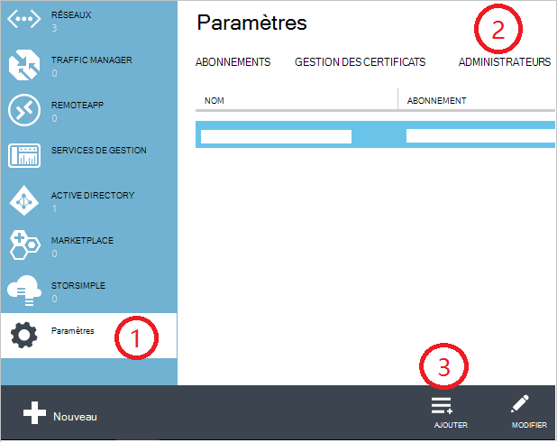

<properties
    pageTitle="Comment faire pour ajouter ou modifier des rôles d’administrateur Azure | Microsoft Azure"
    description="Décrit comment ajouter ou modifier l’administrateur coproduit d’Azure, Service administrateur et administrateur de compte"
    services=""
    documentationCenter=""
    authors="genlin"
    manager="mbaldwin"
    editor=""
    tags="billing"/>

<tags
    ms.service="billing"
    ms.workload="na"
    ms.tgt_pltfrm="na"
    ms.devlang="na"
    ms.topic="article"
    ms.date="08/17/2016"
    ms.author="genli"/>

# Comment faire pour ajouter ou modifier des rôles d’administrateur Azure

Il existe trois types de rôles d’administrateur dans Microsoft Azure :

| Rôle administratif   | Limite de  | Description
| ------------- | ------------- |---------------|
|Compte administrateur (AA)  | 1 par compte Azure  |Il s’agit de la personne qui a signé pour ou acheté les abonnements Azure et est autorisée à accéder au [Centre de compte](https://account.windowsazure.com/Home/Index) et d’effectuer diverses tâches de gestion. Celles-ci incluent la possibilité de créer des abonnements, annuler les abonnements, modifier la facturation d’un abonnement et changer l’administrateur de Service.
| Service administrateur (SA) | 1 par abonnement Azure  |Ce rôle est autorisé à gérer les services dans le [portail Azure](https://portal.azure.com). Par défaut, pour un nouvel abonnement, l’administrateur de compte est également l’administrateur de Service.|
|Administrateur de collaboration (CA) dans [Azure portal classique](https://manage.windowsazure.com)|200 par abonnement| Ce rôle a les mêmes privilèges d’accès en tant que l’administrateur de Service, mais ne pouvez pas modifier de l’association d’abonnements aux répertoires Azure. |

> [AZURE.NOTE] Azure contrôle d’accès basé sur Active Directory rôle (RBAC) permet aux utilisateurs d’être ajouté à plusieurs rôles. Pour plus d’informations, consultez [Contrôle d’accès basé sur le rôle de répertoire actif Azure](./active-directory/role-based-access-control-configure.md).

> [AZURE.NOTE] Si vous avez besoin d’obtenir de l’aide à tout moment dans cet article, veuillez [contacter le support technique](https://portal.azure.com/?#blade/Microsoft_Azure_Support/HelpAndSupportBlade) pour obtenir votre problème résolu rapidement.

## L’ajout d’un administrateur pour un abonnement

**Azure portal**

1. Connectez-vous au [portail Azure](https://portal.azure.com).

2. Dans le menu de concentrateur, sélectionnez **abonnement** > *l’abonnement que vous souhaitez que l’administrateur d’accéder à*.

    

3. Dans la blade d’abonnement, sélectionnez **paramètres**> **les utilisateurs**.

    
4. De la lame d’utilisateurs, sélectionnez **Ajouter**>**Sélectionner un rôle** > **propriétaire**.

    

    **Remarque**
    - Le rôle de propriétaire a les mêmes privilèges d’accès en tant qu’administrateur de collaboration. Ce rôle n’a pas le privilège d’accès au [Centre de compte Azure](https://account.windowsazure.com/subscriptions).
    - Les propriétaires que vous avez ajouté via le [portail Azure](https://portal.azure.com) ne peut pas gérer les services dans [Azure portal classique](https://manage.windowsazure.com).  

5. Tapez l’adresse de messagerie de l’utilisateur que vous souhaitez ajouter en tant que propriétaire et cliquez sur l’utilisateur, puis cliquez sur **Sélectionner**.

    

**Azure portal classique**

1. Connectez-vous à l' [Azure portal classique](https://manage.windowsazure.com/).

2. Dans le volet de navigation, sélectionnez **paramètres**> **les administrateurs**> **Ajouter**.  

    

3. Tapez l’adresse de messagerie de la personne que vous souhaitez ajouter en tant qu’administrateur de collaboration, puis sélectionnez l’abonnement que vous souhaitez co-l’administrateur pour accéder à. 

     

L’adresse e-mail suivante peut être ajouté en tant qu’un administrateur de collaboration :

* **Compte Microsoft** (anciennement Windows Live ID)  
 Vous pouvez utiliser un Account de Microsoft pour vous connecter à tous les produits de Microsoft orientés consommateur et cloud services, tels que Outlook (Hotmail), Skype (MSN), OneDrive, Windows Phone et Xbox LIVE.
* **Compte d’organisation** 
 Un compte d’organisation est un compte qui est créé sous Azure Active Directory. L’adresse du compte d’organisation ressemble à ce qui suit : user@ &lt;votre domaine&gt;. onmicrosoft.com

### Limitations et restrictions

 * Chaque abonnement est associé à un annuaire AD Azure (également connu sous le nom du répertoire par défaut). Pour rechercher le répertoire par défaut, l’abonnement est associé, atteindre l' [Azure portal classique](https://manage.windowsazure.com/), sélectionnez **paramètres** > **abonnements**. Vérifiez l’ID d’abonnement pour rechercher le répertoire par défaut.

 * Si vous êtes connecté avec un Account de Microsoft, vous ne pouvez ajouter autres Accounts Microsoft ou des utilisateurs dans le répertoire par défaut en tant qu’administrateur de collaboration.

 * Si vous êtes connecté avec un compte d’organisation, vous pouvez ajouter d’autres comptes d’organisation de votre organisation en tant qu’administrateur de collaboration. Par exemple, abby@contoso.com pouvez ajouter bob@contoso.com en tant qu’administrateur du Service ou administrateur de collaboration, mais vous ne pouvez pas ajouter john@notcontoso.com , sauf si john@noncontoso.com est l’utilisateur dans le répertoire par défaut. Les utilisateurs connectés avec des comptes d’organisation peuvent continuer à ajouter des utilisateurs de Microsoft Account en tant qu’administrateur du Service ou co administrateur.

 * Maintenant qu’il est possible d’ouvrir une session avec un compte d’organisation dans Azure, voici les modifications apportées aux spécifications des comptes de Service administrateur et administrateur de collaboration :

    Méthode de connexion| Ajouter des Account Microsoft ou des utilisateurs dans le répertoire par défaut en tant qu’autorité de certification ou SA ?  |Ajouter le compte de l’organisation dans la même organisation que l’autorité de certification ou SA ? |Ajouter le compte de l’organisation dans une autre organisation en tant qu’autorité de certification ou SA ?
    ------------- | ------------- |---------------|---------------
    Compte Microsoft |Oui|N°|N°
    Compte d’organisation|Oui|Oui|N°

## Comment modifier un administrateur du Service pour un abonnement

Seul l’administrateur de compte peut modifier l’administrateur Service d’un abonnement.

1. Ouvrez une session dans le [Centre de compte Azure](https://account.windowsazure.com/subscriptions) à l’aide de l’administrateur de compte.

2. Sélectionnez l’abonnement que vous souhaitez modifier.

3. Sur le côté droit, cliquez sur **Modifier l’abonnement** .  

    

4. Dans la zone de **l’Administrateur de SERVICE** , entrez l’adresse de messagerie du nouvel administrateur de Service.  

    

## Comment faire pour modifier le compte d’administrateur

Pour transférer la propriété du compte Azure vers un autre compte, voir [Transférer la propriété d’un abonnement Azure](billing-subscription-transfer.md).

## Étapes suivantes

* Pour plus d’informations sur la façon dont l’accès aux ressources est contrôlé dans Microsoft Azure, consultez [accès aux ressources de présentation dans Azure](./active-directory/active-directory-understanding-resource-access.md)

* Pour plus d’informations sur la façon dont Azure Active Directory est liée à votre abonnement Azure, consultez [comment Azure abonnements sont associés à Active Directory de Azure](./active-directory/active-directory-how-subscriptions-associated-directory.md)

* Pour plus d’informations sur la façon dont Azure Active Directory est liée à votre abonnement Azure, consultez [affectation les rôles d’administrateur dans Azure Active Directory](./active-directory/active-directory-assign-admin-roles.md)

> [AZURE.NOTE] Si vous en avez d’autres questions, veuillez [contacter le support technique](https://portal.azure.com/?#blade/Microsoft_Azure_Support/HelpAndSupportBlade) pour obtenir votre problème résolu rapidement.
