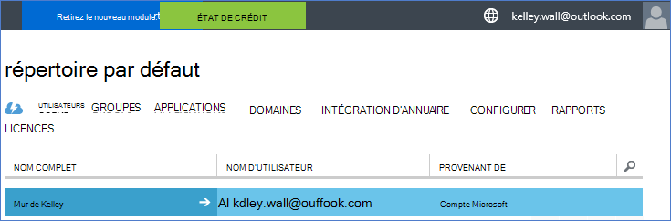
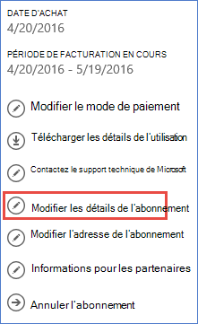
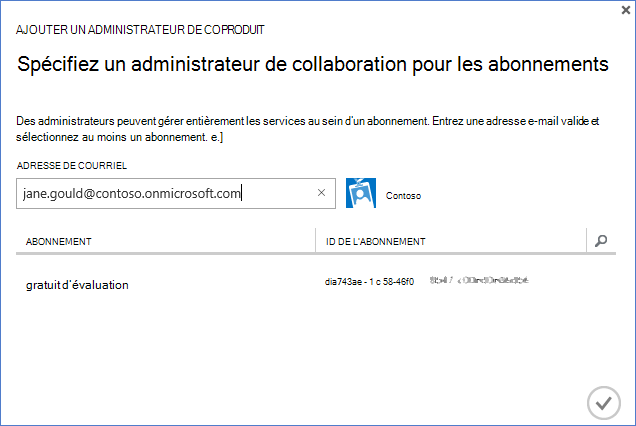

<properties
    pageTitle="Utilisez un client Office 365 avec un abonnement Azure | Microsoft Azure"
    description="Découvrez comment ajouter un répertoire Office 365 (clients) à un abonnement Azure pour établir l’association."
    services=""
    documentationCenter=""
    authors="JiangChen79"
    manager="mbaldwin"
    editor=""
    tags="billing,top-support-issue"/>

<tags
    ms.service="billing"
    ms.workload="na"
    ms.tgt_pltfrm="ibiza"
    ms.devlang="na"
    ms.topic="article"
    ms.date="09/16/2016"
    ms.author="cjiang"/>

# Associer un client Office 365 avec un abonnement Azure
Si vous avez acquis séparément les abonnements à la fois Azure et Office 365 dans le passé, et maintenant vous voulez être en mesure d’accéder à Office 365 locataire depuis l’abonnement Azure, il est facile à faire. Cet article vous montre comment.

> [AZURE.NOTE] Cet article ne s’applique pas aux clients de l’accord entreprise (EA).

## Guide rapide
Pour associer votre client Office 365 à votre abonnement Azure, votre compte Azure permet d’ajouter vos clients Office 365 et puis associer votre abonnement Azure le locataire d’Office 365.

## Procédure détaillée
Dans ce scénario, Kelley Wall est un utilisateur qui possède un abonnement Azure sous le compte kelley.wall@outlook.com. Kelley a également un abonnement à Office 365 sous le compte kelley.wall@contoso.onmicrosoft.com. Kelley souhaite à présent accéder à Office 365 locataire avec l’abonnement Azure.

### Conditions préalables
Pour l’association fonctionne correctement, les conditions préalables suivantes sont nécessaires :

- Vous devez les informations d’identification de l’administrateur de service de l’abonnement Azure. Impossible d’exécuter un sous-ensemble des étapes des administrateurs.
- Vous devez les informations d’identification d’un administrateur global de la cliente Office 365.
- L’adresse e-mail de l’administrateur de service ne doit pas se trouver dans le client Office 365.
- L’adresse e-mail de l’administrateur de service ne doit pas nécessairement correspondre celle de n’importe quel administrateur global de la cliente Office 365.
- Si vous utilisez actuellement une adresse de messagerie qui est à la fois un compte Microsoft et un compte d’organisation, modifier temporairement l’administrateur de service de votre abonnement Azure pour utiliser un autre compte Microsoft. Vous pouvez créer un nouveau compte Microsoft à la [page d’inscription de compte Microsoft](https://signup.live.com/).

Pour modifier l’administrateur de votre service, procédez comme suit :

1. Ouvrez une session sur le [portail de gestion de compte](https://account.windowsazure.com/subscriptions).
2. Sélectionnez l’abonnement que vous souhaitez modifier.
3. Sélectionnez **Modifier les détails de l’abonnement**.

    

4. Dans la zone de **l’Administrateur de SERVICE** , entrez l’adresse de messagerie du nouvel administrateur de service.

    

### Associer les clients Office 365 avec l’abonnement Azure
Pour associer les clients Office 365 à l’abonnement Azure, procédez comme suit :

1.  Ouvrez une session sur le [portail de gestion de compte](https://account.windowsazure.com/subscriptions) avec les informations d’identification d’administrateur de service.
2.  Dans le volet gauche, sélectionnez **ACTIVE DIRECTORY**.

    

    > [AZURE.NOTE] Vous ne devriez pas voir le locataire d’Office 365. Si elle s’affiche, passez à l’étape suivante.

    

3. Ajoutez les clients Office 365 à votre abonnement Azure.

    une barre d’outils. Sélectionnez **Nouveau** > **répertoire** > **créer personnalisé**.

    

    b. Dans la page **Ajouter un répertoire** , sous **répertoire**, sélectionnez **utiliser un répertoire existant**. Sélectionnez **je suis prêt à être maintenant déconnecté**, puis sélectionnez **complète** .

    

    c. Une fois que vous êtes déconnecté, connectez-vous avec les informations d’identification de l’administrateur global de vos clients Office 365.

    

    d. Sélectionnez **Continuer**.

    

    e. Sélectionnez **Fermer la session maintenant**.

    

    f. Ouvrez une session sur le [portail de gestion de compte](https://account.windowsazure.com/subscriptions) avec les informations d’identification d’administrateur de service.

    

    g. Vous devriez voir vos clients Office 365 dans le tableau de bord.

    

4. Modifiez le répertoire associé à l’abonnement Azure.

    une barre d’outils. Sélectionnez **paramètres**.

    

    b. Sélectionnez votre abonnement Azure et sélectionnez **Modifier le répertoire**.
    

    c. Sélectionnez **suivant** .

    

    > [AZURE.WARNING] Vous recevrez un avertissement que tous les administrateurs de coopération seront supprimées.

    

    >[AZURE.WARNING] En outre, tous les utilisateurs du [contrôle d’accès basée sur les rôles (RBAC)](./active-directory/role-based-access-control-configure.md) avec accès attribué dans les groupes de ressources existants seront également supprimés. Toutefois, le message d’avertissement mentionne uniquement la suppression de vos administrateurs.

    

    d. Sélectionnez **complète** .

5. Vous pouvez désormais ajouter vos comptes d’organisation Office 365 en tant qu’administrateurs de collaboration au locataire Azure Active Directory.

    une barre d’outils. Sélectionnez l’onglet **administrateurs** et sélectionnez **Ajouter**.

    

    b. Entrez un compte d’organisation de vos clients Office 365, sélectionnez l’abonnement Azure et puis sélectionnez **complète** .

    

    c. Cliquez sur l’onglet **administrateurs** . Vous devez voir le compte d’organisation s’affiche en tant qu’administrateur de collaboration.

    

6. Ensuite, vous pouvez tester l’accès avec co l’administrateur.

    une barre d’outils. Se déconnecter du portail de gestion de compte.

    b. Ouvrez le [portail de gestion de compte](https://account.windowsazure.com/subscriptions) ou l' [Azure portal](https://portal.azure.com/).

    c. Si la page de connexion Azure a un lien de **vous connecter avec votre compte d’entreprise**, cliquez sur le lien. Dans le cas contraire, ignorez cette étape.

    

    d. Entrez les informations d’identification de co-l’administrateur, puis sélectionnez **connecter**.

    

## Étapes suivantes
Scénarios connexes sont les suivants :

- Vous avez un abonnement à Office 365 déjà et que vous êtes prêt pour un abonnement Azure, mais que vous souhaitez utiliser les comptes utilisateur Office 365 pour votre abonnement Azure.
- Vous êtes un abonné Azure et que vous souhaitez obtenir un abonnement à Office 365 pour les utilisateurs de votre instance d’Azure Active Directory existant.

Pour savoir comment effectuer ces tâches, voir [utiliser votre Office 365 existant compte avec votre abonnement Azure, ou vice versa](billing-use-existing-office-365-account-azure-subscription.md).
