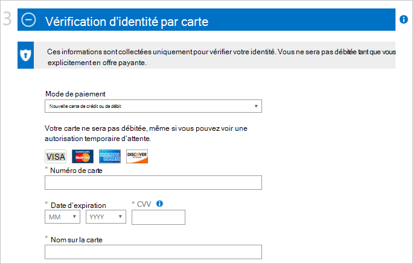
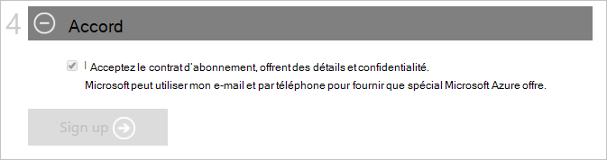

<properties
    pageTitle="Comment faire pour vous inscrire à, acheter, mettre à niveau ou activer un abonnement Azure | Microsoft Azure"
    description="Décrit la manière d’acheter ou de souscrire à un abonnement Azure"
    services=""
    documentationCenter=""
    authors="genlin"
    manager="mbaldwin"
    editor=""
    tags="billing,top-support-issue"
    />

<tags
    ms.service="billing"
    ms.workload="na"
    ms.tgt_pltfrm="na"
    ms.devlang="na"
    ms.topic="article"
    ms.date="09/23/2016"
    ms.author="genli"/>

# Comment s’inscrire, d’achat, de mise à niveau ou activer Azure

> [AZURE.NOTE] Si vous avez besoin d’obtenir de l’aide à tout moment dans cet article, veuillez [contacter le support technique](https://portal.azure.com/?#blade/Microsoft_Azure_Support/HelpAndSupportBlade) pour obtenir votre problème résolu rapidement.

Azure propose différentes offres pour répondre aux besoins de votre entreprise et de mise en route dans Azure. Visitez [Azure offre](https://azure.microsoft.com/support/legal/offer-details/) pour une liste complète de toutes les offres actives avec des informations détaillées sur chaque offre sur ce qu’ils garde, avantages et la disponibilité par pays/région.

## Azure offre - avantages et limites

Le tableau suivant fournit des détails sur les offres courantes :

| Offre                                                                              | Détail |
|--------------------------------------------------------------------------------------|---------|
| Version d’évaluation gratuite                                                                           |• [Guide étape par étape et d’inscription](billing-buy-sign-up-azure-subscription.md#SignupFreeTrial) • [Avantages](https://azure.microsoft.com/pricing/free-trial/) • [Forum aux questions](https://azure.microsoft.com/pricing/free-trial-faq/) • [Mise à niveau d’une version d’évaluation gratuite de paiement](billing-buy-sign-up-azure-subscription.md#UpgradeFreeToPYG)     |
| Paiement à l’utilisation                                                                        | • [D’abonnement](https://azure.microsoft.com/pricing/purchase-options/) • La [tarification](https://azure.microsoft.com/pricing/)   |
| Recevoir des membres MPN (Microsoft Partner Network) - crédits mensuels d’Azure sans frais | • [Azure des avantages pour les partenaires](https://azure.microsoft.com/offers/ms-azr-0025p/) • [Inscription en tant que partenaire](http://go.microsoft.com/fwlink/?linkid=309258&clcid=0x409) ou [s’abonner à Microsoft Action pack](http://go.microsoft.com/fwlink/?linkid=525768&clcid=0x409) • Utilisez Azure crédits - accéder au [portail MPN](https://partner.microsoft.com) et vérifier votre statut d’éligibilité et suivez les étapes sous clés logicielles et les avantages. Si vous ne pouvez pas vérifier votre admissibilité, contactez [l’assistance technique de MPN](https://partner.microsoft.com/Support/).   |
| Abonnés MSDN et Visual Studio                                                      |• [Avantages de développement/Test MSDN](https://azure.microsoft.com/offers/ms-azr-0023p/) • [Avantages d’abonné de Visual Studio](https://azure.microsoft.com/pricing/member-offers/msdn-benefits-details/) • [Activation de Visual Studio abonné crédit Azure](https://azure.microsoft.com/pricing/member-offers/msdn-benefits-details/) • [Avantages d’activer un Azure MSDN en trois étapes simples](https://www.youtube.com/watch?v=SN2CA71uOEI&feature=youtu.be):  Ouverture de session à la [page compte MSDN](https://msdn.microsoft.com/subscriptions/manage/default.aspx) et vérifier l’éligibilité, cliquez sur « Activer les Azure avantage ». Si vous ne pouvez pas vérifier votre admissibilité, contacter les [Centres de Service clientèle abonnements MSDN](https://msdn.microsoft.com/subscriptions/contactus.aspx).|
| BizSpark                                                                             | • [Avantages BizSpark](https://www.microsoft.com/bizspark/default.aspx#start-two). Pour plus d’informations, reportez-vous à la section [crédit mensuel Azure pour Visual Studio Enterprise](https://azure.microsoft.com/offers/ms-azr-0064p/) • [Rejoignez BizSpark](https://www.microsoft.com/bizspark/signup/default.aspx). Si vous rencontrez des problèmes, veuillez contacter l' [Équipe de BizSpark](mailto:bizspark@microsoft.com?subject=BizSpark%20Support&body=Thank%20you%20for%20contacting%20BizSpark.%20Please%20provide%20as%20much%20of%20the%20following%20information%20as%20possible,%20as%20it%20will%20help%20expedite%20our%20response%20to%20you.%0aContact%20name:%0aStartup%20name:%0aMicrosoft%20Account/Live%20ID:%0aSpecific%20description%20of%20issue%20experienced%20or%20question:%0a%0aThank%20you,%0a%0aThe%20BizSpark%20Team).      |
| Plus de BizSpark                                                                        |• [Découvrez BizSpark Plus](https://www.microsoft.com/bizspark/plus/default.aspx). Pour plus d’informations, consultez [BizSpark ainsi que des avantages](https://azure.microsoft.com/offers/ms-azr-0149p/) Contactez mise à niveau vers Plus de BizSpark • [BizSpark de rejoindre](https://www.microsoft.com/bizspark/signup/default.aspx) et travailler avec votre partenaire. Si vous rencontrez des problèmes, veuillez contacter l' [Équipe de BizSpark](mailto:bizspark@microsoft.com?subject=BizSpark%20Support&body=Thank%20you%20for%20contacting%20BizSpark.%20Please%20provide%20as%20much%20of%20the%20following%20information%20as%20possible,%20as%20it%20will%20help%20expedite%20our%20response%20to%20you.%0aContact%20name:%0aStartup%20name:%0aMicrosoft%20Account/Live%20ID:%0aSpecific%20description%20of%20issue%20experienced%20or%20question:%0a%0aThank%20you,%0a%0aThe%20BizSpark%20Team).     |
| Revendeurs (programmes de licence en Volume Open)                                             |• [Service d’activation en ligne clé - guide étape par étape](billing-buy-sign-up-azure-subscription.md#activateKey) • [Achat, avantages, activer](https://azure.microsoft.com/offers/ms-azr-0111p/)        |
| EA (accord entreprise)                                                            |• [Licence Azure pour l’entreprise](https://azure.microsoft.com/pricing/enterprise-agreement/) • Pour l’activer, contactez votre responsable de compte Microsoft ou votre revendeur pour commencer dès aujourd'hui     |

## S’inscrire pour un abonnement d’essai Azure

Pour vous inscrire pour un abonnement d’essai gratuit d’Azure, vous devez fournir un numéro de téléphone, une carte de crédit et une Account de Microsoft. Votre compte Microsoft est l’adresse de messagerie que vous utilisez, ainsi que votre mot de passe pour vous connecter à n’importe quel programme de Windows Live ou d’un service, comme Outlook, MSN Hotmail ou OneDrive. Vous pouvez configurer un compte de Microsoft à l’aide de n’importe quelle adresse de messagerie appartenant à vous, y compris votre adresse de courriel de société. Pour plus d’informations, reportez-vous à la section [compte de Microsoft Forum aux questions](https://www.microsoft.com/account/faq.aspx) .

Consultez [Résolution des problèmes d’abonnement Azure](billing-troubleshoot-azure-sign-up-issues.md) si vous rencontrez des problèmes.

>[AZURE.NOTE] Vos informations de carte de crédit et le numéro de téléphone sont utilisées uniquement pour vérifier votre identité. Bien que votre carte de crédit ne sera débitée, Microsoft place un blocage d’autorisation dessus pour une quantité minimale vérifier que la carte de crédit est valide. Le blocage est libéré dans les 3 à 5 jours ouvrables, selon les stratégies de votre établissement financier.

1. Ouvrez la [page de version d’évaluation gratuite Azure](https://azure.microsoft.com/pricing/free-trial/)et sélectionnez **Démarrer maintenant**.

2. Connectez-vous avec votre compte Microsoft ou d’un compte d’organisation.

3. Dans la section **vous concernant** , saisissez vos informations personnelles. [En savoir plus](billing-troubleshoot-azure-sign-up-issues.md#i-am-getting-an-error-when-entering-my-information-to-sign-up) sur la saisie de vos informations personnelles avec précision.

    

    >[AZURE.NOTE] Les informations d’adresse et pays e-mail que vous fournissez lors de votre inscription pour un abonnement Azure seront toujours associées à l’abonnement et ne peut pas être modifiées ultérieurement.

4. Dans la section **vérification par téléphone** , vous devez fournir un numéro de téléphone pour recevoir un code de vérification que vous pouvez fournir pour terminer le processus de vérification.

    Vous pouvez choisir de recevoir le code de vérification sous la forme d’un message texte ou via un appel vocal. Faites votre choix en sélectionnant **Envoyer le message texte** ou **M’appeler**. Sélectionnez le code de numérotation internationale pour votre pays dans la première zone et entrez votre numéro de téléphone dans la deuxième zone. Après avoir reçu le code de vérification, entrez-le dans la troisième zone, puis sélectionnez le bouton **vérifier le code** . [Consultez cet article pour plus de détails](billing-troubleshoot-azure-sign-up-issues.md#i-am-not-getting-text-messages-or-calls-during-account-verification-when-i-try-to-sign-up).

    >[AZURE.NOTE] Vous ne pouvez pas utiliser un numéro de téléphone VOIP pour le processus de vérification du téléphone.

    

    Si vous ne recevez pas un message de texte ou d’un appel, essayez d’utiliser un autre numéro de téléphone ou contacter le [Support technique de Azure](https://portal.azure.com/#blade/Microsoft_Azure_Support/HelpAndSupportBlade) pour de l’aide.

5. Dans la section **vérification par carte** , entrez les détails d’une carte de crédit valide. Ces informations sont collectées uniquement pour vérifier votre identité.

    Si vous recevez une erreur après avoir envoyé vos informations de carte de crédit, voir l’article [ma carte de crédit n’est pas transmis lors de l’inscription pour Azure](billing-credit-card-fails-during-azure-sign-up.md).

    

6. Dans la section de **l’accord** , cochez la case si vous acceptez le contrat d’abonnement, détails de l’offre et déclaration de confidentialité. Puis sélectionnez **inscrire**. Le formulaire de contrat peut-être varier selon les pays.

    

    Il peut prendre quelques minutes pour configurer votre abonnement. Si le programme d’installation d’abonnement ne se termine pas dans les 15 minutes, contactez le [Support d’Azure](https://portal.azure.com/#blade/Microsoft_Azure_Support/HelpAndSupportBlade) .

    > [AZURE.NOTE] Si vous obtenez un message d’erreur, suivez les étapes dans le message pour résoudre le problème. Un message d’erreur typique est :

    > **Désolé, que nous ne pourrions pas terminer l’opération. Veuillez réessayer plus tard ou de recharger la page web**

    > Dans ce cas, essayez d’utiliser un autre navigateur pour terminer le processus d’inscription. Si le problème persiste, contactez le [Support de Azure](https://portal.azure.com/#blade/Microsoft_Azure_Support/HelpAndSupportBlade) pour de l’aide.

7. Lorsque l’abonnement est prêt, sélectionnez **Démarrer la gestion de mon service** pour commencer.

    

### Ressources supplémentaires

- [Je n’arrive pas à activer une version d’essai Azure](billing-troubleshoot-azure-sign-up-issues.md#i-cant-activate-an-azure-free-trial)
- [Version d’essai azure Forum aux questions](https://azure.microsoft.com/pricing/free-trial-faq/).

## Mise à niveau d’essai Azure pour paiement

1. Ouvrez une session sur le [Portail de compte Azure](https://account.windowsazure.com/subscriptions) en utilisant le compte Microsoft ou votre compte d’organisation que vous avez utilisé pour vous inscrire pour la version d’évaluation gratuite.

2. Sélectionnez l’abonnement, puis **mettre à niveau**

    

3. Cliquez sur **Oui**et sélectionnez **mettre à niveau maintenant**.

    

Lors de la mise à niveau d’un abonnement de paiement d’un abonnement gratuit d’évaluation, les avantages des restes de votre version d’évaluation gratuite comme la limite de 30 jours ou 200 $ de crédit à utiliser sur les services Azure continuera jusqu'à ce qu’un d’eux est épuisé. La mise à niveau d’abonnement se produit par la suite.

## Activer à l’aide d’une clé d’Activation Service en ligne

Si vous acheté des crédits **d’Azure dans ouvert** auprès d’un revendeur et a obtenu une clé d’activation (clé de 5 x 5), procédez comme suit pour activer votre abonnement :

1. Accédez à la [page Résumé des abonnements](https://account.windowsazure.com/subscriptions).

2. Sélectionnez **Azure dans ouvrir**. Dans la page [Azure dans la clé de licence Open](https://azure.microsoft.com/offers/ms-azr-0111p/) , sélectionnez **Activer un nouvel abonnement ou l’abonnement existant**.

3. Entrez la clé de produit et puis vérifiez l’option de l’accord.

> [AZURE.NOTE] Si vous en avez d’autres questions, veuillez [contacter le support technique](https://portal.azure.com/?#blade/Microsoft_Azure_Support/HelpAndSupportBlade) pour obtenir votre problème résolu rapidement.
