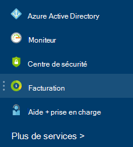

<properties
    pageTitle="Comment faire pour télécharger votre facture et tous les jours des données d’utilisation de la facturation de Azure | Microsoft Azure"
    description="Décrit comment télécharger votre facturation Azure et les données d’utilisation quotidienne"
    services=""
    documentationCenter=""
    authors="genlin"
    manager="mbaldwin"
    editor=""
    tags="billing"
    />

<tags
    ms.service="billing"
    ms.workload="na"
    ms.tgt_pltfrm="na"
    ms.devlang="na"
    ms.topic="article"
    ms.date="10/10/2016"
    ms.author="genli"/>

# Comment faire pour télécharger votre facture et tous les jours des données d’utilisation de la facturation de Azure

> [AZURE.NOTE] Si vous avez besoin d’obtenir de l’aide à tout moment dans cet article, veuillez [contacter le support technique](https://portal.azure.com/?#blade/Microsoft_Azure_Support/HelpAndSupportBlade) pour obtenir votre problème résolu rapidement.

En tant que l’administrateur du compte Azure, vous pouvez afficher la facture de facturation et les données d’utilisation quotidienne à [Azure portal](https://portal.azure.com) ou le [Centre de compte Azure](https://account.windowsazure.com/subscriptions). Voici comment :

## Azure portal

1. Connectez-vous au [portail Azure](https://portal.azure.com) comme l’administrateur de compte.

    >[AZURE.NOTE] Seul l’administrateur de compte a l’autorisation d’accéder aux données de facturation. Pour plus d’informations sur la façon de savoir qui est l’administrateur du compte de l’abonnement, consultez le [Forum aux questions](billing-subscription-transfer.md#faq).

2. Dans le menu de concentrateur, sélectionnez **facturation**. Sur la lame **de facturation** , vous pouvez trouver des informations utiles comme la prochaine date de facturation.

    
3. Dans la section des **frais d’abonnement** , sélectionnez l’abonnement que vous souhaitez afficher.

    
4. Cliquez sur **facturation et utilisation**.

    

5. Sur la lame de **l’historique de facturation** , cliquez sur **Télécharger la facture** pour afficher une copie de votre facture. Cliquez sur une période de facturation pour afficher les données d’utilisation tous les jours.

    

## Centre de compte Azure

1. Connectez-vous au [Centre du compte Azure](https://account.windowsazure.com/subscriptions) comme l’administrateur de compte.
2. Sélectionnez l’abonnement pour lequel vous souhaitez que les informations de facture et de l’utilisation.
3. Sélectionnez **l’historique de facturation**.  
4. Vous pouvez voir vos relevés pour les six derniers périodes de facturation et de la période de non facturée en cours.   
5. Sélectionnez l' **Instruction en cours d’affichage** pour voir une estimation de vos frais au moment de que la génération de l’estimation. Cette information est uniquement mis à jour quotidiennement et ne peut pas inclure l’utilisation de tous les. Votre facture mensuelle peut différer de cette estimation.   
6. Sélectionnez **Télécharger la facture** pour consulter une copie de votre facture en dernier.  
7. Sélectionnez **Utilisation de téléchargement** pour télécharger les données d’utilisation tous les jours sous la forme d’un fichier CSV. 

> [AZURE.NOTE] Si vous en avez d’autres questions, veuillez [contacter le support technique](https://portal.azure.com/?#blade/Microsoft_Azure_Support/HelpAndSupportBlade) pour obtenir votre problème résolu rapidement.
