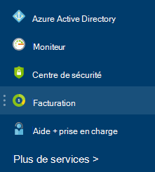

<properties
    pageTitle="Comprendre vos charges de service externes Azure | Microsoft Azure"
    description="En savoir plus sur la facturation des services externes, anciennement appelé Marketplace, frais dans Azure."
    services=""
    documentationCenter=""
    authors="adpick"
    manager="felixwu"
    editor=""
    tags="billing"
    />

<tags
    ms.service="billing"
    ms.workload="na"
    ms.tgt_pltfrm="na"
    ms.devlang="na"
    ms.topic="article"
    ms.date="10/12/2016"
    ms.author="adpick"/>

# Comprendre vos charges de service externes Azure

Cet article explique la facturation des services externes dans Azure. Les services externes utilisés à appeler les commandes Marketplace. Services externes proposés par les fournisseurs de services indépendants, mais sont intégrés complètement dans l’écosystème Azure. Découvrez comment :

- Identifier les Services externes
- Comprendre comment la facturation diffère des autres ressources Azure
- Permet d’afficher et d’effectuer le suivi de tous les coûts que vous provisionnez à partir de l’utilisation des services externes
- Gérer les commandes de service externe et le mode de paiement pour les

## Quels sont les services externes Azure ?

Services externes utilisés pour être appelé Azure Marketplace. En règle générale, il s’agit des services publiés par des tiers disponibles pour Azure. Par exemple, ClearDB et SendGrid sont des services externes qui vous pouvez acheter dans Azure, mais qui ne sont pas publiés par Microsoft.

### Identifier les services externes

Lorsque vous configurez un nouveau service externe ou une ressource, un avertissement s’affiche :

>[AZURE.NOTE] Les services externes sont publiés par des sociétés qui ne sont pas Microsoft, mais parfois produits Microsoft peuvent également être classés comme des services externes.

### Les services externes sont facturés séparément

Les services externes sont traitées comme des commandes dans votre abonnement Azure. La période de facturation pour chaque service est définie lorsque vous achetez le service. À ne pas confondre avec la période de facturation de l’abonnement dans lesquelles vous en avez acheté. Vous recevez également des effets distincts, et votre carte de crédit est facturée séparément.

### Chaque service externe a un autre modèle de facturation

Certains services sont facturées dans un mode de paiement, alors que d’autres utilisent un modèle de base de paiement mensuel. Vous avez besoin d’une carte de crédit pour Azure services externes, vous ne peut pas acheter des services externes avec paiement de la facture.

### Vous ne pouvez pas utiliser mensuels crédits gratuits pour les services externes

Si vous utilisez un abonnement Azure qui comprend les [crédits gratuits](https://azure.microsoft.com/pricing/spending-limits/), ils ne peuvent pas appliqués pour les factures de service externe. Utiliser une carte de crédit pour acheter des services externes.

## Afficher les dépenses service externe et l’historique

Vous pouvez afficher la liste des services externes qui se trouvent sur chaque abonnement au sein du [portail Azure](https://portal.azure.com/): 

1. Connectez-vous au [portail Azure](https://portal.azure.com/) et [Atteindre la lame **de facturation** ](https://portal.azure.com/?flight=1#blade/Microsoft_Azure_Billing/BillingBlade).

     
  
2. Dans la section des **frais d’abonnement** , sélectionnez l’abonnement que vous souhaitez afficher. 
   
    

3. Cliquez sur **les services externes**.

    

4. Vous devriez voir chacune de vos commandes de service externe, nom de l’éditeur, niveau de service que vous avez acheté, nom que vous avez donné à la ressource et l’état actuel de la commande. Sélectionnez un service externe pour voir les dernières factures.

    

5. À ce stade, vous pouvez afficher au-delà des montants de facture dont la répartition de la taxe.

    

## Gérer les modes de paiement pour les commandes de service externe

Mettre à jour vos modes de paiement pour les commandes de service externe à partir du [Centre de compte](https://account.windowsazure.com/).

> [AZURE.NOTE] Si vous avez acheté votre abonnement à un compte de travail ou à l’école, vous devez [contacter le support technique](https://portal.azure.com/?#blade/Microsoft_Azure_Support/HelpAndSupportBlade) pour apporter des modifications à votre mode de paiement.

1. Connectez-vous au [Compte Centre](https://account.windowsazure.com/) et [accédez à l’onglet **marketplace** ](https://account.windowsazure.com/Store)

    

2. Sélectionnez le service externe que vous souhaitez gérer

    

3. Cliquez sur **mode de paiement de modification** sur le côté droit de la page. Ce lien affiche un portail différent pour gérer votre moyen de paiement.
    
    

4. Cliquez sur **Modifier les infos** et suivez les instructions pour mettre à jour vos informations de paiement.

    
    
## Annuler une commande de service externe

Si vous souhaitez annuler votre commande de service externe, vous devez supprimer la ressource dans le [portail Azure](https://portal.azure.com).

## Besoin d’aide ? Contactez le support technique.

Si vous en avez d’autres questions, veuillez [contacter le support technique](https://portal.azure.com/?#blade/Microsoft_Azure_Support/HelpAndSupportBlade) pour obtenir votre problème résolu rapidement.
