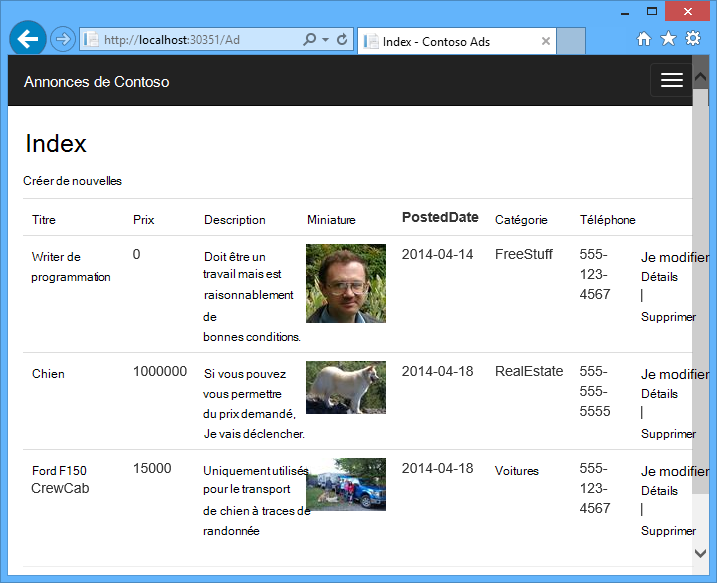
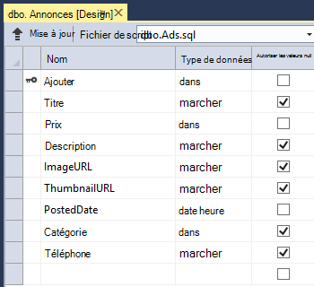
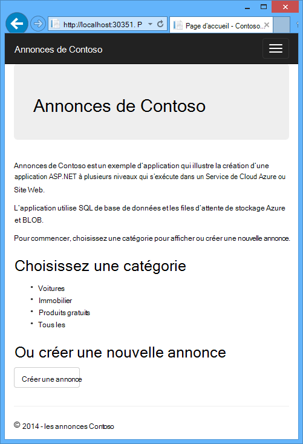
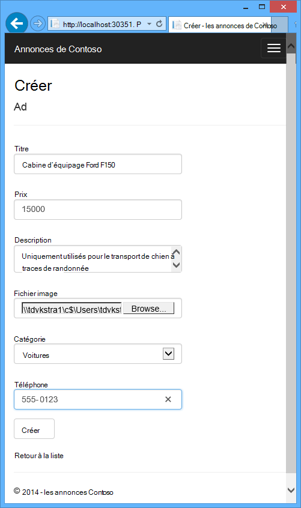
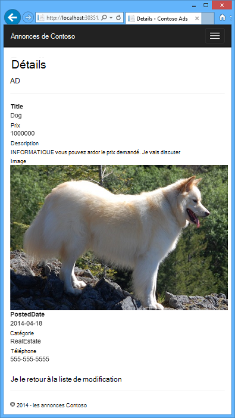
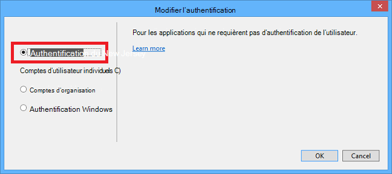

<properties
    pageTitle="Mise en route de ASP.NET et de Services en nuage Azure | Microsoft Azure"
    description="Apprenez à créer une application à plusieurs niveaux à l’aide d’ASP.NET MVC et Azure. L’application s’exécute dans un service en nuage, avec les rôles web et worker. Il utilise des files d’attente de l’Entity Framework et de la base de données SQL Azure Storage et les objets BLOB."
    services="cloud-services, storage"
    documentationCenter=".net"
    authors="Thraka"
    manager="timlt"
    editor=""/>

<tags
    ms.service="cloud-services"
    ms.workload="tbd"
    ms.tgt_pltfrm="na"
    ms.devlang="dotnet"
    ms.topic="hero-article"
    ms.date="06/10/2016"
    ms.author="adegeo"/>

# <a name="get-started-with-azure-cloud-services-and-aspnet"></a>Mise en route avec les Services en nuage Azure et ASP.NET

> [AZURE.SELECTOR]
- [Node.js](cloud-services-nodejs-develop-deploy-app.md)
- [.NET](cloud-services-dotnet-get-started.md)

## <a name="overview"></a>Vue d’ensemble

Ce didacticiel explique comment créer une application de .NET à plusieurs niveaux avec un MVC ASP.NET front-end et le déployer sur un [service cloud Azure](cloud-services-choose-me.md). L’application utilise la [Base de données de SQL Azure](http://msdn.microsoft.com/library/azure/ee336279), le [service d’objet Blob d’Azure](http://www.asp.net/aspnet/overview/developing-apps-with-windows-azure/building-real-world-cloud-apps-with-windows-azure/unstructured-blob-storage)et le [service de file d’attente d’Azure](http://www.asp.net/aspnet/overview/developing-apps-with-windows-azure/building-real-world-cloud-apps-with-windows-azure/queue-centric-work-pattern). Vous pouvez [Télécharger le projet de Visual Studio](http://code.msdn.microsoft.com/Simple-Azure-Cloud-Service-e01df2e4) à partir de la galerie de Code MSDN.

Ce didacticiel vous montre comment générer et exécuter l’application localement, comment le déployer dans Azure et exécutés dans le nuage et, enfin, comment le créer de toutes pièces. Vous pouvez commencer par la création de toutes pièces et faire le test et déployer ensuite les étapes si vous préférez.

## <a name="contoso-ads-application"></a>Application des annonces de Contoso

L’application est un forum de publicité. Les utilisateurs créer une annonce par la saisie de texte et de télécharger une image. Ils peuvent voir une liste de publicités présentant des images miniatures, et ils peuvent voir l’image en taille réelle lorsqu’ils sélectionnent une annonce pour voir les détails.



L’application utilise le [modèle de travail centré sur la file d’attente](http://www.asp.net/aspnet/overview/developing-apps-with-windows-azure/building-real-world-cloud-apps-with-windows-azure/queue-centric-work-pattern) pour décharger le processeur de manière intensive de la création de miniatures à un processus de back-end.

## <a name="alternative-architecture-websites-and-webjobs"></a>Architecture de remplacement : sites Web et WebJobs

Ce didacticiel explique comment exécuter front-end et back-end dans un service cloud Azure. Une alternative consiste à exécuter le serveur frontal dans un [site Web Azure](/services/web-sites/) et utiliser la fonctionnalité [WebJobs](http://go.microsoft.com/fwlink/?LinkId=390226) (actuellement en aperçu) pour le back-end. Pour voir un didacticiel qui utilise WebJobs, [Mise en route avec le Kit de développement logiciel WebJobs Azure](../app-service-web/websites-dotnet-webjobs-sdk-get-started.md). Pour plus d’informations sur la façon de choisir les services qui correspondent le mieux à votre scénario, voir les [sites Web d’Azure, les Services en nuage et comparaison des machines virtuelles](../app-service-web/choose-web-site-cloud-service-vm.md).

## <a name="what-youll-learn"></a>Vous allez apprendre

* Comment activer votre machine de développement Azure en installant le Kit de développement Azure.
* Comment créer un projet de service cloud Visual Studio avec un MVC ASP.NET de rôle web et un rôle worker.
* Comment tester localement, le projet de service cloud à l’aide de l’émulateur de stockage Azure.
* La publication du projet de nuage pour un service cloud Azure et un test à l’aide d’un compte de stockage Azure.
* Comment télécharger des fichiers et de les stocker dans le service d’objet Blob d’Azure.
* Comment utiliser le service de file d’attente d’Azure pour la communication entre les différents niveaux.

## <a name="prerequisites"></a>Conditions préalables

Ce didacticiel suppose que vous comprenez les [concepts de base sur les services en nuage Azure](cloud-services-choose-me.md) comme *les rôles web* et *worker* de la terminologie.  Il suppose également que vous savez comment travailler avec des projets [ASP.NET MVC](http://www.asp.net/mvc/tutorials/mvc-5/introduction/getting-started) ou [Web Forms](http://www.asp.net/web-forms/tutorials/aspnet-45/getting-started-with-aspnet-45-web-forms/introduction-and-overview) dans Visual Studio. L’exemple d’application utilise les MVC, mais la plupart du didacticiel s’applique également aux Web Forms.

Vous pouvez exécuter l’application localement sans un abonnement Azure, mais vous devez un pour déployer l’application vers le nuage. Si vous n’avez pas un compte, vous pouvez [activer vos avantages d’abonné MSDN](/pricing/member-offers/msdn-benefits-details/?WT.mc_id=A55E3C668) ou [Inscrivez-vous pour un essai gratuit](/pricing/free-trial/?WT.mc_id=A55E3C668).

Les instructions du didacticiels fonctionnent avec un des produits suivants :

* Visual Studio 2013
* Visual Studio 2015

Si vous n’avez pas l’une d'entre elles, Visual Studio 2015 sera automatiquement installé lorsque vous installez le Kit de développement Azure.

## <a name="application-architecture"></a>Architecture de l’application

L’application stocke des annonces dans une base de données SQL, à l’aide de Entity Framework Code First pour créer les tables et d’accéder aux données. Pour chaque annonce la base de données stocke les deux URL, une pour l’image en taille réelle et l’autre pour la miniature.



Lorsqu’un utilisateur télécharge une image, le front-end en cours d’exécution dans un rôle web de stocke l’image dans un [blob d’Azure](http://www.asp.net/aspnet/overview/developing-apps-with-windows-azure/building-real-world-cloud-apps-with-windows-azure/unstructured-blob-storage), et il stocke les informations de publicité dans la base de données avec une URL qui pointe vers l’objet blob. Dans le même temps, il écrit un message à une file d’attente Azure. Un processus principal exécute régulièrement dans un rôle worker interroge la file d’attente pour les nouveaux messages. Lorsqu’un nouveau message s’affiche, le rôle de travail crée une miniature de l’image et met à jour le champ de base de données URL miniature pour cette annonce. Le diagramme suivant montre l’interagissent entre les parties de l’application.


[AZURE.INCLUDE [install-sdk](../../includes/install-sdk-2015-2013.md)]

## <a name="download-and-run-the-completed-solution"></a>Téléchargez et exécutez la solution terminée

1. Téléchargez et décompressez le [complété solution](http://code.msdn.microsoft.com/Simple-Azure-Cloud-Service-e01df2e4).

2. Démarrez Visual Studio.

3. Dans le menu **fichier** choisissez **Ouvrir un projet**, naviguez jusqu'à où vous avez téléchargé la solution et puis ouvrez le fichier solution.

3. Appuyez sur CTRL + MAJ + B pour générer la solution.

    Par défaut, Visual Studio restaure automatiquement le contenu du package NuGet, qui ne figurait pas dans le fichier *.zip* . Si les packages ne sont pas restaurées, installez-les manuellement en cliquant le bouton **restaurer** en haut à droite de la boîte de dialogue **Manage NuGet Packages de Solution** .

3. Dans l' **Explorateur de solutions**, vérifiez que **ContosoAdsCloudService** est sélectionné comme projet de démarrage.

2. Si vous utilisez Visual Studio 2015, modifiez la chaîne de connexion SQL Server dans le fichier *Web.config* de l’application du projet ContosoAdsWeb et le fichier *ServiceConfiguration.Local.cscfg* du projet ContosoAdsCloudService. Dans chaque cas, remplacez « \v11.0 (localdb) » « (localdb) \MSSQLLocalDB ».

1. Appuyez sur CTRL + F5 pour exécuter l’application.

    Lorsque vous exécutez un projet de service cloud localement, Visual Studio appelle automatiquement l’Azure *compute émulateur* et Azure *émulateur de stockage*. L’émulateur de calcul utilise les ressources de votre ordinateur pour simuler les rôle et le travailleur rôle des environnements web. L’émulateur de stockage utilise une base de données [SQL Server Express LocalDB](http://msdn.microsoft.com/library/hh510202.aspx) pour simuler le stockage Azure cloud.

    La première fois que vous exécutez un projet de service cloud, elle prend une minute ou, pour les émulateurs Démarrer. Lorsque le démarrage de l’émulateur est terminé, le navigateur par défaut s’ouvre à la page d’accueil de l’application.

    

2. Cliquez sur **créer une annonce**.

2. Entrez quelques données de test et de sélectionner une image *.jpg* à télécharger, puis cliquez sur **créer**.

    

    L’application accède à la page d’Index, mais il n’affiche pas une miniature pour la nouvelle annonce car ce traitement n’a pas encore s’est produit.

3. Attendez quelques instants, puis actualisez la page d’Index pour afficher la miniature.

    

4. Cliquez sur **Détails** pour votre annonce pour voir l’image en taille réelle.

    

Vous avez déjà exécuté l’application entièrement sur votre ordinateur local, sans connexion vers le nuage. L’émulateur de stockage stocke les données de file d’attente et l’objet blob dans une base de données SQL Server Express LocalDB, et que l’application stocke les données Active Directory dans une autre base de données de LocalDB. Entity Framework Code First automatiquement créé la base de données Active Directory la première fois que l’application web a tenté d’y accéder.

Dans la section suivante, vous allez configurer la solution pour l’utilisation des ressources de cloud Azure pour les files d’attente, BLOB et la base de données de l’application lorsqu’elle s’exécute dans le nuage. Si vous souhaitez continuer à s’exécuter localement, mais utilisent des ressources de stockage et base de données de nuage, vous pourriez le faire ; Il s’agit simplement de la définition de chaînes de connexion, vous verrez comment procéder.

## <a name="deploy-the-application-to-azure"></a>Déployer l’application vers Azure

Vous allez effectuer les étapes suivantes pour exécuter l’application dans le nuage :

* Créer un service cloud Azure.
* Créer une base de données SQL d’Azure.
* Créez un compte de stockage Azure.
* Configurer la solution pour utiliser votre base de données Azure SQL lorsqu’il s’exécute dans Azure.
* Configurer la solution pour utiliser votre compte de stockage Azure lorsqu’il s’exécute dans Azure.
* Déployer le projet à votre service cloud Azure.

### <a name="create-an-azure-cloud-service"></a>Créer un service cloud Azure

Un service cloud Azure est l’environnement de dans que l’application s’exécutera.

1. Dans votre navigateur, ouvrez le [Azure portal classique](http://manage.windowsazure.com).

2. Cliquez sur **Nouveau > calcul > Service de Cloud > Création rapide**.

4. Dans la zone URL, entrez un préfixe de l’URL.

    Cette URL doit être unique.  Vous obtiendrez un message d’erreur si le préfixe que vous choisissez est déjà en cours d’utilisation par une autre personne.

5. Choisissez la région dans lequel vous souhaitez déployer l’application.

    Ce champ indique quel centre de données sera hébergée dans votre service cloud. Pour une application de production, vous sélectionnez la région plus proche de vos clients. Pour ce didacticiel, choisissez la région plus proche de vous.

6. Cliquez sur **créer un Service Cloud**.

    Dans l’image suivante, un service en nuage est créé avec l’URL contosoads.cloudapp.net.

    

### <a name="create-an-azure-sql-database"></a>Créer une base de données SQL d’Azure

Lorsque l’application s’exécute dans le nuage, il utilise une base de données en nuage.

1. Dans [Azure portal classique](http://manage.windowsazure.com), cliquez sur **Nouveau > Data Services > base de données de SQL > Création rapide**.

1. Dans la zone **Nom de la base de données** , entrez *contosoads*.

1. Dans la liste déroulante du **serveur** , cliquez sur **nouvelle base de données SQL server**.

    Vous pouvez également, si votre abonnement déjà dispose d’un serveur, vous pouvez sélectionner ce serveur dans la liste déroulante.

1. Choisissez la même **région** que vous avez choisi pour le service en nuage.

    Lorsque le service en nuage et la base de données se trouvent dans différents centres de données (différentes régions), la latence augmentera et vous sera facturé pour la bande passante à l’extérieur du centre de données. La bande passante dans un centre de données est libre.

1. Entrez un **Nom de connexion** d’administrateur et le **mot de passe**.

    Si vous avez sélectionné la **nouvelle base de données SQL server** ne sont pas la saisie d’un nom existant et un mot de passe ici, vous saisissez un nouveau nom et un mot de passe que vous définissez maintenant pour une utilisation ultérieure lorsque vous accédez à la base de données. Si vous avez sélectionné un serveur que vous avez créé précédemment, vous devrez faire pour le mot de passe pour le compte d’utilisateur d’administration que vous avez déjà créé.

1. Cliquez sur **créer une base de données SQL**.

    

1. Azure après création de la base de données, cliquez sur l’onglet **Bases de données SQL** dans le volet gauche du portail, puis cliquez sur le nom de la nouvelle base de données.

2. Cliquez sur l’onglet **tableau de bord** .

3. Cliquez sur **Gérer autorisé des adresses IP**.

4. Sous **Services d’autorisé**, modifier **Services Azure** à **Oui**.

5. Cliquez sur **Enregistrer**.

### <a name="create-an-azure-storage-account"></a>Créer un compte de stockage Azure

Un compte de stockage Azure fournit des ressources pour le stockage des données de file d’attente et l’objet blob dans le nuage.

Dans une application réelle, vous créez généralement des comptes séparés pour application données par rapport aux données de journalisation et est séparé des comptes pour les données de test par rapport aux données de production. Pour ce didacticiel, vous allez utiliser qu’un seul compte.

1. Dans [Azure portal classique](http://manage.windowsazure.com), cliquez sur **Nouveau > Data Services > stockage > Création rapide**.

4. Dans la zone **URL** , entrez un préfixe de l’URL.

    Ce préfixe plus le texte que vous voyez sous la zone sera l’URL unique à votre compte de stockage. Si le préfixe que vous entrez a déjà été utilisé par quelqu'un d’autre, vous devrez choisir un préfixe différent.

5. Définir la **zone de** liste déroulante, à la même région que vous avez choisi pour le service en nuage.

    Lorsque le compte de service et de stockage cloud sont dans des centres de données différentes (différentes régions), la latence augmentera et vous sera facturé pour la bande passante à l’extérieur du centre de données. La bande passante dans un centre de données est libre.

    Les affinités Azure fournissent un mécanisme pour réduire la distance entre les ressources dans un centre de données, ce qui permet de réduire le temps de latence. Ce didacticiel n’utilise pas d’affinités. Pour plus d’informations, consultez [comment créer un groupe d’affinité dans Azure](http://msdn.microsoft.com/library/jj156209.aspx).

6. Affectez la liste déroulante de **réplication** **redondants localement**.

    Lors de la réplication géographique est activée pour un compte de stockage, le contenu stocké est répliqué sur un centre de données secondaire pour permettre le basculement à cet emplacement en cas de sinistre majeur dans l’emplacement principal. Geo-réplication peut entraîner des coûts supplémentaires. Pour les comptes de test et de développement, vous ne souhaitez généralement payer pour la réplication de la zone géographique. Pour plus d’informations, voir [créer, gérer, ou de supprimer un compte de stockage](../storage/storage-create-storage-account.md#replication-options).

5. Cliquez sur **créer un compte de stockage**.

    

    Dans l’image, un compte de stockage est créé avec l’URL `contosoads.core.windows.net`.

### <a name="configure-the-solution-to-use-your-azure-sql-database-when-it-runs-in-azure"></a>Configurer la solution pour utiliser votre base de données Azure SQL lorsqu’il s’exécute dans Azure

Le projet web et le projet de rôle de travail possède sa propre chaîne de connexion de base de données et chacune doit pointer vers la base de données Azure SQL lorsque l’application s’exécute dans Azure.

Vous allez utiliser une [transformation de Web.config](http://www.asp.net/mvc/tutorials/deployment/visual-studio-web-deployment/web-config-transformations) pour le rôle web et un paramètre d’environnement de service cloud pour le rôle de collaborateur.

>[AZURE.NOTE] Dans cette section et la section suivante, vous stockez les informations d’identification dans les fichiers de projet. [Ne stockez pas des données sensibles dans les référentiels de code source publics](http://www.asp.net/aspnet/overview/developing-apps-with-windows-azure/building-real-world-cloud-apps-with-windows-azure/source-control#secrets).

1. Dans le projet ContosoAdsWeb, ouvrez le fichier *Web.Release.config* de transformation pour le fichier *Web.config* de l’application, supprimez le bloc de commentaires qui contient un `<connectionStrings>` élément et collez le code suivant à la place.

    ```xml
    <connectionStrings>
        <add name="ContosoAdsContext" connectionString="{connectionstring}"
        providerName="System.Data.SqlClient" xdt:Transform="SetAttributes" xdt:Locator="Match(name)"/>
    </connectionStrings>
    ```

    Laissez le fichier ouvert pour modification.

2. Dans [Azure portal classique](http://manage.windowsazure.com), cliquez sur **Bases de données SQL** dans le volet gauche, cliquez sur la base de données que vous avez créé pour ce didacticiel, cliquez sur l’onglet **tableau de bord** , puis cliquez sur **Afficher les chaînes de connexion**.

    

    Le portail affiche les chaînes de connexion, avec un espace réservé pour le mot de passe.

    

4. Dans le fichier de transformation *Web.Release.config* , supprimez `{connectionstring}` et coller à la place de la chaîne de connexion ADO.NET à partir du portail classique Azure.

5. Dans la chaîne de connexion que vous avez collé dans le fichier de transformation *Web.Release.config* , remplacez `{your_password_here}` avec le mot de passe que vous avez créé pour la nouvelle base de données SQL.

7. Enregistrez le fichier.  

6. Sélectionnez et copiez la chaîne de connexion (sans les guillemets) pour une utilisation dans les étapes suivantes pour configurer le projet de rôle Collaborateur.

5. Dans l' **Explorateur de solutions**, sous **rôles** dans le projet de service cloud, **ContosoAdsWorker** de droit et puis cliquez sur **Propriétés**.

    

6. Cliquez sur l’onglet **paramètres** .

7. Modifier la **Configuration de Service** **cloud**.

7. Sélectionnez le champ de **valeur** pour le `ContosoAdsDbConnectionString` définition, puis collez la chaîne de connexion que vous avez copiés à partir de la section précédente de ce didacticiel.

    

7. Enregistrez vos modifications.  

### <a name="configure-the-solution-to-use-your-azure-storage-account-when-it-runs-in-azure"></a>Configurer la solution pour utiliser votre compte de stockage Azure lorsqu’il s’exécute dans Azure

Chaînes de connexion de compte de stockage Azure pour le projet de rôle web et le projet de rôle de travail sont stockées dans les paramètres d’environnement dans le projet de service cloud. Pour chaque projet, il existe un ensemble distinct de paramètres à utiliser lorsque l’application s’exécute localement et lorsqu’il s’exécute dans le nuage. Vous allez mettre à jour les paramètres d’environnement de cloud pour les projets de rôles web et worker.

1. Dans l' **Explorateur de solutions**, avec le bouton droit de la **ContosoAdsWeb** sous **rôles** dans le projet **ContosoAdsCloudService** , puis cliquez sur **Propriétés**.

    

2. Cliquez sur l’onglet **paramètres** . Dans la zone de liste déroulante **Configuration de Service** , choisissez le **nuage**.

    

3. Sélectionnez l’entrée **StorageConnectionString** , et vous verrez un bouton de sélection (**...**) à l’extrémité droite de la ligne. Cliquez sur le bouton de sélection pour ouvrir la boîte de dialogue **Chaîne de connexion du compte de stockage créer** .

    

4. Dans la boîte de dialogue **Chaîne de connexion de stockage de créer** , cliquez sur **votre abonnement**et choisissez le compte de stockage que vous avez créé précédemment puis cliquez sur **OK**. Si vous n’êtes pas déjà connecté, vous serez invité pour vos informations d’identification de compte Azure.

    

5. Enregistrez vos modifications.

6. Suivez la même procédure que pour le `StorageConnectionString` chaîne de connexion pour définir la `Microsoft.WindowsAzure.Plugins.Diagnostics.ConnectionString` chaîne de connexion.

    Cette chaîne de connexion est utilisée pour la connexion.

7. Suivez la même procédure que vous avez utilisé pour le rôle **ContosoAdsWeb** pour définir des chaînes de connexion pour le rôle **ContosoAdsWorker** . N’oubliez pas de définir la **Configuration du Service de** **cloud**.

Les paramètres d’environnement de rôle que vous avez configurée à l’aide de l’interface utilisateur de Visual Studio sont stockés dans les fichiers suivants dans le projet ContosoAdsCloudService :

* *ServiceDefinition.csdef* - définit les noms de paramètre.
* *ServiceConfiguration.Cloud.cscfg* - fournit des valeurs pour lorsque l’application s’exécute dans le nuage.
* *ServiceConfiguration.Local.cscfg* - fournit des valeurs pour lorsque l’application s’exécute localement.

Par exemple, le ServiceDefinition.csdef comprend les définitions suivantes.

```xml
<ConfigurationSettings>
    <Setting name="StorageConnectionString" />
    <Setting name="ContosoAdsDbConnectionString" />
</ConfigurationSettings>
```

Et le fichier *ServiceConfiguration.Cloud.cscfg* inclut les valeurs entrées pour ces paramètres dans Visual Studio.

```xml
<Role name="ContosoAdsWorker">
    <Instances count="1" />
    <ConfigurationSettings>
        <Setting name="StorageConnectionString" value="{yourconnectionstring}" />
        <Setting name="ContosoAdsDbConnectionString" value="{yourconnectionstring}" />
        <!-- other settings not shown -->

    </ConfigurationSettings>
    <!-- other settings not shown -->

</Role>
```

Le `<Instances>` paramètre spécifie le nombre de machines virtuelles qui Azure exécutera le travail code de rôle sur. La section [étapes suivantes](#next-steps) contient des liens vers plus d’informations sur la mise à l’échelle un service cloud,

###  <a name="deploy-the-project-to-azure"></a>Déployer le projet vers Azure

1.  Dans l' **Explorateur de solutions**, cliquez sur le projet de nuage **ContosoAdsCloudService** et sélectionnez **Publier**.

    

2. Dans l’étape de l’Assistant **Publier des applications Azure** **vous connecter** , cliquez sur **suivant**.

    

3. Dans les **paramètres** de l’Assistant, cliquez sur **suivant**.

    

    Les paramètres par défaut dans l’onglet **Avancé** sont en bon état pour ce didacticiel. Pour plus d’informations sur l’onglet Avancé, reportez-vous à la section [Publier Assistant Création d’applications Azure](http://msdn.microsoft.com/library/hh535756.aspx).

4. Dans le **Sommaire** , cliquez sur **Publier**.

    

   La fenêtre **Journal d’activité Azure** s’ouvre dans Visual Studio.

5. Cliquez sur l’icône de flèche vers la droite pour développer les détails du déploiement.

    Le déploiement peut prendre 5 minutes ou plus.

    

6. Lorsque l’état du déploiement est terminé, cliquez sur l' **URL d’application Web** pour démarrer l’application.

7. Vous pouvez maintenant tester l’application par la création, l’affichage et la modification des annonces, comme vous l’avez fait lorsque vous avez exécuté l’application localement.

>[AZURE.NOTE] Lorsque vous avez terminé le test, supprimer ou arrêter le service de cloud. Même si vous n’utilisez pas le service en nuage, il accumule des frais, car les ressources de l’ordinateur virtuel sont réservés pour lui. Et si vous le laissez en cours d’exécution, toute personne qui trouve votre adresse URL peut créer et d’afficher des annonces. Dans [Azure portal classique](http://manage.windowsazure.com), accédez à l’onglet de **tableau de bord** pour votre service cloud, puis cliquez sur le bouton **Supprimer** en bas de la page. Si vous souhaitez simplement empêcher temporairement d’autres utilisateurs l’accès au site, cliquez sur **Arrêter** . Dans ce cas, les frais continuera à accumuler. Vous pouvez suivre une procédure similaire pour supprimer le compte de stockage et de base de données SQL lorsque vous n’avez plus besoin.

## <a name="create-the-application-from-scratch"></a>Création de l’application à partir de zéro

Si vous ne l’avez pas déjà téléchargé [l’application terminée](http://code.msdn.microsoft.com/Simple-Azure-Cloud-Service-e01df2e4), le faire maintenant. Vous allez copier les fichiers dans le projet téléchargé dans le nouveau projet.

Création de l’application Contoso annonces implique les étapes suivantes :

* Créer une solution Visual Studio du service nuage.
* Mettre à jour et ajouter des packages NuGet.
* Ensemble de références de projet.
* Configurez les chaînes de connexion.
* Ajoutez les fichiers de code.

Après avoir créé la solution, vous allez consulter le code qui est unique pour les projets de service cloud et BLOB Azure et files d’attente.

### <a name="create-a-cloud-service-visual-studio-solution"></a>Créer une solution Visual Studio de service cloud

1. Dans Visual Studio, choisissez **Nouveau projet** dans le menu **fichier** .

2. Dans le volet gauche de la boîte de dialogue **Nouveau projet** , développez **Visual C#** et choisissez modèles de **Cloud** puis choisissez le modèle de **Service de Cloud Azure** .

3. Nommez le projet et la solution ContosoAdsCloudService, puis cliquez sur **OK**.

    

4. Dans la boîte de dialogue **Nouveau Azure Cloud Service** , ajoutez un rôle web et un rôle worker. Le rôle web ContosoAdsWeb le nom et le rôle de travail ContosoAdsWorker de nom. (Utilisez l’icône de crayon dans le volet de droite pour modifier les noms par défaut des rôles).

    

5. Lorsque vous voyez la boîte de dialogue **Nouveau projet ASP.NET** pour le rôle web, choisissez le modèle MVC, puis cliquez sur **Modifier l’authentification**.

    

7. Dans la boîte de dialogue **Modifier l’authentification** , sélectionnez **Aucune authentification**, puis cliquez sur **OK**.

    

8. Dans la boîte de dialogue **Nouveau projet ASP.NET** , cliquez sur **OK**.

9. Dans l' **Explorateur de solutions**, avec le bouton droit de la solution (pas un des projets) et cliquez sur **Ajouter - nouveau projet**.

11. Dans la boîte de dialogue **Ajouter un nouveau projet** , choisissez **Windows** sous **Visual C#** dans le volet gauche, puis cliquez sur le modèle de **Bibliothèque de classes** .  

10. Nommez le projet *ContosoAdsCommon*, puis cliquez sur **OK**.

    Vous devez référencer le contexte de l’Entity Framework et le modèle de données à partir de projets de rôle web et de travail. En guise d’alternative, vous pouvez définir les classes associées à EF dans le projet de rôle web et faire référence à ce projet à partir du projet de rôle de travail. Mais dans l’approche alternative, votre projet de rôle de travail une référence aux assemblys web qui n’a pas besoin.

### <a name="update-and-add-nuget-packages"></a>Mettre à jour et ajouter des packages NuGet

1. Ouvrez la boîte de dialogue **Gérer les Packages NuGet** pour la solution.

2. En haut de la fenêtre, sélectionnez **mises à jour**.

3. Recherchez le package de la *WindowsAzure.Storage* et s’il est dans la liste, sélectionnez les projets web et de travail à mettre à jour dans et sélectionnez puis cliquez sur **mettre à jour**.

    La bibliothèque cliente de stockage est mis à jour plus fréquemment que les modèles de projet Visual Studio, vous découvrirez souvent que la version dans un nouvellement créé doit prévu pour être mis à jour.

4. En haut de la fenêtre, sélectionnez **Parcourir**.

5. Recherchez le package NuGet *EntityFramework* et installer dans les trois projets.

6. Recherchez le package NuGet de *Microsoft.WindowsAzure.ConfigurationManager* et l’installer dans le projet de rôle de travail.

### <a name="set-project-references"></a>Définir les références de projet

1. Dans le projet ContosoAdsWeb, définissez une référence au projet ContosoAdsCommon. Cliquez sur le projet ContosoAdsWeb, puis cliquez sur **références** - **Ajouter des références**. Dans la boîte de dialogue **Gestionnaire de référence** , sélectionnez la **Solution, des projets** dans le volet gauche, sélectionnez **ContosoAdsCommon**et puis cliquez sur **OK**.

2. Dans le projet ContosoAdsWorker, définissez une référence au projet ContosAdsCommon.

    ContosoAdsCommon contient la classe Entity Framework données modèle et de contexte, qui sera utilisée par le front-end et back-end.

3. Dans le projet ContosoAdsWorker, définissez une référence à `System.Drawing`.

    Cet assembly est utilisé par le serveur principal pour convertir des images miniatures.

### <a name="configure-connection-strings"></a>Configurer les chaînes de connexion

Dans cette section, vous configurez le stockage Azure et SQL des chaînes de connexion pour tester localement. Les instructions de déploiement précédemment dans le didacticiel expliquent comment configurer les chaînes de connexion lorsque l’application s’exécute dans le nuage.

1. Dans le projet ContosoAdsWeb, ouvrez le fichier Web.config de l’application et insérez le code suivant `connectionStrings` élément après le `configSections` élément.

    ```xml
    <connectionStrings>
        <add name="ContosoAdsContext" connectionString="Data Source=(localdb)\v11.0; Initial Catalog=ContosoAds; Integrated Security=True; MultipleActiveResultSets=True;" providerName="System.Data.SqlClient" />
    </connectionStrings>
    ```

    Si vous utilisez Visual Studio 2015, remplacez « v11.0 » par « MSSQLLocalDB ».

2. Enregistrez vos modifications.

3. Dans le projet ContosoAdsCloudService, droit ContosoAdsWeb sous **rôles**, puis cliquez sur **Propriétés**.

    

4. Dans la fenêtre Propriétés de la **ContosAdsWeb [rôle]** , cliquez sur l’onglet **paramètres** , puis cliquez sur **Ajouter un paramètre**.

    Laissez le jeu à **Toutes les Configurations**de la **Configuration du Service** .

5. Ajouter un nouveau paramètre nommé *StorageConnectionString*. **Type** la valeur *ConnectionString*et **valeur sur** *UseDevelopmentStorage = true*.

    

6. Enregistrez vos modifications.

7. Suivez la même procédure pour ajouter une chaîne de connexion de stockage dans les propriétés du rôle ContosoAdsWorker.

8. Toujours dans la fenêtre Propriétés de la **ContosoAdsWorker [rôle]** , ajoutez une autre chaîne de connexion :

    * Nom : ContosoAdsDbConnectionString
    * Type : chaîne
    * Valeur : Coller à la même chaîne de connexion que vous avez utilisé pour le projet de rôle web. (L’exemple suivant est pour Visual Studio 2013, n’oubliez pas de modifier la Source de données, si vous copiez cet exemple et que vous utilisez Visual Studio 2015.)

        ```
        Data Source=(localdb)\v11.0; Initial Catalog=ContosoAds; Integrated Security=True; MultipleActiveResultSets=True;
        ```

### <a name="add-code-files"></a>Ajouter des fichiers de code

Dans cette section vous copiez les fichiers de code de la solution téléchargée dans la nouvelle solution. Les sections suivantes seront afficher et expliquer les éléments clés de ce code.

Pour ajouter des fichiers à un projet ou un dossier, cliquez droit sur le projet ou le dossier, puis cliquez sur **Ajouter** - **Élément existant**. Sélectionnez les fichiers que vous souhaitez, puis cliquez sur **Ajouter**. Si vous êtes invité à remplacer les fichiers existants, cliquez sur **Oui**.

3. Dans le projet ContosoAdsCommon, supprimez le fichier *Class1.cs* et ajouter les fichiers *Ad.cs* et *ContosoAdscontext.cs* à la place du projet téléchargé.

3. Dans le projet ContosoAdsWeb, ajoutez les fichiers suivants à partir du projet téléchargé.
    - *Global.asax.cs*.  
    - Dans le dossier *Views\Shared* : * \_Layout.cshtml*.
    - Dans le dossier *Views\Home* : *Index.cshtml*.
    - Dans le dossier *contrôleurs* : *AdController.cs*.
    - Dans le dossier *Views\Ad* (créez d’abord le dossier) : cinq fichiers *.cshtml* .

3. Dans le projet ContosoAdsWorker, ajoutez *WorkerRole.cs* à partir du projet téléchargé.

Vous pouvez maintenant générer et exécuter l’application, comme indiqué précédemment dans le didacticiel, et que l’application utilisera une base de données locale et des ressources de stockage émulateur.

Les sections suivantes expliquent le code lié à l’utilisation de l’environnement Azure, BLOB, les files d’attente. Ce didacticiel n’explique pas comment créer des vues à l’aide d’échafaudage, comment écrire du code Entity Framework qui fonctionne avec les bases de données SQL Server ou les bases de la programmation asynchrone dans ASP.NET 4.5 et contrôleurs MVC. Pour plus d’informations sur ces rubriques, consultez les ressources suivantes :

* [Mise en route avec MVC 5](http://www.asp.net/mvc/tutorials/mvc-5/introduction/getting-started)
* [Mise en route de EF 6 et 5 de MVC](http://www.asp.net/mvc/tutorials/getting-started-with-ef-using-mvc)
* [Introduction à asynchrone la programmation dans .NET 4.5](http://www.asp.net/aspnet/overview/developing-apps-with-windows-azure/building-real-world-cloud-apps-with-windows-azure/web-development-best-practices#async).

### <a name="contosoadscommon---adcs"></a>ContosoAdsCommon - Ad.cs

Le fichier Ad.cs définit un enum pour les catégories d’annonce et une classe d’entité POCO pour les informations d’Active Directory.

```csharp
public enum Category
{
    Cars,
    [Display(Name="Real Estate")]
    RealEstate,
    [Display(Name = "Free Stuff")]
    FreeStuff
}

public class Ad
{
    public int AdId { get; set; }

    [StringLength(100)]
    public string Title { get; set; }

    public int Price { get; set; }

    [StringLength(1000)]
    [DataType(DataType.MultilineText)]
    public string Description { get; set; }

    [StringLength(1000)]
    [DisplayName("Full-size Image")]
    public string ImageURL { get; set; }

    [StringLength(1000)]
    [DisplayName("Thumbnail")]
    public string ThumbnailURL { get; set; }

    [DataType(DataType.Date)]
    [DisplayFormat(DataFormatString = "{0:yyyy-MM-dd}", ApplyFormatInEditMode = true)]
    public DateTime PostedDate { get; set; }

    public Category? Category { get; set; }
    [StringLength(12)]
    public string Phone { get; set; }
}
```

### <a name="contosoadscommon---contosoadscontextcs"></a>ContosoAdsCommon - ContosoAdsContext.cs

La classe ContosoAdsContext Spécifie que la classe Active Directory est utilisée dans une collection de DbSet, Entity Framework stocke dans une base de données SQL.

```csharp
public class ContosoAdsContext : DbContext
{
    public ContosoAdsContext() : base("name=ContosoAdsContext")
    {
    }
    public ContosoAdsContext(string connString)
        : base(connString)
    {
    }
    public System.Data.Entity.DbSet<Ad> Ads { get; set; }
}
```

La classe possède deux constructeurs. Le premier d'entre eux est utilisé par le projet web et spécifie le nom de chaîne de connexion qui est stockée dans le fichier Web.config. Le deuxième constructeur vous permet de passer la chaîne de connexion. Cela est requis par le projet de rôle de travail, dans la mesure où il n’a pas de fichier Web.config. Vous avez vu précédemment où cette chaîne de connexion a été stockée et vous verrez plus tard comment le code récupère la chaîne de connexion lorsqu’il instancie la classe DbContext.

### <a name="contosoadsweb---globalasaxcs"></a>ContosoAdsWeb - Global.asax.cs

Code qui est appelé à partir de la `Application_Start` méthode crée un conteneur de blob *d’images* et une file d’attente des *images* si elles n’existent pas déjà. Ceci garantit qu’à chaque fois que vous démarrez à l’aide d’un compte de stockage nouveau ou démarrez à l’aide de l’émulateur de stockage sur un nouvel ordinateur, le conteneur de l’objet blob requis et la file d’attente seront créées automatiquement.

Le code obtient l’accès au compte de stockage à l’aide de la chaîne de connexion de stockage à partir du fichier *.cscfg* .

```csharp
var storageAccount = CloudStorageAccount.Parse
    (RoleEnvironment.GetConfigurationSettingValue("StorageConnectionString"));
```

Puis il obtient une référence au conteneur blob *images* , crée le conteneur s’il n’existe pas déjà et il définit des autorisations d’accès sur le nouveau conteneur. Par défaut, les nouveaux conteneurs autorisent uniquement les clients avec des informations d’identification du compte de stockage accéder aux objets BLOB. Le site Web doit les blobs en public afin qu’il peut afficher des images à l’aide des URL qui pointent vers les objets BLOB d’image.

```csharp
var blobClient = storageAccount.CreateCloudBlobClient();
var imagesBlobContainer = blobClient.GetContainerReference("images");
if (imagesBlobContainer.CreateIfNotExists())
{
    imagesBlobContainer.SetPermissions(
        new BlobContainerPermissions
        {
            PublicAccess =BlobContainerPublicAccessType.Blob
        });
}
```

Un code similaire Obtient une référence à la file d’attente des *images* et crée une nouvelle file d’attente. Dans ce cas, aucune modification d’autorisations n’est nécessaire.

```csharp
CloudQueueClient queueClient = storageAccount.CreateCloudQueueClient();
var imagesQueue = queueClient.GetQueueReference("images");
imagesQueue.CreateIfNotExists();
```

### <a name="contosoadsweb---layoutcshtml"></a>ContosoAdsWeb - \_Layout.cshtml

Le fichier *_Layout.cshtml* définit le nom de l’application dans l’en-tête et le pied de page et crée une entrée de menu « Annonces ».

### <a name="contosoadsweb---viewshomeindexcshtml"></a>ContosoAdsWeb - Views\Home\Index.cshtml

Le fichier *Views\Home\Index.cshtml* affiche les liens de catégorie sur la page d’accueil. Les liens de passent la valeur de l’entier de la `Category` enum dans une variable chaîne de requête à la page d’Index des annonces.

```razor
<li>@Html.ActionLink("Cars", "Index", "Ad", new { category = (int)Category.Cars }, null)</li>
<li>@Html.ActionLink("Real estate", "Index", "Ad", new { category = (int)Category.RealEstate }, null)</li>
<li>@Html.ActionLink("Free stuff", "Index", "Ad", new { category = (int)Category.FreeStuff }, null)</li>
<li>@Html.ActionLink("All", "Index", "Ad", null, null)</li>
```

### <a name="contosoadsweb---adcontrollercs"></a>ContosoAdsWeb - AdController.cs

Dans *AdController.cs* fichier le constructeur appelle la `InitializeStorage` pour créer les objets de la bibliothèque de Client de stockage Azure qui fournissent une API permettant de travailler avec des objets BLOB et les files d’attente.

Puis le code obtient une référence au conteneur blob *images* comme vous l’avez vu précédemment dans *Global.asax.cs*. Lors de cette procédure qu’il définit un défaut [Réessayer de stratégie](http://www.asp.net/aspnet/overview/developing-apps-with-windows-azure/building-real-world-cloud-apps-with-windows-azure/transient-fault-handling) approprié pour une application web. La stratégie de nouvelles tentatives par défaut backoff exponentielle se bloque l’application web pour plus d’une minute sur les tentatives répétées d’une erreur transitoire. La stratégie de nouvelles tentatives spécifiée ici attend trois secondes après chaque essayez de jusqu'à 3 tentatives.

```csharp
var blobClient = storageAccount.CreateCloudBlobClient();
blobClient.DefaultRequestOptions.RetryPolicy = new LinearRetry(TimeSpan.FromSeconds(3), 3);
imagesBlobContainer = blobClient.GetContainerReference("images");
```

Un code similaire Obtient une référence à la file d’attente des *images* .

```csharp
CloudQueueClient queueClient = storageAccount.CreateCloudQueueClient();
queueClient.DefaultRequestOptions.RetryPolicy = new LinearRetry(TimeSpan.FromSeconds(3), 3);
imagesQueue = queueClient.GetQueueReference("images");
```

La plupart du code de contrôleur est généralement utilisé pour travailler avec un modèle de données Entity Framework à l’aide d’une classe DbContext. Une exception est HttpPost `Create` méthode, qui télécharge un fichier et l’enregistre dans le stockage blob. Le classeur de modèles offre un objet [HttpPostedFileBase](http://msdn.microsoft.com/library/system.web.httppostedfilebase.aspx) à la méthode.

```csharp
[HttpPost]
[ValidateAntiForgeryToken]
public async Task<ActionResult> Create(
    [Bind(Include = "Title,Price,Description,Category,Phone")] Ad ad,
    HttpPostedFileBase imageFile)
```

Si l’utilisateur a sélectionné un fichier à télécharger, le code télécharge le fichier, l’enregistre dans un blob et met à jour l’enregistrement de base de données Active Directory avec une URL qui pointe vers l’objet blob.

```csharp
if (imageFile != null && imageFile.ContentLength != 0)
{
    blob = await UploadAndSaveBlobAsync(imageFile);
    ad.ImageURL = blob.Uri.ToString();
}
```

Le code qui effectue le téléchargement se trouve dans le `UploadAndSaveBlobAsync` méthode. Il crée un nom GUID de l’objet blob, télécharge et enregistre le fichier et renvoie une référence à l’objet blob enregistrée.

```csharp
private async Task<CloudBlockBlob> UploadAndSaveBlobAsync(HttpPostedFileBase imageFile)
{
    string blobName = Guid.NewGuid().ToString() + Path.GetExtension(imageFile.FileName);
    CloudBlockBlob imageBlob = imagesBlobContainer.GetBlockBlobReference(blobName);
    using (var fileStream = imageFile.InputStream)
    {
        await imageBlob.UploadFromStreamAsync(fileStream);
    }
    return imageBlob;
}
```

Après le HttpPost `Create` méthode télécharge un blob et mises à jour de la base de données, il crée un message de la file d’attente pour informer ce processus principaux qu’une image est prête pour la conversion en une miniature.

```csharp
string queueMessageString = ad.AdId.ToString();
var queueMessage = new CloudQueueMessage(queueMessageString);
await queue.AddMessageAsync(queueMessage);
```

Le code de la HttpPost `Edit` méthode est similaire, sauf que si l’utilisateur sélectionne un nouveau fichier image des objets BLOB qui existent déjà doit être supprimés.

```csharp
if (imageFile != null && imageFile.ContentLength != 0)
{
    await DeleteAdBlobsAsync(ad);
    imageBlob = await UploadAndSaveBlobAsync(imageFile);
    ad.ImageURL = imageBlob.Uri.ToString();
}
```

L’exemple suivant montre le code qui supprime les objets BLOB lorsque vous supprimez une annonce.

```csharp
private async Task DeleteAdBlobsAsync(Ad ad)
{
    if (!string.IsNullOrWhiteSpace(ad.ImageURL))
    {
        Uri blobUri = new Uri(ad.ImageURL);
        await DeleteAdBlobAsync(blobUri);
    }
    if (!string.IsNullOrWhiteSpace(ad.ThumbnailURL))
    {
        Uri blobUri = new Uri(ad.ThumbnailURL);
        await DeleteAdBlobAsync(blobUri);
    }
}
private static async Task DeleteAdBlobAsync(Uri blobUri)
{
    string blobName = blobUri.Segments[blobUri.Segments.Length - 1];
    CloudBlockBlob blobToDelete = imagesBlobContainer.GetBlockBlobReference(blobName);
    await blobToDelete.DeleteAsync();
}
```

### <a name="contosoadsweb---viewsadindexcshtml-and-detailscshtml"></a>ContosoAdsWeb - Views\Ad\Index.cshtml et Details.cshtml

Le fichier *Index.cshtml* affiche les miniatures avec les autres données Active Directory.

```razor

```

Le fichier *Details.cshtml* affiche l’image en taille réelle.

```razor

```

### <a name="contosoadsweb---viewsadcreatecshtml-and-editcshtml"></a>ContosoAdsWeb - Views\Ad\Create.cshtml et Edit.cshtml

Les fichiers *Create.cshtml* et *Edit.cshtml* spécifient le codage du formulaire qui permet d’obtenir le contrôleur de la `HttpPostedFileBase` objet.

```razor
@using (Html.BeginForm("Create", "Ad", FormMethod.Post, new { enctype = "multipart/form-data" }))
```

Un `<input>` élément indique au navigateur d’une boîte de dialogue de sélection de fichier.

```razor
<input type="file" name="imageFile" accept="image/*" class="form-control fileupload" />
```

### <a name="contosoadsworker---workerrolecs---onstart-method"></a>Méthode OnStart de ContosoAdsWorker - WorkerRole.cs-

Les appels d’environnement de rôle Collaborateur Azure le `OnStart` méthode dans le `WorkerRole` classe lorsque le rôle de travail est mise en route, et il appelle le `Run` méthode lors de la `OnStart` fin de la méthode.

Le `OnStart` méthode obtient la chaîne de connexion de base de données à partir du fichier *.cscfg* et le transmet à la classe Entity Framework DbContext. Le fournisseur SQLClient est utilisé par défaut, afin que le fournisseur ne doit pas être spécifié.

```csharp
var dbConnString = CloudConfigurationManager.GetSetting("ContosoAdsDbConnectionString");
db = new ContosoAdsContext(dbConnString);
```

Après que la méthode obtient une référence au compte de stockage et crée le conteneur de l’objet blob et la file d’attente s’ils n’existent pas. Le code qui est semblable à ce que vous nous avons déjà vu dans le rôle web `Application_Start` méthode.

### <a name="contosoadsworker---workerrolecs---run-method"></a>Méthode de ContosoAdsWorker - WorkerRole.cs - Run

Le `Run` méthode est appelée lorsque le `OnStart` méthode a terminé son travail d’initialisation. La méthode exécute une boucle infinie qui surveille les nouveaux messages de la file d’attente et les traite à leur arrivée.

```csharp
public override void Run()
{
    CloudQueueMessage msg = null;

    while (true)
    {
        try
        {
            msg = this.imagesQueue.GetMessage();
            if (msg != null)
            {
                ProcessQueueMessage(msg);
            }
            else
            {
                System.Threading.Thread.Sleep(1000);
            }
        }
        catch (StorageException e)
        {
            if (msg != null && msg.DequeueCount > 5)
            {
                this.imagesQueue.DeleteMessage(msg);
            }
            System.Threading.Thread.Sleep(5000);
        }
    }
}
```

Après chaque itération de la boucle, si aucun message de la file d’attente a été trouvé, le programme se met en veille pendant une seconde. Cela empêche le rôle de travail de ses excessive du processeur temps et stockage les coûts de transaction. L’équipe de conseil clientèle Microsoft raconte une histoire sur un développeur qui a oublié d’inclure, déployée en production et à gauche pour les vacances. Lorsqu’il a obtenu le précédent, c’est sa supervision qui coûtent plus cher que des congés.

Le contenu d’un message de la file d’attente entraîne parfois une erreur dans le traitement. Il s’agit d’un *message poison*, et si vous venez a enregistré une erreur et redémarrage de la boucle, vous pouvez essayer indéfiniment traiter ce message.  Par conséquent le bloc catch contient une instruction if qui vérifie pour voir le nombre de fois où l’application a essayé de traiter le message en cours, et s’il a été plus de 5 fois, le message est supprimé de la file d’attente.

`ProcessQueueMessage`est appelé lorsqu’un message de la file d’attente est trouvé.

```csharp
private void ProcessQueueMessage(CloudQueueMessage msg)
{
    var adId = int.Parse(msg.AsString);
    Ad ad = db.Ads.Find(adId);
    if (ad == null)
    {
        throw new Exception(String.Format("AdId {0} not found, can't create thumbnail", adId.ToString()));
    }

    CloudBlockBlob inputBlob = this.imagesBlobContainer.GetBlockBlobReference(ad.ImageURL);

    string thumbnailName = Path.GetFileNameWithoutExtension(inputBlob.Name) + "thumb.jpg";
    CloudBlockBlob outputBlob = this.imagesBlobContainer.GetBlockBlobReference(thumbnailName);

    using (Stream input = inputBlob.OpenRead())
    using (Stream output = outputBlob.OpenWrite())
    {
        ConvertImageToThumbnailJPG(input, output);
        outputBlob.Properties.ContentType = "image/jpeg";
    }

    ad.ThumbnailURL = outputBlob.Uri.ToString();
    db.SaveChanges();

    this.imagesQueue.DeleteMessage(msg);
}
```

Ce code lit la base de données pour obtenir l’URL d’image convertit l’image sur une miniature, enregistre les miniatures dans un blob, met à jour la base de données avec l’URL de blob miniature et supprime le message de la file d’attente.

>[AZURE.NOTE] Le code de la `ConvertImageToThumbnailJPG` méthode utilise les classes dans l’espace de noms System.Drawing pour plus de simplicité. Toutefois, les classes de cet espace de noms ont été conçus pour une utilisation avec Windows Forms. Ils ne sont pas pris en charge pour une utilisation dans un service Windows ou ASP.NET. Pour plus d’informations sur les options de traitement d’image, consultez [Génération d’Image dynamique](http://www.hanselman.com/blog/BackToBasicsDynamicImageGenerationASPNETControllersRoutingIHttpHandlersAndRunAllManagedModulesForAllRequests.aspx) et de la [Profondeur à l’intérieur de redimensionnement de l’Image](http://www.hanselminutes.com/313/deep-inside-image-resizing-and-scaling-with-aspnet-and-iis-with-imageresizingnet-author-na).

## <a name="troubleshooting"></a>Résolution des problèmes

Au cas où quelque chose ne fonctionne pas alors que vous êtes suivant les instructions de ce didacticiel, voici quelques erreurs courantes et comment les résoudre.

### <a name="serviceruntimeroleenvironmentexception"></a>ServiceRuntime.RoleEnvironmentException

Le `RoleEnvironment` objet est fourni par Azure lorsque vous exécutez une application dans Azure, ou lorsque vous exécutez localement à l’aide de l’émulateur de calcul Azure.  Si vous obtenez cette erreur lorsque vous exécutez localement, assurez-vous que vous avez défini le projet ContosoAdsCloudService comme projet de démarrage. Définit le projet à exécuter à l’aide de l’émulateur de calcul Azure.

Une des choses que l’application utilise le RoleEnvironment Azure pour consiste à obtenir des valeurs de chaîne qui sont stockés dans les fichiers *.cscfg* , une autre cause de cette exception est une chaîne de connexion manquant de la connexion. Assurez-vous que vous avez créé le paramètre StorageConnectionString pour à la fois en nuage et les configurations locales dans le projet ContosoAdsWeb, et que vous avez créé les deux chaînes de connexion pour les deux configurations dans le projet ContosoAdsWorker. Si vous effectuez une recherche **Rechercher tout** pour StorageConnectionString dans la solution entière, vous devez voir 9 fois dans les fichiers de 6.

### <a name="cannot-override-to-port-xxx-new-port-below-minimum-allowed-value-8080-for-protocol-http"></a>Impossible de remplacer le port xxx. Nouveau port sous la valeur minimale autorisée 8080 pour le protocole http

Essayez de modifier le numéro de port utilisé par le projet web. Droit sur le projet ContosoAdsWeb, puis cliquez sur **Propriétés**. Cliquez sur l’onglet **Web** et modifiez le numéro de port dans le paramètre **Url du projet** .

Pour une autre alternative qui peut résoudre le problème, consultez la section suivante.

### <a name="other-errors-when-running-locally"></a>Autres erreurs lors de l’exécution localement

En nuage de nouveau par défaut des projets de service utilisent l’express émulateur de calcul Azure pour simuler l’environnement Azure. Il s’agit d’une version légère de l’émulateur de calcul complet, et sous certaines conditions, l’émulateur complet fonctionnera lorsque n’est pas le cas de la version expresse.  

Pour modifier le projet pour utiliser l’émulateur complet, droit sur le projet ContosoAdsCloudService, puis cliquez sur **Propriétés**. Dans la fenêtre **Propriétés** sur l’onglet **Web** , puis cliquez sur le bouton d’option **Émulateur complet d’utilisation** .

Pour exécuter l’application avec l’émulateur complet, vous devez ouvrir Visual Studio avec des privilèges d’administrateur.

## <a name="next-steps"></a>Étapes suivantes

L’application Contoso annonces a volontairement été maintenue simple pour obtenir un didacticiel mise en route. Par exemple, il n’implémente pas [l’injection de dépendances](http://www.asp.net/mvc/tutorials/hands-on-labs/aspnet-mvc-4-dependency-injection) ou le [référentiel et l’unité de travaillent des modèles](http://www.asp.net/mvc/tutorials/getting-started-with-ef-using-mvc/advanced-entity-framework-scenarios-for-an-mvc-web-application#repo), il [n’utilisent une interface pour l’enregistrement](http://www.asp.net/aspnet/overview/developing-apps-with-windows-azure/building-real-world-cloud-apps-with-windows-azure/monitoring-and-telemetry#log), il n’utilise pas [Migrations de premier Code EF](http://www.asp.net/mvc/tutorials/getting-started-with-ef-using-mvc/migrations-and-deployment-with-the-entity-framework-in-an-asp-net-mvc-application) pour gérer les modifications de modèle de données ou de [Résilience de connexion EF](http://www.asp.net/mvc/tutorials/getting-started-with-ef-using-mvc/connection-resiliency-and-command-interception-with-the-entity-framework-in-an-asp-net-mvc-application) pour gérer les erreurs de réseau temporaires et ainsi de suite.

Voici certains cloud service exemples d’applications qui illustrent les plus pratiques de codage réel, répertoriés du plus simple au plus complexe :

* [PhluffyFotos](http://code.msdn.microsoft.com/PhluffyFotos-Sample-7ecffd31). Similaire dans son concept à Contoso annonces implémente mais davantage de fonctionnalités et plus pratiques de codage réel.
* [Azure Cloud Service n-Tier Application avec les Tables, les files d’attente et les objets BLOB](http://code.msdn.microsoft.com/windowsazure/Windows-Azure-Multi-Tier-eadceb36). Introduit des files d’attente, ainsi que les BLOB et les tables de stockage Azure. Basé sur une version plus ancienne du SDK Azure pour .NET, nécessitera des modifications pour fonctionner avec la version actuelle.
* [Principales caractéristiques du Service de cloud de Microsoft Azure](http://code.msdn.microsoft.com/Cloud-Service-Fundamentals-4ca72649). Un exemple complet illustrant un large éventail des meilleures pratiques, produits par le groupe Microsoft Patterns and Practices.

Pour obtenir des informations générales sur le développement pour le nuage, consultez [Création d’applications réelles nuage avec Azure](http://www.asp.net/aspnet/overview/developing-apps-with-windows-azure/building-real-world-cloud-apps-with-windows-azure/introduction).

Pour une présentation vidéo pour les modèles et les meilleures pratiques de stockage Azure, consultez [Microsoft Azure Storage – nouveautés, meilleures pratiques et des modèles](http://channel9.msdn.com/Events/Build/2014/3-628).

Pour plus d’informations, consultez les ressources suivantes :

* [Azure Cloud Services partie 1 : Introduction](http://justazure.com/microsoft-azure-cloud-services-part-1-introduction/)
* [La gestion des Services en nuage](cloud-services-how-to-manage.md)
* [Stockage Azure](/documentation/services/storage/)
* [Comment choisir un fournisseur de services de cloud](https://azure.microsoft.com/overview/choosing-a-cloud-service-provider/)
