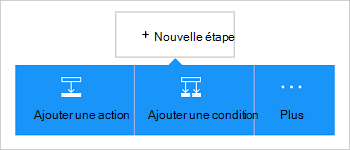

<properties
    pageTitle="Ajouter le connecteur de Dynamics CRM Online à vos applications de logique | Microsoft Azure"
    description="Permet de créer des applications de logique avec le service d’application d’Azure. Le fournisseur de connexion en ligne Dynamics CRM fournit une API pour manipuler les entités de Dynamics CRM Online."
    services="logic-apps"    
    documentationCenter=""     
    authors="MandiOhlinger"    
    manager="erikre"    
    editor="" 
    tags="connectors" />

<tags
ms.service="logic-apps"
ms.devlang="na"
ms.topic="article"
ms.tgt_pltfrm="na"
ms.workload="integration"
ms.date="08/15/2016"
ms.author="mandia"/>

# Mise en route avec le connecteur de Dynamics CRM Online
Se connecter à Dynamics CRM Online pour créer un nouvel enregistrement, la mise à jour d’un élément et bien plus encore. Avec CRM Online, vous pouvez :

- Créer votre flux d’activité basé sur les données que vous obtenez à partir de CRM Online. 
- Actions utilisation qui suppriment un enregistrement, obtenir des entités et bien plus encore. Ces actions Obtient une réponse et vérifiez la sortie disponible pour d’autres actions. Par exemple, lorsqu’un article est mis à jour dans CRM, vous pouvez envoyer un courrier électronique à l’aide d’Office 365.

Cette rubrique vous indique comment utiliser le connecteur de Dynamics CRM Online dans une logique d’application et répertorie également les déclencheurs et les actions.

>[AZURE.NOTE] Cette version de l’article s’applique à la disponibilité des applications de logique (GA).

Pour plus d’informations sur les applications de la logique, voir [Quelles sont les applications de logique](../app-service-logic/app-service-logic-what-are-logic-apps.md) et [créer une application de logique](../app-service-logic/app-service-logic-create-a-logic-app.md).

## Se connecter à Dynamics CRM Online

Avant que votre application logique peut accéder à n’importe quel service, vous créez tout d’abord une *connexion* au service. Une connexion fournit une connectivité entre une application logique et un autre service. Par exemple, pour se connecter à Dynamics, vous devez abord une *connexion*de Dynamics CRM Online. Pour créer une connexion, entrez les informations d’identification que vous utilisez normalement pour accéder au service que vous souhaitez vous connecter. Ainsi, avec Dynamics, entrez les informations d’identification à votre compte en ligne de Dynamics CRM pour créer la connexion.

### Créer la connexion

>[AZURE.INCLUDE [Steps to create a connection to Dynamics CRM Online Connection Provider](../../includes/connectors-create-api-crmonline.md)]

## Utilisation d’un déclencheur

Un déclencheur est un événement qui peut être utilisé pour démarrer le flux de travail défini dans une logique d’application. Déclencheurs « interrogent » le service à un intervalle et une fréquence que vous souhaitez. [En savoir plus sur les déclencheurs](../app-service-logic/app-service-logic-what-are-logic-apps.md#logic-app-concepts).

1. Dans la logique d’application, tapez « dynamics » pour obtenir la liste des déclencheurs :  

    

2. Sélectionnez **Dynamics CRM en ligne - lorsqu’un enregistrement est créé**. Si une connexion existe déjà, sélectionnez une organisation et une entité dans la liste déroulante.

    

    Si vous êtes invité à vous connecter, puis entrez le signe dans le détail pour créer la connexion. [Créer la connexion](connectors-create-api-crmonline.md#create-the-connection) de cette rubrique répertorie les étapes. 

    > [AZURE.NOTE] Dans cet exemple, l’application de la logique s’exécute lorsqu’un enregistrement est créé. Pour voir les résultats de ce déclencheur, ajoutez une autre action qui vous envoie un message électronique. Par exemple, ajoutez l’action Office 365 à *Envoyer un courrier électronique* qui vous envoie par e-mail lorsque le nouvel enregistrement est ajouté. 

3. Cliquez sur le bouton **Modifier** et définissez les valeurs de **fréquence** et **intervalle** . Par exemple, si vous souhaitez que le déclencheur d’interrogation toutes les 15 minutes, puis définir la **fréquence** à la **Minute**et la valeur de l' **intervalle de** **15**. 

    

4. **Enregistrez** vos modifications (situé dans l’angle supérieur gauche de la barre d’outils). Votre application logique est enregistrée et peut être activée automatiquement.

## Utilisez une action

Une action est une opération effectuée par le flux de travail défini dans une logique d’application. [En savoir plus sur les actions](../app-service-logic/app-service-logic-what-are-logic-apps.md#logic-app-concepts).

1. Sélectionnez le signe plus. Vous consultez plusieurs choix : **Ajouter une action**, **Ajouter une condition**ou **plus** d’options.

    

2. Cliquez sur **Ajouter une action**.

3. Dans la zone de texte, tapez « dynamics » pour obtenir une liste de toutes les actions disponibles.

    

4. Dans notre exemple, choisissez **Dynamics CRM en ligne - mise à jour d’un enregistrement**. Si une connexion existe déjà, puis cliquez sur le **Nom de l’organisation**, **Nom de l’entité**et d’autres propriétés :  

    

    Si vous êtes invité à entrer les informations de connexion, puis entrez les détails pour créer la connexion. [Créer la connexion](connectors-create-api-crmonline.md#create-the-connection) de cette rubrique décrit ces propriétés. 

    > [AZURE.NOTE] Dans cet exemple, nous mettons à jour un enregistrement existant dans CRM en ligne. Sortie à partir d’un autre déclencheur vous permet de mettre à jour l’enregistrement. Par exemple, ajouter le déclencheur de SharePoint *lors de la modification d’un élément existant* . Ajoutez ensuite l’action de CRM Online *mise à jour d’un enregistrement* qui utilise les champs SharePoint pour mettre à jour l’enregistrement existant dans CRM en ligne. 

5. **Enregistrez** vos modifications (situé dans l’angle supérieur gauche de la barre d’outils). Votre application logique est enregistrée et peut être activée automatiquement.

## Détails techniques

## Déclencheurs

|Déclencheur | Description|
|--- | ---|
|[Lorsqu’un enregistrement est créé](connectors-create-api-crmonline.md#when-a-record-is-created)|Déclenche un flux lorsqu’un objet est créé dans CRM.|
|[Lorsqu’un enregistrement est mis à jour](connectors-create-api-crmonline.md#when-a-record-is-updated)|Déclenche un flux lorsqu’un objet est modifié dans CRM.|
|[Lorsqu’un enregistrement est supprimé.](connectors-create-api-crmonline.md#when-a-record-is-deleted)|Déclenche un flux lorsqu’un objet est supprimé dans CRM.|

## Actions

|Action|Description|
|--- | ---|
|[Liste des enregistrements](connectors-create-api-crmonline.md#list-records)|Cette opération Obtient les enregistrements d’une entité.|
|[Créer un nouvel enregistrement](connectors-create-api-crmonline.md#create-a-new-record)|Cette opération crée un enregistrement d’une entité.|
|[Obtenir un enregistrement](connectors-create-api-crmonline.md#get-record)|Cette opération Obtient l’enregistrement spécifié pour une entité.|
|[Supprimer un enregistrement](connectors-create-api-crmonline.md#delete-a-record)|Cette opération supprime un enregistrement à partir d’une collection d’entités.|
|[Mise à jour d’un enregistrement](connectors-create-api-crmonline.md#update-a-record)|Cette opération met à jour un enregistrement existant pour une entité.|

### Détails de déclencheur et Action

Dans cette section, voir les détails relatifs à chaque déclencheur et l’action, y compris les propriétés d’entrée requises ou facultatives et toute associés au connecteur de sortie correspondante.

#### Lorsqu’un enregistrement est créé
Déclenche un flux lorsqu’un objet est créé dans CRM. 

|Nom de la propriété| Nom complet|Description|
| ---|---|---|
|groupe de données *|Nom de l’organisation|Nom de l’organisation CRM comme Contoso|
|table *|Nom de l’entité|Nom de l’entité|
|$skip|Skip nombre|Nombre d’entrées à ignorer (par défaut = 0)|
|$top|Nombre de Get maximum|Nombre maximal d’entrées pour obtenir (par défaut = 256)|
|$filter|Requête de filtre|Une requête de filtre ODATA pour limiter les entrées retournées|
|$orderby|Trier par|Une requête d’orderBy ODATA pour spécifier l’ordre des entrées|

Un astérisque (*) signifie que la propriété est requise.

##### Détails de sortie
Liste

| Nom de la propriété | Type de données |
|---|---|
|valeur|tableau|

#### Lorsqu’un enregistrement est mis à jour
Déclenche un flux lorsqu’un objet est modifié dans CRM. 

|Nom de la propriété| Nom complet|Description|
| ---|---|---|
|groupe de données *|Nom de l’organisation|Nom de l’organisation CRM comme Contoso|
|table *|Nom de l’entité|Nom de l’entité|
|$skip|Skip nombre|Nombre d’entrées à ignorer (par défaut = 0)|
|$top|Nombre de Get maximum|Nombre maximal d’entrées pour obtenir (par défaut = 256)|
|$filter|Requête de filtre|Une requête de filtre ODATA pour limiter les entrées retournées|
|$orderby|Trier par|Une requête d’orderBy ODATA pour spécifier l’ordre des entrées|

Un astérisque (*) signifie que la propriété est requise.

##### Détails de sortie
Liste

| Nom de la propriété | Type de données |
|---|---|
|valeur|tableau|

#### Lorsqu’un enregistrement est supprimé.
Déclenche un flux lorsqu’un objet est supprimé dans CRM. 

|Nom de la propriété| Nom complet|Description|
| ---|---|---|
|groupe de données *|Nom de l’organisation|Nom de l’organisation CRM comme Contoso|
|table *|Nom de l’entité|Nom de l’entité|
|$skip|Skip nombre|Nombre d’entrées à ignorer (par défaut = 0)|
|$top|Nombre de Get maximum|Nombre maximal d’entrées pour obtenir (par défaut = 256)|
|$filter|Requête de filtre|Une requête de filtre ODATA pour limiter les entrées retournées|
|$orderby|Trier par|Une requête d’orderBy ODATA pour spécifier l’ordre des entrées|

Un astérisque (*) signifie que la propriété est requise.

##### Détails de sortie
Liste

| Nom de la propriété | Type de données |
|---|---|
|valeur|tableau|

#### Liste des enregistrements
Cette opération Obtient les enregistrements d’une entité. 

|Nom de la propriété| Nom complet|Description|
| ---|---|---|
|groupe de données *|Nom de l’organisation|Nom de l’organisation CRM comme Contoso|
|table *|Nom de l’entité|Nom de l’entité|
|$skip|Skip nombre|Nombre d’entrées à ignorer (par défaut = 0)|
|$top|Nombre de Get maximum|Nombre maximal d’entrées pour obtenir (par défaut = 256)|
|$filter|Requête de filtre|Une requête de filtre ODATA pour limiter les entrées retournées|
|$orderby|Trier par|Une requête d’orderBy ODATA pour spécifier l’ordre des entrées|

Un astérisque (*) signifie que la propriété est requise.

##### Détails de sortie
Liste

| Nom de la propriété | Type de données |
|---|---|
|valeur|tableau|

#### Créer un nouvel enregistrement
Cette opération crée un enregistrement d’une entité. 

|Nom de la propriété| Nom complet|Description|
| ---|---|---|
|groupe de données *|Nom de l’organisation|Nom de l’organisation CRM comme Contoso|
|table *|Nom de l’entité|Nom de l’entité|

Un astérisque (*) signifie que la propriété est requise.

##### Détails de sortie
Aucun.

#### Obtenir un enregistrement
Cette opération Obtient l’enregistrement spécifié pour une entité. 

|Nom de la propriété| Nom complet|Description|
| ---|---|---|
|groupe de données *|Nom de l’organisation|Nom de l’organisation CRM comme Contoso|
|table *|Nom de l’entité|Nom de l’entité|
|ID *|Identificateur de l’élément|Spécifiez l’identificateur de l’enregistrement|

Un astérisque (*) signifie que la propriété est requise.

##### Détails de sortie
Aucun.

#### Supprimer un enregistrement
Cette opération supprime un enregistrement à partir d’une collection d’entités. 

|Nom de la propriété| Nom complet|Description|
| ---|---|---|
|groupe de données *|Nom de l’organisation|Nom de l’organisation CRM comme Contoso|
|table *|Nom de l’entité|Nom de l’entité|
|ID *|Identificateur de l’élément|Spécifiez l’identificateur de l’enregistrement|

Un astérisque (*) signifie que la propriété est requise.

#### Mise à jour d’un enregistrement
Cette opération met à jour un enregistrement existant pour une entité. 

|Nom de la propriété| Nom complet|Description|
| ---|---|---|
|groupe de données *|Nom de l’organisation|Nom de l’organisation CRM comme Contoso|
|table *|Nom de l’entité|Nom de l’entité|
|ID *|Identificateur d’enregistrement|Spécifiez l’identificateur de l’enregistrement|

Un astérisque (*) signifie que la propriété est requise.

##### Détails de sortie
Aucun.

## Réponses HTTP

Les actions et les déclencheurs peuvent renvoyer un ou plusieurs des codes d’état HTTP suivants : 

|Nom|Description|
|---|---|
|200|Bien|
|202|Accepté|
|400|Demande incorrecte|
|401|Non autorisé|
|403|Interdit|
|404|Non trouvé|
|500|Erreur de serveur interne. Une erreur inconnue s’est produite.|
|par défaut|Échoué de l’opération.|

## Étapes suivantes

[Créer une application de logique](../app-service-logic/app-service-logic-create-a-logic-app.md). Explorez les autres connecteurs disponibles dans les applications de logique à notre [liste d’API](apis-list.md).

