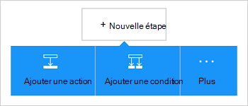

<properties
    pageTitle="Ajouter le connecteur Office 365 Outlook dans vos applications de logique | Microsoft Azure"
    description="Permet de créer des applications de logique avec le connecteur Office 365 pour activer l’interaction avec Office 365. Par exemple : création, modification et mise à jour des éléments de calendrier et de contacts."
    services=""    
    documentationCenter=""     
    authors="MandiOhlinger"    
    manager="anneta"    
    editor="" 
    tags="connectors" />

<tags
ms.service="logic-apps"
ms.devlang="na"
ms.topic="article"
ms.tgt_pltfrm="na"
ms.workload="integration"
ms.date="10/18/2016"
ms.author="mandia"/>

# Mise en route avec Office 365 Outlook connector 

Office 365 Outlook connector permet l’interaction avec Outlook dans Office 365. Ce connecteur permet de créer, modifier, mettre à jour les contacts et les éléments de calendrier et aussi obtenir, envoyer et répondre à l’e-mail.

Avec Office 365 Outlook, vous :

- Créer votre flux de travail en utilisant les fonctionnalités de messagerie et calendrier dans Office 365. 
- Utiliser des déclencheurs pour démarrer le flux de travail lorsqu’il existe un nouvel e-mail, lorsqu’un élément du calendrier est mis à jour et bien plus encore.
- Utiliser des actions pour envoyer un message électronique, créez un nouvel événement de calendrier et bien plus encore. Par exemple, lorsque la force de vente (un déclencheur) est un nouvel objet, vous pouvez envoyer un e-mail à votre Office 365 Outlook (action). 

Cette rubrique vous indique comment utiliser le connecteur Office 365 Outlook dans une logique d’application et répertorie également les déclencheurs et les actions.

>[AZURE.NOTE] Cette version de l’article s’applique à la disponibilité des applications de logique (GA).

Pour plus d’informations sur les applications de la logique, voir [Quelles sont les applications de logique](../app-service-logic/app-service-logic-what-are-logic-apps.md) et [créer une application de logique](../app-service-logic/app-service-logic-create-a-logic-app.md).

## Se connecter à Office 365

Avant que votre application logique peut accéder à n’importe quel service, vous créez tout d’abord une *connexion* au service. Une connexion fournit une connectivité entre une application logique et un autre service. Par exemple, pour vous connecter à Office 365 Outlook, vous devez abord une *connexion*de Office 365. Pour créer une connexion, entrez les informations d’identification que vous utilisez normalement pour accéder au service que vous souhaitez vous connecter. Ainsi, avec Office 365 Outlook, entrez les informations d’identification à votre compte Office 365 pour créer la connexion.

## Créer la connexion

>[AZURE.INCLUDE [Steps to create a connection to Office 365](../../includes/connectors-create-api-office365-outlook.md)]

## Utilisation d’un déclencheur

Un déclencheur est un événement qui peut être utilisé pour démarrer le flux de travail défini dans une logique d’application. Déclencheurs « interrogent » le service à un intervalle et une fréquence que vous souhaitez. [En savoir plus sur les déclencheurs](../app-service-logic/app-service-logic-what-are-logic-apps.md#logic-app-concepts).

1. Dans la logique d’application, tapez « office 365 » pour obtenir la liste des déclencheurs :  

    

2. Sélectionnez **Office 365 Outlook - lors du démarrage d’un événement à venir prochainement**. Si une connexion existe déjà, sélectionnez un calendrier dans la liste déroulante.

    

    Si vous êtes invité à vous connecter, puis entrez le signe dans le détail pour créer la connexion. [Créer la connexion](connectors-create-api-office365-outlook.md#create-the-connection) de cette rubrique répertorie les étapes. 

    > [AZURE.NOTE] Dans cet exemple, l’application de la logique s’exécute lorsqu’un événement de calendrier est mis à jour. Pour voir les résultats de ce déclencheur, ajoutez une autre action qui vous envoie un message texte. Par exemple, ajoutez l’action Twilio *Envoyer* ce texte vous au démarrage de l’événement de calendrier dans 15 minutes. 

3. Cliquez sur le bouton **Modifier** et définissez les valeurs de **fréquence** et **intervalle** . Par exemple, si vous souhaitez que le déclencheur d’interrogation toutes les 15 minutes, puis définir la **fréquence** à la **Minute**et la valeur de l' **intervalle de** **15**. 

    

4. **Enregistrez** vos modifications (situé dans l’angle supérieur gauche de la barre d’outils). Votre application logique est enregistrée et peut être activée automatiquement.

## Utilisez une action

Une action est une opération effectuée par le flux de travail défini dans une logique d’application. [En savoir plus sur les actions](../app-service-logic/app-service-logic-what-are-logic-apps.md#logic-app-concepts).

1. Sélectionnez le signe plus. Vous consultez plusieurs choix : **Ajouter une action**, **Ajouter une condition**ou **plus** d’options.

    

2. Cliquez sur **Ajouter une action**.

3. Dans la zone de texte, tapez « office 365 » pour obtenir une liste de toutes les actions disponibles.

     

4. Dans notre exemple, choisissez **Office 365 Outlook - créer un contact**. Si une connexion existe déjà, puis cliquez sur l' **ID de dossier**, **nom donné**et autres propriétés :  

    

    Si vous êtes invité à entrer les informations de connexion, puis entrez les détails pour créer la connexion. [Créer la connexion](connectors-create-api-office365-outlook.md#create-the-connection) de cette rubrique décrit ces propriétés. 

    > [AZURE.NOTE] Dans cet exemple, nous créons un nouveau contact dans Office 365 Outlook. Sortie à partir d’un autre déclencheur vous permet de créer le contact. Par exemple, ajouter le déclencheur de la force de vente *lorsqu’un objet est créé* . Ajoutez ensuite l’action Office 365 Outlook *créer un contact* qui utilise les champs de la force de vente pour créer le nouveau contact nouveau dans Office 365. 

5. **Enregistrez** vos modifications (situé dans l’angle supérieur gauche de la barre d’outils). Votre application logique est enregistrée et peut être activée automatiquement.

## Détails techniques

Voici les détails sur les déclencheurs, les actions et les réponses qui prend en charge de cette connexion :

## Déclencheurs d’Office 365

|Déclencheur | Description|
|--- | ---|
|[Démarre dès lors un événement à venir](connectors-create-api-office365-outlook.md#when-an-upcoming-event-is-starting-soon)|Cette opération déclenche un flux lors du démarrage d’un événement de calendrier à venir.|
|[Lorsqu’un nouveau message arrive](connectors-create-api-office365-outlook.md#when-a-new-email-arrives)|Cette opération déclenche un flux lors de l’arrivée d’un e-mail|
|[Lors de la création d’un nouvel événement](connectors-create-api-office365-outlook.md#when-a-new-event-is-created)|Cette opération déclenche un flux lors de la création d’un nouvel événement dans un calendrier.|
|[Lorsqu’un événement est modifié](connectors-create-api-office365-outlook.md#when-an-event-is-modified)|Cette opération déclenche un flux lorsqu’un événement est modifié dans un calendrier.|

## Actions d’Office 365

|Action|Description|
|--- | ---|
|[Obtenir des e-mails](connectors-create-api-office365-outlook.md#get-emails)|Cette opération Obtient des messages électroniques à partir d’un dossier.|
|[Envoyer un courrier électronique](connectors-create-api-office365-outlook.md#send-an-email)|Cette opération envoie un message électronique.|
|[Supprimer l’e-mail](connectors-create-api-office365-outlook.md#delete-email)|Cette opération supprime un e-mail par code.|
|[Marquer comme lu](connectors-create-api-office365-outlook.md#mark-as-read)|Cette opération marque un e-mail comme ayant été lus.|
|[Répondre à l’e-mail](connectors-create-api-office365-outlook.md#reply-to-email)|Cette opération répond à un message électronique.|
|[Obtenir la pièce jointe](connectors-create-api-office365-outlook.md#get-attachment)|Cette opération Obtient une pièce jointe par code.|
|[Envoyer un courriel avec options](connectors-create-api-office365-outlook.md#send-email-with-options)|Cette opération envoie un e-mail avec plusieurs options et attend que le destinataire de répondre avec une des options.|
|[Envoyer un e-mail d’approbation](connectors-create-api-office365-outlook.md#send-approval-email)|Cette opération envoie un e-mail d’approbation et attend une réponse du destinataire.|
|[Obtenir des calendriers](connectors-create-api-office365-outlook.md#get-calendars)|Cette opération affiche les calendriers disponibles.|
|[Obtenir des événements](connectors-create-api-office365-outlook.md#get-events)|Cette opération Obtient les événements d’un calendrier.|
|[Créer un événement](connectors-create-api-office365-outlook.md#create-event)|Cette opération crée un nouvel événement dans un calendrier.|
|[Obtenir l’événement](connectors-create-api-office365-outlook.md#get-event)|Cette opération Obtient un événement spécifique à partir d’un calendrier.|
|[Supprimer l’événement](connectors-create-api-office365-outlook.md#delete-event)|Cette opération supprime un événement dans un calendrier.|
|[Événements de mise à jour](connectors-create-api-office365-outlook.md#update-event)|Cette opération met à jour un événement dans un calendrier.|
|[Obtenir les dossiers de contacts](connectors-create-api-office365-outlook.md#get-contact-folders)|Cette opération répertorie les dossiers de contacts disponibles.|
|[Obtenir des contacts](connectors-create-api-office365-outlook.md#get-contacts)|Cette opération Obtient des contacts à partir d’un dossier de contacts.|
|[Créer un contact](connectors-create-api-office365-outlook.md#create-contact)|Cette opération crée un nouveau contact dans un dossier de contacts.|
|[Obtenir de contact](connectors-create-api-office365-outlook.md#get-contact)|Cette opération Obtient un contact spécifique à partir d’un dossier de contacts.|
|[Supprimer le contact](connectors-create-api-office365-outlook.md#delete-contact)|Cette opération supprime un contact à partir d’un dossier de contacts.|
|[Mise à jour de contact](connectors-create-api-office365-outlook.md#update-contact)|Cette opération met à jour un contact dans un dossier de contacts.|

### Détails de déclencheur et Action

Dans cette section, voir les détails relatifs à chaque déclencheur et l’action, y compris les propriétés d’entrée requises ou facultatives et toute associés au connecteur de sortie correspondante.

#### Démarre dès lors un événement à venir
Cette opération déclenche un flux lors du démarrage d’un événement de calendrier à venir. 

|Nom de la propriété| Nom complet|Description|
| ---|---|---|
|table *|Id du calendrier|Identificateur unique du calendrier|
|lookAheadTimeInMinutes|Aspect des temps de transfert|Temps (en minutes) pour rechercher directement des événements à venir|

Un astérisque (*) signifie que la propriété est requise.

##### Détails de sortie
CalendarItemsList : La liste des éléments de calendrier

| Nom de la propriété | Type de données | Description |
|---|---|---|
|valeur|tableau|Liste des éléments de calendrier|

#### Obtenir des e-mails
Cette opération Obtient des messages électroniques à partir d’un dossier. 

|Nom de la propriété| Nom complet|Description|
| ---|---|---|
|folderPath|Chemin d’accès du dossier|Chemin d’accès du dossier pour récupérer des messages électroniques (par défaut : « Boîte de réception »)|
|Retour au début|Retour au début|Nombre d’e-mails à extraire (par défaut : 10)|
|fetchOnlyUnread|Extraire uniquement les Messages non lus|Récupérer uniquement les courriers électroniques non lus ?|
|includeAttachments|Inclure des pièces jointes|Si défini sur true, jointes est également récupérée avec le message|
|searchQuery|Requête de recherche|Requête de recherche pour filtrer les e-mails|
|Ignorer|Ignorer|Nombre d’e-mails à ignorer (par défaut : 0)|
|skipToken|Jeton d’ignorer|Ignorer le jeton pour la nouvelle page d’extraction|

Un astérisque (*) signifie que la propriété est requise.

##### Détails de sortie
ReceiveMessage : Message d’E-mail

| Nom de la propriété | Type de données | Description |
|---|---|---|
|De|chaîne|De|
|À|chaîne|À|
|Objet|chaîne|Objet|
|Corps|chaîne|Corps|
|Importance|chaîne|Importance|
|HasAttachment|valeur booléenne|Pièce jointe|
|ID|chaîne|Id de message|
|Estlu|valeur booléenne|Est lu|
|DateTimeReceived|chaîne|Date heure de réception|
|Pièces jointes|tableau|Pièces jointes|
|Cc|chaîne|Spécifier les adresses de messagerie séparées par des points-virgules commesomeone@contoso.com|
|Cci|chaîne|Spécifier les adresses de messagerie séparées par des points-virgules commesomeone@contoso.com|
|IsHtml|valeur booléenne|Est au format Html|

#### Envoyer un courrier électronique
Cette opération envoie un message électronique. 

|Nom de la propriété| Nom complet|Description|
| ---|---|---|
|emailMessage *|Messagerie|Messagerie|

Un astérisque (*) signifie que la propriété est requise.

##### Détails de sortie
Aucun.

#### Supprimer l’e-mail
Cette opération supprime un e-mail par code. 

|Nom de la propriété| Nom complet|Description|
| ---|---|---|
|messageId *|Id de message|ID de l’e-mail à supprimer|

Un astérisque (*) signifie que la propriété est requise.

##### Détails de sortie
Aucun.

#### Marquer comme lu
Cette opération marque un e-mail comme ayant été lus. 

|Nom de la propriété| Nom complet|Description|
| ---|---|---|
|messageId *|Id de message|ID du message à marquer comme lu|

Un astérisque (*) signifie que la propriété est requise.

##### Détails de sortie
Aucun.

#### Répondre à l’e-mail
Cette opération répond à un message électronique. 

|Nom de la propriété| Nom complet|Description|
| ---|---|---|
|messageId *|Id de message|ID de l’e-mail de réponse à|
|commentaire *|Commentaire|Commentaire de suivi|
|replyAll|Répondre à tous|Répondre à tous les destinataires|

Un astérisque (*) signifie que la propriété est requise.

##### Détails de sortie
Aucun.

#### Obtenir la pièce jointe
Cette opération Obtient une pièce jointe par code. 

|Nom de la propriété| Nom complet|Description|
| ---|---|---|
|messageId *|Id de message|ID de l’e-mail|
|attachmentId *|Id de pièce jointe|ID de la pièce jointe à télécharger|

Un astérisque (*) signifie que la propriété est requise.

##### Détails de sortie
Aucun.

#### Lorsqu’un nouveau message arrive
Cette opération déclenche un flux lors de l’arrivée d’un e-mail.

|Nom de la propriété| Nom complet|Description|
| ---|---|---|
|folderPath|Chemin d’accès du dossier|Dossier de messagerie à récupérer (par défaut : boîte de réception)|
|À|À|Adresses e-mail du destinataire|
|De|De|À partir de l’adresse|
|importance|Importance|Importance du message (haute, normale, basse) (par défaut : Normal)|
|fetchOnlyWithAttachment|Comporte des pièces jointes|Extraire uniquement les e-mails contenant une pièce jointe|
|includeAttachments|Inclure des pièces jointes|Inclure des pièces jointes|
|subjectFilter|Filtre d’objet|Chaîne à rechercher dans l’objet|

Un astérisque (*) signifie que la propriété est requise.

##### Détails de sortie
TriggerBatchResponse [ReceiveMessage]

| Nom de la propriété | Type de données |
|---|---|
|valeur|tableau|

#### Envoyer un courriel avec options
Cette opération envoie un e-mail avec plusieurs options et attend que le destinataire de répondre avec une des options. 

|Nom de la propriété| Nom complet|Description|
| ---|---|---|
|optionsEmailSubscription *|Demande d’abonnement pour le courrier électronique d’options|Demande d’abonnement pour le courrier électronique d’options|

Un astérisque (*) signifie que la propriété est requise.

##### Détails de sortie
SubscriptionResponse : Modèle pour l’abonnement par E-mail pour approbation

| Nom de la propriété | Type de données | Description |
|---|---|---|
|ID|chaîne|ID de l’abonnement|
|ressources|chaîne|Ressources de la demande d’abonnement|
|notificationType|chaîne|Type de notification|
|notificationUrl|chaîne|Url de notification|

#### Envoyer un e-mail d’approbation
Cette opération envoie un e-mail d’approbation et attend une réponse du destinataire. 

|Nom de la propriété| Nom complet|Description|
| ---|---|---|
|approvalEmailSubscription *|Demande d’abonnement pour approbation par e-mail|Demande d’abonnement pour approbation par e-mail|

Un astérisque (*) signifie que la propriété est requise.

##### Détails de sortie
SubscriptionResponse : Modèle pour l’abonnement par E-mail pour approbation

| Nom de la propriété | Type de données | Description |
|---|---|---|
|ID|chaîne|ID de l’abonnement|
|ressources|chaîne|Ressources de la demande d’abonnement|
|notificationType|chaîne|Type de notification|
|notificationUrl|chaîne|Url de notification|

#### Obtenir des calendriers
Cette opération affiche les calendriers disponibles. 

Il n’y a pas de paramètres pour cet appel.

##### Détails de sortie
TablesList

| Nom de la propriété | Type de données |
|---|---|
|valeur|tableau|

#### Obtenir des événements
Cette opération Obtient les événements d’un calendrier. 

|Nom de la propriété| Nom complet|Description|
| ---|---|---|
|table *|Id du calendrier|Sélectionnez un calendrier|
|$filter|Requête de filtre|Une requête de filtre ODATA pour limiter les entrées retournées|
|$orderby|Trier par|Une requête d’orderBy ODATA pour spécifier l’ordre des entrées|
|$skip|Skip nombre|Nombre d’entrées à ignorer (par défaut = 0)|
|$top|Nombre de Get maximum|Nombre maximal d’entrées à récupérer (par défaut = 256)|

Un astérisque (*) signifie que la propriété est requise.

##### Détails de sortie
CalendarEventList : La liste des éléments de calendrier

| Nom de la propriété | Type de données | Description |
|---|---|---|
|valeur|tableau|Liste des éléments de calendrier|

#### Créer un événement
Cette opération crée un nouvel événement dans un calendrier. 

|Nom de la propriété| Nom complet|Description|
| ---|---|---|
|table *|Id du calendrier|Sélectionnez un calendrier|
|article *|Élément|Événement à créer|

Un astérisque (*) signifie que la propriété est requise.

##### Détails de sortie
CalendarEvent : Classe de modèle de connecteur Calendrier des événements.

| Nom de la propriété | Type de données | Description |
|---|---|---|
|ID|chaîne|Identificateur unique de l’événement.|
|Participants|tableau|Liste des participants à l’événement.|
|Corps|non défini|Le corps du message associé à l’événement.|
|BodyPreview|chaîne|L’aperçu du message associé à l’événement.|
|Catégories|tableau|Les catégories associées à l’événement.|
|ChangeKey|chaîne|Identifie la version de l’objet event. Chaque fois que l’événement est changé, ChangeKey change également.|
|DateTimeCreated|chaîne|La date et l’heure à laquelle l’événement a été créé.|
|DateTimeLastModified|chaîne|La date et l’heure à laquelle l’événement a été modifié.|
|Fin|chaîne|L’heure de fin de l’événement.|
|EndTimeZone|chaîne|Spécifie le fuseau horaire de la réunion heure de fin. Cette valeur doit être définie dans Windows (exemple : « Pacifique »).|
|HasAttachments|valeur booléenne|La valeur true si l’événement comporte des pièces jointes.|
|Importance|chaîne|L’importance de l’événement : faible, normale ou haute.|
|IsAllDay|valeur booléenne|A la valeur true si l’événement dure toute la journée.|
|IsCancelled|valeur booléenne|A la valeur true si l’événement a été annulé.|
|IsOrganizer|valeur booléenne|A la valeur true si l’expéditeur du message est également l’organisateur.|
|Emplacement|non défini|L’emplacement de l’événement.|
|Bibliothèque multimédia|non défini|L’organisateur de l’événement.|
|Périodicité|non défini|La périodicité de l’événement.|
|Rappel|nombre entier|Temps en minutes avant le début de l’événement à rappeler.|
|ResponseRequested|valeur booléenne|A la valeur true si l’expéditeur souhaite une réponse lorsque l’événement est acceptée ou refusée.|
|ResponseStatus|non défini|Indique le type de réponse envoyée en réponse à un message d’événement.|
|SeriesMasterId|chaîne|Identificateur unique pour le type d’événement principal de la série.|
|ShowAs s’est vue|chaîne|Affiche sous forme libre ou occupé.|
|Début|chaîne|L’heure de début de l’événement.|
|StartTimeZone|chaîne|Spécifie l’heure de début de la zone de la réunion. Cette valeur doit être définie dans Windows (exemple : « Pacifique »).|
|Objet|chaîne|Objet d’événement.|
|Type de|chaîne|Le type d’événement : Instance unique, une Occurrence, Exception ou masque de série.|
|Lien Web|chaîne|L’aperçu du message associé à l’événement.|

#### Obtenir l’événement
Cette opération Obtient un événement spécifique à partir d’un calendrier. 

|Nom de la propriété| Nom complet|Description|
| ---|---|---|
|table *|Id du calendrier|Sélectionnez un calendrier|
|ID *|Id de l’élément|Sélectionnez un événement|

Un astérisque (*) signifie que la propriété est requise.

##### Détails de sortie
CalendarEvent : Classe de modèle de connecteur Calendrier des événements.

| Nom de la propriété | Type de données | Description |
|---|---|---|
|ID|chaîne|Identificateur unique de l’événement.|
|Participants|tableau|Liste des participants à l’événement.|
|Corps|non défini|Le corps du message associé à l’événement.|
|BodyPreview|chaîne|L’aperçu du message associé à l’événement.|
|Catégories|tableau|Les catégories associées à l’événement.|
|ChangeKey|chaîne|Identifie la version de l’objet event. Chaque fois que l’événement est changé, ChangeKey change également.|
|DateTimeCreated|chaîne|La date et l’heure à laquelle l’événement a été créé.|
|DateTimeLastModified|chaîne|La date et l’heure à laquelle l’événement a été modifié.|
|Fin|chaîne|L’heure de fin de l’événement.|
|EndTimeZone|chaîne|Spécifie le fuseau horaire de la réunion heure de fin. Cette valeur doit être définie dans Windows (exemple : « Pacifique »).|
|HasAttachments|valeur booléenne|La valeur true si l’événement comporte des pièces jointes.|
|Importance|chaîne|L’importance de l’événement : faible, normale ou haute.|
|IsAllDay|valeur booléenne|A la valeur true si l’événement dure toute la journée.|
|IsCancelled|valeur booléenne|A la valeur true si l’événement a été annulé.|
|IsOrganizer|valeur booléenne|A la valeur true si l’expéditeur du message est également l’organisateur.|
|Emplacement|non défini|L’emplacement de l’événement.|
|Bibliothèque multimédia|non défini|L’organisateur de l’événement.|
|Périodicité|non défini|La périodicité de l’événement.|
|Rappel|nombre entier|Temps en minutes avant le début de l’événement à rappeler.|
|ResponseRequested|valeur booléenne|A la valeur true si l’expéditeur souhaite une réponse lorsque l’événement est acceptée ou refusée.|
|ResponseStatus|non défini|Indique le type de réponse envoyée en réponse à un message d’événement.|
|SeriesMasterId|chaîne|Identificateur unique pour le type d’événement principal de la série.|
|ShowAs s’est vue|chaîne|Affiche sous forme libre ou occupé.|
|Début|chaîne|L’heure de début de l’événement.|
|StartTimeZone|chaîne|Spécifie l’heure de début de la zone de la réunion. Cette valeur doit être définie dans Windows (exemple : « Pacifique »).|
|Objet|chaîne|Objet d’événement.|
|Type de|chaîne|Le type d’événement : Instance unique, une Occurrence, Exception ou masque de série.|
|Lien Web|chaîne|L’aperçu du message associé à l’événement.|

#### Supprimer l’événement
Cette opération supprime un événement dans un calendrier. 

|Nom de la propriété| Nom complet|Description|
| ---|---|---|
|table *|Id du calendrier|Sélectionnez un calendrier|
|ID *|ID|Sélectionnez un événement|

Un astérisque (*) signifie que la propriété est requise.

##### Détails de sortie
Aucun.

#### Événements de mise à jour
Cette opération met à jour un événement dans un calendrier. 

|Nom de la propriété| Nom complet|Description|
| ---|---|---|
|table *|Id du calendrier|Sélectionnez un calendrier|
|ID *|ID|Sélectionnez un événement|
|article *|Élément|Mise à jour de l’événement|

Un astérisque (*) signifie que la propriété est requise.

##### Détails de sortie
CalendarEvent : Classe de modèle de connecteur Calendrier des événements.

| Nom de la propriété | Type de données | Description |
|---|---|---|
|ID|chaîne|Identificateur unique de l’événement.|
|Participants|tableau|Liste des participants à l’événement.|
|Corps|non défini|Le corps du message associé à l’événement.|
|BodyPreview|chaîne|L’aperçu du message associé à l’événement.|
|Catégories|tableau|Les catégories associées à l’événement.|
|ChangeKey|chaîne|Identifie la version de l’objet event. Chaque fois que l’événement est changé, ChangeKey change également.|
|DateTimeCreated|chaîne|La date et l’heure à laquelle l’événement a été créé.|
|DateTimeLastModified|chaîne|La date et l’heure à laquelle l’événement a été modifié.|
|Fin|chaîne|L’heure de fin de l’événement.|
|EndTimeZone|chaîne|Spécifie le fuseau horaire de la réunion heure de fin. Cette valeur doit être définie dans Windows (exemple : « Pacifique »).|
|HasAttachments|valeur booléenne|La valeur true si l’événement comporte des pièces jointes.|
|Importance|chaîne|L’importance de l’événement : faible, normale ou haute.|
|IsAllDay|valeur booléenne|A la valeur true si l’événement dure toute la journée.|
|IsCancelled|valeur booléenne|A la valeur true si l’événement a été annulé.|
|IsOrganizer|valeur booléenne|A la valeur true si l’expéditeur du message est également l’organisateur.|
|Emplacement|non défini|L’emplacement de l’événement.|
|Bibliothèque multimédia|non défini|L’organisateur de l’événement.|
|Périodicité|non défini|La périodicité de l’événement.|
|Rappel|nombre entier|Temps en minutes avant le début de l’événement à rappeler.|
|ResponseRequested|valeur booléenne|A la valeur true si l’expéditeur souhaite une réponse lorsque l’événement est acceptée ou refusée.|
|ResponseStatus|non défini|Indique le type de réponse envoyée en réponse à un message d’événement.|
|SeriesMasterId|chaîne|Identificateur unique pour le type d’événement principal de la série.|
|ShowAs s’est vue|chaîne|Affiche sous forme libre ou occupé.|
|Début|chaîne|L’heure de début de l’événement.|
|StartTimeZone|chaîne|Spécifie l’heure de début de la zone de la réunion. Cette valeur doit être définie dans Windows (exemple : « Pacifique »).|
|Objet|chaîne|Objet d’événement.|
|Type de|chaîne|Le type d’événement : Instance unique, une Occurrence, Exception ou masque de série.|
|Lien Web|chaîne|L’aperçu du message associé à l’événement.|

#### Lors de la création d’un nouvel événement
Cette opération déclenche un flux lors de la création d’un nouvel événement dans un calendrier. 

|Nom de la propriété| Nom complet|Description|
| ---|---|---|
|table *|Id du calendrier|Sélectionnez un calendrier|
|$filter|Requête de filtre|Une requête de filtre ODATA pour limiter les entrées retournées|
|$orderby|Trier par|Une requête d’orderBy ODATA pour spécifier l’ordre des entrées|
|$skip|Skip nombre|Nombre d’entrées à ignorer (par défaut = 0)|
|$top|Nombre de Get maximum|Nombre maximal d’entrées à récupérer (par défaut = 256)|

Un astérisque (*) signifie que la propriété est requise.

##### Détails de sortie
CalendarItemsList : La liste des éléments de calendrier

| Nom de la propriété | Type de données | Description |
|---|---|---|
|valeur|tableau|Liste des éléments de calendrier|

#### Lorsqu’un événement est modifié
Cette opération déclenche un flux lorsqu’un événement est modifié dans un calendrier. 

|Nom de la propriété| Nom complet|Description|
| ---|---|---|
|table *|Id du calendrier|Sélectionnez un calendrier|
|$filter|Requête de filtre|Une requête de filtre ODATA pour limiter les entrées retournées|
|$orderby|Trier par|Une requête d’orderBy ODATA pour spécifier l’ordre des entrées|
|$skip|Skip nombre|Nombre d’entrées à ignorer (par défaut = 0)|
|$top|Nombre de Get maximum|Nombre maximal d’entrées à récupérer (par défaut = 256)|

Un astérisque (*) signifie que la propriété est requise.

##### Détails de sortie
CalendarItemsList : La liste des éléments de calendrier

| Nom de la propriété | Type de données | Description |
|---|---|---|
|valeur|tableau|Liste des éléments de calendrier|

#### Obtenir les dossiers de contacts
Cette opération répertorie les dossiers de contacts disponibles. 

Il n’y a pas de paramètres pour cet appel.

##### Détails de sortie
TablesList

| Nom de la propriété | Type de données |
|---|---|
|valeur|tableau|

#### Obtenir des contacts
Cette opération Obtient des contacts à partir d’un dossier de contacts. 

|Nom de la propriété| Nom complet|Description|
| ---|---|---|
|table *|Id de dossier|Identificateur unique du dossier contacts à récupérer|
|$filter|Requête de filtre|Une requête de filtre ODATA pour limiter les entrées retournées|
|$orderby|Trier par|Une requête d’orderBy ODATA pour spécifier l’ordre des entrées|
|$skip|Skip nombre|Nombre d’entrées à ignorer (par défaut = 0)|
|$top|Nombre de Get maximum|Nombre maximal d’entrées à récupérer (par défaut = 256)|

Un astérisque (*) signifie que la propriété est requise.

##### Détails de sortie
ContactList : La liste des contacts

| Nom de la propriété | Type de données | Description |
|---|---|---|
|valeur|tableau|Liste de contacts|

#### Créer un contact
Cette opération crée un nouveau contact dans un dossier de contacts. 

|Nom de la propriété| Nom complet|Description|
| ---|---|---|
|table *|Id de dossier|Sélectionnez un dossier de contacts|
|article *|Élément|Contact à créer|

Un astérisque (*) signifie que la propriété est requise.

##### Détails de sortie
Contact : Contact

| Nom de la propriété | Type de données | Description |
|---|---|---|
|ID|chaîne|Identificateur unique de la personne.|
|ParentFolderId|chaîne|L’ID du dossier parent de la personne|
|Anniversaire|chaîne|Anniversaire de la personne.|
|Classer sous|chaîne|Le nom du contact est classé sous.|
|DisplayName|chaîne|Nom d’affichage du contact.|
|GivenName|chaîne|Le nom du contact donné.|
|Initiales|chaîne|Les initiales du contact.|
|MiddleName|chaîne|Deuxième prénom du contact.|
|Surnom|chaîne|Le surnom du contact.|
|Nom de famille|chaîne|Le patronyme du contact.|
|Titre|chaîne|Le titre du contact.|
|Génération|chaîne|Génération du contact.|
|EmailAddresses|tableau|Les adresses e-mail de la personne.|
|ImAddresses|tableau|Les adresses de contact instantanées messageries (messagerie instantanée).|
|JobTitle|chaîne|Fonction du contact.|
|CompanyName|chaîne|Le nom de la société du contact.|
|Département|chaîne|Le département du contact.|
|OfficeLocation|chaîne|L’emplacement du bureau du contact.|
|Profession|chaîne|La profession du contact.|
|BusinessHomePage|chaîne|La page d’accueil business du contact.|
|AssistantName|chaîne|Le nom de l’assistant du contact.|
|Gestionnaire de|chaîne|Nom du directeur du contact.|
|HomePhones|tableau|Numéros de téléphone du domicile du contact.|
|BusinessPhones|tableau|Numéros de téléphone du contact professionnel|
|MobilePhone1|chaîne|Numéro de téléphone mobile du contact.|
|HomeAddress|non défini|L’adresse du contact personnel.|
|BusinessAddress|non défini|Adresse professionnelle du contact.|
|OtherAddress|non défini|Autres adresses du contact.|
|YomiCompanyName|chaîne|Nom du contact de la société phonétiques japonais.|
|YomiGivenName|chaîne|La phonétique japonais prénom (prénom) du contact.|
|YomiSurname|chaîne|Nom de famille phonétiques japonais (nom) du contact|
|Catégories|tableau|Les catégories liées à ce contact.|
|ChangeKey|chaîne|Identifie la version de l’objet event|
|DateTimeCreated|chaîne|L’heure de la création du contact.|
|DateTimeLastModified|chaîne|L’heure de que la modification du contact.|

#### Obtenir de contact
Cette opération Obtient un contact spécifique à partir d’un dossier de contacts. 

|Nom de la propriété| Nom complet|Description|
| ---|---|---|
|table *|Id de dossier|Sélectionnez un dossier de contacts|
|ID *|Id de l’élément|Identificateur unique du contact à récupérer|

Un astérisque (*) signifie que la propriété est requise.

##### Détails de sortie
Contact : Contact

| Nom de la propriété | Type de données | Description |
|---|---|---|
|ID|chaîne|Identificateur unique de la personne.|
|ParentFolderId|chaîne|L’ID du dossier parent de la personne|
|Anniversaire|chaîne|Anniversaire de la personne.|
|Classer sous|chaîne|Le nom du contact est classé sous.|
|DisplayName|chaîne|Nom d’affichage du contact.|
|GivenName|chaîne|Le nom du contact donné.|
|Initiales|chaîne|Les initiales du contact.|
|MiddleName|chaîne|Deuxième prénom du contact.|
|Surnom|chaîne|Le surnom du contact.|
|Nom de famille|chaîne|Le patronyme du contact.|
|Titre|chaîne|Le titre du contact.|
|Génération|chaîne|Génération du contact.|
|EmailAddresses|tableau|Les adresses e-mail de la personne.|
|ImAddresses|tableau|Les adresses de contact instantanées messageries (messagerie instantanée).|
|JobTitle|chaîne|Fonction du contact.|
|CompanyName|chaîne|Le nom de la société du contact.|
|Département|chaîne|Le département du contact.|
|OfficeLocation|chaîne|L’emplacement du bureau du contact.|
|Profession|chaîne|La profession du contact.|
|BusinessHomePage|chaîne|La page d’accueil business du contact.|
|AssistantName|chaîne|Le nom de l’assistant du contact.|
|Gestionnaire de|chaîne|Nom du directeur du contact.|
|HomePhones|tableau|Numéros de téléphone du domicile du contact.|
|BusinessPhones|tableau|Numéros de téléphone du contact professionnel|
|MobilePhone1|chaîne|Numéro de téléphone mobile du contact.|
|HomeAddress|non défini|L’adresse du contact personnel.|
|BusinessAddress|non défini|Adresse professionnelle du contact.|
|OtherAddress|non défini|Autres adresses du contact.|
|YomiCompanyName|chaîne|Nom du contact de la société phonétiques japonais.|
|YomiGivenName|chaîne|La phonétique japonais prénom (prénom) du contact.|
|YomiSurname|chaîne|Nom de famille phonétiques japonais (nom) du contact|
|Catégories|tableau|Les catégories liées à ce contact.|
|ChangeKey|chaîne|Identifie la version de l’objet event|
|DateTimeCreated|chaîne|L’heure de la création du contact.|
|DateTimeLastModified|chaîne|L’heure de que la modification du contact.|

#### Supprimer le contact
Cette opération supprime un contact à partir d’un dossier de contacts. 

|Nom de la propriété| Nom complet|Description|
| ---|---|---|
|table *|Id de dossier|Sélectionnez un dossier de contacts|
|ID *|ID|Identificateur unique du contact à supprimer|

Un astérisque (*) signifie que la propriété est requise.

##### Détails de sortie
Aucun.

#### Mise à jour de contact
Cette opération met à jour un contact dans un dossier de contacts. 

|Nom de la propriété| Nom complet|Description|
| ---|---|---|
|table *|Id de dossier|Sélectionnez un dossier de contacts|
|ID *|ID|Identificateur unique du contact pour mettre à jour|
|article *|Élément|Élément de contact à jour|

Un astérisque (*) signifie que la propriété est requise.

##### Détails de sortie
Contact : Contact

| Nom de la propriété | Type de données | Description |
|---|---|---|
|ID|chaîne|Identificateur unique de la personne.|
|ParentFolderId|chaîne|L’ID du dossier parent de la personne|
|Anniversaire|chaîne|Anniversaire de la personne.|
|Classer sous|chaîne|Le nom du contact est classé sous.|
|DisplayName|chaîne|Nom d’affichage du contact.|
|GivenName|chaîne|Le nom du contact donné.|
|Initiales|chaîne|Les initiales du contact.|
|MiddleName|chaîne|Deuxième prénom du contact.|
|Surnom|chaîne|Le surnom du contact.|
|Nom de famille|chaîne|Le patronyme du contact.|
|Titre|chaîne|Le titre du contact.|
|Génération|chaîne|Génération du contact.|
|EmailAddresses|tableau|Les adresses e-mail de la personne.|
|ImAddresses|tableau|Les adresses de contact instantanées messageries (messagerie instantanée).|
|JobTitle|chaîne|Fonction du contact.|
|CompanyName|chaîne|Le nom de la société du contact.|
|Département|chaîne|Le département du contact.|
|OfficeLocation|chaîne|L’emplacement du bureau du contact.|
|Profession|chaîne|La profession du contact.|
|BusinessHomePage|chaîne|La page d’accueil business du contact.|
|AssistantName|chaîne|Le nom de l’assistant du contact.|
|Gestionnaire de|chaîne|Nom du directeur du contact.|
|HomePhones|tableau|Numéros de téléphone du domicile du contact.|
|BusinessPhones|tableau|Numéros de téléphone du contact professionnel|
|MobilePhone1|chaîne|Numéro de téléphone mobile du contact.|
|HomeAddress|non défini|L’adresse du contact personnel.|
|BusinessAddress|non défini|Adresse professionnelle du contact.|
|OtherAddress|non défini|Autres adresses du contact.|
|YomiCompanyName|chaîne|Nom du contact de la société phonétiques japonais.|
|YomiGivenName|chaîne|La phonétique japonais prénom (prénom) du contact.|
|YomiSurname|chaîne|Nom de famille phonétiques japonais (nom) du contact|
|Catégories|tableau|Les catégories liées à ce contact.|
|ChangeKey|chaîne|Identifie la version de l’objet event|
|DateTimeCreated|chaîne|L’heure de la création du contact.|
|DateTimeLastModified|chaîne|L’heure de que la modification du contact.|

## Réponses HTTP

Les actions et les déclencheurs ci-dessus peuvent retourner un ou plusieurs des codes d’état HTTP suivants : 

|Nom|Description|
|---|---|
|200|Bien|
|202|Accepté|
|400|Demande incorrecte|
|401|Non autorisé|
|403|Interdit|
|404|Non trouvé|
|500|Erreur de serveur interne. Une erreur inconnue s’est produite|
|par défaut|Échoué de l’opération.|

## Étapes suivantes

[Créer une application de logique](../app-service-logic/app-service-logic-create-a-logic-app.md). Explorez les autres connecteurs disponibles dans les applications de logique à notre [liste d’API](apis-list.md).