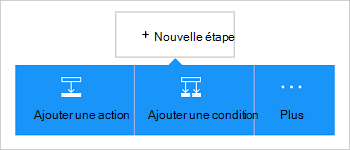
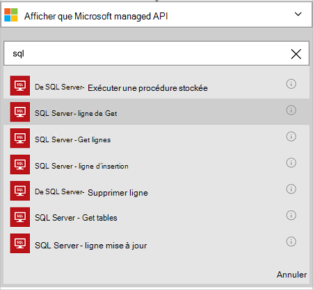
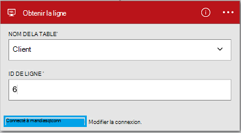

<properties
    pageTitle="Ajouter le connecteur de base de données de SQL Azure dans vos applications de logique | Microsoft Azure"
    description="Vue d’ensemble du connecteur de base de données de SQL Azure avec les paramètres de l’API REST"
    services=""
    documentationCenter="" 
    authors="MandiOhlinger"
    manager="anneta"
    editor=""
    tags="connectors"/>

<tags
   ms.service="logic-apps"
   ms.devlang="na"
   ms.topic="article"
   ms.tgt_pltfrm="na"
   ms.workload="na" 
   ms.date="10/18/2016"
   ms.author="mandia"/>

# Mise en route avec le connecteur de base de données de SQL Azure
Le connecteur de base de données de SQL Azure, de créer des flux de travail de votre organisation qui gèrent les données de vos tables. 

La base de données SQL vous :

- Créer votre flux de travail en ajoutant un nouveau client à une base de données clients ou mise à jour d’une commande dans une base de données des commandes.
- Utiliser des actions pour obtenir une ligne de données, insérer une nouvelle ligne, ou les supprimer. Par exemple, lorsqu’un enregistrement est créé dans Dynamics CRM Online (un déclencheur), insérez une ligne dans une base de données de SQL Azure (action). 

Cette rubrique vous indique comment utiliser le connecteur de base de données SQL dans une application de logique et répertorie également les actions.

>[AZURE.NOTE] Cette version de l’article s’applique à la disponibilité des applications de logique (GA). 

Pour plus d’informations sur les applications de la logique, voir [Quelles sont les applications de logique](../app-service-logic/app-service-logic-what-are-logic-apps.md) et [créer une application de logique](../app-service-logic/app-service-logic-create-a-logic-app.md).

## Se connecter à la base de données SQL Azure

Avant que votre application logique peut accéder à n’importe quel service, vous créez tout d’abord une *connexion* au service. Une connexion fournit une connectivité entre une application logique et un autre service. Par exemple, pour vous connecter à la base de données de SQL, vous d’abord créez une *connexion*de base de données de SQL. Pour créer une connexion, vous entrez les informations d’identification que vous utilisez normalement pour accéder au service que vous vous connectez à. Donc, dans la base de données de SQL, entrez vos informations d’identification de base de données SQL pour créer la connexion. 

#### Créer la connexion

>[AZURE.INCLUDE [Create the connection to SQL Azure](../../includes/connectors-create-api-sqlazure.md)]

## Utilisation d’un déclencheur

Ce connecteur n’a pas de déclencheurs. Autres déclencheurs permet de démarrer l’application logique, comme un déclencheur de récurrence, un déclencheur Webhook de HTTP, déclencheurs disponibles avec les autres connecteurs et bien plus encore. [Créer une application de logique](../app-service-logic/app-service-logic-create-a-logic-app.md) fournit un exemple.

## Utilisez une action
    
Une action est une opération effectuée par le flux de travail défini dans une logique d’application. [En savoir plus sur les actions](../app-service-logic/app-service-logic-what-are-logic-apps.md#logic-app-concepts).

1. Sélectionnez le signe plus. Vous consultez plusieurs choix : **Ajouter une action**, **Ajouter une condition**ou **plus** d’options.

    

2. Cliquez sur **Ajouter une action**.

3. Dans la zone de texte, tapez « sql » pour obtenir une liste de toutes les actions disponibles.

     

4. Dans notre exemple, choisissez **SQL Server - obtenir la ligne**. Si une connexion existe déjà, sélectionnez le **nom de la Table** dans la liste déroulante, puis entrez l' **ID de ligne** que vous souhaitez retourner.

    

    Si vous êtes invité à entrer les informations de connexion, puis entrez les détails pour créer la connexion. [Créer la connexion](connectors-create-api-sqlazure.md#create-the-connection) de cette rubrique décrit ces propriétés. 

    > [AZURE.NOTE] Dans cet exemple, nous retourner une ligne d’une table. Pour voir les données de cette ligne, ajoutez une autre action qui crée un fichier à l’aide des champs de la table. Par exemple, ajouter une action OneDrive qui utilise les champs Prénom et nom pour créer un nouveau fichier dans le compte de stockage cloud. 

5. **Enregistrez** vos modifications (situé dans l’angle supérieur gauche de la barre d’outils). Votre application logique est enregistrée et peut être activée automatiquement.

## Détails techniques

## Actions de base de données SQL
Une action est une opération effectuée par le flux de travail défini dans une logique d’application. Le connecteur de base de données SQL comprend les actions suivantes. 

|Action|Description|
|--- | ---|
|[ExecuteProcedure](connectors-create-api-sqlazure.md#execute-stored-procedure)|Exécute une procédure stockée dans SQL|
|[GetRow](connectors-create-api-sqlazure.md#get-row)|Récupère une ligne unique d’une table SQL|
|[GetRows](connectors-create-api-sqlazure.md#get-rows)|Extrait des lignes d’une table SQL|
|[InsertRow](connectors-create-api-sqlazure.md#insert-row)|Insère une nouvelle ligne dans une table SQL|
|[DeleteRow](connectors-create-api-sqlazure.md#delete-row)|Supprime une ligne d’une table SQL|
|[GetTables](connectors-create-api-sqlazure.md#get-tables)|Récupère des tables d’une base de données SQL|
|[UpdateRow](connectors-create-api-sqlazure.md#update-row)|Mises à jour d’une ligne existante dans une table SQL|

### Détails de l’action

Dans cette section, voir les détails relatifs à chaque action, y compris les propriétés d’entrée requises ou facultatives et toute associés au connecteur de sortie correspondante.

#### Exécuter une procédure stockée
Exécute une procédure stockée dans SQL.  

| Nom de la propriété| Nom complet |Description|
| ---|---|---|
|procédure * | Nom de la procédure | Le nom de la procédure stockée que vous souhaitez exécuter |
|paramètres * | Paramètres d’entrée | Les paramètres sont dynamiques et en fonction de la procédure stockée que vous choisissez.    Par exemple, si vous utilisez la base de données exemple de Adventure Works, choisissez la procédure stockée *ufnGetCustomerInformation* . Le paramètre d’entrée du **Code client** s’affiche. Entrez « 6 » ou l’un de l’autre code client. |

Un astérisque (*) signifie que la propriété est requise.

##### Détails de sortie
ProcedureResult : Exécute le résultat de l’exécution de la procédure stockée

| Nom de la propriété | Type de données | Description |
|---|---|---|
|OutputParameters|objet|Valeurs de paramètre de sortie |
|Code retour|nombre entier|Code de retour d’une procédure |
|Jeux de résultats|objet| Jeux de résultats|

#### Obtenir la ligne 
Récupère une seule ligne d’une table SQL.  

| Nom de la propriété| Nom complet |Description|
| ---|---|---|
|table * | Nom de la table |Nom de table SQL|
|ID * | Code de ligne |Identificateur unique de la ligne à récupérer|

Un astérisque (*) signifie que la propriété est requise.

##### Détails de sortie
Élément

| Nom de la propriété | Type de données |
|---|---|
|ItemInternalId|chaîne|

#### Obtenir des lignes 
Extrait des lignes d’une table SQL.  

|Nom de la propriété| Nom complet|Description|
| ---|---|---|
|table *|Nom de la table|Nom de table SQL|
|$skip|Skip nombre|Nombre d’entrées à ignorer (par défaut = 0)|
|$top|Nombre de Get maximum|Nombre maximal d’entrées à récupérer (par défaut = 256)|
|$filter|Requête de filtre|Une requête de filtre ODATA pour limiter le nombre d’entrées|
|$orderby|Trier par|Une requête d’orderBy ODATA pour spécifier l’ordre des entrées|

Un astérisque (*) signifie que la propriété est requise.

##### Détails de sortie
Liste

| Nom de la propriété | Type de données |
|---|---|
|valeur|tableau|

#### Insérer une ligne 
Insère une nouvelle ligne dans une table SQL.  

|Nom de la propriété| Nom complet|Description|
| ---|---|---|
|table *|Nom de la table|Nom de table SQL|
|article *|Ligne|Ligne à insérer dans la table spécifiée dans SQL|

Un astérisque (*) signifie que la propriété est requise.

##### Détails de sortie
Élément

| Nom de la propriété | Type de données |
|---|---|
|ItemInternalId|chaîne|

#### Supprimer ligne 
Supprime une ligne d’une table SQL.  

|Nom de la propriété| Nom complet|Description|
| ---|---|---|
|table *|Nom de la table|Nom de table SQL|
|ID *|Code de ligne|Identificateur unique de la ligne à supprimer|

Un astérisque (*) signifie que la propriété est requise.

##### Détails de sortie
Aucun.

#### Obtenir des tables 
Extrait des tables d’une base de données SQL.  

Il n’y a pas de paramètres pour cet appel. 

##### Détails de sortie 
TablesList

| Nom de la propriété | Type de données |
|---|---|
|valeur|tableau|

#### Mise à jour de ligne 
Met à jour une ligne existante dans une table SQL.  

|Nom de la propriété| Nom complet|Description|
| ---|---|---|
|table *|Nom de la table|Nom de table SQL|
|ID *|Code de ligne|Identificateur unique de la ligne à mettre à jour|
|article *|Ligne|Ligne avec les valeurs mises à jour|

Un astérisque (*) signifie que la propriété est requise.

##### Détails de sortie  
Élément

| Nom de la propriété | Type de données |
|---|---|
|ItemInternalId|chaîne|

### Réponses HTTP

Lorsque vous appelez les différentes actions, vous pouvez obtenir certaines réponses. Le tableau suivant présente les réponses et leurs descriptions :  

|Nom|Description|
|---|---|
|200|Bien|
|202|Accepté|
|400|Demande incorrecte|
|401|Non autorisé|
|403|Interdit|
|404|Non trouvé|
|500|Erreur de serveur interne. Une erreur inconnue s’est produite|
|par défaut|Échoué de l’opération.|

## Étapes suivantes

[Créer une application de logique](../app-service-logic/app-service-logic-create-a-logic-app.md). Explorez les autres connecteurs disponibles dans les applications de logique à notre [liste d’API](apis-list.md).
