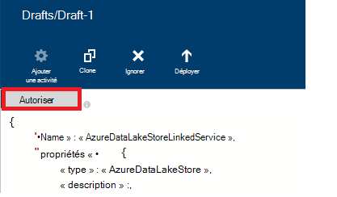

<properties
    pageTitle="Déplacer des données vers/à partir du magasin de LAC de données Azure | Usine de données Azure"
    description="Découvrez comment déplacer des données vers/depuis le magasin de LAC de données Azure à l’aide de la fabrique de données Azure"
    services="data-factory"
    documentationCenter=""
    authors="linda33wj"
    manager="jhubbard"
    editor="monicar"/>

<tags
    ms.service="data-factory"
    ms.workload="data-services"
    ms.tgt_pltfrm="na"
    ms.devlang="na"
    ms.topic="article"
    ms.date="09/27/2016"
    ms.author="jingwang"/>

# Déplacement des données vers et à partir du magasin de LAC de données Azure à l’aide de la fabrique de données Azure
Cet article décrit comment vous pouvez utiliser l’activité de copie dans une usine de données Azure pour déplacer des données depuis/vers le magasin de LAC de données Azure vers/à partir d’un autre magasin de données. Cet article s’appuie sur l’article [d’activités de déplacement des données](data-factory-data-movement-activities.md) , qui présente une vue d’ensemble de transfert de données avec l’activité de copie et les combinaisons de magasin de données pris en charge.

> [AZURE.NOTE]
> Créer un compte Azure données lac magasin avant de créer un tuyau avec une activité de copie pour transférer des données vers/à partir d’un magasin du lac de données Azure. Pour obtenir des informations sur le magasin de LAC de données Azure, consultez [mise en route avec le lac Azure Data Store](../data-lake-store/data-lake-store-get-started-portal.md).
>  
> Consultez [créer votre premier didacticiel de pipeline](data-factory-build-your-first-pipeline.md) pour obtenir la procédure détaillée pour créer une fabrique de données, les services liés, des groupes de données et un tuyau. Utilisez les extraits de JSON avec données fabrique éditeur ou Visual Studio ou Azure PowerShell pour créer les entités de données usine.

## Assistant de duplication des données
Pour créer un pipeline qui copie des données vers/depuis le magasin de LAC Azure données le plus simple est d’utiliser l’Assistant de copie de données. Consultez [didacticiel : créer un tuyau à l’aide d’Assistant copie](data-factory-copy-data-wizard-tutorial.md) pour une procédure pas à pas rapides sur la création d’un tuyau à l’aide de l’Assistant de copie de données. 

Les exemples suivants fournissent des exemples de définitions de JSON qui vous permet de créer un tuyau à l’aide de [Visual Studio](data-factory-copy-activity-tutorial-using-visual-studio.md) [Azure portal](data-factory-copy-activity-tutorial-using-azure-portal.md) ou [PowerShell d’Azure](data-factory-copy-activity-tutorial-using-powershell.md). Ils illustrent le copier des données vers et à partir de la banque de LAC de données Azure et stockage d’objets Blob Azure. Toutefois, les données peuvent être copiées **directement** à partir des sources des récepteurs indiquée [ici](data-factory-data-movement-activities.md#supported-data-stores) à l’aide de l’activité de copie dans Azure Data Factory.  

## Exemple : Copier des données d’Azure Blob Azure données lac magasin
L’exemple suivant s’affiche :

1.  Un service lié du type [AzureStorage](#azure-storage-linked-service-properties).
2.  Un service lié du type [AzureDataLakeStore](#azure-data-lake-linked-service-properties).
3.  Un [groupe de données](data-factory-create-datasets.md) d’entrée de type [AzureBlob](#azure-blob-dataset-type-properties).
4.  Une sortie [dataset](data-factory-create-datasets.md) de type [AzureDataLakeStore](#azure-data-lake-dataset-type-properties).
4.  Un [pipeline](data-factory-create-pipelines.md) avec une activité de copie qui utilise [BlobSource](#azure-blob-copy-activity-type-properties) et [AzureDataLakeStoreSink](#azure-data-lake-copy-activity-type-properties).

L’exemple copie les données de série de l’heure à partir d’un stockage d’objets Blob Azure au magasin de LAC de données Azure toutes les heures. Les propriétés JSON utilisées dans ces exemples sont décrites dans les sections suivantes les exemples.

**Service de stockage lié Azure :**

    {
      "name": "StorageLinkedService",
      "properties": {
        "type": "AzureStorage",
        "typeProperties": {
          "connectionString": "DefaultEndpointsProtocol=https;AccountName=<accountname>;AccountKey=<accountkey>"
        }
      }
    }

**Lac de données Azure lié de service :**

    {
        "name": "AzureDataLakeStoreLinkedService",
        "properties": {
            "type": "AzureDataLakeStore",
            "typeProperties": {
                "dataLakeStoreUri": "https://<accountname>.azuredatalakestore.net/webhdfs/v1",
                "sessionId": "<session ID>",
                "authorization": "<authorization URL>"
            }
        }
    }

### Pour créer les Azure Service données lac lié à l’aide de données fabrique éditeur
La procédure suivante fournit les étapes pour créer un service de magasin de LAC de données Azure lié à l’aide de l’éditeur de la fabrique de données.

1. Cliquez sur **nouveau magasin de données** de la barre de commandes et sélectionnez **Le lac Azure Data Store**.
2. Dans l’éditeur de JSON, pour la propriété **dataLakeStoreUri** , entrez l’URI pour le lac de données.
3. Cliquez sur le bouton **Autoriser** sur la barre de commandes. Vous devez voir une fenêtre contextuelle.

    

4. Connectez-vous en utilisant vos informations d’identification et **l’autorisation** dans le JSON doit être assignée à la propriété une valeur maintenant.
5. (facultatif) Spécifiez des valeurs pour les paramètres optionnels tels que **NomCompte** **subscriptionID**et **resourceGroupName** dans le JSON ou supprimer ces propriétés à partir de la JSON.
6. Dans la barre de commande pour déployer le service lié, cliquez sur **déployer** .

> [AZURE.IMPORTANT] Le code d’autorisation que vous avez généré à l’aide du bouton **Autoriser** expire après un certain temps. **Autoriser à nouveau** à l’aide de l' **Autoriser** bouton lorsque le **jeton a expiré** et le redéploiement du service lié. Pour plus d’informations, reportez-vous à la section [Service lié de banque lac données Azure](#azure-data-lake-store-linked-service-properties) . 

**Dataset d’entrée des Blob Azure :**

Données sont récupérées à partir d’un objet blob de nouveau toutes les heures (fréquence : heures, l’intervalle : 1). Le nom du chemin d’accès et de fichier de dossier pour le blob sont calculées de manière dynamique en fonction de l’heure de début de la tranche qui est en cours de traitement. Le chemin d’accès du dossier utilise la partie jour de l’heure de début, mois et année et nom de fichier utilise la partie heure de l’heure de début. « externe » : paramètre « true » informe le service de fabrique de données que la table est externe à l’usine de données et qu’il n’est pas produite par une activité sur le factory de données.

    {
      "name": "AzureBlobInput",
      "properties": {
        "type": "AzureBlob",
        "linkedServiceName": "StorageLinkedService",
        "typeProperties": {
          "folderPath": "mycontainer/myfolder/yearno={Year}/monthno={Month}/dayno={Day}",
          "partitionedBy": [
            {
              "name": "Year",
              "value": {
                "type": "DateTime",
                "date": "SliceStart",
                "format": "yyyy"
              }
            },
            {
              "name": "Month",
              "value": {
                "type": "DateTime",
                "date": "SliceStart",
                "format": "MM"
              }
            },
            {
              "name": "Day",
              "value": {
                "type": "DateTime",
                "date": "SliceStart",
                "format": "dd"
              }
            },
            {
              "name": "Hour",
              "value": {
                "type": "DateTime",
                "date": "SliceStart",
                "format": "HH"
              }
            }
          ]
        },
        "external": true,
        "availability": {
          "frequency": "Hour",
          "interval": 1
        },
        "policy": {
          "externalData": {
            "retryInterval": "00:01:00",
            "retryTimeout": "00:10:00",
            "maximumRetry": 3
          }
        }
      }
    }

**Dataset de sortie du lac de données Azure :**

L’exemple de copie des données dans une banque du lac de données Azure. Nouvelles données soient de stockent des copies de données lac toutes les heures.

    {
        "name": "AzureDataLakeStoreOutput",
        "properties": {
            "type": "AzureDataLakeStore",
            "linkedServiceName": "AzureDataLakeStoreLinkedService",
            "typeProperties": {
                "folderPath": "datalake/output/"
            },
            "availability": {
                "frequency": "Hour",
                "interval": 1
            }
        }
    }

**Pipeline avec une activité de copie :**

Le pipeline contient une activité de copie qui est configuré pour utiliser les jeux de données d’entrée et de sortie et est planifié pour s’exécuter toutes les heures. Dans la définition de JSON de pipeline, le type de **source** est défini sur **BlobSource** et type de **récepteurs** est définie sur **AzureDataLakeStoreSink**.

    {  
        "name":"SamplePipeline",
        "properties":
        {  
            "start":"2014-06-01T18:00:00",
            "end":"2014-06-01T19:00:00",
            "description":"pipeline with copy activity",
            "activities":
            [  
                {
                    "name": "AzureBlobtoDataLake",
                    "description": "Copy Activity",
                    "type": "Copy",
                    "inputs": [
                    {
                        "name": "AzureBlobInput"
                    }
                    ],
                    "outputs": [
                    {
                        "name": "AzureDataLakeStoreOutput"
                    }
                    ],
                    "typeProperties": {
                        "source": {
                            "type": "BlobSource",
                            "treatEmptyAsNull": true,
                            "blobColumnSeparators": ","
                        },
                        "sink": {
                            "type": "AzureDataLakeStoreSink"
                        }
                    },
                    "scheduler": {
                        "frequency": "Hour",
                        "interval": 1
                    },
                    "policy": {
                        "concurrency": 1,
                        "executionPriorityOrder": "OldestFirst",
                        "retry": 0,
                        "timeout": "01:00:00"
                    }
                }
            ]
        }
    }

## Exemple : Copier les données de magasin de LAC de données Azure pour les Blob Azure
L’exemple suivant s’affiche :

1.  Un service lié du type [AzureDataLakeStore](#azure-data-lake-linked-service-properties).
2.  Un service lié du type [AzureStorage](#azure-storage-linked-service-properties).
3.  Un [groupe de données](data-factory-create-datasets.md) d’entrée de type [AzureDataLakeStore](#azure-data-lake-dataset-type-properties).
4.  Une sortie [dataset](data-factory-create-datasets.md) de type [AzureBlob](#azure-blob-dataset-type-properties).
5.  Un [pipeline](data-factory-create-pipelines.md) avec une activité de copie qui utilise [AzureDataLakeStoreSource](#azure-data-lake-copy-activity-type-properties) et [BlobSink](#azure-blob-copy-activity-type-properties)

L’exemple copie les données de série de l’heure à partir d’un magasin du lac de données Azure dans un blob Azure toutes les heures. Les propriétés JSON utilisées dans ces exemples sont décrites dans les sections suivantes les exemples.

**Magasin de LAC de données Azure lié de service :**

    {
        "name": "AzureDataLakeStoreLinkedService",
        "properties": {
            "type": "AzureDataLakeStore",
            "typeProperties": {
                "dataLakeStoreUri": "https://<accountname>.azuredatalakestore.net/webhdfs/v1",
                "sessionId": "<session ID>",
                "authorization": "<authorization URL>"
            }
        }
    }

> [AZURE.NOTE] Voir les étapes dans l’exemple précédent pour obtenir l’URL de l’autorisation.  

**Service de stockage lié Azure :**

    {
      "name": "StorageLinkedService",
      "properties": {
        "type": "AzureStorage",
        "typeProperties": {
          "connectionString": "DefaultEndpointsProtocol=https;AccountName=<accountname>;AccountKey=<accountkey>"
        }
      }
    }

**Dataset d’entrée du lac de données Azure :**

Définition de **« externe » : true** informe le service Factory de données que la table est externe à l’usine de données et qu’il n’est pas produite par une activité sur le factory de données.

    {
        "name": "AzureDataLakeStoreInput",
        "properties":
        {
            "type": "AzureDataLakeStore",
            "linkedServiceName": "AzureDataLakeStoreLinkedService",
            "typeProperties": {
                "folderPath": "datalake/input/",
                "fileName": "SearchLog.tsv",
                "format": {
                    "type": "TextFormat",
                    "rowDelimiter": "\n",
                    "columnDelimiter": "\t"
                }
            },
            "external": true,
            "availability": {
                "frequency": "Hour",
                "interval": 1
            },
            "policy": {
                "externalData": {
                    "retryInterval": "00:01:00",
                    "retryTimeout": "00:10:00",
                    "maximumRetry": 3
                }
            }
        }
    }

**Dataset de sortie Blob Azure :**

Les données sont écrites dans un blob de nouveau toutes les heures (fréquence : heures, l’intervalle : 1). Le chemin d’accès du dossier pour le blob est calculée de manière dynamique en fonction de l’heure de début de la tranche qui est en cours de traitement. Le chemin d’accès du dossier utilise l’année, mois, jour et parties d’heures de l’heure de début.

    {
      "name": "AzureBlobOutput",
      "properties": {
        "type": "AzureBlob",
        "linkedServiceName": "StorageLinkedService",
        "typeProperties": {
          "folderPath": "mycontainer/myfolder/yearno={Year}/monthno={Month}/dayno={Day}/hourno={Hour}",
          "partitionedBy": [
            {
              "name": "Year",
              "value": {
                "type": "DateTime",
                "date": "SliceStart",
                "format": "yyyy"
              }
            },
            {
              "name": "Month",
              "value": {
                "type": "DateTime",
                "date": "SliceStart",
                "format": "MM"
              }
            },
            {
              "name": "Day",
              "value": {
                "type": "DateTime",
                "date": "SliceStart",
                "format": "dd"
              }
            },
            {
              "name": "Hour",
              "value": {
                "type": "DateTime",
                "date": "SliceStart",
                "format": "HH"
              }
            }
          ],
          "format": {
            "type": "TextFormat",
            "columnDelimiter": "\t",
            "rowDelimiter": "\n"
          }
        },
        "availability": {
          "frequency": "Hour",
          "interval": 1
        }
      }
    }

**Pipeline avec l’activité de copie :**

Le pipeline contient une activité de copie qui est configuré pour utiliser les jeux de données d’entrée et de sortie et est planifié pour s’exécuter toutes les heures. Dans la définition de JSON de pipeline, le type de **source** est défini sur **AzureDataLakeStoreSource** et type de **récepteurs** est définie sur **BlobSink**.

    {  
        "name":"SamplePipeline",
        "properties":{  
            "start":"2014-06-01T18:00:00",
            "end":"2014-06-01T19:00:00",
            "description":"pipeline for copy activity",
            "activities":[  
                {
                    "name": "AzureDakeLaketoBlob",
                    "description": "copy activity",
                    "type": "Copy",
                    "inputs": [
                      {
                        "name": "AzureDataLakeStoreInput"
                      }
                    ],
                    "outputs": [
                      {
                        "name": "AzureBlobOutput"
                      }
                    ],
                    "typeProperties": {
                        "source": {
                            "type": "AzureDataLakeStoreSource",
                        },
                        "sink": {
                            "type": "BlobSink"
                        }
                    },
                    "scheduler": {
                        "frequency": "Hour",
                        "interval": 1
                    },
                    "policy": {
                        "concurrency": 1,
                        "executionPriorityOrder": "OldestFirst",
                        "retry": 0,
                        "timeout": "01:00:00"
                    }
                }
             ]
        }
    }

## Propriétés de Service de données lac magasin lié Azure

Vous pouvez lier un compte de stockage Azure à une usine de données Azure à l’aide d’un service de stockage Azure lié. Le tableau suivant fournit la description pour les éléments JSON spécifiques au service de stockage Azure lié.

| Propriété | Description | Obligatoire |
| :-------- | :----------- | :-------- |
| type de | La propriété type doit être définie : **AzureDataLakeStore** | Oui |
| dataLakeStoreUri | Permet de spécifier des informations sur le compte Azure données lac. Il est au format suivant : https://<Azure Data Lake account name>.azuredatalakestore.net/webhdfs/v1 | Oui |
| autorisation | Cliquez sur le bouton **Autoriser** dans l' **Éditeur de données de fabrique** et entrez vos informations d’identification qui affecte l’URL générée automatiquement de l’autorisation pour cette propriété.  | Oui |
| ID de session | Id de session OAuth à partir de la session d’autorisation oauth. Chaque id de session est unique et ne peut être utilisé qu’une seule fois. Ce paramètre est automatiquement généré lorsque vous utilisez l’éditeur de données en usine. | Oui |  
| nom de compte | Nom de compte de données lac | N° |
| subscriptionId | Abonnement Azure ID. | Non (si non spécifié, l’inscription de la fabrique de données est utilisée). |
| resourceGroupName |  Nom du groupe de ressources Azure | Non (si non spécifié, groupe de ressources de la fabrique de données est utilisé). |

## Expiration du jeton 
Le code d’autorisation que vous générez à l’aide du bouton **Autoriser** expire après un certain temps. Reportez-vous au tableau suivant pour les délais d’expiration pour les différents types de comptes d’utilisateurs. Le message d’erreur suivant peut s’afficher message lorsque l’authentification **jeton a expiré**: « erreur d’opération des informations d’identification : invalid_grant - AADSTS70002 : erreur de validation des informations d’identification. AADSTS70008 : Le droit d’accès fourni est expiré ou révoqué. ID de suivi : d18629e8-af88-43c5-88e3-d8419eb1fca1 ID de corrélation : fac30a0c-6be6-4e02-8d69-a776d2ffefd7 Timestamp : 2015-12-15 21-09-31Z ».

| Type d’utilisateur | Expire après |
| :-------- | :----------- | 
| Comptes d’utilisateurs non gérés par Azure Active Directory (@hotmail.com, @live.com, etc..). | 12 heures |
| Comptes utilisateurs gérés par Azure Active Directory (DAS) | exécution de 14 jours à compter de la dernière tranche.   90 jours, si une tranche basée sur les services OAuth lié s’exécute au moins une fois tous les 14 jours. |

Si vous modifiez votre mot de passe avant cette date d’expiration du jeton, le jeton d’expiration immédiatement et le message d’erreur mentionné dans cette section. 

Pour éviter de/résoudre cette erreur, autoriser à l’aide de l' **Autoriser** à nouveau le bouton lorsque le **jeton a expiré** et le redéploiement du service lié. Vous pouvez également générer des valeurs pour les propriétés de **l’ID de session** et **d’autorisation** par programme à l’aide de code dans la section suivante :

### Pour générer des valeurs d’ID de session et d’autorisation par programme 

    if (linkedService.Properties.TypeProperties is AzureDataLakeStoreLinkedService ||
        linkedService.Properties.TypeProperties is AzureDataLakeAnalyticsLinkedService)
    {
        AuthorizationSessionGetResponse authorizationSession = this.Client.OAuth.Get(this.ResourceGroupName, this.DataFactoryName, linkedService.Properties.Type);

        WindowsFormsWebAuthenticationDialog authenticationDialog = new WindowsFormsWebAuthenticationDialog(null);
        string authorization = authenticationDialog.AuthenticateAAD(authorizationSession.AuthorizationSession.Endpoint, new Uri("urn:ietf:wg:oauth:2.0:oob"));

        AzureDataLakeStoreLinkedService azureDataLakeStoreProperties = linkedService.Properties.TypeProperties as AzureDataLakeStoreLinkedService;
        if (azureDataLakeStoreProperties != null)
        {
            azureDataLakeStoreProperties.SessionId = authorizationSession.AuthorizationSession.SessionId;
            azureDataLakeStoreProperties.Authorization = authorization;
        }

        AzureDataLakeAnalyticsLinkedService azureDataLakeAnalyticsProperties = linkedService.Properties.TypeProperties as AzureDataLakeAnalyticsLinkedService;
        if (azureDataLakeAnalyticsProperties != null)
        {
            azureDataLakeAnalyticsProperties.SessionId = authorizationSession.AuthorizationSession.SessionId;
            azureDataLakeAnalyticsProperties.Authorization = authorization;
        }
    }

Consultez la [AzureDataLakeStoreLinkedService classe](https://msdn.microsoft.com/library/microsoft.azure.management.datafactories.models.azuredatalakestorelinkedservice.aspx), [Classe de AzureDataLakeAnalyticsLinkedService](https://msdn.microsoft.com/library/microsoft.azure.management.datafactories.models.azuredatalakeanalyticslinkedservice.aspx)et [AuthorizationSessionGetResponse classe](https://msdn.microsoft.com/library/microsoft.azure.management.datafactories.models.authorizationsessiongetresponse.aspx) les rubriques pour plus d’informations sur les classes de fabrique des données utilisées dans le code. Ajoutez une référence à la version de **2.9.10826.1824** de **Microsoft.IdentityModel.Clients.ActiveDirectory.WindowsForms.dll** pour la classe WindowsFormsWebAuthenticationDialog utilisée dans le code. 
 

## Propriétés du type Dataset lac de données Azure

Pour obtenir une liste complète des sections JSON et les propriétés disponibles pour la définition des groupes de données, consultez l’article de la [Création de groupes de données](data-factory-create-datasets.md) . Sections de structure, de disponibilité et de stratégie d’un groupe de données JSON sont similaires pour tous les types de groupe de données (SQL Azure, blob Azure, table Azure, etc..).

La section **typeProperties** est différente pour chaque type de groupe de données et fournit des informations à propos de l’emplacement, format, etc., des données dans le magasin de données. La section typeProperties pour le groupe de données de type **AzureDataLakeStore** le groupe de données possède les propriétés suivantes :

| Propriété | Description | Obligatoire |
| :-------- | :----------- | :-------- |
| folderPath | Chemin d’accès vers le conteneur et le dossier dans le lac de données Azure stocker. | Oui |
| nom de fichier | Nom du fichier dans le magasin du lac de données Azure. nom de fichier est facultative et est sensible à la casse.   Si vous spécifiez un nom de fichier, l’activité (y compris la copie) fonctionne sur le fichier spécifique.  Lorsque le nom de fichier n’est pas spécifié, copie comprend tous les fichiers dans le folderPath pour le groupe de données d’entrée.  Lorsque le nom de fichier n’est pas spécifié pour la sortie d’un groupe de données, le nom du fichier généré serait le suivant ce format : données. <Guid>.txt (par exemple : : Data.0a405f8a-93ff-4c6f-b3be-f69616f1df7a.txt | N° |
| partitionedBy | partitionedBy est une propriété facultative. Vous pouvez l’utiliser pour spécifier un folderPath dynamique et un nom de fichier de données de série de temps. Par exemple, folderPath peut être paramétrée pour chaque heure de données. Reportez-vous à la section [Using partitionedBy propriété](#using-partitionedby-property) pour plus d’informations et des exemples. | N° |
| format | Les types de format suivants sont pris en charge : **TextFormat**, **AvroFormat**, **JsonFormat**, **OrcFormat**, **ParquetFormat**. Définissez **la propriété sous un format** à l’une de ces valeurs. Consultez les sections [Spécifiant TextFormat](#specifying-textformat), [Spécifiant les AvroFormat](#specifying-avroformat), [Spécifiant les JsonFormat](#specifying-jsonformat), [Spécifiant la OrcFormat](#specifying-orcformat)et [ParquetFormat de spécifier](#specifying-parquetformat) pour plus de détails. Si vous souhaitez copier les fichiers en tant que-est entre bases orientées fichier (copie binaire), vous pouvez ignorer la section de format dans les deux définitions de jeu de données d’entrée et de sortie.| N°
| compression | Permet de spécifier le type et le niveau de compression pour les données. Types pris en charge sont : **GZip**et **Deflate**et **BZip2** niveaux pris en charge sont : **optimale** et la **plus rapide**. Actuellement, les paramètres de compression ne sont pas pris en charge pour les données de **AvroFormat** ou de **OrcFormat**. Pour plus d’informations, reportez-vous à la section [prise en charge de la Compression](#compression-support) .  | N° |

### À l’aide de la propriété de partitionedBy
Vous pouvez spécifier un folderPath dynamique et un nom de fichier de données de la série temps avec la section **partitionedBy** , Data Factory macros et les variables système : SliceStart et SliceEnd, qui indique les heures de début et de fin pour une tranche de données donné.

Voir les articles de [Création des groupes de données](data-factory-create-datasets.md) et de la [planification et l’exécution](data-factory-scheduling-and-execution.md) de comprendre plus de détails sur la série de temps des groupes de données, de planification et les secteurs.

#### Exemple 1

    "folderPath": "wikidatagateway/wikisampledataout/{Slice}",
    "partitionedBy":
    [
        { "name": "Slice", "value": { "type": "DateTime", "date": "SliceStart", "format": "yyyyMMddHH" } },
    ],

Dans cet exemple, {section} est remplacée par la valeur de la variable de système SliceStart Factory de données dans le format (YYYYMMDDHH) spécifiée. La SliceStart fait référence pour l’heure de début de la tranche. Le folderPath est différent pour chaque section. Par exemple : wikidatagateway/wikisampledataout/2014100103 ou wikidatagateway/wikisampledataout/2014100104

#### Exemple 2

    "folderPath": "wikidatagateway/wikisampledataout/{Year}/{Month}/{Day}",
    "fileName": "{Hour}.csv",
    "partitionedBy":
     [
        { "name": "Year", "value": { "type": "DateTime", "date": "SliceStart", "format": "yyyy" } },
        { "name": "Month", "value": { "type": "DateTime", "date": "SliceStart", "format": "MM" } },
        { "name": "Day", "value": { "type": "DateTime", "date": "SliceStart", "format": "dd" } },
        { "name": "Hour", "value": { "type": "DateTime", "date": "SliceStart", "format": "hh" } }
    ],

Dans cet exemple, l’année, mois, jour et heure de SliceStart sont extraits dans des variables distinctes qui sont utilisées par les propriétés CheminDossier et nom de fichier.

[AZURE.INCLUDE [data-factory-file-format](../../includes/data-factory-file-format.md)]
 

### Prise en charge de la compression  
Traitement des gros volumes de données peut provoquer des goulots d’étranglement d’e/s et le réseau. Par conséquent, les données compressées dans les magasins peuvent non seulement accélérer le transfert des données sur le réseau et économiser l’espace disque, mais mettent également des améliorations significatives des performances dans le traitement des données volumineuses. Actuellement, la compression est pris en charge pour les banques de données de fichiers comme les Blob Azure ou système de fichiers local.  

Pour spécifier la compression pour un groupe de données, utilisez la propriété **compression** dans le groupe de données JSON, comme dans l’exemple suivant :   

    {  
        "name": "AzureDatalakeStoreDataSet",  
        "properties": {  
            "availability": {  
                "frequency": "Day",  
                "interval": 1  
            },  
            "type": "AzureDatalakeStore",  
            "linkedServiceName": "DataLakeStoreLinkedService",  
            "typeProperties": {  
                "fileName": "pagecounts.csv.gz",  
                "folderPath": "compression/file/",  
                "compression": {  
                    "type": "GZip",  
                    "level": "Optimal"  
                }  
            }  
        }  
    }  
 
La section **compression** possède deux propriétés :  
  
- **Type :** le codec de compression **GZIP**, **Deflate** ou **BZIP2**.  
- **Niveau :** le taux de compression, ce qui peut être **optimale** ou **plus rapide**. 
    - **Plus rapide :** L’opération de compression doit se terminer aussi rapidement que possible, même si le fichier résultant n’est pas compressé de manière optimale. 
    - **Optimal**: l’opération de compression doit être optimal compressée, même si l’opération prend plus de temps pour terminer. 
    
    Pour plus d’informations, consultez la rubrique de [Niveau de Compression](https://msdn.microsoft.com/library/system.io.compression.compressionlevel.aspx) . 

Supposons que l’exemple de dataset est utilisé comme le résultat d’une activité de copie. L’activité de copie compresse les données de sortie avec les codec GZIP à l’aide de rapport optimal et écrit ensuite les données compressées dans un fichier nommé pagecounts.csv.gz dans le magasin du lac de données Azure.   

Lorsque vous spécifiez la propriété compression dans un groupe de données d’entrée JSON, le pipeline lit les données compressées à partir de la source. Lorsque vous spécifiez la propriété dans un dataset de sortie JSON, l’activité de copie peut écrire des données compressées à la destination. Voici quelques exemples de scénarios : 

- Données GZIP en lecture compressés à partir d’un magasin de LAC de données Azure, décompresser et écrire des données de résultat à une base de données SQL d’Azure. Vous définissez le groupe de données le lac Azure Data Store d’entrée avec la compression propriété JSON dans ce cas. 
- Lire des données à partir d’un fichier de texte brut à partir du système de fichiers local, à l’aide du format GZip compresser et écrire les données compressées dans un magasin de LAC de données Azure. Vous définissez un groupe de données du lac de données Azure de sortie avec la propriété JSON de compression dans ce cas.  
- Lecture de données compressé avec GZIP dans un magasin de LAC de données Azure, décompressez-le, compresser à l’aide de BZIP2 et écrire les données de résultat dans un magasin de LAC de données Azure. Définir l’ensemble de types de compression GZIP et BZIP2 pour l’entrée et de sortie des groupes de données, respectivement.   

## Propriétés de type activité de copie de données lac Azure  
Pour obtenir une liste complète des sections et les propriétés disponibles pour la définition des activités, voir l’article [Créer des Pipelines](data-factory-create-pipelines.md) . Les propriétés telles que nom, description, d’entrée et de sortie des tables et la stratégie sont disponibles pour tous les types d’activités.

D’autre part, les propriétés disponibles dans la section typeProperties de l’activité varient avec chaque type d’activité. Pour les activités de copie, elles varient selon les types de sources et les destinations

**AzureDataLakeStoreSource** prend en charge la section **typeProperties** de propriétés à l’adresse suivante :

| Propriété | Description | Valeurs autorisées | Obligatoire |
| -------- | ----------- | -------------- | -------- |
| récursive | Indique si les données sont lues de manière récursive dans les sous-dossiers ou uniquement dans le dossier spécifié. | True (valeur par défaut), False | N° |

**AzureDataLakeStoreSink** prend en charge la section **typeProperties** de propriétés à l’adresse suivante :

| Propriété | Description | Valeurs autorisées | Obligatoire |
| -------- | ----------- | -------------- | -------- |
| copyBehavior | Spécifie le comportement de la copie. | **PreserveHierarchy :** conserve la hiérarchie des fichiers dans le dossier cible. Le chemin d’accès relatif du fichier source dans le dossier source est identique pour le chemin d’accès relatif du fichier cible dans le dossier cible.  **FlattenHierarchy :** tous les fichiers du dossier source sont créés dans le premier niveau du dossier cible. Les fichiers cibles sont créées avec les nom généré automatiquement.  **MergeFiles :** fusionne tous les fichiers du dossier source vers un fichier. Si le nom de fichier/Blob est spécifié, le nom du fichier fusionné serait le nom spécifié ; dans le cas contraire, seraient de nom de fichier généré automatiquement. | N° |

[AZURE.INCLUDE [data-factory-structure-for-rectangualr-datasets](../../includes/data-factory-structure-for-rectangualr-datasets.md)]

[AZURE.INCLUDE [data-factory-type-conversion-sample](../../includes/data-factory-type-conversion-sample.md)]

[AZURE.INCLUDE [data-factory-column-mapping](../../includes/data-factory-column-mapping.md)]

## Performances et réglage  
Voir [copie activité performances & Tuning Guide](data-factory-copy-activity-performance.md) pour en savoir plus sur les facteurs clés cet impact sur les performances de transfert de données (copie activité) dans Azure Data Factory et les différentes manières de l’optimiser.
