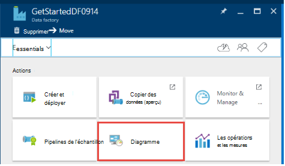

<properties
    pageTitle="Créer votre première fabrique de données (Azure portal) | Microsoft Azure"
    description="Dans ce didacticiel, vous créez un tuyau d’Azure Data Factory exemple à l’aide de la fabrique d’éditeur des données dans le portail Azure."
    services="data-factory"
    documentationCenter=""
    authors="spelluru"
    manager="jhubbard"
    editor="monicar"/>

<tags
    ms.service="data-factory"
    ms.workload="data-services"
    ms.tgt_pltfrm="na"
    ms.devlang="na"
    ms.topic="hero-article" 
    ms.date="09/14/2016"
    ms.author="spelluru"/>

# Didacticiel : Créer votre première fabrique de données Azure à l’aide du portail Azure
> [AZURE.SELECTOR]
- [Vue d’ensemble et des conditions préalables](data-factory-build-your-first-pipeline.md)
- [Azure portal](data-factory-build-your-first-pipeline-using-editor.md)
- [Visual Studio](data-factory-build-your-first-pipeline-using-vs.md)
- [PowerShell](data-factory-build-your-first-pipeline-using-powershell.md)
- [Modèle de gestionnaire de ressources](data-factory-build-your-first-pipeline-using-arm.md)
- [API REST](data-factory-build-your-first-pipeline-using-rest-api.md)

Dans cet article, vous allez apprendre à utiliser le [portail Azure](https://portal.azure.com/) pour créer votre première fabrique de données Azure. 

## Conditions préalables        
1. Lisez l’article de [Vue d’ensemble](data-factory-build-your-first-pipeline.md) et suivez les étapes de la **condition préalable** .
2. Cet article ne fournit pas une vue d’ensemble conceptuelle du service Factory de données Azure. Il est recommandé que vous accédez par le biais de l’article de [Présentation de Azure Data Factory](data-factory-introduction.md) pour une présentation détaillée du service.  

## Création de la fabrique de données
Une fabrique de données peut avoir un ou plusieurs tuyaux. Un tuyau peut contenir une ou plusieurs activités. Par exemple, une activité de copie pour copier des données d’une source à une banque de données de destination et une activité de ruche de HDInsight pour exécuter le script de ruche pour transformer des données d’entrée produit sortie des données. Commençons par la création de la fabrique de données dans cette étape. 

1.  Connectez-vous au [portail Azure](https://portal.azure.com/).
2.  Cliquez sur **Nouveau** dans le menu de gauche, cliquez sur **données + Analytique**et cliquez sur le **Factory de données**.
        
    

2.  Dans la **nouvelle fabrique de données** lame, entrez **GetStartedDF** pour le nom.

    

    > [AZURE.IMPORTANT] 
    > Le nom de la fabrique de données Azure doit être **globalement unique**. Si vous recevez l’erreur : **nom d’usine de données « GetStartedDF » n’est pas disponible**. Essayez à nouveau de créer et de modifier le nom de la fabrique de données (par exemple, yournameGetStartedDF). Voir la rubrique [Data Factory - règles d’appellation](data-factory-naming-rules.md) pour les règles d’affectation de noms pour les artefacts de données usine.
    > 
    > Le nom de la fabrique de données peut être enregistré sous la forme d’un nom **DNS** à l’avenir et, par conséquent, devenir visible publiquement.

3.  Sélectionnez l' **abonnement Azure** où vous souhaitez le factory de données à créer. 
4.  Sélectionnez **groupe de ressources** ou de créer un groupe de ressources. Dans le didacticiel, créez un groupe de ressource nommé : **ADFGetStartedRG**. 
5.  Sur la lame de **nouvelle fabrique de données** , cliquez sur **créer** .

    > [AZURE.IMPORTANT] Pour créer des instances de la fabrique de données, vous devez être un membre du rôle [Collaborateur usine](../active-directory/role-based-access-built-in-roles.md/#data-factory-contributor) au niveau du groupe d’abonnement/de la ressource. 
6.  Vous consultez le factory de données en cours de création dans la **Startboard** du portail Azure comme suit :   

    
7. Félicitations ! Vous avez créé votre première fabrique de données. Après que le factory de données a été créé avec succès, vous consultez la page données en usine, qui indique le contenu de la fabrique de données.   

    

Avant de créer un tuyau dans l’usine de données, vous devez d’abord créer quelques entités de Data Factory. Tout d’abord, vous créez des services liés pour lier des banques de données/calcule à votre magasin de données, de définir l’entrée et de sortie des groupes de données pour représenter les données d’entrée/sortie dans des magasins de données liées, puis créer le pipeline à une activité qui utilise ces groupes de données. 

## Créer des services liés
Dans cette étape, vous liez votre compte de stockage Azure et un cluster d’Azure HDInsight à la demande à votre usine de données. Le compte de stockage Azure conserve les données d’entrée et de sortie pour le pipeline dans cet exemple. Le service HDInsight lié est utilisé pour exécuter le script de ruche spécifié dans l’activité du pipeline dans cet exemple. Identifier le [magasin de données](data-factory-data-movement-activities.md)/[services de traitement](data-factory-compute-linked-services.md) sont utilisées dans votre scénario et de lier ces services à l’usine de données en créant des services liés.  

### Créer le service de stockage Azure lié
Dans cette étape, vous liez votre compte de stockage Azure à votre usine de données. Dans ce didacticiel, vous utilisez le même compte de stockage Azure pour stocker les données d’entrée/sortie et le fichier de script HQL. 

1.  Cliquez sur **auteur et déployer** sur la lame de **DATA FACTORY** pour **GetStartedDF**. Vous devez voir l’éditeur fabrique des données. 
     
    
2.  Cliquez sur **nouveau magasin de données** et choisissez le **stockage Azure**.

    

3.  Vous devez voir le script JSON pour la création d’un service de stockage Azure lié dans l’éditeur. 
    
    
     
4. Remplacez le **nom de compte** avec le nom de votre compte de stockage Azure et votre **clé de compte** avec la touche d’accès rapide du compte de stockage Azure. Pour savoir comment obtenir votre clé d’accès de stockage, reportez-vous à la section [Affichage, de copie et de stockage de régénérer les touches d’accès](../storage/storage-create-storage-account.md#view-copy-and-regenerate-storage-access-keys)
5. Dans la barre de commande pour déployer le service lié, cliquez sur **déployer** .

    

   Après avoir déployé le service lié avec succès, la fenêtre de **projet-1** doit disparaître et vous voir **AzureStorageLinkedService** dans l’arborescence sur la gauche. 
       

 
### Créer le service de HDInsight d’Azure lié
Dans cette étape, vous liez un cluster d’HDInsight à la demande à votre usine de données. Le cluster HDInsight est automatiquement créé lors de l’exécution et supprimé une fois ceci traitement et inactif le laps de temps spécifié. 

1. Dans l' **Éditeur de fabrique de données**, cliquez sur **... Plus**et cliquez sur **calculer de nouveau**, sélectionnez le **cluster d’HDInsight de la demande**.

    
2. Copiez et collez l’extrait de code suivant à la fenêtre de **projet-1** . L’extrait de JSON décrit les propriétés qui sont utilisées pour créer la HDInsight cluster à la demande. 

        {
          "name": "HDInsightOnDemandLinkedService",
          "properties": {
            "type": "HDInsightOnDemand",
            "typeProperties": {
              "version": "3.2",
              "clusterSize": 1,
              "timeToLive": "00:30:00",
              "linkedServiceName": "AzureStorageLinkedService"
            }
          }
        }
    
    Le tableau suivant fournit des descriptions pour les propriétés JSON utilisées dans l’extrait de code :
    
  	| Propriété | Description |
  	| :------- | :---------- |
  	| Version | Spécifie que la version de la HDInsight créée pour 3.2. | 
  	| ClusterSize | Spécifie la taille du cluster HDInsight. | 
  	| Propriété TimeToLive | Spécifie que le temps d’inactivité pour le cluster HDInsight, avant d’être supprimé. |
  	| linkedServiceName | Spécifie le compte de stockage qui est utilisé pour stocker les journaux qui sont générés par HDInsight. |

    Notez les points suivants : 
    
    - Le Factory de données crée un cluster **Windows** HDInsight avec le JSON. Vous pourriez également y créer un cluster **Linux** HDInsight. Pour plus d’informations, reportez-vous à la section [Service de lié à la demande HDInsight](data-factory-compute-linked-services.md#azure-hdinsight-on-demand-linked-service) . 
    - Vous pouvez utiliser **votre propre cluster HDInsight** au lieu d’utiliser un cluster d’HDInsight à la demande. Pour plus d’informations, reportez-vous à la section [HDInsight des services liés](data-factory-compute-linked-services.md#azure-hdinsight-linked-service) .
    - Le cluster HDInsight crée un **conteneur par défaut** dans le stockage blob que vous avez spécifié dans le JSON (**linkedServiceName**). HDInsight ne supprime pas ce conteneur lorsque le cluster est supprimé. Ce comportement est voulu par la conception. Avec le service de HDInsight liée à la demande, un cluster de HDInsight est créé chaque fois qu’une tranche est traitée, sauf s’il existe un cluster live existant (**la propriété timeToLive**). Le cluster est automatiquement supprimé lorsque le traitement est terminé.
    
        Comme plusieurs sections sont traitées, vous voyez de nombreux conteneurs dans le stockage blob Azure. Si vous ne devez pas les pour des tâches de dépannage, vous souhaiterez les supprimer afin de réduire le coût de stockage. Les noms de ces conteneurs obéissent à un modèle : « chargeur automatique de documents**yourdatafactoryname**-**linkedservicename**- datetimestamp ». Utilisez des outils tels que [Microsoft Storage Explorer](http://storageexplorer.com/) pour supprimer les conteneurs dans le stockage blob Azure.

    Pour plus d’informations, reportez-vous à la section [Service de lié à la demande HDInsight](data-factory-compute-linked-services.md#azure-hdinsight-on-demand-linked-service) .
3. Dans la barre de commande pour déployer le service lié, cliquez sur **déployer** . 

    

4. Vérifiez que vous voyez à la fois **AzureStorageLinkedService** et **HDInsightOnDemandLinkedService** dans l’arborescence de la visualiser sur la gauche.

    

## Créer des groupes de données
Dans cette étape, vous créez des groupes de données pour représenter l’entrée et la sortie des données pour le traitement de la ruche. Ces groupes de données, voir **AzureStorageLinkedService** que vous avez créé précédemment dans ce didacticiel. Les points de service lié à un compte de stockage Azure et les groupes de données spécifient les conteneur, dossier, nom de fichier dans le stockage qui contient l’entrée et de sortie des données.   

### Créer le groupe de données d’entrée

1. Dans l' **Éditeur de fabrique de données**, cliquez sur **... Plus** sur la barre de commandes, cliquez sur **Nouveau groupe de données**et sélectionnez le **stockage des objets Blob Azure**.

    
2. Copiez et collez l’extrait de code suivant à la fenêtre de projet-1. Dans l’extrait JSON, vous créez un groupe de données appelé **AzureBlobInput** qui représente les données d’entrée pour une activité dans le pipeline. En outre, vous spécifiez que les données d’entrée se trouve dans le conteneur de l’objet blob appelé **adfgetstarted** et le dossier appelé **inputdata**.
        
        {
            "name": "AzureBlobInput",
            "properties": {
                "type": "AzureBlob",
                "linkedServiceName": "AzureStorageLinkedService",
                "typeProperties": {
                    "fileName": "input.log",
                    "folderPath": "adfgetstarted/inputdata",
                    "format": {
                        "type": "TextFormat",
                        "columnDelimiter": ","
                    }
                },
                "availability": {
                    "frequency": "Month",
                    "interval": 1
                },
                "external": true,
                "policy": {}
            }
        } 

    Le tableau suivant fournit des descriptions pour les propriétés JSON utilisées dans l’extrait de code :

  	| Propriété | Description |
  	| :------- | :---------- |
  	| type de | La propriété type a la valeur AzureBlob dans la mesure où les données résident dans le stockage blob Azure. |  
  	| linkedServiceName | fait référence à la AzureStorageLinkedService que vous avez créé précédemment. |
  	| nom de fichier | Cette propriété est facultative. Si vous ne spécifiez pas cette propriété, tous les fichiers à partir de la folderPath sont prélevés. Dans ce cas, seulement la input.log est traitée. |
  	| type de | Les fichiers journaux sont au format texte, afin que l’utilisation de TextFormat. | 
  	| columnDelimiter | dans les fichiers journaux, les colonnes sont délimitées par une virgule () |
  	| fréquence/intervalle | la valeur de mois et de l’intervalle de fréquence est de 1, ce qui signifie que les tranches d’entrée sont disponibles, tous les mois. | 
  	| externe | Cette propriété a la valeur True si les données d’entrée ne sont pas générées par le service Data Factory. | 
        
3. Dans la barre de commande pour déployer le groupe de données nouvellement créée, cliquez sur **déployer** . Vous devez voir le groupe de données dans l’arborescence sur la gauche. 

### Créer le dataset de sortie
Maintenant, vous créez le dataset de sortie pour représenter les données de sortie stockées dans le stockage Blob d’Azure. 

1. Dans l' **Éditeur de fabrique de données**, cliquez sur **... Plus** sur la barre de commandes, cliquez sur **Nouveau groupe de données**et sélectionnez le **stockage des objets Blob Azure**.  
2. Copiez et collez l’extrait de code suivant à la fenêtre de projet-1. Dans l’extrait JSON, vous créez un groupe de données appelé **AzureBlobOutput**et en spécifiant la structure de données qui sont générées par le script de la ruche. En outre, vous indiquez que les résultats sont stockés dans le conteneur de l’objet blob appelé **adfgetstarted** et le dossier appelé **partitioneddata**. La section **disponibilité** indique que le dataset de sortie est produit sur une base mensuelle.
    
        {
          "name": "AzureBlobOutput",
          "properties": {
            "type": "AzureBlob",
            "linkedServiceName": "AzureStorageLinkedService",
            "typeProperties": {
              "folderPath": "adfgetstarted/partitioneddata",
              "format": {
                "type": "TextFormat",
                "columnDelimiter": ","
              }
            },
            "availability": {
              "frequency": "Month",
              "interval": 1
            }
          }
        }

    Consultez la section **créer un groupe de données d’entrée** pour obtenir une description de ces propriétés. Vous ne définissez pas la propriété externe sur un dataset de sortie comme le groupe de données généré par le service Data Factory.
3. Dans la barre de commande pour déployer le groupe de données nouvellement créée, cliquez sur **déployer** .
4. Vérifiez que le groupe de données est créé avec succès.

    

## Créer des opportunités
Dans cette étape, vous créez votre premier tuyau avec une activité **HDInsightHive** . Tranche d’entrée est disponible chaque mois (fréquence : mois, intervalle : 1), la tranche de sortie est généré tous les mois, et la propriété du Planificateur de l’activité est également définie sur mensuel. Les paramètres pour le dataset de sortie et le Planificateur de l’activité doivent correspondre. Actuellement, dataset de sortie est un élément moteur la planification, vous devez créer un groupe de données de sortie même si l’activité ne produit pas de sortie. Si l’activité n’accepte aucune entrée, vous pouvez ignorer la création du groupe de données d’entrée. Les propriétés utilisées dans le JSON suivant sont expliquées à la fin de cette section. 

1. Dans l' **Éditeur de fabrique de données**, cliquez sur **le bouton de sélection (...) Commandes plus** , puis cliquez sur **nouveau pipeline**.
    
    
2. Copiez et collez l’extrait de code suivant à la fenêtre de projet-1.

    > [AZURE.IMPORTANT] Remplacez **storageaccountname** par le nom de votre compte de stockage dans le JSON.
        
        {
            "name": "MyFirstPipeline",
            "properties": {
                "description": "My first Azure Data Factory pipeline",
                "activities": [
                    {
                        "type": "HDInsightHive",
                        "typeProperties": {
                            "scriptPath": "adfgetstarted/script/partitionweblogs.hql",
                            "scriptLinkedService": "AzureStorageLinkedService",
                            "defines": {
                                "inputtable": "wasb://adfgetstarted@<storageaccountname>.blob.core.windows.net/inputdata",
                                "partitionedtable": "wasb://adfgetstarted@<storageaccountname>.blob.core.windows.net/partitioneddata"
                            }
                        },
                        "inputs": [
                            {
                                "name": "AzureBlobInput"
                            }
                        ],
                        "outputs": [
                            {
                                "name": "AzureBlobOutput"
                            }
                        ],
                        "policy": {
                            "concurrency": 1,
                            "retry": 3
                        },
                        "scheduler": {
                            "frequency": "Month",
                            "interval": 1
                        },
                        "name": "RunSampleHiveActivity",
                        "linkedServiceName": "HDInsightOnDemandLinkedService"
                    }
                ],
                "start": "2016-04-01T00:00:00Z",
                "end": "2016-04-02T00:00:00Z",
                "isPaused": false
            }
        }
 
    Dans l’extrait JSON, vous créez un pipeline qui se compose d’une seule activité qui utilise la ruche pour traiter les données sur un cluster HDInsight.
    
    Le fichier de script de ruche, **partitionweblogs.hql**, est stocké dans le compte de stockage Azure (spécifié par la scriptLinkedService, appelée **AzureStorageLinkedService**) et dans le dossier de **scripts** dans conteneur **adfgetstarted**.

    La section **définit** est utilisée pour spécifier les paramètres d’exécution qui sont transmis au script ruche en tant que valeurs de configuration de ruche (par exemple : ${hiveconf : inputtable}, ${hiveconf:partitionedtable}).

    Les propriétés **start** et **end** du pipeline spécifie la période active du pipeline.

    Dans l’activité JSON, vous spécifiez que le script de la ruche s’exécute sur l’ordinateur spécifié par le **linkedServiceName** - **HDInsightOnDemandLinkedService**.

    > [AZURE.NOTE] Pour plus d’informations sur les propriétés JSON utilisées dans l’exemple, consultez [Anatomie d’un Pipeline](data-factory-create-pipelines.md#anatomy-of-a-pipeline) . 

3. Vérifiez les points suivants : 
    1. fichier de **Input.log** existe dans le dossier **inputdata** du conteneur **adfgetstarted** dans le stockage blob Azure
    2. fichier de **partitionweblogs.hql** existe dans le dossier **scripts** du conteneur **adfgetstarted** dans le stockage blob Azure. Complète la condition préalable des étapes dans la [Vue d’ensemble](data-factory-build-your-first-pipeline.md) si vous ne voyez pas ces fichiers. 
    3. Vérifiez que vous avez remplacé un **storageaccountname** avec le nom de votre compte de stockage dans le pipeline de JSON. 
2. Dans la barre de commande pour déployer le pipeline, cliquez sur **déployer** . Étant donné que les heures de **début** et de **fin** sont définies dans le passé et **isPaused** est définie sur false, le pipeline (activité dans le pipeline) s’exécute immédiatement après le déploiement. 
4. Vérifiez que vous consultez le pipeline dans l’arborescence.

    
5. Félicitations, vous avez créé votre premier pipeline.

## Pipeline de moniteur

### Tuyau de moniteur à l’aide de la vue Affichage des diagrammes

6. Cliquez sur **X** pour fermer l’éditeur de données usine lames et revenir à la lame de la fabrique de données, puis cliquez sur **diagramme**.
  
    
7. Dans la vue schéma, vous voyez une vue d’ensemble des tuyaux et des datasets utilisés dans ce didacticiel.
    
     
8. Pour afficher toutes les activités dans le pipeline, droit de tuyau dans le diagramme, puis cliquez sur ouverte. 

    
9. Vérifiez que vous consultez l’activité HDInsightHive dans le pipeline. 
  
    

    Pour revenir à l’affichage précédent, cliquez sur **Data factory** dans le menu de navigation du haut. 
10. Dans la **Vue de diagramme**, double-cliquez sur le groupe de données **AzureBlobInput**. Vérifiez que la section est dans l’état **prêt** . Il peut prendre quelques minutes pour la tranche s’affiche dans l’état prêt. Si elle ne se produit pas lorsque vous attendez un peu, voir si vous avez le fichier d’entrée (input.log) placé dans le conteneur de droite (adfgetstarted) et le dossier (inputdata).

    
11. Cliquez sur **X** pour fermer la lame de **AzureBlobInput** . 
12. Dans la **Vue de diagramme**, double-cliquez sur le groupe de données **AzureBlobOutput**. Vous constatez que la tranche qui est en cours de traitement.

    
9. Lorsque le traitement est terminé, vous voyez la section dans l’état **prêt** .
    
>[AZURE.IMPORTANT] Création d’un cluster d’HDInsight de la demande dure un certain temps (environ 20 minutes). Par conséquent, prévoyez le tuyau à prendre **environ 30 minutes** pour traiter la tranche.    

     
    
10. Lorsque la tranche est dans l’état **prêt** , vérifiez le dossier **partitioneddata** dans le conteneur **adfgetstarted** votre stockage blob pour les données de sortie.  
 
    
11. Cliquez sur la section pour plus de détails à ce sujet dans une lame de **tranche de données** .

      
12. Cliquez sur une activité exécutée dans la **liste des activités s’exécute** pour afficher des détails sur une activité (activité de ruche dans notre scénario) d’exécuter dans une fenêtre de **l’activité, détails de l’exécution** .   

      
    
    À partir des fichiers journaux, vous pouvez voir la requête de ruche qui a été exécutée et les informations d’état. Ces journaux sont utiles pour la résolution des éventuels problèmes.
Consultez [moniteur et de gérer les pipelines à l’aide de lames de portail Azure](data-factory-monitor-manage-pipelines.md) article pour plus de détails. 

> [AZURE.IMPORTANT] Le fichier d’entrée est supprimé lorsque la tranche est traitée avec succès. Par conséquent, si vous souhaitez réexécuter la tranche ou ce didacticiel à nouveau, vous pouvez télécharger le fichier d’entrée (input.log) dans le dossier inputdata du conteneur adfgetstarted.

### Surveiller le tuyau à l’aide de moniteur et une application de gestion
Vous pouvez également utiliser le moniteur et gérer l’application à surveiller vos pipelines. Pour plus d’informations sur l’utilisation de cette application, reportez-vous à la section [moniteur et de gérer les pipelines Azure Data Factory à l’aide de surveillance et gestion App](data-factory-monitor-manage-app.md).

1. Cliquez sur une mosaïque **de moniteurs et de gérer** sur la page d’accueil de votre usine de données.

     
2. Vous devez voir **l’application Moniteur et de la gestion**. Modifier **l’heure de début** et **heure de fin à début** (04-01-2016 12:00 AM) et l’heure de fin (04-02-2016 12:00 AM) de votre pipeline, puis cliquez sur **Appliquer**.

     
3. Sélectionnez une fenêtre de l’activité dans la liste **Activité Windows** pour consulter les détails à ce sujet. 
    

## Résumé 
Dans ce didacticiel, vous avez créé une fabrique de données Azure pour traiter les données en exécutant le script de la ruche sur un cluster d’hadoop HDInsight. Vous avez utilisé l’éditeur de la fabrique de données dans le portail Azure pour effectuer les opérations suivantes :  

1.  Permet de créer une **fabrique de données**d' Azure.
2.  Permet de créer deux **services liés**:
    1.  Service de **Stockage azure** lié pour lier votre stockage blob Azure qui contient les fichiers d’entrée/sortie sur le factory de données.
    2.  Service de lié à la demande **HDInsight d’Azure** pour lier un cluster d’HDInsight Hadoop à la demande sur le factory de données. Azure Data Factory crée un HDInsight Hadoop cluster juste-à-temps pour traiter les données d’entrée et de produire des données de sortie. 
3.  Créer deux **groupes de données**, qui décrivent les données d’entrée et de sortie pour l’activité de la ruche de HDInsight dans le pipeline. 
4.  Créer un **pipeline** avec une activité de **Ruche de HDInsight** . 

## Étapes suivantes
Dans cet article, vous avez créé un pipeline avec une transformation activité (HDInsight) qui exécute un script de la ruche sur un cluster de HDInsight à la demande. Pour savoir comment utiliser une activité de copie pour copier des données à partir d’un Blob Azure dans Azure SQL, reportez-vous à la section [didacticiel : copier des données d’un Azure blob pour Azure SQL](data-factory-copy-data-from-azure-blob-storage-to-sql-database.md).

## Voir aussi
| Rubrique | Description |
| :---- | :---- |
| [Activités de Transformation des données](data-factory-data-transformation-activities.md) | Cet article fournit une liste d’activités de transformation de données (tels que la transformation de la ruche de HDInsight vous avez utilisé dans ce didacticiel) pris en charge par l’usine de données Azure. | 
| [Planification et exécution](data-factory-scheduling-and-execution.md) | Cet article explique les aspects de la planification et l’exécution du modèle d’application Azure Data Factory. |
| [Pipelines](data-factory-create-pipelines.md) | Cet article vous aide à comprendre les pipelines et les activités dans Azure Data Factory et comment les utiliser pour construire de bout en bout orientées données des flux de travail pour votre scénario ou une entreprise. |
| [Groupes de données](data-factory-create-datasets.md) | Cet article vous aide à comprendre les groupes de données dans Azure Data Factory.
| [Surveiller et gérer les pipelines à l’aide de la surveillance de l’application](data-factory-monitor-manage-app.md) | Cet article décrit comment faire pour contrôler, gérer et déboguer des pipelines à l’aide du contrôle et application de gestion. 

  

