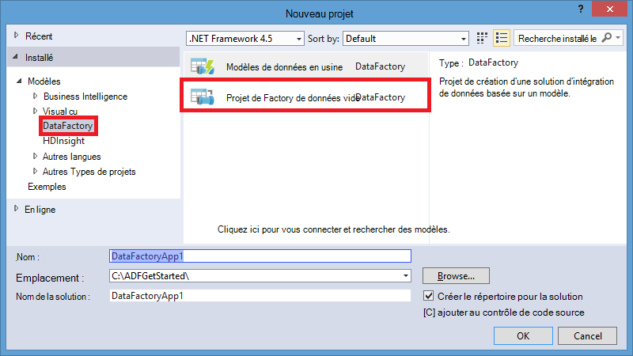

<properties
    pageTitle="Créer votre première fabrique de données (Visual Studio) | Microsoft Azure"
    description="Dans ce didacticiel, vous créez un tuyau d’Azure Data Factory exemple à l’aide de Visual Studio."
    services="data-factory"
    documentationCenter=""
    authors="spelluru"
    manager="jhubbard"
    editor="monicar"/>

<tags
    ms.service="data-factory"
    ms.workload="data-services"
    ms.tgt_pltfrm="na"
    ms.devlang="na"
    ms.topic="hero-article" 
    ms.date="10/17/2016"
    ms.author="spelluru"/>

# Didacticiel : Usine de données création de votre première Azure à l’aide de Visual Studio de Microsoft
> [AZURE.SELECTOR]
- [Vue d’ensemble et des conditions préalables](data-factory-build-your-first-pipeline.md)
- [Azure portal](data-factory-build-your-first-pipeline-using-editor.md)
- [Visual Studio](data-factory-build-your-first-pipeline-using-vs.md)
- [PowerShell](data-factory-build-your-first-pipeline-using-powershell.md)
- [Modèle de gestionnaire de ressources](data-factory-build-your-first-pipeline-using-arm.md)
- [API REST](data-factory-build-your-first-pipeline-using-rest-api.md)

Dans cet article, le Visual Studio de Microsoft vous permet de créer votre première fabrique de données Azure.

## Conditions préalables
1. Lisez l’article de [Vue d’ensemble](data-factory-build-your-first-pipeline.md) et suivez les étapes de la **condition préalable** .
2. Vous devez être un **administrateur de l’abonnement Azure** pour être en mesure de publier des entités de données usine à partir de Visual Studio sur le Factory de données Azure.
3. Vous devez avoir les éléments suivants sur votre ordinateur : 
    - 2013 de Visual Studio ou Visual Studio 2015
    - Télécharger le SDK Azure pour 2013 de Visual Studio ou Visual Studio 2015. Accédez à la [Page de téléchargement d’Azure](https://azure.microsoft.com/downloads/) et cliquez sur **VS 2013** ou **VS 2015** , dans la section **.NET** .
    - Télécharger le plug-in Azure Data Factory plus récent de Visual Studio : [VS 2013](https://visualstudiogallery.msdn.microsoft.com/754d998c-8f92-4aa7-835b-e89c8c954aa5) ou [VS 2015](https://visualstudiogallery.msdn.microsoft.com/371a4cf9-0093-40fa-b7dd-be3c74f49005). Vous pouvez mettre à jour le plug-in de la manière suivante : dans le menu, cliquez sur **Outils** -> **mises à jour et des Extensions de** -> **en ligne** -> **La galerie Visual Studio** -> **Microsoft d’une fabrique de données Azure Tools pour Visual Studio** -> **mise à jour**. 
 
Maintenant, nous allons utiliser Visual Studio pour créer une fabrique de données Azure. 

## Créer le projet de Visual Studio 
1. Lancez **Visual Studio 2013** ou **2015 de Visual Studio**. Cliquez sur **fichier**, pointez sur **Nouveau**, puis **projet**. Vous devriez voir la boîte de dialogue **Nouveau projet** .  
2. Dans la boîte de dialogue **Nouveau projet** , sélectionnez le modèle de **DataFactory** et cliquez sur le **Projet de la fabrique de données vide**.   

    

3. Entrez un **nom** pour le projet, **emplacement**et un nom pour la **solution**, puis cliquez sur **OK**.

    

## Créer des services liés
Une fabrique de données peut avoir un ou plusieurs tuyaux. Un tuyau peut contenir une ou plusieurs activités. Par exemple, une activité de copie pour copier des données provenant d’une source vers une banque de données de destination et une activité de ruche de HDInsight pour exécuter le script de ruche pour transformer les données d’entrée. Consultez les [banques de données pris en charge](data-factory-data-movement-activities.md##supported-data-stores-and-formats) pour toutes les sources et les récepteurs pris en charge par l’activité de copie. Voir [services liés de traitement](data-factory-compute-linked-services.md) pour la liste des services de calcul prises en charge par Data Factory. 

Dans cette étape, vous liez votre compte de stockage Azure et un cluster d’Azure HDInsight à la demande à votre usine de données. Le compte de stockage Azure conserve les données d’entrée et de sortie pour le pipeline dans cet exemple. Le service HDInsight lié est utilisé pour exécuter le script de ruche spécifié dans l’activité du pipeline dans cet exemple. Identifier les données banque/calcul services utilisés dans votre scénario et de lier ces services à l’usine de données en créant des services liés.  

Vous spécifiez le nom et les paramètres de la fabrique de données ultérieurement, lorsque vous publiez votre solution Data Factory.

#### Créer le service de stockage Azure lié
Dans cette étape, vous liez votre compte de stockage Azure à votre usine de données. Pour ce didacticiel, vous utilisez le même compte de stockage Azure pour stocker les données d’entrée/sortie et le fichier de script HQL. 

4. Droit de **Services liés** dans l’Explorateur de solutions, pointez sur **Ajouter**et cliquez sur **Nouvel élément**.      
5. Dans la boîte de dialogue **Ajouter un nouvel élément** , sélectionnez **Azure Storage Service lié** à partir de la liste et cliquez sur **Ajouter**. 
3. Remplacer le **nom de compte** et de **accountkey** avec le nom de votre compte de stockage Azure et sa clé. Pour savoir comment obtenir votre clé d’accès de stockage, reportez-vous à la section [Affichage, de copie et de stockage de régénérer les touches d’accès](../storage/storage-create-storage-account.md#view-copy-and-regenerate-storage-access-keys)

    

4. Enregistrez le fichier **AzureStorageLinkedService1.json** .

#### Créer le service de HDInsight d’Azure lié
Dans cette étape, vous liez un cluster d’HDInsight à la demande à votre usine de données. Le cluster HDInsight est automatiquement créé lors de l’exécution et supprimé une fois ceci traitement et inactif le laps de temps spécifié. Vous pouvez utiliser votre propre cluster HDInsight au lieu d’utiliser un cluster d’HDInsight à la demande. Pour plus d’informations, consultez [Calculer les Services liés](data-factory-compute-linked-services.md) . 

1. Dans l' **Explorateur de solutions**, cliquez avec droit de **Services liés**, pointez sur **Ajouter**et cliquez sur **Nouvel élément**.
2. Sélectionnez **HDInsight sur la demande Service lié**, puis cliquez sur **Ajouter**. 
3. Remplacez le **JSON** par le texte suivant :

        {
          "name": "HDInsightOnDemandLinkedService",
          "properties": {
            "type": "HDInsightOnDemand",
            "typeProperties": {
              "version": "3.2",
              "clusterSize": 1,
              "timeToLive": "00:30:00",
              "linkedServiceName": "AzureStorageLinkedService1"
            }
          }
        }
    
    Le tableau suivant fournit des descriptions pour les propriétés JSON utilisées dans l’extrait de code :
    
    Propriété | Description
    -------- | -----------
    Version | Spécifie que la version de la HDInsight créée pour 3.2. 
    ClusterSize | Spécifie la taille du cluster HDInsight. 
    Propriété TimeToLive | Spécifie que le temps d’inactivité pour le cluster HDInsight, avant d’être supprimé.
    linkedServiceName | Spécifie le compte de stockage qui est utilisé pour stocker les journaux qui sont générés par HDInsight

    Notez les points suivants : 
    
    - Le Factory de données crée un cluster **Windows** HDInsight avec le précédent JSON. Vous pourriez également y créer un cluster **Linux** HDInsight. Pour plus d’informations, reportez-vous à la section [Service de lié à la demande HDInsight](data-factory-compute-linked-services.md#azure-hdinsight-on-demand-linked-service) . 
    - Vous pouvez utiliser **votre propre cluster HDInsight** au lieu d’utiliser un cluster d’HDInsight à la demande. Pour plus d’informations, reportez-vous à la section [HDInsight des services liés](data-factory-compute-linked-services.md#azure-hdinsight-linked-service) .
    - Le cluster HDInsight crée un **conteneur par défaut** dans le stockage blob que vous avez spécifié dans le JSON (**linkedServiceName**). HDInsight ne supprime pas ce conteneur lorsque le cluster est supprimé. Ce comportement est voulu par la conception. Avec le service de HDInsight liée à la demande, un cluster de HDInsight est créé chaque fois qu’une tranche est traitée, sauf s’il existe un cluster live existant (**la propriété timeToLive**). Le cluster est automatiquement supprimé lorsque le traitement est terminé.
    
        Comme plusieurs sections sont traitées, vous voyez de nombreux conteneurs dans le stockage blob Azure. Si vous ne devez pas les pour des tâches de dépannage, vous souhaiterez les supprimer afin de réduire le coût de stockage. Les noms de ces conteneurs obéissent à un modèle : « chargeur automatique de documents**yourdatafactoryname**-**linkedservicename**- datetimestamp ». Utilisez des outils tels que [Microsoft Storage Explorer](http://storageexplorer.com/) pour supprimer les conteneurs dans le stockage blob Azure.

    Pour plus d’informations, reportez-vous à la section [Service de lié à la demande HDInsight](data-factory-compute-linked-services.md#azure-hdinsight-on-demand-linked-service) . 
4. Enregistrez le fichier **HDInsightOnDemandLinkedService1.json** .

## Créer des groupes de données
Dans cette étape, vous créez des groupes de données pour représenter l’entrée et la sortie des données pour le traitement de la ruche. Ces groupes de données, voir **AzureStorageLinkedService1** que vous avez créé précédemment dans ce didacticiel. Les points de service lié à un compte de stockage Azure et les groupes de données spécifient les conteneur, dossier, nom de fichier dans le stockage qui contient l’entrée et de sortie des données.   

#### Créer le groupe de données d’entrée

1. Dans l' **Explorateur de solutions**, cliquez sur **Tables**, pointez sur **Ajouter**et cliquez sur **Nouvel élément**. 
2. Sélectionnez **Les Blob Azure** dans la liste, remplacez le nom du fichier **InputDataSet.json**et cliquez sur **Ajouter**.
3. Remplacez le **JSON** dans l’éditeur avec les éléments suivants : 

    Dans l’extrait JSON, vous créez un groupe de données appelé **AzureBlobInput** qui représente les données d’entrée pour une activité dans le pipeline. En outre, vous spécifiez que les données d’entrée se trouve dans le conteneur de l’objet blob appelé **adfgetstarted** et le dossier appelé **inputdata**
        
        {
            "name": "AzureBlobInput",
            "properties": {
                "type": "AzureBlob",
                "linkedServiceName": "AzureStorageLinkedService1",
                "typeProperties": {
                    "fileName": "input.log",
                    "folderPath": "adfgetstarted/inputdata",
                    "format": {
                        "type": "TextFormat",
                        "columnDelimiter": ","
                    }
                },
                "availability": {
                    "frequency": "Month",
                    "interval": 1
                },
                "external": true,
                "policy": {}
            }
        } 

    Le tableau suivant fournit des descriptions pour les propriétés JSON utilisées dans l’extrait de code :

  	| Propriété | Description |
  	| :------- | :---------- |
  	| type de | La propriété type a la valeur AzureBlob dans la mesure où les données résident dans le stockage blob Azure. |  
  	| linkedServiceName | fait référence à la AzureStorageLinkedService1 que vous avez créé précédemment. |
  	| nom de fichier | Cette propriété est facultative. Si vous ne spécifiez pas cette propriété, tous les fichiers à partir de la folderPath sont prélevés. Dans ce cas, seulement la input.log est traitée. |
  	| type de | Les fichiers journaux sont au format texte, afin que l’utilisation de TextFormat. | 
  	| columnDelimiter | colonnes dans les fichiers journaux sont délimités par le caractère virgule () |
  	| fréquence/intervalle | la valeur de mois et de l’intervalle de fréquence est de 1, ce qui signifie que les tranches d’entrée sont disponibles, tous les mois. | 
  	| externe | Cette propriété a la valeur True si les données d’entrée ne sont pas générées par le service Data Factory. | 
      
    
3. Enregistrez le fichier **InputDataset.json** . 

 
#### Créer le dataset de sortie
Maintenant, vous créez le dataset de sortie pour représenter les données de sortie stockées dans le stockage Blob d’Azure. 

1. Dans l' **Explorateur de solutions**, cliquez sur **tables**, pointez sur **Ajouter**et cliquez sur **Nouvel élément**. 
2. Sélectionnez **Les Blob Azure** dans la liste, remplacez le nom du fichier **OutputDataset.json**et cliquez sur **Ajouter**. 
3. Remplacez le **JSON** dans l’éditeur avec les éléments suivants : 

    Dans l’extrait JSON, vous créez un groupe de données appelé **AzureBlobOutput**et en spécifiant la structure de données qui sont générées par le script de la ruche. En outre, vous indiquez que les résultats sont stockés dans le conteneur de l’objet blob appelé **adfgetstarted** et le dossier appelé **partitioneddata**. La section **disponibilité** indique que le dataset de sortie est produit sur une base mensuelle.
    
        {
          "name": "AzureBlobOutput",
          "properties": {
            "type": "AzureBlob",
            "linkedServiceName": "AzureStorageLinkedService1",
            "typeProperties": {
              "folderPath": "adfgetstarted/partitioneddata",
              "format": {
                "type": "TextFormat",
                "columnDelimiter": ","
              }
            },
            "availability": {
              "frequency": "Month",
              "interval": 1
            }
          }
        }

    Consultez la section **créer un groupe de données d’entrée** pour obtenir une description de ces propriétés. Vous ne définissez pas la propriété externe sur un dataset de sortie comme le groupe de données généré par le service Data Factory.

4. Enregistrez le fichier **OutputDataset.json** .

### Créer des opportunités
Dans cette étape, vous créez votre premier tuyau avec une activité **HDInsightHive** . La section d’entrée est disponible chaque mois (fréquence : mois, intervalle : 1), la tranche de sortie est généré tous les mois, et la propriété du Planificateur de l’activité est également définie sur mensuel. Les paramètres pour le dataset de sortie et le Planificateur de l’activité doivent correspondre. Actuellement, dataset de sortie est un élément moteur la planification, vous devez créer un groupe de données de sortie même si l’activité ne produit pas de sortie. Si l’activité n’accepte aucune entrée, vous pouvez ignorer la création du groupe de données d’entrée. Les propriétés utilisées dans le JSON suivant sont expliquées à la fin de cette section.

1. Dans l' **Explorateur de solutions**, **tuyaux**avec le bouton droit, pointez sur **Ajouter**, puis cliquez sur **un nouvel élément.** 
2. Sélectionnez le **Pipeline de Transformation de la ruche** dans la liste, puis cliquez sur **Ajouter**. 
3. Remplacez le **JSON** par l’extrait de code suivant.

    > [AZURE.IMPORTANT] Remplacez **storageaccountname** par le nom de votre compte de stockage.

        {
            "name": "MyFirstPipeline",
            "properties": {
                "description": "My first Azure Data Factory pipeline",
                "activities": [
                    {
                        "type": "HDInsightHive",
                        "typeProperties": {
                            "scriptPath": "adfgetstarted/script/partitionweblogs.hql",
                            "scriptLinkedService": "AzureStorageLinkedService1",
                            "defines": {
                                "inputtable": "wasb://adfgetstarted@<storageaccountname>.blob.core.windows.net/inputdata",
                                "partitionedtable": "wasb://adfgetstarted@<storageaccountname>.blob.core.windows.net/partitioneddata"
                            }
                        },
                        "inputs": [
                            {
                                "name": "AzureBlobInput"
                            }
                        ],
                        "outputs": [
                            {
                                "name": "AzureBlobOutput"
                            }
                        ],
                        "policy": {
                            "concurrency": 1,
                            "retry": 3
                        },
                        "scheduler": {
                            "frequency": "Month",
                            "interval": 1
                        },
                        "name": "RunSampleHiveActivity",
                        "linkedServiceName": "HDInsightOnDemandLinkedService"
                    }
                ],
                "start": "2016-04-01T00:00:00Z",
                "end": "2016-04-02T00:00:00Z",
                "isPaused": false
            }
        }

    Dans l’extrait JSON, vous créez un pipeline qui se compose d’une seule activité qui utilise la ruche pour traiter les données sur un cluster HDInsight.
    
    Dans l’extrait JSON, vous créez un pipeline qui se compose d’une seule activité qui utilise la ruche pour traiter les données sur un cluster HDInsight.
    
    Le fichier de script de ruche, **partitionweblogs.hql**, est stocké dans le compte de stockage Azure (spécifié par la scriptLinkedService, appelée **AzureStorageLinkedService1**) et dans le dossier de **scripts** dans conteneur **adfgetstarted**.

    La section **définit** est utilisée pour spécifier les paramètres d’exécution qui sont transmis au script ruche en tant que valeurs de configuration de ruche (par exemple : ${hiveconf : inputtable}, ${hiveconf:partitionedtable}).

    Les propriétés **start** et **end** du pipeline spécifie la période active du pipeline.

    Dans l’activité JSON, vous spécifiez que le script de la ruche s’exécute sur l’ordinateur spécifié par le **linkedServiceName** - **HDInsightOnDemandLinkedService**.

    > [AZURE.NOTE] Pour plus d’informations sur les propriétés JSON utilisées dans l’exemple, consultez [Anatomie d’un Pipeline](data-factory-create-pipelines.md#anatomy-of-a-pipeline) . 
3. Enregistrez le fichier **HiveActivity1.json** .

### Ajouter partitionweblogs.hql et input.log en tant que dépendance 

1. Cliquez sur **dépendances** dans la fenêtre de **L’Explorateur de solutions** , pointez sur **Ajouter**et cliquez sur **Un élément existant**.  
2. Accédez à l' **C:\ADFGettingStarted** et sélectionnez **partitionweblogs.hql**, **input.log** des fichiers, cliquez sur **Ajouter**. Vous avez créé ces deux fichiers dans le cadre de composants requis à partir de la [Vue d’ensemble](data-factory-build-your-first-pipeline.md).

Lorsque vous publiez la solution dans l’étape suivante, le fichier **partitionweblogs.hql** est téléchargé dans le dossier scripts dans le conteneur d’objet blob **adfgetstarted** .   

### Publier/déploiement des entités de données usine

18. Cliquez droit sur le projet dans l’Explorateur de solutions, puis cliquez sur **Publier**. 
19. Si vous voyez la boîte de dialogue **se connecter à votre compte Microsoft** , entrez vos informations d’identification pour le compte qui a des abonnement Azure et cliquez sur **connexion**.
20. Vous devriez voir la boîte de dialogue suivante :

    

21. Dans la page de fabrique de données de configuration, effectuez les opérations suivantes : 
    1. Sélectionnez l’option **Créer nouveau Factory de données** .
    2. Permet d’entrer un unique **nom** de la fabrique de données. Par exemple : **FirstDataFactoryUsingVS09152016**. Le nom doit être unique.  
    
    
        > [AZURE.IMPORTANT] Si vous recevez l’erreur **nom d’usine de données « FirstDataFactoryUsingVS » n’est pas disponible** lors de la publication, modifiez le nom (par exemple, yournameFirstDataFactoryUsingVS). Voir la rubrique [Data Factory - règles d’appellation](data-factory-naming-rules.md) pour les règles d’affectation de noms pour les artefacts de données usine.
3. Sélectionnez l’abonnement pour le champ **abonnement** .
     
     
        > [AZURE.IMPORTANT] Si vous ne voyez pas les abonnements, vérifiez que vous ouvert une session en utilisant un compte qui est un administrateur ou un co-admin de l’abonnement.  
        
    4. Sélectionnez le **groupe de ressources** de la fabrique de données à créer. 
    5. Sélectionnez la **région** de la fabrique de données. 
    6. Cliquez sur **suivant** pour passer à la page **Publier des articles** . (Appuyez sur l' **onglet** à déplacer en dehors du champ de nom à si le bouton **suivant** est désactivé.) 
23. Dans la page **Publier les éléments** , assurez-vous que toutes les fabriques de données entités sont sélectionnées et cliquez sur **suivant** pour passer à la page de **Résumé** .     
24. Passez en revue le résumé, puis cliquez sur **suivant** pour démarrer le processus de déploiement et d’afficher l' **État du déploiement**.
25. Dans la page **État du déploiement** , vous devez voir le statut du processus de déploiement. Une fois le déploiement terminé, cliquez sur Terminer. 

 
Points importants à noter : 

- Si vous recevez l’erreur : «**cet abonnement n’est pas enregistré pour utiliser l’espace de noms Microsoft.DataFactory**», effectuez l’une des opérations suivantes et recommencez la publication : 

    - Dans Azure PowerShell, exécutez la commande suivante pour enregistrer le fournisseur de données usine. 
        
            Register-AzureRmResourceProvider -ProviderNamespace Microsoft.DataFactory
    
        Vous pouvez exécuter la commande suivante pour vérifier que le Factory de données fournisseur est enregistré. 
    
            Get-AzureRmResourceProvider
    - Connexion à l’aide de l’abonnement Azure dans le [portail Azure](https://portal.azure.com) et accédez à une lame Data Factory (ou) créer une fabrique de données dans le portail Azure. Cette action enregistre automatiquement le fournisseur pour vous.
-   Le nom de la fabrique de données peut être enregistré sous la forme d’un nom DNS à l’avenir et, par conséquent, devenir visible publiquement.
-   Pour créer des instances de la fabrique de données, vous devez être un administrateur ou un co-admin de l’abonnement Azure

 
## Pipeline de moniteur

### Tuyau de moniteur à l’aide de la vue Affichage des diagrammes
6. Connectez-vous au [portail Azure](https://portal.azure.com/), effectuez les opérations suivantes :
    1. Cliquez sur **plus de services** et **les fabriques de données**.
         
    2. Sélectionnez le nom de votre fabrique de données (par exemple : **FirstDataFactoryUsingVS09152016**) à partir de la liste des fabriques de données. 
        
7. Dans la page d’accueil de votre usine de données, cliquez sur **diagramme**.
  
    
7. Dans la vue schéma, vous voyez une vue d’ensemble des tuyaux et des datasets utilisés dans ce didacticiel.
    
     
8. Pour afficher toutes les activités dans le pipeline, droit de tuyau dans le diagramme, puis cliquez sur ouverte. 

    
9. Vérifiez que vous consultez l’activité HDInsightHive dans le pipeline. 
  
    

    Pour revenir à l’affichage précédent, cliquez sur **Data factory** dans le menu de navigation du haut. 
10. Dans la **Vue de diagramme**, double-cliquez sur le groupe de données **AzureBlobInput**. Vérifiez que la section est dans l’état **prêt** . Il peut prendre quelques minutes pour la tranche s’affiche dans l’état prêt. Si elle ne se produit pas lorsque vous attendez un peu, voir si vous avez le fichier d’entrée (input.log) placé dans le conteneur de droite (adfgetstarted) et le dossier (inputdata).

    
11. Cliquez sur **X** pour fermer la lame de **AzureBlobInput** . 
12. Dans la **Vue de diagramme**, double-cliquez sur le groupe de données **AzureBlobOutput**. Vous constatez que la tranche qui est en cours de traitement.

    
9. Lorsque le traitement est terminé, vous voyez la section dans l’état **prêt** .

    > [AZURE.IMPORTANT] Création d’un cluster d’HDInsight de la demande dure un certain temps (environ 20 minutes). Par conséquent, prévoyez le tuyau à prendre **environ 30 minutes** pour traiter la tranche.  

     
    
10. Lorsque la tranche est dans l’état **prêt** , vérifiez le dossier **partitioneddata** dans le conteneur **adfgetstarted** votre stockage blob pour les données de sortie.  
 
    
11. Cliquez sur la section pour plus de détails à ce sujet dans une lame de **tranche de données** .

      
12. Cliquez sur une activité exécutée dans la **liste des activités s’exécute** pour afficher des détails sur une activité (activité de ruche dans notre scénario) d’exécuter dans une fenêtre de **l’activité, détails de l’exécution** .   
      
    
    À partir des fichiers journaux, vous pouvez voir la requête de ruche qui a été exécutée et les informations d’état. Ces journaux sont utiles pour la résolution des éventuels problèmes.  
 

Pour obtenir des instructions sur l’utilisation du portail Azure pour surveiller le pipeline et les groupes de données que vous avez créé dans ce didacticiel, consultez [pipeline et moniteur de groupes de données](data-factory-monitor-manage-pipelines.md) .

### Surveiller le tuyau à l’aide de moniteur et une application de gestion
Vous pouvez également utiliser le moniteur et gérer l’application à surveiller vos pipelines. Pour plus d’informations sur l’utilisation de cette application, reportez-vous à la section [moniteur et de gérer les pipelines Azure Data Factory à l’aide de surveillance et gestion App](data-factory-monitor-manage-app.md).

1. Cliquez sur Moniteur de & gestion de mosaïque.

     
2. Vous devez voir Moniteur & gérer l’application. Modifier **l’heure de début** et **heure de fin à début** (04-01-2016 12:00 AM) et l’heure de fin (04-02-2016 12:00 AM) de votre pipeline, puis cliquez sur **Appliquer**.

     
3. Sélectionnez une fenêtre de l’activité dans la liste activité Windows pour consulter les détails à ce sujet. 
    

> [AZURE.IMPORTANT] Le fichier d’entrée est supprimé lorsque la tranche est traitée avec succès. Par conséquent, si vous souhaitez réexécuter la tranche ou ce didacticiel à nouveau, vous pouvez télécharger le fichier d’entrée (input.log) dans le dossier inputdata du conteneur adfgetstarted.
 

## Explorateur de serveurs permet d’afficher les références de données

1. Dans **Visual Studio**, cliquez sur **affichage** dans le menu, puis cliquez sur **Explorateur de serveurs**.
2. Dans la fenêtre de l’Explorateur de serveurs, développez **Azure** et **Data Factory**. Si vous consultez **se connecter à Visual Studio**, entrez le **compte** associé à votre abonnement Azure et cliquez sur **Continuer**. Entrez le **mot de passe**, puis cliquez sur **se connecter**. Visual Studio essaie d’obtenir des informations sur toutes les fabriques de données Azure dans votre abonnement. Vous consultez l’état de cette opération dans la fenêtre **Liste des tâches données en usine** .

    
3. Vous pouvez avec le bouton droit d’une fabrique de données et sélectionnez **Exporter données fabrique de nouveau projet** pour créer un projet Visual Studio basé sur une fabrique de données existant.

    

## Les outils de Data Factory de mises à jour pour Visual Studio

Pour mettre à jour des outils de l’usine de données Azure pour Visual Studio, effectuez les opérations suivantes :

1. Cliquez sur **Outils** dans le menu, puis sélectionnez les **mises à jour et des Extensions**.
2. Sélectionnez les **mises à jour** dans le volet gauche, puis sélectionnez **La galerie Visual Studio**.
3. Sélectionnez **Outils Azure Data Factory pour Visual Studio** , puis cliquez sur **mise à jour**. Si vous ne voyez pas cette entrée, vous avez déjà la dernière version des outils. 

## Utiliser des fichiers de configuration
Vous pouvez utiliser dans Visual Studio, les fichiers de configuration pour configurer les propriétés des services/tables/pipelines liés différemment pour chaque environnement. 

Considérez la définition suivante de JSON pour un service de stockage Azure lié. Pour spécifier la **connectionString** avec des valeurs différentes pour le nom de compte et accountkey en fonction de l’environnement (Test/Dev/Production) sur lequel vous déployez des entités de données usine. Vous pouvez obtenir ce comportement à l’aide du fichier de configuration distinct pour chaque environnement. 

    {
        "name": "StorageLinkedService",
        "properties": {
            "type": "AzureStorage",
            "description": "",
            "typeProperties": {
                "connectionString": "DefaultEndpointsProtocol=https;AccountName=<accountname>;AccountKey=<accountkey>"
            }
        }
    } 

### Ajouter un fichier de configuration
Ajoutez un fichier de configuration pour chaque environnement, effectuez les opérations suivantes :   

1. Droit sur le Factory de données projet dans votre solution Visual Studio, pointez sur **Ajouter**et cliquez sur **nouvel élément**.
2. Sélectionnez la **configuration** à partir de la liste de modèles installés sur la gauche, sélectionnez le **Fichier de Configuration**, entrez un **nom** pour le fichier de configuration et cliquez sur **Ajouter**.

    
3. Ajouter des paramètres de configuration et leurs valeurs dans le format suivant.

        {
            "$schema": "http://datafactories.schema.management.azure.com/vsschemas/V1/Microsoft.DataFactory.Config.json",
            "AzureStorageLinkedService1": [
                {
                    "name": "$.properties.typeProperties.connectionString",
                    "value": "DefaultEndpointsProtocol=https;AccountName=<accountname>;AccountKey=<accountkey>"
                }
            ],
            "AzureSqlLinkedService1": [
                {
                    "name": "$.properties.typeProperties.connectionString",
                    "value":  "Server=tcp:spsqlserver.database.windows.net,1433;Database=spsqldb;User ID=spelluru;Password=Sowmya123;Trusted_Connection=False;Encrypt=True;Connection Timeout=30"
                }
            ]
        }

    Cet exemple configure la propriété connectionString d’un service de stockage Azure lié et un service SQL Azure lié. Notez que la syntaxe de spécification du nom est [JsonPath](http://goessner.net/articles/JsonPath/).   

    Si JSON possède une propriété qui a un tableau de valeurs comme indiqué dans le code suivant :  

        "structure": [
            {
                "name": "FirstName",
                "type": "String"
            },
            {
                "name": "LastName",
                "type": "String"
            }
        ],
    
    Configurez les propriétés comme indiqué dans le fichier de configuration suivant (utilisez indexation de base zéro) : 
        
        {
            "name": "$.properties.structure[0].name",
            "value": "FirstName"
        }
        {
            "name": "$.properties.structure[0].type",
            "value": "String"
        }
        {
            "name": "$.properties.structure[1].name",
            "value": "LastName"
        }
        {
            "name": "$.properties.structure[1].type",
            "value": "String"
        }

### Noms de propriétés avec des espaces
Si un nom de propriété comporte des espaces, utilisez des crochets, comme illustré dans l’exemple suivant (nom du serveur de base de données) : 

     {
         "name": "$.properties.activities[1].typeProperties.webServiceParameters.['Database server name']",
         "value": "MyAsqlServer.database.windows.net"
     }

### Déployer à l’aide d’une configuration de solution
Lorsque vous publiez des entités de la fabrique de données Azure dans Visual Studio, vous pouvez spécifier la configuration que vous souhaitez utiliser pour cette opération de publication. 

Pour publier les entités dans un projet Azure Data Factory à l’aide du fichier de configuration :   

1. Droit fabrique des données projet, puis cliquez sur **Publier** pour afficher la boîte de dialogue **Publier des articles** . 
2. Sélectionnez une fabrique de données existantes ou spécifier des valeurs pour la création d’une fabrique de données sur la page **d’origine des données de configuration** et cliquez sur **suivant**.   
3. Dans la page **Publier des éléments** : une liste déroulante avec les configurations disponibles pour le champ **Sélectionner une configuration de déploiement** .

    

4. Sélectionnez le **fichier de configuration** que vous souhaitez utiliser et cliquez sur **suivant**. 
5. Vérifiez que le nom du fichier JSON dans la page de **Résumé** et cliquez sur **suivant**. 
6. Une fois l’opération de déploiement est terminée, cliquez sur **Terminer** . 

Lorsque vous déployez, les valeurs du fichier de configuration sont utilisées pour définir des valeurs pour les propriétés dans les fichiers JSON pour les entités de données usine avant de déploiement les entités à un service de fabrique de données Azure.   

## Résumé 
Dans ce didacticiel, vous avez créé une fabrique de données Azure pour traiter les données en exécutant le script de la ruche sur un cluster d’hadoop HDInsight. Vous avez utilisé l’éditeur de la fabrique de données dans le portail Azure pour effectuer les opérations suivantes :  

1.  Permet de créer une **fabrique de données**d' Azure.
2.  Permet de créer deux **services liés**:
    1.  Service de **Stockage azure** lié pour lier votre stockage blob Azure qui contient les fichiers d’entrée/sortie sur le factory de données.
    2.  Service de lié à la demande **HDInsight d’Azure** pour lier un cluster d’HDInsight Hadoop à la demande sur le factory de données. Azure Data Factory crée un HDInsight Hadoop cluster juste-à-temps pour traiter les données d’entrée et de produire des données de sortie. 
3.  Créer deux **groupes de données**, qui décrivent les données d’entrée et de sortie pour l’activité de la ruche de HDInsight dans le pipeline. 
4.  Créer un **pipeline** avec une activité de **Ruche de HDInsight** .  

## Étapes suivantes
Dans cet article, vous avez créé un pipeline avec une transformation activité (HDInsight) qui exécute un script de la ruche sur un cluster de HDInsight à la demande. Pour savoir comment utiliser une activité de copie pour copier des données à partir d’un Blob Azure dans Azure SQL, reportez-vous à la section [didacticiel : copier des données d’un Azure blob pour Azure SQL](data-factory-copy-data-from-azure-blob-storage-to-sql-database.md).
  
## Voir aussi
| Rubrique | Description |
| :---- | :---- |
| [Activités de Transformation des données](data-factory-data-transformation-activities.md) | Cet article fournit une liste d’activités de transformation de données (tels que la transformation de la ruche de HDInsight vous avez utilisé dans ce didacticiel) pris en charge par l’usine de données Azure. | 
| [Planification et exécution](data-factory-scheduling-and-execution.md) | Cet article explique les aspects de la planification et l’exécution du modèle d’application Azure Data Factory. |
| [Pipelines](data-factory-create-pipelines.md) | Cet article vous aide à comprendre les pipelines et les activités dans Azure Data Factory et comment les utiliser pour construire de bout en bout orientées données des flux de travail pour votre scénario ou une entreprise. |
| [Groupes de données](data-factory-create-datasets.md) | Cet article vous aide à comprendre les groupes de données dans Azure Data Factory.
| [Surveiller et gérer les pipelines à l’aide de la surveillance de l’application](data-factory-monitor-manage-app.md) | Cet article décrit comment faire pour contrôler, gérer et déboguer des pipelines à l’aide du contrôle et application de gestion. 
