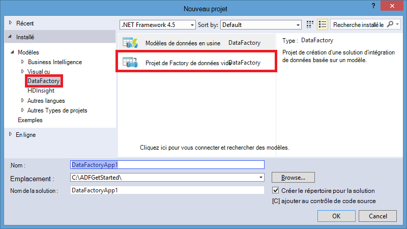

<properties 
    pageTitle="Didacticiel : Créer un pipeline avec une activité de copie à l’aide de Visual Studio | Microsoft Azure" 
    description="Dans ce didacticiel, vous créez un tuyau fabrique de données Azure avec une activité de copie à l’aide de Visual Studio." 
    services="data-factory" 
    documentationCenter="" 
    authors="spelluru" 
    manager="jhubbard" 
    editor="monicar"/>

<tags 
    ms.service="data-factory" 
    ms.workload="data-services" 
    ms.tgt_pltfrm="na" 
    ms.devlang="na" 
    ms.topic="get-started-article" 
    ms.date="10/17/2016" 
    ms.author="spelluru"/>

# Didacticiel : Créer un pipeline avec une activité de copie à l’aide de Visual Studio
> [AZURE.SELECTOR]
- [Vue d’ensemble et des conditions préalables](data-factory-copy-data-from-azure-blob-storage-to-sql-database.md)
- [Assistant copie](data-factory-copy-data-wizard-tutorial.md)
- [Azure portal](data-factory-copy-activity-tutorial-using-azure-portal.md)
- [Visual Studio](data-factory-copy-activity-tutorial-using-visual-studio.md)
- [PowerShell](data-factory-copy-activity-tutorial-using-powershell.md)
- [Modèle de gestionnaire de ressources Azure](data-factory-copy-activity-tutorial-using-azure-resource-manager-template.md)
- [API REST](data-factory-copy-activity-tutorial-using-rest-api.md)
- [API .NET](data-factory-copy-activity-tutorial-using-dotnet-api.md)

Ce didacticiel vous montre comment créer et surveiller une fabrique de données Azure à l’aide de la de Visual Studio. Le pipeline de la fabrique de données utilise une activité de copie pour copier des données depuis le stockage Blob Azure à une base de données de SQL Azure.

Voici les étapes que vous effectuez dans le cadre de ce didacticiel :

1. Créer deux services liés : **AzureStorageLinkedService1** et **AzureSqlinkedService1**. 

    Le AzureStorageLinkedService1 lie un stockage Azure et AzureSqlLinkedService1 des liens à une base de données Azure SQL sur le factory de données : **ADFTutorialDataFactoryVS**. Les données d’entrée pour le pipeline se trouvent dans un conteneur d’objet blob dans le stockage blob Azure et les données de sortie sont stockées dans une table dans la base de données SQL d’Azure. Par conséquent, vous ajoutez ces deux banques de données en tant que services liés à l’usine de données.
2. Créer des groupes de deux données : **InputDataset** et **OutputDataset**, qui représentent les données d’entrée/sortie qui sont stockées dans les banques de données. 

    Pour le InputDataset, vous spécifiez le conteneur d’objet blob qui contient un objet blob avec la source de données. Pour le OutputDataset, vous spécifiez la table SQL qui stocke les données de sortie. Vous également spécifiez d’autres propriétés telles que la structure, de disponibilité et de stratégie.
3. Créer un pipeline nommé **ADFTutorialPipeline** dans le ADFTutorialDataFactoryVS. 

    Le pipeline a une **Activité de copie** copie d’entrée des données à partir de l’Azure BLOB à la table SQL Azure de sortie. L’activité de copie effectue le déplacement des données dans Azure Data Factory. L’activité est alimentée par un service global disponible qui peut copier des données entre différentes banques de données de manière sécurisée, fiable et évolutive. Reportez-vous à l’article [Activités de déplacement des données](data-factory-data-movement-activities.md) pour plus d’informations sur l’activité de copie. 
4. Créer une fabrique de données nommée **VSTutorialFactory**. Déployer le factory de données et toutes les entités de données usine (services liés, les tables et le pipeline).    

## Conditions préalables

1. Lisez l’article de [Vue d’ensemble](data-factory-copy-data-from-azure-blob-storage-to-sql-database.md) et suivez les étapes de la **condition préalable** . 
2. Vous devez être un **administrateur de l’abonnement Azure** pour être en mesure de publier des entités de données fabrique sur le Factory de données Azure.  
3. Vous devez avoir les éléments suivants sur votre ordinateur : 
    - 2013 de Visual Studio ou Visual Studio 2015
    - Télécharger le SDK Azure pour 2013 de Visual Studio ou Visual Studio 2015. Accédez à la [Page de téléchargement d’Azure](https://azure.microsoft.com/downloads/) et cliquez sur **VS 2013** ou **VS 2015** , dans la section **.NET** .
    - Télécharger le plug-in Azure Data Factory plus récent de Visual Studio : [VS 2013](https://visualstudiogallery.msdn.microsoft.com/754d998c-8f92-4aa7-835b-e89c8c954aa5) ou [VS 2015](https://visualstudiogallery.msdn.microsoft.com/371a4cf9-0093-40fa-b7dd-be3c74f49005). Vous pouvez mettre à jour le plug-in en procédant comme suit : dans le menu, cliquez sur **Outils** -> **mises à jour et des Extensions de** -> **en ligne** -> **La galerie Visual Studio** -> **Microsoft d’une fabrique de données Azure Tools pour Visual Studio** -> **mise à jour**.

## Créer le projet de Visual Studio 
1. Lancez **Visual Studio 2013**. Cliquez sur **fichier**, pointez sur **Nouveau**, puis **projet**. Vous devriez voir la boîte de dialogue **Nouveau projet** .  
2. Dans la boîte de dialogue **Nouveau projet** , sélectionnez le modèle de **DataFactory** et cliquez sur le **Projet de la fabrique de données vide**. Si vous ne voyez pas le modèle de DataFactory, fermez Visual Studio Installer Azure SDK pour Visual Studio 2013 et rouvrez Visual Studio.  

    

3. Entrez un **nom** pour le projet, **emplacement**et un nom pour la **solution**, puis cliquez sur **OK**.

     

## Créer des services liés
Services liés lier des magasins de données ou le calculent des services à une usine de données Azure. Consultez les [banques de données pris en charge](data-factory-data-movement-activities.md##supported-data-stores-and-formats) pour toutes les sources et les récepteurs pris en charge par l’activité de copie. Voir [services liés de traitement](data-factory-compute-linked-services.md) pour la liste des services de calcul prises en charge par Data Factory. Dans ce didacticiel, vous n’utilisez pas un service de calcul. 

Dans cette étape, vous créez deux services liés : **AzureStorageLinkedService1** et **AzureSqlLinkedService1**. AzureStorageLinkedService1 lié à des liens de service un compte de stockage Azure et AzureSqlLinkedService des liens à une base de données Azure SQL sur le factory de données : **ADFTutorialDataFactory**. 

### Créer le service de stockage Azure lié

4. Droit de **Services liés** dans l’Explorateur de solutions, pointez sur **Ajouter**et cliquez sur **Nouvel élément**.      
5. Dans la boîte de dialogue **Ajouter un nouvel élément** , sélectionnez **Azure Storage Service lié** à partir de la liste et cliquez sur **Ajouter**. 

    
 
3. Remplacer `<accountname>` et `<accountkey>`* avec le nom de votre compte de stockage Azure et sa clé. 

    

4. Enregistrez le fichier **AzureStorageLinkedService1.json** .

> Pour plus d’informations sur les propriétés JSON, consultez [déplacer des données depuis/vers Azure Blob](data-factory-azure-blob-connector.md#azure-storage-linked-service) .

### Créer le service SQL Azure lié

5. Cliquez à nouveau sur le nœud **Services liés** dans l' **Explorateur de solutions** , pointez sur **Ajouter**et cliquez sur **Nouvel élément**. 
6. Cette fois-ci, sélectionnez **Service lié de SQL Azure**et cliquez sur **Ajouter**. 
7. Dans le **fichier de AzureSqlLinkedService1.json**, remplacez `<servername>`, `<databasename>`, `<username@servername>`, et `<password>` avec le nom de votre serveur Azure SQL, base de données, compte d’utilisateur et mot de passe.    
8.  Enregistrez le fichier **AzureSqlLinkedService1.json** . 

> [AZURE.NOTE]
> Pour plus d’informations sur les propriétés JSON, consultez [déplacer des données depuis/vers des base de données de SQL Azure](data-factory-azure-sql-connector.md#azure-sql-linked-service-properties) .

## Créer des groupes de données
Dans l’étape précédente, vous avez créé des services liés, **AzureStorageLinkedService1** et **AzureSqlLinkedService1** pour lier un compte de stockage Azure et de la base de données de Azure SQL sur le factory de données : **ADFTutorialDataFactory**. Dans cette étape, vous définissez deux groupes de données ( **InputDataset** et **OutputDataset** ) qui représentent les données d’entrée/sortie qui sont stockées dans les banques de données visées respectivement par AzureStorageLinkedService1 et AzureSqlLinkedService1. Pour InputDataset, vous spécifiez le conteneur d’objet blob qui contient un objet blob avec la source de données. Pour OutputDataset, vous spécifiez la table SQL qui stocke les données de sortie.

### Créer le groupe de données d’entrée
Dans cette étape, vous créez un groupe de données nommé **InputDataset** qui pointe vers un conteneur d’objet blob dans le stockage Azure représenté par le service **AzureStorageLinkedService1** lié. Une table est un groupe de données rectangulaire et est le seul type de groupe de données pris en charge actuellement. 

9. Cliquez sur **Tables** dans l' **Explorateur de solutions**, pointez sur **Ajouter**et cliquez sur **Nouvel élément**.
10. Dans la boîte de dialogue **Ajouter un nouvel élément** , sélectionnez **Les Blob Azure**et cliquez sur **Ajouter**.   
10. Remplacer le texte JSON avec le texte suivant et enregistrez le fichier **AzureBlobLocation1.json** . 

        {
          "name": "InputDataset",
          "properties": {
            "structure": [
              {
                "name": "FirstName",
                "type": "String"
              },
              {
                "name": "LastName",
                "type": "String"
              }
            ],
            "type": "AzureBlob",
            "linkedServiceName": "AzureStorageLinkedService1",
            "typeProperties": {
              "folderPath": "adftutorial/",
              "format": {
                "type": "TextFormat",
                "columnDelimiter": ","
              }
            },
            "external": true,
            "availability": {
              "frequency": "Hour",
              "interval": 1
            }
          }
        }

     Notez les points suivants : 
    
    - le groupe de données **type** est définie sur **AzureBlob**.
    - **linkedServiceName** est défini sur **AzureStorageLinkedService**. Vous avez créé ce service lié à l’étape 2.
    - **folderPath** est définie avec le conteneur de **adftutorial** . Vous pouvez également spécifier le nom d’un objet blob dans le dossier à l’aide de la propriété de **nom de fichier** . Étant donné que vous ne spécifiez pas le nom de l’objet blob, les données à partir de tous les objets BLOB dans le conteneur sont considérées comme des données d’entrée.  
    - format de **type** a la valeur **TextFormat**
    - Il y a deux champs dans le fichier texte, **FirstName** et **LastName** , séparé par une virgule (**columnDelimiter**) 
    - La **disponibilité** est définie pour **toutes les heures** (**fréquence** est réglée sur **l’heure** et **l’intervalle** est défini à **1**). Par conséquent, Data Factory recherche les données d’entrée toutes les heures dans le dossier racine du conteneur blob (**adftutorial**) que vous avez spécifié. 
    
    Si vous ne spécifiez pas un **nom de fichier** pour un groupe de données **d’entrée** , tous les fichiers BLOB à partir du dossier d’entrée (**folderPath**) sont considérées comme entrées. Si vous spécifiez un nom de fichier dans le JSON, uniquement le spécifié fichier/blob est considérée comme entrée d’asn.
 
    Si vous ne spécifiez pas de **nom de fichier** pour une **table de sortie**, les fichiers générés dans le **folderPath** sont nommés selon le format suivant : données. &lt;Guid\&gt ;. txt (exemple : Data.0a405f8a-93ff-4c6f-b3be-f69616f1df7a.txt.).

    Pour définir les **folderPath** et dynamiquement en fonction du temps de **SliceStart** de **nom de fichier** , utilisez la propriété **partitionedBy** . Dans l’exemple suivant, folderPath utilise l’année, mois et jour à partir de le SliceStart (heure de début de la section en cours de traitement) et nom de fichier utilise l’heure à partir de la SliceStart. Par exemple, si une tranche est fabriquée pour 2016-09-20T08:00:00, NomDossier est définie à wikidatagateway/wikisampledataout/2016/09/20 et le nom de fichier est définie sur 08.csv. 

            "folderPath": "wikidatagateway/wikisampledataout/{Year}/{Month}/{Day}",
            "fileName": "{Hour}.csv",
            "partitionedBy": 
            [
                { "name": "Year", "value": { "type": "DateTime", "date": "SliceStart", "format": "yyyy" } },
                { "name": "Month", "value": { "type": "DateTime", "date": "SliceStart", "format": "MM" } }, 
                { "name": "Day", "value": { "type": "DateTime", "date": "SliceStart", "format": "dd" } }, 
                { "name": "Hour", "value": { "type": "DateTime", "date": "SliceStart", "format": "hh" } } 

> [AZURE.NOTE]
> Pour plus d’informations sur les propriétés JSON, consultez [déplacer des données depuis/vers Azure Blob](data-factory-azure-blob-connector.md#azure-blob-dataset-type-properties) .

### Créer le dataset de sortie
Dans cette étape, vous créez un dataset de sortie nommé **OutputDataset**. Ce groupe de données pointe vers une table SQL dans la base de données SQL d’Azure représenté par **AzureSqlLinkedService1**. 

11. Avec le bouton droit à nouveau de **Tables** dans l' **Explorateur de solutions** , pointez sur **Ajouter**et cliquez sur **Nouvel élément**.
12. Dans la boîte de dialogue **Ajouter un nouvel élément** , sélectionnez **Les SQL Azure**et cliquez sur **Ajouter**. 
13. Remplacer le texte JSON avec le JSON suivant et enregistrez le fichier **AzureSqlTableLocation1.json** .

        {
          "name": "OutputDataset",
          "properties": {
            "structure": [
              {
                "name": "FirstName",
                "type": "String"
              },
              {
                "name": "LastName",
                "type": "String"
              }
            ],
            "type": "AzureSqlTable",
            "linkedServiceName": "AzureSqlLinkedService1",
            "typeProperties": {
              "tableName": "emp"
            },
            "availability": {
              "frequency": "Hour",
              "interval": 1
            }
          }
        }

     Notez les points suivants : 
    
    - le groupe de données **type** est définie sur **AzureSQLTable**.
    - **linkedServiceName** est défini sur **AzureSqlLinkedService** (vous avez créé ce service lié à l’étape 2).
    - **TableName** est définie sur **emp**.
    - Il existe trois colonnes : **ID**, **FirstName**et **LastName** – dans la table emp dans la base de données. ID est une colonne d’identité, vous devez spécifier ici des seulement **FirstName** et **LastName** .
    - La **disponibilité** est définie pour **toutes les heures** (**fréquence** définie sur **l’heure** et **intervalle** la valeur **1**).  Le service Data Factory génère une tranche de données sortie toutes les heures dans la table **emp** dans la base de données SQL d’Azure.

> [AZURE.NOTE]
> Pour plus d’informations sur les propriétés JSON, consultez [déplacer des données depuis/vers des base de données de SQL Azure](data-factory-azure-sql-connector.md#azure-sql-linked-service-properties) .

## Créer des opportunités 
Vous avez créé des tables et les services d’entrée/sortie liés jusqu'à présent. Maintenant, vous créez un tuyau avec une **Activité de copie** pour copier des données à partir de l’Azure blob à la base de données SQL d’Azure. 

1. Droit des **Pipelines** dans l' **Explorateur de solutions**, pointez sur **Ajouter**et cliquez sur **Nouvel élément**.  
15. Sélectionner le **Pipeline de copie de données** dans la boîte de dialogue **Ajouter un nouvel élément** et cliquez sur **Ajouter**. 
16. Remplacer le JSON avec le JSON suivant et enregistrez le fichier **CopyActivity1.json** .
            
        {
          "name": "ADFTutorialPipeline",
          "properties": {
            "description": "Copy data from a blob to Azure SQL table",
            "activities": [
              {
                "name": "CopyFromBlobToSQL",
                "type": "Copy",
                "inputs": [
                  {
                    "name": "InputDataset"
                  }
                ],
                "outputs": [
                  {
                    "name": "OutputDataset"
                  }
                ],
                "typeProperties": {
                  "source": {
                    "type": "BlobSource"
                  },
                  "sink": {
                    "type": "SqlSink",
                    "writeBatchSize": 10000,
                    "writeBatchTimeout": "60:00:00"
                  }
                },
                "Policy": {
                  "concurrency": 1,
                  "executionPriorityOrder": "NewestFirst",
                  "style": "StartOfInterval",
                  "retry": 0,
                  "timeout": "01:00:00"
                }
              }
            ],
            "start": "2015-07-12T00:00:00Z",
            "end": "2015-07-13T00:00:00Z",
            "isPaused": false
          }
        }

    Notez les points suivants :

    - Dans la section activités, il n'existe qu’une seule activité dont le **type** est définie pour la **copie**.
    - **InputDataset** a la valeur entrée pour l’activité et la sortie de l’activité est définie sur **OutputDataset**.
    - Dans la section **typeProperties** , **BlobSource** est spécifié comme type de source et **SqlSink** est spécifié comme type de récepteurs.

    Remplacez la valeur de la propriété **start** avec la valeur actuelle de jour et à la **fin** avec le jour suivant. Vous pouvez spécifier uniquement la partie de date et ignorer la partie heure de l’heure. Par exemple, « 2016-02-03 », qui est équivalent à « 2016-02-03T00:00:00Z »
    
    Les deux début et dates/heures de fin doivent être au [format ISO](http://en.wikipedia.org/wiki/ISO_8601). Par exemple : 2016-10-14T16:32:41Z. L’heure de **fin** est facultative, mais nous l’utilisons dans ce didacticiel. 
    
    Si vous ne spécifiez pas de valeur pour la propriété **end** , il est calculé en tant que «**début + 48 heures**». Pour exécuter le pipeline indéfiniment, spécifier la valeur de la propriété **end** **9999-09-09** .
    
    Dans l’exemple précédent, il existe des tranches de données 24 chaque tranche de données se produit toutes les heures.

## Publier/déploiement des entités de données usine
Dans cette étape, vous publiez les entités Data Factory (services liés, des groupes de données et pipeline) créé précédemment. Vous spécifiez également le nom de la nouvelle fabrique de données créé pour stocker ces entités.  

18. Cliquez droit sur le projet dans l’Explorateur de solutions, puis cliquez sur **Publier**. 
19. Si vous voyez la boîte de dialogue **se connecter à votre compte Microsoft** , entrez vos informations d’identification pour le compte qui a des abonnement Azure et cliquez sur **connexion**.
20. Vous devriez voir la boîte de dialogue suivante :

    
21. Dans la page de fabrique de données de configuration, procédez comme suit : 
    1. Sélectionnez l’option **Créer nouveau Factory de données** .
    2. Pour **nom**, entrez **VSTutorialFactory** .  
    
        > [AZURE.IMPORTANT]  
        > Le nom de la fabrique de données Azure doit être globalement unique. Si vous recevez un message d’erreur sur le nom de la fabrique de données lors de la publication, modifiez le nom de la fabrique de données (par exemple, yournameVSTutorialFactory) et essayez de publier à nouveau. Voir la rubrique [Data Factory - règles d’appellation](data-factory-naming-rules.md) pour les règles d’affectation de noms pour les artefacts de données usine.     
    3. Sélectionnez votre abonnement Azure pour le champ **abonnement** .
     
        > [AZURE.IMPORTANT]Si vous ne voyez pas les abonnements, vérifiez que vous ouvert une session en utilisant un compte qui est un administrateur ou un co-admin de l’abonnement.  
    4. Sélectionnez le **groupe de ressources** de la fabrique de données à créer. 5. Sélectionnez la **région** de la fabrique de données. Seules les régions pris en charge par le service Factory de données sont affichées dans la liste déroulante.
6. Cliquez sur **suivant** pour passer à la page **Publier des articles** .
    
           
23. Dans la page **Publier les éléments** , assurez-vous que toutes les fabriques de données entités sont sélectionnées et cliquez sur **suivant** pour passer à la page de **Résumé** .
    
         
24. Passez en revue le résumé, puis cliquez sur **suivant** pour démarrer le processus de déploiement et d’afficher l' **État du déploiement**.

    
25. Dans la page **État du déploiement** , vous devez voir le statut du processus de déploiement. Une fois le déploiement terminé, cliquez sur Terminer. 
     Notez les points suivants : 

- Si vous recevez l’erreur : «**cet abonnement n’est pas enregistré pour utiliser l’espace de noms Microsoft.DataFactory**», effectuez l’une des opérations suivantes et recommencez la publication : 

    - Dans Azure PowerShell, exécutez la commande suivante pour enregistrer le fournisseur de données usine. 
        
            Register-AzureRmResourceProvider -ProviderNamespace Microsoft.DataFactory
    
        Vous pouvez exécuter la commande suivante pour vérifier que le Factory de données fournisseur est enregistré. 
    
            Get-AzureRmResourceProvider
    - Connexion à l’aide de l’abonnement Azure dans le [portail Azure](https://portal.azure.com) et accédez à une lame Data Factory (ou) créer une fabrique de données dans le portail Azure. Cette action enregistre automatiquement le fournisseur pour vous.
-   Le nom de la fabrique de données peut être enregistré sous la forme d’un nom DNS à l’avenir et, par conséquent, devenir visible publiquement.

> [AZURE.IMPORTANT] Pour créer des instances de la fabrique de données, vous devez être un administrateur/co-admin de l’abonnement Azure

## Résumé
Dans ce didacticiel, vous avez créé une fabrique de données Azure pour copier des données à partir d’un Azure blob dans une base de données Azure SQL. Visual Studio vous permet de créer l’usine de données, services liés, des groupes de données et un tuyau. Voici les principales étapes que vous avez effectuées dans ce didacticiel :  

1.  Permet de créer une **fabrique de données**d' Azure.
2.  Permet de créer des **services liés**:
    1. Un service de **Stockage Azure** lié à lier votre compte de stockage Azure qui contient les données d’entrée.    
    2. Un service **Azure SQL** lié pour lier votre base de données Azure SQL qui contient les données de sortie. 
3.  Créer **des groupes de données**, qui décrivent les données d’entrée et sortie des pipelines.
4.  Créé un **pipeline** avec une **Activité de copie** avec **BlobSource** comme source et **SqlSink** en tant que récepteur. 

## Explorateur de serveurs permet d’afficher les références de données

1. Dans **Visual Studio**, cliquez sur **affichage** dans le menu, puis cliquez sur **Explorateur de serveurs**.
2. Dans la fenêtre de l’Explorateur de serveurs, développez **Azure** et **Data Factory**. Si vous consultez **se connecter à Visual Studio**, entrez le **compte** associé à votre abonnement Azure et cliquez sur **Continuer**. Entrez le **mot de passe**, puis cliquez sur **se connecter**. Visual Studio essaie d’obtenir des informations sur toutes les fabriques de données Azure dans votre abonnement. Vous consultez l’état de cette opération dans la fenêtre **Liste des tâches données en usine** .
    
3. Vous pouvez avec le bouton droit sur une fabrique de données et sélectionnez Exporter données fabrique de nouveau projet pour créer un projet Visual Studio basé sur une fabrique de données existant.
      

## Les outils de Data Factory de mises à jour pour Visual Studio
Pour mettre à jour des outils de l’usine de données Azure pour Visual Studio, procédez comme suit :

1. Cliquez sur **Outils** dans le menu, puis sélectionnez les **mises à jour et des Extensions**. 
2. Sélectionnez les **mises à jour** dans le volet gauche, puis sélectionnez **La galerie Visual Studio**.
4. Sélectionnez **Outils Azure Data Factory pour Visual Studio** , puis cliquez sur **mise à jour**. Si vous ne voyez pas cette entrée, vous avez déjà la dernière version des outils. 

Pour obtenir des instructions sur l’utilisation du portail Azure pour surveiller le pipeline et les groupes de données que vous avez créé dans ce didacticiel, consultez [pipeline et moniteur de groupes de données](data-factory-copy-activity-tutorial-using-azure-portal.md#monitor-pipeline) .

## Voir aussi
| Rubrique | Description |
| :---- | :---- |
| [Activités de déplacement des données](data-factory-data-movement-activities.md) | Cet article fournit des informations détaillées sur l’activité de copie que vous avez utilisé dans le didacticiel. |
| [Planification et exécution](data-factory-scheduling-and-execution.md) | Cet article explique les aspects de la planification et l’exécution du modèle d’application Azure Data Factory. |
| [Pipelines](data-factory-create-pipelines.md) | Cet article vous aide à comprendre les pipelines et les activités dans Azure Data Factory |
| [Groupes de données](data-factory-create-datasets.md) | Cet article vous aide à comprendre les groupes de données dans Azure Data Factory.
| [Surveiller et gérer les pipelines à l’aide de la surveillance de l’application](data-factory-monitor-manage-app.md) | Cet article décrit comment faire pour contrôler, gérer et déboguer des pipelines à l’aide du contrôle et application de gestion. 
