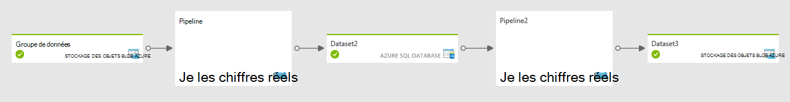

<properties 
    pageTitle="Créer/planifier des Pipelines, d’enchaîner les activités dans l’usine de données | Microsoft Azure" 
    description="Apprenez à créer un pipeline de données dans Azure Data Factory pour déplacer et transformer des données. Créer un flux de travail contrôlée par les données pour produire prêt à utiliser les informations." 
    keywords="pipeline de données, données par flux de travail"
    services="data-factory" 
    documentationCenter="" 
    authors="sharonlo101" 
    manager="jhubbard" 
    editor="monicar"/>

<tags 
    ms.service="data-factory" 
    ms.workload="data-services" 
    ms.tgt_pltfrm="na" 
    ms.devlang="na" 
    ms.topic="article"
    ms.date="09/12/2016" 
    ms.author="shlo"/>

# Pipelines et les activités dans l’usine de données Azure
Cet article vous aide à comprendre les pipelines et les activités dans Azure Data Factory et les utiliser pour construire de bout en bout orientées données des flux de travail pour vos déplacements de données et les scénarios de traitement de données.  

> [AZURE.NOTE] Cet article suppose que vous avez parcouru [l’Introduction sur le Factory de données Azure](data-factory-introduction.md). Si vous n’avez pas les exercices-sur-expérience de création de données permettraient de fabriques de parcourir le didacticiel de [Création de votre première fabrique de données](data-factory-build-your-first-pipeline.md) vous comprenez cet article mieux.  

## Quel est un pipeline de données ?
**Pipeline** est un regroupement logique des **activités**. Il est utilisé pour les activités de groupe dans une unité qui effectue une tâche. Pour comprendre mieux les pipelines, vous devez comprendre une activité tout d’abord. 

## Ce qu’est une activité ?
Activités de définissent les actions à effectuer sur vos données. Chaque activité est zéro, un ou plusieurs [groupes de données](data-factory-create-datasets.md) en tant qu’entrées et génère un ou plusieurs groupes de données en tant que sortie. 

Par exemple, vous pouvez utiliser une activité de copie pour orchestrer la copie de données à partir d’un magasin de données vers une autre banque de données. De même, vous pouvez utiliser une activité HDInsight ruche pour exécuter une requête de ruche sur un cluster Azure HDInsight pour transformer vos données. Usine de données Azure fournit un large éventail de [transformation de données](data-factory-data-transformation-activities.md)et les activités de [déplacement des données](data-factory-data-movement-activities.md) . Vous pouvez également choisir de créer une activité personnalisée de .NET pour exécuter votre propre code. 

## Pipeline de copie d’exemple
Dans le pipeline d’exemple suivante, il existe une activité de type **copie** dans la section **activités** . Dans cet exemple, l' [activité de copier](data-factory-data-movement-activities.md) copie les données à partir d’un stockage Azure Blob dans une base de données Azure SQL. 

    {
      "name": "CopyPipeline",
      "properties": {
        "description": "Copy data from a blob to Azure SQL table",
        "activities": [
          {
            "name": "CopyFromBlobToSQL",
            "type": "Copy",
            "inputs": [
              {
                "name": "InputDataset"
              }
            ],
            "outputs": [
              {
                "name": "OutputDataset"
              }
            ],
            "typeProperties": {
              "source": {
                "type": "BlobSource"
              },
              "sink": {
                "type": "SqlSink",
                "writeBatchSize": 10000,
                "writeBatchTimeout": "60:00:00"
              }
            },
            "Policy": {
              "concurrency": 1,
              "executionPriorityOrder": "NewestFirst",
              "retry": 0,
              "timeout": "01:00:00"
            }
          }
        ],
        "start": "2016-07-12T00:00:00Z",
        "end": "2016-07-13T00:00:00Z"
      }
    } 

Notez les points suivants :

- Dans la section activités, il n'existe qu’une seule activité dont le **type** est définie pour la **copie**.
- **InputDataset** a la valeur entrée pour l’activité et la sortie de l’activité est définie sur **OutputDataset**.
- Dans la section **typeProperties** , **BlobSource** est spécifié comme type de source et **SqlSink** est spécifié comme type de récepteurs.

Pour une procédure complète de création de ce pipeline, consultez [didacticiel : copier des données depuis le stockage Blob à SQL de base de données](data-factory-copy-data-from-azure-blob-storage-to-sql-database.md). 

## Pipeline de transformation d’exemple
Dans le pipeline d’exemple suivante, il existe une activité de type **HDInsightHive** dans la section **activités** . Dans cet exemple, l' [activité de la ruche de HDInsight](data-factory-hive-activity.md) transforme les données d’un stockage Azure Blob en exécutant un fichier de script de ruche sur un cluster Azure HDInsight Hadoop. 

    {
        "name": "TransformPipeline",
        "properties": {
            "description": "My first Azure Data Factory pipeline",
            "activities": [
                {
                    "type": "HDInsightHive",
                    "typeProperties": {
                        "scriptPath": "adfgetstarted/script/partitionweblogs.hql",
                        "scriptLinkedService": "AzureStorageLinkedService",
                        "defines": {
                            "inputtable": "wasb://adfgetstarted@<storageaccountname>.blob.core.windows.net/inputdata",
                            "partitionedtable": "wasb://adfgetstarted@<storageaccountname>.blob.core.windows.net/partitioneddata"
                        }
                    },
                    "inputs": [
                        {
                            "name": "AzureBlobInput"
                        }
                    ],
                    "outputs": [
                        {
                            "name": "AzureBlobOutput"
                        }
                    ],
                    "policy": {
                        "concurrency": 1,
                        "retry": 3
                    },
                    "scheduler": {
                        "frequency": "Month",
                        "interval": 1
                    },
                    "name": "RunSampleHiveActivity",
                    "linkedServiceName": "HDInsightOnDemandLinkedService"
                }
            ],
            "start": "2016-04-01T00:00:00Z",
            "end": "2016-04-02T00:00:00Z",
            "isPaused": false
        }
    }

Notez les points suivants : 

- Dans la section activités, il n'existe qu’une seule activité dont le **type** est défini sur **HDInsightHive**.
- Le fichier de script de ruche, **partitionweblogs.hql**, est stocké dans le compte de stockage Azure (spécifié par la scriptLinkedService, appelée **AzureStorageLinkedService**) et dans le dossier de **scripts** dans conteneur **adfgetstarted**.
- La section **définit** est utilisée pour spécifier les paramètres d’exécution qui sont transmis au script ruche en tant que valeurs de configuration de ruche (par exemple : ${hiveconf : inputtable}, ${hiveconf:partitionedtable}).

Pour une procédure complète de création de ce pipeline, consultez [didacticiel : créer votre premier pipeline pour traiter des données à l’aide d’Hadoop cluster](data-factory-build-your-first-pipeline.md). 

## Chaînage des activités
Si vous avez plusieurs activités dans un pipeline, et la sortie d’une activité n’est pas une entrée d’une autre activité, les activités peuvent s’exécuter en parallèle si les tranches de données d’entrée pour les activités sont prêts. 

Vous pouvez chaîner des deux activités en ayant le dataset de sortie d’une activité en tant que le jeu de données d’entrée de l’autre activité. Les activités peuvent être dans le même tuyau ou de pipelines différentes. La deuxième activité s’exécute uniquement lorsque le se termine correctement. 

Par exemple, prenons le cas suivant :
 
1.  P1 de pipeline a A1 activité qui requiert un dataset d’entrée externe D1 et produire le dataset de **sortie** **D2**.
2.  Pipeline P2 a A2 activité qui exige **d’entrée** à partir de dataset **D2**et produit le dataset de sortie D3.
 
Dans ce scénario, l’activité A1 s’exécute lorsque les données externes soient disponibles et que la fréquence de disponibilité programmée est atteinte.  L’activité A2 s’exécute lorsque les tranches de planifié à partir de D2 deviennent disponibles et la fréquence de disponibilité programmée est atteinte. S’il existe une erreur dans un des secteurs de dataset D2, A2 ne s’exécute pas pour ce secteur jusqu'à ce qu’il devienne disponible.

Affichage de diagramme :

Affichage de tâches avec les deux activités dans le même tuyau : 

Pour plus d’informations, consultez [planification et l’exécution](#chaining-activities). 

## Planification et exécution
Jusqu'à présent vous avez bien compris quelles sont les activités et les pipelines. Vous avez étudié également comment ils sont définis et un haut niveau des activités dans Azure Data Factory. Maintenant Examinons comment elles sont exécutées. 

Un pipeline est actif uniquement entre son heure de début et de fin. Il n’est pas exécutée avant l’heure de début ou après l’heure de fin. Si le tuyau est suspendu, elle ne sont pas exécutée, quel que soit son heure de début et de fin. Pour un pipeline à s’exécuter, il ne doit pas être suspendu. En fait, il n’est pas le pipeline est exécuté. Il s’agit d’activités sont exécutées dans le pipeline. Toutefois leur faire dans le contexte général du pipeline. 

Reportez-vous à la section [de planification et de l’exécution](data-factory-scheduling-and-execution.md) pour comprendre le fonctionnement de la planification et l’exécution dans Azure Data Factory.

## Créer des pipelines
Usine de données Azure fournit différents mécanismes pour créer et déployer des pipelines (qui à leur tour, contiennent une ou plusieurs des activités qu’il contient). 

### À l’aide du portail Azure
Éditeur de Data Factory dans Azure portal vous permet de créer un pipeline. Pour une procédure pas à pas de bout en bout, consultez [mise en route avec Azure Data Factory (éditeur de fabrique de données)](data-factory-build-your-first-pipeline-using-editor.md) . 

### À l’aide de Visual Studio 
Vous pouvez utiliser Visual Studio pour créer et déployer des pipelines sur Azure Data Factory. Pour une procédure pas à pas de bout en bout, consultez [mise en route avec Azure Data Factory (Visual Studio)](data-factory-build-your-first-pipeline-using-vs.md) . 

### À l’aide de PowerShell Azure
Vous pouvez utiliser PowerShell Azure pour créer des pipelines dans Azure Data Factory. Par exemple, vous avez défini le pipeline JSON dans un fichier au c:\DPWikisample.json. Vous pouvez le télécharger à votre instance Azure Data Factory comme indiqué dans l’exemple suivant :

    New-AzureRmDataFactoryPipeline -ResourceGroupName ADF -Name DPWikisample -DataFactoryName wikiADF -File c:\DPWikisample.json

Pour une procédure pas à pas de bout en bout pour la création d’une fabrique de données avec un pipeline, consultez [mise en route avec Azure Data Factory (Azure PowerShell)](data-factory-build-your-first-pipeline-using-powershell.md) . 

### À l’aide du Kit de développement .NET
Vous pouvez créer et déployer trop de pipeline via le Kit de développement .NET. Ce mécanisme peut être utilisé pour créer par programme des pipelines. Pour plus d’informations, voir [créer, gérer et surveiller des fabriques de données par programme](data-factory-create-data-factories-programmatically.md). 

### À l’aide du modèle de gestionnaire de ressources Azure
Vous pouvez créer et déployer le pipeline à l’aide d’un modèle de gestionnaire de ressources Azure. Pour plus d’informations, consultez [mise en route avec Azure Data Factory (responsable de ressources Azure)](data-factory-build-your-first-pipeline-using-arm.md). 

### À l’aide des API REST
Vous pouvez créer et déployer le pipeline à l’aide des API de reste trop. Ce mécanisme peut être utilisé pour créer par programme des pipelines. Pour plus d’informations, voir [créer ou mettre à jour un Pipeline](https://msdn.microsoft.com/library/azure/dn906741.aspx). 

## Surveiller et gérer les pipelines  
Une fois un pipeline est déployé, vous pouvez gérer et surveiller des pipelines, des tranches et des séries. En savoir plus sur ce sujet : [surveiller et gérer les Pipelines](data-factory-monitor-manage-pipelines.md).

## Pipeline JSON   
Nous analyserons plus sur la manière dont un pipeline est défini au format JSON. La structure générique d’un pipeline se présente comme suit :

    {
        "name": "PipelineName",
        "properties": 
        {
            "description" : "pipeline description",
            "activities":
            [
    
            ],
            "start": "<start date-time>",
            "end": "<end date-time>"
        }
    }

La section **activités** peut avoir une ou plusieurs des activités définies au sein de celui-ci. Chaque activité possède la structure de niveau supérieur suivante :

    {
        "name": "ActivityName",
        "description": "description", 
        "type": "<ActivityType>",
        "inputs":  "[]",
        "outputs":  "[]",
        "linkedServiceName": "MyLinkedService",
        "typeProperties":
        {
    
        },
        "policy":
        {
        }
        "scheduler":
        {
        }
    }

Tableau suivant décrivent les propriétés dans les définitions de JSON d’activité et de pipeline :

Balise | Description | Obligatoire
--- | ----------- | --------
nom | Nom de l’activité ou le pipeline. Spécifiez un nom qui représente l’action que l’activité ou le pipeline est configuré pour faire <ul><li>Nombre maximal de caractères : 260</li><li>Doit commencer par un numéro de la lettre ou un trait de soulignement (_)</li><li>Caractères suivants ne sont pas autorisées : «. », « + », « ? », « / », « < «, » > », "* », « % », « & », » : «, »\\"</li></ul> | Oui
Description | Texte décrivant l’activité ou pipeline est utilisé pour | Oui
type de | Spécifie le type de l’activité. Consultez les articles [d’Activités de déplacement des données](data-factory-data-movement-activities.md) et des [Activités de Transformation des données](data-factory-data-transformation-activities.md) pour différents types d’activités. | Oui
entrées | Tables d’entrée utilisés par l’activité  une table d’entrée « inputs » : [{« nom » : « inputtable1 »}],  deux tables d’entrée  « inputs » : [{« nom » : « inputtable1 »}, {« nom » : « inputtable2 »}], | Oui
sorties | Tables de sortie utilisés par la table de sortie une activity.// « produit » : [{« nom » : « outputtable1 »}],  deux tables de sortie « produit » : [{« nom » : « outputtable1 »}, {« nom » : « outputtable2 »}], | Oui
linkedServiceName | Nom du service lié utilisé par l’activité.   Une activité peut nécessiter que vous spécifiez le service lié qui est lié à l’environnement de calcul requis. | Oui pour les activités HDInsight et Azure lot notation activité de formation   Non pour tous les autres
typeProperties | Propriétés de la section typeProperties dépendent du type de l’activité. | N°
stratégie de | Stratégies qui affectent le comportement au moment de l’exécution de l’activité. S’il n’est pas spécifié, les stratégies par défaut sont utilisés. | N°
début | Date-heure de début pour le pipeline. Doit être au [format ISO](http://en.wikipedia.org/wiki/ISO_8601). Par exemple : 2014-10-14T16:32:41Z.   Il est possible de spécifier une heure locale, par exemple un temps estimé. Voici un exemple : « 2016-02-27T06:00:00**-05:00**», qui est de 6 AM EST.  Ensemble, les propriétés start et end indiquent la période active de la tuyauterie. Tranches de sortie sont uniquement produites avec cette période active. | N°  Si vous spécifiez une valeur pour la propriété end, vous devez spécifier la valeur de la propriété start.  Les heures de début et de fin peuvent être vides pour créer une opportunité. Vous devez spécifier des valeurs pour définir une période active pour le pipeline exécuter. Si vous ne spécifiez pas d’heures de début et de fin lors de la création d’un tuyau, vous pouvez les définir à l’aide de l’applet de commande Set-AzureRmDataFactoryPipelineActivePeriod plus tard.
fin | Date-heure de fin pour le pipeline. Si spécifié doit être au format ISO. Par exemple : 2014-10-14T17:32:41Z   Il est possible de spécifier une heure locale, par exemple un temps estimé. Voici un exemple : « 2016-02-27T06:00:00**-05:00**», qui est de 6 AM EST.  Pour exécuter le pipeline indéfiniment, spécifier la valeur de la propriété end 9999-09-09. | N°   Si vous spécifiez une valeur pour la propriété start, vous devez spécifier la valeur de la propriété end.  Consultez les notes de la propriété **start** .
isPaused | Si la valeur true, le pipeline ne s’exécute pas. Valeur par défaut = false. Vous pouvez utiliser cette propriété pour activer ou désactiver. | N° 
Planificateur | propriété de « planificateur » est utilisée pour définir une planification souhaitée pour l’activité. Ses sous-propriétés sont les mêmes que ceux de la [propriété de disponibilité dans un groupe de données](data-factory-create-datasets.md#Availability). | N° |   
| pipelineMode | Le mode de planification s’exécute pour le pipeline. Valeurs autorisées sont : planifié (par défaut), unique.  « Planifié » indique que le pipeline s’exécute selon un intervalle de temps spécifié en fonction de sa période active (heure de début et de fin). « Unique » indique que le pipeline s’exécute une seule fois. Les pipelines unique une fois créés ne peut pas être modifié ou mis à jour actuellement. Pour plus d’informations sur la configuration unique, reportez-vous à la section [Onetime pipeline](data-factory-scheduling-and-execution.md#onetime-pipeline) . | N° | 
| expirationTime | Durée de temps après leur création, pour laquelle le pipeline est valide et doit être mis en service. Si elle n’a pas tout actif, échec, ou en attente d’exécution, le pipeline est supprimé automatiquement une fois qu’il atteint le délai d’expiration. | N° | 
| groupes de données | Liste des groupes de données à utiliser par les activités définies dans le pipeline. Cette propriété peut être utilisée pour définir des groupes de données qui sont spécifiques à ce pipeline et non définies par la fabrique de données. Groupes de données définies dans ce pipeline peut uniquement être utilisé par ce pipeline et ne peuvent pas être partagés. Pour plus d’informations, consultez [groupes de données inclus dans l’étendue](data-factory-create-datasets.md#scoped-datasets) .| N° |  
 

### Stratégies de
Stratégies affectent le comportement au moment de l’exécution d’une activité, en particulier lors du traitement de la tranche d’une table. Le tableau suivant fournit les détails.

Propriété | Valeurs autorisées | Valeur par défaut | Description
-------- | ----------- | -------------- | ---------------
concurrence d’accès | Nombre entier   Valeur maximale : 10 | 1 | Nombre d’exécutions simultanées de l’activité.  Il détermine le nombre d’exécutions d’une activité parallèle qui peut se produire sur les différentes sections. Par exemple, si une activité doit passer par un grand ensemble de données disponibles, ayant une plus grande valeur d’accès concurrentiel accélère le traitement des données. 
executionPriorityOrder | NewestFirst  OldestFirst | OldestFirst | Détermine l’ordre des tranches de données qui sont en cours de traitement.  Par exemple, si vous avez 2 tranches (une situation à 4 heures et l’autre à 5 h), et les deux sont en attente d’exécution. Si vous définissez l’executionPriorityOrder à NewestFirst, la tranche à 17 h 00 est traitée en premier. De la même façon si vous définissez l’executionPriorityORder être OldestFIrst, la tranche à 16 h 00 est traitée. 
nouvelle tentative | Nombre entier  Valeur maximale peut être 10 | 3 | Nombre de tentatives avant que le traitement des données de la tranche est marqué comme échec. L’exécution d’activités pour une tranche de données est répétée jusqu'à ce nombre de tentatives spécifié. La nouvelle tentative est effectuée dès que possible après la défaillance.
délai d’attente | TimeSpan | 00:00:00 | Délai d’expiration de l’activité. Exemple : 00:10:00 (implique le délai d’attente de 10 minutes)  Si une valeur n’est pas spécifiée ou a la valeur 0, le délai d’attente est infinie.  Si la durée de traitement de données sur une tranche dépasse la valeur de délai d’attente, elle est annulée, et le système tente de relancer le traitement. Le nombre de tentatives dépend de la propriété de nouvelle tentative. Lorsque le délai d’attente se produit, le statut est défini sur TimedOut.
délai | TimeSpan | 00:00:00 | Spécifier le délai avant le traitement des données de démarrage de la tranche.  L’exécution de l’activité pour une tranche de données est démarrée après que le délai est au-delà de la durée d’exécution prévue.  Exemple : 00:10:00 (implique le délai de 10 minutes)
longRetry | Nombre entier  Valeur maximale : 10 | 1 | Le nombre de tentatives de temps avant l’échec de l’exécution de la tranche.  tentatives de longRetry sont espacées par longRetryInterval. Ainsi, si vous souhaitez spécifier un délai entre les tentatives de connexion, utilisez longRetry. Si les nouvelles tentatives et longRetry sont spécifiés, chaque tentative de longRetry inclut de nouvelles tentatives et le nombre maximal de tentatives est réessayer * longRetry.  Par exemple, si nous avons les paramètres suivants dans la stratégie de l’activité : Nouvelle tentative : 3 longRetry : 2 longRetryInterval : 01:00:00  Supposons qu’il existe un seul secteur d’exécution (l’état est en attente) et l’exécution de l’activité échoue à chaque fois. Au départ il y aura 3 tentatives consécutives de l’exécution. Après chaque tentative, l’état de la tranche est réessayer. Une fois les 3 premières tentatives sur, l’état de la tranche est LongRetry.  Après une heure (autrement dit, valeur du longRetryInteval), il y aura un autre ensemble de 3 tentatives consécutives de l’exécution. Après cela, le statut de la tranche doit être a échoué et aucune nouvelle tentative ne doit être tentée. Par conséquent, global 6 tentatives ont été effectuées.  Si toute exécution réussit, l’état de la tranche est prêt et pas plusieurs tentatives.  longRetry peut être utilisé dans les situations où les données dépendantes arrivent à des moments non déterministe ou l’environnement global est douteux dans le traitement des données se produit. Dans ce cas, tentatives un après l’autre ne permettront pas de faire et cela après un intervalle de temps produit le résultat souhaité.  Mise en garde : ne définissez pas de valeurs élevées pour longRetry ou longRetryInterval. En général, des valeurs plus élevées impliquent des autres problèmes d’ordre systémique. 
longRetryInterval | TimeSpan | 00:00:00 | Le délai entre les tentatives de long 

## Étapes suivantes

- Comprendre la [planification et l’exécution dans Azure Data Factory](data-factory-scheduling-and-execution.md).  
- En savoir plus sur les [fonctions de transformation de données](data-factory-data-transformation-activities.md) dans Azure Data Factory et le [déplacement des données](data-factory-data-movement-activities.md)
- Comprendre la [gestion et la surveillance dans Azure Data Factory](data-factory-monitor-manage-pipelines.md).
- [Générer et déployer votre pipeline de main fermée](data-factory-build-your-first-pipeline.md). 
