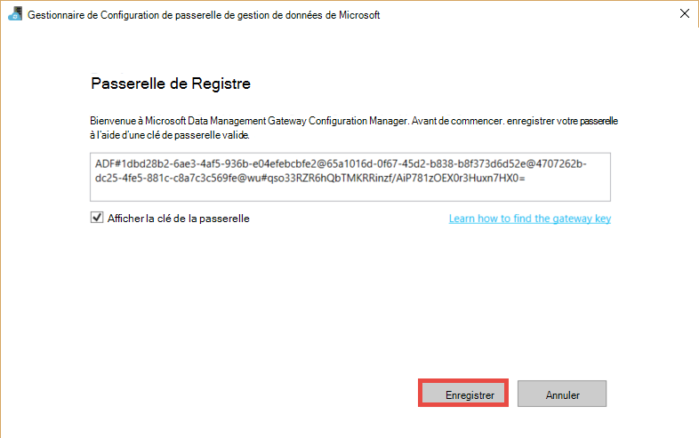

<properties 
    pageTitle="Passerelle de gestion des données de fabrique de données | Microsoft Azure"
    description="Configurer une passerelle de données pour déplacer les données entre local et le nuage. Utiliser la passerelle de gestion des données dans Azure Data Factory pour déplacer vos données." 
    services="data-factory" 
    documentationCenter="" 
    authors="linda33wj" 
    manager="jhubbard" 
    editor="monicar"/>

<tags 
    ms.service="data-factory" 
    ms.workload="data-services" 
    ms.tgt_pltfrm="na" 
    ms.devlang="na" 
    ms.topic="article" 
    ms.date="10/11/2016" 
    ms.author="jingwang"/>

# Passerelle de gestion des données
La passerelle de gestion des données est un agent de client que vous devez installer dans votre environnement local pour copier des données entre les magasins de données nuage et sur site. Les banques de données locales pris en charge par l’usine de données sont répertoriées dans la section [sources de données prises en charge](data-factory-data-movement-activities.md##supported-data-stores) . 

> [AZURE.NOTE] Actuellement, passerelle prend en charge uniquement l’activité de la copie et l’activité de la procédure stockée dans une usine de données. Il n’est pas possible d’utiliser la passerelle d’une activité personnalisée pour accéder aux sources de données sur site. 

Cet article vient compléter la procédure pas à pas dans le [déplacer des données entre des locaux et cloud des magasins de données](data-factory-move-data-between-onprem-and-cloud.md) l’article. Dans la procédure pas à pas, vous créez un pipeline qui utilise la passerelle pour déplacer des données à partir d’une base de données de SQL Server sur site vers un blob Azure. Cet article fournit des informations détaillées sur la passerelle de gestion des données.   

## Vue d’ensemble

### Fonctionnalités de la passerelle de gestion des données
Passerelle de gestion des données offre les fonctions suivantes :

- Modèle sur site les sources de données et sources de données de nuage au sein des même usine et déplacement de données.
- Comporte un seul volet de verre pour la surveillance et la gestion de la visibilité sur l’état de la passerelle du serveur lame Data Factory.
- Gérer l’accès aux sources de données sur site en toute sécurité.
    - Aucune modification n’est requise pour le pare-feu de l’entreprise. Passerelle permet uniquement les connexions HTTP sortantes pour ouvrir internet.
    - Crypter les informations d’identification pour vos magasins de données local avec votre certificat.
- Déplacer efficacement des données – les données sont transférées en parallèle, les problèmes de réseau résistants aux intermittents avec auto réessayer logique.

### Flux de commande et flux de données
Lorsque vous utilisez une activité de copie pour copier des données entre des locaux et cloud, l’activité utilise une passerelle pour transférer des données à partir de la source de données sur site vers le nuage et vice versa.

Les données de haut niveau icies flux et récapitulatif des étapes pour la copie à une passerelle de données : 

1.  Développeur de données crée une passerelle pour une fabrique de données Azure à l’aide de [l’Applet de commande PowerShell](https://msdn.microsoft.com/library/dn820234.aspx)ou [Azure portal](https://portal.azure.com) . 
2.  Développeur de données crée un service lié à un magasin de données local en spécifiant la passerelle. Dans le cadre de la configuration du service lié, développeur de données utilise l’application d’informations d’identification du paramètre pour spécifier des informations d’identification et les types d’authentification.  La boîte de dialogue informations d’identification du paramètre application communique avec le magasin de données pour tester la connexion et la passerelle pour enregistrer les informations d’identification.
3. Passerelle crypte les informations d’identification avec le certificat associé à la passerelle (fournie par le développeur de données), avant d’enregistrer les informations d’identification dans le nuage.
4. Service de fabrique de données communique avec la passerelle pour la planification et la gestion des travaux à l’aide d’un canal de contrôle qui utilise une file d’attente de bus de services Azure. Lorsqu’une tâche d’activité de copie doit être lancée, usine de données files d’attente de la demande ainsi que des informations d’identification. Passerelle lance la tâche après l’interrogation de la file d’attente.
5.  La passerelle décrypte les informations d’identification avec le même certificat et se connecte ensuite à la banque de données locale avec le type d’authentification approprié et les informations d’identification.
6.  La passerelle copie les données d’un magasin local vers un stockage en nuage, et inversement en fonction de la configuration de l’activité de copie dans le pipeline de données. Pour cette étape, la passerelle communique directement avec les services de stockage basé sur le cloud tels que le stockage Blob Azure sur un un canal sécurisé (HTTPS).

### Considérations sur l’utilisation de passerelle
- Une instance unique de la passerelle de gestion des données peut être utilisée pour plusieurs sources de données sur site. Toutefois, **une instance de passerelle unique est liée à une seule usine de données Azure** et ne peut pas être partagée avec une autre usine de données.
- Vous pouvez avoir **une seule instance de passerelle de gestion des données** est installé sur un seul ordinateur. Supposons que vous disposez de deux usines de données qui ont besoin d’accéder aux sources de données sur site, vous devez installer des passerelles sur deux ordinateurs locaux. En d’autres termes, une passerelle est liée à une fabrique de données spécifiques
- La **passerelle n’a pas besoin d’être sur le même ordinateur que la source de données**. Toutefois, gateway plus près de la source de données réduit le temps de la passerelle pour se connecter à la source de données. Nous vous conseillons d’installer la passerelle sur un ordinateur qui est différent de celui qui héberge la source de données sur site. Lorsque la source de données et de la passerelle sont sur des ordinateurs différents, la passerelle ne concurrence pas des ressources avec la source de données.
- Vous pouvez avoir **plusieurs passerelles sur différentes machines se connectant à la même source de données sur site**. Par exemple, vous pouvez avoir deux passerelles desservant deux usines de données, mais la même source de données sur site est enregistrée avec à la fois les fabriques de données.
- Si vous disposez déjà d’une passerelle installée sur votre ordinateur desservant un scénario **d’Analyse Décisionnelle de puissance** , installer une **passerelle distinct pour Azure Data Factory** sur un autre ordinateur.
- Passerelle doit être utilisée même lorsque vous utilisez **ExpressRoute**.
- Traiter votre source de données comme source de données sur site (qui se trouve derrière un pare-feu) même lorsque vous utilisez **ExpressRoute**. Utiliser la passerelle pour établir la connectivité entre le service et la source de données.
- Vous devez **utiliser la passerelle** même si le magasin de données est dans le nuage sur un **Ordinateur virtuel IaaS de Azure**. 

## Installation

### Conditions préalables
- Les versions de **système d’exploitation** pris en charge sont Windows 7, Windows 8/8.1, 10 de Windows, Windows Server 2008 R2, Windows Server 2012, Windows Server 2012 R2. Installation de la passerelle de gestion des données sur un contrôleur de domaine n’est actuellement pas pris en charge.
- .NET Framework 4.5.1 ou version ultérieure est requis. Si vous installez la passerelle sur un ordinateur Windows 7, installez.NET Framework 4.5 ou version ultérieure. Pour plus d’informations, reportez-vous à la section [Configuration requise du.NET Framework](https://msdn.microsoft.com/library/8z6watww.aspx) . 
- La **configuration** de recommandée pour l’ordinateur de la passerelle est au moins de 2 GHz, 4 cœurs, 8 Go de mémoire vive et le disque de 80 Go.
- Si l’ordinateur hôte en veille prolongée, la passerelle ne répond pas aux requêtes de données. Par conséquent, configurer **plan d’alimentation** approprié sur l’ordinateur avant d’installer la passerelle. Si l’ordinateur est configuré pour la mise en veille prolongée, l’installation de la passerelle vous demande un message.
- Vous devez être un administrateur sur la machine pour installer et configurer la passerelle de gestion des données avec succès. Vous pouvez ajouter des utilisateurs au groupe local Windows **Utilisateurs de passerelle de gestion des données** . Les membres de ce groupe sont en mesure d’utiliser l’outil Gestionnaire de Configuration de passerelle de gestion des données de configuration de la passerelle. 

Comme l’exécution d’activité copie se produire sur une fréquence spécifique, l’utilisation des ressources (processeur, mémoire) sur la machine également respecte la même avec un pic et de temps d’inactivité. L’utilisation des ressources également tributaire de la quantité de données déplacées. Lorsque plusieurs tâches sont en cours, consultez Utilisation des ressources remonter pendant les heures de pointe. 

### Options d’installation
Passerelle de gestion des données peut être installée dans l’une des manières suivantes : 

- L’installation en téléchargeant un fichier MSI à partir du [Centre de téléchargement Microsoft](https://www.microsoft.com/download/details.aspx?id=39717).  Le fichier MSI peut également servir à la mise à niveau de la passerelle de gestion des données existantes à la version la plus récente, avec tous les paramètres sont conservés.
- En cliquant sur les liens de **téléchargement et installation de la passerelle de données** sous Configuration manuelle ou **l’installer directement sur cet ordinateur** sous le programme d’installation EXPRESS. Voir article de [déplacer des données entre des locaux et cloud](data-factory-move-data-between-onprem-and-cloud.md) pour des instructions détaillées sur l’utilisation de l’installation rapide. L’étape manuelle permet d’atteindre le centre de téléchargement.  Les instructions de téléchargement et d’installation de la passerelle à partir du centre de téléchargement sont dans la section suivante. 

### Meilleures pratiques de l’installation :
1.  Configurer le plan d’alimentation sur l’ordinateur hôte de la passerelle afin que l’ordinateur ne pas mise en veille prolongée. Si l’ordinateur hôte en veille prolongée, la passerelle ne répond pas aux requêtes de données.
2.  Sauvegarder le certificat associé à la passerelle.

### Installez la passerelle à partir du centre de téléchargement
1. Accédez à la [page de téléchargement de passerelle de gestion des données de Microsoft](https://www.microsoft.com/download/details.aspx?id=39717). 
2. Cliquez sur **Télécharger**, sélectionnez la version appropriée (**32 bits** ou **64 bits**) et cliquez sur **suivant**. 
3. Exécutez le **MSI** directement ou l’enregistrer sur votre disque dur et.
4. Dans la page **Bienvenue** , sélectionnez une **langue** , cliquez sur **suivant**.
5. **Accepter** le contrat de licence utilisateur final et cliquez sur **suivant**. 
6. Sélectionnez le **dossier** d’installation de la passerelle et cliquez sur **suivant**. 
7. Dans la page **prêt à installer** , cliquez sur **installer**. 
8. Cliquez sur **Terminer** pour terminer l’installation.
9. Obtention de la clé à partir du portail Azure. Consultez la section suivante pour obtenir des instructions pas à pas. 
10. Dans la page **Enregistrer la passerelle** du **Gestionnaire de Configuration de passerelle de gestion des données** en cours d’exécution sur votre ordinateur, procédez comme suit : 
    1. Collez la clé dans le texte.
    2. Éventuellement, cliquez sur **Afficher la clé de la passerelle** pour voir le texte de touche.
    3. Cliquez sur **Enregistrer**. 

### Passerelle à l’aide de la clé de Registre

#### Si vous ne l’avez pas déjà créé une passerelle logique dans le portail
Pour créer une passerelle dans le portail et obtenir la clé de la lame à **configurer** , suivez les étapes de la procédure pas à pas dans l’article de [déplacer des données entre local et le nuage](data-factory-move-data-between-onprem-and-cloud.md) .    

#### Si vous avez déjà créé la passerelle logique dans le portail
1. Dans Azure portal, accédez à la lame de **Data Factory** , puis cliquez sur mosaïque de **Services liés** .

    
2. Dans la lame de **Services liés** , sélectionnez la logique **passerelle** que vous avez créé dans le portail. 

      
2. De la lame de **Passerelle de données** , cliquez sur **télécharger et installer la passerelle de données**.

       
3. De la lame à **configurer** , cliquez sur **recréer la clé**. Cliquez sur Oui dans le message d’avertissement après l’avoir lue avec soin.

    
4. Cliquez sur le bouton Copier situé en regard de la clé. La clé est copiée dans le Presse-papiers.
    
     

### Icônes de la barre d’état système / notifications
L’image suivante présente certains des icônes de barre d’état que vous voyez. 

Si vous déplacez le curseur sur le message et l’avis de l’icône de barre d’état système, vous voyez plus d’informations sur l’état de l’opération de passerelle/mettre à jour dans une fenêtre contextuelle.

### Pare-feu et ports
Il existe deux pare-feu, vous devez prendre en compte : **pare-feu de l’entreprise** en cours d’exécution sur le routeur central de l’entreprise et **le pare-feu Windows** est configuré en tant que démon sur l’ordinateur local dans lequel la passerelle est installée.  

Au niveau du pare-feu de l’entreprise, vous devez configurer les domaines suivants et les ports de sortie :

| Noms de domaine | Ports | Description |
| ------ | --------- | ------------ |
| *. servicebus.windows.net | 443, 80 | Écouteurs sur relais de Bus de Service sur TCP (nécessite le 443 pour l’acquisition de jeton de contrôle d’accès) | 
| *. servicebus.windows.net | 9350-9354, 5671 | Relais de bus de service facultatif sur TCP | 
| *. core.windows.net | 443 | HTTPS | 
| *. clouddatahub.net | 443 | HTTPS | 
| Graph.Windows.NET | 443 | HTTPS |
| Login.Windows.NET | 443 | HTTPS | 

Au niveau du pare-feu de windows, ces ports sortants sont normalement activés. Si non, vous pouvez configurer les ports et les domaines en conséquence sur l’ordinateur de la passerelle.

#### Copier des données à partir d’un magasin de données source dans un magasin de données du récepteur

Assurez-vous que les règles de pare-feu sont activées correctement sur le pare-feu d’entreprise, le pare-feu Windows sur l’ordinateur de la passerelle, et la banque de données lui-même. L’activation de ces règles permet à la passerelle pour se connecter à la source et le récepteur avec succès. Activer des règles pour chaque magasin de données est impliquée dans l’opération de copie.

Par exemple, pour copier à partir **d’une banque de données locale à un récepteur de base de données de SQL Azure ou un entrepôt de données de SQL Azure récepteur**, procédez comme suit : 

- Autoriser les communications **TCP** sortantes sur le port **1433** pour le pare-feu Windows et le pare-feu de l’entreprise
- Configurer les paramètres du pare-feu du serveur d’Azure SQL pour ajouter l’adresse IP de l’ordinateur passerelle à la liste des adresses IP autorisées. 

### Considérations sur les serveurs proxy
Si votre environnement de réseau d’entreprise utilise un serveur proxy pour accéder à internet, configurez la passerelle de gestion des données pour utiliser des paramètres de proxy appropriés. Vous pouvez définir le serveur proxy lors de la phase initiale de l’enregistrement. 

Passerelle utilise le serveur proxy pour se connecter au service de cloud. Lors de l’installation initiale, cliquez sur **Modifier** la liaison. Vous voyez la boîte de dialogue **paramètres du proxy** .

Il existe trois options de configuration : 

- **N’utilisez pas de serveur proxy**: passerelle n’utilise pas explicitement les proxy pour se connecter à des services en nuage.
- **Utiliser le proxy système**: passerelle utilise le paramètre de proxy n’est configuré dans diahost.exe.config.  Si aucun proxy n’est configuré dans la diahost.exe.config, la passerelle se connecte au service de cloud directement sans passer par le proxy.
- **Utiliser le proxy personnalisé**: configurer le proxy HTTP à utiliser pour la passerelle, au lieu d’utiliser les configurations de diahost.exe.config.  Adresse et Port sont requis.  Nom d’utilisateur et le mot de passe sont facultatives en fonction de la configuration de l’authentification de votre serveur proxy.  Tous les paramètres sont cryptées avec le certificat d’informations d’identification de la passerelle et stockées localement sur l’ordinateur hôte de passerelle.

Le Service hôte de données de gestion de passerelle redémarre automatiquement après avoir enregistré les paramètres de proxy de mise à jour. 

Après que la passerelle a été inscrit avec succès, si vous souhaitez afficher ou mettre à jour les paramètres de proxy, utilisez le Gestionnaire de Configuration de passerelle de gestion des données. 

1. Lancez le Gestionnaire de Configuration de passerelle de gestion des données.
2. Basculez vers l’onglet **paramètres** .
3. Cliquez sur le lien **Modifier** dans la section **HTTP Proxy** pour lancer la boîte de dialogue **Définir le Proxy HTTP** .  
4. Après avoir cliqué sur le bouton **suivant** , vous voyez une boîte de dialogue Avertissement demandant l’autorisation d’enregistrer les paramètres de proxy et de redémarrer le Service hôte de passerelle.

Vous pouvez afficher et mettre à jour le serveur proxy HTTP en utilisant l’outil Gestionnaire de Configuration. 

> [AZURE.NOTE] Si vous configurez un serveur proxy avec l’authentification NTLM, le Service hôte passerelle s’exécute sous le compte de domaine. Si vous modifiez le mot de passe pour le compte de domaine ultérieurement, n’oubliez pas de mettre à jour les paramètres de configuration pour le service et redémarrez-le en conséquence. En raison de cette exigence, nous vous suggérons de que vous utilisez un compte de domaine dédié pour accéder au serveur proxy qui ne nécessite pas la mettre à jour le mot de passe fréquemment.

### Configurer les paramètres du serveur proxy dans diahost.exe.config
Si vous sélectionnez **utiliser le proxy système** pour le serveur proxy HTTP, passerelle utilise le paramètre de proxy dans diahost.exe.config.  Si aucun proxy n’est spécifié dans diahost.exe.config, la passerelle se connecte au service de cloud directement sans passer par le proxy. La procédure suivante fournit des instructions de mise à jour du fichier de configuration. 

1.  Dans l’Explorateur de fichiers, effectuez une copie sécurisée de C:\Program Files\Microsoft données Gestion Gateway\2.0\Shared\diahost.exe.config pour sauvegarder le fichier d’origine.
2.  Lancez Notepad.exe en tant qu’administrateur et ouvrez le fichier texte « C:\Program Files\Microsoft données Gestion Gateway\2.0\Shared\diahost.exe.config. Vous recherchez la balise par défaut system.net comme indiqué dans le code suivant :

            <system.net>
                <defaultProxy useDefaultCredentials="true" />
            </system.net>   

    Vous pouvez ensuite ajouter les détails du serveur proxy comme illustré dans l’exemple suivant :

            <system.net>
                  <defaultProxy enabled="true">
                        <proxy bypassonlocal="true" proxyaddress="http://proxy.domain.org:8888/" />
                  </defaultProxy>
            </system.net>

    Des propriétés supplémentaires sont autorisées à l’intérieur de la balise de proxy pour spécifier les paramètres requis comme scriptLocation. [Proxy, élément (paramètres réseau)](https://msdn.microsoft.com/library/sa91de1e.aspx) sur la syntaxe, reportez-vous à la section.

            <proxy autoDetect="true|false|unspecified" bypassonlocal="true|false|unspecified" proxyaddress="uriString" scriptLocation="uriString" usesystemdefault="true|false|unspecified "/>

3. Enregistrer le fichier de configuration à l’emplacement d’origine, puis redémarrez le service hôte de passerelle de gestion des données, qui Récupère les modifications. Pour redémarrer le service : utilisez l’applet services du Panneau de contrôle, ou à partir du **Gestionnaire de Configuration de passerelle de gestion des données** > cliquez sur le bouton **Arrêter le Service** , puis cliquez sur le **Démarrer le Service**. Si le service ne démarre pas, il est probable qu’une syntaxe de balise XML incorrecte a été ajoutée dans le fichier de configuration de l’application a été modifié.     

En plus de ces points, vous devez également vous assurer que Microsoft Azure se trouve dans la liste d’autorisation de votre société. La liste d’adresses Microsoft Azure IP valides peut être téléchargée à partir du [Centre de téléchargement Microsoft](https://www.microsoft.com/download/details.aspx?id=41653).

#### Symptômes possibles de problèmes de serveur proxy et de pare-feu
Si vous rencontrez des erreurs semblables à celles ci-dessous, il est probablement dû à une mauvaise configuration du serveur proxy ou de pare-feu, qui bloque la passerelle de se connecter à Data Factory pour s’authentifier. Reportez-vous à la section précédente afin de garantir votre pare-feu et le serveur proxy sont correctement configurés.

1.  Lorsque vous essayez d’enregistrer la passerelle, vous recevez le message d’erreur suivant : « Impossible d’inscrire la clé de la passerelle. Avant d’essayer de l’enregistrer de nouveau la clé de la passerelle, vérifiez que la passerelle de gestion des données est dans un état connecté et que le Service hôte de données de gestion de passerelle a démarré. »
2.  Lorsque vous ouvrez le Gestionnaire de Configuration, vous consultez l’état comme « Déconnecté » ou « Connexion ». Lorsque vous affichez les journaux des événements Windows, sous « Observateur d’événements » > « Journaux Application et Services » > « Passerelle de gestion des données », vous voyez des messages d’erreur tels que le message d’erreur suivant :`Unable to connect to the remote server` 
    `A component of Data Management Gateway has become unresponsive and restarts automatically. Component name: Gateway.`

### Ouvrez le port 8050 pour le chiffrement des informations d’identification 
L’application **d’Informations d’identification du paramètre** utilise le port d’entrée **8050** à relayer les informations d’identification pour la passerelle lorsque vous configurez un site lié service dans le portail Azure. Lors de l’installation de la passerelle, par défaut, l’installation de la passerelle de gestion des données ouvre sur l’ordinateur passerelle.
 
Si vous utilisez un pare-feu tiers, vous pouvez ouvrir manuellement le port 8050. Si vous rencontrez des problème de pare-feu lors de l’installation de la passerelle, vous pouvez essayer d’installer la passerelle sans configurer le pare-feu à l’aide de la commande suivante.

    msiexec /q /i DataManagementGateway.msi NOFIREWALL=1

Si vous choisissez de ne pas ouvrir le port 8050 sur l’ordinateur de la passerelle, utilisez les mécanismes qu’en utilisant l’application **Définir ces informations** pour configurer les informations d’identification de la banque de données. Par exemple, vous pouvez utiliser les applets de commande PowerShell [New-AzureRmDataFactoryEncryptValue](https://msdn.microsoft.com/library/mt603802.aspx) . Consultez la section [informations d’identification de la configuration et de sécurité](#set-credentials-and-securityy) sur la manière dont les données stockent les informations d’identification peut être définie.

## Mise à jour 
Par défaut, la passerelle de gestion des données est automatiquement mis à jour lorsqu’une nouvelle version de la passerelle n’est disponible. La passerelle n’est pas mis à jour jusqu'à ce que toutes les tâches planifiées sont effectuées. Aucune autre tâche n’est traitées par la passerelle jusqu'à ce que l’opération de mise à jour est terminée. En cas d’échec de la mise à jour, passerelle est restaurée vers la version ancienne. 

Vous consultez le temps de mise à jour planifiée aux endroits suivants :

- La lame de propriétés de passerelle dans le portail Azure.
- Page d’accueil du Gestionnaire de Configuration passerelle données Gestion
- Message de notification de barre d’état système. 

L’onglet Accueil du Gestionnaire de Configuration passerelle données gestion affiche la planification de la mise à jour et l’heure de la dernière la passerelle a été installé ou mis à jour. 

Vous pouvez installer la mise à jour immédiatement ou attendre que la passerelle à mettre à jour automatiquement à l’heure planifiée. Par exemple, l’image suivante affiche le message de notification affiché dans le Gestionnaire de Configuration de passerelle en même temps que le bouton de mise à jour que vous pouvez cliquer sur pour l’installer immédiatement. 

Le message de notification dans la barre d’état système peut se présenter comme illustré dans l’image suivante : 

Vous consultez l’état de l’opération de mise à jour (manuelle ou automatique) dans la barre d’état système. Lorsque vous lancez le Gestionnaire de Configuration de passerelle prochaine fois, vous consultez un message dans la barre de notification que la passerelle a été mis à jour ainsi qu’un lien à [ce qui est la nouvelle rubrique](data-factory-gateway-release-notes.md).

### Pour désactiver/activer la fonctionnalité de mise à jour automatique
Vous pouvez activer/désactiver la fonctionnalité de mise à jour automatique en procédant comme suit : 

1. Lancement de Windows PowerShell sur l’ordinateur passerelle. 
2. Basculez vers le dossier C:\Program Files\Microsoft données Gestion Gateway\2.0\PowerShellScript.
3. Exécuter la commande suivante pour activer la mise à jour automatique des fonctionnalités (désactiver).   

        .\GatewayAutoUpdateToggle.ps1  -off

4. Pour le réactiver : 
    
        .\GatewayAutoUpdateToggle.ps1  -on  

## Gestionnaire de configuration 
Une fois que vous installez la passerelle, vous pouvez lancer le Gestionnaire de Configuration de passerelle de gestion des données dans une des manières suivantes : 

- Dans la fenêtre de **recherche** , tapez la **Passerelle de gestion des données** pour accéder à cet utilitaire. 
- Exécutez l' exécutable **ConfigManager.exe** dans le dossier : **C:\Program Files\Microsoft données Gestion Gateway\2.0\Shared** 
 
### Page d’accueil
La page d’accueil vous permet d’effectuer les actions suivantes : 

- Afficher l’état de la passerelle (connectée au service cloud etc..). 
- **Inscrivez-vous** à l’aide d’une clé à partir du portail.
- **Arrêter** et démarrer le **service hôte de passerelle de gestion des données** sur l’ordinateur passerelle.
- **Mises à jour de la planification** , à une heure spécifique des jours.
- Permet d’afficher la date lorsque la passerelle a été **mis à jour**. 

### Page Paramètres
La page Paramètres vous permet d’effectuer les actions suivantes :

- Afficher, modifier et exporter le **certificat** utilisé par la passerelle. Ce certificat est utilisé pour crypter les informations d’identification de source de données.
- Modifier le **port HTTPS** pour le point de terminaison. La passerelle ouvre un port pour définir les informations d’identification de source de données. 
- **État** du point de terminaison
- Afficher le **certificat SSL** est utilisé pour la communication SSL entre la passerelle et le portail pour définir les informations d’identification pour les sources de données.  

### Page Diagnostics
La page Diagnostics vous permet d’effectuer les actions suivantes :

- Activer la verbose **logging**, afficher les journaux dans l’Observateur d’événements et envoyer des journaux à Microsoft si une erreur s’est produite.
- **Tester la connexion** à une source de données.  

### Page d’aide
La page d’aide affiche les informations suivantes :  

- Brève description de la passerelle
- Numéro de version
- Liens vers l’aide en ligne, de confidentialité et contrat de licence.  

## Résolution des problèmes

- Vous trouverez des informations détaillées dans la passerelle consigne dans des journaux des événements Windows. Vous pouvez les rechercher à l’aide de Windows, **L’Observateur d’événements** sous **l’Application et les journaux des Services** > **Passerelle de gestion des données**. Lors du dépannage de problèmes liés à la passerelle, recherchez les événements d’erreur au niveau de l’événement Observateur.
- Si la passerelle s’arrête après avoir **Modifier le certificat**, redémarrez le **Service de passerelle de gestion des données** à l’aide de l’outil du Gestionnaire de Configuration de passerelle de gestion de données de Microsoft ou un applet de panneau de contrôle de Services. Si vous voyez toujours une erreur, vous devrez peut-être accorder des autorisations explicites pour l’utilisateur du service de passerelle de gestion des données d’accès au certificat dans le Gestionnaire de certificats (certmgr.msc).  Le compte d’utilisateur par défaut pour le service est : **NT Service\DIAHostService**. 
- Si l’application du **Gestionnaire d’informations d’identification** ne parvient pas à **crypter** les informations d’identification lorsque vous cliquez sur le bouton crypter dans l’éditeur de fabrique de données, vérifiez que vous exécutez cette application sur l' **ordinateur de la passerelle**. Si ce n’est pas le cas, exécutez l’application sur l’ordinateur passerelle et essayez de crypter les informations d’identification.  
- Si vous voyez les données à stocker de connexion ou les erreurs liées au pilote, procédez comme suit : 
    - Lancez le **Gestionnaire de Configuration de passerelle de gestion des données** sur l’ordinateur passerelle.
    - Basculez vers l’onglet **Diagnostics**
    - Sélectionnez/Entrez les valeurs appropriées pour les champs dans le groupe de **Test de connexion à une source de données en local à l’aide de cette passerelle**
    - Cliquez sur **tester la connexion** pour voir si vous pouvez vous connecter à la source de données en local sur l’ordinateur de la passerelle en utilisant les informations de connexion et les informations d’identification. Si le test de connexion échoue encore après l’installation d’un pilote, redémarrer la passerelle pour qu’il la modification la plus récente.  

    

### Envoyer à Microsoft des journaux de passerelle
Lorsque vous contactez le Support Microsoft pour obtenir de l’aide sur la résolution des problèmes de passerelle, vous devrez peut-être partager vos journaux de passerelle. La version de la passerelle vous permet de partager facilement des journaux de passerelle requises par l’intermédiaire de deux clics de bouton dans le Gestionnaire de Configuration de passerelle.   

1. Basculez vers l’onglet **Diagnostics** du Gestionnaire de configuration de passerelle.
 
    
2. Cliquez sur le lien **d’envoi de journaux** pour afficher la boîte de dialogue suivante : 

    
3. (facultatif) Cliquez sur **Afficher les journaux** pour consulter les journaux dans l’Observateur d’événements.
4. (facultatif) Cliquez sur **confidentialité** pour consulter la déclaration de confidentialité de Microsoft online services. 
3. Une fois que vous êtes satisfait que vous allez télécharger, cliquez sur **journaux d’envoi** pour envoyer réellement des journaux à partir de sept jours à Microsoft pour la résolution des problèmes. Vous devez voir l’état de l’opération d’envoi journaux comme indiqué dans l’image suivante :

    
4. Une fois l’opération terminée, vous voyez une boîte de dialogue, comme illustré dans l’image suivante :
    
    
5. Notez l' **ID état** et le partager avec Support de Microsoft. L’ID de rapport permet de localiser vos journaux de passerelle que vous avez téléchargé pour le dépannage.  L’ID état est également enregistrée dans l’Observateur d’événements pour votre référence.  Vous pouvez le trouver en examinant l’ID d’événement « 25 » et vérifiez la date et l’heure.
    
        

### Passerelle d’archive ouvre une session sur l’ordinateur hôte de passerelle
Il existe des scénarios où vous avez des problèmes de passerelle et vous ne pouvez pas partager directement des journaux de passerelle : 

- Vous installez la passerelle et enregistrez manuellement les la passerelle ;
- Vous essayez d’inscrire la passerelle avec une clé régénérée dans le Gestionnaire de configuration ; 
- Vous essayez d’envoyer des journaux et le service hôte de passerelle ne peut pas être connecté ;

Dans ce cas, vous pouvez enregistrer les journaux de la passerelle sous la forme d’un fichier zip et partagez-le lorsque vous contactez le support technique Microsoft ultérieurement. Par exemple, si vous recevez une erreur lors de l’enregistrement de la passerelle comme indiqué dans l’image suivante :   

Cliquez sur le lien de journaux de **passerelle d’archivage** pour archiver et enregistrer les journaux et partager le fichier zip avec le support technique de Microsoft. 

### Passerelle est en ligne avec des fonctionnalités limitées 
Vous consultez l’état de la passerelle en **ligne avec des fonctionnalités limitées** pour l’une des raisons suivantes.

- Passerelle ne peut pas se connecter au service de cloud via le bus des services.
- Service cloud ne peut pas se connecter à la passerelle via le bus de service.

Lorsque la passerelle est en ligne avec des fonctionnalités limitées, vous ne pouvez pas être en mesure d’utiliser l’Assistant de copie de données en usine pour créer des pipelines de données pour la copie de données entre les banques de données locales.

Résolution/de la solution de contournement pour ce problème (en ligne avec des fonctionnalités limitées) dépend de si passerelle ne peut pas se connecter à un service en nuage ou de l’autre méthode. Les sections suivantes fournissent ces solutions de contournement. 

#### Passerelle ne peut pas se connecter au service de cloud via le bus des services
Procédez comme suit pour obtenir la passerelle en ligne : 

1. Activer les ports de sortie 9350-9354 à la fois le pare-feu Windows sur l’ordinateur de la passerelle et le pare-feu de l’entreprise. Consultez la section [Ports et pare-feu](#ports-and-firewall) pour les détails.
2. Configurer les paramètres de proxy sur la passerelle. Pour les détails, reportez-vous à la section [Considérations sur les serveurs Proxy](#proxy-server-considerations) . 

Pour résoudre ce problème, utilisez Data Factory Editor dans Azure portal (ou) de Visual Studio (ou) Azure PowerShell.

#### Erreur : Service Cloud ne peut pas se connecter à la passerelle via le bus de service.
Procédez comme suit pour obtenir la passerelle en ligne :
 
1. Activer les ports de sortie 5671 et 9350-9354 à la fois le pare-feu Windows sur l’ordinateur de la passerelle et le pare-feu de l’entreprise. Consultez la section [Ports et pare-feu](#ports-and-firewall) pour les détails.
2. Configurer les paramètres de proxy sur la passerelle. Pour les détails, reportez-vous à la section [Considérations sur les serveurs Proxy](#proxy-server-considerations) .
3. Supprimer la limitation d’IP statique sur le serveur proxy. 

Pour résoudre ce problème, vous pouvez utiliser les données fabrique éditeur dans Azure portal (ou) de Visual Studio (ou) Azure PowerShell.
 
## Déplacer la passerelle à partir d’un ordinateur à un autre
Cette section fournit les étapes pour le client de la passerelle mobile à partir d’un ordinateur vers un autre ordinateur. 

2. Dans le portail, accédez à la **page d’accueil en usine de données**, puis cliquez sur la mosaïque de **Services liés** . 

     
3. Sélectionnez votre passerelle dans la section **Des passerelles de données** de la lame de **Services liés** .
    
    
4. De la lame de **passerelle de données** , cliquez sur **télécharger et installer la passerelle de données**.
    
     
5. De la lame à **configurer** , cliquez sur **télécharger et installer la passerelle de données**et suivez les instructions pour installer la passerelle de données sur l’ordinateur. 

    
6. Maintenir le **Gestionnaire de Configuration de passerelle de gestion de données de Microsoft** . 
 
     
7. Dans la lame **configurer** le portail, cliquez sur **recréer la clé** sur la barre de commandes et cliquez sur **Oui** pour le message d’avertissement. Cliquez sur le **bouton Copier** en regard du texte de touche qui copie la clé dans le Presse-papiers. La passerelle sur l’ancien ordinateur s’arrête de fonctionner comme dès vous recréez la clé.  
    
    
     
8. Collez la **clé** dans la zone de texte dans la page **Enregistrer la passerelle** du **Gestionnaire de Configuration de passerelle de gestion des données** sur votre ordinateur. (facultatif) Cliquez sur **Afficher la clé de la passerelle** de case à cocher pour afficher le texte de touche. 
 
    
9. Cliquez sur **Enregistrer** pour enregistrer la passerelle avec le service en nuage.
10. Dans l’onglet **paramètres** , cliquez sur **Modifier** pour sélectionner le même certificat que celui qui a été utilisé avec la passerelle ancienne, entrez le **mot de passe**et cliquez sur **Terminer**. 
 
    

    Vous pouvez exporter un certificat à partir de la passerelle ancienne en procédant comme suit : lancer le Gestionnaire de Configuration de passerelle de gestion des données sur l’ancien ordinateur, cliquez sur l’onglet **certificats** , cliquez sur le bouton **Exporter** et suivez les instructions. 
10. Après l’enregistrement est effectué de la passerelle, vous devez voir l' **enregistrement** la valeur **enregistrés** et **statut** défini sur **démarré** sur la page d’accueil du Gestionnaire de Configuration de passerelle. 

## Le cryptage des informations d’identification 
Pour crypter les informations d’identification dans l’éditeur de la fabrique de données, procédez comme suit :

1. Lancer le navigateur web sur l' **ordinateur de la passerelle**, naviguez jusqu’au [portail Azure](http://portal.azure.com). Rechercher votre fabrique de données, si nécessaire, la fabrique de données ouvertes dans la lame **DATA FACTORY** et puis cliquez sur **auteur & déployer** pour lancer l’éditeur de données en usine.   
1. Cliquez sur un **service lié** de existant dans l’arborescence pour voir sa définition JSON ou de créer un service lié qui requiert une passerelle de gestion des données (par exemple : SQL Server ou Oracle). 
2. Dans l’éditeur de JSON, pour la propriété **nom de la passerelle** , entrez le nom de la passerelle. 
3. Entrez le nom du serveur pour la propriété de **Source de données** dans le **connectionString**.
4. Entrez le nom de la base de données de la propriété **Catalogue initiale** dans le **connectionString**.    
5. Cliquez sur le bouton de la barre de commande qui lance le cliquez sur **crypter** le-application de **Gestionnaire d’informations d’identification** qu’une seule fois. Vous devriez voir la boîte de dialogue **Informations d’identification du paramètre** . 
    
6. Dans la boîte de dialogue **Informations d’identification de configuration** , procédez comme suit :  
    1.  Sélectionnez **l’authentification** que vous souhaitez que le service de fabrique de données à utiliser pour se connecter à la base de données. 
    2.  Entrez le nom de l’utilisateur qui a accès à la base de données pour le paramètre **nom d’utilisateur** . 
    3.  Entrez le mot de passe de l’utilisateur pour le paramètre de **mot de passe** .  
    4.  Cliquez sur **OK** pour fermer la boîte de dialogue et de crypter les informations d’identification. 
5.  Vous devriez voir une propriété **encryptedCredential** dans le **connectionString** maintenant.      
        
            {
                "name": "SqlServerLinkedService",
                "properties": {
                    "type": "OnPremisesSqlServer",
                    "description": "",
                    "typeProperties": {
                        "connectionString": "data source=myserver;initial catalog=mydatabase;Integrated Security=False;EncryptedCredential=eyJDb25uZWN0aW9uU3R",
                        "gatewayName": "adftutorialgateway"
                    }
                }
            }

Si vous accédez au portail à partir d’un ordinateur qui est différent de l’ordinateur de la passerelle, il se peut que vous devez vous assurer que l’application Gestionnaire d’informations d’identification peut se connecter à l’ordinateur de la passerelle. Si l’application ne peut pas accéder à l’ordinateur de la passerelle, il ne vous permet pas de définir les informations d’identification pour la source de données et pour tester la connexion à la source de données.  

Lorsque vous utilisez l’application de **Définir ces informations** , le portail crypte les informations d’identification avec le certificat spécifié dans l’onglet **certificat** du **Gestionnaire de Configuration de passerelle** sur l’ordinateur de la passerelle. 

Si vous recherchez une approche basée sur les API pour crypter les informations d’identification, vous pouvez utiliser l’applet de commande PowerShell [New-AzureRmDataFactoryEncryptValue](https://msdn.microsoft.com/library/mt603802.aspx) pour crypter les informations d’identification. L’applet de commande utilise le certificat de passerelle est configurée pour utiliser pour crypter les informations d’identification. Vous ajoutez des informations d’identification cryptées à l’élément de **EncryptedCredential** **connectionString** dans le JSON. Vous utilisez le JSON avec l’applet de commande [New-AzureRmDataFactoryLinkedService](https://msdn.microsoft.com/library/mt603647.aspx) ou dans l’éditeur de la fabrique de données. 

    "connectionString": "Data Source=<servername>;Initial Catalog=<databasename>;Integrated Security=True;EncryptedCredential=<encrypted credential>",

Il existe une approche plus pour la définition des informations d’identification à l’aide de données fabrique d’éditeur. Si vous créez un service SQL Server lié à l’aide de l’éditeur et que vous entrez des informations d’identification en texte brut, les informations d’identification sont cryptées à l’aide d’un certificat possédant le service Data Factory. Il n’utilise pas le certificat de passerelle est configurée pour utiliser. Bien que cette approche peut être un peu plus rapide dans certains cas, il est moins sécurisé. Par conséquent, nous vous recommandons de suivre cette approche uniquement à des fins de développement et les tests. 

## Applets de commande PowerShell 
Cette section décrit comment créer et enregistrer une passerelle à l’aide des applets de commande PowerShell d’Azure. 

1. Lancement **Azure PowerShell** en mode administrateur. 
2. Connectez-vous à votre compte Azure en exécutant la commande suivante et en entrant vos informations d’identification Azure. 

    Connexion-AzureRmAccount
2. Utilisez l’applet de commande **New-AzureRmDataFactoryGateway** pour créer une passerelle logique comme suit :

        $MyDMG = New-AzureRmDataFactoryGateway -Name <gatewayName> -DataFactoryName <dataFactoryName> -ResourceGroupName ADF –Description <desc>

    **Exemple de commande et de sortie**:

        PS C:\> $MyDMG = New-AzureRmDataFactoryGateway -Name MyGateway -DataFactoryName $df -ResourceGroupName ADF –Description “gateway for walkthrough”

        Name              : MyGateway
        Description       : gateway for walkthrough
        Version           :
        Status            : NeedRegistration
        VersionStatus     : None
        CreateTime        : 9/28/2014 10:58:22
        RegisterTime      :
        LastConnectTime   :
        ExpiryTime        :
        ProvisioningState : Succeeded
        Key               : ADF#00000000-0000-4fb8-a867-947877aef6cb@fda06d87-f446-43b1-9485-78af26b8bab0@4707262b-dc25-4fe5-881c-c8a7c3c569fe@wu#nfU4aBlq/heRyYFZ2Xt/CD+7i73PEO521Sj2AFOCmiI

    
4. Dans PowerShell d’Azure, basculez vers le dossier : * *C:\Program Files\Microsoft données Gestion Gateway\2.0\PowerShellScript\**. Exécutez * *RegisterGateway.ps1* * associé à la variable locale * *$Key** comme indiqué dans la commande suivante. Ce script enregistre l’agent du client installé sur votre ordinateur avec la passerelle logique que vous créez plus haut.

        PS C:\> .\RegisterGateway.ps1 $MyDMG.Key
        
        Agent registration is successful!

    Vous pouvez enregistrer la passerelle sur un ordinateur distant en utilisant le paramètre IsRegisterOnRemoteMachine. Exemple :
        
        .\RegisterGateway.ps1 $MyDMG.Key -IsRegisterOnRemoteMachine true

5. Vous pouvez utiliser l’applet de commande **Get-AzureRmDataFactoryGateway** pour obtenir la liste des passerelles dans votre usine de données. Lorsque l' **état** **en ligne**, cela signifie que votre passerelle est prête à utiliser.

        Get-AzureRmDataFactoryGateway -DataFactoryName <dataFactoryName> -ResourceGroupName ADF

Vous pouvez supprimer une passerelle à l’aide de l’applet de commande **Remove-AzureRmDataFactoryGateway** et mettre à jour la description d’une passerelle à l’aide des applets de commande **Set-AzureRmDataFactoryGateway** . Pour la syntaxe et d’autres détails sur ces applets de commande, consultez référence de données fabrique d’applet de commande.  

### Répertorier les passerelles à l’aide de PowerShell

    Get-AzureRmDataFactoryGateway -DataFactoryName jasoncopyusingstoredprocedure -ResourceGroupName ADF_ResourceGroup

### Supprimer la passerelle à l’aide de PowerShell
    
    Remove-AzureRmDataFactoryGateway -Name JasonHDMG_byPSRemote -ResourceGroupName ADF_ResourceGroup -DataFactoryName jasoncopyusingstoredprocedure -Force 

## Étapes suivantes
- Consultez [déplacer des données entre des locaux et cloud des magasins de données](data-factory-move-data-between-onprem-and-cloud.md) l’article. Dans la procédure pas à pas, vous créez un pipeline qui utilise la passerelle pour déplacer des données à partir d’une base de données de SQL Server sur site vers un blob Azure.  
