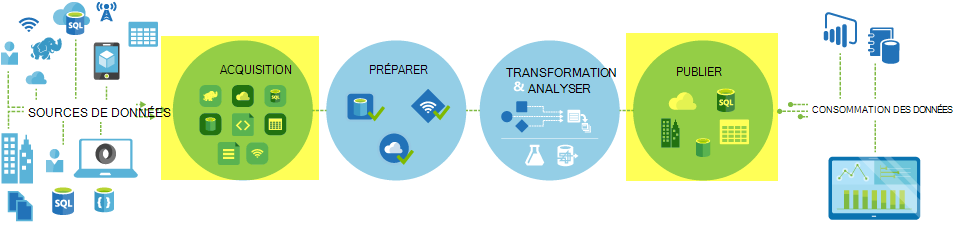
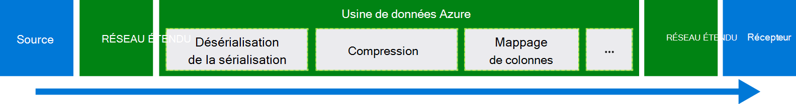
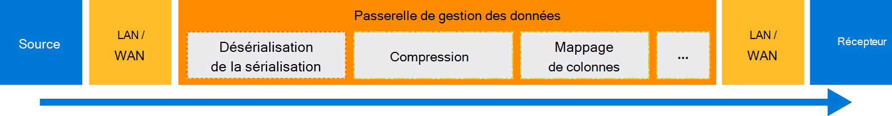

<properties
    pageTitle="Déplacer les données à l’aide de Copy activité | Microsoft Azure"
    description="Obtenir des informations sur le déplacement des données dans les pipelines de données usine : migration des données entre les magasins de nuage et entre un magasin local et une banque de nuage. Utilisez l’activité de la copie."
    keywords="copier des données, de déplacement de données, migration des données, de transfert de données"
    services="data-factory"
    documentationCenter=""
    authors="linda33wj"
    manager="jhubbard"
    editor="monicar"/>

<tags
    ms.service="data-factory"
    ms.workload="data-services"
    ms.tgt_pltfrm="na"
    ms.devlang="na"
    ms.topic="article"
    ms.date="09/22/2016"
    ms.author="jingwang"/>

# Déplacement des données à l’aide des activités de copie

## Vue d’ensemble
Dans Azure Data Factory, vous pouvez utiliser l’activité de copie pour copier les données de différentes formes de diverses sur site et les sources de données vers Azure en nuage. Une fois que les données sont copiées, il plus transformer et de les analyser. Vous pouvez également utiliser les activités de copie pour publier des résultats de l’analyse décisionnelle (BI) et consommation de l’application et de la transformation.

Activité de copie est alimentée par sécurisées, fiables, évolutives et un [service disponible globalement](#global). Cet article fournit des détails sur le déplacement des données dans Data Factory et de l’activité de la copie.

Tout d’abord, nous allons voir comment la migration des données se produit entre deux banques de données de nuage et entre une banque de données locale et un magasin de données de nuage.

> [AZURE.NOTE] Pour en savoir plus sur les activités en général, consultez [les activités et les pipelines de présentation](data-factory-create-pipelines.md).

### Copier des données entre deux banques de données de nuage
Lorsque les banques de données source et le récepteur sont dans le nuage, activité de copie de passe par les étapes suivantes pour copier des données à partir de la source vers le récepteur. Le service qui alimente l’activité de copie :

1. Lit les données de la banque de données source.
2. Effectue la sérialisation/désérialisation, compression/décompression, mappage de colonne et la conversion de type. Il effectue ces opérations en fonction des configurations du groupe de données d’entrée, dataset de sortie et activité de copie.
3.  Écrit les données dans la banque de données de destination.

Le service choisit automatiquement la région optimale pour effectuer le déplacement des données. Cette région est généralement celui le plus proche de la banque de données du récepteur.

### Copier des données entre un magasin de données local et un magasin de données de nuage
Pour déplacer en toute sécurité des données entre un magasin de données local et un magasin de données de nuage, installez la passerelle de gestion des données sur votre ordinateur local. Passerelle de gestion des données est un agent qui permet la transformation et déplacement de données hybride. Vous pouvez l’installer sur le même ordinateur que la banque de données elle-même, ou sur un ordinateur distinct qui a accès au magasin de données.

Dans ce scénario, la passerelle de gestion des données effectue la sérialisation/désérialisation, la compression/décompression, le mappage de colonne et la conversion de type. Données ne sont pas transmis via le service Factory de données Azure. Au lieu de cela, la passerelle de gestion des données écrit directement les données dans la banque de destination.

Consultez [déplacer des données entre des locaux et cloud des magasins de données](data-factory-move-data-between-onprem-and-cloud.md) pour une introduction et une procédure pas à pas. Voir [Passerelle de gestion des données](data-factory-data-management-gateway.md) pour des informations détaillées sur cet agent.

Vous pouvez également déplacer les banques de données de données à partir de/pris en charge qui sont hébergés sur Azure IaaS les machines virtuelles (VM) à l’aide de la passerelle de gestion des données. Dans ce cas, vous pouvez installer la passerelle de gestion des données sur la machine virtuelle de même que la banque de données elle-même, ou sur un ordinateur virtuel distinct, qui a accès au magasin de données.

## Banques de données pris en charge et formats
[AZURE.INCLUDE [data-factory-supported-data-stores](../../includes/data-factory-supported-data-stores.md)]

Si vous devez déplacer vers/à partir de données de magasin de données que l’activité de copie ne prennent en charge, utiliser une **activité personnalisée** en usine de données avec votre propre logique de copie/déplacement des données. Pour plus d’informations sur la création et à l’aide d’une activité personnalisée, voir [utiliser les activités personnalisées dans un pipeline Azure Data Factory](data-factory-use-custom-activities.md).

### Formats de fichier pris en charge
Activité de copie permet de copier les fichiers en tant que-est entre deux basée sur un fichier de banques de données, comme les Blob Azure, système de fichiers et très. Pour ce faire, vous pouvez ignorer la [section format](data-factory-create-datasets.md) dans les définitions de groupe de données d’entrée et de sortie. Les données sont copiées efficacement sans une sérialisation/désérialisation.

Activité de copie, également lit et écrit des fichiers dans des formats spécifiés : texte, Avro, ORC, Parquet et JSON. Vous pouvez effectuer les activités suivantes de la copie, par exemple :

-   Copier des données au format texte (CSV) à partir de l’objet Blob d’Azure et d’écrire dans la base de données de SQL Azure.
-   Copiez les fichiers au format texte (CSV) à partir du système de fichiers local et écrire les Blob Azure dans le format de Avro.
-   Copier des données dans la base de données de SQL Azure et d’écriture à très sur site au format des ORC.

## Déplacement de données globalement disponibles
Azure Data Factory n’est disponible que dans les régions Ouest des États-Unis, les États-Unis et Europe du Nord. Toutefois, le service qui alimente l’activité de la copie n’est disponible globalement dans les régions et les zones géographiques suivantes. La topologie globalement disponible garantit le déplacement de données généralement éviter les tronçons entre-région. Disponibilité des Data Factory et déplacement des données dans une zone, reportez-vous à la section [Services par région](https://azure.microsoft.com/regions/#services) .

### Copier des données entre les magasins de données de nuage
Lorsque les banques de données source et le récepteur sont dans le nuage, Data Factory utilise un déploiement de service dans la région qui est le plus proche pour le récepteur de la géographie même pour déplacer les données. Reportez-vous au tableau suivant pour le mappage :

Région de la banque de données de destination | Zone utilisée pour le déplacement des données
:----------------------------------- | :----------------------------
Les États-Unis | Les États-Unis
Les États-Unis 2 | Les États-Unis 2
États-Unis Ouest | États-Unis Ouest
États-Unis Ouest 2 | États-Unis Ouest
États-Unis centre | États-Unis centre
Ouest des États-Unis centre | États-Unis centre
États-Unis centre nord | États-Unis centre nord
États-Unis centre sud | États-Unis centre sud
Europe du Nord | Europe du Nord
Europe de l’ouest | Europe de l’ouest
Asie du Sud-est | Asie du Sud-est
Asie de l’est | Asie du Sud-est
Nord-est du Japon | Nord-est du Japon
Ouest du Japon | Nord-est du Japon
Sud du Brésil | Sud du Brésil
Est de l’Australie | Est de l’Australie
Sud-est de l’Australie | Sud-est de l’Australie
Central de l’Inde | Central de l’Inde
Sud-est de l’Inde | Central de l’Inde
Ouest de l’Inde | Central de l’Inde

> [AZURE.NOTE] Si la région de la banque de données de destination ne se trouve pas dans la liste précédente, activité de copie échoue au lieu de passer à une autre région.

### Copier des données entre un magasin de données local et un magasin de données de nuage
Lorsque les données sont copiées entre locaux (ou ordinateurs virtuels/IaaS Azure) et magasins de nuage, [Passerelle de gestion des données](data-factory-data-management-gateway.md) effectue un déplacement des données sur une machine de locaux ou d’une machine virtuelle. Les données ne sont pas transmis via le service dans le nuage, sauf si vous utilisez la fonctionnalité de [mis en place de la copie](data-factory-copy-activity-performance.md#staged-copy) . Dans ce cas, les données circulent via le stockage Azure Blob intermédiaire avant de les écrire dans le magasin de données du récepteur.

## Créer un pipeline avec une activité de copie
Vous pouvez créer un pipeline avec activité de copie de deux manières :

### À l’aide de l’Assistant de copie
L’Assistant de copie de données en usine vous aide à créer un pipeline avec une activité de copie. Ce pipeline permet de copier des données provenant de sources prises en charge dans destinations *sans écrire de JSON* définitions des pipelines, des groupes de données et services liés. Pour plus d’informations sur l’Assistant, consultez [Assistant de copie de données en usine](data-factory-copy-wizard.md) .  

### À l’aide de scripts JSON
Vous pouvez utiliser l’éditeur de fabrique de données dans le portail Azure, Visual Studio ou Azure PowerShell pour créer une définition pour un tuyau de JSON (en utilisant l’activité de copie). Vous pouvez ensuite déployer pour créer le pipeline dans Data Factory. Consultez [didacticiel : utilisation des activités de copie dans un pipeline Azure Data Factory](data-factory-copy-data-from-azure-blob-storage-to-sql-database.md) pour obtenir un didacticiel avec des instructions étape par étape.    

Propriétés JSON (nom, description, d’entrée et de sortie des tables, des stratégies) sont disponibles pour tous les types d’activités. Les propriétés qui sont disponibles dans le `typeProperties` section de l’activité varie avec chaque type d’activité.

Pour les activités de copie, le `typeProperties` section varie selon les types de sources et les récepteurs. Cliquez sur un source/récepteur dans la section [prise en charge de sources et les destinations](#supported-data-stores) pour en savoir plus sur les propriétés de type qui prend en charge de l’activité de la copie de ce magasin de données.   

Voici un exemple de définition de JSON :

    {
      "name": "ADFTutorialPipeline",
      "properties": {
        "description": "Copy data from Azure blob to Azure SQL table",
        "activities": [
          {
            "name": "CopyFromBlobToSQL",
            "type": "Copy",
            "inputs": [
              {
                "name": "InputBlobTable"
              }
            ],
            "outputs": [
              {
                "name": "OutputSQLTable"
              }
            ],
            "typeProperties": {
              "source": {
                "type": "BlobSource"
              },
              "sink": {
                "type": "SqlSink",
                "writeBatchSize": 10000,
                "writeBatchTimeout": "60:00:00"
              }
            },
            "Policy": {
              "concurrency": 1,
              "executionPriorityOrder": "NewestFirst",
              "retry": 0,
              "timeout": "01:00:00"
            }
          }
        ],
        "start": "2016-07-12T00:00:00Z",
        "end": "2016-07-13T00:00:00Z"
      }
    }

La planification est définie dans le dataset de sortie détermine quand l’activité s’exécute (par exemple : **quotidienne**, fréquence comme le **jour**et l’intervalle **1**). L’activité de copie des données d’un groupe de données d’entrée (**source**) à un dataset de sortie (**récepteur**).

Vous pouvez spécifier plus d’un dataset d’entrée à l’activité de la copie. Ils sont utilisés pour vérifier les dépendances avant l’exécution de l’activité. Toutefois, que les données du premier groupe de données sont copiées vers le groupe de données de destination. Pour plus d’informations, reportez-vous à la section [de planification et de l’exécution](data-factory-scheduling-and-execution.md).  

## Performances et réglage
Consultez l' [activité de copie de guide des performances et optimisation](data-factory-copy-activity-performance.md), qui décrit les facteurs qui affectent les performances de transfert de données (copie activité) dans Azure Data Factory. Il répertorie les performances observées lors des tests internes et présente différentes façons pour optimiser les performances de l’activité de la copie.

## Copie de planification et séquentiel
Pour des informations détaillées sur le fonctionnement de la planification et l’exécution dans une usine de données, reportez-vous à la section [de planification et de l’exécution](data-factory-scheduling-and-execution.md) . Il est possible d’exécuter plusieurs opérations de copie un après l’autre de manière séquentielle/commandé. Consultez la section [commandée de copie](data-factory-scheduling-and-execution.md#ordered-copy) .

## Conversions de type
Magasins de données différents ont des systèmes de types natifs. Activité de copie effectue les conversions de type automatique à partir de types de sources pour recevoir les types de l’approche en deux étapes suivantes :

1. Convertir un type .NET à partir de types de la source native.
2. Convertir un type de récepteurs natif à partir d’un type .NET.

Le mappage à partir d’un système de type natif en un type .NET pour un magasin de données est dans l’article de la banque de données respectifs. (Cliquez sur le lien spécifique dans le tableau de [prise en charge des magasins de données](#supported-data-stores) ). Vous pouvez utiliser ces mappages afin de déterminer les types appropriés lors de la création de vos tables, copie activité effectue les conversions de droite.

## Étapes suivantes
- Pour en savoir plus sur l’activité de la copie, voir [copie de données à partir du stockage Azure Blob dans la base de données de SQL Azure](data-factory-copy-data-from-azure-blob-storage-to-sql-database.md).
- Pour en savoir plus sur le déplacement des données à partir d’une banque de données locale à une banque de données de nuage, voir [déplacement des données à partir de locaux pour le cloud données stocke](data-factory-move-data-between-onprem-and-cloud.md).
