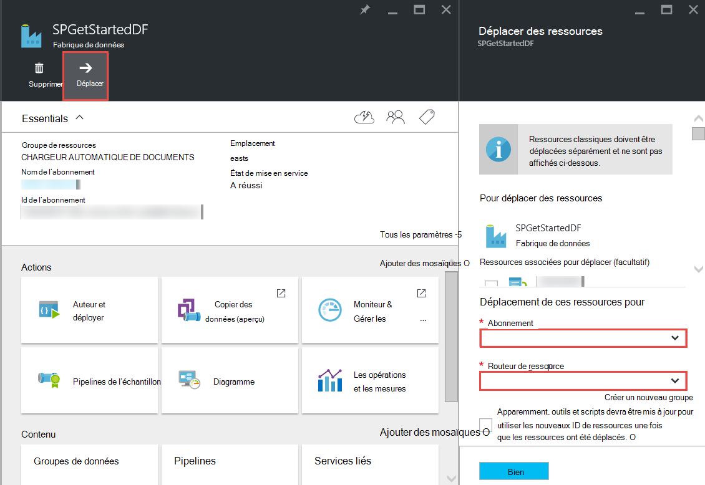

<properties 
    pageTitle="Factory de données Azure - Forum aux Questions" 
    description="Forum aux questions sur le Factory de données Azure." 
    services="data-factory" 
    documentationCenter="" 
    authors="sharonlo101" 
    manager="jhubbard" 
    editor="monicar"/>

<tags 
    ms.service="data-factory" 
    ms.workload="data-services" 
    ms.tgt_pltfrm="na" 
    ms.devlang="na" 
    ms.topic="article" 
    ms.date="09/12/2016" 
    ms.author="shlo"/>

# Factory de données Azure - Forum aux Questions

## Questions d’ordre générales

### Quel est le Factory de données Azure ?

Data Factory est un nuage qui **automatise le déplacement et la transformation des données**de service d’intégration de données. À l’instar d’une fabrique qui exécute des équipements pour prendre des matières premières et de leur transformation en produits finis, Data Factory orchestre des services existants qui collectent les données brutes et les transforment en informations de prêtes à l’emploi. 
 
Usine de données vous permet de créer pilotée par les données de flux de travail pour déplacer des données entre les locaux et cloud des magasins de données ainsi que les données de processus/transformation à l’aide des services de calcul comme HDInsight d’Azure et d’Azure données lac Analytique. Après avoir créé un pipeline qui exécute l’action dont vous avez besoin, vous pouvez planifier son exécution périodique (horaire, quotidienne, hebdomadaire, etc.).   

Pour plus d’informations, consultez [vue d’ensemble et Concepts clés](data-factory-introduction.md) . 

### Où puis-je trouver des informations de tarification pour Azure Data Factory ?

Consultez la [page Détails de la tarification de fabrique de données] [ adf-pricing-details] pour les détails de tarification pour le Factory de données Azure.  

### Comment commencer avec une usine de données Azure ?

- Pour une vue d’ensemble de la fabrique de données Azure, consultez [Introduction à l’usine de données Azure](data-factory-introduction.md).
- Pour voir un didacticiel sur la **copie/déplacement des données** à l’aide des activités de copie, [copier des données depuis le stockage Blob Azure à une base de données de SQL Azure](data-factory-copy-data-from-azure-blob-storage-to-sql-database.md).
- Pour un didacticiel sur la façon de **transformer des données** à l’aide d’activité de la ruche HDInsight. Consultez les [données de processus en exécutant le script de ruche de cluster d’Hadoop](data-factory-build-your-first-pipeline.md) 
  
### Quelle est la disponibilité dans la région de la fabrique de données ?
Usine de données est disponible à **l’Ouest des États-Unis** et en **Europe du Nord**. Les services informatiques et de stockage utilisés par les fabriques de données peuvent être dans d’autres régions. Consultez [les régions pris en charge](data-factory-introduction.md#supported-regions). 
 
### Quelles sont les limites sur le nombre de données fabriques/pipelines/activités/jeux de données ?
 
Reportez-vous à la section **Limites de fabrique de données Azure** de l’article [d’abonnement Azure et les limites de Service, les Quotas et les contraintes](../azure-subscription-service-limits.md#data-factory-limits) .

### Quelle est l’expérience de programmation/développement service de fabrique de données Azure ?

Vous pouvez auteur/créer des fabriques de données à l’aide d’une des opérations suivantes :

- **Azure portal**  
   des lames de la fabrique de données dans le portail Azure fournissant interface utilisateur riche vous permettant de créer des services de publicité liée fabriques de données. L' **Éditeur de données en usine**, qui fait également partie du portail, vous permet de créer facilement des services liés, les tables, les jeux de données et les pipelines en précisant les définitions en JSON pour ces artefacts. Pour obtenir un exemple d’utilisation de l’éditeur/de portail pour créer et déployer une fabrique de données, consultez [créer votre premier tuyau de données à l’aide de Azure portal](data-factory-build-your-first-pipeline-using-editor.md) .

- **Visual Studio**  
   vous pouvez utiliser Visual Studio pour créer une fabrique de données Azure. Pour plus d’informations, consultez [créer votre premier tuyau de données à l’aide de Visual Studio](data-factory-build-your-first-pipeline-using-vs.md) . 

- **PowerShell Azure**  
   pour un didacticiel/procédure pas à pas pour la création d’une fabrique de données à l’aide de PowerShell, consultez [créer et moniteur Azure Data Factory à l’aide de PowerShell d’Azure](data-factory-build-your-first-pipeline-using-powershell.md) . Voir [Données fabrique d’applet de commande référence] [ adf-powershell-reference] contenu de MSDN Library pour une documentation complète des applets de commande Data Factory.
   
- **Bibliothèque de classes .NET**  
   vous pouvez créer par programme des fabriques de données à l’aide du Kit de développement .NET Data Factory. Pour une procédure pas à pas de création d’une fabrique de données à l’aide du Kit de développement .NET, reportez-vous à la section [créer, contrôler et de gérer des fabriques de données à l’aide du Kit de développement .NET](data-factory-create-data-factories-programmatically.md) . Consultez [La référence de la bibliothèque de données de classe de fabrique de] [ msdn-class-library-reference] pour obtenir une documentation complète du Kit de développement .NET Data Factory.

- **API REST**  
   vous pouvez également utiliser l’API REST exposées par le service Factory de données Azure pour créer et déployer des fabriques de données. Voir les [Données de référence de l’API reste en usine] [ msdn-rest-api-reference] pour une documentation complète de l’API REST de fabrique de données.
 
- **Modèle de gestionnaire de ressources Azure** 
   voir [didacticiel : créer votre première fabrique de données Azure à l’aide du Gestionnaire de ressources Azure modèle](data-factory-build-your-first-pipeline-using-arm.md) détails de fo. 

### Puis-je renommer une fabrique de données ?
N° Comme autres ressources Azure, le nom d’une fabrique de données Azure ne peut pas être modifié. 

### Puis-je déplacer un factory de données à partir d’un abonnement Azure à un autre ? 
Oui. Utilisez le bouton **déplacer** sur la blade d’usine de données, comme illustré dans le diagramme suivant. 

### Quels sont les environnements de calcul prises en charge par l’usine de données ?
Le tableau suivant fournit une liste des environnements de calcul prises en charge par l’usine de données et les activités qui peuvent s’exécuter sur les. 

| Environnement informatique | activités |
| ------------------- | -------- | 
| [À la demande HDInsight cluster](data-factory-compute-linked-services.md#azure-hdinsight-on-demand-linked-service) ou [votre propre cluster HDInsight](data-factory-compute-linked-services.md#azure-hdinsight-linked-service) | [DotNet](data-factory-use-custom-activities.md), [la ruche](data-factory-hive-activity.md), [porc](data-factory-pig-activity.md), [MapReduce](data-factory-map-reduce.md), [Hadoop en continu](data-factory-hadoop-streaming-activity.md) | 
| [Lot Azure](data-factory-compute-linked-services.md#azure-batch-linked-service) | [DotNet](data-factory-use-custom-activities.md) |  
| [Apprentissage automatique Azure](data-factory-compute-linked-services.md#azure-machine-learning-linked-service) | [Machine d’activités de formation : l’exécution du lot et des ressources de mise à jour](data-factory-azure-ml-batch-execution-activity.md) |
| [Données Azure lac Analytique](data-factory-compute-linked-services.md#azure-data-lake-analytics-linked-service) | [Données Analytique de LAC U-SQL](data-factory-usql-activity.md)
| [SQL azure](data-factory-compute-linked-services.md#azure-sql-linked-service), [SQL Azure Data Warehouse](data-factory-compute-linked-services.md#azure-sql-data-warehouse-linked-service), [de SQL Server](data-factory-compute-linked-services.md#sql-server-linked-service) | [Procédure stockée](data-factory-stored-proc-activity.md)

## Activités - Forum aux questions
### Quels sont les différents types d’activités que vous pouvez utiliser dans un pipeline de données usine ? 

- [Activités de déplacement de données](data-factory-data-movement-activities.md) pour déplacer les données.
- [Activités de Transformation des données](data-factory-data-transformation-activities.md) de processus/transformation de données. 

### Lorsqu’une activité s’exécute-t-il ?
Le paramètre de configuration de **disponibilité** dans la table de données de sortie détermine lorsque l’activité est exécutée. Si des groupes de données d’entrée sont spécifiés, l’activité vérifie si toutes les dépendances de données d’entrée sont remplies (c'est-à-dire, à l’état **prêt** ) avant le démarrage en cours d’exécution. 

## Copier une activité - Forum aux questions
### Est-ce mieux d’avoir un pipeline à de multiples activités ou des opportunités différentes pour chaque activité ? 
Les pipelines sont censés pour regrouper des activités connexes. Si les jeux de données qui les connect n’est pas consommés par toute autre activité en dehors du pipeline, vous pouvez conserver les activités dans un pipeline. De cette façon, vous doit pas périodes active pipeline de chaîne afin qu’ils s’alignent avec eux. Également, l’intégrité des données dans les tables internes au pipeline est mieux préservée lors de la mise à jour du pipeline. Mise à jour du pipeline essentiellement arrête toutes les activités dans le pipeline, les supprime et les crée à nouveau. À partir de la création du point de vue, il peut être plus facile à voir le flux de données dans les activités connexes dans un seul fichier JSON pour le pipeline.

### Quelles sont les banques de données pris en charge ?
[AZURE.INCLUDE [data-factory-supported-data-stores](../../includes/data-factory-supported-data-stores.md)]

### Quels sont les formats de fichier pris en charge ? 
[AZURE.INCLUDE [data-factory-file-format](../../includes/data-factory-file-format.md)]

### Où est effectuée l’opération de copie ? 
Pour plus d’informations, reportez-vous à la section [déplacement de données globalement disponibles](data-factory-data-movement-activities.md#global) . En résumé, lorsqu’une banque de données locale est impliquée, l’opération de copie est effectuée par la passerelle de gestion des données dans votre environnement local. Et, lorsqu’il est le déplacement des données entre deux banques de nuage, l’opération de copie est effectuée dans la région le plus proche de l’emplacement du récepteur dans la même région. 

## Activité de HDInsight - Forum aux questions

### Les régions sont pris en charge par HDInsight ?

Reportez-vous à la section disponibilité géographique dans l’article suivant : ou [Détails de la tarification de HDInsight][hdinsight-supported-regions].

### Quelle est la région est utilisée par un cluster de HDInsight à la demande ?

Le cluster HDInsight la demande est créé dans la même région où se trouve le stockage que vous avez spécifié pour être utilisé avec le cluster.    

### L’association des comptes de stockage supplémentaires pour votre cluster HDInsight ?

Si vous utilisez votre propre HDInsight Cluster (BYOC - mettre de votre propre Cluster), consultez les rubriques suivantes : 

- [À l’aide d’un Cluster d’HDInsight avec Metastores et les comptes de l’autre espace de stockage][hdinsight-alternate-storage]
- [Utilisez des comptes de stockage supplémentaire avec ruche de HDInsight][hdinsight-alternate-storage-2]

Si vous utilisez un cluster à la demande qui est créé par le service Factory de données, spécifier des comptes de stockage supplémentaire pour le HDInsight lié service afin que le service Data Factory de les enregistrer en votre nom. Dans la définition de JSON pour le service lié à la demande, utilisez les propriétés **additionalLinkedServiceNames** pour spécifier les comptes de stockage de remplacement comme indiqué dans l’extrait suivant de JSON :
 
    {
        "name": "MyHDInsightOnDemandLinkedService",
        "properties":
        {
            "type": "HDInsightOnDemandLinkedService",
            "typeProperties": {
                "clusterSize": 1,
                "timeToLive": "00:01:00",
                "linkedServiceName": "LinkedService-SampleData",
                "additionalLinkedServiceNames": [ "otherLinkedServiceName1", "otherLinkedServiceName2" ] 
            }
        }
    } 

Dans l’exemple ci-dessus, otherLinkedServiceName1 et otherLinkedServiceName2 représentent les services liés dont les définitions contiennent des informations d’identification que le cluster HDInsight a besoin d’accéder à des comptes de stockage de remplacement.

## Tranches - Forum aux questions

### Pourquoi les mon tranches d’entrée pas l’état prêt ?  
Une erreur courante n’est pas définition de la propriété à **true** dans le dataset d’entrée **externe** lorsque les données d’entrée sont externes à l’usine de données (ne pas produite par la fabrique de données). 

Dans l’exemple suivant, vous devez uniquement définir **externe** true sur **dataset1**.  

**DataFactory1** Pipeline 1 : dataset1 -> activity1 -> dataset2 -> activity2 -> dataset3 Pipeline 2 : dataset3 -> activity3 -> dataset4

Si vous avez une autre usine de données avec un pipeline qui prend des dataset4 (produites par le pipeline 2 dans une usine de données 1), sélectionnez dataset4 sous la forme d’un groupe de données externe car le groupe de données est produite par une fabrique de données différentes (DataFactory1, pas DataFactory2).  

**DataFactory2**    
Pipeline 1 : dataset4 -> activity4 -> dataset5

Si la propriété externe est définie correctement, vérifiez si les données d’entrée existent dans l’emplacement spécifié dans la définition de groupe de données d’entrée. 

### Comment exécuter une section à une autre heure que minuit lorsque la section en cours de fabrication tous les jours ?
Utilisez la propriété **offset** pour spécifier l’heure à laquelle vous souhaitez que la tranche à produire. Pour plus d’informations sur cette propriété, reportez-vous à la section [disponibilité du groupe de données](data-factory-create-datasets.md#Availability) . Voici un exemple rapide :

    "availability":
    {
        "frequency": "Day",
        "interval": 1,
        "offset": "06:00:00"
    }

Tranches quotidiennes commencent à **6 heures** au lieu de minuit de la valeur par défaut.     

### Comment puis-je réexécuter une tranche ?
Vous pouvez exécuter à nouveau une tranche dans une des manières suivantes : 

- Permet de surveiller et gérer l’application pour réexécuter une fenêtre activité ou un secteur. Pour obtenir des instructions, reportez-vous à la section [réexécuter sélectionné windows de l’activité](data-factory-monitor-manage-app.md#re-run-selected-activity-windows) .   
- Cliquez sur **exécuter** dans la barre de commandes sur la lame de **Tranche de données** pour la tranche dans le portail Azure.
- Exécutez l’applet de commande **Set-AzureRmDataFactorySliceStatus** dont le statut en **attente** de la tranche.   
    
        Set-AzureRmDataFactorySliceStatus -Status Waiting -ResourceGroupName $ResourceGroup -DataFactoryName $df -TableName $table -StartDateTime "02/26/2015 19:00:00" -EndDateTime "02/26/2015 20:00:00" 

Voir [Ensemble-AzureRmDataFactorySliceStatus] [ set-azure-datafactory-slice-status] pour plus d’informations sur l’applet de commande. 

### Combien de temps a-t-il fallu pour traiter une tranche ?
Utilisez l’activité fenêtre Explorateur dans le moniteur et gérer une application de connaître la durée nécessaire au traitement d’une tranche de données. Pour plus d’informations, consultez [Explorateur d’activité](data-factory-monitor-manage-app.md#activity-window-explorer) . 

Vous pouvez également effectuer les opérations suivantes dans le portail Azure :  

1. Cliquez sur mosaïque de **jeux de données** sur la lame **FACTORY de données** pour votre fabrique de données.
2. Cliquez sur le groupe de données spécifique sur la lame de **groupes de données** .
3. Sélectionnez la section qui vous intéressez dans la liste **tranches récentes** sur la lame de la **TABLE** .
4. Cliquez sur l’activité de s’exécutée à partir de la liste **d’Exécution de l’activité** sur la lame de la **Tranche de données** . 
5. Cliquez sur mosaïque de **Propriétés** sur la blade **d’Activité détails de l’exécution** . 
6. Vous devriez voir une valeur au champ **durée** . Cette valeur est le temps nécessaire pour traiter la tranche.   

### Comment arrêter une tranche en cours d’exécution ?
Si vous avez besoin d’arrêter le pipeline de l’exécution, vous pouvez utiliser l’applet de commande de [Suspension-AzureRmDataFactoryPipeline](https://msdn.microsoft.com/library/mt603721.aspx) . Actuellement, la suspension du pipeline n’arrête pas les exécutions de la tranche sont en cours. Une fois la fin de l’exécution en cours, aucune tranche supplémentaire n’est sélectionné.

Si vous voulez vraiment arrêter toutes les exécutions immédiatement, le seul moyen serait de supprimer le pipeline et le créer à nouveau. Si vous choisissez de supprimer le pipeline, vous n’avez pas besoin supprimer des tables et utilisées par le pipeline de services liés. 

[create-factory-using-dotnet-sdk]: data-factory-create-data-factories-programmatically.md
[msdn-class-library-reference]: https://msdn.microsoft.com/library/dn883654.aspx
[msdn-rest-api-reference]: https://msdn.microsoft.com/library/dn906738.aspx

[adf-powershell-reference]: https://msdn.microsoft.com/library/dn820234.aspx 
[azure-portal]: http://portal.azure.com
[set-azure-datafactory-slice-status]: https://msdn.microsoft.com/library/mt603522.aspx

[adf-pricing-details]: http://go.microsoft.com/fwlink/?LinkId=517777
[hdinsight-supported-regions]: http://azure.microsoft.com/pricing/details/hdinsight/
[hdinsight-alternate-storage]: http://social.technet.microsoft.com/wiki/contents/articles/23256.using-an-hdinsight-cluster-with-alternate-storage-accounts-and-metastores.aspx
[hdinsight-alternate-storage-2]: http://blogs.msdn.com/b/cindygross/archive/2014/05/05/use-additional-storage-accounts-with-hdinsight-hive.aspx
 
