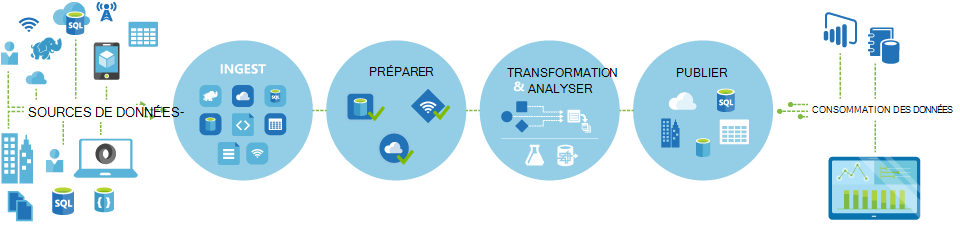
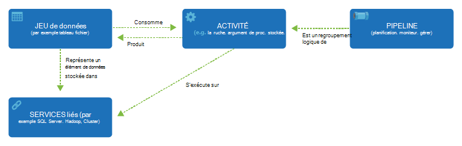

<properties 
    pageTitle="Introduction à la fabrique de données, un service d’intégration de données | Microsoft Azure" 
    description="Découvrez ce qui est la fabrique de données Azure : un service d’intégration de données de nuage qui orchestre et automatise le déplacement et la transformation des données." 
    keywords="intégration de données, intégration de données de nuage, ce qui est la fabrique de données azure"
    services="data-factory" 
    documentationCenter="" 
    authors="sharonlo101" 
    manager="jhubbard" 
    editor="monicar"/>

<tags 
    ms.service="data-factory" 
    ms.workload="data-services" 
    ms.tgt_pltfrm="na" 
    ms.devlang="na" 
    ms.topic="get-started-article" 
    ms.date="09/22/2016" 
    ms.author="shlo"/>

# Introduction à Service Factory de données Azure, un service d’intégration de données dans le nuage

## Quel est le Factory de données Azure ? 
Usine de données est un service d’intégration de données basé sur le cloud qui orchestre et automatise le **déplacement** et la **transformation** des données. Vous pouvez créer des solutions d’intégration de données à l’aide du service de fabrique des données qui peuvent réceptionner les données provenant de différentes banques de données, les données de transformation/processus et publier les données de résultat pour les banques de données. 

Service de fabrique de données vous permet de créer des pipelines de données que vous déplacement et transforment des données et d’exécuter les tuyaux selon un calendrier défini (horaire, quotidienne, hebdomadaire, etc.). Il fournit également des visualisations enrichies pour afficher les dépendances entre vos pipelines de données et le lignage et surveiller tous les tuyaux de vos données à partir d’une seule vue unifiée afin d’identifier facilement les problèmes et le programme d’installation, la surveillance des alertes.

**figure 1.** Acquisition de données à partir de diverses sources de données, préparer, transformer et analyser les données et de publier les données prêtes à l’emploi destinés à la consommation.

## Pipelines et activités
Dans une solution de Data Factory, vous créez de données un ou plusieurs **pipelines**. Un pipeline est un regroupement logique des activités. Ils sont utilisés pour les activités de groupe dans une unité qui ensemble exécutent une tâche. 

**Activités de** définir les actions à effectuer sur vos données. Par exemple, vous pouvez utiliser une activité de copie pour copier des données à partir d’un magasin de données dans un autre magasin de données. De même, vous pouvez utiliser une activité de ruche, qui exécute une requête de ruche sur un cluster HDInsight d’Azure à transformer ou à analyser vos données. Usine de données prend en charge deux types d’activités : activités de déplacement des données et des activités de transformation des données. 
  
## Activités de déplacement des données 
[AZURE.INCLUDE [data-factory-supported-data-stores](../../includes/data-factory-supported-data-stores.md)]

Consultez l’article [d’Activités de déplacement des données](data-factory-data-movement-activities.md) pour plus de détails. 

## Activités de transformation des données
[AZURE.INCLUDE [data-factory-transformation-activities](../../includes/data-factory-transformation-activities.md)]

Consultez l’article des [Activités de Transformation de données](data-factory-data-transformation-activities.md) pour plus de détails.

Si vous devez déplacer vers/à partir de données de magasin de données que copie activité ne prend en charge, ou transformer des données à l’aide de votre propre logique, créer une **activité personnalisée de .NET**. Pour plus d’informations sur la création et à l’aide d’une activité personnalisée, voir [utiliser les activités personnalisées dans un pipeline Azure Data Factory](data-factory-use-custom-activities.md).

## Services liés
Services liés définissent les informations nécessaires pour le Factory de données pour se connecter à des ressources externes (exemples : le stockage Azure, SQL Server, Azure HDInsight sur site). Services liés sont utilisés pour deux raisons dans une usine de données :

- Pour représenter un **magasin de données** , y compris, mais sans limitation, un SQL Server local, base de données Oracle, fichier de partage ou un compte de stockage des objets Blob Azure. Consultez la section [activités de déplacement des données](data-factory-data-movement-activities.md) pour une liste de banques de données pris en charge. 
- Pour représenter une **ressource de calcul** qui permet d’héberger l’exécution d’une activité. Par exemple, l’activité de HDInsightHive s’exécute sur un cluster HDInsight Hadoop. Consultez la section [activités de transformation de données](data-factory-data-transformation-activities.md) pour une liste des environnements de calcul pris en charge. 

## Groupes de données 
Services liés lier des magasins de données à une usine de données Azure. Des groupes de données représentent les structures de données avec les banques de données. Par exemple, un service de stockage Azure lié fournit des informations de connexion pour le Factory de données pour se connecter à un compte de stockage Azure. Un groupe de données Azure Blob Spécifie le conteneur de l’objet blob et le dossier dans le stockage Blob Azure à partir de laquelle le pipeline doit lire les données. De même, un service SQL Azure lié fournit des informations de connexion pour une base de données Azure SQL et un groupe de données Azure SQL spécifie la table qui contient les données.   

## Relation entre des entités de données usine
Data Factory a quelques entités clées qui fonctionnent ensemble pour définir l’entrée et la sortie des données, de traitement des événements et la planification et les ressources requises pour exécuter le flux de données de votre choix.

**Figure 2.** Relations entre le groupe de données, l’activité, Pipeline et lié de service

Les quatre concepts simples de services liés, les groupes de données, les activités et les pipelines, vous êtes prêt à commencer ! Vous pouvez [créer votre premier pipeline](data-factory-build-your-first-pipeline.md). 

## Régions pris en charge
Actuellement, vous pouvez créer des fabriques de données dans les régions **Ouest des États-Unis**, **Les États-Unis**et **Europe du Nord** . Toutefois, une fabrique de données peut accéder à des magasins de données et calculer des services dans d’autres régions Azure pour déplacer des données entre les magasins de données ou les données de processus à l’aide des services de traitement. 

Azure Data Factory ne stocke pas les données. Il vous permet de créer pilotée par les données de flux pour orchestrer le déplacement des données entre la [prise en charge des magasins de données](data-factory-data-movement-activities.md#supported-data-stores) et de traitement des données à l’aide de [services de traitement](data-factory-compute-linked-services.md) dans les autres régions ou dans un environnement sur site. Il vous permet également des [surveiller et de gérer les workflows](data-factory-monitor-manage-pipelines.md) utilisant à la fois par programme et de l’interface utilisateur. 

Bien que Azure Data Factory est disponible uniquement **Aux États-Unis Ouest** **Américains Extrême-Orient**et régions **d’Europe du Nord** , le service de mise en marche du déplacement des données dans Data Factory est disponible [globalement](data-factory-data-movement-activities.md#global) dans plusieurs régions. Dans le cas où un magasin de données trouve derrière un pare-feu puis une [Passerelle de gestion des données](data-factory-move-data-between-onprem-and-cloud.md) installé dans votre environnement local déplace les données à la place. 

Pour obtenir un exemple, supposons que vos environnements de calcul Azure HDInsight cluster des Azure Machine formation sont en cours d’exécution en dehors de la région de l’Europe de l’ouest. Vous pouvez créer et utiliser une instance Azure Data Factory en Europe du Nord et l’utiliser pour planifier des tâches sur vos environnements de calcul en Europe de l’ouest. Il faut quelques millisecondes pour Data Factory déclencher la tâche sur votre environnement informatique, mais la durée d’exécution de la tâche de votre environnement informatique ne change pas.

Nous avons l’intention d’avoir Azure Data Factory dans tous les secteurs géographiques pris en charge par Azure dans le futur.
  
## Étapes suivantes
Pour savoir comment créer des fabriques de données avec les pipelines de données, suivez les instructions détaillées dans les didacticiels suivants. 

Didacticiel | Description
-------- | -----------
[Créer un pipeline de données qui traite des données à l’aide d’Hadoop cluster](data-factory-build-your-first-pipeline.md) | Dans ce didacticiel, vous générez votre première fabrique de données Azure avec un pipeline de données qui **traite les données** en exécutant le script de la ruche sur un cluster Azure HDInsight (Hadoop). |
[Créer un pipeline de données pour déplacer les données entre deux banques de données de nuage](data-factory-copy-data-from-azure-blob-storage-to-sql-database.md) | Dans ce didacticiel, vous créez une fabrique de données avec un pipeline qui **déplace les données** depuis le stockage Blob pour la base de données SQL.
[Créer un pipeline de données pour déplacer des données entre un magasin de données local et un magasin de données de nuage à l’aide de la passerelle de gestion des données](data-factory-move-data-between-onprem-and-cloud.md) | Dans ce didacticiel, vous générez une fabrique de données avec un pipeline qui **déplace les données** à partir d’une base de données de SQL Server **sur site** vers un blob Azure. Dans le cadre de la procédure pas à pas, vous installez et configurez la passerelle de gestion des données sur votre ordinateur. 
