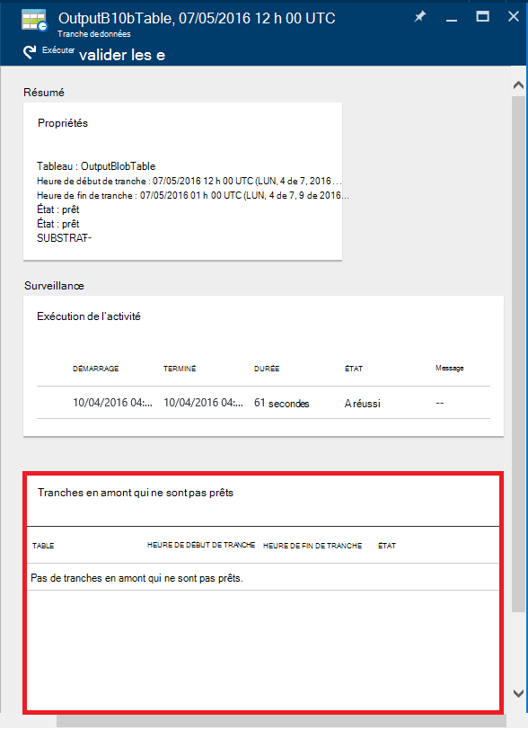
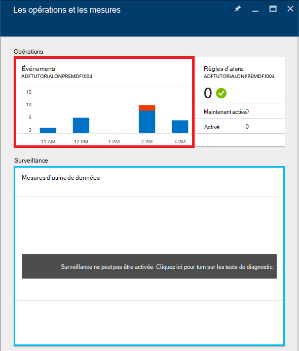

<properties 
    pageTitle="Surveiller et de gérer les pipelines Azure Data Factory" 
    description="Apprenez à utiliser le portail Azure et Azure PowerShell pour surveiller et gérer les fabriques de données Azure et que vous avez créé des tuyaux." 
    services="data-factory" 
    documentationCenter="" 
    authors="spelluru" 
    manager="jhubbard" 
    editor="monicar"/>

<tags 
    ms.service="data-factory" 
    ms.workload="data-services" 
    ms.tgt_pltfrm="na" 
    ms.devlang="na" 
    ms.topic="article" 
    ms.date="09/06/2016" 
    ms.author="spelluru"/>

# Surveiller et de gérer les pipelines Azure Data Factory
> [AZURE.SELECTOR]
- [À l’aide d’Azure portal Azure PowerShell](data-factory-monitor-manage-pipelines.md)
- [À l’aide de surveillance et de gestion App](data-factory-monitor-manage-app.md)

Le service Data Factory fournit une vue complète et fiable de vos services de déplacement de données, de traitement et de stockage. Le service vous fournit un contrôle permet de tableau de bord que vous pouvez utiliser pour effectuer les tâches suivantes : 

- Évaluer rapidement des données de bout en bout canalisation santé.
- Identifier les problèmes et prendre des mesures correctives si nécessaire. 
- Enregistrement en ligne des données de suivi. 
- Effectuer le suivi des relations entre vos données via une de vos sources.
- Comptabilité historique complet de vue de l’exécution du travail, état du système et les dépendances.

Cet article décrit comment faire pour contrôler, gérer et déboguer vos pipelines. Il fournit également des informations sur la façon de créer des alertes et d’être averti de défaillances.

## Comprendre les pipelines et les États de l’activité
À l’aide du portail Azure, vous pouvez :

- Afficher votre fabrique de données sous la forme d’un diagramme
- Afficher les activités dans un pipeline
- Afficher les groupes de données d’entrée et de sortie
- et bien plus encore. 

Cette section fournit également comment une tranche passe d’un état à un autre état.   

### Naviguez jusqu'à votre fabrique de données
1.  Connectez-vous au [portail Azure](https://portal.azure.com).
2.  Dans le menu de gauche, cliquez sur **les fabriques de données** . Si vous ne la voyez pas, cliquez sur **plus de services >** sur les **fabriques de données** sous catégorie **INTELLIGENCE + ANALYTICS** . 

    

    Vous devriez voir toutes les fabriques de données de la lame de **fabriques de données** . 
4. Dans la lame de fabriques de données, sélectionnez le factory de données que vous intéressez.

      
5.  et vous devez voir la page d’accueil de la fabrique de données (**Data factory** blade).

    

#### Affichage du schéma de la fabrique de données
L’affichage du schéma d’une fabrique de données fournit un seul volet de verre pour surveiller et gérer le factory de données et de ses actifs.

Pour afficher le diagramme de votre fabrique de données, cliquez sur **diagramme** sur la page d’accueil de données en usine.

Vous pouvez effectuer un zoom avant, zoom arrière, zoom pour ajuster, zoom à 100 %, verrouiller la disposition du diagramme et positionnement automatique des tuyaux et des tables. Vous pouvez également afficher les informations de lignage des données (afficher les éléments en amont et en aval des éléments sélectionnés).
 

### Activités à l’intérieur d’un pipeline 
1. Avec le bouton droit de la canalisation, puis cliquez sur **Ouvrir pipeline** pour voir toutes les activités dans le pipeline, ainsi que des groupes de données d’entrée et de sortie pour les activités. Cette fonctionnalité est utile lorsque votre pipeline comprend plusieurs activités et que vous souhaitez comprendre le lignage de fonctionnement d’une canalisation unique.

      
2. Dans l’exemple suivant, vous voyez deux activités dans le pipeline avec leurs entrées et de sorties. L’activité intitulée **JoinData** du type d’activité de la ruche de HDInsight et **EgressDataAzure** de type activité de copie sont dans le pipeline de cet exemple. 
    
     
3. Retour à la page d’accueil de Data Factory, vous pouvez naviguer en cliquant sur le lien d’usine de données dans l’arborescence de navigation dans le coin supérieur gauche.

    

### État d’affichage de chaque activité à l’intérieur d’un pipeline
Vous pouvez afficher l’état actuel d’une activité en consultant l’état d’un des jeux de données générés par l’activité. 

Par exemple : dans l’exemple suivant, la **BlobPartitionHiveActivity** a été correctement exécuté et produit un dataset nommé **PartitionedProductsUsageTable**, qui se trouve dans l’état **prêt** .

Le fait de double-cliquer sur le **PartitionedProductsUsageTable** dans l’affichage Diagramme présente toutes les tranches produites par exécute des activités différentes à l’intérieur d’un pipeline. Vous pouvez voir que l' **BlobPartitionHiveActivity** a été correctement exécuté chaque mois pour les derniers mois de huit et produits des secteurs de l’état **prêt** .

Les tranches de dataset dans une usine de données peuvent avoir un des statuts suivants :

<table>
<tr>
    <th align="left">État</th><th align="left">Sous-état</th><th align="left">Description</th>
</tr>
<tr>
    <td rowspan="8">En attente</td><td>ScheduleTime</td><td>L’heure n’a pas encore de la tranche à exécuter.</td>
</tr>
<tr>
<td>DatasetDependencies</td><td>Les dépendances en amont ne sont pas prêts.</td>
</tr>
<tr>
<td>ComputeResources</td><td>Les ressources de calcul ne sont pas disponibles.</td>
</tr>
<tr>
<td>ConcurrencyLimit</td> <td>Toutes les instances d’activité sont occupés par l’exécution d’autres tranches.</td>
</tr>
<tr>
<td>ActivityResume</td><td>Activité est suspendue et ne peut pas exécuter les tranches jusqu'à sa reprise.</td>
</tr>
<tr>
<td>Nouvelle tentative</td><td>L’exécution des activités est relancée.</td>
</tr>
<tr>
<td>Validation</td><td>La validation n’a pas encore commencé.</td>
</tr>
<tr>
<td>ValidationRetry</td><td>En attente de validation afin d’être retraité.</td>
</tr>
<tr>
<tr
<td rowspan="2">InProgress</td><td>Validation</td><td>Validation en cours.</td>
</tr>
<td></td>
<td>La tranche est en cours de traitement.</td>
</tr>
<tr>
<td rowspan="4">A échoué</td><td>TimedOut</td><td>L’exécution a duré plus longtemps que cela est autorisé par l’activité.</td>
</tr>
<tr>
<td>Annulé</td><td>Annulé par l’utilisateur.</td>
</tr>
<tr>
<td>Validation</td><td>La validation a échoué.</td>
</tr>
<tr>
<td></td><td>Impossible de générer et/ou valider la tranche.</td>
</tr>
<td>Prêt</td><td></td><td>La tranche est prête à la consommation.</td>
</tr>
<tr>
<td>Ignoré</td><td></td><td>La tranche n’est pas traitée.</td>
</tr>
<tr>
<td>Aucun</td><td></td><td>Une tranche utilisé d’exister avec un statut différent, mais a été réinitialisée.</td>
</tr>
</table>

Vous pouvez afficher les détails sur une section en cliquant sur une entrée de tranche dans la lame **Mis à jour récemment des tranches** .

 
Si le secteur a été exécuté plusieurs fois, vous voyez plusieurs lignes dans la liste **activité s’exécute** . Vous pouvez afficher des détails sur une activité exécuter en cliquant sur l’entrée d’exécution dans la liste **Qu'activité s’exécute** . La liste affiche tous les fichiers journaux avec un message d’erreur éventuel. Cette fonctionnalité est utile pour afficher et journaux de débogage sans quitter votre fabrique de données.

Si la section n’est pas dans l’état **prêt** , vous pouvez voir les tranches en amont qui ne sont pas prêtes et bloquent la tranche en cours d’exécution dans la liste **des tranches en amont qui ne sont pas prêtes** . Cette fonctionnalité est utile lorsque votre section est en état **d’attente** et que vous voulez comprendre les dépendances en amont sur lequel la tranche est en attente.

### Diagramme d’état de groupe de données
Une fois que vous déployez une fabrique de données et les pipelines ont une période active valide, dataset tranches de transition d’un état à un autre. Actuellement, le statut de tranche suit le diagramme d’état suivant :

Le flux de transition d’état dataset dans une usine de données : en attente -> en cours/en cours (Validating) -> prêt/Échec

Les tranches de démarrent dans un état **en attente** pour les conditions préalables à respecter avant de l’exécuter. Ensuite, l’activité commence à s’exécuter et la tranche doit figurer dans l’état **En cours** . L’exécution de l’activité peut réussir ou échouer. La section est marquée comme **prêt**' ou **Échec** en fonction du résultat de l’exécution. 

Vous pouvez réinitialiser la tranche pour revenir en arrière à partir de l’état **prêt** ou **Échec** à l’état **d’attente** . Vous pouvez également marquer l’état de la tranche à **Ignorer**, qui empêche l’exécution de l’activité et ne traite pas la tranche.

## Gérer des pipelines
Vous pouvez gérer vos pipelines à l’aide de PowerShell d’Azure. Par exemple, vous pouvez suspendre et reprendre des tuyaux en exécutant des applets de commande PowerShell d’Azure. 

### Suspendre et reprendre des pipelines
Vous pouvez suspendre/suspendre pipelines à l’aide de l’applet de commande Powershell **Suspend-AzureRmDataFactoryPipeline** . Cette applet de commande est utile lorsque vous ne souhaitez pas exécuter vos pipelines jusqu'à ce que le problème est résolu.

Par exemple : dans la capture d’écran suivante, un problème a été identifié avec le **PartitionProductsUsagePipeline** dans la fabrique de données **productrecgamalbox1dev** et nous souhaitons suspendre le pipeline.

Pour interrompre un pipeline, exécutez la commande PowerShell suivante :

    Suspend-AzureRmDataFactoryPipeline [-ResourceGroupName] <String> [-DataFactoryName] <String> [-Name] <String>

Par exemple :

    Suspend-AzureRmDataFactoryPipeline -ResourceGroupName ADF -DataFactoryName productrecgamalbox1dev -Name PartitionProductsUsagePipeline 

Une fois que le problème a été corrigé dans le **PartitionProductsUsagePipeline**, le pipeline suspendu peut être repris en exécutant la commande PowerShell suivante :

    Resume-AzureRmDataFactoryPipeline [-ResourceGroupName] <String> [-DataFactoryName] <String> [-Name] <String>

Par exemple :

    Resume-AzureRmDataFactoryPipeline -ResourceGroupName ADF -DataFactoryName productrecgamalbox1dev -Name PartitionProductsUsagePipeline 

## Déboguer des pipelines
Azure Data Factory fournit des fonctionnalités puissantes grâce à Azure portal et PowerShell Azure à déboguer et à résoudre les problèmes de pipelines.

### Rechercher les erreurs dans un pipeline
En cas d’échec de l’exécution de l’activité dans un tuyau, le groupe de données généré par le pipeline est dans un état d’erreur provoquées par la défaillance. Vous pouvez déboguer et corriger les erreurs dans l’usine de données Azure à l’aide des mécanismes suivants.

#### Azure portal permet de déboguer une erreur :

3.  De la lame de la **TABLE** , cliquez sur la tranche de problème avec l' **état** **Échec**.

    
4.  De la lame de la **Tranche de données** , cliquez sur l’activité qui n’a pas pu exécutée.
    
    
5.  De la lame **d’Activité détails de l’exécution** , vous pouvez télécharger les fichiers associés avec le traitement de HDInsight. Cliquez sur Télécharger pour état/stderr télécharger le fichier journal des erreurs qui contient des détails sur l’erreur.

      

#### Utilisation de PowerShell pour déboguer une erreur
1.  Lancer **PowerShell Azure**.
3.  Exécutez la commande **Get-AzureRmDataFactorySlice** pour afficher les tranches et leur statut. Vous devriez voir une tranche avec l’état : **Échec**.       

            Get-AzureRmDataFactorySlice [-ResourceGroupName] <String> [-DataFactoryName] <String> [-TableName] <String> [-StartDateTime] <DateTime> [[-EndDateTime] <DateTime> ] [-Profile <AzureProfile> ] [ <CommonParameters>]
    
    Par exemple :
        
            Get-AzureRmDataFactorySlice -ResourceGroupName ADF -DataFactoryName LogProcessingFactory -TableName EnrichedGameEventsTable -StartDateTime 2014-05-04 20:00:00

    Remplacez **StartDateTime** par la valeur StartDateTime spécifiée pour le jeu-AzureRmDataFactoryPipelineActivePeriod.
4. Maintenant, exécutez l’applet de commande **Get-AzureRmDataFactoryRun** pour obtenir des détails sur l’activité de s’exécuter de la tranche.

        Get-AzureRmDataFactoryRun [-ResourceGroupName] <String> [-DataFactoryName] <String> [-TableName] <String> [-StartDateTime] 
        <DateTime> [-Profile <AzureProfile> ] [ <CommonParameters>]
    
    Par exemple :

        Get-AzureRmDataFactoryRun -ResourceGroupName ADF -DataFactoryName LogProcessingFactory -TableName EnrichedGameEventsTable -StartDateTime "5/5/2014 12:00:00 AM"

    La valeur de StartDateTime est l’heure de début de la tranche d’erreur/problème que vous avez noté à l’étape précédente. La date-heure doit être entourée de guillemets doubles.
5.  Vous devez voir la sortie avec des informations détaillées sur l’erreur (semblable à la suivante) :

            Id                      : 841b77c9-d56c-48d1-99a3-8c16c3e77d39
            ResourceGroupName       : ADF
            DataFactoryName         : LogProcessingFactory3
            TableName               : EnrichedGameEventsTable
            ProcessingStartTime     : 10/10/2014 3:04:52 AM
            ProcessingEndTime       : 10/10/2014 3:06:49 AM
            PercentComplete         : 0
            DataSliceStart          : 5/5/2014 12:00:00 AM
            DataSliceEnd            : 5/6/2014 12:00:00 AM
            Status                  : FailedExecution
            Timestamp               : 10/10/2014 3:04:52 AM
            RetryAttempt            : 0
            Properties              : {}
            ErrorMessage            : Pig script failed with exit code '5'. See wasb://     adfjobs@spestore.blob.core.windows.net/PigQuery
                                            Jobs/841b77c9-d56c-48d1-99a3-
                        8c16c3e77d39/10_10_2014_03_04_53_277/Status/stderr' for
                        more details.
            ActivityName            : PigEnrichLogs
            PipelineName            : EnrichGameLogsPipeline
            Type                    :
    
    
6.  Vous pouvez exécuter l’applet de commande **Save-AzureRmDataFactoryLog** avec la valeur Id vous voir dans la sortie et téléchargez les fichiers journaux à l’aide de la **DownloadLogsoption -** pour l’applet de commande.

            Save-AzureRmDataFactoryLog -ResourceGroupName "ADF" -DataFactoryName "LogProcessingFactory" -Id "841b77c9-d56c-48d1-99a3-8c16c3e77d39" -DownloadLogs -Output "C:\Test"

## Exécutez à nouveau les défaillances dans un pipeline

### À l’aide du portail Azure

Une fois que vous dépanner et déboguez les erreurs dans un tuyau, vous pouvez réexécuter des échecs par à la tranche d’erreur en cliquant sur le bouton **exécuter** dans la barre de commandes.

En cas d’échec de validation en raison d’un échec de la stratégie la tranche (pour ex : données non disponibles), vous pouvez corriger l’erreur et validez à nouveau en cliquant sur le bouton **Valider** dans la barre de commande.

### À l’aide de PowerShell Azure

Vous pouvez réexécuter des défaillances à l’aide de l’applet de commande Set-AzureRmDataFactorySliceStatus. Voir la rubrique [Set-AzureRmDataFactorySliceStatus](https://msdn.microsoft.com/library/mt603522.aspx) pour la syntaxe et autres détails sur l’applet de commande. 

**Exemple :** L’exemple suivant définit l’état de toutes les tranches de la table 'DAWikiAggregatedData' 'En attente' dans l’usine de données Azure 'WikiADF'.

La UpdateType est définie sur UpstreamInPipeline, ce qui signifie que les statuts de chaque section de la table et toutes les tables (en amont) dépendants sont définies comme « En attente ». Autre valeur possible pour ce paramètre est « Personne ».

    Set-AzureRmDataFactorySliceStatus -ResourceGroupName ADF -DataFactoryName WikiADF -TableName DAWikiAggregatedData -Status Waiting -UpdateType UpstreamInPipeline -StartDateTime 2014-05-21T16:00:00 -EndDateTime 2014-05-21T20:00:00

## Créer des alertes
Azure événements utilisateur lorsqu’une ressource Azure (par exemple, une usine de données) est créé, mis à jour ou supprimé. Vous pouvez créer des alertes sur ces événements. Usine de données vous permet de capturer les diverses métriques et de créer des alertes sur les mesures. Nous vous recommandons d’utiliser des événements pour la surveillance et les mesures en temps réel à des fins historiques. 

### Alertes pour les événements
Événements Azure fournissent des explications utiles sur ce qui se passe dans vos ressources Azure. Azure événements utilisateur lorsqu’une ressource Azure (par exemple, une usine de données) est créé, mis à jour ou supprimé. Lorsque vous utilisez le Factory de données Azure, les événements sont générés lorsque :

- Azure Data Factory est créé, mis à jour/suppression.
- Traitement de données (appelé lors de l’exécution) démarrée/terminée.
- Un cluster d’HDInsight à la demande est créé et supprimé.

Vous pouvez créer des alertes sur ces événements utilisateur et les configurer pour envoyer des notifications par courrier électronique à l’administrateur et les administrateurs de collègues de l’abonnement. En outre, vous pouvez spécifier d’autres adresses e-mail d’utilisateurs qui doivent recevoir des notifications par courrier électronique lorsque les conditions sont remplies. Cette fonctionnalité est utile lorsque vous souhaitez être averti de défaillances et que vous ne voulez pas surveiller en permanence votre fabrique de données.

> [AZURE.NOTE] Actuellement, le portail n’affiche pas d’alertes sur des événements. Pour afficher toutes les alertes, utilisez l' [analyse et gestion App](data-factory-monitor-manage-app.md) .

#### Spécification d’une définition d’alerte :
Pour spécifier une définition d’alerte, vous créez un fichier JSON qui décrit les opérations que vous souhaitez être averti sur. Dans l’exemple suivant, l’alerte envoie une notification par e-mail pour l’opération RunFinished. Pour être précis, une notification par e-mail est envoyée lors d’une exécution dans le factory de données est terminée et l’échec de l’exécution (état = FailedExecution).

    {
        "contentVersion": "1.0.0.0",
         "$schema": "http://schema.management.azure.com/schemas/2014-04-01-preview/deploymentTemplate.json#",
        "parameters": {},
        "resources": 
        [
            {
                "name": "ADFAlertsSlice",
                "type": "microsoft.insights/alertrules",
                "apiVersion": "2014-04-01",
                "location": "East US",
                "properties": 
                {
                    "name": "ADFAlertsSlice",
                    "description": "One or more of the data slices for the Azure Data Factory has failed processing.",
                    "isEnabled": true,
                    "condition": 
                    {
                        "odata.type": "Microsoft.Azure.Management.Insights.Models.ManagementEventRuleCondition",
                        "dataSource": 
                        {
                            "odata.type": "Microsoft.Azure.Management.Insights.Models.RuleManagementEventDataSource",
                            "operationName": "RunFinished",
                            "status": "Failed",
                            "subStatus": "FailedExecution"   
                        }
                    },
                    "action": 
                    {
                        "odata.type": "Microsoft.Azure.Management.Insights.Models.RuleEmailAction",
                        "customEmails": [ "<your alias>@contoso.com" ]
                    }
                }
            }
        ]
    }

À partir de la définition de JSON, **sous-état** peut être supprimé si vous ne souhaitez pas être averti en cas d’échec spécifique.

Cet exemple montre comment définir l’alerte pour toutes les fabriques de données dans votre abonnement. Si vous souhaitez que l’alerte soit paramétrée pour une fabrique de données particulier, vous pouvez spécifier les données usine **resourceUri des services Web** dans la **source de données**:

    "resourceUri" : "/SUBSCRIPTIONS/<subscriptionId>/RESOURCEGROUPS/<resourceGroupName>/PROVIDERS/MICROSOFT.DATAFACTORY/DATAFACTORIES/<dataFactoryName>"

Le tableau suivant fournit la liste des opérations disponibles et statuts (et statuts secondaire).

Nom de l’opération | État | Statut de secondaire
-------------- | ------ | ----------
RunStarted | Démarrage | Démarrage
RunFinished | Échec / réussite | FailedResourceAllocation  A réussi  FailedExecution  TimedOut  < annulée  FailedValidation  Abandonnée
OnDemandClusterCreateStarted | Démarrage
OnDemandClusterCreateSuccessful | A réussi
OnDemandClusterDeleted | A réussi

Pour plus d’informations sur les éléments JSON utilisés dans l’exemple, consultez [Créer une règle d’alerte](https://msdn.microsoft.com/library/azure/dn510366.aspx) . 

#### Déploiement de l’alerte 
Pour déployer l’alerte, utilisez l’applet de commande PowerShell de Azure : **New-AzureRmResourceGroupDeployment**, comme illustré dans l’exemple suivant :

    New-AzureRmResourceGroupDeployment -ResourceGroupName adf -TemplateFile .\ADFAlertFailedSlice.json  

Une fois le déploiement de groupe de ressources terminée avec succès, vous consultez les messages suivants :

    VERBOSE: 7:00:48 PM - Template is valid.
    WARNING: 7:00:48 PM - The StorageAccountName parameter is no longer used and will be removed in a future release.
    Please update scripts to remove this parameter.
    VERBOSE: 7:00:49 PM - Create template deployment 'ADFAlertFailedSlice'.
    VERBOSE: 7:00:57 PM - Resource microsoft.insights/alertrules 'ADFAlertsSlice' provisioning status is succeeded
    
    DeploymentName    : ADFAlertFailedSlice
    ResourceGroupName : adf
    ProvisioningState : Succeeded
    Timestamp         : 10/11/2014 2:01:00 AM
    Mode              : Incremental
    TemplateLink      :
    Parameters        :
    Outputs           :

> [AZURE.NOTE] Vous pouvez utiliser l’API REST de [Créer une règle d’alerte](https://msdn.microsoft.com/library/azure/dn510366.aspx) pour créer une règle d’alerte. La charge utile JSON est similaire à l’exemple JSON.  

#### Récupération de la liste des déploiements de groupe ressource Azure
Pour récupérer la liste des déploiements de groupe de ressources Azure déployées, utilisez l’applet de commande : **Get-AzureRmResourceGroupDeployment**, comme illustré dans l’exemple suivant :

    Get-AzureRmResourceGroupDeployment -ResourceGroupName adf
    
    DeploymentName    : ADFAlertFailedSlice
    ResourceGroupName : adf
    ProvisioningState : Succeeded
    Timestamp         : 10/11/2014 2:01:00 AM
    Mode              : Incremental
    TemplateLink      :
    Parameters        :
    Outputs           :

#### Résolution des problèmes d’événements utilisateur

1. Vous pouvez voir tous les événements générés après avoir cliqué sur la mosaïque des **métriques et des opérations** .

    

2. Cliquez sur mosaïque **d’événements** pour afficher les événements. 

    
3. De la lame **d’événements** , vous pouvez afficher des détails sur les événements, filtrer les événements et ainsi de suite. 

    
4. Cliquez sur une **opération** dans la liste des opérations qui provoque une erreur.
    
     
5. Cliquez sur un événement **d’erreur** pour plus de détails sur l’erreur.

    
  

Reportez-vous à l’article [Azure Insight applets de commande](https://msdn.microsoft.com/library/mt282452.aspx) pour les applets de commande PowerShell que vous pouvez utiliser pour ajouter/get/supprimer les alertes. Voici quelques exemples de l’utilisation de l’applet de commande **Get-AlertRule** : 

    PS C:\> get-alertrule -res $resourceGroup -n ADFAlertsSlice -det
        
            Properties :
            Action      : Microsoft.Azure.Management.Insights.Models.RuleEmailAction
            Condition   :
            DataSource :
            EventName             :
            Category              :
            Level                 :
            OperationName         : RunFinished
            ResourceGroupName     :
            ResourceProviderName  :
            ResourceId            :
            Status                : Failed
            SubStatus             : FailedExecution
            Claims                : Microsoft.Azure.Management.Insights.Models.RuleManagementEventClaimsDataSource
            Condition   :
            Description : One or more of the data slices for the Azure Data Factory has failed processing.
            Status      : Enabled
            Name:       : ADFAlertsSlice
            Tags       :
            $type          : Microsoft.WindowsAzure.Management.Common.Storage.CasePreservedDictionary, Microsoft.WindowsAzure.Management.Common.Storage
            Id: /subscriptions/<subscription ID>/resourceGroups/<resource group name>/providers/microsoft.insights/alertrules/ADFAlertsSlice
            Location   : West US
            Name       : ADFAlertsSlice
    
    PS C:\> Get-AlertRule -res $resourceGroup

            Properties : Microsoft.Azure.Management.Insights.Models.Rule
            Tags       : {[$type, Microsoft.WindowsAzure.Management.Common.Storage.CasePreservedDictionary, Microsoft.WindowsAzure.Management.Common.Storage]}
            Id         : /subscriptions/<subscription id>/resourceGroups/<resource group name>/providers/microsoft.insights/alertrules/FailedExecutionRunsWest0
            Location   : West US
            Name       : FailedExecutionRunsWest0
    
            Properties : Microsoft.Azure.Management.Insights.Models.Rule
            Tags       : {[$type, Microsoft.WindowsAzure.Management.Common.Storage.CasePreservedDictionary, Microsoft.WindowsAzure.Management.Common.Storage]}
            Id         : /subscriptions/<subscription id>/resourceGroups/<resource group name>/providers/microsoft.insights/alertrules/FailedExecutionRunsWest3
            Location   : West US
            Name       : FailedExecutionRunsWest3

    PS C:\> Get-AlertRule -res $resourceGroup -Name FailedExecutionRunsWest0
    
            Properties : Microsoft.Azure.Management.Insights.Models.Rule
            Tags       : {[$type, Microsoft.WindowsAzure.Management.Common.Storage.CasePreservedDictionary, Microsoft.WindowsAzure.Management.Common.Storage]}
            Id         : /subscriptions/<subscription id>/resourceGroups/<resource group name>/providers/microsoft.insights/alertrules/FailedExecutionRunsWest0
            Location   : West US
            Name       : FailedExecutionRunsWest0

Exécutez les commandes suivantes de get-help pour afficher des détails et des exemples pour l’applet de commande Get-AlertRule. 

    get-help Get-AlertRule -detailed 
    get-help Get-AlertRule -examples

- Si les événements de génération d’alertes sur la lame de portail, mais vous ne recevez pas de notifications par courrier électronique, vérifiez si l’adresse de messagerie spécifiée est défini pour recevoir des e-mails d’expéditeurs externes. Les e-mails d’alerte a peut-être été bloquées par vos paramètres de messagerie.

### Alertes sur les mesures
Usine de données vous permet de capturer les diverses métriques et de créer des alertes sur les mesures. Vous pouvez surveiller et créer des alertes sur les mesures suivantes pour les tranches dans votre usine de données.
 
- Échec d’exécution
- Exécution réussie

Ces mesures sont utiles et vous permettent d’obtenir une vue d’ensemble des exécutions globale échecs et réussites dans leur usine de données. Les mesures sont émis chaque fois qu’il existe une série de la tranche. Sur l’heure, ces mesures sont agrégées et transmis à votre compte de stockage. Par conséquent, pour permettre des métriques, définir un compte de stockage.

#### L’activation de mesures :
Pour les mesures, cliquez sur les éléments suivants de lame de Data Factory :

**Surveillance de** -> **métrique** -> **les paramètres de Diagnostic** -> **Diagnostic**

Sur la lame de **Diagnostic** , cliquez **sur** et sélectionnez le compte de stockage et enregistrer.

Une fois enregistré, il peut prendre jusqu'à une heure pour les métriques soit visible sur la lame de contrôle, parce que l’agrégation de mesures se produit toutes les heures.

### Configuration de l’alerte sur les mesures :

Cliquez sur le **Factory de données métriques** blade : 

Sur la lame de **mesure** , cliquez sur **+ Ajouter une alerte** sur la barre d’outils. 

Dans la page **Ajouter une règle d’alerte** , procédez comme suit, puis cliquez sur **OK**.
 
- Entrez un nom pour l’alerte (exemple : Échec de l’alerte).
- Permet d’entrer une description de l’alerte (exemple : envoyer un courrier électronique lorsqu’une défaillance se produit).
- Sélectionnez une mesure (séries a échoué et l’exécution réussie).
- Spécifiez une condition et une valeur de seuil.   
- Spécifiez la période. 
- Permet de spécifier si un e-mail doit être envoyé à des lecteurs, collaborateurs et propriétaires.
- et bien plus encore. 

Une fois que la règle d’alerte est ajoutée avec succès, la lame se ferme et affiche la nouvelle alerte sur la page de **mesure** . 

Vous devez également voir le nombre d’alertes sur la mosaïque **d’alertes** . Cliquez sur **alertes de** mosaïque.

La blade **d’alertes** , vous pouvez découvrir toutes les alertes existantes. Pour ajouter une alerte, cliquez sur **Ajouter une alerte** sur la barre d’outils.

### Notifications d’alerte :
Une fois que la règle d’alerte correspond à la condition, vous devez obtenir un e-mail d’alerte activé. Une fois que le problème est résolu et que la condition d’alerte ne correspond pas à d’autres, vous obtenez un e-mail d’alerte résolu.

Ce comportement est différent des événements lorsqu’une notification est envoyée à chaque échec de règle d’alerte qui satisfait aux conditions requises.

### Déploiement d’alertes à l’aide de PowerShell
Vous pouvez déployer des alertes pour les mesures de la même façon comme vous le faites pour les événements. 

**Définition de l’alerte :**

    {
        "contentVersion" : "1.0.0.0",
        "$schema" : "http://schema.management.azure.com/schemas/2014-04-01-preview/deploymentTemplate.json#",
        "parameters" : {},
        "resources" : [
        {
                "name" : "FailedRunsGreaterThan5",
                "type" : "microsoft.insights/alertrules",
                "apiVersion" : "2014-04-01",
                "location" : "East US",
                "properties" : {
                    "name" : "FailedRunsGreaterThan5",
                    "description" : "Failed Runs greater than 5",
                    "isEnabled" : true,
                    "condition" : {
                        "$type" : "Microsoft.WindowsAzure.Management.Monitoring.Alerts.Models.ThresholdRuleCondition, Microsoft.WindowsAzure.Management.Mon.Client",
                        "odata.type" : "Microsoft.Azure.Management.Insights.Models.ThresholdRuleCondition",
                        "dataSource" : {
                            "$type" : "Microsoft.WindowsAzure.Management.Monitoring.Alerts.Models.RuleMetricDataSource, Microsoft.WindowsAzure.Management.Mon.Client",
                            "odata.type" : "Microsoft.Azure.Management.Insights.Models.RuleMetricDataSource",
                            "resourceUri" : "/SUBSCRIPTIONS/<subscriptionId>/RESOURCEGROUPS/<resourceGroupName
    >/PROVIDERS/MICROSOFT.DATAFACTORY/DATAFACTORIES/<dataFactoryName>",
                            "metricName" : "FailedRuns"
                        },
                        "threshold" : 5.0,
                        "windowSize" : "PT3H",
                        "timeAggregation" : "Total"
                    },
                    "action" : {
                        "$type" : "Microsoft.WindowsAzure.Management.Monitoring.Alerts.Models.RuleEmailAction, Microsoft.WindowsAzure.Management.Mon.Client",
                        "odata.type" : "Microsoft.Azure.Management.Insights.Models.RuleEmailAction",
                        "customEmails" : ["abhinav.gpt@live.com"]
                    }
                }
            }
        ]
    }
 
Remplacez le subscriptionId, resourceGroupName et dataFactoryName dans l’exemple avec les valeurs appropriées.

*metricName* à partir de maintenant prend en charge deux valeurs :
- FailedRuns
- SuccessfulRuns

**Déploiement de l’alerte :**

Pour déployer l’alerte, utilisez l’applet de commande PowerShell de Azure : **New-AzureRmResourceGroupDeployment**, comme illustré dans l’exemple suivant :

    New-AzureRmResourceGroupDeployment -ResourceGroupName adf -TemplateFile .\FailedRunsGreaterThan5.json

Vous devriez voir le message suivant une fois le déploiement réussi :

    VERBOSE: 12:52:47 PM - Template is valid.
    VERBOSE: 12:52:48 PM - Create template deployment 'FailedRunsGreaterThan5'.
    VERBOSE: 12:52:55 PM - Resource microsoft.insights/alertrules 'FailedRunsGreaterThan5' provisioning status is succeeded
    
    
    DeploymentName    : FailedRunsGreaterThan5
    ResourceGroupName : adf
    ProvisioningState : Succeeded
    Timestamp         : 7/27/2015 7:52:56 PM
    Mode              : Incremental
    TemplateLink      :
    Parameters        :
    Outputs           

Vous pouvez également utiliser l’applet de commande **Add-AlertRule** pour le déploiement d’une règle d’alerte. Voir la rubrique [Add-AlertRule](https://msdn.microsoft.com/library/mt282468.aspx) pour plus d’informations et des exemples.  

## Déplacer le factory de données pour un groupe de ressources différent ou un abonnement
Vous pouvez déplacer une fabrique de données à un groupe de ressources différent ou un autre abonnement en utilisant le bouton de barre de commande **déplacer** sur la page d’accueil de votre fabrique de données. 

Vous pouvez également déplacer les ressources associées (telles que les alertes associées à la fabrique de données) ainsi que de la fabrique de données.

