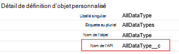
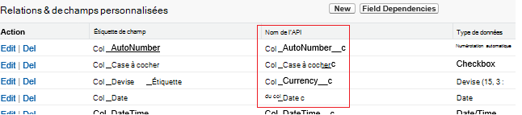

<properties
    pageTitle="Déplacer les données à partir de la force de vente à l’aide de Data Factory | Microsoft Azure"
    description="Obtenir des informations sur la façon de déplacer des données à partir de la force de vente à l’aide d’Azure Data Factory."
    services="data-factory"
    documentationCenter=""
    authors="linda33wj"
    manager="jhubbard"
    editor="monicar"/>

<tags
    ms.service="data-factory"
    ms.workload="data-services"
    ms.tgt_pltfrm="na"
    ms.devlang="na"
    ms.topic="article"
    ms.date="10/25/2016"
    ms.author="jingwang"/>

# Déplacement des données à partir de la force de vente à l’aide d’Azure Data Factory
Cet article décrit comment vous pouvez utiliser les activités de copie dans une usine de données Azure pour copier des données depuis Salesforce dans n’importe quel magasin de données qui est répertorié dans la colonne de récepteur dans le tableau de [prise en charge de sources et les destinations](data-factory-data-movement-activities.md#supported-data-stores) . Cet article s’appuie sur l’article [d’activités de déplacement des données](data-factory-data-movement-activities.md) , qui présente une vue d’ensemble de transfert de données avec l’activité de copie et de combinaisons de magasin de données pris en charge.

Usine de données Azure prend actuellement en charge uniquement déplacer les données depuis Salesforce [stores]((data-factory-data-movement-activities.md#supported-data-stores) de données de récepteur pris en charge mais ne prend pas en charge le déplacement de données à partir d’autres données stocke à la force de vente.

## Conditions préalables
- Vous devez utiliser l’une des éditions suivantes de force de vente : Developer Edition, Édition professionnelle, Édition entreprise ou édition illimité.
- Autorisation de l’API doit être activée. Consultez [comment activer les accès à l’API de la force de vente par le jeu d’autorisations ?](https://www.data2crm.com/migration/faqs/enable-api-access-salesforce-permission-set/)
- Pour copier des données à partir de la force de vente pour les magasins de données local, vous devez disposer au moins données Management Gateway 2.0 est installé dans votre environnement local.

## Limites des demandes de force de vente
Force de vente présente des limites pour les nombre total de demandes API et API de demandes simultanées. Consultez la section « Limites de requête API » dans l’article de [Limites de développeur de force de vente](http://resources.docs.salesforce.com/200/20/en-us/sfdc/pdf/salesforce_app_limits_cheatsheet.pdf) pour plus d’informations. Remarque Si le nombre de demandes simultanées dépasse la limite, la limitation se produit et vous verrez les échecs aléatoires ; Si le nombre total de demandes dépasse la limite, le compte de la force de vente sera bloqué pendant 24 heures ; Vous pouvez également recevoir l’erreur « REQUEST_LIMIT_EXCEEDED » dans les deux scénarios.

## Assistant de duplication des données
La façon la plus simple pour créer un pipeline qui copie les données depuis Salesforce à une des banques de données récepteur pris en charge est d’utiliser l’Assistant de copie de données. Consultez [didacticiel : créer un tuyau à l’aide d’Assistant copie](data-factory-copy-data-wizard-tutorial.md) pour une procédure pas à pas rapides sur la création d’un tuyau à l’aide de l’Assistant de copie de données.

L’exemple suivant fournit des exemples de définitions de JSON qui vous permet de créer un tuyau à l’aide du [portail Azure](data-factory-copy-activity-tutorial-using-azure-portal.md), [Visual Studio](data-factory-copy-activity-tutorial-using-visual-studio.md)ou [Azure PowerShell](data-factory-copy-activity-tutorial-using-powershell.md). Ils illustrent le copier des données depuis Salesforce dans le stockage Blob Azure. Toutefois, les données peuvent être copiées à un des récepteurs indiquée [ici](data-factory-data-movement-activities.md#supported-data-stores) à l’aide de l’activité de copie dans Azure Data Factory.   

## Exemple : Copier des données depuis Salesforce dans un blob Azure
Cet exemple copie les données à partir de la force de vente pour un blob Azure toutes les heures. Les propriétés JSON qui sont utilisées dans ces exemples sont décrites dans les sections après les exemples. Vous pouvez copier des données directement à un des récepteurs qui sont répertoriés dans l’article [d’activités de déplacement des données](data-factory-data-movement-activities.md#supported-data-stores) à l’aide de la copie d’activité dans Azure Data Factory.

Voici les artefacts de données usine que vous aurez besoin pour implémenter le scénario. Les sections qui suivent la liste fournissent plus d’informations sur ces étapes.

- Un service lié de la [force de vente](#salesforce-linked-service-properties) de type
- Un service lié du type [AzureStorage](data-factory-azure-blob-connector.md#azure-storage-linked-service-properties)
- Un [groupe de données](data-factory-create-datasets.md) de d’entrée de type [RelationalTable](#salesforce-dataset-properties)
- Un [groupe de données](data-factory-create-datasets.md) de sortie de type [AzureBlob](data-factory-azure-blob-connector.md#azure-blob-dataset-type-properties)
- Un [pipeline](data-factory-create-pipelines.md) avec une activité de copie qui utilise [RelationalSource](#relationalsource-type-properties) et [BlobSink](data-factory-azure-blob-connector.md#azure-blob-copy-activity-type-properties)

**Service de la force de vente liée**

Cet exemple utilise le service de la **force de vente** liée. Reportez-vous à la section de [force de vente liée de service](#salesforce-linked-service-properties) pour les propriétés qui sont prises en charge par ce service lié.  Pour obtenir des instructions sur la façon de réinitialiser/obtention du jeton de sécurité, consultez [obtenir de jeton de sécurité](https://help.salesforce.com/apex/HTViewHelpDoc?id=user_security_token.htm) .

    {
        "name": "SalesforceLinkedService",
        "properties":
        {
            "type": "Salesforce",
            "typeProperties":
            {
                "username": "<user name>",
                "password": "<password>",
                "securityToken": "<security token>"
            }
        }
    }

**Service de stockage lié Azure**

    {
      "name": "AzureStorageLinkedService",
      "properties": {
        "type": "AzureStorage",
        "typeProperties": {
          "connectionString": "DefaultEndpointsProtocol=https;AccountName=<accountname>;AccountKey=<accountkey>"
        }
      }
    }

**Force de vente de jeu de données d’entrée**

    {
        "name": "SalesforceInput",
        "properties": {
            "linkedServiceName": "SalesforceLinkedService",
            "type": "RelationalTable",
            "typeProperties": {
                "tableName": "AllDataType__c"  
            },
            "availability": {
                "frequency": "Hour",
                "interval": 1
            },
            "external": true,
            "policy": {
                "externalData": {
                    "retryInterval": "00:01:00",
                    "retryTimeout": "00:10:00",
                    "maximumRetry": 3
                }
            }
        }
    }

Le fait de définir **externe** **true** indique le service Factory de données que le dataset est externe à l’usine de données et qu’il n’est pas produit par une activité sur le factory de données.

> [AZURE.IMPORTANT] La partie « __c » du nom de l’API est nécessaire pour tout objet personnalisé.

**Dataset de sortie blob Azure**

Les données sont écrites dans un blob de nouveau toutes les heures (fréquence : heures, l’intervalle : 1).

    {
        "name": "AzureBlobOutput",
        "properties":
        {
            "type": "AzureBlob",
            "linkedServiceName": "AzureStorageLinkedService",
            "typeProperties":
            {
                "folderPath": "adfgetstarted/alltypes_c"
            },
            "availability":
            {
                "frequency": "Hour",
                "interval": 1
            }
        }
    }

**Pipeline avec activité de copie**

Le pipeline contient les activités de copie, qui est configuré pour utiliser l’entrée ci-dessus et la sortie des groupes de données, et est planifié pour s’exécuter toutes les heures. Dans la définition de JSON de pipeline, le type de **source** est défini sur **RelationalSource**, et le type de **récepteurs** est défini à **BlobSink**.

Consultez [les propriétés de type RelationalSource](#relationalsource-type-properties) pour la liste des propriétés qui sont prises en charge par le RelationalSource.

    {  
        "name":"SamplePipeline",
        "properties":{  
            "start":"2016-06-01T18:00:00",
            "end":"2016-06-01T19:00:00",
            "description":"pipeline with copy activity",
            "activities":[  
            {
                "name": "SalesforceToAzureBlob",
                "description": "Copy from Salesforce to an Azure blob",
                "type": "Copy",
                "inputs": [
                {
                    "name": "SalesforceInput"
                }
                ],
                "outputs": [
                {
                    "name": "AzureBlobOutput"
                }
                ],
                "typeProperties": {
                    "source": {
                        "type": "RelationalSource",
                        "query": "SELECT Id, Col_AutoNumber__c, Col_Checkbox__c, Col_Currency__c, Col_Date__c, Col_DateTime__c, Col_Email__c, Col_Number__c, Col_Percent__c, Col_Phone__c, Col_Picklist__c, Col_Picklist_MultiSelect__c, Col_Text__c, Col_Text_Area__c, Col_Text_AreaLong__c, Col_Text_AreaRich__c, Col_URL__c, Col_Text_Encrypt__c, Col_Lookup__c FROM AllDataType__c"             
                    },
                    "sink": {
                        "type": "BlobSink"
                    }
                },
                "scheduler": {
                    "frequency": "Hour",
                    "interval": 1
                },
                "policy": {
                    "concurrency": 1,
                    "executionPriorityOrder": "OldestFirst",
                    "retry": 0,
                    "timeout": "01:00:00"
                }
            }
            ]
        }
    }

> [AZURE.IMPORTANT] La partie « __c » du nom de l’API est nécessaire pour tout objet personnalisé.

## Propriétés du service force de vente liée

Le tableau suivant décrit les éléments JSON qui sont spécifiques au service de la force de vente liée.

| Propriété | Description | Obligatoire |
| -------- | ----------- | -------- |
| type de | La propriété type doit être définie : **force de vente**. | Oui |
| nom d’utilisateur |Spécifiez un nom d’utilisateur du compte d’utilisateur. | Oui |
| mot de passe | Spécifiez un mot de passe pour le compte d’utilisateur.  | Oui |
| jeton de sécurité | Spécifier un jeton de sécurité pour le compte d’utilisateur. Pour obtenir des instructions sur la façon de réinitialiser/obtenir un jeton de sécurité, consultez [obtenir de jeton de sécurité](https://help.salesforce.com/apex/HTViewHelpDoc?id=user_security_token.htm) . Pour en savoir plus sur les jetons de sécurité en général, reportez-vous à la section [sécurité et l’API](https://developer.salesforce.com/docs/atlas.en-us.api.meta/api/sforce_api_concepts_security.htm).  | Oui |

## Propriétés de groupe de données de force de vente

Pour obtenir une liste complète des sections et des propriétés qui sont disponibles pour la définition des groupes de données, consultez l’article de la [Création de groupes de données](data-factory-create-datasets.md) . Sections de structure, de disponibilité et de stratégie d’un groupe de données JSON sont similaires pour tous les types de groupe de données (les SQL Azure, blob Azure, table Azure, etc.).

La section **typeProperties** est différente pour chaque type de groupe de données et fournit des informations sur l’emplacement des données dans le magasin de données. La section typeProperties pour un groupe de données de type **RelationalTable** possède les propriétés suivantes :

| Propriété | Description | Obligatoire |
| -------- | ----------- | -------- |
| tableName | Nom de la table dans la force de vente. | N° (cas d’une **requête** de **RelationalSource** ) |

> [AZURE.IMPORTANT]  La partie « __c » du nom de l’API est nécessaire pour tout objet personnalisé.

## Propriétés de type RelationalSource

Pour obtenir une liste complète des sections et des propriétés qui sont disponibles pour la définition des activités, consultez l’article de [pipelines de création](data-factory-create-pipelines.md) . Les propriétés comme le nom, la description, entrée et sortie de tables, et différentes stratégies sont disponibles pour tous les types d’activités.

Les propriétés qui sont disponibles dans la section typeProperties de l’activité, en revanche, peuvent varier en fonction chaque type d’activité. Pour les activités de copie, qui varient selon les types de sources et les destinations.

Dans l’activité de copie, lorsque la source est de type **RelationalSource** (qui comprend la force de vente), les propriétés suivantes sont disponibles dans la section de typeProperties :

| Propriété | Description | Valeurs autorisées | Obligatoire |
| -------- | ----------- | -------------- | -------- |
| requête | La requête personnalisée permet de lire les données. | Une requête de SQL-92 ou [Langage de requête objet force de vente (SOQL)](https://developer.salesforce.com/docs/atlas.en-us.soql_sosl.meta/soql_sosl/sforce_api_calls_soql.htm) . Par exemple : `select * from MyTable__c`. | Non (si le **tableName** du **groupe de données** est spécifiée). |

> [AZURE.IMPORTANT] La partie « __c » du nom de l’API est nécessaire pour tout objet personnalisé.

## Conseils de recherche

### Récupération de données à l’aide de where clause sur la colonne DateTime
Lorsque vous spécifiez la requête SOQL ou SQL, accordent une attention particulière à la différence de format DateTime. Par exemple :

- **Exemple SOQL**: $$Text.Format (' Sélectionnez l’Id, de nom, de BillingCity de compte où LastModifiedDate > = {0 : yyyy-MM-JJThh} LastModifiedDate et < {1:yyyy-MM-JJThh}', WindowStart, WindowEnd)
- **Exemple SQL**: $$Text.Format ('SELECT * à partir de compte à une LastModifiedDate où > = {{ts\'{0 : yyyy-MM-dd hh : mm :}\'}} LastModifiedDate et < {{ts\'{1:yyyy-MM-JJ HH : mm :}\'}}', WindowStart, WindowEnd)'.

### Récupération des données d’état de la force de vente
Vous pouvez extraire des données à partir de rapports de la force de vente en spécifiant la requête en tant que `{call "<report name>"}`, par exemple, `"query": "{call \"TestReport\"}"`.

### Récupérer des enregistrements supprimés de la Corbeille de la force de vente
Pour interroger les enregistrements supprimés paramétrés à partir de la Corbeille de la force de vente, vous pouvez spécifier **« IsDeleted = 1 »** dans votre requête. Par exemple, 

- Pour seulement les enregistrements supprimés de la requête, spécifiez « sélectionner *à partir de MyTable__c * *où IsDeleted = 1** »
- Pour rechercher tous les enregistrements, y compris les existantes et supprimés, spécifiez « sélectionner *à partir de MyTable__c * *où IsDeleted = 0 ou IsDeleted = 1** »

[AZURE.INCLUDE [data-factory-structure-for-rectangualr-datasets](../../includes/data-factory-structure-for-rectangualr-datasets.md)]

### Mappage de type pour la force de vente
Type de la force de vente | . Type basé sur le NET
--------------- | ---------------
Numérotation automatique | Chaîne
Case à cocher | Valeur booléenne
Devise | Double
Date | DateTime
Date/heure | DateTime
Messagerie | Chaîne
ID | Chaîne
Relation de recherche | Chaîne
Liste déroulante à sélection multiple | Chaîne
Numéro de | Double
Pour cent | Double
Téléphone | Chaîne
Liste de choix | Chaîne
Texte | Chaîne
Zone de texte | Chaîne
Zone de texte (Long) | Chaîne
Zone de texte (RTF) | Chaîne
Texte (crypté) | Chaîne
URL | Chaîne

[AZURE.INCLUDE [data-factory-column-mapping](../../includes/data-factory-column-mapping.md)]
[AZURE.INCLUDE [data-factory-structure-for-rectangualr-datasets](../../includes/data-factory-structure-for-rectangualr-datasets.md)]

## Performances et réglage  
Voir l' [activité de copie de guide des performances et réglage](data-factory-copy-activity-performance.md) en savoir plus sur les facteurs clés de cet impact sur les performances de transfert de données (copie activité) dans Azure Data Factory et les différentes manières de l’optimiser.
