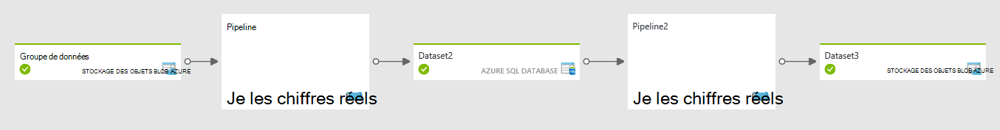

<properties
    pageTitle="Planification et l’exécution avec Data Factory | Microsoft Azure"
    description="Découvrez les aspects de la planification et l’exécution du modèle d’application Azure Data Factory."
    services="data-factory"
    documentationCenter=""
    authors="spelluru"
    manager="jhubbard"
    editor="monicar"/>

<tags
    ms.service="data-factory"
    ms.workload="data-services"
    ms.tgt_pltfrm="na"
    ms.devlang="na"
    ms.topic="article"
    ms.date="08/22/2016"
    ms.author="spelluru"/>

# Données de planification en usine et de l’exécution
Cet article explique les aspects de la planification et l’exécution du modèle d’application Azure Data Factory. 

## Conditions préalables
Cet article suppose que vous comprenez les notions de base des concepts de modèle application Data Factory, y compris l’activité, de tuyaux, de services liés et de groupes de données. Pour connaître les concepts fondamentaux de fabrique de données Azure, consultez les articles suivants :

- [Introduction à la fabrique de données](data-factory-introduction.md)
- [Pipelines](data-factory-create-pipelines.md)
- [Groupes de données](data-factory-create-datasets.md) 

## Planifier une activité

Avec la section Planificateur de l’activité de JSON, vous pouvez spécifier une planification périodique pour une activité. Par exemple, vous pouvez planifier une activité de toutes les heures comme suit :

    "scheduler": {
        "frequency": "Hour",
        "interval": 1
    },  

Comme illustré dans le diagramme, la définition d’un planning pour l’activité crée une série de fenêtres de qui s’écroulent. Qui s’écroulent windows sont une série d’intervalles de temps de taille fixe, sans chevauchement, contigu. Ces fenêtres qui s’écroulent logique de l’activité sont appelées *windows de l’activité*.

Pour la fenêtre activité en cours d’exécution, vous pouvez accéder à l’intervalle de temps correspondant à la fenêtre d’activité avec les variables système [WindowStart](data-factory-functions-variables.md#data-factory-system-variables) et [WindowEnd](data-factory-functions-variables.md#data-factory-system-variables) dans l’activité JSON. Vous pouvez utiliser ces variables dans des buts différents dans votre activité JSON. Par exemple, vous pouvez utiliser pour sélectionner les données à partir de jeux de données d’entrée et de sortie qui représente les données de série de temps.

La propriété **Planificateur** prend en charge les sous-propriétés de mêmes que la propriété de **disponibilité** dans un groupe de données. Pour plus d’informations, reportez-vous à la section [disponibilité du groupe de données](data-factory-create-datasets.md#Availability) . Exemples : planification à un décalage spécifique ou définition du mode d’aligner le traitement au début ou à la fin de l’intervalle de la fenêtre d’activité.

Vous pouvez spécifier les propriétés de **Planificateur** pour une activité, mais cette propriété est **facultative**. Si vous ne spécifiez pas une propriété, il doit correspondre à la cadence que vous spécifiez dans la définition de groupe de données de sortie. Actuellement, dataset de sortie est un élément moteur la planification, vous devez créer un groupe de données de sortie même si l’activité ne produit pas de sortie. Si l’activité n’accepte aucune entrée, vous pouvez ignorer la création du groupe de données d’entrée.

## Tranches de groupes de données et les données de série heure

Les données de série de temps sont une séquence continue de points de données qui se compose généralement de mesurages successifs, effectués sur un intervalle de temps. Exemples courants de données série au moment incluent les données des capteurs et des données de télémétrie d’application.

Avec Data Factory, vous pouvez traiter l’exécution de série de données d’une manière par lot avec l’activité. Il est généralement une cadence périodique à laquelle les données d’entrée arrivent et sortie de données doivent être produites. Cette cadence est modélisée en spécifiant de **disponibilité** dans le groupe de données comme suit :

    "availability": {
      "frequency": "Hour",
      "interval": 1
    },

Chaque unité de données consommé et produit par une exécution de l’activité est appelée une tranche de données. Le diagramme suivant illustre un exemple d’une activité avec un groupe de données d’entrée et un groupe de données de sortie. Ces ensembles de données ont la **disponibilité** définie sur une fréquence horaire.

Le schéma ci-dessus illustre les tranches de données horaires pour le groupe de données d’entrée et de sortie. Le diagramme illustre trois tranches d’entrée qui sont prêts pour le traitement. L’activité de 10-11 AM est en cours, en produisant de la tranche de sortie de 10-11 h.

Vous pouvez accéder à l’intervalle de temps associée à la tranche actuelle produite dans le groupe de données JSON avec variables [SliceStart](data-factory-functions-variables.md#data-factory-system-variables) et [SliceEnd](data-factory-functions-variables.md#data-factory-system-variables).

Actuellement, Data Factory nécessite que le calendrier spécifié dans l’activité exactement correspond à la planification spécifiée dans la **disponibilité** du groupe de données de sortie. Par conséquent, **WindowStart**, **WindowEnd**, **SliceStart**et **SliceEnd** sont toujours mappent à la même période et une tranche de sortie unique.

Pour plus d’informations sur les différentes propriétés disponibles pour la section disponibilité, consultez [Création de groupes de données](data-factory-create-datasets.md).

## Déplacement des données à partir de la base de données SQL pour le stockage des objets Blob

Nous allons placer certaines choses ensemble et en action par la création d’un pipeline qui copie les données d’une table de base de données de SQL Azure pour le stockage des objets Blob Azure toutes les heures.

**D’entrée : Jeu de données une base de données SQL Azure**

    {
        "name": "AzureSqlInput",
        "properties": {
            "published": false,
            "type": "AzureSqlTable",
            "linkedServiceName": "AzureSqlLinkedService",
            "typeProperties": {
                "tableName": "MyTable"
            },
            "availability": {
                "frequency": "Hour",
                "interval": 1
            },
            "external": true,
            "policy": {}
        }
    }

**Fréquence** est réglée sur **l’heure** et **l’intervalle** est défini sur **1** dans la section disponibilité.

**Sortie : Dataset de stockage Blob Azure**

    {
        "name": "AzureBlobOutput",
        "properties": {
            "published": false,
            "type": "AzureBlob",
            "linkedServiceName": "StorageLinkedService",
            "typeProperties": {
                "folderPath": "mypath/{Year}/{Month}/{Day}/{Hour}",
                "format": {
                    "type": "TextFormat"
                },
                "partitionedBy": [
                    {
                        "name": "Year",
                        "value": {
                            "type": "DateTime",
                            "date": "SliceStart",
                            "format": "yyyy"
                        }
                    },
                    {
                        "name": "Month",
                        "value": {
                            "type": "DateTime",
                            "date": "SliceStart",
                            "format": "%M"
                        }
                    },
                    {
                        "name": "Day",
                        "value": {
                            "type": "DateTime",
                            "date": "SliceStart",
                            "format": "%d"
                        }
                    },
                    {
                        "name": "Hour",
                        "value": {
                            "type": "DateTime",
                            "date": "SliceStart",
                            "format": "%H"
                        }
                    }
                ]
            },
            "availability": {
                "frequency": "Hour",
                "interval": 1
            }
        }
    }

**Fréquence** est réglée sur **l’heure** et **l’intervalle** est défini sur **1** dans la section disponibilité.

**: Activité copie**

    {
        "name": "SamplePipeline",
        "properties": {
            "description": "copy activity",
            "activities": [
                {
                    "type": "Copy",
                    "name": "AzureSQLtoBlob",
                    "description": "copy activity",
                    "typeProperties": {
                        "source": {
                            "type": "SqlSource",
                            "sqlReaderQuery": "$$Text.Format('select * from MyTable where timestampcolumn >= \\'{0:yyyy-MM-dd HH:mm}\\' AND timestampcolumn < \\'{1:yyyy-MM-dd HH:mm}\\'', WindowStart, WindowEnd)"
                        },
                        "sink": {
                            "type": "BlobSink",
                            "writeBatchSize": 100000,
                            "writeBatchTimeout": "00:05:00"
                        }
                    },
                    "inputs": [
                        {
                            "name": "AzureSQLInput"
                        }
                    ],
                    "outputs": [
                        {
                            "name": "AzureBlobOutput"
                        }
                    ],
                    "scheduler": {
                        "frequency": "Hour",
                        "interval": 1
                    }
                }
            ],
            "start": "2015-01-01T08:00:00Z",
            "end": "2015-01-01T11:00:00Z"
        }
    }

L’exemple montre la planification de l’activité et définir des sections de disponibilité de groupe de données à une fréquence horaire. L’exemple montre comment vous pouvez utiliser **WindowStart** et **WindowEnd** pour sélectionner les données pertinentes pour une activité de s’exécuter et les copier dans un blob avec la approprié **folderPath**. Le **folderPath** est paramétrée pour un dossier distinct pour chaque heure.

Lorsque trois secteurs entre 8 – 11 à exécuter, les données de la base de données de SQL Azure sont la suivante :

Une fois que le pipeline déploie, le blob Azure est renseigné comme suit :

-   Fichier mypath/2015, 1/1/8/données. &lt;Guid&gt;.txt avec des données

            10002345,334,2,2015-01-01 08:24:00.3130000
            10002345,347,15,2015-01-01 08:24:00.6570000
            10991568,2,7,2015-01-01 08:56:34.5300000

    > [AZURE.NOTE] &lt;GUID&gt; est remplacée par un guid réel. Exemple de nom de fichier : Data.bcde1348-7620-4f93-bb89-0eed3455890b.txt
-   Fichier mypath/2015, 1/1/9/données. &lt;Guid&gt;.txt avec les données :

            10002345,334,1,2015-01-01 09:13:00.3900000
            24379245,569,23,2015-01-01 09:25:00.3130000
            16777799,21,115,2015-01-01 09:47:34.3130000
-   Fichier 2015/mypath/1/10/1/données. &lt;Guid&gt;.txt sans données.

## Période active pour tuyau

[Création de tuyaux](data-factory-create-pipelines.md) a introduit le concept d’une période active pour un pipeline spécifié en définissant les propriétés **start** et **end** .

Vous pouvez définir la date de début pour la période active de pipeline dans le passé. Usine de données calcule (remplissages arrière) à toutes les tranches de données dans le passé automatiquement et commence à les traiter.

## Traitement parallèle des tranches de données
Vous pouvez configurer des tranches de données de renvoyées pour être exécutés en parallèle en définissant la propriété de la **concurrence d’accès** dans la section de la stratégie de l’activité de JSON. Pour plus d’informations sur cette propriété, consultez [les pipelines de création](data-factory-create-pipelines.md).

## Réexécuter une tranche de données a échoué 
Vous pouvez surveiller l’exécution des tranches de manière riche et visual. Pour plus d’informations, consultez [surveillance et gestion des pipelines à l’aide de lames de portail Azure](data-factory-monitor-manage-pipelines.md) ou [application de surveillance et de gestion](data-factory-monitor-manage-app.md) .

Prenons l’exemple suivant, qui montre les deux activités. Activity1 produit un dataset de série de temps avec les tranches en tant que sortie qui est utilisée comme entrée par Activity2 pour générer le groupe de données série de temps la sortie finale.

Le diagramme montre que de trois tranches récentes, s’est produite une panne de production de la tranche de 10-9 AM pour Dataset2. Usine de données effectue automatiquement le suivi dépendance pour le groupe de données de série de temps. Par conséquent, il ne démarre pas l’activité d’exécution pour la section en aval de 9-10 h.

Outils de surveillance et de gestion de données usine vous autorisent à effectuer un zoom avant dans les journaux de diagnostic pour la tranche ayant échouée rechercher la cause du problème et de le corriger facilement. Après avoir résolu le problème, vous pouvez facilement démarrer l’activité exécutée pour produire la tranche ayant échouée. Pour plus de détails sur la manière de relancer et de comprendre les transitions d’état pour les tranches de données, consultez [surveillance et gestion des pipelines à l’aide de lames de portail Azure](data-factory-monitor-manage-pipelines.md) ou [application de surveillance et de gestion](data-factory-monitor-manage-app.md).

Une fois que vous exécutez de nouveau la section 9-10 AM **Dataset2**, Data Factory démarre l’exécution de la tranche dépendant de 10-9 AM sur le groupe de données final.

## Exécution d’activités dans une séquence
Vous pouvez chaîner les deux activités (exécutée d’une activité après l’autre) en définissant le groupe de données de sortie d’une activité en tant que le jeu de données d’entrée de l’autre activité. Les activités peuvent être dans le même tuyau ou de pipelines différentes. La deuxième activité s’exécute uniquement lorsque le se termine correctement.

Par exemple, prenons le cas suivant :

1.  P1 de pipeline a A1 activité qui requiert un dataset d’entrée externe D1 et produit le dataset de sortie D2.
2.  Pipeline P2 a A2 activité qui nécessite une entrée de groupe de données D2 et produit le dataset de sortie D3.

Dans ce scénario, les activités A1 et A2 sont dans des pipelines différentes. L’activité A1 s’exécute lorsque les données externes soient disponibles et la fréquence de disponibilité programmée est atteinte. L’activité A2 s’exécute lorsque les tranches de planifié à partir de D2 deviennent disponibles et la fréquence de disponibilité programmée est atteinte. S’il existe une erreur dans un des secteurs de dataset D2, A2 ne s’exécute pas pour ce secteur jusqu'à ce qu’il devienne disponible.

La vue diagramme se présenterait comme suit :

Comme mentionné précédemment, les activités peuvent être dans le même tuyau. L’affichage de tâches avec les deux activités dans le même tuyau doit ressembler à l’illustration suivante :

### Copier de manière séquentielle
Il est possible d’exécuter plusieurs opérations de copie un après l’autre de manière séquentielle/commandé. Par exemple, peut avoir deux activités copie dans un pipeline (CopyActivity1 et CopyActivity2) avec les jeux de données de sortie des données d’entrée suivant :   

CopyActivity1

Entrée : groupe de données. Sortie : Dataset2.

CopyActivity2

Entrée : Dataset2.  Sortie : Dataset3.

CopyActivity2 s’exécute uniquement si le CopyActivity1 a été exécuté avec succès et Dataset2 est disponible.

Voici le pipeline exemple JSON :

    {
        "name": "ChainActivities",
        "properties": {
            "description": "Run activities in sequence",
            "activities": [
                {
                    "type": "Copy",
                    "typeProperties": {
                        "source": {
                            "type": "BlobSource"
                        },
                        "sink": {
                            "type": "BlobSink",
                            "copyBehavior": "PreserveHierarchy",
                            "writeBatchSize": 0,
                            "writeBatchTimeout": "00:00:00"
                        }
                    },
                    "inputs": [
                        {
                            "name": "Dataset1"
                        }
                    ],
                    "outputs": [
                        {
                            "name": "Dataset2"
                        }
                    ],
                    "policy": {
                        "timeout": "01:00:00"
                    },
                    "scheduler": {
                        "frequency": "Hour",
                        "interval": 1
                    },
                    "name": "CopyFromBlob1ToBlob2",
                    "description": "Copy data from a blob to another"
                },
                {
                    "type": "Copy",
                    "typeProperties": {
                        "source": {
                            "type": "BlobSource"
                        },
                        "sink": {
                            "type": "BlobSink",
                            "writeBatchSize": 0,
                            "writeBatchTimeout": "00:00:00"
                        }
                    },
                    "inputs": [
                        {
                            "name": "Dataset2"
                        }
                    ],
                    "outputs": [
                        {
                            "name": "Dataset3"
                        }
                    ],
                    "policy": {
                        "timeout": "01:00:00"
                    },
                    "scheduler": {
                        "frequency": "Hour",
                        "interval": 1
                    },
                    "name": "CopyFromBlob2ToBlob3",
                    "description": "Copy data from a blob to another"
                }
            ],
            "start": "2016-08-25T01:00:00Z",
            "end": "2016-08-25T01:00:00Z",
            "isPaused": false
        }
    }

Notez que dans l’exemple, le groupe de données de sortie de la première activité de copie (Dataset2) est spécifié en tant qu’entrée pour la deuxième activité. Par conséquent, la deuxième activité s’exécute uniquement lorsque le groupe de données de sortie de la première activité est prêt.  

Dans l’exemple, CopyActivity2 peut avoir une entrée différente, comme Dataset3, mais vous spécifiez Dataset2 en tant qu’entrée pour CopyActivity2, afin que l’activité ne s’exécute pas avant la fin de CopyActivity1. Par exemple :

CopyActivity1

Entrée : Dataset1. Sortie : Dataset2.

CopyActivity2

Entrées : Dataset3, Dataset2. Sortie : Dataset4.

    {
        "name": "ChainActivities",
        "properties": {
            "description": "Run activities in sequence",
            "activities": [
                {
                    "type": "Copy",
                    "typeProperties": {
                        "source": {
                            "type": "BlobSource"
                        },
                        "sink": {
                            "type": "BlobSink",
                            "copyBehavior": "PreserveHierarchy",
                            "writeBatchSize": 0,
                            "writeBatchTimeout": "00:00:00"
                        }
                    },
                    "inputs": [
                        {
                            "name": "Dataset1"
                        }
                    ],
                    "outputs": [
                        {
                            "name": "Dataset2"
                        }
                    ],
                    "policy": {
                        "timeout": "01:00:00"
                    },
                    "scheduler": {
                        "frequency": "Hour",
                        "interval": 1
                    },
                    "name": "CopyFromBlobToBlob",
                    "description": "Copy data from a blob to another"
                },
                {
                    "type": "Copy",
                    "typeProperties": {
                        "source": {
                            "type": "BlobSource"
                        },
                        "sink": {
                            "type": "BlobSink",
                            "writeBatchSize": 0,
                            "writeBatchTimeout": "00:00:00"
                        }
                    },
                    "inputs": [
                        {
                            "name": "Dataset3"
                        },
                        {
                            "name": "Dataset2"
                        }
                    ],
                    "outputs": [
                        {
                            "name": "Dataset4"
                        }
                    ],
                    "policy": {
                        "timeout": "01:00:00"
                    },
                    "scheduler": {
                        "frequency": "Hour",
                        "interval": 1
                    },
                    "name": "CopyFromBlob3ToBlob4",
                    "description": "Copy data from a blob to another"
                }
            ],
            "start": "2017-04-25T01:00:00Z",
            "end": "2017-04-25T01:00:00Z",
            "isPaused": false
        }
    }

Notez que dans l’exemple, les deux jeux de données d’entrée est spécifiés pour la seconde activité de copie. Lorsque plusieurs entrées sont spécifiées, le premier dataset d’entrée est utilisé pour copier les données, mais les autres jeux de données est utilisés en tant que dépendances. CopyActivity2 commencerait uniquement après que les conditions suivantes sont remplies :

- CopyActivity1 a terminé avec succès et Dataset2 est disponible. Ce groupe de données n’est pas utilisé lors de la copie de données à Dataset4. Il agit uniquement comme une dépendance de planification pour CopyActivity2.   
- Dataset3 est disponible. Ce groupe de données représente les données qui sont copiées dans la destination.  

## Modèle de groupes de données avec des fréquences différentes

Dans les exemples, les fréquences de jeux de données d’entrée et de sortie et la fenêtre de planification d’activité étaient identiques. Certains scénarios requièrent la possibilité de produire une sortie à une fréquence différente de fréquences d’une ou plusieurs entrées. Usine de données prend en charge la modélisation de ces scénarios.

### Exemple 1 : Générer un rapport quotidien de sortie pour les données d’entrée qui est disponibles à toutes les heures

Imaginez un scénario dans lequel vous avez d’entrée des données de mesure à partir de capteurs disponibles toutes les heures dans le stockage Azure Blob. Vous voulez produire un rapport d’agrégation quotidien avec des statistiques telles que moyenne, maximum et minimum pour ce jour avec [l’activité de la ruche Data Factory](data-factory-hive-activity.md).

Voici comment vous pouvez modéliser ce scénario avec Data Factory :

**Jeu de données d’entrée**

Les fichiers d’entrée horaires sont supprimés dans le dossier pour le jour donné. Disponibilité pour l’entrée est définie en **heures** (fréquence : heures, l’intervalle : 1).

    {
      "name": "AzureBlobInput",
      "properties": {
        "type": "AzureBlob",
        "linkedServiceName": "StorageLinkedService",
        "typeProperties": {
          "folderPath": "mycontainer/myfolder/{Year}/{Month}/{Day}/",
          "partitionedBy": [
            { "name": "Year", "value": {"type": "DateTime","date": "SliceStart","format": "yyyy"}},
            { "name": "Month","value": {"type": "DateTime","date": "SliceStart","format": "%M"}},
            { "name": "Day","value": {"type": "DateTime","date": "SliceStart","format": "%d"}}
          ],
          "format": {
            "type": "TextFormat"
          }
        },
        "external": true,
        "availability": {
          "frequency": "Hour",
          "interval": 1
        }
      }
    }

**Dataset de sortie**

Un fichier de sortie est créé chaque jour dans le dossier de jour. Disponibilité de la production est fixée à **jour** (fréquence : jour et intervalle : 1).

    {
      "name": "AzureBlobOutput",
      "properties": {
        "type": "AzureBlob",
        "linkedServiceName": "StorageLinkedService",
        "typeProperties": {
          "folderPath": "mycontainer/myfolder/{Year}/{Month}/{Day}/",
          "partitionedBy": [
            { "name": "Year", "value": {"type": "DateTime","date": "SliceStart","format": "yyyy"}},
            { "name": "Month","value": {"type": "DateTime","date": "SliceStart","format": "%M"}},
            { "name": "Day","value": {"type": "DateTime","date": "SliceStart","format": "%d"}}
          ],
          "format": {
            "type": "TextFormat"
          }
        },
        "availability": {
          "frequency": "Day",
          "interval": 1
        }
      }
    }

**: Activité ruche dans un pipeline**

Le script de la ruche reçoit les informations de *date* appropriées en tant que paramètres qui utilisent la variable **WindowStart** comme indiqué dans l’extrait de code suivant. Le script de la ruche utilise cette variable de charger les données à partir du dossier approprié pour le jour et l’exécution de l’agrégation pour générer la sortie.

        {  
            "name":"SamplePipeline",
            "properties":{  
            "start":"2015-01-01T08:00:00",
            "end":"2015-01-01T11:00:00",
            "description":"hive activity",
            "activities": [
                {
                    "name": "SampleHiveActivity",
                    "inputs": [
                        {
                            "name": "AzureBlobInput"
                        }
                    ],
                    "outputs": [
                        {
                            "name": "AzureBlobOutput"
                        }
                    ],
                    "linkedServiceName": "HDInsightLinkedService",
                    "type": "HDInsightHive",
                    "typeProperties": {
                        "scriptPath": "adftutorial\\hivequery.hql",
                        "scriptLinkedService": "StorageLinkedService",
                        "defines": {
                            "Year": "$$Text.Format('{0:yyyy}',WindowStart)",
                            "Month": "$$Text.Format('{0:%M}',WindowStart)",
                            "Day": "$$Text.Format('{0:%d}',WindowStart)"
                        }
                    },
                    "scheduler": {
                        "frequency": "Day",
                        "interval": 1
                    },          
                    "policy": {
                        "concurrency": 1,
                        "executionPriorityOrder": "OldestFirst",
                        "retry": 2,
                        "timeout": "01:00:00"
                    }
                 }
             ]
           }
        }

Le diagramme suivant illustre le scénario à partir d’un point de vue de données de dépendance.

La tranche de sortie de chaque jour dépend de 24 tranches horaires d’un groupe de données d’entrée. Usine de données calcule ces dépendances automatiquement par déterminer les tranches qui se trouvent dans la même période de temps que la tranche de sortie à produire les données d’entrée. Si une des 24 secteurs d’entrée n’est pas disponible, Data Factory attend la tranche d’entrée avant de démarrer l’activité quotidienne exécutée.

### Exemple 2 : Spécifier la dépendance avec des expressions et des fonctions de Data Factory

Prenons l’exemple d’un autre scénario. Supposons que vous ayez une activité de ruche qui traite les deux jeux de données d’entrée. Un d’eux a des nouvelles données tous les jours, mais un d’eux Obtient de nouvelles données chaque semaine. Supposons que vous vouliez faire une jointure entre les deux entrées et produire une sortie tous les jours.

L’approche simple dans lequel Data Factory automatiquement chiffres de droite d’entrée tranches à traiter, en aligner à la sortie, les temps de la tranche de données période ne fonctionnent pas.

Vous devez spécifier que pour chaque activité de s’exécutée, le Factory de données doit utiliser tranche de données la semaine dernière pour le dataset d’entrée hebdomadaire. Vous utilisez des fonctions d’Azure Data Factory comme indiqué dans l’extrait de code suivant pour implémenter ce comportement.

**Input1 : Les blob Azure**

La première entrée est le blob Azure mis à jour quotidiennement.

    {
      "name": "AzureBlobInputDaily",
      "properties": {
        "type": "AzureBlob",
        "linkedServiceName": "StorageLinkedService",
        "typeProperties": {
          "folderPath": "mycontainer/myfolder/{Year}/{Month}/{Day}/",
          "partitionedBy": [
            { "name": "Year", "value": {"type": "DateTime","date": "SliceStart","format": "yyyy"}},
            { "name": "Month","value": {"type": "DateTime","date": "SliceStart","format": "%M"}},
            { "name": "Day","value": {"type": "DateTime","date": "SliceStart","format": "%d"}}
          ],
          "format": {
            "type": "TextFormat"
          }
        },
        "external": true,
        "availability": {
          "frequency": "Day",
          "interval": 1
        }
      }
    }

**Input2 : Les blob Azure**

Input2 est le blob Azure mis à jour chaque semaine.

    {
      "name": "AzureBlobInputWeekly",
      "properties": {
        "type": "AzureBlob",
        "linkedServiceName": "StorageLinkedService",
        "typeProperties": {
          "folderPath": "mycontainer/myfolder/{Year}/{Month}/{Day}/",
          "partitionedBy": [
            { "name": "Year", "value": {"type": "DateTime","date": "SliceStart","format": "yyyy"}},
            { "name": "Month","value": {"type": "DateTime","date": "SliceStart","format": "%M"}},
            { "name": "Day","value": {"type": "DateTime","date": "SliceStart","format": "%d"}}
          ],
          "format": {
            "type": "TextFormat"
          }
        },
        "external": true,
        "availability": {
          "frequency": "Day",
          "interval": 7
        }
      }
    }

**Sortie : Blob Azure**

Un fichier de sortie est créé chaque jour dans le dossier pour le jour. Disponibilité de la production est définie sur **jour** (fréquence : jour, intervalle : 1).

    {
      "name": "AzureBlobOutputDaily",
      "properties": {
        "type": "AzureBlob",
        "linkedServiceName": "StorageLinkedService",
        "typeProperties": {
          "folderPath": "mycontainer/myfolder/{Year}/{Month}/{Day}/",
          "partitionedBy": [
            { "name": "Year", "value": {"type": "DateTime","date": "SliceStart","format": "yyyy"}},
            { "name": "Month","value": {"type": "DateTime","date": "SliceStart","format": "%M"}},
            { "name": "Day","value": {"type": "DateTime","date": "SliceStart","format": "%d"}}
          ],
          "format": {
            "type": "TextFormat"
          }
        },
        "availability": {
          "frequency": "Day",
          "interval": 1
        }
      }
    }

**: Activité ruche dans un pipeline**

L’activité de la ruche prend deux entrées et génère une tranche de sortie tous les jours. Vous pouvez spécifier la tranche de sortie de tous les jours pour dépendent de tranche d’entrée de la la semaine précédente pour l’entrée hebdomadaire comme suit.

    {  
        "name":"SamplePipeline",
        "properties":{  
        "start":"2015-01-01T08:00:00",
        "end":"2015-01-01T11:00:00",
        "description":"hive activity",
        "activities": [
          {
            "name": "SampleHiveActivity",
            "inputs": [
              {
                "name": "AzureBlobInputDaily"
              },
              {
                "name": "AzureBlobInputWeekly",
                "startTime": "Date.AddDays(SliceStart, - Date.DayOfWeek(SliceStart))",
                "endTime": "Date.AddDays(SliceEnd,  -Date.DayOfWeek(SliceEnd))"  
              }
            ],
            "outputs": [
              {
                "name": "AzureBlobOutputDaily"
              }
            ],
            "linkedServiceName": "HDInsightLinkedService",
            "type": "HDInsightHive",
            "typeProperties": {
              "scriptPath": "adftutorial\\hivequery.hql",
              "scriptLinkedService": "StorageLinkedService",
              "defines": {
                "Year": "$$Text.Format('{0:yyyy}',WindowStart)",
                "Month": "$$Text.Format('{0:%M}',WindowStart)",
                "Day": "$$Text.Format('{0:%d}',WindowStart)"
              }
            },
            "scheduler": {
              "frequency": "Day",
              "interval": 1
            },          
            "policy": {
              "concurrency": 1,
              "executionPriorityOrder": "OldestFirst",
              "retry": 2,  
              "timeout": "01:00:00"
            }
           }
         ]
       }
    }

## Les variables système et les fonctions de données en usine   

Pour obtenir une liste des fonctions et des variables système qui fabrique des données prend en charge, reportez-vous à la section [variables système et les fonctions de Data Factory](data-factory-functions-variables.md) .

## Plongée des dépendances de données

Pour générer une partie de dataset à une exécution de l’activité, Data Factory utilise suivant un *modèle de dépendance* afin de déterminer les relations entre les groupes de données consommé et produit par une activité.

La plage horaire des jeux de données d’entrée requises pour générer la tranche de dataset de sortie est appelée la *période de dépendance*.

Une exécution de l’activité génère une coupe de dataset uniquement après que les tranches de données dans des groupes de données d’entrée dans la période de dépendance sont disponibles. En d’autres termes, toutes les sections d’entrée comprenant la période de dépendance doivent être dans un état **prêt** pour l’activité de s’exécuter afin de produire une coupe de dataset de sortie.

Pour générer la tranche dataset [**début**, **fin**], une fonction doit correspondre à la tranche du groupe de données à sa période de dépendance. Cette fonction est essentiellement une formule qui convertit le début et la fin de la tranche du groupe de données pour le début et la fin de la période de dépendance. Plus formellement :

    DatasetSlice = [start, end]
    DependecyPeriod = [f(start, end), g(start, end)]

Les fonctions qui calculent le début et la fin de la période de dépendance pour chaque activité d’entrée de **F** et **g** sont mappage.

Comme dans les exemples, la période de dépendance est identique à celle de la période de la tranche de données qui est produite. Dans ces cas, Data Factory calcule automatiquement les tranches d’entrée qui se trouvent dans la période de dépendance.  

Par exemple, dans l’exemple d’agrégation où la sortie est générée chaque jour et données d’entrée sont disponibles toutes les heures, la période de tranche de données est de 24 heures. Usine de données recherche l’entrée horaire pertinente tranches pour cette période et rend la tranche de sortie dépend de la tranche d’entrée.

Vous pouvez également fournir votre propre mappage pour la période de dépendance, comme illustré dans l’exemple, où l’une des entrées est hebdomadaire et la tranche de sortie se produit tous les jours.

## Validation et la dépendance des données

Un groupe de données peut avoir une stratégie de validation définie qui spécifie comment les données générées par l’exécution d’une tranche peuvent être validées avant qu’il soit prêt à la consommation. Pour plus d’informations, consultez [Création de groupes de données](data-factory-create-datasets.md) .

Dans ce cas, après que la tranche a terminé l’exécution, l’état de tranche de sortie est modifié en **attente** un sous-état de **Validation**. Une fois les tranches sont validés, l’état de la tranche devient **prêt**.

Si une tranche de données a été générée, mais n’a pas réussi la validation, les séries d’activité pour les tranches en aval qui dépendent de cette tranche ne sont pas traités.

[Moniteur et de gérer les pipelines](data-factory-monitor-manage-pipelines.md) décrit les différents États de tranches de données dans Data Factory.

## Données externes

Un groupe de données peut être marqué comme étant externe (comme illustré dans l’extrait suivant de JSON), soit qu'il n’a pas été généré avec Data Factory. Dans ce cas, la stratégie de groupe de données peut avoir un ensemble de paramètres décrivant la validation supplémentaire et réessayer de stratégie pour le groupe de données. Pour obtenir une description de toutes les propriétés, reportez-vous à la section [Création pipelines](data-factory-create-pipelines.md) .

Similaire aux groupes de données qui sont produits par l’usine de données, des tranches de données pour les données externes doivent être prêts avant le traitement de tranches dépendants.

    {
        "name": "AzureSqlInput",
        "properties":
        {
            "type": "AzureSqlTable",
            "linkedServiceName": "AzureSqlLinkedService",
            "typeProperties":
            {
                "tableName": "MyTable"
            },
            "availability":
            {
                "frequency": "Hour",
                "interval": 1     
            },
            "external": true,
            "policy":
            {
                "externalData":
                {
                    "retryInterval": "00:01:00",
                    "retryTimeout": "00:10:00",
                    "maximumRetry": 3
                }
            }  
        }
    }

## Canalisation unique
Vous pouvez créer et planifier un tuyau pour une exécution périodique (par exemple : toutes les heures ou tous les jours) dans les heures de début et de fin que vous spécifiez dans la définition de pipeline. Pour plus d’informations, voir [les activités de planification](#scheduling-and-execution) . Vous pouvez également créer un pipeline qui s’exécute qu’une seule fois. Pour ce faire, vous définissez la propriété **pipelineMode** dans la définition de pipeline **unique** comme indiqué dans l’exemple suivant de JSON. La valeur par défaut de cette propriété est **planifiée**.

    {
        "name": "CopyPipeline",
        "properties": {
            "activities": [
                {
                    "type": "Copy",
                    "typeProperties": {
                        "source": {
                            "type": "BlobSource",
                            "recursive": false
                        },
                        "sink": {
                            "type": "BlobSink",
                            "writeBatchSize": 0,
                            "writeBatchTimeout": "00:00:00"
                        }
                    },
                    "inputs": [
                        {
                            "name": "InputDataset"
                        }
                    ],
                    "outputs": [
                        {
                            "name": "OutputDataset"
                        }
                    ]
                    "name": "CopyActivity-0"
                }
            ]
            "pipelineMode": "OneTime"
        }
    }

Notez les points suivants :

- Les heures de **début** et de **fin** pour le pipeline ne sont pas spécifiés.
- **Disponibilité** de jeux de données d’entrée et de sortie est spécifié (**fréquence** et **intervalle**), même si Data Factory n’utilise pas les valeurs.  
- Vue de diagramme n’affiche pas de pipelines uniques. Ce comportement est voulu par la conception.
- Pipelines uniques ne peut pas être mis à jour. Vous pouvez cloner une canalisation unique, renommer, mettre à jour les propriétés et le déployer pour créer un autre.
