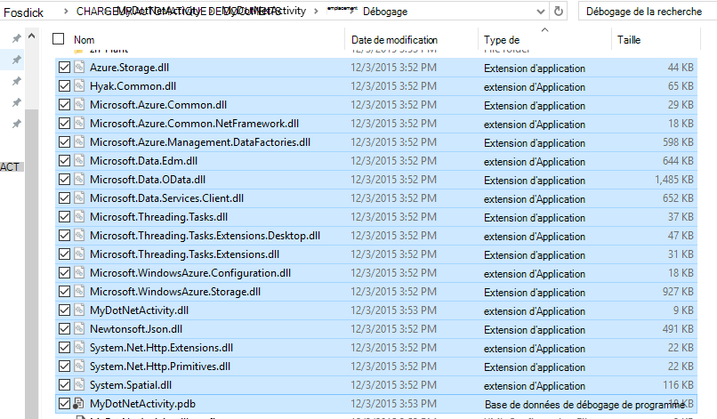
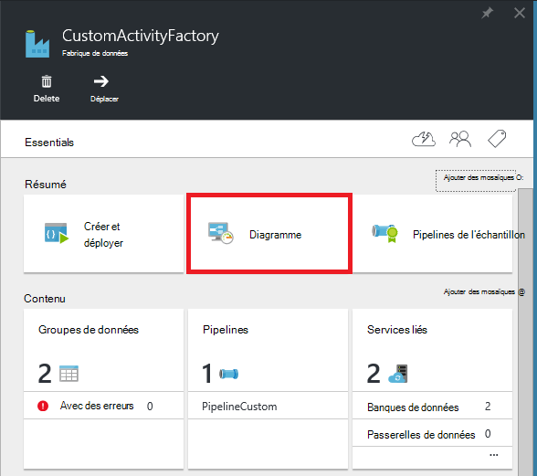
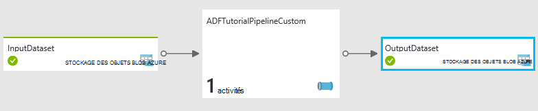
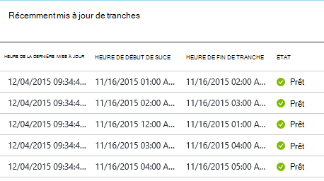
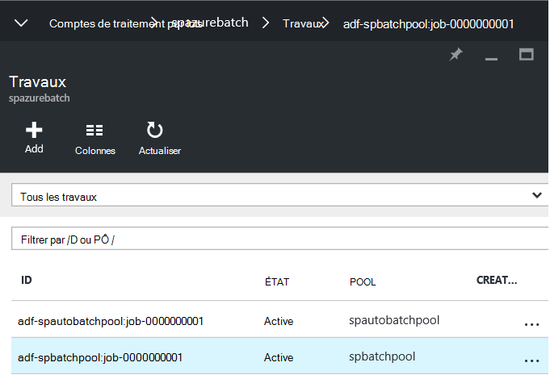
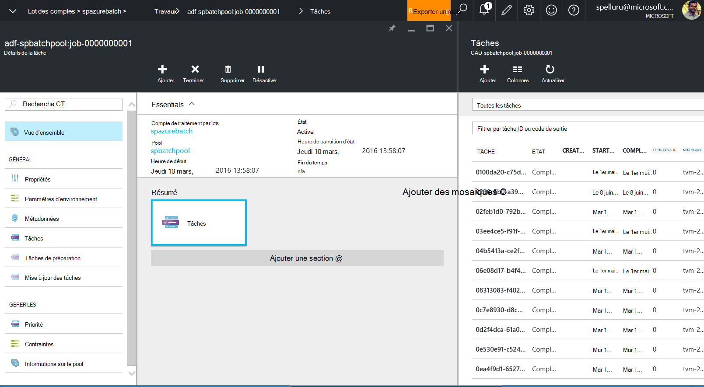
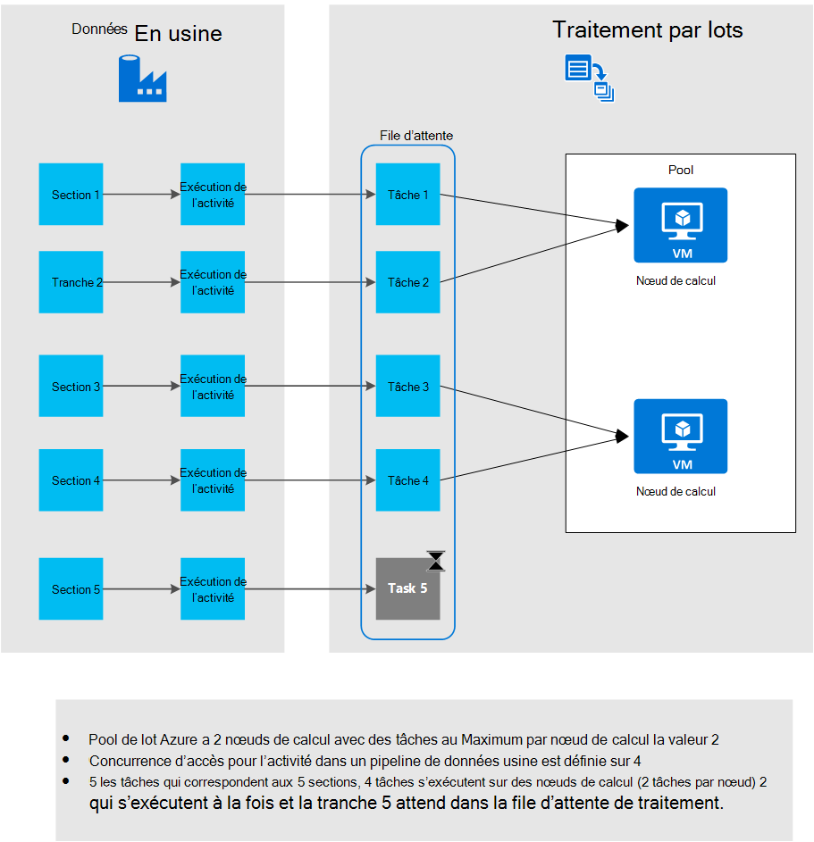

<properties
    pageTitle="Utiliser des activités personnalisées dans un pipeline Azure Data Factory"
    description="Apprenez à créer des activités personnalisées et de les utiliser dans un pipeline Azure Data Factory."
    services="data-factory"
    documentationCenter=""
    authors="spelluru"
    manager="jhubbard"
    editor="monicar"/>

<tags
    ms.service="data-factory"
    ms.workload="data-services"
    ms.tgt_pltfrm="na"
    ms.devlang="na"
    ms.topic="article"
    ms.date="10/17/2016"
    ms.author="spelluru"/>

# Utiliser des activités personnalisées dans un pipeline Azure Data Factory
> [AZURE.SELECTOR]
[La ruche](data-factory-hive-activity.md)  
[Porcs](data-factory-pig-activity.md)  
[MapReduce](data-factory-map-reduce.md)  
[Hadoop en flux continu](data-factory-hadoop-streaming-activity.md)
[Apprentissage automatique](data-factory-azure-ml-batch-execution-activity.md) 
[La procédure stockée](data-factory-stored-proc-activity.md)
[Données lac Analytique U-SQL](data-factory-usql-activity.md)
[.NET personnalisés](data-factory-use-custom-activities.md)

Il existe deux types d’activités que vous pouvez utiliser dans un pipeline Azure Data Factory.
 
- [Activités de déplacement de données](data-factory-data-movement-activities.md) pour déplacer les données entre la [prise en charge des magasins de données](data-factory-data-movement-activities.md#supported-data-stores).
- [Activités de Transformation des données](data-factory-data-transformation-activities.md) à l’aide de données/du processus de transformation se calcule comme HDInsight d’Azure, lot d’Azure et Azure Machine Learning. Par exemple : ruche de HDInsight et de l’exécution par lots de formation de Machine.  

Si vous devez déplacer des données vers/à partir d’un magasin de données qui n’est pas pris en charge par l’usine de données Azure, vous pouvez créer une activité de .NET personnalisée avec votre propre logique de transfert de données et utiliser l’activité dans le pipeline. 

De même, si vous avez besoin pour les données d’une manière qui n’est pas pris en charge par Data Factory de transformation/processus, vous pouvez créer une activité personnalisée avec votre propre logique de traitement de données et utiliser l’activité dans le pipeline.

> [AZURE.NOTE] Actuellement, la passerelle de gestion des données prend en charge uniquement l’activité de la copie et l’activité de la procédure stockée dans une usine de données. Il n’est pas possible d’utiliser la passerelle d’une activité personnalisée pour accéder aux sources de données sur site.
 
Vous pouvez configurer l’activité .NET personnalisée à exécuter à l’aide d’un service de **Traitement par lots d’Azure** , soit un cluster **Azure HDInsight** .   

La procédure suivante fournit des instructions pas à pas pour créer une activité personnalisée de .NET et de l’utilisation de l’activité personnalisée dans un pipeline. La procédure pas à pas utilise le service **Azure lot** lié. Utilisez le HDInsight Azure lié à service au lieu de cela, vous créez un service lié de type **HDInsight** (si vous utilisez votre propre cluster HDInsight) ou **HDInsightOnDemand** (si vous voulez le Factory de données pour créer une HDInsight cluster sur demande) et son utilisation dans la section de l’activité du pipeline JSON (**linkedServiceName**). Consultez la section [utilisation Azure HDInsight lié services](#use-azure-hdinsight-linked-services) pour plus d’informations sur l’utilisation de HDInsight d’Azure pour exécuter l’activité personnalisée.

> [AZURE.IMPORTANT] Version du jeu 4.5.2 de.NET Framework le Framework cible pour votre projet d’activité personnalisée dans Visual Studio .NET. Fabrique de données ne supporte pas les activités personnalisées compilées au plus tard le point 4.5.2 par rapport aux versions du.NET Framework.   

## Procédure pas à pas 

### Conditions préalables

- Visual Studio 2012/2013/2015
- Téléchargez et installez le [Kit de développement .NET Azure][azure-developer-center]

### Conditions préalables de lot Azure
Dans la procédure pas à pas, vous exécutez vos activités personnalisées de .NET à l’aide d’Azure lot sous la forme d’une ressource de calcul. Consultez les [bases d’Azure lot] [ batch-technical-overview] pour une vue d’ensemble du lot Azure service et reportez-vous à la section [Mise en route avec la bibliothèque de commandes Azure pour .NET] [ batch-get-started] pour commencer rapidement avec le service de traitement par lots d’Azure.

Dans le didacticiel, vous devez créer un compte Azure lot avec un pool d’ordinateurs virtuels. Voici la procédure :

1. Créer un **lot d’Azure compte** via le [portail Azure](http://manage.windowsazure.com). Consultez [créer et gérer un compte Azure lot] [ batch-create-account] l’article pour obtenir des instructions. Notez que la clé de compte et de nom de compte Azure lot.

    Vous pouvez également utiliser [New-AzureBatchAccount] [ new-azure-batch-account] applet de commande pour créer un compte Azure lot. Reportez-vous [à l’aide de PowerShell Azure pour gérer le compte de traitement par lots du Azure] [ azure-batch-blog] pour obtenir des instructions détaillées sur l’utilisation de cette applet de commande.
2. Créer un **pool de traitement par lots d’Azure**.
    1. Dans le [portail Azure](https://portal.azure.com), cliquez sur **Parcourir** dans le menu de gauche, cliquez sur **Comptes de traitement par lots**. 
    2. Sélectionnez votre compte Azure lot pour ouvrir la lame **Compte de traitement par lots** . 
    3. Cliquez sur mosaïque de **Pools** .
    4. Dans la lame de **Pools** , cliquez sur le bouton Ajouter dans la barre d’outils pour ajouter un pool.
        1. Entrez un ID pour le pool (**Pool d’ID**). Notez l' **ID du pool**; vous avez besoin lors de la création de la solution Data Factory. 
        2. Permet de spécifier pour le paramètre de la famille du système d’exploitation **Windows Server 2012 R2** .
        3. Sélectionnez un **niveau de tarification de nœud**. 
        3. Entrez **2** comme valeur pour le paramètre **Cible dédié** .
        4. Entrez **2** comme valeur pour le paramètre de **tâches Max par nœud** .
    5. Cliquez sur **OK** pour créer le pool. 
 
    Vous pouvez également utiliser l’applet de commande [New-AzureBatchPool](https://msdn.microsoft.com/library/mt628690.aspx) pour créer un pool de traitement par lots d’Azure.    

### Étapes principales 
1.  Pour utiliser un tuyau fabrique des données, **créer une activité personnalisée** . L’activité personnalisée dans cet exemple contient la logique de transformation/traitement de données. 
    1.  Dans Visual Studio, créez un projet bibliothèque de classes .NET, ajoutez le code pour traiter les données d’entrée et compiler le projet. 
    2.  ZIP fichier PDB (facultatif) dans le dossier de sortie et tous les fichiers binaires.  
    3.  Télécharger le fichier zip pour le stockage des objets blob Azure. Les étapes détaillées sont dans la créer la section de l’activité personnalisée. 
2. **Créer une fabrique de données Azure qui utilise l’activité personnalisée**:
    1. Créer une fabrique de données Azure.
    2. Créer des services liés.
        1. AzureStorageLinkedService : Fournit des informations d’identification de stockage pour accéder aux objets BLOB.
        2. AzureBatchLinkedService : Spécifie le lot Azure comme compute.
    3. Créer des groupes de données.
        1. InputDataset : Spécifie le conteneur de stockage et de dossier pour les objets BLOB d’entrée.
        1. OuputDataset : Spécifie le conteneur de stockage et de dossier pour les objets BLOB de sortie.
    2. Créer un pipeline qui utilise l’activité personnalisée.
    3. Exécutez et testez le pipeline.
    4. Déboguer le pipeline.

## Créer l’activité personnalisée
Pour créer une activité personnalisée .NET, créez un projet de **Bibliothèque de classes .NET** avec une classe qui implémente cette interface **IDotNetActivity** . Cette interface possède une seule méthode : [Execute](https://msdn.microsoft.com/library/azure/mt603945.aspx) et sa signature est :

    public IDictionary<string, string> Execute(
            IEnumerable<LinkedService> linkedServices, 
            IEnumerable<Dataset> datasets, 
            Activity activity, 
            IActivityLogger logger)
        

La méthode prend quatre paramètres :

- **linkedServices**. Cette propriété est une liste énumérable de services liés qui lier des sources de données d’entrée/sortie (par exemple : le stockage Blob Azure) à l’usine de données. Dans cet exemple, il n'existe qu’un seul service lié de type stockage Azure utilisé pour l’entrée et la sortie. 
- **groupes de données**. Cette propriété est une liste énumérable de groupes de données. Vous pouvez utiliser ce paramètre pour obtenir les emplacements et les schémas définis par les groupes de données d’entrée et de sortie.
- **activité**. Cette propriété représente la calcul entité actuelle - dans ce cas, un lot d’Azure.
- **Enregistreur d’événements**. Cet objet vous permet d’écrire des commentaires de débogage cette surface en tant que le journal « Utilisateur » pour le pipeline. 

La méthode retourne un dictionnaire qui peut être utilisé pour chaîner des activités personnalisées à l’avenir. Cette fonctionnalité n’est pas encore implémentée, pour renvoyer un dictionnaire vide à partir de la méthode.  

### Procédure 
1.  Créez un projet **Bibliothèque de classes .NET** .
    <ol type="a">
        <li>Lancez <b>Visual Studio 2015</b> ou <b>2013 de Visual Studio</b> ou <b>Visual Studio 2012</b>.</li>
        <li>Cliquez sur <b>fichier</b>, pointez sur <b>Nouveau</b>, puis <b>projet</b>.</li>
        <li>Développez de <b>modèles</b>, puis sélectionnez <b>Visual C#</b>. Dans cette procédure pas à pas, vous utilisez C#, mais vous pouvez utiliser n’importe quel langage .NET pour développer l’activité personnalisée.</li>
        <li>Sélectionnez la <b>Bibliothèque de classes</b> à partir de la liste des types de projet à droite.</li>
        <li>Entrez <b>MyDotNetActivity</b> pour le <b>nom</b>.</li>
        <li>Sélectionnez <b>C:\ADFGetStarted</b> pour l' <b>emplacement</b>.</li>
        <li>Cliquez sur <b>OK</b> pour créer le projet.</li>
    </ol>
2.  Cliquez sur **Outils**, pointez sur **Gestionnaire de package de NuGet**et cliquez sur **La Console du Gestionnaire de package**.
3.  Dans la Console du Gestionnaire de package, exécutez la commande suivante pour importer **Microsoft.Azure.Management.DataFactories**.

        Install-Package Microsoft.Azure.Management.DataFactories

4. Importer le package NuGet **Stockage Azure** dans le projet.

        Install-Package Azure.Storage

5. Ajoutez les instructions **using** suivantes au fichier source dans le projet.

        using System.IO;
        using System.Globalization;
        using System.Diagnostics;
        using System.Linq;

        using Microsoft.Azure.Management.DataFactories.Models;
        using Microsoft.Azure.Management.DataFactories.Runtime;

        using Microsoft.WindowsAzure.Storage;
        using Microsoft.WindowsAzure.Storage.Blob;

6. Remplacez le nom de l' **espace de noms** **MyDotNetActivityNS**.

        namespace MyDotNetActivityNS

7. Remplacez le nom de la classe **MyDotNetActivity** et la dériver de l’interface **IDotNetActivity** comme indiqué dans l’extrait de code suivant :

        public class MyDotNetActivity : IDotNetActivity

8. Mettre en œuvre la méthode (Add) l' **exécution** de l’interface **IDotNetActivity** pour la classe **MyDotNetActivity** et copiez le code suivant à la méthode.

    L’exemple suivant compte le nombre d’occurrences du terme de recherche (« Microsoft ») dans chaque blob associé à une tranche de données. 

        /// 

        /// Execute method is the only method of IDotNetActivity interface you must implement. 
        /// In this sample, the method invokes the Calculate method to perform the core logic.  
        /// 

        public IDictionary<string, string> Execute(
            IEnumerable<LinkedService> linkedServices,
            IEnumerable<Dataset> datasets,
            Activity activity,
            IActivityLogger logger)
        {
            // to get extended properties (for example: SliceStart)
            DotNetActivity dotNetActivity = (DotNetActivity)activity.TypeProperties;
            string sliceStartString = dotNetActivity.ExtendedProperties["SliceStart"];

            // to log all extended properties           
            IDictionary<string, string> extendedProperties = dotNetActivity.ExtendedProperties;
            logger.Write("Logging extended properties if any...");
            foreach (KeyValuePair<string, string> entry in extendedProperties)
            {
                logger.Write("<key:{0}> <value:{1}>", entry.Key, entry.Value);
            }
        
            // declare types for input and output data stores
            AzureStorageLinkedService inputLinkedService;

            // declare dataset types
            CustomDataset inputLocation;
            AzureBlobDataset outputLocation;

            Dataset inputDataset = datasets.Single(dataset => dataset.Name == activity.Inputs.Single().Name);
            inputLocation = inputDataset.Properties.TypeProperties as CustomDataset;

            foreach (LinkedService ls in linkedServices)
                logger.Write("linkedService.Name {0}", ls.Name);

            // using First method instead of Single since we are using the same 
            // Azure Storage linked service for input and output. 
            inputLinkedService = linkedServices.First(
                linkedService =>
                linkedService.Name ==
                inputDataset.Properties.LinkedServiceName).Properties.TypeProperties
                as AzureStorageLinkedService;

            string connectionString = inputLinkedService.ConnectionString; 

            // To create an input storage client.
            string folderPath = GetFolderPath(inputDataset);
            string output = string.Empty; // for use later.

            // create storage client for input. Pass the connection string.
            CloudStorageAccount inputStorageAccount = CloudStorageAccount.Parse(connectionString);
            CloudBlobClient inputClient = inputStorageAccount.CreateCloudBlobClient();

            // initialize the continuation token before using it in the do-while loop.
            BlobContinuationToken continuationToken = null;
            do
            {   // get the list of input blobs from the input storage client object.
                BlobResultSegment blobList = inputClient.ListBlobsSegmented(folderPath,
                                         true,
                                         BlobListingDetails.Metadata,
                                         null,
                                         continuationToken,
                                         null,
                                         null);
                
                // Calculate method returns the number of occurrences of 
                // the search term (“Microsoft”) in each blob associated
                // with the data slice. definition of the method is shown in the next step.
 
                output = Calculate(blobList, logger, folderPath, ref continuationToken, "Microsoft");

            } while (continuationToken != null);

            // get the output dataset using the name of the dataset matched to a name in the Activity output collection.
            Dataset outputDataset = datasets.Single(dataset => dataset.Name == activity.Outputs.Single().Name);
            // convert to blob location object.
            outputLocation = outputDataset.Properties.TypeProperties as AzureBlobDataset;

            folderPath = GetFolderPath(outputDataset);

            logger.Write("Writing blob to the folder: {0}", folderPath);

            // create a storage object for the output blob.
            CloudStorageAccount outputStorageAccount = CloudStorageAccount.Parse(connectionString);
            // write the name of the file. 
            Uri outputBlobUri = new Uri(outputStorageAccount.BlobEndpoint, folderPath + "/" + GetFileName(outputDataset));

            logger.Write("output blob URI: {0}", outputBlobUri.ToString());
            // create a blob and upload the output text.
            CloudBlockBlob outputBlob = new CloudBlockBlob(outputBlobUri, outputStorageAccount.Credentials);
            logger.Write("Writing {0} to the output blob", output);
            outputBlob.UploadText(output);

            // The dictionary can be used to chain custom activities together in the future.
            // This feature is not implemented yet, so just return an empty dictionary.  

            return new Dictionary<string, string>();
        }

9. Ajoutez les méthodes d’assistance suivantes. La méthode **Execute** appelle ces méthodes d’assistance. La méthode **GetConnectionString** récupère la chaîne de connexion de stockage Azure, et la méthode **GetFolderPath** récupère l’emplacement de l’objet blob. Plus important encore, la méthode **Calculate** isole le code qui effectue une itération dans chaque objet blob.

        /// 

        /// Gets the folderPath value from the input/output dataset.
        /// 

        private static string GetFolderPath(Dataset dataArtifact)
        {
            if (dataArtifact == null || dataArtifact.Properties == null)
            {
                return null;
            }

            AzureBlobDataset blobDataset = dataArtifact.Properties.TypeProperties as AzureBlobDataset;
            if (blobDataset == null)
            {
                return null;
            }

            return blobDataset.FolderPath;
        }

        /// 

        /// Gets the fileName value from the input/output dataset.   
        /// 

        private static string GetFileName(Dataset dataArtifact)
        {
            if (dataArtifact == null || dataArtifact.Properties == null)
            {
                return null;
            }

            AzureBlobDataset blobDataset = dataArtifact.Properties.TypeProperties as AzureBlobDataset;
            if (blobDataset == null)
            {
                return null;
            }

            return blobDataset.FileName;
        }

        /// 

        /// Iterates through each blob (file) in the folder, counts the number of instances of search term in the file, 
        /// and prepares the output text that is written to the output blob. 
        /// 

        public static string Calculate(BlobResultSegment Bresult, IActivityLogger logger, string folderPath, ref BlobContinuationToken token, string searchTerm)
        {
            string output = string.Empty;
            logger.Write("number of blobs found: {0}", Bresult.Results.Count<IListBlobItem>());
            foreach (IListBlobItem listBlobItem in Bresult.Results)
            {
                CloudBlockBlob inputBlob = listBlobItem as CloudBlockBlob;
                if ((inputBlob != null) && (inputBlob.Name.IndexOf("$$$.$$$") == -1))
                {
                    string blobText = inputBlob.DownloadText(Encoding.ASCII, null, null, null);
                    logger.Write("input blob text: {0}", blobText);
                    string[] source = blobText.Split(new char[] { '.', '?', '!', ' ', ';', ':', ',' }, StringSplitOptions.RemoveEmptyEntries);
                    var matchQuery = from word in source
                                     where word.ToLowerInvariant() == searchTerm.ToLowerInvariant()
                                     select word;
                    int wordCount = matchQuery.Count();
                    output += string.Format("{0} occurrences(s) of the search term \"{1}\" were found in the file {2}.\r\n", wordCount, searchTerm, inputBlob.Name);
                }
            }
            return output;
        }

    La méthode GetFolderPath renvoie le chemin d’accès au dossier qui désigne le groupe de données et la méthode GetFileName retourne le nom de l’objet blob/fichier qui désigne le groupe de données. Si vous havefolderPath définit à l’aide de variables, telles que {Year}, {mois}, retourne {Day}, etc., la méthode la chaîne telle qu’elle est sans les remplacer avec les valeurs d’exécution. Pour plus d’informations sur l’accès à SliceStart, SliceEnd, etc., reportez-vous à la section [accès des propriétés étendues](#access-extended-properties) .    
    
            "name": "InputDataset",
            "properties": {
                "type": "AzureBlob",
                "linkedServiceName": "AzureStorageLinkedService",
                "typeProperties": {
                    "fileName": "file.txt",
                    "folderPath": "adftutorial/inputfolder/",
    
    La méthode Calculate calcule le nombre d’instances de mot clé Microsoft dans les fichiers d’entrée (BLOB dans le dossier). Le terme de recherche (« Microsoft ») est codée de manière irréversible dans le code.

10. Compiler le projet. Cliquez sur **Générer** dans le menu, puis cliquez sur **Générer la Solution**.

    > [AZURE.IMPORTANT] Version du jeu 4.5.2 de.NET Framework que le framework cible pour votre projet : droit sur le projet, puis cliquez sur **Propriétés** pour définir le framework cible. Fabrique de données ne supporte pas les activités personnalisées compilées au plus tard le point 4.5.2 par rapport aux versions du.NET Framework. 
11. Lancez **l’Explorateur Windows**et accédez au dossier **bin\debug** ou **bin\release** selon le type de build.
12. Créer un fichier zip **MyDotNetActivity.zip** qui contient tous les fichiers binaires dans le <project folder>dossier \bin\Debug. Voulez-vous inclure le fichier **MyDotNetActivity.pdb** afin que vous obtenez des détails supplémentaires, tels que le numéro de ligne dans le code source qui a provoqué le problème si une erreur s’est produite. Tous les fichiers dans le fichier zip pour l’activité personnalisée doivent être au **niveau supérieur** avec aucun dossier sub.

    
13. Télécharger **MyDotNetActivity.zip** comme un objet blob dans le conteneur d’objet blob : utilise des **customactivitycontainer** dans le stockage blob Azure que **AzureStorageLinkedService** lié de service dans **ADFTutorialDataFactory** .  Créer le conteneur de blob **customactivitycontainer** s’il n’existe pas déjà.

> [AZURE.NOTE] Si vous ajoutez ce projet d’activité de .NET à une solution dans Visual Studio qui contient un projet de Data Factory et ajoutez une référence à un projet d’activité de .NET à partir du projet d’application Data Factory, vous n’avez pas besoin d’effectuer les deux dernières étapes de la création du fichier zip et téléchargez-le dans le stockage blob Azure manuellement. Lorsque vous publiez des entités de données fabrique à l’aide de Visual Studio, ces étapes sont exécutées automatiquement par le processus de publication. Voir les articles de [créer votre premier tuyau à l’aide de Visual Studio](data-factory-build-your-first-pipeline-using-vs.md) et de [copier des données à partir du Blob Azure pour Azure SQL](data-factory-copy-activity-tutorial-using-visual-studio.md) pour en savoir plus sur la création et la publication des entités de données fabrique à l’aide de Visual Studio.  

### Execute, méthode

Cette section fournit plus de détails et remarques concernant le code dans la méthode **Execute** .
 
1. Les membres de l’itération au sein de la collection d’entrée sont trouvent dans l’espace de noms [Microsoft.WindowsAzure.Storage.Blob](https://msdn.microsoft.com/library/azure/microsoft.windowsazure.storage.blob.aspx) . Itération au sein de la collection de blob nécessite à l’aide de la classe **BlobContinuationToken** . Essentiellement, vous devez utiliser une boucle do-boucle avec le jeton comme mécanisme pour sortir de la boucle while. Pour plus d’informations, voir [comment utiliser le stockage Blob à partir de .NET](../storage/storage-dotnet-how-to-use-blobs.md). Une boucle de base est illustrée ici :

        // Initialize the continuation token.
        BlobContinuationToken continuationToken = null;
        do
        {   
            // Get the list of input blobs from the input storage client object.
            BlobResultSegment blobList = inputClient.ListBlobsSegmented(folderPath,
                                      true,
                                      BlobListingDetails.Metadata,
                                      null,
                                      continuationToken,
                                      null,
                                      null);
            // Return a string derived from parsing each blob.
            output = Calculate(blobList, logger, folderPath, ref continuationToken, "Microsoft");
        } while (continuationToken != null);

    Consultez la documentation de la méthode [ListBlobsSegmented](https://msdn.microsoft.com/library/jj717596.aspx) pour plus de détails.

2.  Le code pour l’utilisation de l’ensemble des objets BLOB logiquement est inséré dans le-la boucle while. Dans la méthode **Execute** , le-tandis que la boucle passe la liste des objets BLOB à une méthode nommée **Calculer**. La méthode retourne une variable chaîne nommée de **sortie** qui est le résultat d’avoir parcouru de tous les objets BLOB dans le segment. 

    Elle renvoie le nombre d’occurrences du terme de recherche (**Microsoft**) dans le passé à la méthode **Calculate** de blob. 

            output += string.Format("{0} occurrences of the search term \"{1}\" were found in the file {2}.\r\n", wordCount, searchTerm, inputBlob.Name);

3.  Une fois que la méthode de **calcul** a terminé le travail, elle doit être rédigée dans un blob de nouveau. Donc pour chaque jeu d’objets BLOB de traitement, un nouveau blob peut être écrites avec les résultats. Pour écrire dans un nouveau blob, commencez par rechercher le dataset de sortie. 

            // Get the output dataset using the name of the dataset matched to a name in the Activity output collection.
            Dataset outputDataset = datasets.Single(dataset => dataset.Name == activity.Outputs.Single().Name);

            // Convert to blob location object.
            outputLocation = outputDataset.Properties.TypeProperties as AzureBlobDataset;

4.  Le code appelle également une méthode d’assistance : **GetFolderPath** pour récupérer le chemin d’accès du dossier (le nom de conteneur de stockage).
 
            folderPath = GetFolderPath(outputDataset);

    Le **GetFolderPath** effectue un cast de l’objet DataSet pour une AzureBlobDataSet, qui a une propriété nommée FolderPath.
            
            AzureBlobDataset blobDataset = dataArtifact.Properties.TypeProperties as AzureBlobDataset;
            
            return blobDataset.FolderPath;

5.  Le code appelle la méthode **GetFileName** pour récupérer le nom de fichier (nom de l’objet blob).  

            AzureBlobDataset blobDataset = dataArtifact.Properties.TypeProperties as AzureBlobDataset;

            return blobDataset.FileName;

6.  Le nom du fichier est écrit en créant un objet URI. Le constructeur d’URI utilise la propriété **BlobEndpoint** pour renvoyer le nom du conteneur. Le nom de fichier et le chemin du dossier sont ajoutés pour construire le blob de sortie URI.  

            // Write the name of the file. 
            Uri outputBlobUri = new Uri(outputStorageAccount.BlobEndpoint, folderPath + "/" + GetFileName(outputDataset));

7.  Le nom du fichier a été écrit et maintenant vous pouvez écrire la chaîne de sortie à partir de la méthode de calcul dans un nouveau blob :

            // Create a blob and upload the output text.
            CloudBlockBlob outputBlob = new CloudBlockBlob(outputBlobUri, outputStorageAccount.Credentials);
            logger.Write("Writing {0} to the output blob", output);
            outputBlob.UploadText(output);

## Création de la fabrique de données à l’aide du portail Azure

Dans la section **Création de l’activité personnalisée** , vous créer une activité personnalisée et télécharger le fichier zip contenant les fichiers binaires et le fichier PDB à un conteneur blob Azure. Dans cette section, vous créez une Azure **factory de données** avec un **pipeline** qui utilise l' **activité personnalisée**.
 
Le groupe de données d’entrée pour l’activité personnalisée représente les BLOB (fichiers) dans le dossier d’entrée (adftutorial\inputfolder) dans le stockage blob. Le dataset de sortie pour l’activité représente les blobs de sortie dans le dossier de sortie (adftutorial\outputfolder) dans le stockage blob. 

Créez un fichier nommé **fichier.txt** avec le contenu suivant et le télécharger vers **adftutorial\inputfolder** (adftutorial est le nom du conteneur blob Azure et inputfolder est le nom du dossier dans ce conteneur).

    test custom activity Microsoft test custom activity Microsoft

Le dossier d’entrée correspond à une tranche dans Azure Data Factory même si le dossier contient deux fichiers ou plus. Lorsque chaque tranche est traitée par le pipeline, l’activité personnalisée parcourt tous les objets BLOB dans le dossier d’entrée pour cette section. 

Vous consultez un fichier dans le dossier adftutorial\output de sortie avec une ou plusieurs lignes (identique au nombre d’objets BLOB dans le dossier d’entrée) :
 
    2 occurrences(s) of the search term "Microsoft" were found in the file inputfolder/2015-11-16-00/file.txt.

Voici les étapes que vous effectuez dans cette section :

1. Créer une **fabrique de données**.
2. **Les services lié** pour le pool d’Azure lot d’ordinateurs virtuels sur lesquels l’activité personnalisée s’exécute et le stockage Azure qui contient les objets BLOB d’entrée/sortie. 
2. D’entrée et de sortie **des groupes de données** qui représentent les entrées et les sorties de l’activité personnalisée. 
3. **Pipeline** qui utilise l’activité personnalisée.
4. **Usine de données**. Vous créez une lors de la publication de ces entités vers Azure. 

> [AZURE.NOTE] Créer le **fichier fichier.txt** et téléchargez-le dans un conteneur blob, si vous ne l’avez pas déjà fait. Consultez les instructions ci-dessus.  

### Étape 1 : Création de la fabrique de données

1.  Après la connexion au portail Azure, procédez comme suit :
    1.  Cliquez sur **Nouveau** dans le menu de gauche.
    2.  Cliquez sur **données + Analytique** la lame de **Nouveau** .
    3.  Cliquez sur **Data Factory** sur la lame **analytique des données** .
2.  Dans la **nouvelle fabrique de données** lame, entrez **CustomActivityFactory** pour le nom. Le nom de la fabrique de données Azure doit être globalement unique. Si vous recevez l’erreur : **nom d’usine de données « CustomActivityFactory » n’est pas disponible**, essayez à nouveau de créer et de modifier le nom de la fabrique de données (par exemple, **yournameCustomActivityFactory**).
3.  Cliquez sur le **Nom du groupe de ressources**et sélectionnez un groupe de ressources existant ou créer un groupe de ressources. 
4.  Vérifiez que vous utilisez bonne **abonnement** et la **région** où vous souhaitez le factory de données à créer. 
5.  Sur la lame de **nouvelle fabrique de données** , cliquez sur **créer** .
6.  Vous consultez le factory de données en cours de création dans le **tableau de bord** du portail Azure.
7.  Une fois le factory de données a été créé avec succès, vous voyez la lame Data Factory, qui indique le contenu de la fabrique de données.

### Étape 2 : Créer des services liés

Services liés lier des magasins de données ou le calculent des services à une usine de données Azure. Dans cette étape, vous liez votre stockage Azure compte Azure lot compte à votre usine de données.

#### Créer le service de stockage Azure lié

1.  Cliquez sur le **auteur et déployer des** de mosaïque sur la lame de **DATA FACTORY** pour **CustomActivityFactory**. Vous consultez l’éditeur de la fabrique de données.
2.  Cliquez sur **nouveau magasin de données** de la barre de commandes et choisissez le **stockage Azure**. Vous devez voir le script JSON pour la création d’un service de stockage Azure lié dans l’éditeur.
3.  Remplacez le **nom de compte** avec le nom de votre compte de stockage Azure et votre **clé de compte** avec la touche d’accès rapide du compte de stockage Azure. Pour savoir comment obtenir votre clé d’accès de stockage, reportez-vous à la section [Affichage, de copie et de touches d’accès de stockage régénérer](../storage/storage-create-storage-account.md#view-copy-and-regenerate-storage-access-keys).
4.  Dans la barre de commande pour déployer le service lié, cliquez sur **déployer** .

#### Créer lot Azure lié service

2. Dans l’éditeur de fabrique de données, cliquez sur **Nouveau calcul** à partir de la barre de commandes et sélectionnez **Lot d’Azure** dans le menu.
3. Apportez les modifications suivantes au script JSON :
    1. Spécifiez le nom compte Azure pour la propriété de **nom de compte** . L' **URL** de la **lame de compte Azure lot** est au format suivant : http://**accountname**. region.batch.azure.com. Pour la propriété **batchUri** dans le JSON, vous devez **Supprimer le nom de « compte ».** à partir de l’URL et l’utilisation du **nom de compte** pour la propriété JSON **accountName** .
    2. Spécifier la clé de compte Azure lot pour la propriété **accessKey** . 
    3. Spécifiez le nom du regroupement que vous créé dans le cadre de la configuration requise pour la propriété **poolName** . Vous pouvez également spécifier l’ID du pool au lieu du nom du pool.
    4. Spécifier l’URI du lot Azure pour la propriété **batchUri** . Voir les remarques ci-dessus pour la propriété de **nom de compte** . Exemple : https://westus.batch.azure.com.  
    5. Spécifier **AzureStorageLinkedService** pour la propriété **linkedServiceName** .
        
            {
              "name": "AzureBatchLinkedService",
              "properties": {
                "type": "AzureBatch",
                "typeProperties": {
                  "accountName": "myazurebatchaccount",
                  "batchUri": "https://westus.batch.azure.com",
                  "accessKey": "<yourbatchaccountkey>",
                  "poolName": "myazurebatchpool",
                  "linkedServiceName": "AzureStorageLinkedService"
                }
              }
            }

        Pour la propriété **poolName** , vous pouvez également spécifier l’ID du pool au lieu du nom du pool.

    > [AZURE.NOTE] Le service de données fabrique ne prend en charge une option à la demande pour Azure lot comme il le fait pour HDInsight. Vous pouvez uniquement utiliser votre propre pool de traitement par lots d’Azure dans une usine de données Azure.
    
### Étape 3 : Créer des groupes de données
Dans cette étape, vous créez des groupes de données pour représenter les données d’entrée et de sortie.

#### Créer le groupe de données d’entrée
1.  Dans l' **éditeur** de la fabrique de données, cliquez sur le bouton **Nouveau groupe de données** dans la barre d’outils, puis cliquez sur **stockage Azure Blob** à partir du menu déroulant.
2.  Remplacez le JSON dans le volet droit de l’extrait suivant de JSON :

            {
                "name": "InputDataset",
                "properties": {
                    "type": "AzureBlob",
                    "linkedServiceName": "AzureStorageLinkedService",
                    "typeProperties": {
                        "folderPath": "adftutorial/customactivityinput/",
                        "format": {
                            "type": "TextFormat"
                        }
                    },
                    "availability": {
                        "frequency": "Hour",
                        "interval": 1
                    },
                    "external": true,
                    "policy": {}
                }
            }

    Vous créez un pipeline plus loin dans cette procédure pas à pas avec une heure de début : 2015-11-16T00:00:00Z et de fin : 2015-11-16T05:00:00Z. Elle est planifiée pour produire des données de toutes les heures, il y a 5 tranches d’entrée/sortie (entre **00**: 00:00 -> **05**: 00:00). 

    La **fréquence** et l' **intervalle** du groupe de données d’entrée est définie sur **1**, ce qui signifie que la section d’entrée est disponible, toutes les heures et les **heures** . Dans cet exemple, il est le même fichier (fichier.txt) dans l’intputfolder. 

    Voici les heures de début de chaque tranche, qui est représentée par la variable système de SliceStart dans l’extrait de code ci-dessus JSON. 

    
3.  Sur la barre d’outils pour créer et déployer **InputDataset**, cliquez sur **déployer** . Vérifiez que vous voyez le message **TABLE créée avec succès** sur la barre de titre de l’éditeur.

#### Créer un groupe de données de sortie

1. Dans l' **éditeur de l’usine de données**, cliquez sur **Nouveau groupe de données**, puis cliquez sur **stockage Azure Blob** à partir de la barre de commandes.
2. Remplacez le script JSON dans le volet droit le script JSON suivant :

        {
            "name": "OutputDataset",
            "properties": {
                "type": "AzureBlob",
                "linkedServiceName": "AzureStorageLinkedService",
                "typeProperties": {
                    "fileName": "{slice}.txt",
                    "folderPath": "adftutorial/customactivityoutput/",
                    "partitionedBy": [
                        {
                            "name": "slice",
                            "value": {
                                "type": "DateTime",
                                "date": "SliceStart",
                                "format": "yyyy-MM-dd-HH"
                            }
                        }
                    ]
                },
                "availability": {
                    "frequency": "Hour",
                    "interval": 1
                }
            }
        }

    Emplacement de sortie est **adftutorial/customactivityoutput/** et le nom du fichier de sortie est AAAA-MM-JJ-HH.txt, où AAAA-MM-JJ-HH est l’année mois, date et heure de la section en cours de production. Consultez la [Référence du développeur] [ adf-developer-reference] pour plus de détails.

    Un fichier sortie blob est généré pour chaque tranche d’entrée. Voici comment un fichier de sortie est nommé pour chaque section. Tous les fichiers de sortie sont générés dans un dossier de sortie : **adftutorial\customactivityoutput**.

  	| Tranche | Heure de début | Fichier de sortie |
  	| :---- | :--------- | :---------- | 
  	| 1 | 2015-11-16T00:00:00 | 2015-11-16-00.txt |
  	| 2 | 2015-11-16T01:00:00 | 2015-11-16-01.txt |
  	| 3 | 2015-11-16T02:00:00 | 2015-11-16-02.txt |
  	| 4 | 2015-11-16T03:00:00 | 2015-11-16-03.txt |
  	| 5 | 2015-11-16T04:00:00 | 2015-11-16-04.txt |

    N’oubliez pas que tous les fichiers dans un dossier d’entrée font partie d’une tranche avec les heures de début mentionnés ci-dessus. Lors du traitement de cette tranche, l’activité personnalisée effectue une analyse chaque fichier et génère une ligne dans le fichier de sortie avec le nombre d’occurrences du terme de recherche (« Microsoft »). S’il y a trois fichiers dans l’inputfolder, il y a trois lignes dans le fichier de sortie pour chaque tranche horaire : 2015-11-16-00.txt, 2015-11-16:01:00:00.txt, etc.. 

2. Dans la barre de commande pour déployer **OutputDataset**, cliquez sur **déployer** .

### Création et exécution d’un pipeline qui utilise l’activité personnalisée

1. Dans l’éditeur de fabrique de données, cliquez sur **nouveau pipeline de** barre de commandes. Si vous ne voyez pas la commande, cliquez sur **... (Sélection)** pour l’afficher.
2. Remplacez le JSON dans le volet droit par le script suivant de JSON. 

        {
          "name": "ADFTutorialPipelineCustom",
          "properties": {
            "description": "Use custom activity",
            "activities": [
              {
                "Name": "MyDotNetActivity",
                "Type": "DotNetActivity",
                "Inputs": [
                  {
                    "Name": "InputDataset"
                  }
                ],
                "Outputs": [
                  {
                    "Name": "OutputDataset"
                  }
                ],
                "LinkedServiceName": "AzureBatchLinkedService",
                "typeProperties": {
                  "AssemblyName": "MyDotNetActivity.dll",
                  "EntryPoint": "MyDotNetActivityNS.MyDotNetActivity",
                  "PackageLinkedService": "AzureStorageLinkedService",
                  "PackageFile": "customactivitycontainer/MyDotNetActivity.zip",
                  "extendedProperties": {
                    "SliceStart": "$$Text.Format('{0:yyyyMMddHH-mm}', Time.AddMinutes(SliceStart, 0))"
                  }
                },
                "Policy": {
                  "Concurrency": 2,
                  "ExecutionPriorityOrder": "OldestFirst",
                  "Retry": 3,
                  "Timeout": "00:30:00",
                  "Delay": "00:00:00"
                }
              }
            ],
            "start": "2015-11-16T00:00:00Z",
            "end": "2015-11-16T05:00:00Z",
            "isPaused": false
          }
        }

    Notez les points suivants :

    - **Concurrence d’accès** est défini sur **2** afin que les deux tranches sont traitées en parallèle par 2 VMs dans le pool de traitement par lots d’Azure.
    - Il existe une activité dans la section activités et qu’il est du type : **DotNetActivity**.
    - **AssemblyName** est définie sur le nom de la DLL : **MyDotnetActivity.dll**.
    - **Point d’entrée** est définie sur **MyDotNetActivityNS.MyDotNetActivity**.
    - **PackageLinkedService** a la valeur **AzureStorageLinkedService** qui pointe vers le stockage blob qui contient le fichier zip activité personnalisée. Si vous utilisez des comptes de stockage Azure différents pour les fichiers d’entrée/sortie et le fichier zip activité personnalisée, vous créez un autre service de stockage Azure lié. Cet article suppose que vous utilisez le même compte de stockage Azure.
    - **PackageFile** est définie sur **customactivitycontainer/MyDotNetActivity.zip**. Il est au format : containerforthezip/nameofthezip.zip.
    - L’activité personnalisée prend **InputDataset** en tant qu’entrée et **OutputDataset** en tant que sortie.
    - La propriété linkedServiceName de l’activité personnalisée pointe vers **AzureBatchLinkedService**, qui indique à Azure Data Factory l’activité personnalisée doit s’exécuter sur les ordinateurs virtuels du lot Azure.
    - propriété de **isPaused** est définie sur **false** par défaut. Le pipeline exécute immédiatement dans cet exemple, car les tranches Démarrer dans le passé. Vous pouvez définir cette propriété sur true pour suspendre le pipeline et affectez-lui la valeur false pour redémarrer. 
    - L’heure de **début** et de **fin** sont **cinq** heures séparés et tranches sont générées toutes les heures, afin que les cinq tranches sont produites par le pipeline. 

4. Dans la barre de commande pour déployer le pipeline, cliquez sur **déployer** .

### Surveiller le pipeline
 
8. Dans la lame Data Factory dans Azure portal, cliquez sur **diagramme**.
    
    
 
9. Dans l’affichage de tâches, cliquez sur le OutputDataset.
 
    

10. Vous devez voir que les tranches de cinq sortie sont à l’état prêt, si elles ont déjà été produits.

    
    
12. Vérifiez que les fichiers de sortie sont générées dans le stockage blob dans le conteneur **adftutorial** .

    ![sortie de l’activité personnalisée][image-data-factory-ouput-from-custom-activity]

9. Si vous ouvrez le fichier de sortie, vous devez voir la sortie semblable à la sortie suivante :

    2 occurrences (s) du terme « Microsoft » ont été trouvés dans le fichier inputfolder/2015-11-16-00/file.txt.

10. Utiliser le [portail Azure] [ azure-preview-portal] ou des applets de commande PowerShell de Azure pour surveiller votre fabrique de données, des pipelines et des ensembles de données. Vous pouvez voir des messages provenant du **ActivityLogger** dans le code de l’activité personnalisée dans les journaux que vous pouvez télécharger à partir du portail ou à l’aide des applets de commande (spécifiquement utilisateur-0.log).

    ![Télécharger les journaux d’activité personnalisée][image-data-factory-download-logs-from-custom-activity]

Consultez les [surveiller et gérer les Pipelines](data-factory-monitor-manage-pipelines.md) pour obtenir la procédure détaillée pour la surveillance des groupes de données et pipelines.      

### Intégration en usine de données et de traitement par lots
Le service Data Factory crée une tâche dans Azure avec le nom : **CAD-poolname:job-xxx**. 

Une tâche est créée pour chaque exécution de l’activité d’une tranche. S’il y a 10 tranches prêtes à être traitée, 10 tâches sont créées dans cette tâche. Vous pouvez avoir plus d’une tranche en cours d’exécution en parallèle si vous avez plusieurs nœuds de calcul dans le pool. Vous pouvez également avoir plusieurs tranches en cours d’exécution sur l’ordinateur même si le nombre maximum de tâches par nœud de calcul est définie sur 1 >. 

Le diagramme suivant illustre la relation entre les tâches Azure Data Factory et traitement par lots. 

## Déboguer le pipeline
Le débogage se compose de quelques techniques de base :

1.  Si vous voyez le message d’erreur suivant, vérifiez que le nom de la classe dans le fichier CS correspond au nom que vous avez spécifié pour la propriété **EntryPoint** dans le pipeline de JSON. Dans la procédure ci-dessus, le nom de la classe est : MyDotNetActivity et le point d’entrée dans le JSON est : MyDotNetActivityNS. **MyDotNetActivity**. 

            MyDotNetActivity assembly does not exist or doesn't implement the type Microsoft.DataFactories.Runtime.IDotNetActivity properly

    Si les noms ne correspondent pas, vérifiez que tous les fichiers binaires sont dans le **dossier racine** du fichier zip. Autrement dit, lorsque vous ouvrez le fichier zip, vous devriez voir tous les fichiers dans le dossier racine, et non dans les sous-dossiers.   
2.  Si la section d’entrée n’est pas définie sur **prêt**, confirmez que la structure de dossiers d’entrée est correcte et **fichier.txt** existe dans les dossiers d’entrée. 
2.  Dans la méthode **Execute** de l’activité personnalisée, utilisez l’objet **IActivityLogger** pour enregistrer les informations qui vous aident à résoudre les problèmes. Affichent les messages enregistrés dans les fichiers de journal utilisateur (un ou plusieurs fichiers nommés : 0.log-utilisateur, utilisateur-1.log, 2.log de l’utilisateur, etc..). 

    De la lame de **OutputDataset** , cliquez sur la tranche pour afficher la **Tranche de données** lame pour que la tranche. Vous consultez **l’activité s’exécute** pour cette section. Vous devriez voir une activité à exécuter pour la tranche. Si vous cliquez sur Exécuter dans la barre de commandes, vous pouvez démarrer une autre activité de s’exécutée de la même tranche. 

    Lorsque vous cliquez sur l’exécution de l’activité, vous consultez la lame de **Détails sur les activités s’EXÉCUTENT** avec une liste des fichiers journaux. Vous consultez les messages enregistrés dans le fichier user_0.log. Lorsqu’une erreur se produit, vous voyez trois séries d’activité car le nombre de tentatives est défini sur 3 dans la pipeline/activité JSON. Lorsque vous cliquez sur l’exécution de l’activité, vous consultez les fichiers journaux que vous pouvez consulter pour résoudre l’erreur. 

    Dans la liste des fichiers journaux, cliquez sur le **0.log de l’utilisateur**. Dans le volet droit sont les résultats de l’utilisation de la méthode **IActivityLogger.Write** . Si vous ne voyez pas tous les messages, vérifiez si vous avez plusieurs fichiers journaux sont nommés : user_1.log, user_2.log, etc.. Dans le cas contraire, le code peut échouer après le dernier message.

    Vous devez également vérifier **système-0.log** pour des exceptions et les messages d’erreur système.

3.  Inclure le fichier **PDB** dans le fichier zip afin que les détails de l’erreur ont des informations, telles que la **pile des appels** lorsqu’une erreur se produit.
4.  Tous les fichiers dans le fichier zip pour l’activité personnalisée doivent être au **niveau supérieur** avec aucun dossier sub.
5.  Assurez-vous que l' **assemblyName** (MyDotNetActivity.dll), **point d’entrée**(MyDotNetActivityNS.MyDotNetActivity), **packageFile** (customactivitycontainer/MyDotNetActivity.zip) et **packageLinkedService** (doit pointer vers le stockage blob Azure qui contient le fichier zip) sont définies à des valeurs correctes. 
6.  Si vous voulez le retraiter la tranche corrigé une erreur, avec le bouton droit de la tranche de la lame de **OutputDataset** , puis cliquez sur **exécuter**. 
7.  L’activité personnalisée n’utilise pas le fichier **app.config** de votre package, afin que si votre code lit les chaînes de connexion dans le fichier de configuration, il ne fonctionne pas lors de l’exécution. La meilleure pratique lors de l’utilisation des lots d’Azure consiste à stocker les secrets dans un **KeyVault d’Azure**, une entité de sécurité basée sur les certificats de service permet de protéger la **keyvault**et distribuer le certificat vers le pool de traitement par lots d’Azure. L’activité personnalisée .NET peut ensuite accéder secrets à partir de le KeyVault lors de l’exécution. Cette solution est une solution générique et peut s’adapter à n’importe quel type de clé secrète, pas seulement les chaînes de connexion.

    Il existe une solution plus facile (mais pas une meilleure pratique) : vous pouvez créer un **Azure SQL liée service** avec connexion les paramètres de chaîne, créer un groupe de données qui utilise le service lié et le groupe de données de la chaîne sous la forme d’un groupe de données d’entrée factice à l’activité de .NET personnalisée. Vous pouvez ensuite accéder aux chaîne de connexion du service lié dans le code d’activité personnalisée, et il doit fonctionner correctement lors de l’exécution.  

## Mise à jour de l’activité personnalisée
Si vous mettez à jour le code de l’activité personnalisée, le générer et de télécharger le fichier zip qui contient les nouveaux fichiers binaires pour le stockage des objets blob.

## Copier/déplacer des données 
Activité de copie de copie des données d’un magasin de données **source** à une banque de données du **récepteur** . Voir [les magasins de données pris en charge](data-factory-data-movement-activities.md#supported-data-stores) pour la liste des magasins de données pris en charge en tant que sources et les destinations de l’activité de copie. 

Si vous devez déplacer des données vers/à partir d’un magasin de données qui n’est pas pris en charge par l' **Activité de copie**, vous pouvez utiliser l' **activité personnalisée** en usine de données avec votre propre logique de copie/déplacement des données. Voir [l’exemple de module de téléchargement de données HTTP](https://github.com/Azure/Azure-DataFactory/tree/master/Samples/HttpDataDownloaderSample) sur GitHub.  

## Isolement de AppDomain 
Consultez [Exemples de AppDomain Cross](https://github.com/Azure/Azure-DataFactory/tree/master/Samples/CrossAppDomainDotNetActivitySample) qui vous montre comment créer une activité personnalisée de .NET pour Azure Data Factory qui n’est pas limité aux versions d’assembly utilisées par le Lanceur Azure Data Factory (par exemple, WindowsAzure.Storage v4.3.0, Newtonsoft.Json v6.0.x, etc.).

## Accès aux propriétés étendues
Vous pouvez déclarer des propriétés étendues dans l’activité JSON comme indiqué ci-dessous : 

    "typeProperties": {
      "AssemblyName": "MyDotNetActivity.dll",
      "EntryPoint": "MyDotNetActivityNS.MyDotNetActivity",
      "PackageLinkedService": "AzureStorageLinkedService",
      "PackageFile": "customactivitycontainer/MyDotNetActivity.zip",
      "extendedProperties": {
        "SliceStart": "$$Text.Format('{0:yyyyMMddHH-mm}', Time.AddMinutes(SliceStart, 0))",
        "DataFactoryName": "CustomActivityFactory"
      }
    },

Dans le code, il existe deux propriétés étendues : **SliceStart** et **DataFactoryName**. La valeur de SliceStart est basée sur la variable système SliceStart. Pour obtenir une liste des variables système pris en charge, reportez-vous à la section [Variables système](data-factory-scheduling-and-execution.md#data-factory-system-variables) . La valeur de DataFactoryName est codé en dur pour « CustomActivityFactory ». 

Pour accéder à ces propriétés étendues dans la méthode **Execute** , utilisez un code similaire au code suivant : 

    // to get extended properties (for example: SliceStart)
    DotNetActivity dotNetActivity = (DotNetActivity)activity.TypeProperties;
    string sliceStartString = dotNetActivity.ExtendedProperties["SliceStart"];

    // to log all extended properties                               
    IDictionary<string, string> extendedProperties = dotNetActivity.ExtendedProperties;
    logger.Write("Logging extended properties if any...");
    foreach (KeyValuePair<string, string> entry in extendedProperties)
    {
        logger.Write("<key:{0}> <value:{1}>", entry.Key, entry.Value);
    }

## Fonctionnalité de mise à l’échelle du lot d’Azure
Vous pouvez également créer un pool d’Azure lot avec fonction de **l’échelle** . Par exemple, vous pouvez créer un pool de lot azure avec 0 VMs dédiés et une formule d’échelle automatique en fonction du nombre de tâches en attente :

Un ordinateur virtuel par en attente de la tâche à la fois (par exemple : cinq tâches en attente -> cinq VM) :

    pendingTaskSampleVector=$PendingTasks.GetSample(600 * TimeInterval_Second);
    $TargetDedicated = max(pendingTaskSampleVector);

Max d’un ordinateur virtuel à la fois, quel que soit le nombre de tâches en attente :

    pendingTaskSampleVector=$PendingTasks.GetSample(600 * TimeInterval_Second);
    $TargetDedicated = (max(pendingTaskSampleVector)>0)?1:0;

Pour plus d’informations, consultez [l’échelle calculer automatiquement des nœuds dans un pool de traitement par lots d’Azure](../batch/batch-automatic-scaling.md) . 

Si le pool à l’aide de valeur par défaut [autoScaleEvaluationInterval](https://msdn.microsoft.com/library/azure/dn820173.aspx), le service de traitement par lots peut prendre de 15 à 30 minutes pour préparer l’ordinateur virtuel avant d’exécuter l’activité personnalisée.  Si le pool est à l’aide d’un autre autoScaleEvaluationInterval, le service de traitement par lots peut prendre autoScaleEvaluationInterval + 10 minutes.

## Utiliser les services de HDInsight Azure lié
Dans la procédure pas à pas, vous avez utilisé le calcul du lot de Azure pour exécuter l’activité personnalisée. Vous pouvez également utiliser votre propre cluster HDInsight ou avez Data Factory créer un cluster de HDInsight à la demande et l’activité personnalisée s’exécutée sur le cluster de HDInsight. Voici les principales étapes de l’utilisation d’un cluster de HDInsight.  

1. Créer un service de HDInsight d’Azure lié.   
2. Utiliser le service de HDInsight liée à la place de **AzureBatchLinkedService** dans le pipeline de JSON. 

Vous souhaiterez peut-être modifier les heures de **début** et de **fin** pour le pipeline de sorte que vous pouvez tester le scénario avec le service de HDInsight d’Azure.

#### Créer le service de HDInsight d’Azure lié 
Le service de fabrique de données Azure prend en charge la création d’un cluster à la demande et l’utiliser pour traiter l’entrée pour produire des données de sortie. Vous pouvez également utiliser votre propre cluster d’effectuer le même. Lorsque vous utilisez cluster de HDInsight à la demande, un cluster est créé pour chaque tranche. Considérant que, si vous utilisez votre propre cluster de HDInsight, le cluster est prêt à traiter immédiatement de la tranche. Par conséquent, lorsque vous utilisez cluster de la demande, vous ne pouvez pas voir les données de sortie aussi rapidement que lorsque vous utilisez votre propre cluster.

> [AZURE.NOTE] Lors de l’exécution, une instance d’une activité de .NET s’exécute uniquement sur un nœud de travail du cluster HDInsight ; Il ne peut pas être mis à l’échelle pour s’exécuter sur plusieurs nœuds. Plusieurs instances de l’activité de .NET peuvent s’exécuter en parallèle sur différents nœuds du cluster HDInsight.

##### Pour utiliser un cluster d’HDInsight à la demande

1. Dans le **portail Azure**, cliquez sur **auteur et le déploiement** dans la page d’accueil de Data Factory.
2. Dans l’éditeur de fabrique de données, cliquez sur **Nouveau calcul** à partir de la barre de commandes et sélectionnez un **cluster d’HDInsight de la demande** dans le menu.
2. Apportez les modifications suivantes au script JSON :
    1. Pour la propriété **clusterSize** , spécifiez la taille du cluster HDInsight.
    3. Pour la propriété **timeToLive** , spécifiez la durée pendant laquelle le client peut rester inactif avant d’être supprimé.
    4. Pour la propriété **version** , spécifiez la version de HDInsight que vous souhaitez utiliser. Si vous excluez cette propriété, la version la plus récente est utilisée.  
    5. Pour le **linkedServiceName**, spécifiez **AzureStorageLinkedService** que vous avez créé à la commande obtenir a démarré le didacticiel.

            {
                "name": "HDInsightOnDemandLinkedService",
                "properties": {
                    "type": "HDInsightOnDemand",
                    "typeProperties": {
                        "clusterSize": 4,
                        "timeToLive": "00:05:00",
                        "osType": "Windows",
                        "linkedServiceName": "AzureStorageLinkedService",
                    }
                }
            }

2. Dans la barre de commande pour déployer le service lié, cliquez sur **déployer** .

##### Pour utiliser votre propre cluster de HDInsight :

1. Dans le **portail Azure**, cliquez sur **auteur et le déploiement** dans la page d’accueil de Data Factory.
2. Dans l' **Éditeur de données en usine**, cliquez sur **Nouveau calcul** à partir de la barre de commandes et sélectionnez **HDInsight cluster** dans le menu.
2. Apportez les modifications suivantes au script JSON :
    1. Pour la propriété **clusterUri** , entrez l’URL pour votre HDInsight. Par exemple : https://<clustername>.azurehdinsight.net/     
    2. Pour la propriété de **nom d’utilisateur** , entrez le nom d’utilisateur qui a accès au cluster HDInsight.
    3. Pour la propriété de **mot de passe** , entrez le mot de passe de l’utilisateur.
    4. Pour la propriété **LinkedServiceName** , entrez **AzureStorageLinkedService**. Vous avez créé ce service lié dans le didacticiel de démarrage Get.

2. Dans la barre de commande pour déployer le service lié, cliquez sur **déployer** .

Pour plus d’informations, consultez [calculer des services liés](data-factory-compute-linked-services.md) . 

Dans le **pipeline de JSON**, utilisez HDInsight (à la demande ou votre propre) lié de service : 

    {
      "name": "ADFTutorialPipelineCustom",
      "properties": {
        "description": "Use custom activity",
        "activities": [
          {
            "Name": "MyDotNetActivity",
            "Type": "DotNetActivity",
            "Inputs": [
              {
                "Name": "InputDataset"
              }
            ],
            "Outputs": [
              {
                "Name": "OutputDataset"
              }
            ],
            "LinkedServiceName": "HDInsightOnDemandLinkedService",
            "typeProperties": {
              "AssemblyName": "MyDotNetActivity.dll",
              "EntryPoint": "MyDotNetActivityNS.MyDotNetActivity",
              "PackageLinkedService": "AzureStorageLinkedService",
              "PackageFile": "customactivitycontainer/MyDotNetActivity.zip",
              "extendedProperties": {
                "SliceStart": "$$Text.Format('{0:yyyyMMddHH-mm}', Time.AddMinutes(SliceStart, 0))"
              }
            },
            "Policy": {
              "Concurrency": 2,
              "ExecutionPriorityOrder": "OldestFirst",
              "Retry": 3,
              "Timeout": "00:30:00",
              "Delay": "00:00:00"
            }
          }
        ],
        "start": "2015-11-16T00:00:00Z",
        "end": "2015-11-16T05:00:00Z",
        "isPaused": false
      }
    }

## Exemples

Exemple | Quelle activité personnalisée 
------ | ----------- 
[Module de téléchargement de données HTTP](https://github.com/Azure/Azure-DataFactory/tree/master/Samples/HttpDataDownloaderSample). | Télécharge des données à partir d’un point de terminaison HTTP pour le stockage d’objets Blob Azure à l’aide de C# activité personnalisée en usine de données.
[Exemple d’analyse de Sentiment Twitter](https://github.com/Azure/Azure-DataFactory/tree/master/Samples/TwitterAnalysisSample-CustomC%23Activity) | Appelle un modèle d’Azure ML et sentiment analyse score, etc. de prévision.
[Exécutez le Script de R](https://github.com/Azure/Azure-DataFactory/tree/master/Samples/RunRScriptUsingADFSample). | Appelle le script de R en exécutant RScript.exe sur votre cluster HDInsight qui a déjà R installé dessus. 
[Cross AppDomain .NET activité](https://github.com/Azure/Azure-DataFactory/tree/master/Samples/CrossAppDomainDotNetActivitySample) | Utilise des versions d’assembly différentes de celles utilisées par le Lanceur Data Factory  
 

## Voir aussi

[Mises à jour de fabrique de données azure : les activités de l’exécution du CAD personnalisé .NET à l’aide du traitement par lots d’Azure](https://azure.microsoft.com/blog/2015/05/01/azure-data-factory-updates-execute-adf-custom-net-activities-using-azure-batch/).

[batch-net-library]: ../batch/batch-dotnet-get-started.md
[batch-create-account]: ../batch/batch-account-create-portal.md
[batch-technical-overview]: ../batch/batch-technical-overview.md
[batch-get-started]: ../batch/batch-dotnet-get-started.md
[use-custom-activities]: data-factory-use-custom-activities.md
[troubleshoot]: data-factory-troubleshoot.md
[data-factory-introduction]: data-factory-introduction.md
[azure-powershell-install]: https://github.com/Azure/azure-sdk-tools/releases

[developer-reference]: http://go.microsoft.com/fwlink/?LinkId=516908
[cmdlet-reference]: http://go.microsoft.com/fwlink/?LinkId=517456

[new-azure-batch-account]: https://msdn.microsoft.com/library/mt125880.aspx
[new-azure-batch-pool]: https://msdn.microsoft.com/library/mt125936.aspx
[azure-batch-blog]: http://blogs.technet.com/b/windowshpc/archive/2014/10/28/using-azure-powershell-to-manage-azure-batch-account.aspx

[nuget-package]: http://go.microsoft.com/fwlink/?LinkId=517478
[azure-developer-center]: http://azure.microsoft.com/develop/net/
[adf-developer-reference]: http://go.microsoft.com/fwlink/?LinkId=516908
[azure-preview-portal]: https://portal.azure.com/

[adfgetstarted]: data-factory-copy-data-from-azure-blob-storage-to-sql-database.md
[hivewalkthrough]: data-factory-data-transformation-activities.md

[image-data-factory-ouput-from-custom-activity]: ./media/data-factory-use-custom-activities/OutputFilesFromCustomActivity.png

[image-data-factory-download-logs-from-custom-activity]: ./media/data-factory-use-custom-activities/DownloadLogsFromCustomActivity.png
