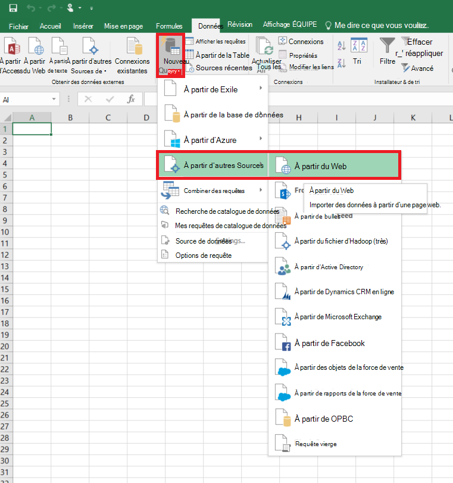
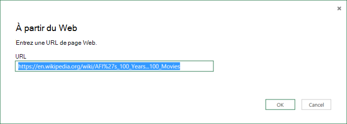
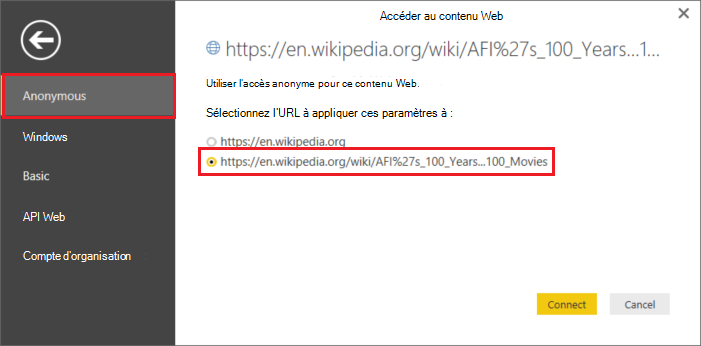
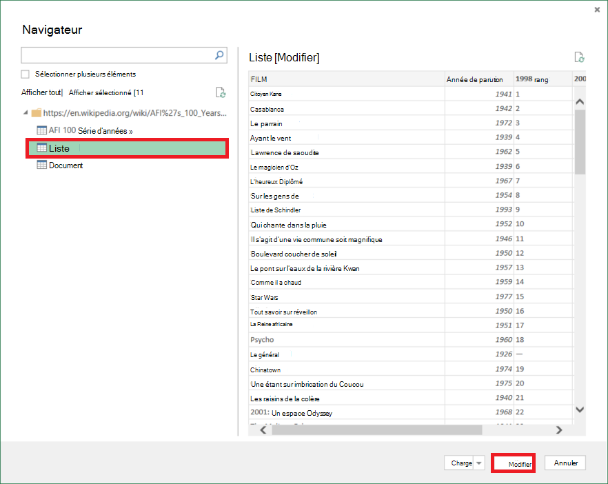
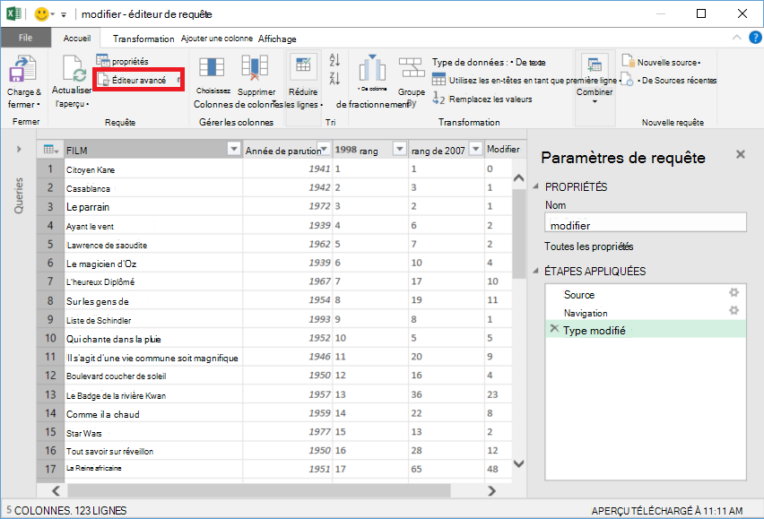
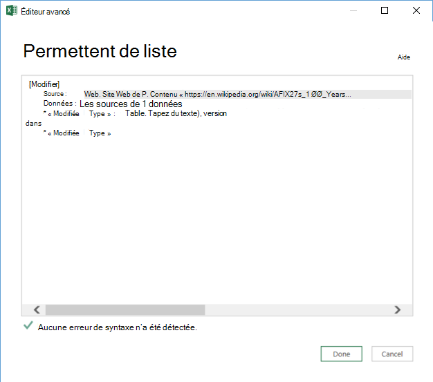

<properties 
    pageTitle="Déplacer les données de la Table Web | Usine de données Azure" 
    description="Découvrez comment déplacer des données sur site une table dans une page Web à l’aide de la fabrique de données Azure." 
    services="data-factory" 
    documentationCenter="" 
    authors="linda33wj" 
    manager="jhubbard" 
    editor="monicar"/>

<tags 
    ms.service="data-factory" 
    ms.workload="data-services" 
    ms.tgt_pltfrm="na" 
    ms.devlang="na" 
    ms.topic="article" 
    ms.date="09/26/2016" 
    ms.author="jingwang"/>

# Déplacement des données à partir d’une source de table Web à l’aide de la fabrique de données Azure
Cet article décrit comment vous pouvez utiliser l’activité de copie dans une usine de données Azure pour copier des données d’une table dans une page Web dans un autre magasin de données. Cet article s’appuie sur l’article [d’activités de déplacement des données](data-factory-data-movement-activities.md) , qui présente une vue d’ensemble de transfert de données avec l’activité de copie et de combinaisons de magasin de données pris en charge.

Usine de données prend actuellement en charge un seul transfert de données à partir d’un tableau sur le Web à d’autres magasins de données, mais ne pas déplacer les données à partir d’autres données stocke pour une destination Web du tableau.

> [AZURE.NOTE] Ce connecteur Web prend actuellement en charge uniquement le contenu table extraction à partir d’une page HTML.

## Exemple : Copier des données à partir de la table Web dans Azure Blob

L’exemple ci-dessous s’affiche :

1.  Service lié de type [Web](#web-linked-service-properties).
2.  Un service lié du type [AzureStorage](data-factory-azure-blob-connector.md#azure-storage-linked-service-properties).
3.  Un [groupe de données](data-factory-create-datasets.md) d’entrée de type [WebTable](#WebTable-dataset-properties).
4.  Une sortie [dataset](data-factory-create-datasets.md) de type [AzureBlob](data-factory-azure-blob-connector.md#azure-blob-dataset-type-properties).
4.  Un [pipeline](data-factory-create-pipelines.md) avec une activité de copie qui utilise [WebSource](#websource-copy-activity-type-properties) et [BlobSink](data-factory-azure-blob-connector.md#azure-blob-copy-activity-type-properties).

L’exemple copie les données à partir d’un tableau sur le Web pour un blob Azure toutes les heures. Les propriétés JSON utilisées dans ces exemples sont décrites dans les sections suivantes les exemples. 

L’exemple suivant montre comment copier les données d’un tableau sur le Web pour un blob Azure. Toutefois, les données peuvent être copiées directement à un des récepteurs indiqués dans l’article [d’Activités de déplacement des données](data-factory-data-movement-activities.md) à l’aide de l’activité de copie dans Azure Data Factory. 

**Web lié service** Cet exemple utilise le service Web lié avec l’authentification anonyme. Consultez la section [Web lié service](#web-linked-service-properties) pour différents types d’authentification que vous pouvez utiliser. 

    {
        "name": "WebLinkedService",
        "properties":
        {
            "type": "Web",
            "typeProperties":
            {
                "authenticationType": "Anonymous",
                "url" : "https://en.wikipedia.org/wiki/"
            }
        }
    }

**Service de stockage lié Azure**

    {
      "name": "AzureStorageLinkedService",
      "properties": {
        "type": "AzureStorage",
        "typeProperties": {
          "connectionString": "DefaultEndpointsProtocol=https;AccountName=<accountname>;AccountKey=<accountkey>"
        }
      }
    }

**Jeu de données d’entrée WebTable** Le fait de définir **externe** **true** indique le service Factory de données que le dataset est externe à l’usine de données et qu’il n’est pas produit par une activité sur le factory de données.

> [AZURE.NOTE] Consultez la section [obtenir l’index d’une table dans une page HTML](#get-index-of-a-table-in-an-html-page) pour obtenir la procédure d’obtention d’index d’une table dans une page HTML.  

    
    {
        "name": "WebTableInput",
        "properties": {
            "type": "WebTable",
            "linkedServiceName": "WebLinkedService",
            "typeProperties": {
                "index": 1,
                "path": "AFI's_100_Years...100_Movies"
            },
            "external": true,
            "availability": {
                "frequency": "Hour",
                "interval":  1
            }
        }
    }

**Dataset de sortie Blob Azure**

Les données sont écrites dans un blob de nouveau toutes les heures (fréquence : heures, l’intervalle : 1). 

    {
        "name": "AzureBlobOutput",
        "properties":
        {
            "type": "AzureBlob",
            "linkedServiceName": "AzureStorageLinkedService",
            "typeProperties":
            {
                "folderPath": "adfgetstarted/Movies"
            },
            "availability":
            {
                "frequency": "Hour",
                "interval": 1
            }
        }
    }

**Activité de copie de pipeline**

Le pipeline contient une activité de copie qui est configuré pour utiliser l’entrée ci-dessus et la sortie des groupes de données et est planifiée pour s’exécuter toutes les heures. Dans la définition de JSON de pipeline, le type de **source** est défini sur **WebSource** et type de **récepteurs** est définie sur **BlobSink**. 

Pour obtenir la liste des propriétés prises en charge par le WebSource, reportez-vous à la section [des propriétés de type WebSource](#websource-copy-activity-type-properties) . 
    
    {  
        "name":"SamplePipeline",
        "properties":{  
        "start":"2014-06-01T18:00:00",
        "end":"2014-06-01T19:00:00",
        "description":"pipeline with copy activity",
        "activities":[  
          {
            "name": "WebTableToAzureBlob",
            "description": "Copy from a Web table to an Azure blob",
            "type": "Copy",
            "inputs": [
              {
                "name": "WebTableInput"
              }
            ],
            "outputs": [
              {
                "name": "AzureBlobOutput"
              }
            ],
            "typeProperties": {
              "source": {
                "type": "WebSource"
              },
              "sink": {
                "type": "BlobSink"
              }
            },
           "scheduler": {
              "frequency": "Hour",
              "interval": 1
            },
            "policy": {
              "concurrency": 1,
              "executionPriorityOrder": "OldestFirst",
              "retry": 0,
              "timeout": "01:00:00"
            }
          }
          ]
       }
    }

## Propriétés de Web services liés

Le tableau suivant fournit la description pour les éléments JSON spécifiques aux Web services liés.

| Propriété | Description | Obligatoire |
| -------- | ----------- | -------- | 
| type de | La propriété type doit être définie : **Web** | Oui | 
| URL | URL de la source Web | Oui |
| authenticationType | Anonyme ou de base. | Oui |
| nom d’utilisateur | Nom d’utilisateur pour l’authentification de base. | Oui (pour l’authentification de base)
| mot de passe | Mot de passe pour l’authentification de base. | Oui (pour l’authentification de base)

### À l’aide de l’authentification anonyme

    {
        "name": "web",
        "properties":
        {
            "type": "Web",
            "typeProperties":
            {
                "authenticationType": "Anonymous",
                "url" : "https://en.wikipedia.org/wiki/"
            }
        }
    }

### À l’aide de l’authentification de base
    
    {
        "name": "web",
        "properties":
        {
            "type": "Web",
            "typeProperties":
            {
                "authenticationType": "basic",
                "url" : "http://myit.mycompany.com/",
                "userName": "Administrator",
                "password": "password"
            }
        }
    }

## Propriétés du dataset WebTable

Pour obtenir une liste complète des sections et les propriétés disponibles pour la définition des groupes de données, consultez l’article de la [Création de groupes de données](data-factory-create-datasets.md) . Sections de structure, de disponibilité et de stratégie d’un groupe de données JSON sont similaires pour tous les types de groupe de données (SQL Azure, blob Azure, table Azure, etc..).

La section **typeProperties** est différente pour chaque type de groupe de données et fournit des informations sur l’emplacement des données dans le magasin de données. La section typeProperties pour le groupe de données de type **WebTable** possède les propriétés suivantes

Propriété | Description | Obligatoire
:-------- | :----------- | :--------
type de    | type du groupe de données. doit avoir la valeur **WebTable** | Oui
chemin d’accès | Une URL relative à la ressource qui contient la table. | N° Lorsque le chemin d’accès n’est pas spécifié, seulement l’URL spécifiée dans la définition de service liés est utilisé. 
index | L’index de la table dans la ressource. Consultez la section [obtenir l’index d’une table dans une page HTML](#get-index-of-a-table-in-an-html-page) pour obtenir la procédure d’obtention d’index d’une table dans une page HTML. | Oui

**Exemple :**

    {
        "name": "WebTableInput",
        "properties": {
            "type": "WebTable",
            "linkedServiceName": "WebLinkedService",
            "typeProperties": {
                "index": 1,
                "path": "AFI's_100_Years...100_Movies"
            },
            "external": true,
            "availability": {
                "frequency": "Hour",
                "interval":  1
            }
        }
    }

## WebSource - propriétés de type d’activité de copie

Pour obtenir une liste complète des sections et les propriétés disponibles pour la définition des activités, voir l’article [Créer des Pipelines](data-factory-create-pipelines.md) . Les propriétés telles que nom, description, d’entrée et de sortie des tables et la stratégie sont disponibles pour tous les types d’activités. 

D’autre part, les propriétés disponibles dans la section typeProperties de l’activité varient avec chaque type d’activité. Pour les activités de copie, qui varient selon les types de sources et les destinations.

Actuellement, lorsque la source de l’activité de copie est de type **WebSource**, aucune des propriétés supplémentaires ne sont pris en charge. 

## Obtenir l’index d’une table dans une page HTML

1. Lancer **Excel 2016** et basculez vers l’onglet **données** .  
2. Cliquez sur **Nouvelle requête** dans la barre d’outils, pointez sur **à partir d’autres Sources** et cliquez sur **à partir du Web**.
    
     
3. Dans la boîte de dialogue **à partir du Web** , entrez l' **URL** que vous utiliseriez dans JSON de services liés (par exemple : https://en.wikipedia.org/wiki/) et le chemin d’accès que vous spécifiez pour le groupe de données (par exemple : AFI % 27s_100_Years... 100_Movies), puis cliquez sur **OK**. 

     

    URL utilisée dans cet exemple : https://en.wikipedia.org/wiki/AFI%27s_100_Years...100_Movies 
4.  Si vous voyez la boîte de dialogue **contenu de Web Access** , sélectionnez la bonne **URL**, **l’authentification**et cliquez sur **se connecter**. 

    
5.  Cliquez sur un élément de **tableau** , dans l’arborescence pour afficher le contenu de la table et puis cliquez sur le bouton **Modifier** en bas.  

     

5. Dans la fenêtre de **l’Éditeur de requête** , cliquez sur le bouton **Éditeur avancé** dans la barre d’outils.

    

6. Dans la boîte de dialogue Éditeur avancé, le numéro en regard de « Source » est l’index.

     

Si vous utilisez Excel 2013, utilisez [Microsoft Query de puissance pour Excel](https://www.microsoft.com/download/details.aspx?id=39379) pour obtenir l’index. Consultez l’article de [se connecter à une page web](https://support.office.com/article/Connect-to-a-web-page-Power-Query-b2725d67-c9e8-43e6-a590-c0a175bd64d8) pour plus d’informations. Les étapes sont identiques si vous utilisez [Microsoft BI de puissance pour ordinateur de bureau](https://powerbi.microsoft.com/desktop/). 

[AZURE.INCLUDE [data-factory-column-mapping](../../includes/data-factory-column-mapping.md)]

[AZURE.INCLUDE [data-factory-structure-for-rectangualr-datasets](../../includes/data-factory-structure-for-rectangualr-datasets.md)]

## Performances et réglage  
Voir [copie activité performances & Tuning Guide](data-factory-copy-activity-performance.md) pour en savoir plus sur les facteurs clés cet impact sur les performances de transfert de données (copie activité) dans Azure Data Factory et les différentes manières de l’optimiser.
