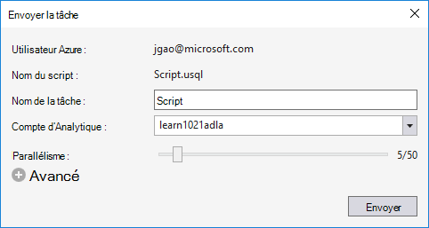

<properties
   pageTitle="Développer des scripts SQL-U à l’aide des outils de données LAC pour Visual Studio | Azure"
   description="Apprenez à installer les outils de LAC de données pour Visual Studio, le développement et les scripts de test SQL-U. "
   services="data-lake-analytics"
   documentationCenter=""
   authors="edmacauley"
   manager="jhubbard"
   editor="cgronlun"/>

<tags
   ms.service="data-lake-analytics"
   ms.devlang="na"
   ms.topic="get-started-article"
   ms.tgt_pltfrm="na"
   ms.workload="big-data"
   ms.date="05/16/2016"
   ms.author="edmaca"/>

# Didacticiel : développer des scripts de U-SQL à l’aide des outils de données LAC pour Visual Studio

[AZURE.INCLUDE [get-started-selector](../../includes/data-lake-analytics-selector-get-started.md)]

Apprenez à installer les outils de LAC de données de Visual Studio et utiliser les outils de LAC de données de Visual Studio pour écrire et tester les scripts SQL de l’U.

U-SQL est un langage de hyper évolutif, hautement extensible pour la préparation, la transformation et analyse toutes les données dans le lac données et au-delà. Pour plus d’informations, reportez-vous à la section [référence SQL-U] (http://go.microsoft.com/fwlink/p/?LinkId=691348).

##Conditions préalables

- **2015 de Visual Studio, Visual Studio 2013 la mise à jour 4, ou Visual Studio 2012. Entreprise (Édition intégrale/Premium), Professionnel, Communauté éditions sont pris en charge ; Expresse edition n’est pas pris en charge. Visual Studio « 15 » n’est actuellement pas pris en charge, et nous travaillons sur ce.**
- **Kit de développement Microsoft Azure pour .NET version 2.7.1 ou plus**.  Installez-le à l’aide du [programme d’installation de la plate-forme Web](http://www.microsoft.com/web/downloads/platform.aspx).
- **[Données lac Tools pour Visual Studio](http://aka.ms/adltoolsvs)**.

    Une fois que les données des outils de LAC pour Visual Studio est installé, vous verrez un nœud « Analytique du lac de données » dans l’Explorateur de serveurs sous le nœud « Azure » (vous pouvez ouvrir Explorateur de serveurs en appuyant sur Ctrl + Alt + S).

- **Les deux sections suivantes dans [mise en route avec Azure données lac Analytique Azure portal à l’aide de](data-lake-analytics-get-started-portal.md)**.

    - [Création d’un compte Analytique de LAC de données Azure](data-lake-analytics-get-started-portal.md#create_adl_analytics_account).
    - [Télécharger SearchLog.tsv pour le compte de stockage lac de données par défaut](data-lake-analytics-get-started-portal.md#update-data-to-the-default-adl-storage-account).

    Pour votre commodité, vous pouvez trouver un exemple de script PowerShell pour la création d’un service de données lac analytique et téléchargement du fichier de données source dans [exemple de PowerShell de Appx-A pour la préparation de ce didacticiel](data-lake-analytics-data-lake-tools-get-started.md#appx-a-powershell-sample-for-preparing-the-tutorial).

    Les outils lac de données ne prend pas en charge la création de comptes de données lac Analytique. Vous devez donc créer à l’aide du portail Azure, Azure PowerShell, Kit de développement .NET ou Azure CLI. Pour exécuter une tâche de données lac Analytique, vous aurez besoin de certaines données. Même si les outils de LAC de données prend en charge les données de téléchargement, vous allez utiliser le portail pour télécharger les exemples de données pour faciliter la suivre ce didacticiel.

## Se connecter à Azure

**Pour vous connecter à des données lac Analytique**

1. Ouvrez Visual Studio.
2. Dans le menu **affichage** , cliquez sur **Explorateur de serveurs** pour ouvrir l’Explorateur de serveurs. Ou appuyez sur la touche **[CTRL] + [ALT] + S**.
3. Droit **d’Azure**et cliquez sur « Se connecter à Microsoft Azure abonnement », puis suivez les instructions.
4. Dans l' **Explorateur de serveurs**, puis développez **Azure**et **Données lac Analytique**. Est d’afficher la liste de vos comptes de données lac Analytique s’il en existe. Impossible de créer des comptes de données lac Analytique à partir de Visual Studio. Pour créer un compte, consultez [mise en route avec Azure données lac Analytique à l’aide de Azure portal](data-lake-analytics-get-started-portal.md) ou [Mettre en route Analytique de LAC de données Azure à l’aide de PowerShell d’Azure](data-lake-analytics-get-started-powershell.md).

## Télécharger les fichiers de données sources

Vous avez téléchargé des données dans la section **composants requis** plus haut dans le didacticiel.  

Dans le cas où vous souhaitez utiliser vos propres données, voici les procédures de chargement des données à partir des outils de LAC de données.

**Pour télécharger des fichiers vers le compte Azure données lac dépendant**

1. Dans l' **Explorateur de serveurs**, développez **Azure**, **Données lac Analytique**, développez votre compte Analytique du lac données, **Comptes de stockage**. Vous doit voir le compte de stockage lac de données par défaut et les comptes de stockage de données lac liés et les comptes de stockage Azure liés. Le compte du lac de données par défaut a une étiquette « Compte de stockage par défaut ».
2. Double-cliquez sur le compte de stockage lac de données par défaut, puis cliquez sur **Explorer**.  Les outils du lac de données pour le volet de l’Explorateur de Visual Studio s’ouvre.  À gauche, il affiche une arborescence de commandes, que l’affichage du contenu se trouve sur la droite.
3. Recherchez le dossier dans lequel vous souhaitez télécharger des fichiers,
4. Avec le bouton droit à n’importe quel espace vide, puis cliquez sur **Télécharger**.

    

**Pour télécharger des fichiers vers un compte de stockage Azure Blob lié**

1. Dans l' **Explorateur de serveurs**, développez **Azure**, **Données lac Analytique**, développez votre compte Analytique du lac données, **Comptes de stockage**. Vous doit voir le compte de stockage lac de données par défaut et les comptes de stockage de données lac liés et les comptes de stockage Azure liés.
2. Développez le compte de stockage Azure.
3. Cliquez sur le conteneur où vous souhaitez télécharger des fichiers, puis cliquez sur **Explorer**. Si vous n’avez pas un conteneur, vous devez d’abord en créer un à l’aide de PowerShell d’Azure, le portail Azure ou d’autres outils.
4. Recherchez le dossier dans lequel vous souhaitez télécharger des fichiers,
5. Avec le bouton droit à n’importe quel espace vide, puis cliquez sur **Télécharger**.

## Développer des scripts SQL-U

Les tâches de données lac Analytique sont écrites en langage SQL de l’U. Pour en savoir plus sur U-SQL, consultez [mise en route de langage d’U-SQL](data-lake-analytics-u-sql-get-started.md) et [référence du langage SQL-U](http://go.microsoft.com/fwlink/?LinkId=691348).

**Pour créer et soumettre une tâche de données lac Analytique**

1. Dans le menu **fichier** , cliquez sur **Nouveau**, puis cliquez sur **projet**.
2. Sélectionnez le type de **Projet de U-SQL** .

    

3. Cliquez sur **OK**. Visual studio crée une solution avec un fichier **Script.usql** .
4. Entrez le script suivant dans **Script.usql**:

        @searchlog =
            EXTRACT UserId          int,
                    Start           DateTime,
                    Region          string,
                    Query           string,
                    Duration        int?,
                    Urls            string,
                    ClickedUrls     string
            FROM "/Samples/Data/SearchLog.tsv"
            USING Extractors.Tsv();

        @res =
            SELECT *
            FROM @searchlog;        

        OUTPUT @res   
            TO "/Output/SearchLog-from-Data-Lake.csv"
        USING Outputters.Csv();

    Ce script SQL-U lit le fichier de données source à l’aide de **Extractors.Tsv()**et crée un fichier csv à l’aide de **Outputters.Csv()**.

    Ne modifiez pas les deux chemins d’accès, sauf si vous avez copié le fichier source dans un autre emplacement.  Données lac Analytique va créer le dossier de sortie si elle n’existe pas.

    Il est plus simple d’utiliser les chemins d’accès relatifs pour les fichiers stockés par défaut des données des comptes de LAC. Vous pouvez également utiliser des chemins d’accès absolus.  Par exemple

        adl://<Data LakeStorageAccountName>.azuredatalakestore.net:443/Samples/Data/SearchLog.tsv

    Vous devez utiliser des chemins d’accès absolus pour accéder aux fichiers dans les comptes de stockage liés.  La syntaxe pour les fichiers stockés dans le compte de stockage Azure lié est :

        wasb://<BlobContainerName>@<StorageAccountName>.blob.core.windows.net/Samples/Data/SearchLog.tsv

    >[AZURE.NOTE] Conteneur de Blob Azure avec BLOB public ou d’autorisations d’accès de conteneurs publics ne sont pas actuellement pris en charge.  

    Notez les fonctionnalités suivantes :

    - **IntelliSense**

        Automatique de nom est effectuée et que les membres seront affichées pour l’ensemble de lignes, les Classes, les bases de données, les schémas et les objets définis par l’utilisateur (UDOs).

        IntelliSense pour les entités de catalogue (bases de données, schémas, Tables, UDOs etc.) est lié à votre compte de calcul. Vous pouvez vérifier le compte actuel de calcul active, la base de données et le schéma dans la barre d’outils supérieure et les passer à travers les listes déroulantes.

    - *Colonnes de *développement***

        Cliquez sur la droite de *, vous doit voir un trait de soulignement bleu sous la *. Placez le pointeur sur le trait de soulignement bleu, puis cliquez sur la flèche vers le bas.
        

        Cliquez sur **Développer les colonnes**, l’outil remplace le * avec les noms de colonne.

    - **Mise en forme automatique**

        Les utilisateurs peuvent modifier la mise en retrait du script SQL-U en fonction du code de structure sous Edition -> Avancé :

        - Format Document (Ctrl + E, D) : Met en forme l’ensemble du document   
        - Mettre la sélection (Ctrl + K, Ctrl + F) : Met en forme la sélection. Si aucune sélection n’a été effectuée, ce raccourci met en forme la ligne que se trouve le curseur.  

        La mise en forme des règles configurables dans Outils -> Options -> Éditeur de texte - > SIP -> mise en forme.  
    - **Retrait intelligent**

        Données des outils de LAC pour Visual Studio est en mesure de mettre en retrait automatiquement les expressions pendant que vous écrivez des scripts. Cette fonctionnalité est désactivée par défaut, les utilisateurs ont besoin pour l’activer par le biais de vérification U-SQL -> Options et paramètres -> commutateurs -> Activer Smart Indent.

    - **Atteindre la définition et de rechercher toutes les références**

        Cliquant sur le nom d’un jeu de lignes/paramètre/colonne/UDO, etc. et cliquez sur Atteindre la définition (F12) vous permet de naviguer à sa définition. En cliquant sur Rechercher toutes les références (MAJ + F12), affiche toutes les références.

    - **Insérer le chemin d’accès Azure**

        Plutôt que de mémoriser le chemin d’accès du fichier Azure et type il manuellement lors de l’écriture de script, les données des outils de LAC pour Visual Studio offre un moyen facile : avec le bouton droit dans l’éditeur, cliquez sur Insérer le tracé Azure. Naviguez jusqu’au fichier dans la boîte de dialogue navigateur de Blob Azure. Cliquez sur **OK**. le chemin d’accès du fichier est inséré dans votre code.

5. Spécifiez le compte Analytique lac de données, base de données et schéma. Vous pouvez sélectionner **(local)** pour exécuter le script de localement dans le but de test. Pour plus d’informations, consultez [Exécution de U-SQL localement](#run-u-sql-locally).

    

    Pour plus d’informations, consultez le [catalogue d’utilisation U-SQL](data-lake-analytics-use-u-sql-catalog.md).

5. À partir **L’Explorateur de solutions**, cliquez sur **Script.usql**et puis cliquez sur **Générer un Script**. Vérifiez le résultat dans le volet de sortie.
6. À partir **L’Explorateur de solutions**, cliquez sur **Script.usql**, puis cliquez sur **Envoyer le Script**. Si vous le souhaitez, vous pouvez également cliquer sur **Envoyer** à partir du volet de Script.usql.  Voir la capture d’écran précédente.  Cliquez sur la flèche en regard du bouton Envoyer pour envoyer à l’aide des options d’avance :
7. Spécifier le **Nom de la tâche**, vérifiez que le **Compte d’Analytique**, puis cliquez sur **Envoyer**. Résultats de l’envoi et le lien de tâche sont disponibles dans les outils du lac de données de la fenêtre des résultats de Visual Studio lorsque la présentation est terminée.

    

8. Vous devez cliquer sur le bouton Actualiser pour afficher le dernier état de la tâche et d’actualiser l’écran. Lorsque les succès de la tâche, il affiche le **Graphique de la tâche**, les **Opérations sur les métadonnées**, **Historique de l’état**, **Diagnostics**:

    

    * Résumé de la tâche. Afficher les informations de résumé de la tâche en cours, par exemple : état, progression, temps d’exécution, nom du Runtime, etc. de l’émetteur.   
    * Détails de la tâche. Des informations détaillées sur cette tâche sont fournies, y compris le script, ressources, vue de l’exécution de sommet.
    * Graphique de la tâche. Quatre graphiques permettent de visualiser les informations de la tâche : progression, lecture de données, les données écrites, temps d’exécution, temps d’exécution moyen par nœud, le débit d’entrée, débit de sortie.
    * Opérations de métadonnées. Il affiche toutes les opérations de métadonnées.
    * Historique de l’état.
    * Tests de diagnostic. Données des outils de LAC pour Visual Studio diagnostique automatiquement l’exécution du travail. Vous recevrez des alertes lorsqu’il y a des erreurs ou des problèmes de performances dans leurs travaux. Voir travail Diagnostics (lien TBD) partie pour plus d’informations.

**Pour vérifier l’état de la tâche**

1. À partir de l’Explorateur de serveurs, développez **Azure**, **Données lac Analytique**, le nom du compte Analytique lac de données
2. Double-cliquez sur **travaux** pour répertorier les travaux.
2. Cliquez sur une tâche pour afficher l’état.

**Pour afficher la sortie de la tâche**

1. À partir de l' **Explorateur de serveurs**, développez **Azure**, développez **Données lac Analytique**, développez votre compte Analytique lac de données, développez des **Comptes de stockage**, droit sur le compte de stockage lac de données par défaut, puis cliquez sur **Explorer**.
2.  Double-cliquez sur pour ouvrir le dossier de **sortie**
3.  Double-cliquez sur **SearchLog-de-adltools.csv**.

###Lecture de la tâche

Lecture de travail vous permet de surveiller la progression de l’exécution de travaux et de détecter visuellement les goulots d’étranglement et des anomalies de performances. Cette fonctionnalité peut être utilisée avant la fin du travail d’exécution (c'est-à-dire le temps de que la tâche est en cours d’exécution), ainsi qu’une fois l’exécution terminée. Effectuer la lecture pendant l’exécution du travail permet à l’utilisateur lire la progression jusqu’au moment actuel.

**Pour afficher la progression de l’exécution de travaux**  

1. Dans le coin supérieur droit, cliquez sur **Profil de charge** . Voir à l’écran précédent de capture.
2. Cliquez sur le bouton lecture dans le coin inférieur gauche pour consulter la progression de l’exécution du travail.
3. Lors de la lecture, cliquez sur **Pause** pour arrêter ou directement faire glisser la barre de progression pour des postes spécifiques.

###Carte thermique

Données des outils de LAC pour Visual Studio fournit des superpositions de couleurs sélectionnables par l’utilisateur sur le mode de travail pour indiquer la progression, données d’e/s, temps d’exécution, le débit d’e/s de chaque étape. Grâce à cela, les utilisateurs peuvent déterminer potentielles de problèmes et de distribution des propriétés des tâches directement et de manière intuitive. Vous pouvez choisir une source de données à afficher dans la liste déroulante.  

## U-SQL exécution localement

Local U-SQL mise en route de Visual Studio, vous pouvez :

- Exécuter les scripts de U-SQL localement, ainsi que les assemblys C#.
- Déboguer C# assemblys localement.
- Créer/supprimer/afficher les bases de données locales, les assemblys, les schémas et les tables dans l’Explorateur de serveurs, tout comme vous peuvent le faire pour service d’Azure données lac Analytique.

Vous verrez un compte *Local* dans Visual Studio, et le programme d’installation crée un *DataRoot* dossier situé à *C:\LocalRunRoot*. Le dossier DataRoot sera utilisé :

- Métadonnées de stockage, y compris les tables, DBs, TVF, etc..
- Pour certain un script : si un chemin d’accès relatif est référencée dans les chemins d’entrée/sortie, examinez le DataRoot (ainsi que le chemin du script si l’entrée de l’informatique)
- Le dossier DataRoot ne sera pas référencé si vous essayez d’enregistrer un assembly et utiliser un chemin d’accès relatif (voir partie de « assemblys d’utilisation lors de l’exécution exécution locale » pour plus de détails)

La vidéo suivante illustre la fonctionnalité d’exécution locale U-SQL :

>[AZURE.VIDEO usql-localrun]

### Limitations et problèmes connus

- Impossible de créer la table/base de données etc. dans l’Explorateur de serveurs pour le compte local.
- Lorsqu’un chemin d’accès relatif est référencé :

    - Dans l’entrée de script (extraire * FROM « / chemin/abc »)-le chemin DataRoot et le chemin d’accès du script seront recherchées.
    - Dans la sortie du script (dans « chemin d’accès/abc ») : le chemin d’accès DataRoot sera utilisé comme le dossier de sortie.
    - Dans l’enregistrement de l’assembly (xyz de créer un ASSEMBLY à partir de « / chemin/abc ») : recherche le chemin d’accès du script, mais pas le DataRoot.
    - Dans enregistré la table/vue ou autres entités de métadonnées : le chemin d’accès DataRoot sera recherchée, mais pas le chemin d’accès de script.

    Pour les scripts exécutés sur service du lac de données, le compte de stockage par défaut sera utilisé comme dossier racine et permettra d’être recherché en conséquence.

### Tester localement les scripts SQL-U
Pour obtenir des instructions sur le développement de scripts de SQL-U, consultez [scripts de développer U-SQL](#develop-and-test-u-sql-scripts). Pour générer et exécuter U-SQL scripts localement, sélectionnez **(Local)** dans la liste déroulante de cluster, puis cliquez sur **Envoyer**. Vérifiez que vous avez les bonnes données référencées, soit faire le chemin d’accès absolu ou insérer les données dans le dossier DataRoot.

Vous pouvez également cliquez sur un script et puis cliquez sur **Exécuter le Plan Local** dans le menu contextuel ou appuyez sur **CTRL + F5** pour une exécution locale de déclencheur.

### Utiliser des assemblys dans une exécution locale

Il existe deux manières d’exécuter les fichiers C# personnalisés :

- Écrire des assemblys dans le fichier code-behind et les assemblys seront automatiquement enregistrés et supprimés une fois le script terminé.
- Créez un projet de l’assembly C# et enregistrer la dll de sortie pour le compte local via un script comme ci-dessous. Notez que le chemin d’accès dépend du script, plutôt que le dossier DataRoot.

### Débogage de scripts et C# assemblys localement

Vous pouvez déboguer des assemblys C# sans soumettre et de son enregistrement au Service Azure données lac Analytique. Vous pouvez définir des points d’arrêt dans les deux le fichier code-behind et dans un projet C# référencé.

**Pour déboguer le code local dans le fichier code-behind**
1.  Définir des points d’arrêt dans le fichier code-behind.
2.  Appuyez sur **F5** pour déboguer le script localement.

La procédure suivante fonctionne uniquement dans Visual Studio 2015. Dans la plus ancienne de Visual Studio, vous devrez peut-être ajouter manuellement les fichiers pdb.

**Pour déboguer le code local dans un projet C# référencé**
1.  Créez un projet d’Assembly C# et de le générer pour générer la dll de sortie.
2.  Inscrivez la dll à l’aide d’une instruction SQL-U :

        CREATE ASSEMBLY assemblyname FROM @"..\..\path\to\output\.dll";
3.  Définir des points d’arrêt dans le code C#.
4.  Appuyez sur **F5** pour déboguer le script avec un référencement de C# dll localement.  

##Voir aussi

Pour vous familiariser avec Analytique de LAC de données à l’aide de différents outils, voir :

- [Mise en route de données Analytique de LAC avec Azure portal](data-lake-analytics-get-started-portal.md)
- [Mise en route de données Analytique de LAC à l’aide de PowerShell d’Azure](data-lake-analytics-get-started-powershell.md)
- [Mise en route de données Analytique de LAC à l’aide du Kit de développement .NET](data-lake-analytics-get-started-net-sdk.md)
- [Déboguer le code C# dans les travaux de U-SQL](data-lake-analytics-debug-u-sql-jobs.md)

Pour afficher davantage de rubriques de développement :

- [Analyser les blogs à l’aide de données lac Analytique](data-lake-analytics-analyze-weblogs.md)
- [Développer des scripts SQL-U à l’aide des outils de données LAC pour Visual Studio](data-lake-analytics-data-lake-tools-get-started.md)
- [Mise en route de la langue du lac de données Azure Analytique U-SQL](data-lake-analytics-u-sql-get-started.md)
- [Développer les opérateurs U-SQL définie par l’utilisateur pour les tâches de données lac Analytique](data-lake-analytics-u-sql-develop-user-defined-operators.md)

##Exemple de PowerShell AppX-A pour la préparation de ce didacticiel

Le script PowerShell suivant prépare un compte Azure données lac Analytique et la source de données, vous pouvez donc passer à [U-SQL développer des scripts](data-lake-analytics-data-lake-tools-get-started.md#develop-u-sql-scripts).

    #region - used for creating Azure service names
    $nameToken = "<Enter an alias>"
    $namePrefix = $nameToken.ToLower() + (Get-Date -Format "MMdd")
    #endregion

    #region - service names
    $resourceGroupName = $namePrefix + "rg"
    $dataLakeStoreName = $namePrefix + "adas"
    $dataLakeAnalyticsName = $namePrefix + "adla"
    $location = "East US 2"
    #endregion

    # Treat all errors as terminating
    $ErrorActionPreference = "Stop"

    #region - Connect to Azure subscription
    Write-Host "`nConnecting to your Azure subscription ..." -ForegroundColor Green
    try{Get-AzureRmContext}
    catch{Login-AzureRmAccount}
    #endregion

    #region - Create an Azure Data Lake Analytics service account
    Write-Host "Create a resource group ..." -ForegroundColor Green
    New-AzureRmResourceGroup `
        -Name  $resourceGroupName `
        -Location $location

    Write-Host "Create a Data Lake account ..."  -ForegroundColor Green
    New-AzureRmDataLakeStoreAccount `
        -ResourceGroupName $resourceGroupName `
        -Name $dataLakeStoreName `
        -Location $location

    Write-Host "Create a Data Lake Analytics account ..."  -ForegroundColor Green
    New-AzureRmDataLakeAnalyticsAccount `
        -Name $dataLakeAnalyticsName `
        -ResourceGroupName $resourceGroupName `
        -Location $location `
        -DefaultDataLake $dataLakeStoreName

    Write-Host "The newly created Data Lake Analytics account ..."  -ForegroundColor Green
    Get-AzureRmDataLakeAnalyticsAccount `
        -ResourceGroupName $resourceGroupName `
        -Name $dataLakeAnalyticsName  
    #endregion

    #region - prepare the source data
    Write-Host "Import the source data ..."  -ForegroundColor Green
    $localFolder = "C:\Tutorials\Downloads\" # A temp location for the file.
    $storageAccount = "adltutorials"  # Don't modify this value.
    $container = "adls-sample-data"  #Don't modify this value.

    # Create the temp location  
    New-Item -Path $localFolder -ItemType Directory -Force

    # Download the sample file from Azure Blob storage
    $context = New-AzureStorageContext -StorageAccountName $storageAccount -Anonymous
    $blobs = Azure\Get-AzureStorageBlob -Container $container -Context $context
    $blobs | Get-AzureStorageBlobContent -Context $context -Destination $localFolder

    # Upload the file to the default Data Lake Store account    
    Import-AzureRmDataLakeStoreItem -AccountName $dataLakeStoreName -Path $localFolder"SearchLog.tsv" -Destination "/Samples/Data/SearchLog.tsv"

    Write-Host "List the source data ..."  -ForegroundColor Green
    Get-AzureRmDataLakeStoreChildItem -Account $dataLakeStoreName -Path  "/Samples/Data/"
    #endregion
