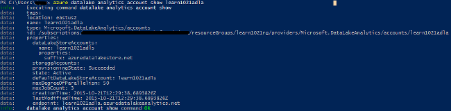

<properties 
   pageTitle="Mise en route d’Analytique de LAC de données Azure utilisant l’Interface de ligne de commande de Azure | Microsoft Azure" 
   description="Apprenez à utiliser l’Interface de ligne de commande Azure pour créer un compte de banque de données lac, créer un travail de données lac Analytique à l’aide de SQL-U et soumettre la tâche. " 
   services="data-lake-analytics" 
   documentationCenter="" 
   authors="edmacauley" 
   manager="jhubbard" 
   editor="cgronlun"/>
 
<tags
   ms.service="data-lake-analytics"
   ms.devlang="na"
   ms.topic="hero-article"
   ms.tgt_pltfrm="na"
   ms.workload="big-data" 
   ms.date="05/16/2016"
   ms.author="edmaca"/>

# Didacticiel : mise en route d’Analytique de LAC de données Azure à l’aide d’Azure Interface de ligne de commande (CLI)

[AZURE.INCLUDE [get-started-selector](../../includes/data-lake-analytics-selector-get-started.md)]

Apprenez à utiliser la CLI d’Azure pour créer des comptes de Azure données lac Analytique, de définir des tâches de données lac Analytique dans [SQL-U](data-lake-analytics-u-sql-get-started.md)et de soumettre des travaux à des comptes de données lac Analytique. Pour plus d’informations sur les données lac Analytique, consultez [vue d’ensemble de l’Analytique de LAC de données Azure](data-lake-analytics-overview.md).

Dans ce didacticiel, vous allez développer un travail qui lit un onglet séparé les fichier TSV (valeurs) et le convertit en un fichier séparés par des virgules (CSV). Pour parcourir le didacticiel même à l’aide d’autres outils pris en charge, cliquez sur les onglets en haut de cette section.

##Conditions préalables

Avant de commencer ce didacticiel, vous devez disposer des éléments suivants :

- **Abonnement d’un Azure**. Consultez [Azure d’obtenir la version d’évaluation gratuite](https://azure.microsoft.com/pricing/free-trial/).
- **CLI azure**. Consultez [installer et configurer l’infrastructure du langage commun Azure](../xplat-cli-install.md).
    - Téléchargez et installez la **version préliminaire** [Outils d’Azure CLI](https://github.com/MicrosoftBigData/AzureDataLake/releases) pour effectuer cette démonstration.
- **Authentification**, à l’aide de la commande suivante :

        azure login
    Pour plus d’informations sur l’authentification à l’aide d’un compte de travail ou à l’école, voir [se connecter à un abonnement Azure à partir de la CLI d’Azure](../xplat-cli-connect.md).
- **Basculer vers le mode Azure le Gestionnaire de ressources**à l’aide de la commande suivante :

        azure config mode arm
        
## Créer le compte de données lac Analytique

Vous devez avoir un compte de données lac Analytique avant de pouvoir exécuter toutes les tâches. Pour créer un compte Analytique lac de données, vous devez spécifier les éléments suivants :

- **Groupe de ressources Azure**: compte de A données lac Analytique doit être créé au sein d’un groupe de ressources d’Azure. [Azure le Gestionnaire de ressources](../azure-resource-manager/resource-group-overview.md) vous permet de travailler avec les ressources de votre application en tant que groupe. Vous pouvez déployer, mettre à jour ou supprimer toutes les ressources de votre application dans une opération unique et coordonnée.  

    Pour énumérer les groupes de ressources dans votre abonnement :
    
        azure group list 
    
    Pour créer un nouveau groupe de ressources :

        azure group create -n "<Resource Group Name>" -l "<Azure Location>"

- **Nom du compte Analytique données lac**
- **Emplacement**: parmi les centres de données Azure qui prend en charge les données lac Analytique.
- **Compte du lac de données par défaut**: chaque compte Analytique lac de données possède un compte de LAC de données par défaut.

    Pour répertorier le compte du lac de données existant :
    
        azure datalake store account list

    Pour créer un nouveau compte du lac de données :

        azure datalake store account create "<Data Lake Store Account Name>" "<Azure Location>" "<Resource Group Name>"

    > [AZURE.NOTE] Le nom de compte du lac de données doit uniquement contenir des minuscules et chiffres.

**Pour créer un compte Analytique lac de données**

        azure datalake analytics account create "<Data Lake Analytics Account Name>" "<Azure Location>" "<Resource Group Name>" "<Default Data Lake Account Name>"

        azure datalake analytics account list
        azure datalake analytics account show "<Data Lake Analytics Account Name>"          

> [AZURE.NOTE] Le nom du compte Analytique du lac données doit uniquement contenir des minuscules et chiffres.

## Télécharger les données vers le magasin de données lac

Dans ce didacticiel, vous traiterez des journaux de recherche.  Le journal de recherche peut être stocké dans le magasin de données lac ou de stockage des objets Blob Azure. 

Le portail Azure fournit une interface utilisateur pour la copie de certains fichiers de données d’exemple pour le compte de LAC de données par défaut qui incluent un fichier de journal de recherche. Voir [préparer les données source](data-lake-analytics-get-started-portal.md#prepare-source-data) pour charger les données pour le compte de la banque de données lac par défaut.

Pour télécharger des fichiers à l’aide de la cli, utilisez la commande suivante :

    azure datalake store filesystem import "<Data Lake Store Account Name>" "<Path>" "<Destination>"
    azure datalake store filesystem list "<Data Lake Store Account Name>" "<Path>"

Stockage des objets Blob Azure peut également accéder à données lac Analytique.  Pour le transfert de données pour le stockage des objets Blob Azure, reportez-vous [à l’aide de la CLI Azure avec stockage Azure](../storage/storage-azure-cli.md).

## Soumettre les tâches de données lac Analytique

Les tâches de données lac Analytique sont écrites en langage SQL de l’U. Pour en savoir plus sur U-SQL, consultez [mise en route de langage d’U-SQL](data-lake-analytics-u-sql-get-started.md) et [référence du langage SQL-U](http://go.microsoft.com/fwlink/?LinkId=691348).

**Pour créer un script de travail données lac Analytique**

- Créez un fichier texte avec le script de U-SQL suivant et enregistrez le fichier texte à votre station de travail :

        @searchlog =
            EXTRACT UserId          int,
                    Start           DateTime,
                    Region          string,
                    Query           string,
                    Duration        int?,
                    Urls            string,
                    ClickedUrls     string
            FROM "/Samples/Data/SearchLog.tsv"
            USING Extractors.Tsv();
        
        OUTPUT @searchlog   
            TO "/Output/SearchLog-from-Data-Lake.csv"
        USING Outputters.Csv();

    Ce script SQL-U lit le fichier de données source à l’aide de **Extractors.Tsv()**et crée un fichier csv à l’aide de **Outputters.Csv()**. 
    
    Ne modifiez pas les deux chemins d’accès, sauf si vous copiez le fichier source dans un autre emplacement.  Données lac Analytique va créer le dossier de sortie si elle n’existe pas.
    
    Il est plus simple d’utiliser les chemins d’accès relatifs pour les fichiers stockés par défaut des données des comptes de LAC. Vous pouvez également utiliser des chemins d’accès absolus.  Par exemple 
    
        adl://<Data LakeStorageAccountName>.azuredatalakestore.net:443/Samples/Data/SearchLog.tsv
        
    Vous devez utiliser des chemins d’accès absolus pour accéder aux fichiers dans les comptes de stockage liés.  La syntaxe pour les fichiers stockés dans le compte de stockage Azure lié est :
    
        wasb://<BlobContainerName>@<StorageAccountName>.blob.core.windows.net/Samples/Data/SearchLog.tsv

    >[AZURE.NOTE] Conteneur de Blob Azure avec BLOB public ou d’autorisations d’accès de conteneurs publics ne sont pas actuellement pris en charge.      

    
**Pour soumettre la tâche**

    azure datalake analytics job create  "<Data Lake Analytics Account Name>" "<Job Name>" "<Script>"
    
    
Les commandes suivantes peuvent être utilisées à la liste des tâches, obtenir les détails de la tâche et annuler les travaux :

    azure datalake analytics job cancel "<Data Lake Analytics Account Name>" "<Job Id>"
    azure datalake analytics job list "<Data Lake Analytics Account Name>"
    azure datalake analytics job show "<Data Lake Analytics Account Name>" "<Job Id>"

Une fois la tâche terminée, vous pouvez utiliser les applets de commande suivantes pour le fichier de la liste et télécharger le fichier :
    
    azure datalake store filesystem list "<Data Lake Store Account Name>" "/Output"
    azure datalake store filesystem export "<Data Lake Store Account Name>" "/Output/SearchLog-from-Data-Lake.csv" "<Destination>"
    azure datalake store filesystem read "<Data Lake Store Account Name>" "/Output/SearchLog-from-Data-Lake.csv" <Length> <Offset>

## Voir aussi

- Pour consulter le didacticiel même à l’aide d’autres outils, cliquez sur les sélecteurs de l’onglet en haut de la page.
- Pour voir une requête plus complexe, consultez [les journaux de site Web d’analyse à l’aide d’Azure données lac Analytique](data-lake-analytics-analyze-weblogs.md).
- Pour commencer à développer des applications de U-SQL, consultez [scripts de développer U-SQL à l’aide des outils de LAC de données pour Visual Studio](data-lake-analytics-data-lake-tools-get-started.md).
- Pour en savoir plus U-SQL, consultez [mise en route du lac de données Azure Analytique U-SQL language](data-lake-analytics-u-sql-get-started.md).
- Pour les tâches de gestion, consultez [Gérer des Analytique des lac Azure données avec Azure Portal](data-lake-analytics-manage-use-portal.md).
- Pour obtenir une vue d’ensemble de données lac Analytique, consultez [vue d’ensemble de l’Analytique de LAC de données Azure](data-lake-analytics-overview.md).

