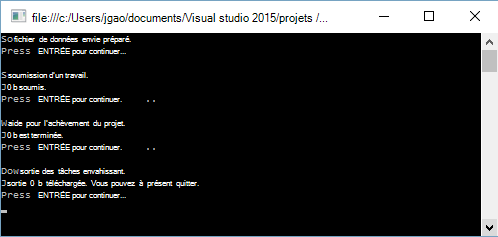

<properties 
   pageTitle="Mise en route d’Analytique de LAC de données Azure à l’aide du Kit de développement .NET | Azure" 
   description="Découvrez comment utiliser le Kit de développement .NET pour créer des comptes de la banque de données lac, créez des tâches de données lac Analytique et soumettre des requêtes écrites en SQL-U. " 
   services="data-lake-analytics" 
   documentationCenter="" 
   authors="edmacauley" 
   manager="jhubbard" 
   editor="cgronlun"/>
 
<tags
   ms.service="data-lake-analytics"
   ms.devlang="na"
   ms.topic="hero-article"
   ms.tgt_pltfrm="na"
   ms.workload="big-data" 
   ms.date="10/26/2016"
   ms.author="edmaca"/>

# Didacticiel : mise en route d’Analytique de LAC de données Azure à l’aide du Kit de développement .NET

[AZURE.INCLUDE [get-started-selector](../../includes/data-lake-analytics-selector-get-started.md)]

Découvrez comment utiliser le Kit de développement .NET Azure à soumettre des tâches d’écriture dans [l’U-SQL](data-lake-analytics-u-sql-get-started.md) données lac Analytique. Pour plus d’informations sur les données lac Analytique, consultez [vue d’ensemble de l’Analytique de LAC de données Azure](data-lake-analytics-overview.md).

Dans ce didacticiel, vous allez développer une application de console C# pour soumettre un travail U-SQL qui lit un onglet fichier CSV (TSV) et la convertit en un fichier de valeurs séparées (CSV). Pour parcourir le didacticiel même à l’aide d’autres outils pris en charge, cliquez sur les onglets en haut de cet article.

##Conditions préalables

Avant de commencer ce didacticiel, vous devez disposer des éléments suivants :

- **2015 de Visual Studio, Visual Studio 2013 mise à jour 4, ou Visual Studio 2012 avec l’installation de Visual C++**.
- **Kit de développement Microsoft Azure pour .NET version 2.5 ou supérieure**.  Installez-le à l’aide du [programme d’installation de la plate-forme Web](http://www.microsoft.com/web/downloads/platform.aspx).
- **Analytique de LAC de données Azure un compte**. Reportez-vous à la section [Gérer les données lac Analytique à l’aide du Kit de développement .NET Azure](data-lake-analytics-manage-use-dotnet-sdk.md).

##Créer l’application console

Dans ce didacticiel, vous traitez certains journaux de recherche.  Le journal de recherche peut être stocké dans le magasin de données lac ou de stockage des objets Blob Azure. 

Vous trouverez un exemple de journal de recherche dans un conteneur d’Azure Blob public. Dans l’application, vous téléchargez le fichier sur votre poste de travail et ensuite télécharger le fichier pour le compte de la banque de données lac par défaut de votre compte de données lac Analytique.

**Pour créer un script SQL-U**

Travaux d’Analytique de LAC de données sont écrites en langage SQL-U. Pour en savoir plus sur U-SQL, consultez [mise en route de langage d’U-SQL](data-lake-analytics-u-sql-get-started.md) et [référence du langage SQL-U](http://go.microsoft.com/fwlink/?LinkId=691348).

Créer un fichier **SampleUSQLScript.txt** avec le script suivant U-SQL et placez le fichier dans le **C:\temp\* * chemin d’accès.  Le chemin d’accès est codé en dur dans l’application .NET que vous créez dans la procédure suivante.  

    @searchlog =
        EXTRACT UserId          int,
                Start           DateTime,
                Region          string,
                Query           string,
                Duration        int?,
                Urls            string,
                ClickedUrls     string
        FROM "/Samples/Data/SearchLog.tsv"
        USING Extractors.Tsv();
    
    OUTPUT @searchlog   
        TO "/Output/SearchLog-from-Data-Lake.csv"
    USING Outputters.Csv();

Ce script SQL-U lit le fichier de données source à l’aide de **Extractors.Tsv()**et crée un fichier csv à l’aide de **Outputters.Csv()**. 

Dans le programme C#, vous devez préparer le fichier **/Samples/Data/SearchLog.tsv** et le dossier **/Output/** .    

Il est plus simple d’utiliser les chemins d’accès relatifs pour les fichiers stockés par défaut des données des comptes de LAC. Vous pouvez également utiliser des chemins d’accès absolus.  Par exemple 

    adl://<Data LakeStorageAccountName>.azuredatalakestore.net:443/Samples/Data/SearchLog.tsv
    
Vous devez utiliser des chemins d’accès absolus pour accéder aux fichiers dans les comptes de stockage liés.  La syntaxe pour les fichiers stockés dans le compte de stockage Azure lié est :

    wasb://<BlobContainerName>@<StorageAccountName>.blob.core.windows.net/Samples/Data/SearchLog.tsv

>[AZURE.NOTE] Il existe actuellement un problème avec le Service de LAC de données Azure.  Si l’exemple d’application est interrompue ou rencontre une erreur, vous devrez peut-être supprimer manuellement les comptes de banque de données lac & données lac Analytique que crée le script.  Si vous n’êtes pas familier avec le portail Azure, le guide de [gestion de LAC Azure données Analytique à l’aide de portail Azure](data-lake-analytics-manage-use-portal.md) va vous aider à démarrer.       

**Pour créer une application**

1. Ouvrez Visual Studio.
2. Créez une application de console C#.
3. Ouvrez la console de gestion des packages NuGet et exécutez les commandes suivantes :

        Install-Package Microsoft.Azure.Management.DataLake.Analytics -Pre
        Install-Package Microsoft.Azure.Management.DataLake.Store -Pre
        Install-Package Microsoft.Azure.Management.DataLake.StoreUploader -Pre
        Install-Package Microsoft.Rest.ClientRuntime.Azure.Authentication -Pre
        Install-Package WindowsAzure.Storage

       
5. Dans Program.cs, collez le code suivant :

        using System;
        using System.IO;
        using System.Collections.Generic;
        using System.Threading;
        using Microsoft.Rest;
        using Microsoft.Rest.Azure.Authentication;
        using Microsoft.Azure.Management.DataLake.Store;
        using Microsoft.Azure.Management.DataLake.StoreUploader;
        using Microsoft.Azure.Management.DataLake.Analytics;
        using Microsoft.Azure.Management.DataLake.Analytics.Models;
        using Microsoft.WindowsAzure.Storage.Blob;

        namespace SdkSample
        {
          class Program
          {
            private const string SUBSCRIPTIONID = "<Enter Your Azure Subscription ID>";
            private const string CLIENTID = "1950a258-227b-4e31-a9cf-717495945fc2";
            private const string DOMAINNAME = "common"; // Replace this string with the user's Azure Active Directory tenant ID or domain name, if needed.

            private static string _adlaAccountName = "<Enter an Existing Data Lake Analytics Account Name>";
            private static string _adlsAccountName = "<Enter the default Data Lake Store Account Name>";

            private static DataLakeAnalyticsAccountManagementClient _adlaClient;
            private static DataLakeStoreFileSystemManagementClient _adlsFileSystemClient;
            private static DataLakeAnalyticsJobManagementClient _adlaJobClient;
        
            private static void Main(string[] args)
            {
                string localFolderPath = @"c:\temp\";

                // Connect to Azure
                var creds = AuthenticateAzure(DOMAINNAME, CLIENTID);

                SetupClients(creds, SUBSCRIPTIONID);

                // Transfer the source file from a public Azure Blob container to Data Lake Store.
                CloudBlockBlob blob = new CloudBlockBlob(new Uri("https://adltutorials.blob.core.windows.net/adls-sample-data/SearchLog.tsv"));
                blob.DownloadToFile(localFolderPath + "SearchLog.tsv", FileMode.Create); // from WASB
                UploadFile(localFolderPath + "SearchLog.tsv", "/Samples/Data/SearchLog.tsv"); // to ADLS
                WaitForNewline("Source data file prepared.", "Submitting a job.");

                // Submit the job
                Guid jobId = SubmitJobByPath(localFolderPath + "SampleUSQLScript.txt", "My First ADLA Job");
                WaitForNewline("Job submitted.", "Waiting for job completion.");

                // Wait for job completion
                WaitForJob(jobId);
                WaitForNewline("Job completed.", "Downloading job output.");

                // Download job output
                DownloadFile(@"/Output/SearchLog-from-Data-Lake.csv", localFolderPath + "SearchLog-from-Data-Lake.csv");
        
                WaitForNewline("Job output downloaded. You can now exit.");
            }
        
            public static ServiceClientCredentials AuthenticateAzure(
                string domainName,
                string nativeClientAppCLIENTID)
            {
                // User login via interactive popup
                SynchronizationContext.SetSynchronizationContext(new SynchronizationContext());
                // Use the client ID of an existing AAD "Native Client" application.
                var activeDirectoryClientSettings = ActiveDirectoryClientSettings.UsePromptOnly(nativeClientAppCLIENTID, new Uri("urn:ietf:wg:oauth:2.0:oob"));
                return UserTokenProvider.LoginWithPromptAsync(domainName, activeDirectoryClientSettings).Result;
            }

            public static void SetupClients(ServiceClientCredentials tokenCreds, string subscriptionId)
            {
                _adlaClient = new DataLakeAnalyticsAccountManagementClient(tokenCreds);
                _adlaClient.SubscriptionId = subscriptionId;

                _adlaJobClient = new DataLakeAnalyticsJobManagementClient(tokenCreds);

                _adlsFileSystemClient = new DataLakeStoreFileSystemManagementClient(tokenCreds);
            }

            public static void UploadFile(string srcFilePath, string destFilePath, bool force = true)
            {
                var parameters = new UploadParameters(srcFilePath, destFilePath, _adlsAccountName, isOverwrite: force);
                var frontend = new DataLakeStoreFrontEndAdapter(_adlsAccountName, _adlsFileSystemClient);
                var uploader = new DataLakeStoreUploader(parameters, frontend);
                uploader.Execute();
            }

            public static void DownloadFile(string srcPath, string destPath)
            {
                var stream = _adlsFileSystemClient.FileSystem.Open(_adlsAccountName, srcPath);
                var fileStream = new FileStream(destPath, FileMode.Create);

                stream.CopyTo(fileStream);
                fileStream.Close();
                stream.Close();
            }

            // Helper function to show status and wait for user input
            public static void WaitForNewline(string reason, string nextAction = "")
            {
                Console.WriteLine(reason + "\r\nPress ENTER to continue...");

                Console.ReadLine();

                if (!String.IsNullOrWhiteSpace(nextAction))
                    Console.WriteLine(nextAction);
            }

            // List all Data Lake Analytics accounts within the subscription
            public static List<DataLakeAnalyticsAccount> ListADLAAccounts()
            {
                var response = _adlaClient.Account.List();
                var accounts = new List<DataLakeAnalyticsAccount>(response);

                while (response.NextPageLink != null)
                {
                    response = _adlaClient.Account.ListNext(response.NextPageLink);
                    accounts.AddRange(response);
                }

                Console.WriteLine("You have %i Data Lake Analytics account(s).", accounts.Count);
                for (int i = 0; i < accounts.Count; i++)
                {
                    Console.WriteLine(accounts[i].Name);
                }

                return accounts;
            }
            public static Guid SubmitJobByPath(string scriptPath, string jobName)
            {
                var script = File.ReadAllText(scriptPath);

                var jobId = Guid.NewGuid();
                var properties = new USqlJobProperties(script);
                var parameters = new JobInformation(jobName, JobType.USql, properties, priority: 1, degreeOfParallelism: 1, jobId: jobId);
                var jobInfo = _adlaJobClient.Job.Create(_adlaAccountName, jobId, parameters);

                return jobId;
            }

            public static JobResult WaitForJob(Guid jobId)
            {
                var jobInfo = _adlaJobClient.Job.Get(_adlaAccountName, jobId);
                while (jobInfo.State != JobState.Ended)
                {
                    jobInfo = _adlaJobClient.Job.Get(_adlaAccountName, jobId);
                }
                return jobInfo.Result.Value;
            }
          }
        }

6. Appuyez sur **F5** pour exécuter l’application. La sortie ressemble à :

    

7. Vérifiez le fichier de sortie.  Le chemin d’accès et le nom par défaut est c:\Temp\SearchLog-from-Data-Lake.csv.

## Voir aussi

- Pour consulter le didacticiel même à l’aide d’autres outils, cliquez sur les sélecteurs de l’onglet en haut de la page.
- Pour voir une requête plus complexe, consultez [les journaux de site Web d’analyse à l’aide d’Azure données lac Analytique](data-lake-analytics-analyze-weblogs.md).
- Pour commencer à développer des applications de U-SQL, consultez [scripts de développer U-SQL à l’aide des outils de LAC de données pour Visual Studio](data-lake-analytics-data-lake-tools-get-started.md).
- Pour en savoir plus U SQL, voir [mise en route de la langue du lac de données Azure Analytique U-SQL](data-lake-analytics-u-sql-get-started.md)et [référence du langage SQL-U](http://go.microsoft.com/fwlink/?LinkId=691348).
- Pour les tâches de gestion, voir [gestion de LAC Azure données Analytique à l’aide d’Azure portal](data-lake-analytics-manage-use-portal.md).
- Pour obtenir une vue d’ensemble de données lac Analytique, consultez [vue d’ensemble de l’Analytique de LAC de données Azure](data-lake-analytics-overview.md).
