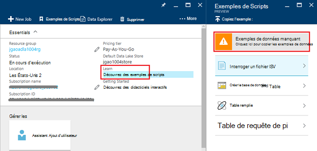
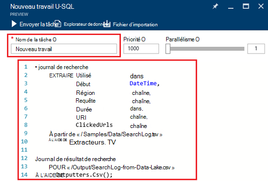
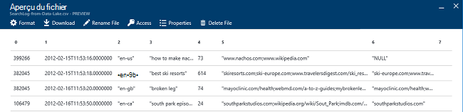

<properties 
   pageTitle="Mise en route d’Analytique de LAC de données Azure à l’aide du portail Azure | Azure" 
   description="Apprenez à utiliser le portail Azure pour créer un compte Analytique lac de données, créer un travail de données lac Analytique à l’aide de SQL-U et soumettre la tâche. " 
   services="data-lake-analytics" 
   documentationCenter="" 
   authors="edmacauley" 
   manager="jhubbard" 
   editor="cgronlun"/>
 
<tags
   ms.service="data-lake-analytics"
   ms.devlang="na"
   ms.topic="hero-article"
   ms.tgt_pltfrm="na"
   ms.workload="big-data" 
   ms.date="10/06/2016"
   ms.author="edmaca"/>

# Didacticiel : mise en route d’Analytique de LAC de données Azure à l’aide du portail Azure

[AZURE.INCLUDE [get-started-selector](../../includes/data-lake-analytics-selector-get-started.md)]

Apprenez à utiliser le portail Azure pour créer des comptes d’Azure données lac Analytique, définir les tâches de données lac Analytique dans [U-SQL](data-lake-analytics-u-sql-get-started.md)et soumettre les tâches au service de données lac Analytique. Pour plus d’informations sur les données lac Analytique, consultez [vue d’ensemble de l’Analytique de LAC de données Azure](data-lake-analytics-overview.md).

Dans ce didacticiel, vous développez un travail qui lit un onglet séparé les fichier TSV (valeurs) et le convertit en un fichier séparés par des virgules (CSV). Pour parcourir le didacticiel même à l’aide d’autres outils pris en charge, cliquez sur les onglets en haut de cette section. Une fois votre première tâche réussit, peut commencer à écrire des transformations de données plus complexes avec SQL-U.

##Conditions préalables

Avant de commencer ce didacticiel, vous devez disposer des éléments suivants :

- **Abonnement d’un Azure**. Consultez [Azure d’obtenir la version d’évaluation gratuite](https://azure.microsoft.com/pricing/free-trial/).

##Créer le compte de données lac Analytique

Vous devez avoir un compte de données lac Analytique avant de pouvoir exécuter toutes les tâches.

Chaque compte Analytique lac de données possède une dépendance de compte [Azure Data Store de LAC]() .  Ce compte est désigné comme le compte de la banque de données lac par défaut.  Vous pouvez créer le compte de banque de données lac au préalable ou lorsque vous créez votre compte Analytique lac de données. Dans ce didacticiel, vous allez créer le compte de la banque de données LAC avec le compte de données lac Analytique.

**Pour créer un compte Analytique lac de données**

1. Ouvrez une session sur le [portail Azure](https://portal.azure.com).
2. Cliquez sur **Nouveau**et cliquez sur **Intelligence + analytique**, puis cliquez sur **Données lac Analytique**.
3. Tapez ou sélectionnez les valeurs suivantes :

    

    - **Nom**: nom du compte Analytique lac de données.
    - **Abonnement**: choisissez l’abonnement Azure utilisé pour le compte Analytique.
    - **Groupe de ressources**. Sélectionnez un groupe de ressources Azure existant ou créer un nouveau. Azure Resource Manager vous permet de travailler avec les ressources de votre application en tant que groupe. Pour plus d’informations, consultez [Vue d’ensemble du Gestionnaire de ressources Azure](resource-group-overview.md). 
    - **Emplacement**. Permet de sélectionner un centre de données Azure pour le compte de données lac Analytique. 
    - **Magasin de données lac**: compte de chaque Analytique de LAC de données possède un compte de banque de données lac dépendant. Le compte Analytique lac de données et le compte de banque de données lac dépendant doivent se trouver dans le même centre de données Azure. Suivez les instructions pour créer un nouveau compte de banque de données lac ou sélectionnez-en une existante.

8. Cliquez sur **créer**. Il ouvre l’écran d’accueil du portail. Une nouvelle mosaïque est ajoutée à la StartBoard avec l’étiquette affiche « Déploiement d’Azure données lac Analytique ». Il prend un certain temps pour créer un compte Analytique lac de données. Lorsque le compte est créé, le portail ouvre le compte sur une nouvelle lame.

Après avoir créé un compte Analytique lac de données, vous pouvez ajouter des comptes de banque de données lac supplémentaires et de stockage Azure. Pour obtenir des instructions, reportez-vous à la section [gestion de données lac Analytique du compte des sources de données](data-lake-analytics-manage-use-portal.md#manage-account-data-sources).

##Préparer les données source

Dans ce didacticiel, vous traitez certains journaux de recherche.  Le journal de recherche peut être stocké dans le magasin du lac de dData ou de stockage des objets Blob Azure. 

Le portail Azure fournit une interface utilisateur pour la copie de certains fichiers de données d’exemple pour le compte de banque de données lac par défaut qui incluent un fichier de journal de recherche.

**Pour copier des fichiers de données**

1. À partir du [portail Azure](https://portal.azure.com), ouvrez votre compte de données lac Analytique.  Consultez [les comptes de gestion de données lac Analytique](data-lake-analytics-get-started-portal.md#manage-accounts) pour le créer et ouvrez un compte dans le portail.
3. Développer le volet **Essentials** , puis cliquez sur **Explorer exemples de scripts**. Il ouvre une autre lame appelé des **Exemples de Scripts**.

    

4. Cliquez sur **Échantillon des données manquantes** pour copier les fichiers de données d’exemple. Lorsqu’il est terminé, le portail affiche des **données d’exemples mis à jour avec succès**.
7. À partir de la blade de compte analytique du lac de données, cliquez sur **Explorateur de données** dans la partie supérieure. 

    

    Il ouvre deux lames. Un est **L’Explorateur de données**, et l’autre est le compte de la banque de données lac par défaut.
8. De la lame de compte de banque de données lac par défaut, cliquez sur **exemples** pour développer le dossier, puis cliquez sur **données** pour développer le dossier. S’affiche les fichiers et les dossiers suivants :

    - AmbulanceData /
    - AdsLog.tsv
    - SearchLog.tsv
    - version.txt
    - WebLog.log
    
    Dans ce didacticiel, vous utilisez SearchLog.tsv.

Dans la pratique, vous soit par programme vos applications pour écrire des données dans un compte de stockage ou de télécharger des données. Pour le téléchargement de fichiers, voir [télécharger les données de magasin de données lac](data-lake-analytics-manage-use-portal.md#upload-data-to-adls) ou [télécharger des données pour le stockage des objets Blob](data-lake-analytics-manage-use-portal.md#upload-data-to-wasb).

##Créer et soumettre les tâches de données lac Analytique

Une fois que vous avez préparé la source de données, vous pouvez démarrer le développement d’un script SQL de l’U.  

**Pour soumettre un travail**

1. À partir de la blade lac de données analytique compte sur le portail, cliquez sur **Nouvelle tâche**. 

    

    Si vous ne voyez pas la lame, voir [Ouvrir un compte Analytique lac de données à partir du portail](data-lake-analytics-manage-use-portal.md#access-adla-account).
2. Entrez le **Nom de la tâche**et le script U-SQL suivant :

        @searchlog =
            EXTRACT UserId          int,
                    Start           DateTime,
                    Region          string,
                    Query           string,
                    Duration        int?,
                    Urls            string,
                    ClickedUrls     string
            FROM "/Samples/Data/SearchLog.tsv"
            USING Extractors.Tsv();
        
        OUTPUT @searchlog   
            TO "/Output/SearchLog-from-Data-Lake.csv"
        USING Outputters.Csv();

    

    Ce script SQL-U lit le fichier de données source à l’aide de **Extractors.Tsv()**et crée un fichier csv à l’aide de **Outputters.Csv()**. 
    
    Ne modifiez pas les deux chemins d’accès, sauf si vous copiez le fichier source dans un autre emplacement.  Données lac Analytique crée le dossier de sortie si elle n’existe pas.  Dans ce cas, nous utilisons des chemins d’accès simples et relatives.  
    
    Il est plus simple d’utiliser des chemins d’accès relatifs pour les fichiers stockés dans les comptes du lac de données par défaut. Vous pouvez également utiliser des chemins d’accès absolus.  Par exemple 
    
        adl://<Data LakeStorageAccountName>.azuredatalakestore.net:443/Samples/Data/SearchLog.tsv
      

    Pour plus d’informations sur SQL-U, consultez [mise en route de la langue du lac de données Azure Analytique U-SQL](data-lake-analytics-u-sql-get-started.md) et [référence du langage SQL de l’U](http://go.microsoft.com/fwlink/?LinkId=691348).
     
3. Cliquez sur **Soumettre une tâche** à partir du haut.   
4. Attendez que l’état du travail devient **a réussi**. Vous pouvez voir que le travail a duré environ une minute pour terminer.
    
    En cas d’échec de la tâche, reportez-vous à la section [moniteur et résoudre les tâches de données lac Analytique](data-lake-analytics-monitor-and-troubleshoot-jobs-tutorial.md).

5. En bas de la lame, cliquez sur l’onglet **sortie** , puis cliquez sur **SearchLog de données Lake.csv**. Vous pouvez afficher un aperçu, télécharger, renommer et supprimer le fichier de sortie.

    

##Voir aussi

- Pour voir une requête plus complexe, consultez [les journaux de site Web d’analyse à l’aide d’Azure données lac Analytique](data-lake-analytics-analyze-weblogs.md).
- Pour commencer à développer des applications de U-SQL, consultez [scripts de développer U-SQL à l’aide des outils de LAC de données pour Visual Studio](data-lake-analytics-data-lake-tools-get-started.md).
- Pour en savoir plus U-SQL, consultez [mise en route du lac de données Azure Analytique U-SQL language](data-lake-analytics-u-sql-get-started.md).
- Pour les tâches de gestion, voir [gestion de LAC Azure données Analytique à l’aide d’Azure portal](data-lake-analytics-manage-use-portal.md).
- Pour obtenir une vue d’ensemble de données lac Analytique, consultez [vue d’ensemble de l’Analytique de LAC de données Azure](data-lake-analytics-overview.md).
- Pour consulter le didacticiel même à l’aide d’autres outils, cliquez sur les sélecteurs de l’onglet en haut de la page.
- Pour enregistrer des informations de diagnostic, consultez [accès à des journaux de diagnostics pour Azure données lac Analytique](data-lake-analytics-diagnostic-logs.md)
