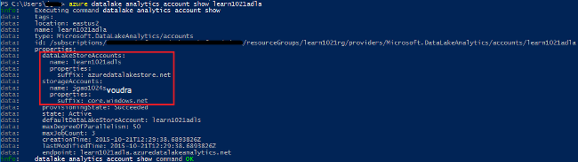
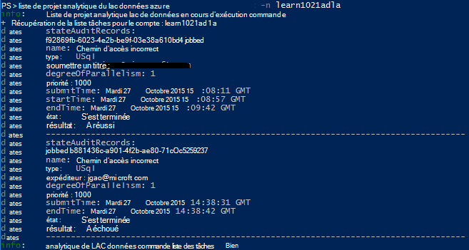

<properties 
   pageTitle="Gérer l’Analytique de LAC de données Azure utilisant l’Interface de ligne de commande de Azure | Azure" 
   description="Apprenez à gérer les comptes de données lac Analytique, les sources de données, les travaux et les utilisateurs à l’aide de la CLI d’Azure" 
   services="data-lake-analytics" 
   documentationCenter="" 
   authors="edmacauley" 
   manager="jhubbard" 
   editor="cgronlun"/>
 
<tags
   ms.service="data-lake-analytics"
   ms.devlang="na"
   ms.topic="article"
   ms.tgt_pltfrm="na"
   ms.workload="big-data" 
   ms.date="05/16/2016"
   ms.author="edmaca"/>

# Gérer l’Analytique de LAC de données Azure à l’aide d’Azure Interface de ligne de commande (CLI)

[AZURE.INCLUDE [manage-selector](../../includes/data-lake-analytics-selector-manage.md)]

Apprenez à gérer les comptes d’Azure données lac Analytique, sources de données, des utilisateurs et tâches à l’aide de l’Azure. Pour afficher la rubrique de gestion à l’aide d’autres outils, cliquez sur l’onglet, sélectionnez ci-dessus.

**Conditions préalables**

Avant de commencer ce didacticiel, vous devez disposer des éléments suivants :

- **Abonnement d’un Azure**. Consultez [Azure d’obtenir la version d’évaluation gratuite](https://azure.microsoft.com/pricing/free-trial/).
- **CLI azure**. Consultez [installer et configurer l’infrastructure du langage commun Azure](../xplat-cli-install.md).
    - Téléchargez et installez la **version préliminaire** [Outils d’Azure CLI](https://github.com/MicrosoftBigData/AzureDataLake/releases) pour effectuer cette démonstration.
- **Authentification**, à l’aide de la commande suivante :

        azure login
    Pour plus d’informations sur l’authentification à l’aide d’un compte de travail ou à l’école, voir [se connecter à un abonnement Azure à partir de la CLI d’Azure](../xplat-cli-connect.md).
- **Basculer vers le mode Azure le Gestionnaire de ressources**à l’aide de la commande suivante :

        azure config mode arm

**Pour répertorier les commandes données lac magasin et données lac Analytique :**

    azure datalake store
    azure datalake analytics

<!-- ################################ -->
<!-- ################################ -->
## Gérer les comptes

Avant d’exécuter les tâches de données lac Analytique, vous devez disposer d’un compte Analytique lac de données. À la différence d’Azure, HDInsight, vous payez un compte Analytique lorsqu’il n’est pas exécuté un travail.  Vous ne payez que pour le temps que lorsqu’il exécute une tâche.  Pour plus d’informations, voir [Vue d’ensemble de Azure données lac Analytique](data-lake-analytics-overview.md).  

###Créer des comptes

    azure datalake analytics account create "<Data Lake Analytics Account Name>" "<Azure Location>" "<Resource Group Name>" "<Default Data Lake Account Name>"

###Mettre à jour des comptes

La commande suivante met à jour les propriétés d’un compte Analytique de LAC données existant
    
    azure datalake analytics account set "<Data Lake Analytics Account Name>"

###Liste des comptes

Comptes de liste données lac Analytique 

    azure datalake analytics account list

Comptes d’Analytique de liste données lac au sein d’un groupe de ressources spécifique

    azure datalake analytics account list -g "<Azure Resource Group Name>"

Obtenir des détails d’un compte Analytique lac de données spécifique

    azure datalake analytics account show -g "<Azure Resource Group Name>" -n "<Data Lake Analytics Account Name>"

###Supprimer des comptes de données lac Analytique

    azure datalake analytics account delete "<Data Lake Analytics Account Name>"

<!-- ################################ -->
<!-- ################################ -->
## Gérer les sources de données de compte

Données lac Analytique prend actuellement en charge les sources de données suivantes :

- [Magasin de LAC de données Azure](../data-lake-store/data-lake-store-overview.md)
- [Stockage Azure](../storage/storage-introduction.md)

Lorsque vous créez un compte Analytique, vous devez désigner un compte de stockage Azure LAC pour être le compte de stockage par défaut. Le compte de stockage ADL par défaut permet de stocker les journaux de d’audit de métadonnées et une tâche de travail. Après avoir créé un compte Analytique, vous pouvez ajouter des comptes supplémentaires de stockage de données LAC et/ou le compte de stockage Azure. 

### Recherchez le compte de stockage par défaut ADL

    azure datalake analytics account show "<Data Lake Analytics Account Name>"

La valeur est répertoriée sous propriétés : datalakeStoreAccount:name.

### Ajouter des comptes supplémentaires de stockage Azure Blob

    azure datalake analytics account datasource add -n "<Data Lake Analytics Account Name>" -b "<Azure Blob Storage Account Short Name>" -k "<Azure Storage Account Key>"

>[AZURE.NOTE] Que Blob stockage des noms courts sont pris en charge.  N’utilisez pas de nom de domaine complet, par exemple « myblob.blob.core.windows.net ».

### Ajouter des comptes supplémentaires de magasin de données lac

    azure datalake analytics account datasource add -n "<Data Lake Analytics Account Name>" -l "<Data Lake Store Account Name>" [-d]

[-d] est un commutateur facultatif pour indiquer si le lac de données ajouté est le compte du lac de données par défaut. 

### Mettre à jour la source de données existante

Pour définir un compte de banque de données lac existant par défaut :

    azure datalake analytics account datasource set -n "<Data Lake Analytics Account Name>" -l "<Azure Data Lake Store Account Name>" -d
      
Pour mettre à jour une clé de compte de stockage Blob existante :

    azure datalake analytics account datasource set -n "<Data Lake Analytics Account Name>" -b "<Blob Storage Account Name>" -k "<New Blob Storage Account Key>"

### Liste des sources de données :

    azure datalake analytics account show "<Data Lake Analytics Account Name>"
    

### Supprimer les sources de données :

Pour supprimer un compte de banque de données lac :

    azure datalake analytics account datasource delete "<Data Lake Analytics Account Name>" "<Azure Data Lake Store Account Name>"

Pour supprimer un compte de stockage Blob :

    azure datalake analytics account datasource delete "<Data Lake Analytics Account Name>" "<Blob Storage Account Name>"

## Gérer les travaux

Vous devez avoir un compte de données lac Analytique avant de pouvoir créer une tâche.  Pour plus d’informations, reportez-vous à la section [Analytique de LAC données de gérer les comptes](#manage-accounts).

### Liste des tâches

    azure datalake analytics job list -n "<Data Lake Analytics Account Name>"

### Obtenir les détails de la tâche

    azure datalake analytics job show -n "<Data Lake Analytics Account Name>" -j "<Job ID>"
    
### Soumettre des travaux

> [AZURE.NOTE] La priorité par défaut d’une tâche est de 1000 et degré de parallélisme pour une tâche par défaut est 1.

    azure datalake analytics job create  "<Data Lake Analytics Account Name>" "<Job Name>" "<Script>"

### Annuler les travaux

Utilisez la commande de liste pour trouver l’id de la tâche et puis utilisez Annuler pour annuler le travail.

    azure datalake analytics job list -n "<Data Lake Analytics Account Name>"
    azure datalake analytics job cancel "<Data Lake Analytics Account Name>" "<Job ID>"

## Gérer le catalogue

Le catalogue SQL-U permet de structurer les données et le code afin qu’ils puissent être partagés par les scripts SQL de l’U. Le catalogue permet les meilleures performances possibles avec les données dans Azure données lac. Pour plus d’informations, consultez le [catalogue d’utilisation U-SQL](data-lake-analytics-use-u-sql-catalog.md).
 
###Liste des articles du catalogue

    #List databases
    azure datalake analytics catalog list -n "<Data Lake Analytics Account Name>" -t database

    #List tables
    azure datalake analytics catalog list -n "<Data Lake Analytics Account Name>" -t table
    
Les types incluent la base de données, schémas, assembly, source de données externe, table, fonction table ou statistiques de la table.

###Créer le secret du catalogue

    azure datalake analytics catalog secret create -n "<Data Lake Analytics Account Name>" <databaseName> <hostUri> <secretName>

### Modification du code secret catalogue

    azure datalake analytics catalog secret set -n "<Data Lake Analytics Account Name>" <databaseName> <hostUri> <secretName>

###Supprimer le secret du catalogue

    azure datalake analytics catalog secrete delete -n "<Data Lake Analytics Account Name>" <databaseName> <hostUri> <secretName>

<!-- ################################ -->
<!-- ################################ -->
## Utilisez des groupes ARM

Les applications sont généralement composées de nombreux composants, par exemple une application web, de base de données, serveur de base de données, stockage et services de tiers 3e. Le Gestionnaire de ressources Azure (ARM) vous permet de travailler avec les ressources de votre application en tant que groupe, visé un groupe de ressources Azure. Vous pouvez déployer, mettre à jour, surveiller ou supprimer toutes les ressources de votre application dans une opération unique et coordonnée. Vous utilisez un modèle de déploiement, et ce modèle peut fonctionner dans différents environnements comme test, intermédiaire et production. Vous pouvez clarifier la facturation pour votre organisation en affichant les coûts reportées pour le groupe entier. Pour plus d’informations, consultez [Vue d’ensemble du Gestionnaire de ressources Azure](../azure-resource-manager/resource-group-overview.md). 

Un service de données lac Analytique peut inclure les éléments suivants :

- Compte Analytique de LAC de données Azure
- Compte de stockage Azure lac par défaut requis
- Comptes de stockage complémentaire Azure données lac
- Comptes de stockage Azure supplémentaires

Vous pouvez créer tous ces composants sous un groupe ARM pour les rendre plus faciles à gérer.

Un compte Analytique lac de données et les comptes de stockage dépendant doivent être placés dans le même centre de données Azure.
Toutefois, le groupe ARM peut se trouver dans un autre centre de données.  

##Voir aussi 

- [Vue d’ensemble de Microsoft Azure données lac Analytique](data-lake-analytics-overview.md)
- [Mise en route d’Analytique de LAC de données à l’aide du portail Azure](data-lake-analytics-get-started-portal.md)
- [Gérer l’Analytique de LAC de données Azure à l’aide du portail Azure](data-lake-analytics-manage-use-portal.md)
- [Surveiller et résoudre les problèmes de travaux Azure données lac Analytique à l’aide du portail Azure](data-lake-analytics-monitor-and-troubleshoot-jobs-tutorial.md)

