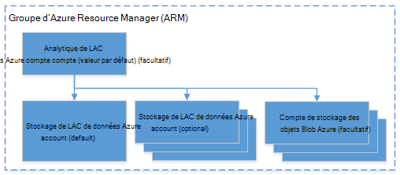

<properties 
   pageTitle="Gérer l’Analytique de LAC de données Azure via le portail Azure | Azure" 
   description="Découvrez comment gérer les données lac Analytique acounts, des sources de données, les utilisateurs et les tâches." 
   services="data-lake-analytics" 
   documentationCenter="" 
   authors="edmacauley" 
   manager="jhubbard" 
   editor="cgronlun"/>
 
<tags
   ms.service="data-lake-analytics"
   ms.devlang="na"
   ms.topic="article"
   ms.tgt_pltfrm="na"
   ms.workload="big-data" 
   ms.date="10/06/2016"
   ms.author="edmaca"/>

# Gérer l’Analytique de LAC de données Azure à l’aide du portail Azure

[AZURE.INCLUDE [manage-selector](../../includes/data-lake-analytics-selector-manage.md)]

Apprenez à gérer les comptes d’Azure données lac Analytique, sources de données de compte, les utilisateurs et travaux via le portail Azure. Pour afficher les rubriques de gestion à l’aide d’autres outils, cliquez sur le sélecteur de tabulations en haut de la page.

**Conditions préalables**

Avant de commencer ce didacticiel, vous devez disposer des éléments suivants :

- **Abonnement d’un Azure**. Consultez [Azure d’obtenir la version d’évaluation gratuite](https://azure.microsoft.com/pricing/free-trial/).

<!-- ################################ -->
<!-- ################################ -->
## Gérer les comptes

Avant d’exécuter les tâches de données lac Analytique, vous devez disposer d’un compte Analytique lac de données. À la différence d’Azure, HDInsight, vous ne payez que pour un compte Analytique lac de données lorsque vous exécutez une tâche.  Vous ne payez que pour le temps que lorsqu’il exécute une tâche.  Pour plus d’informations, voir [Vue d’ensemble de Azure données lac Analytique](data-lake-analytics-overview.md).  

**Pour créer un compte Analytique lac de données**

1. Ouvrez une session sur le [portail Azure](https://portal.azure.com).
2. Cliquez sur **Nouveau**et cliquez sur **Intelligence + analytique**, puis cliquez sur **Données lac Analytique**.
3. Tapez ou sélectionnez les valeurs suivantes :

    

    - **Nom**: nom du compte Analytique lac de données.
    - **Abonnement**: choisissez l’abonnement Azure utilisé pour le compte Analytique.
    - **Groupe de ressources**. Sélectionnez un groupe de ressources Azure existant ou créer un nouveau. Azure Resource Manager vous permet de travailler avec les ressources de votre application en tant que groupe. Pour plus d’informations, consultez [Vue d’ensemble du Gestionnaire de ressources Azure](resource-group-overview.md). 
    - **Emplacement**. Permet de sélectionner un centre de données Azure pour le compte de données lac Analytique. 
    - **Magasin de données lac**: compte de chaque Analytique de LAC de données possède un compte de banque de données lac dépendant. Le compte Analytique lac de données et le compte de banque de données lac dépendant doivent se trouver dans le même centre de données Azure. Suivez les instructions pour créer un nouveau compte de banque de données lac ou sélectionnez-en une existante.

8. Cliquez sur **créer**. Il ouvre l’écran d’accueil du portail. Une nouvelle mosaïque est ajoutée à la StartBoard avec l’étiquette affiche « Déploiement d’Azure données lac Analytique ». Il prend un certain temps pour créer un compte Analytique lac de données. Lorsque le compte est créé, le portail ouvre le compte sur une nouvelle lame.

Après avoir créé un compte Analytique lac de données, vous pouvez ajouter des comptes de banque de données lac supplémentaires et de stockage Azure. Pour obtenir des instructions, reportez-vous à la section [gestion de données lac Analytique du compte des sources de données](data-lake-analytics-manage-use-portal.md#manage-account-data-sources).

**Accès/Ouvrir un compte Analytique lac de données**

1. Ouvrez une session sur le [portail Azure](https://portal.azure.com/).
2. Dans le menu de gauche, cliquez sur **Données lac Analytique** .  Si vous ne le voyez pas, cliquez sur **plus de services**, puis cliquez sur **Données lac Analytique** sous **Intelligence + Analytique**.
3. Cliquez sur le compte Analytique lac de données auquel vous souhaitez accéder. Le compte s’ouvre dans une nouvelle lame.

**Pour supprimer un compte Analytique lac de données**

1. Ouvrez le compte Analytique lac de données que vous souhaitez supprimer. Pour plus d’informations, voir [comptes d’accès aux données lac Analytique](#access-adla-account).
2. Cliquez sur **Supprimer** dans le menu du bouton en haut de la lame.
3. Tapez le nom du compte, puis cliquez sur **Supprimer**.

Suppression d’un compte Analytique du lac données ne supprime pas les comptes de banque de données lac dépendants. Pour obtenir des instructions de suppression de comptes de stockage de données lac, voir [Supprimer données lac compte](data-lake-store-get-started-portal.md#delete-azure-data-lake-store-account).

<!-- ################################ -->
<!-- ################################ -->
## Gérer les sources de données de compte

Données lac Analytique prend actuellement en charge les sources de données suivantes :

- [Magasin de LAC de données Azure](../data-lake-store/data-lake-store-overview.md)
- [Stockage Azure](../storage/storage-introduction.md)

Lorsque vous créez un compte Analytique lac de données, vous devez désigner un compte Azure données lac banque pour le compte de stockage par défaut. Le compte de la banque de données lac par défaut permet de stocker les journaux de d’audit de métadonnées et une tâche de travail. Après avoir créé un compte Analytique lac de données, vous pouvez ajouter des comptes de banque de données lac supplémentaires et/ou un compte de stockage Azure. 

**Pour trouver le compte de stockage du lac de données par défaut**

- Ouvrez le compte Analytique lac de données que vous souhaitez gérer. Pour plus d’informations, voir [comptes d’accès aux données lac Analytique](#access-adla-account). La banque de données lac par défaut illustrée **essentielles**:

    

**Pour ajouter des sources de données supplémentaires**

1. Ouvrez le compte Analytique lac de données que vous souhaitez gérer. Pour plus d’informations, voir [comptes d’accès aux données lac Analytique](#access-adla-account).
2. Cliquez sur **paramètres** , puis sur **Sources de données**. Vous doit voir le compte de banque de données lac par défaut dans la liste. 
3. Cliquez sur **Ajouter une Source de données**.

    

    Pour ajouter un compte de banque de LAC de données Azure, vous devez le compte, accès et le nom au compte pour être en mesure de l’interroger.
    Pour ajouter un stockage Azure Blob, vous devez le compte de stockage et de la clé de compte, que vous trouverez en naviguant vers le compte de stockage dans le portail.

**Pour Explorer les sources de données**  

1. Ouvrez le compte Analytique que vous souhaitez gérer. Pour plus d’informations, voir [comptes d’accès aux données lac Analytique](#access-adla-account).
2. Cliquez sur **paramètres** , puis sur **Explorateur de données**. 
 
    
    
3. Cliquez sur un compte de banque de données LAC pour ouvrir le compte.

    
    
    Pour chaque compte de la banque de données lac, vous pouvez
    
    - **Nouveau dossier**: ajouter le nouveau dossier.
    - **Télécharger**: télécharger des fichiers à partir de votre station de travail pour le compte de stockage.
    - **Accès**: accès de configurer les autorisations.
    - **Renommer le dossier**: renommer un dossier.
    - **Propriétés du dossier**: afficher les propriétés de fichier ou un dossier, comme chemin WASB, de WEBHDFS, heure de dernière modification et ainsi de suite.
    - **Supprimer le dossier**: supprimer un dossier.

**Pour télécharger des fichiers à compte de la banque de données lac**

1. À partir du portail, cliquez sur **Parcourir** dans le menu de gauche, puis cliquez sur le **Magasin de données lac**.
2. Cliquez sur le compte de banque de données lac que vous souhaitez télécharger des données. Pour trouver le compte de stockage lac de données par défaut, reportez-vous à la section [ici](#default-adl-account).
3. Dans le menu supérieur, cliquez sur **Explorateur de données** .
4. Cliquez sur **Nouveau répertoire** pour créer un nouveau dossier, ou cliquez sur un nom de dossier pour changer de dossier.
6. Dans le menu supérieur pour télécharger le fichier, cliquez sur **Télécharger** .

**Pour télécharger des fichiers à compte de stockage Azure Blob**

Voir [télécharger les données pour les travaux d’Hadoop dans HDInsight](../hdinsight/hdinsight-upload-data.md).  Les informations s’appliquent aux données lac Analytique.

## Gérer les utilisateurs

Données lac Analytique utilise les contrôle d’accès basé sur les rôles avec Azure Active Directory. Lorsque vous créez un compte de données lac Analytique, un rôle « Abonnement Admins » est ajouté au compte. Vous pouvez ajouter des utilisateurs et des groupes de sécurité avec les rôles suivants :

|Rôle|Description|
|----|-----------|
|Propriétaire|Vous permettent de gérer tous les éléments, y compris l’accès aux ressources.|
|Collaborateur|Accéder au portail ; soumettre et contrôler les travaux. Pour être en mesure de soumettre des travaux, un collaborateur a besoin de l’autorisation de lecture ou d’écriture dans les comptes de la banque de données lac.|
|DataLakeAnalyticsDeveloper | Soumettre, surveiller et annuler les travaux.  Ces utilisateurs ne peuvent annuler que leurs propres travaux. Ils ne peuvent pas gérer leur propre compte, par exemple, ajouter des utilisateurs, modifier les autorisations ou supprimer le compte. Pour être en mesure d’exécuter des travaux, ils ont besoin d’accès en lecture ou écriture dans les comptes de la banque de données lac     | 
|Lecteur|Vous permet de vous permet d’afficher tous les éléments, mais pas apporter des modifications.|  
|Utilisateur de laboratoires DevTest|Vous permet d’afficher tous les éléments et de se connecter, Démarrer, de redémarrage et d’arrêt des machines virtuelles.|  
|Administrateur d’accès utilisateur|Vous permet de gérer l’accès des utilisateurs aux ressources Azure.|  

Pour plus d’informations sur la création de groupes de sécurité et des utilisateurs Active Directory de Azure, consultez [Azure Active Directory](../active-directory/active-directory-whatis.md).

**Pour ajouter des utilisateurs ou des groupes de sécurité pour un compte Analytique lac de données**

1. Ouvrez le compte Analytique que vous souhaitez gérer. Pour plus d’informations, voir [comptes d’accès aux données lac Analytique](#access-adla-account).
2. Cliquez sur **paramètres**, puis cliquez sur **utilisateurs**. Vous pouvez également cliquer sur **accès** dans la barre de titre **Essentials** , comme illustré dans la capture d’écran suivante :

    
3. À partir de la blade **d’utilisateur** , cliquez sur **Ajouter**.
4. Sélectionnez un rôle et ajouter un utilisateur, puis cliquez sur **OK**.

**Remarque : Si cet utilisateur ou ce groupe de sécurité doit soumettre des travaux, ils doivent être donné l’autorisation sur la banque ainsi que de données lac. Pour plus d’informations, voir [sécuriser les données stockées dans le magasin de données lac](../data-lake-store/data-lake-store-secure-data.md).**

<!-- ################################ -->
<!-- ################################ -->
## Gérer les travaux

Vous devez avoir un compte de données lac Analytique avant de pouvoir exécuter toutes les tâches SQL-U.  Pour plus d’informations, reportez-vous à la section [Analytique de LAC données de gérer les comptes](#manage-data-lake-analytics-accounts).

**Pour créer un travail**

1. Ouvrez le compte Analytique que vous souhaitez gérer. Pour plus d’informations, voir [comptes d’accès aux données lac Analytique](#access-adla-account).
2. Cliquez sur **nouvelle tâche**.

    

    Vous doit voir une nouvelle lame semblable à :

    

    Pour chaque tâche, vous pouvez configurer

  	|Nom|Description|
  	|----|-----------|
  	|Nom de la tâche|Entrez le nom de la tâche.|
  	|Priorité|Numéro inférieur a une priorité plus élevée. Si deux tâches sont tous les deux en file d’attente, l’une avec faible priorité s’exécute en premier|
  	|Parallélisme |Nombre maximal de processus de calcul qui peut se produire en même temps. Augmentation de cette valeur peut améliorer les performances, mais peut également augmenter le coût.|
  	|Script|Entrez le script SQL-U pour la tâche.|

    À l’aide de la même interface, vous pouvez également Explorer les sources de données et ajouter des fichiers supplémentaires aux sources de données liées. 
3. Si vous souhaitez soumettre la tâche, cliquez sur **Soumettre un travail** .

**Pour soumettre un travail**

Voir [les travaux de création de données lac Analytique](#create-job).

**Travaux à surveiller**

1. Ouvrez le compte Analytique que vous souhaitez gérer. Pour plus d’informations, voir [comptes d’accès aux données lac Analytique](#access-adla-account). Le panneau de gestion des tâches affiche les informations de base de travail :

    

3. Comme le montre la capture d’écran précédente, cliquez sur **Gestion des travaux** .

    

4. Cliquez sur une tâche à partir de la liste. Ou cliquez sur **filtre** pour vous aider à trouver les tâches :

    

    Vous pouvez filtrer les tâches par **Période**, **Le nom du travail**et **l’auteur**.
5. Si vous souhaitez le soumettre, cliquez sur **soumettre à nouveau** .

**Soumettre un travail**

Voir [Moniteur de données lac Analytique des travaux](#monitor-jobs).

##Surveiller l’utilisation de compte

**Pour surveiller l’utilisation du compte**

1. Ouvrez le compte Analytique que vous souhaitez gérer. Pour plus d’informations, voir [comptes d’accès aux données lac Analytique](#access-adla-account). Le panneau d’utilisation montre l’utilisation de :

    

2. Double-cliquez sur le volet pour voir plus de détails.

##Afficher le catalogue SQL-U

Le [catalogue de U-SQL](data-lake-analytics-use-u-sql-catalog.md) est utilisé pour structurer les données et le code afin qu’ils puissent être partagés par les scripts SQL de l’U. Le catalogue permet les meilleures performances possibles avec les données dans Azure données lac. À partir du portail Azure, vous êtes en mesure d’afficher le catalogue d’U-SQL.

**Parcourir le catalogue de U-SQL**

1. Ouvrez le compte Analytique que vous souhaitez gérer. Pour plus d’informations, voir [comptes d’accès aux données lac Analytique](#access-adla-account).
2. Dans le menu supérieur, cliquez sur **Explorateur de données** .
3. Développez **catalogue**, **maître**, **Tables, ou **fonctions Table**, ou **les assemblys **. La capture d’écran suivante illustre une fonction table.

    

<!-- ################################ -->
<!-- ################################ -->
## Utiliser les groupes du Gestionnaire de ressources Azure

Les applications sont généralement composées de nombreux composants, par exemple une application web, base de données, serveur de base de données, stockage et services tiers. Azure Resource Manager vous permet de travailler avec les ressources de votre application en tant que groupe, visé un groupe de ressources Azure. Vous pouvez déployer, mettre à jour, surveiller ou supprimer toutes les ressources pour votre application dans une opération unique et coordonnée. Vous utilisez un modèle de déploiement, et ce modèle peut fonctionner dans différents environnements comme test, intermédiaire et de production. Vous pouvez clarifier la facturation pour votre organisation en affichant les coûts reportées pour le groupe entier. Pour plus d’informations, consultez [Vue d’ensemble du Gestionnaire de ressources Azure](../azure-resource-manager/resource-group-overview.md). 

Un service de données lac Analytique peut inclure les éléments suivants :

- Compte Analytique de LAC de données Azure
- Requis par défaut compte de banque de LAC de données Azure
- Comptes de banque de LAC complémentaire Azure données
- Comptes de stockage Azure supplémentaires

Vous pouvez créer tous ces composants dans un groupe de gestion des ressources afin de les rendre plus faciles à gérer.

Un compte Analytique lac de données et les comptes de stockage dépendant doivent être placés dans le même centre de données Azure.
Toutefois, le groupe de gestion des ressources peut se trouver dans un autre centre de données.  

##Voir aussi 

- [Vue d’ensemble de Microsoft Azure données lac Analytique](data-lake-analytics-overview.md)
- [Mise en route de données Analytique de LAC avec Azure portal](data-lake-analytics-get-started-portal.md)
- [Gérer l’Analytique de LAC de données Azure à l’aide de PowerShell d’Azure](data-lake-analytics-manage-use-powershell.md)
- [Surveiller et résoudre les problèmes de travaux Azure données lac Analytique à l’aide d’Azure portal](data-lake-analytics-monitor-and-troubleshoot-jobs-tutorial.md)

