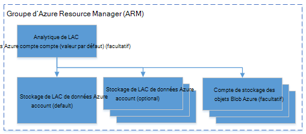

<properties 
   pageTitle="Gérer l’Analytique de LAC de données Azure à l’aide de PowerShell d’Azure | Azure" 
   description="Apprenez à gérer les tâches de données lac Analytique, les sources de données, les utilisateurs. " 
   services="data-lake-analytics" 
   documentationCenter="" 
   authors="edmacauley" 
   manager="jhubbard" 
   editor="cgronlun"/>
 
<tags
   ms.service="data-lake-analytics"
   ms.devlang="na"
   ms.topic="article"
   ms.tgt_pltfrm="na"
   ms.workload="big-data" 
   ms.date="05/16/2016"
   ms.author="edmaca"/>

# Gérer l’Analytique de LAC de données Azure à l’aide de PowerShell d’Azure

[AZURE.INCLUDE [manage-selector](../../includes/data-lake-analytics-selector-manage.md)]

Apprenez à gérer les comptes d’Azure données lac Analytique, des sources de données, des utilisateurs et des travaux à l’aide de PowerShell Azure. Pour afficher les rubriques de gestion à l’aide d’autres outils, cliquez sur l’onglet, sélectionnez ci-dessus.

**Conditions préalables**

Avant de commencer ce didacticiel, vous devez disposer des éléments suivants :

- **Abonnement d’un Azure**. Consultez [Azure d’obtenir la version d’évaluation gratuite](https://azure.microsoft.com/pricing/free-trial/).

<!-- ################################ -->
<!-- ################################ -->

##Installez Azure PowerShell 1.0 ou supérieur

Reportez-vous à la section Configuration requise [d’À l’aide du PowerShell Azure avec le Gestionnaire de ressources Azure](powershell-azure-resource-manager.md#prerequisites).
    
## Gérer les comptes

Avant d’exécuter les tâches de données lac Analytique, vous devez disposer d’un compte Analytique lac de données. À la différence d’Azure, HDInsight, vous payez un compte Analytique lorsqu’il n’est pas exécuté un travail.  Vous ne payez que pour le temps que lorsqu’il exécute une tâche.  Pour plus d’informations, voir [Vue d’ensemble de Azure données lac Analytique](data-lake-analytics-overview.md).  

###Créer des comptes

    $resourceGroupName = "<ResourceGroupName>"
    $dataLakeStoreName = "<DataLakeAccountName>"
    $dataLakeAnalyticsAccountName = "<DataLakeAnalyticsAccountName>"
    $location = "<Microsoft Data Center>"
    
    Write-Host "Create a resource group ..." -ForegroundColor Green
    New-AzureRmResourceGroup `
        -Name  $resourceGroupName `
        -Location $location
    
    Write-Host "Create a Data Lake account ..."  -ForegroundColor Green
    New-AzureRmDataLakeStoreAccount `
        -ResourceGroupName $resourceGroupName `
        -Name $dataLakeStoreName `
        -Location $location 
    
    Write-Host "Create a Data Lake Analytics account ..."  -ForegroundColor Green
    New-AzureRmDataLakeAnalyticsAccount `
        -Name $dataLakeAnalyticsAccountName `
        -ResourceGroupName $resourceGroupName `
        -Location $location `
        -DefaultDataLake $dataLakeStoreName
    
    Write-Host "The newly created Data Lake Analytics account ..."  -ForegroundColor Green
    Get-AzureRmDataLakeAnalyticsAccount `
        -ResourceGroupName $resourceGroupName `
        -Name $dataLakeAnalyticsAccountName  

Vous pouvez également utiliser un modèle de groupe de ressources Azure. Un modèle pour la création d’un compte Analytique lac de données et le compte de banque de données lac dépendant est dans [l’annexe A](#appendix-a). Enregistrer le modèle dans un fichier avec un modèle de .json et utilisez le script PowerShell suivant pour pouvoir l’appeler :

    $AzureSubscriptionID = "<Your Azure Subscription ID>"
    
    $ResourceGroupName = "<New Azure Resource Group Name>"
    $Location = "EAST US 2"
    $DefaultDataLakeStoreAccountName = "<New Data Lake Store Account Name>"
    $DataLakeAnalyticsAccountName = "<New Data Lake Analytics Account Name>"
    
    $DeploymentName = "MyDataLakeAnalyticsDeployment"
    $ARMTemplateFile = "E:\Tutorials\ADL\ARMTemplate\azuredeploy.json"  # update the Json template path 
    
    Login-AzureRmAccount
    
    Select-AzureRmSubscription -SubscriptionId $AzureSubscriptionID
    
    # Create the resource group
    New-AzureRmResourceGroup -Name $ResourceGroupName -Location $Location
    
    # Create the Data Lake Analytics account with the default Data Lake Store account.
    $parameters = @{"adlAnalyticsName"=$DataLakeAnalyticsAccountName; "adlStoreName"=$DefaultDataLakeStoreAccountName}
    New-AzureRmResourceGroupDeployment -Name $DeploymentName -ResourceGroupName $ResourceGroupName -TemplateFile $ARMTemplateFile -TemplateParameterObject $parameters 

 
###Compte de la liste

Comptes d’Analytique de liste données lac au sein de l’abonnement en cours

    Get-AzureRmDataLakeAnalyticsAccount
    
La sortie :

    Id         : /subscriptions/xxxxxxxxxxxxxxxxxxxxxxxxxxxxxxxxxxxx/resourceGroups/learn1021rg/providers/Microsoft.DataLakeAnalytics/accounts/learn1021adla
    Location   : eastus2
    Name       : learn1021adla
    Properties : Microsoft.Azure.Management.DataLake.Analytics.Models.DataLakeAnalyticsAccountProperties
    Tags       : {}
    Type       : Microsoft.DataLakeAnalytics/accounts

Comptes d’Analytique de liste données lac au sein d’un groupe de ressources spécifique

    Get-AzureRmDataLakeAnalyticsAccount -ResourceGroupName $resourceGroupName

Obtenir des détails d’un compte Analytique lac de données spécifique

    Get-AzureRmDataLakeAnalyticsAccount -Name $adlAnalyticsAccountName

Tester l’existence d’un compte Analytique lac de données spécifique

    Test-AzureRmDataLakeAnalyticsAccount -Name $adlAnalyticsAccountName

L’applet de commande renvoie **True** ou **False**.

###Supprimer des comptes de données lac Analytique

    $resourceGroupName = "<ResourceGroupName>"
    $dataLakeAnalyticsAccountName = "<DataLakeAnalyticsAccountName>"
    
    Remove-AzureRmDataLakeAnalyticsAccount -Name $dataLakeAnalyticsAccountName 

Compte Analytique de supprimer données lac ne supprimera pas le compte de stockage lac de données dépendant. L’exemple suivant supprime le compte Analytique lac de données et le compte de la banque de données lac par défaut

    $resourceGroupName = "<ResourceGroupName>"
    $dataLakeAnalyticsAccountName = "<DataLakeAnalyticsAccountName>"
    $dataLakeStoreName = (Get-AzureRmDataLakeAnalyticsAccount -ResourceGroupName $resourceGroupName -Name $dataLakeAnalyticAccountName).Properties.DefaultDataLakeAccount

    Remove-AzureRmDataLakeAnalyticsAccount -ResourceGroupName $resourceGroupName -Name $dataLakeAnalyticAccountName 
    Remove-AzureRmDataLakeStoreAccount -ResourceGroupName $resourceGroupName -Name $dataLakeStoreName

<!-- ################################ -->
<!-- ################################ -->
## Gérer les sources de données de compte

Données lac Analytique prend actuellement en charge les sources de données suivantes :

- [Magasin de LAC de données Azure](../data-lake-store/data-lake-store-overview.md)
- [Stockage Azure](storage-introduction.md)

Lorsque vous créez un compte Analytique, vous devez désigner un compte de stockage Azure LAC pour être le compte de stockage par défaut. Le compte de la banque de données lac par défaut permet de stocker les journaux de d’audit de métadonnées et une tâche de travail. Après avoir créé un compte Analytique, vous pouvez ajouter des comptes supplémentaires de stockage de données LAC et/ou le compte de stockage Azure. 

### Trouver le compte de la banque de données lac par défaut

    $resourceGroupName = "<ResourceGroupName>"
    $dataLakeAnalyticsAccountName = "<DataLakeAnalyticsAccountName>"
    $dataLakeStoreName = (Get-AzureRmDataLakeAnalyticsAccount -ResourceGroupName $resourceGroupName -Name $dataLakeAnalyticAccountName).Properties.DefaultDataLakeAccount

### Ajouter des comptes supplémentaires de stockage Azure Blob

    $resourceGroupName = "<ResourceGroupName>"
    $dataLakeAnalyticsAccountName = "<DataLakeAnalyticsAccountName>"
    $AzureStorageAccountName = "<AzureStorageAccountName>"
    $AzureStorageAccountKey = "<AzureStorageAccountKey>"
    
    Add-AzureRmDataLakeAnalyticsDataSource -ResourceGroupName $resourceGroupName -Account $dataLakeAnalyticAccountName -AzureBlob $AzureStorageAccountName -AccessKey $AzureStorageAccountKey

### Ajouter des comptes supplémentaires de magasin de données lac

    $resourceGroupName = "<ResourceGroupName>"
    $dataLakeAnalyticsAccountName = "<DataLakeAnalyticsAccountName>"
    $AzureDataLakeName = "<DataLakeStoreName>"
    
    Add-AzureRmDataLakeAnalyticsDataSource -ResourceGroupName $resourceGroupName -Account $dataLakeAnalyticAccountName -DataLake $AzureDataLakeName 

### Liste des sources de données :

    $resourceGroupName = "<ResourceGroupName>"
    $dataLakeAnalyticsAccountName = "<DataLakeAnalyticsAccountName>"

    (Get-AzureRmDataLakeAnalyticsAccount -ResourceGroupName $resourceGroupName -Name $dataLakeAnalyticAccountName).Properties.DataLakeStoreAccounts
    (Get-AzureRmDataLakeAnalyticsAccount -ResourceGroupName $resourceGroupName -Name $dataLakeAnalyticAccountName).Properties.StorageAccounts
    

<!-- ################################ -->
<!-- ################################ -->
## Gérer les travaux

Vous devez avoir un compte de données lac Analytique avant de pouvoir créer une tâche.  Pour plus d’informations, reportez-vous à la section [Analytique de LAC données de gérer les comptes](#manage-data-lake-analytics-accounts).

### Liste des tâches

    $dataLakeAnalyticsAccountName = "<DataLakeAnalyticsAccountName>"
    
    Get-AzureRmDataLakeAnalyticsJob -Account $dataLakeAnalyticAccountName
    
    Get-AzureRmDataLakeAnalyticsJob -Account $dataLakeAnalyticAccountName -State Running, Queued
    #States: Accepted, Compiling, Ended, New, Paused, Queued, Running, Scheduling, Starting
    
    Get-AzureRmDataLakeAnalyticsJob -Account $dataLakeAnalyticAccountName -Result Cancelled
    #Results: Cancelled, Failed, None, Successed 
    
    Get-AzureRmDataLakeAnalyticsJob -Account $dataLakeAnalyticAccountName -Name <Job Name>
    Get-AzureRmDataLakeAnalyticsJob -Account $dataLakeAnalyticAccountName -Submitter <Job submitter>

    # List all jobs submitted on January 1 (local time)
    Get-AzureRmDataLakeAnalyticsJob -Account $dataLakeAnalyticAccountName `
        -SubmittedAfter "2015/01/01"
        -SubmittedBefore "2015/01/02"   

    # List all jobs that succeeded on January 1 after 2 pm (UTC time)
    Get-AzureRmDataLakeAnalyticsJob -Account $dataLakeAnalyticAccountName `
        -State Ended
        -Result Succeeded
        -SubmittedAfter "2015/01/01 2:00 PM -0"
        -SubmittedBefore "2015/01/02 -0"

    # List all jobs submitted in the past hour
    Get-AzureRmDataLakeAnalyticsJob -Account $dataLakeAnalyticAccountName `
        -SubmittedAfter (Get-Date).AddHours(-1)

### Obtenir les détails de la tâche

    $dataLakeAnalyticsAccountName = "<DataLakeAnalyticsAccountName>"
    Get-AzureRmDataLakeAnalyticsJob -Account $dataLakeAnalyticAccountName -JobID <Job ID>
    
### Soumettre des travaux

    $dataLakeAnalyticsAccountName = "<DataLakeAnalyticsAccountName>"

    #Pass script via path
    Submit-AzureRmDataLakeAnalyticsJob -Account $dataLakeAnalyticAccountName `
        -Name $jobName `
        -ScriptPath $scriptPath

    #Pass script contents
    Submit-AzureRmDataLakeAnalyticsJob -Account $dataLakeAnalyticAccountName `
        -Name $jobName `
        -Script $scriptContents

> [AZURE.NOTE] La priorité par défaut d’une tâche est de 1000 et degré de parallélisme pour une tâche par défaut est 1.

### Annuler les travaux

    Stop-AzureRmDataLakeAnalyticsJob -Account $dataLakeAnalyticAccountName `
        -JobID $jobID

## Gérer des éléments de catalogue

Le catalogue SQL-U permet de structurer les données et le code afin qu’ils puissent être partagés par les scripts SQL de l’U. Le catalogue permet les meilleures performances possibles avec les données dans Azure données lac. Pour plus d’informations, consultez le [catalogue d’utilisation U-SQL](data-lake-analytics-use-u-sql-catalog.md).

###Liste des articles du catalogue

    #List databases
    Get-AzureRmDataLakeAnalyticsCatalogItem `
        -Account $adlAnalyticsAccountName `
        -ItemType Database
    
    
    
    #List tables
    Get-AzureRmDataLakeAnalyticsCatalogItem `
        -Account $adlAnalyticsAccountName `
        -ItemType Table `
        -Path "master.dbo"

###Obtenir les détails de l’article catalogue 

    #Get a database
    Get-AzureRmDataLakeAnalyticsCatalogItem `
        -Account $adlAnalyticsAccountName `
        -ItemType Database `
        -Path "master"
    
    #Get a table
    Get-AzureRmDataLakeAnalyticsCatalogItem `
        -Account $adlAnalyticsAccountName `
        -ItemType Table `
        -Path "master.dbo.mytable"

###Tester l’existence d’un élément de catalogue

    Test-AzureRmDataLakeAnalyticsCatalogItem  `
        -Account $adlAnalyticsAccountName `
        -ItemType Database `
        -Path "master"

###Créer le secret du catalogue
    New-AzureRmDataLakeAnalyticsCatalogSecret  `
            -Account $adlAnalyticsAccountName `
            -DatabaseName "master" `
            -Secret (Get-Credential -UserName "username" -Message "Enter the password")

### Modification du code secret catalogue
    Set-AzureRmDataLakeAnalyticsCatalogSecret  `
            -Account $adlAnalyticsAccountName `
            -DatabaseName "master" `
            -Secret (Get-Credential -UserName "username" -Message "Enter the password")

###Supprimer le secret du catalogue
    Remove-AzureRmDataLakeAnalyticsCatalogSecret  `
            -Account $adlAnalyticsAccountName `
            -DatabaseName "master"

## Utiliser les groupes du Gestionnaire de ressources Azure

Les applications sont généralement composées de nombreux composants, par exemple une application web, de base de données, serveur de base de données, stockage et services de tiers 3e. Le Gestionnaire de ressources Azure (ARM) vous permet de travailler avec les ressources de votre application en tant que groupe, visé un groupe de ressources Azure. Vous pouvez déployer, mettre à jour, surveiller ou supprimer toutes les ressources de votre application dans une opération unique et coordonnée. Vous utilisez un modèle de déploiement, et ce modèle peut fonctionner dans différents environnements comme test, intermédiaire et production. Vous pouvez clarifier la facturation pour votre organisation en affichant les coûts reportées pour le groupe entier. Pour plus d’informations, consultez [Vue d’ensemble du Gestionnaire de ressources Azure](../azure-resource-manager/resource-group-overview.md). 

Un service de données lac Analytique peut inclure les éléments suivants :

- Compte Analytique de LAC de données Azure
- Compte de stockage Azure lac par défaut requis
- Comptes de stockage complémentaire Azure données lac
- Comptes de stockage Azure supplémentaires

Vous pouvez créer tous ces composants sous un groupe ARM pour les rendre plus faciles à gérer.

Un compte Analytique lac de données et les comptes de stockage dépendant doivent être placés dans le même centre de données Azure.
Toutefois, le groupe ARM peut se trouver dans un autre centre de données.  

##Voir aussi 

- [Vue d’ensemble de Microsoft Azure données lac Analytique](data-lake-analytics-overview.md)
- [Mise en route d’Analytique de LAC de données à l’aide du portail Azure](data-lake-analytics-get-started-portal.md)
- [Gérer l’Analytique de LAC de données Azure à l’aide du portail Azure](data-lake-analytics-manage-use-portal.md)
- [Surveiller et résoudre les problèmes de travaux Azure données lac Analytique à l’aide du portail Azure](data-lake-analytics-monitor-and-troubleshoot-jobs-tutorial.md)

##Annexe A - modèle de données lac Analytique ARM

Le modèle ARM suivant peut être utilisé pour déployer un compte Analytique lac de données et son compte de banque de données lac dépendant.  Enregistrez-le sous un fichier json et ensuite utiliser script PowerShell pour appeler le modèle. Pour plus d’informations, consultez [déploiement d’une application avec le modèle de gestionnaire de ressources Azure](../resource-group-template-deploy.md#deploy-with-powershell) et les [modèles de la création d’un gestionnaire de ressources Azure](../resource-group-authoring-templates.md).

    {
      "$schema": "http://schema.management.azure.com/schemas/2015-01-01/deploymentTemplate.json#",
      "contentVersion": "1.0.0.0",
      "parameters": {
        "adlAnalyticsName": {
          "type": "string",
          "metadata": {
            "description": "The name of the Data Lake Analytics account to create."
          }
        },
        "adlStoreName": {
          "type": "string",
          "metadata": {
            "description": "The name of the Data Lake Store account to create."
          }
        }
      },
      "resources": [
        {
          "name": "[parameters('adlStoreName')]",
          "type": "Microsoft.DataLakeStore/accounts",
          "location": "East US 2",
          "apiVersion": "2015-10-01-preview",
          "dependsOn": [ ],
          "tags": { }
        },
        {
          "name": "[parameters('adlAnalyticsName')]",
          "type": "Microsoft.DataLakeAnalytics/accounts",
          "location": "East US 2",
          "apiVersion": "2015-10-01-preview",
          "dependsOn": [ "[concat('Microsoft.DataLakeStore/accounts/',parameters('adlStoreName'))]" ],
          "tags": { },
          "properties": {
            "defaultDataLakeStoreAccount": "[parameters('adlStoreName')]",
            "dataLakeStoreAccounts": [
              { "name": "[parameters('adlStoreName')]" }
            ]
          }
        }
      ],
      "outputs": {
        "adlAnalyticsAccount": {
          "type": "object",
          "value": "[reference(resourceId('Microsoft.DataLakeAnalytics/accounts',parameters('adlAnalyticsName')))]"
        },
        "adlStoreAccount": {
          "type": "object",
          "value": "[reference(resourceId('Microsoft.DataLakeStore/accounts',parameters('adlStoreName')))]"
        }
      }
    }

