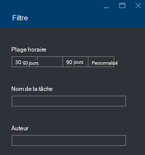

<properties 
   pageTitle="Résoudre les problèmes de travaux Azure données lac Analytique à l’aide du portail Azure | Azure" 
   description="Apprenez à utiliser le portail Azure pour résoudre les tâches de données lac Analytique. " 
   services="data-lake-analytics" 
   documentationCenter="" 
   authors="edmacauley" 
   manager="jhubbard" 
   editor="cgronlun"/>
 
<tags
   ms.service="data-lake-analytics"
   ms.devlang="na"
   ms.topic="article"
   ms.tgt_pltfrm="na"
   ms.workload="big-data" 
   ms.date="05/16/2016"
   ms.author="edmaca"/>

# Résoudre les problèmes de travaux Azure données lac Analytique à l’aide du portail Azure

Apprenez à utiliser le portail Azure pour résoudre les tâches de données lac Analytique.

Dans ce didacticiel, vous le programme d’installation d’un problème de fichier source manquant et le portail Azure permet de résoudre le problème.

**Conditions préalables**

Avant de commencer ce didacticiel, vous devez disposer des éléments suivants :

- **Connaissances de base de données lac Analytique processus de travail**. Reportez-vous à la section [mise en route d’Analytique de LAC de données Azure à l’aide du portail Azure](data-lake-analytics-get-started-portal.md).
- **Analytique de LAC de données un compte**. Reportez-vous à la section [mise en route d’Analytique de LAC de données Azure à l’aide du portail Azure](data-lake-analytics-get-started-portal.md#create-adl-analytics-account).
- **Copier les exemples de données pour le compte de la banque de données lac par défaut**.  Voir [préparer des données source](data-lake-analytics-get-started-portal.md#prepare-source-data)

##Soumettre une tâche de données lac Analytique

Maintenant, vous allez créer un projet SQL-U avec un nom de fichier incorrect.  

**Pour soumettre la tâche**

1. À partir du portail Azure, cliquez sur **Microsoft Azure** dans le coin supérieur gauche.
2. Cliquez sur la mosaïque avec votre nom de compte de données lac Analytique.  Il a été épinglé ici lorsque le compte a été créé.
Si le compte n’est pas épinglé il, voir [Ouvrir un compte Analytique à partir du portail](data-lake-analytics-manage-use-portal.md#access-adla-account).
3. Dans le menu supérieur, cliquez sur **Nouvelle tâche** .
4. Entrez un nom de travail et le script U-SQL suivant :

        @searchlog =
            EXTRACT UserId          int,
                    Start           DateTime,
                    Region          string,
                    Query           string,
                    Duration        int?,
                    Urls            string,
                    ClickedUrls     string
            FROM "/Samples/Data/SearchLog.tsv1"
            USING Extractors.Tsv();
        
        OUTPUT @searchlog   
            TO "/output/SearchLog-from-adls.csv"
        USING Outputters.Csv();

    Le fichier source défini dans le script est **/Samples/Data/SearchLog.tsv1**, où il doit être **/Samples/Data/SearchLog.tsv**.
     
5. Cliquez sur **Soumettre une tâche** à partir du haut. Un nouveau volet de détails de la tâche s’ouvre. Dans la barre de titre, il affiche le statut de la tâche. Il faut quelques minutes pour terminer. Vous pouvez cliquer sur **Actualiser** pour obtenir l’état le plus récent.
6. Attendez que l’état du travail devient **a échoué**.  Si le travail est **terminé**, il est dans la mesure où vous n’avez pas supprimé le dossier /Samples.. Reportez-vous à la section **composants requis** au début de ce didacticiel.

Vous vous demandez peut-être - pourquoi il prend autant de temps pour un petit projet.  N’oubliez pas de que données lac Analytique est conçue pour traiter des données volumineuses.  Il éclaire lors du traitement d’une grande quantité de données à l’aide de son système distribué.

Nous allons supposent que vous avez envoyé la tâche et de fermer le portail.  Dans la section suivante, vous allez apprendre à résoudre les problèmes liés à la tâche.

## Résoudre les problèmes liés à la tâche

Dans la dernière section, vous avez soumis un travail, et la tâche a échoué.  

**Pour voir toutes les tâches**

1. À partir du portail Azure, cliquez sur **Microsoft Azure** dans le coin supérieur gauche.
2. Cliquez sur la mosaïque avec votre nom de compte de données lac Analytique.  La tâche récapitulative s’affiche dans la fenêtre de **Gestion des tâches** .

    
    
    La tâche de gestion vous donne un aperçu de l’état du travail. Notez qu’il est l’échec d’un travail.
   
3. Cliquez sur la mosaïque de la **Gestion des tâches** pour visualiser les projets. Les tâches sont classées **en cours d’exécution**, **en attente**et **terminé**. Vous doit voir votre travail ayant échoué dans la section **terminé** . Il doit être le premier d'entre eux dans la liste. Lorsque vous avez un grand nombre de tâches, vous pouvez cliquer sur **filtrer** pour vous aider à trouver des travaux.

    

4. Cliquez sur la tâche a échoué à partir de la liste pour ouvrir les détails d’une tâche dans une nouvelle blade :

    
    
    Notez le bouton **soumettre à nouveau** . Après avoir résolu le problème, vous pouvez soumettre à nouveau le travail.

5. Cliquez sur la partie en surbrillance de la capture d’écran précédente pour ouvrir les détails de l’erreur.  Vous doit voir quelque chose comme :

    

    Il vous indique le dossier source est introuvable.
    
6. Cliquez sur **Dupliquer le Script**.
7. Mettre à jour le chemin d’accès **FROM** à ce qui suit :

    « / Samples/Data/SearchLog.tsv »

8. Cliquez sur **Soumettre le projet**.

##Voir aussi

- [Présentation Analytique de LAC de données Azure](data-lake-analytics-overview.md)
- [Mise en route d’Analytique de LAC de données Azure à l’aide de PowerShell d’Azure](data-lake-analytics-get-started-powershell.md)
- [Mise en route avec Azure données lac Analytique et U-SQL à l’aide de Visual Studio](data-lake-analytics-u-sql-get-started.md)
- [Gérer l’Analytique de LAC de données Azure à l’aide du portail Azure](data-lake-analytics-manage-use-portal.md)

