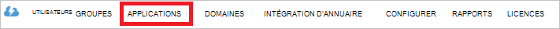

<properties
   pageTitle="Authentifier avec magasin lac de données à l’aide d’Active Directory | Microsoft Azure"
   description="Apprenez à authentifier avec magasin lac de données à l’aide d’Active Directory"
   services="data-lake-store"
   documentationCenter=""
   authors="nitinme"
   manager="jhubbard"
   editor="cgronlun"/>

<tags
   ms.service="data-lake-store"
   ms.devlang="na"
   ms.topic="article"
   ms.tgt_pltfrm="na"
   ms.workload="big-data"
   ms.date="10/17/2016"
   ms.author="nitinme"/>

# Authentification de service-à-service magasin lac de données à l’aide d’Azure Active Directory

> [AZURE.SELECTOR]
- [Authentification de service-service](data-lake-store-authenticate-using-active-directory.md)
- [Authentification de l’utilisateur final](data-lake-store-end-user-authenticate-using-active-directory.md)

Magasin de LAC de données Azure utilise Azure Active Directory pour l’authentification. Avant la création d’une application qui fonctionne avec le lac Azure Data Store ou Analytique de LAC de données Azure, vous devez d’abord déterminer comment vous souhaitez authentifier votre application avec Azure Active Directory (AD Azure). Les deux options disponibles sont les suivantes :

* L’authentification de l’utilisateur final, et 
* Authentification de service à service. 

Ces deux options entraînent dans votre application qui est fournie avec un jeton OAuth 2.0, qui obtient attaché à chaque demande faite à Azure Data Store de LAC ou Azure données lac Analytique.

Cette parle de l’article sur la façon de crée une application web de Azure AD pour l’authentification de service à service. Pour obtenir des instructions sur la configuration de l’application Azure AD pour l’authentification de l’utilisateur final, reportez-vous [à l’aide de l’authentification de l’utilisateur final avec un magasin de données lac Azure Active Directory](data-lake-store-end-user-authenticate-using-active-directory.md).

## Conditions préalables

* Un abonnement Azure. Consultez [Azure d’obtenir la version d’évaluation gratuite](https://azure.microsoft.com/pricing/free-trial/).
* Votre ID d’abonnement. Vous pouvez le récupérer à partir du portail Azure. Par exemple, il est disponible à partir de la blade de compte de banque de données lac.

    

* Votre nom de domaine AD Azure. Vous pouvez le récupérer par le passage de la souris dans le coin supérieur droit du portail Azure. La capture d’écran ci-dessous, le nom de domaine est **contoso.microsoft.com**, et le GUID entre crochets est l’ID de client. 

    

## Authentification de service-service

Il s’agit de l’approche recommandée si vous souhaitez que votre application pour authentifier automatiquement avec AD Azure, sans la nécessité pour l’utilisateur final de fournir leurs informations d’identification. Votre application sera en mesure de s’authentifier lui-même pour aussi longtemps que ses informations d’identification sont valides, qui peuvent être personnalisés pour être de l’ordre des années.

### Que dois-je utiliser cette approche ?

* Nom de domaine AD Azure. Il est déjà répertorié dans la condition préalable de cet article.

* Azure annonce une **application web**.

* ID de client pour l’application de web AD Azure.

* Secret de client de l’application web de publicité Azure.

* Point de terminaison de jeton pour l’application de web AD Azure.

* Activer l’accès pour l’application de web AD Azure sur le le fichier/dossier du magasin de données lac ou le compte Analytique lac de données que vous souhaitez utiliser.

Pour obtenir des instructions sur la façon de créer une application web de publicité Azure et le configurer pour les conditions mentionnées ci-dessus, consultez la section [Création d’une application Active Directory](#create-an-active-directory-application) ci-dessous.

>[AZURE.NOTE] Par défaut, l’application Azure AD est configurée pour utiliser le secret du client, que vous pouvez récupérer à partir de l’application Azure AD. Toutefois, si vous souhaitez que l’application Azure AD pour utiliser un certificat à la place, vous devez créer l’application web de publicité Azure à l’aide de PowerShell d’Azure, comme indiqué à la [Création d’un service principal avec certificat](../resource-group-authenticate-service-principal.md#create-service-principal-with-certificate).

## Création d’une application d’Active Directory

Dans cette section nous en savoir plus sur comment créer et configurer une application web de Azure AD pour l’authentification du service-service avec le lac Azure Data Store à l’aide d’Azure Active Directory. 

### Étape 1 : Créer une application Azure Active Directory

>[AZURE.NOTE] Les étapes ci-dessous utilisent le portail Azure. Vous pouvez également créer une application Azure AD à l’aide de [PowerShell d’Azure](../resource-group-authenticate-service-principal.md) ou [Azure CLI](../resource-group-authenticate-service-principal-cli.md).

1. Connectez-vous à votre compte Azure via le [portail classique](https://manage.windowsazure.com/).

2. Dans le volet gauche, sélectionnez **Active Directory** .

     
     
3. Sélectionnez Active Directory que vous souhaitez utiliser pour la création de la nouvelle application. Si vous avez plus d’un Active Directory, vous souhaitez généralement créer l’application dans le répertoire où se trouve le votre abonnement. Vous pouvez uniquement accorder l’accès aux ressources de votre abonnement pour les applications dans le même répertoire que votre abonnement.  

     
    
    
3. Pour afficher les applications dans votre répertoire, cliquez sur **Applications**.

     

4. Si vous n’avez pas créé une application dans ce répertoire avant que vous devriez voir quelque chose similaire à l’image suivante. Cliquez sur **Ajouter une APPLICATION**

     

     Ou bien, cliquez sur **Ajouter** dans le volet inférieur.

     

6. Fournissez un nom pour l’application, puis sélectionnez le type d’application que vous souhaitez créer. Pour ce didacticiel, créez un **WEB APPLICATION et/ou WEB API** et cliquez sur le bouton suivant.

     

7. Renseignez les propriétés de votre application. Pour **Les URL de session**, fournir l’URI à un site web qui décrit votre application. L’existence du site web n’est pas validé. Pour l' **URI d’ID APP**, fournissent l’URI qui identifie votre application.

     

    Cliquez sur la case à cocher pour exécuter l’Assistant et créer l’application.

### Étape 2 : Obtenir l’id client, client secret et point de terminaison de jeton

Lors de la connexion par programme, vous devez l’id de votre application. Si l’application s’exécute sous ses propres informations d’identification, vous devez également une clé d’authentification.

1. Cliquez sur l’onglet **configurer** pour configurer le mot de passe de votre application.

     

2. Copiez l' **ID de CLIENT**.
  
     

3. Si l’application s’exécutera sous ses propres informations d’identification, faites défiler jusqu'à la section **clés** et sélectionnez la durée pendant laquelle vous souhaitez que votre mot de passe soit valide.

     

4. Sélectionnez **Enregistrer** pour créer votre clé.

    

    La clé enregistrée s’affiche et vous pouvez le copier. Vous ne serez pas en mesure de récupérer la clé ultérieurement doit copier maintenant.

    

5. Récupérer le point de terminaison de jeton en sélectionnant des **extrémités d’affichage** en bas de l’écran et la récupération de la valeur pour le champ de **Point de terminaison jeton OAuth 2.0** , comme indiqué ci-dessous.  

    

### Étape 3 : Assigner l’application Azure AD pour le fichier de compte Azure Data Store de LAC ou le dossier (uniquement pour l’authentification du service-service)

1. Ouvrez une session sur le nouveau [Portail Azure](https://portal.azure.com) et ouvrez le compte Azure données lac magasin que vous souhaitez associer à l’application Azure Active Directory que vous avez créé précédemment.

1. Dans la blade de compte de banque de données lac, cliquez sur **Explorateur de données**.

    ![Créer des répertoires dans le compte de la banque de données lac] (./media/data-lake-store-authenticate-using-active-directory/adl.start.data.explorer.png "Créer des répertoires de données lac compte")

2. De la lame **d’Explorateur de données** , cliquez sur le fichier ou le dossier pour lequel vous souhaitez fournir l’accès à l’application Azure AD, puis cliquez sur **accès**. Pour configurer l’accès à un fichier, vous devez cliquer sur **accès** à partir de la blade **d’Aperçu du fichier** .

    ![Définir les ACL sur le système de fichiers de données lac] (./media/data-lake-store-authenticate-using-active-directory/adl.acl.1.png "Définir les ACL sur le système de fichiers de données lac")

3. La blade **d’accès** répertorie l’accès standard et personnalisés déjà affecté à la racine. Cliquez sur l’icône **Ajouter** pour ajouter les ACL personnaliser le niveau.

    ![Accès à la liste standard et personnalisé] (./media/data-lake-store-authenticate-using-active-directory/adl.acl.2.png "Accès à la liste standard et personnalisé")

4. Cliquez sur l’icône **Ajouter** pour ouvrir la blade **D’ajout d’accès personnalisé** . Dans cette carte, cliquez sur **Sélectionner un utilisateur ou un groupe**et de lame de **Sélectionner un utilisateur ou un groupe** , recherchez le groupe de sécurité que vous avez créé précédemment dans Azure Active Directory. Si vous avez un grand nombre de groupes à rechercher à partir de, vous pouvez utiliser la zone de texte en haut pour filtrer sur le nom du groupe. Cliquez sur le groupe que vous souhaitez ajouter, puis sur **Sélectionner**.

    ![Ajouter un groupe] (./media/data-lake-store-authenticate-using-active-directory/adl.acl.3.png "Ajouter un groupe")

5. Cliquez sur **Sélectionner les autorisations**, sélectionnez les autorisations et si vous souhaitez attribuer les autorisations par défaut ACL, accéder aux ACL, ou les deux. Cliquez sur **OK**.

    ![Affecter des autorisations à un groupe] (./media/data-lake-store-authenticate-using-active-directory/adl.acl.4.png "Affecter des autorisations à un groupe")

    Pour plus d’informations sur les autorisations dans la banque de données LAC et les ACL par défaut d’accès voir [Contrôle d’accès au magasin de données lac](data-lake-store-access-control.md).

6. De la lame **D’ajout d’accès personnalisé** , cliquez sur **OK**. Le groupe récemment créé, avec les autorisations associées, sera désormais répertorié dans la blade **d’accès** .

    ![Affecter des autorisations à un groupe] (./media/data-lake-store-authenticate-using-active-directory/adl.acl.5.png "Affecter des autorisations à un groupe") 

## Étapes suivantes

Dans cet article vous créé une application de web AD Azure et collecter les informations que nécessaires dans vos applications clientes que vous créez à l’aide du Kit de développement .NET, Java SDK, etc.. Vous pouvez maintenant poursuivre les articles suivants qui parle de l’utilisation de l’application web de publicité Azure d’abord s’authentifier avec le magasin de données LAC et autres opérations sur la banque.

- [Mise en route de magasin de LAC de données Azure à l’aide du Kit de développement .NET](data-lake-store-get-started-net-sdk.md)
- [Mise en route de magasin de LAC de données Azure à l’aide du Kit de développement logiciel Java](data-lake-store-get-started-java-sdk.md)
