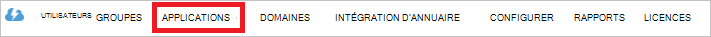

<properties
   pageTitle="Authentifier avec magasin lac de données à l’aide d’Active Directory | Microsoft Azure"
   description="Apprenez à authentifier avec magasin lac de données à l’aide d’Active Directory"
   services="data-lake-store"
   documentationCenter=""
   authors="nitinme"
   manager="jhubbard"
   editor="cgronlun"/>

<tags
   ms.service="data-lake-store"
   ms.devlang="na"
   ms.topic="article"
   ms.tgt_pltfrm="na"
   ms.workload="big-data"
   ms.date="10/17/2016"
   ms.author="nitinme"/>

# Authentification de l’utilisateur final avec magasin lac de données à l’aide d’Azure Active Directory

> [AZURE.SELECTOR]
- [Authentification de service-service](data-lake-store-authenticate-using-active-directory.md)
- [Authentification de l’utilisateur final](data-lake-store-end-user-authenticate-using-active-directory.md)

Magasin de LAC de données Azure utilise Azure Active Directory pour l’authentification. Avant la création d’une application qui fonctionne avec le lac Azure Data Store ou Analytique de LAC de données Azure, vous devez d’abord déterminer comment vous souhaitez authentifier votre application avec Azure Active Directory (AD Azure). Les deux options disponibles sont les suivantes :

* L’authentification de l’utilisateur final, et 
* Authentification de service à service. 

Ces deux options entraînent dans votre application qui est fournie avec un jeton OAuth 2.0, qui obtient attaché à chaque demande faite à Azure Data Store de LAC ou Azure données lac Analytique.

Cette parle de l’article sur la façon de crée une application web de Azure AD pour l’authentification de l’utilisateur final. Pour obtenir des instructions sur la configuration de l’application Azure AD pour l’authentification du service-service, reportez-vous [à l’aide de l’authentification avec le magasin de données lac Service-service Azure Active Directory](data-lake-store-authenticate-using-active-directory.md).

## Conditions préalables

* Un abonnement Azure. Consultez [Azure d’obtenir la version d’évaluation gratuite](https://azure.microsoft.com/pricing/free-trial/).
* Votre ID d’abonnement. Vous pouvez le récupérer à partir du portail Azure. Par exemple, il est disponible à partir de la blade de compte de banque de données lac.

    

* Votre nom de domaine AD Azure. Vous pouvez le récupérer par le passage de la souris dans le coin supérieur droit du portail Azure. La capture d’écran ci-dessous, le nom de domaine est **contoso.microsoft.com**, et le GUID entre crochets est l’ID de client. 

    

## Authentification de l’utilisateur final

Il s’agit de l’approche recommandée si vous souhaitez que l’utilisateur final pour vous connecter à votre application via AD Azure. Votre application sera en mesure d’accéder aux ressources Azure avec le même niveau d’accès que l’utilisateur final qui a ouvert une session dans. Vous devrez fournir leurs informations d’identification régulièrement dans l’ordre de votre application pour conserver l’accès l’utilisateur final.

Le résultat de représente la connexion l’utilisateur final est que votre application reçoit un jeton d’accès et un jeton d’actualisation. Le jeton d’accès lié à chaque demande faite à la banque de données lac ou données lac Analytique, et il est valable pendant une heure par défaut. Le jeton de l’actualisation peut être utilisé pour obtenir un nouveau jeton d’accès, et il est valide pendant les deux semaines par défaut, si vous utilisez régulièrement. Vous pouvez utiliser deux approches différentes pour la connexion de l’utilisateur final.

### À l’aide de la fenêtre contextuelle de OAuth 2.0

Votre application peut déclencher une fenêtre pop-up d’autorisation OAuth 2.0, dans lequel l’utilisateur final peut entrer leurs informations d’identification. Ce menu contextuel fonctionne également avec le processus d’authentification à deux facteurs Azure AD (2FA), si nécessaire. 

>[AZURE.NOTE] Cette méthode n’est pas encore supportée dans la bibliothèque d’authentification AD Azure (ADAL) pour les Python ou Java.

### En transmettant directement les informations d’identification de l’utilisateur

Votre application peut fournir directement des informations d’identification de l’utilisateur à Active Directory Azure. Cette méthode fonctionne uniquement avec les comptes d’utilisateur ID d’organisation ; Il n’est pas compatible avec le personnel / comptes d’utilisateur « live ID », y compris ceux se terminant par @outlook.com ou @live.com. En outre, cette méthode n’est pas compatible avec les comptes d’utilisateurs qui nécessitent l’authentification à deux facteurs Azure AD (2FA).

### Que dois-je utiliser cette approche ?

* Nom de domaine AD Azure. Il est déjà répertorié dans la condition préalable de cet article.

* Annonce Azure **application web**

* ID client pour l’application de web AD Azure

* Réponse URI pour l’application de web AD Azure

* Délégué de définir des autorisations

Pour obtenir des instructions sur la façon de créer une application web de publicité Azure et le configurer pour les conditions mentionnées ci-dessus, consultez la section [Création d’une application Active Directory](#create-an-active-directory-application) ci-dessous. 

## Création d’une application d’Active Directory

Dans cette section nous en savoir plus sur comment créer et configurer une application web de Azure AD pour l’authentification de l’utilisateur final avec le lac Azure Data Store à l’aide d’Azure Active Directory.

### Étape 1 : Créer une application Azure Active Directory

>[AZURE.NOTE] Les étapes ci-dessous utilisent le portail Azure. Vous pouvez également créer une application Azure AD à l’aide de [PowerShell d’Azure](../resource-group-authenticate-service-principal.md) ou [Azure CLI](../resource-group-authenticate-service-principal-cli.md).

1. Connectez-vous à votre compte Azure via le [portail classique](https://manage.windowsazure.com/).

2. Dans le volet gauche, sélectionnez **Active Directory** .

     
     
3. Sélectionnez Active Directory que vous souhaitez utiliser pour la création de la nouvelle application. Si vous avez plus d’un Active Directory, vous souhaitez généralement créer l’application dans le répertoire où se trouve le votre abonnement. Vous pouvez uniquement accorder l’accès aux ressources de votre abonnement pour les applications dans le même répertoire que votre abonnement.  

     
    
    
3. Pour afficher les applications dans votre répertoire, cliquez sur **Applications**.

     

4. Si vous n’avez pas créé une application dans ce répertoire avant que vous devriez voir quelque chose similaire à l’image suivante. Cliquez sur **Ajouter une APPLICATION**

     

     Ou bien, cliquez sur **Ajouter** dans le volet inférieur.

     

6. Fournissez un nom pour l’application, puis sélectionnez le type d’application que vous souhaitez créer. Pour ce didacticiel, créez un **WEB APPLICATION et/ou WEB API** et cliquez sur le bouton suivant.

     

7. Renseignez les propriétés de votre application. Pour **Les URL de session**, fournir l’URI à un site web qui décrit votre application. L’existence du site web n’est pas validé. Pour l' **URI d’ID APP**, fournissent l’URI qui identifie votre application.

     

    Cliquez sur la case à cocher pour exécuter l’Assistant et créer l’application.

### Étape 2 : Obtenir l’id de client, réponse URI et définir des autorisations déléguées

1. Cliquez sur l’onglet **configurer** pour configurer le mot de passe de votre application.

     

2. Copiez l' **ID de CLIENT**.
  
     

3. Dans la section **SSO** , copiez l' **URI de la réponse**.

    

4. Sous **autorisations pour d’autres applications**, cliquez sur **Ajouter application**

    

5. Dans l’Assistant **autorisations à d’autres applications** , sélectionnez **Lac de données Azure** et **Windows Azure** **API de gestion de Service**, puis cliquez sur la coche.

6. Par défaut, **Délégation des autorisations** pour les services nouvellement ajoutés est définie à zéro. Cliquez sur les **Autorisations de délégué** déroulante de LAC de données Azure et Windows Azure Management Service et activez les cases à cocher disponibles pour définir la valeur sur 1. Le résultat doit ressembler à ceci.

     

7. Cliquez sur **Enregistrer**.

## Étapes suivantes

Dans cet article vous créé une application de web AD Azure et collecter les informations que nécessaires dans vos applications clientes que vous créez à l’aide du Kit de développement .NET, Java SDK, etc.. Vous pouvez maintenant poursuivre les articles suivants qui parle de l’utilisation de l’application web de publicité Azure d’abord s’authentifier avec le magasin de données LAC et autres opérations sur la banque.

- [Mise en route de magasin de LAC de données Azure à l’aide du Kit de développement .NET](data-lake-store-get-started-net-sdk.md)
- [Mise en route de magasin de LAC de données Azure à l’aide du Kit de développement logiciel Java](data-lake-store-get-started-java-sdk.md)
