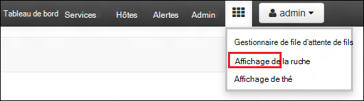

<properties
   pageTitle="Créer des clusters de HDInsight avec le magasin de LAC de données Azure via le portail | Azure"
   description="Azure Portal permet de créer et utiliser des clusters de HDInsight avec le lac Azure Data Store"
   services="data-lake-store,hdinsight" 
   documentationCenter=""
   authors="nitinme"
   manager="jhubbard"
   editor="cgronlun"/>

<tags
   ms.service="data-lake-store"
   ms.devlang="na"
   ms.topic="article"
   ms.tgt_pltfrm="na"
   ms.workload="big-data"
   ms.date="10/21/2016"
   ms.author="nitinme"/>

# Créer un cluster HDInsight avec magasin lac de données à l’aide du portail Azure

> [AZURE.SELECTOR]
- [À l’aide du portail](data-lake-store-hdinsight-hadoop-use-portal.md)
- [Utilisation de PowerShell](data-lake-store-hdinsight-hadoop-use-powershell.md)
- [À l’aide du Gestionnaire de ressources](data-lake-store-hdinsight-hadoop-use-resource-manager-template.md)

Découvrez comment Azure Portal permet de créer un cluster de HDInsight (Hadoop, HBase, allumage commandé ou tempête) disposant d’un accès au magasin de LAC de données Azure. Certaines considérations importantes pour cette version :

* **Pour l’érosion clusters (Linux) et clusters Hadoop (Windows et Linux)**, le magasin de LAC de données utilisable uniquement sous la forme d’un compte de stockage supplémentaire. Le compte de stockage par défaut pour les clusters de ce type sera toujours Azure stockage BLOB (WASB).

* **Clusters de Storm (Windows et Linux)**, le magasin de LAC données peut servir à écrire des données à partir d’une topologie de tempête. Magasin de données lac également utilisable pour stocker les données de référence qui peuvent alors être lu par une topologie de tempête. Pour plus d’informations, consultez [Utiliser le magasin de données lac dans une topologie de tempête](#use-data-lake-store-in-a-storm-topology).

* **Les clusters pour HBase (Windows et Linux)**, le magasin lac de données peut être utilisé comme un stockage par défaut ainsi que le stockage supplémentaire. Pour plus d’informations, consultez [Utiliser le magasin de données lac HBase clusters](#use-data-lake-store-with-hbase-clusters).

> [AZURE.NOTE] Certains points importants à noter. 
> 
> * Option permettant de créer des clusters de HDInsight disposant d’un accès au magasin de données lac n’est disponible que pour les HDInsight les versions 3.2 et 3.4 (pour les clusters Hadoop, HBase et Storm sur Windows et Linux). Pour les clusters d’allumage sous Linux, cette option est uniquement disponible sur les clusters de HDInsight 3.4.
>
> * Comme mentionné ci-dessus, banque de données lac est disponible sous la forme d’espace de stockage supplémentaire pour les autres types de cluster (Hadoop, étincelle, tempête) et de stockage par défaut pour certains types de cluster (HBase). À l’aide du magasin de données lac comme un compte de stockage supplémentaire n’affecte pas les performances ou la capacité de lecture/écriture pour le stockage du cluster. Dans un scénario où la banque de données lac est utilisé comme espace de stockage supplémentaire, les fichiers liés au cluster (par exemple, les journaux, etc.) sont écrits dans le stockage par défaut (BLOB Azure), tandis que les données que vous souhaitez traiter peuvent être stockées dans un compte de banque de données lac.

## Conditions préalables

Avant de commencer ce didacticiel, vous devez disposer des éléments suivants :

- **Abonnement d’un Azure**. Consultez [Azure d’obtenir la version d’évaluation gratuite](https://azure.microsoft.com/pricing/free-trial/).

- **Compte de banque de LAC de données azure**. Suivez les instructions de la section [mise en route de magasin de LAC de données Azure via le portail d’Azure](data-lake-store-get-started-portal.md). 

- **Télécharger des exemples de données à votre compte le lac Azure Data Store**. Une fois que vous avez créé le compte, effectuez les tâches suivantes pour télécharger des exemples de données. Vous aurez besoin de ces données plus loin dans le didacticiel pour exécuter des tâches à partir d’un cluster d’HDInsight d’accès aux données du magasin de données lac.

    * [Créer un dossier de votre magasin de données lac](data-lake-store-get-started-portal.md#createfolder).
    * [Télécharger un fichier vers votre magasin lac de données](data-lake-store-get-started-portal.md#uploaddata). Si vous recherchez des exemples de données à télécharger, vous pouvez obtenir le dossier de **Données d’Ambulance** à partir du [Référentiel Git lac Azure](https://github.com/Azure/usql/tree/master/Examples/Samples/Data/AmbulanceData).

- **Azure Principal du Service Active Directory**. Étapes de ce tutoriel fournissent des instructions sur la création d’une entité de sécurité de service dans Active Directory Azure. Toutefois, vous devez être un administrateur AD Azure pour être en mesure de créer une entité de sécurité du service. Si vous êtes un administrateur AD Azure, vous pouvez ignorer ces conditions préalables et poursuivre le didacticiel.
    
    **Si vous n’êtes pas un administrateur AD Azure**, vous ne serez pas en mesure d’effectuer les étapes nécessaires à la création d’une entité de sécurité du service. Dans ce cas, votre administrateur AD Azure devez d’abord créer une entité de service avant de pouvoir créer un cluster de HDInsight avec le magasin de données lac. En outre, l’entité du service doit être créée à l’aide d’un certificat, comme indiqué à la [Création d’un service principal avec certificat](../resource-group-authenticate-service-principal.md#create-service-principal-with-certificate).

## Apprendre plus rapidement avec les vidéos ?

Regardez les vidéos suivantes pour comprendre la façon de configurer des clusters de HDInsight disposant d’un accès au magasin de données lac.

* [Créer un cluster de HDInsight disposant d’un accès au magasin de données lac](https://mix.office.com/watch/l93xri2yhtp2)
* Une fois que le cluster est configuré, [accéder aux données dans le magasin de LAC de données à l’aide de scripts de ruche et porcines](https://mix.office.com/watch/1n9g5w0fiqv1q)

## Créer un cluster de HDInsight disposant d’un accès au magasin de LAC de données Azure

Dans cette section, vous créez un cluster HDInsight Hadoop qui utilise le magasin lac de données sous la forme d’un stockage supplémentaire. Dans cette version, pour un cluster Hadoop, données lac magasin peut uniquement être utilisé comme un espace de stockage supplémentaire pour le cluster. Le stockage par défaut sera toujours les blobs de stockage Azure (WASB). Par conséquent, nous allons tout d’abord créer le compte de stockage et les conteneurs de stockage requis pour le cluster.

1. Ouvrez une session sur le nouveau [Portail Azure](https://portal.azure.com).

2. Suivez les étapes à [Hadoop de créer des clusters dans HDInsight](../hdinsight/hdinsight-provision-clusters.md#create-using-the-preview-portal) pour démarrer la mise en service d’un cluster de HDInsight.

3. Sur la lame de **Configuration facultatives** , cliquez sur **Source de données**. De la lame de la **Source de données** , **Spécifiez les détails pour le compte de stockage et le conteneur de stockage, spécifier **Les États-Unis 2**** , puis cliquez sur **Identité DAS de Cluster**.

    ![Ajouter les service principal pour le cluster de HDInsight] (./media/data-lake-store-hdinsight-hadoop-use-portal/hdi.adl.1.png "Ajouter les service principal pour le cluster de HDInsight")

4. Sur la blade **d’Identité DAS de Cluster** , vous pouvez choisir sélectionner une entité de sécurité de Service existant ou créez-en un nouveau.

    * **Créer une nouvelle entité de Service**

        * De la lame **d’Identité DAS de Cluster** , cliquez sur **Créer nouveau**et cliquez sur **Service Principal**puis de la lame de **créer une entité de Service** , fournir des valeurs pour créer une nouvelle entité de service. Dans le cadre de ce, un certificat et une application Azure Active Directory est également créée. Cliquez sur **créer**.

            ![Ajouter les service principal pour le cluster de HDInsight] (./media/data-lake-store-hdinsight-hadoop-use-portal/hdi.adl.2.png "Ajouter les service principal pour le cluster de HDInsight")

        * Sur la blade **d’Identité DAS de Cluster** , cliquez sur **Gérer l’accès à ADLS**. Le volet affiche les comptes de banque de données lac associés à l’abonnement. Toutefois, vous pouvez définir les autorisations que pour le compte que vous avez créé. Sélectionnez les autorisations pour le compte que vous souhaitez associer avec le cluster HDInsight et puis cliquez sur **Enregistrer les autorisations**en lecture/écriture/exécution.

            ![Ajouter les service principal pour le cluster de HDInsight] (./media/data-lake-store-hdinsight-hadoop-use-portal/hdi.adl.3.png "Ajouter les service principal pour le cluster de HDInsight")

        * Sur la blade **d’Identité DAS de Cluster** , cliquez sur **Télécharger un certificat** pour télécharger le certificat associé au service principal que vous avez créé. Cela est utile si vous souhaitez utiliser à l’avenir, de la même entité de service lors de la création de clusters de HDInsight supplémentaires. Cliquez sur **Sélectionner**.

            ![Ajouter les service principal pour le cluster de HDInsight] (./media/data-lake-store-hdinsight-hadoop-use-portal/hdi.adl.4.png "Ajouter les service principal pour le cluster de HDInsight")

    * **Choisissez une identité de Service existants**

        * De la lame **d’Identité DAS de Cluster** , cliquez sur **utiliser existant**et cliquez sur **Principal du Service**dans la lame de **Sélectionner une entité de Service** , recherchez une identité de service existant. Cliquez sur un nom de principal du service et puis cliquez sur **Sélectionner**.

            ![Ajouter les service principal pour le cluster de HDInsight] (./media/data-lake-store-hdinsight-hadoop-use-portal/hdi.adl.5.png "Ajouter les service principal pour le cluster de HDInsight")

        * Télécharger le certificat (.pfx) associé à l’entité de service que vous avez sélectionné sur la lame de **Cluster DAS identité** et ensuite fournir le mot de passe de certificat.

5. Cliquez sur **Gérer l’accès à ADLS** et puis cliquez sur **Sélectionner les autorisations de fichier**. 

    ![Ajouter les service principal pour le cluster de HDInsight] (./media/data-lake-store-hdinsight-hadoop-use-portal/hdi.adl.5.existing.save.png "Ajouter les service principal pour le cluster de HDInsight")

6. Dans la lame **Sélectionnez autorisations de fichier** , dans la liste déroulante **compte** , sélectionnez le compte de banque de données lac que vous souhaitez associé au cluster HDInsight. La lame répertorie les fichiers et les dossiers disponibles dans le compte de banque de données lac sélectionné. 
 
    ![Fournir l’accès au magasin de données lac] (./media/data-lake-store-hdinsight-hadoop-use-portal/hdi-adl-permission-1.png "Fournir l’accès au magasin de données lac")

    Ensuite, déterminez les autorisations pour les les fichiers et dossiers sélectionnés. Pour les dossiers, il est également de spécifier si les autorisations s’appliquent au dossier seulement ou au dossier et à tous les éléments enfants dans le dossier. Vous pouvez rendre cette sélection en sélectionnant la valeur appropriée de l' **Appliquer à** liste déroulante. Pour supprimer une autorisation, cliquez sur l’icône **Supprimer**

    ![Fournir l’accès au magasin de données lac] (./media/data-lake-store-hdinsight-hadoop-use-portal/hdi-adl-permission-2.png "Fournir l’accès au magasin de données lac")

    Répétez ces étapes pour les fichiers et dossiers à partir d’autres comptes de banque de données lac ainsi. Lorsque vous avez terminé l’attribution des autorisations, cliquez sur **Sélectionner** en bas de la lame.

7. Dans la blade **d’attribuer les autorisations sélectionnées** , examinez les autorisations que vous avez fournies et puis cliquez sur **exécuter** pour accorder ces autorisations.

    ![Fournir l’accès au magasin de données lac] (./media/data-lake-store-hdinsight-hadoop-use-portal/hdi-adl-permission-3.png "Fournir l’accès au magasin de données lac")

    La colonne état affiche la progression. Une fois que toutes les autorisations sont correctement affectées, cliquez sur **terminé**. 

6. Cliquez sur **Sélectionner** les lames de **Cluster DAS identité** et la **Source de données** et poursuivez avec des créations de cluster comme décrit au [Hadoop de créer des clusters dans HDInsight](../hdinsight/hdinsight-hadoop-create-linux-clusters-portal.md).

7. Une fois que le cluster est configuré, vous pouvez vérifier que l’entité de Service est associée au cluster HDInsight. Pour ce faire, à partir de la blade de cluster, cliquez sur **Cluster DAS identité** pour voir l’entité du Service associé.

    ![Ajouter les service principal pour le cluster de HDInsight] (./media/data-lake-store-hdinsight-hadoop-use-portal/hdi.adl.6.png "Ajouter les service principal pour le cluster de HDInsight")

## Exécuter des tâches d’essai sur le cluster de HDInsight à utiliser le magasin de LAC de données Azure

Après avoir configuré un cluster HDInsight, vous pouvez exécuter des tâches d’essai sur le cluster pour vérifier que la HDInsight peut accéder à des données dans le magasin de LAC de données Azure. Pour ce faire, nous allons exécuter certaines requêtes de ruche qui cible le magasin de LAC de données.

### Pour un cluster Linux

1. Ouvrez la lame du cluster pour le cluster que vous avez configuré uniquement, puis cliquez sur **tableau de bord**. Ambari pour le cluster Linux s’ouvre. Lorsque vous accédez à Ambari, le système vous demandera à s’authentifier sur le site. Entrez l’admin (administrateur de valeur par défaut), nom de compte et mot de passe utilisé lors de la création du cluster.

    ![Lancer le tableau de bord de cluster] (./media/data-lake-store-hdinsight-hadoop-use-portal/hdiadlcluster1.png "Lancer le tableau de bord de cluster")

    Vous pouvez également naviguer directement à Ambari à partir de https://CLUSTERNAME.azurehdinsight.net dans un navigateur web (où **CLUSTERNAME** est le nom de votre cluster de HDInsight).

2. Ouvrez la vue de la ruche. Sélectionnez l’ensemble des carrés dans la page menu (le lien de **l’administration** et le bouton à droite de la page,) pour les affichages de listes disponibles. Sélectionnez la vue de **la ruche** .

    

3. Vous devriez voir une page semblable à la suivante :

    

4. Dans la section **Éditeur de requête** de la page, collez l’instruction HiveQL suivante dans la feuille de calcul :

        CREATE EXTERNAL TABLE vehicles (str string) LOCATION 'adl://mydatalakestore.azuredatalakestore.net:443/mynewfolder'

5. Cliquez sur le bouton **exécuter** en bas de l' **Éditeur de requête** , la requête doit commencer. Une section de **Requête du processus** doit s’affichent en dessous de l' **Éditeur de requête** et afficher les informations sur la tâche.

6. Une fois la requête terminée, la section des **Résultats du processus de requête** affiche les résultats de l’opération. L’onglet **résultats** doit contenir les informations suivantes :

7. Exécutez la requête suivante pour vérifier que la table a été créée.

        SHOW TABLES;

    L’onglet **résultats** doit afficher les éléments suivants :

        hivesampletable
        vehicles

    **véhicules** est la table que vous avez créé précédemment. **hivesampletable** est un exemple de table disponible dans tous les clusters HDInsight par défaut.

8. Vous pouvez également exécuter une requête pour extraire des données de la table de **véhicules** .

        SELECT * FROM vehicles LIMIT 5;

### Pour un cluster de Windows

1. Ouvrez la lame du cluster pour le cluster que vous avez configuré uniquement, puis cliquez sur **tableau de bord**.

    ![Lancer le tableau de bord de cluster] (./media/data-lake-store-hdinsight-hadoop-use-portal/hdiadlcluster1.png "Lancer le tableau de bord de cluster")

    Lorsque vous y êtes invité, entrez les informations d’identification de l’administrateur de cluster.

2. La Console Microsoft Azure HDInsight requête s’ouvre. Cliquez sur **éditeur de la ruche**.

    ![Éditeur d’ouvrir la ruche] (./media/data-lake-store-hdinsight-hadoop-use-portal/hdiadlcluster2.png "Éditeur d’ouvrir la ruche")

3. Dans l’éditeur de la ruche, entrez la requête suivante, puis cliquez sur **Envoyer**.

        CREATE EXTERNAL TABLE vehicles (str string) LOCATION 'adl://mydatalakestore.azuredatalakestore.net:443/mynewfolder'

    Dans cette requête de ruche, nous créons une table à partir des données stockées dans le magasin de LAC données à `adl://mydatalakestore.azuredatalakestore.net:443/mynewfolder`. Cet emplacement est un exemple de fichier de données doit avoir téléchargé précédemment.

    La table de la **Session de travail** dans la partie inférieure affiche le statut de la tâche de modification à partir d' **initialisation en cours**, en cours d' **exécution**, **terminé**. Vous pouvez également cliquer sur **Afficher les détails** pour plus d’informations sur le travail terminé.

    ![Créer une table] (./media/data-lake-store-hdinsight-hadoop-use-portal/hdiadlcluster3.png "Créer une table")

4. Exécutez la requête suivante pour vérifier que la table a été créée.

        SHOW TABLES;

    Cliquez sur **Afficher les détails** correspondant à cette requête et les résultats doit afficher les éléments suivants :

        hivesampletable
        vehicles

    **véhicules** est la table que vous avez créé précédemment. **hivesampletable** est un exemple de table disponible dans tous les clusters HDInsight par défaut.

5. Vous pouvez également exécuter une requête pour extraire des données de la table de **véhicules** .

        SELECT * FROM vehicles LIMIT 5;

## Magasin de LAC de données Access à l’aide des commandes de très

Une fois que vous avez configuré le cluster HDInsight pour utiliser le magasin de données lac, vous pouvez utiliser les commandes de shell très pour accéder au magasin.

### Pour un cluster Linux

Dans cette section vous seront SSH dans le cluster et exécutez les commandes très. Windows ne fournit pas un client SSH intégré. Nous vous recommandons d’à l’aide de **PuTTY**, qui peut être téléchargé à partir de [http://www.chiark.greenend.org.uk/~sgtatham/putty/download.html](http://www.chiark.greenend.org.uk/~sgtatham/putty/download.html).

Pour plus d’informations sur l’utilisation de PuTTY, reportez-vous à la section [Utiliser SSH avec basé sur Linux d’Hadoop sur HDInsight à partir de Windows](../hdinsight/hdinsight-hadoop-linux-use-ssh-windows.md).

Une fois connecté, utilisez la commande de système de fichiers très suivante pour répertorier les fichiers du magasin de données lac.

    hdfs dfs -ls adl://<Data Lake Store account name>.azuredatalakestore.net:443/

Cette opération doit répertorier le fichier que vous avez téléchargé précédemment à la banque de LAC de données.

    15/09/17 21:41:15 INFO web.CaboWebHdfsFileSystem: Replacing original urlConnectionFactory with org.apache.hadoop.hdfs.web.URLConnectionFactory@21a728d6
    Found 1 items
    -rwxrwxrwx   0 NotSupportYet NotSupportYet     671388 2015-09-16 22:16 adl://mydatalakestore.azuredatalakestore.net:443/mynewfolder

Vous pouvez également utiliser le `hdfs dfs -put` commande pour télécharger des fichiers vers la banque de LAC de données, puis utilisez `hdfs dfs -ls` pour vérifier si les fichiers ont été correctement téléchargées.

### Pour un cluster de Windows

1. Ouvrez une session sur le nouveau [Portail Azure](https://portal.azure.com).

2. Cliquez sur **Parcourir**et cliquez sur **HDInsight les clusters**, puis cliquez sur le cluster de HDInsight que vous avez créé.

3. Dans la carte de cluster, cliquez sur **Bureau à distance**et puis dans la lame du **Bureau à distance** , cliquez sur **se connecter**.

    ![À distance dans le cluster HDI] (./media/data-lake-store-hdinsight-hadoop-use-portal/ADL.HDI.PS.Remote.Desktop.png "Créer un groupe de ressources Azure")

    Lorsque vous y êtes invité, entrez les informations d’identification que vous avez fournie pour l’utilisateur de bureau à distance.

4. Dans la session à distance, démarrer Windows PowerShell et les commandes de système de fichiers très permet de répertorier les fichiers dans le magasin de LAC de données Azure.

        hdfs dfs -ls adl://<Data Lake Store account name>.azuredatalakestore.net:443/

    Cette opération doit répertorier le fichier que vous avez téléchargé précédemment à la banque de LAC de données.

        15/09/17 21:41:15 INFO web.CaboWebHdfsFileSystem: Replacing original urlConnectionFactory with org.apache.hadoop.hdfs.web.URLConnectionFactory@21a728d6
        Found 1 items
        -rwxrwxrwx   0 NotSupportYet NotSupportYet     671388 2015-09-16 22:16 adl://mydatalakestore.azuredatalakestore.net:443/mynewfolder

    Vous pouvez également utiliser le `hdfs dfs -put` commande pour télécharger des fichiers vers la banque de LAC de données, puis utilisez `hdfs dfs -ls` pour vérifier si les fichiers ont été correctement téléchargées.

## Utiliser le magasin de données LAC avec cluster d’allumage

Dans cette section, vous utilisez Jupyter ordinateur portable disponible avec les clusters HDInsight Spark pour exécuter un travail qui lit des données à partir d’un compte de banque de données lac que vous avez associé un cluster HDInsight Spark, au lieu du compte de Blob de stockage Azure par défaut.

1. Copier des données d’exemple à partir du compte de stockage par défaut (WASB) associé au cluster d’allumage pour le compte Azure données lac associé au cluster. Vous pouvez utiliser l' [outil de ADLCopy](http://aka.ms/downloadadlcopy) au pour faire. Téléchargez et installez l’outil à partir du lien.

2. Ouvrez une invite de commandes et accédez au répertoire dans lequel AdlCopy est installé, généralement `%HOMEPATH%\Documents\adlcopy`.

3. Exécutez la commande suivante pour copier un blob spécifique du conteneur source vers un magasin de LAC de données :

        AdlCopy /source https://<source_account>.blob.core.windows.net/<source_container>/<blob name> /dest swebhdfs://<dest_adls_account>.azuredatalakestore.net/<dest_folder>/ /sourcekey <storage_account_key_for_storage_container>

    Pour ce didacticiel, copiez le fichier de données d’exemple **HVAC.csv** à **/HdiSamples/HdiSamples/SensorSampleData/hvac/** au compte Azure Data Store de LAC. L’extrait de code doit ressembler à :

        AdlCopy /Source https://mydatastore.blob.core.windows.net/mysparkcluster/HdiSamples/HdiSamples/SensorSampleData/hvac/HVAC.csv /dest swebhdfs://mydatalakestore.azuredatalakestore.net/hvac/ /sourcekey uJUfvD6cEvhfLoBae2yyQf8t9/BpbWZ4XoYj4kAS5Jf40pZaMNf0q6a8yqTxktwVgRED4vPHeh/50iS9atS5LQ==

    >[AZURE.WARNING] Assurez-vous que les noms de fichier et chemin d’accès sont dans la casse correcte.

4. Vous devrez entrer les informations d’identification de l’abonnement Azure sous lequel vous avez votre compte de banque de données lac. Vous verrez une sortie semblable à la suivante :

        Initializing Copy.
        Copy Started.
        100% data copied.
        Copy Completed. 1 file copied.

    Le fichier de données (**HVAC.csv**) est copié dans un dossier **/hvac** dans le compte de la banque de données lac.

4. À partir du [Portail Azure](https://portal.azure.com/), à partir de la startboard, cliquez sur la mosaïque pour votre cluster allumage (si vous l’épinglé à la startboard). Vous pouvez également accéder à votre cluster sous **Parcourir tous les** > **HDInsight Clusters**.   

2. À partir de la blade de cluster étincelle, cliquez sur les **Liens rapides**, puis cliquez sur **Bloc-notes de Jupyter**du **Tableau de bord de Cluster** serveur lame. Si vous y êtes invité, entrez les informations d’identification d’administration pour le cluster.

    > [AZURE.NOTE] Vous pouvez également atteindre le bloc-notes Jupyter pour votre cluster en ouvrant l’URL suivante dans votre navigateur. Remplacez __NOM_CLUSTER__ par le nom de votre cluster :
    >
    > `https://CLUSTERNAME.azurehdinsight.net/jupyter`

2. Créer un nouveau bloc-notes. Cliquez sur **Nouveau**, puis cliquez sur **PySpark**.

    ![Créer un nouveau bloc-notes de Jupyter] (./media/data-lake-store-hdinsight-hadoop-use-portal/hdispark.note.jupyter.createnotebook.png "Créer un nouveau bloc-notes de Jupyter")

3. Un nouvel ordinateur portable est créé et ouverte avec le nom **Untitled.pynb**. 

4. Parce que vous avez créé un bloc-notes à l’aide de la PySpark de noyau, vous n’avez pas besoin créer les contextes explicitement. Les contextes d’allumage et ruche seront automatiquement créés pour vous lors de l’exécution de la première cellule de code. Vous pouvez commencer par importer les types requis pour ce scénario. Pour cela, collez l’extrait de code suivant dans une cellule et appuyez sur **MAJ + ENTRÉE**.

        from pyspark.sql.types import *
        
    Chaque fois que vous exécutez un travail de Jupyter, titre de fenêtre de votre navigateur web affiche un état **(occupé)** et le nom de l’ordinateur portable. Vous verrez également un cercle plein en regard du texte **PySpark** dans le coin supérieur droit. Une fois la tâche terminée, cela devient un cercle vide.

     ![État d’un travail de portable Jupyter] (./media/data-lake-store-hdinsight-hadoop-use-portal/hdispark.jupyter.job.status.png "État d’un travail de portable Jupyter")

4. Charger des exemples de données dans une table temporaire en utilisant le fichier **HVAC.csv** que vous avez copié sur le compte de la banque de données lac. Vous pouvez accéder aux données dans le compte de la banque de données lac utilisant le modèle d’URL suivant.

        adl://<data_lake_store_name>.azuredatalakestore.net/<path_to_file>

    Dans une cellule vide, collez l’exemple de code suivant, remplacez **MYDATALAKESTORE** par votre nom de compte de banque de données LAC et appuyez sur **MAJ + ENTRÉE**. Cet exemple de code enregistre les données dans une table temporaire appelée **hvac**.

        # Load the data
        hvacText = sc.textFile("adl://MYDATALAKESTORE.azuredatalakestore.net/hvac/HVAC.csv")
        
        # Create the schema
        hvacSchema = StructType([StructField("date", StringType(), False),StructField("time", StringType(), False),StructField("targettemp", IntegerType(), False),StructField("actualtemp", IntegerType(), False),StructField("buildingID", StringType(), False)])
        
        # Parse the data in hvacText
        hvac = hvacText.map(lambda s: s.split(",")).filter(lambda s: s[0] != "Date").map(lambda s:(str(s[0]), str(s[1]), int(s[2]), int(s[3]), str(s[6]) ))
        
        # Create a data frame
        hvacdf = sqlContext.createDataFrame(hvac,hvacSchema)
        
        # Register the data fram as a table to run queries against
        hvacdf.registerTempTable("hvac")

5. Étant donné que vous utilisez un noyau PySpark, vous pouvez maintenant directement exécuter une requête SQL sur la table temporaire **hvac** que vous venez de créer à l’aide de la `%%sql` magique. Pour plus d’informations sur le `%%sql` magic, ainsi que d’autres magics disponibles avec le noyau PySpark, reportez-vous à la section [noyaux disponibles sur les ordinateurs portables de Jupyter avec HDInsight d’érosion clusters](hdinsight-apache-spark-jupyter-notebook-kernels.md#why-should-i-use-the-new-kernels).
        
        %%sql
        SELECT buildingID, (targettemp - actualtemp) AS temp_diff, date FROM hvac WHERE date = \"6/1/13\"

5. Une fois la tâche terminée avec succès, le résultat sous forme de tableau suivant s’affiche par défaut.

    ![Sortie de table du résultat de la requête] (./media/data-lake-store-hdinsight-hadoop-use-portal/tabular.output.png "Sortie de table du résultat de la requête")

    Vous pouvez également voir les résultats dans les autres visualisations ainsi. Par exemple, un graphique en aires pour la même sortie ressemblerait à ce qui suit.

    ![Graphique en aires du résultat de la requête] (./media/data-lake-store-hdinsight-hadoop-use-portal/area.output.png "Graphique en aires du résultat de la requête")

6. Lorsque vous avez terminé l’exécution de l’application, vous devez arrêter l’ordinateur portable pour libérer les ressources. Pour ce faire, dans le menu **fichier** du bloc-notes, cliquez sur **Fermer et arrêter**. Cette va s’arrêter, puis fermez le bloc-notes.

## Utiliser le magasin de données lac dans une topologie de tempête

Vous pouvez utiliser le magasin de LAC de données pour écrire des données à partir d’une topologie de tempête. Pour obtenir des instructions sur la façon d’obtenir ce scénario, voir [Utiliser le magasin de LAC de données Azure avec tempête Apache avec HDInsight](../hdinsight/hdinsight-storm-write-data-lake-store.md).

## Utiliser le magasin de données LAC avec des clusters de HBase

Avec des clusters de HBase, vous pouvez utiliser le magasin lac de données un stockage par défaut ainsi que d’espace de stockage supplémentaire. Pour ce faire :

1.  De la lame de la **Source de données** , pour un **Emplacement de données HBase**, sélectionnez **Magasin lac de données** .
2.  Sélectionnez le nom du lac de magasin de données que vous souhaitez utiliser, ou créez-en un nouveau.
3.  Enfin, spécifiez le **Dossier racine de HBase** du magasin de données lac. Si le compte de la banque de données lac ne dispose pas d’un dossier racine, créez un nouveau.

    ![HBase avec le magasin de données lac] (./media/data-lake-store-hdinsight-hadoop-use-portal/hbase-data-lake-store.png "Créer un groupe de ressources Azure")

### Considérations lors de l’utilisation du magasin de données lac comme espace de stockage par défaut pour les clusters de HBase

* Vous pouvez utiliser le même compte de la banque de données LAC pour plusieurs clusters HBase. Toutefois, le **Dossier racine de HBase** que vous fournissez pour le cluster (étape 4 dans la capture d’écran ci-dessus) doit être unique. Vous **ne devez pas** d’utiliser le même dossier racine entre deux clusters HBase différents.
* Même si vous utilisez un compte de banque de données lac comme espace de stockage par défaut, les fichiers journaux de cluster HBase sont toujours stockés dans le BLOB (WASB Azure Storage) associé au cluster. Cela est mis en surbrillance dans la zone bleue dans la capture d’écran ci-dessus.

## Voir aussi

* [PowerShell : Créer un cluster de HDInsight pour utiliser le magasin de données lac](data-lake-store-hdinsight-hadoop-use-powershell.md)

[makecert]: https://msdn.microsoft.com/library/windows/desktop/ff548309(v=vs.85).aspx
[pvk2pfx]: https://msdn.microsoft.com/library/windows/desktop/ff550672(v=vs.85).aspx
